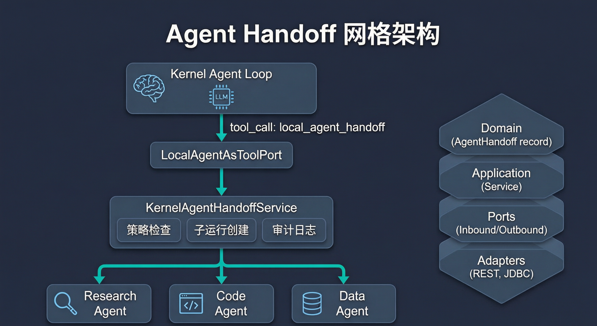
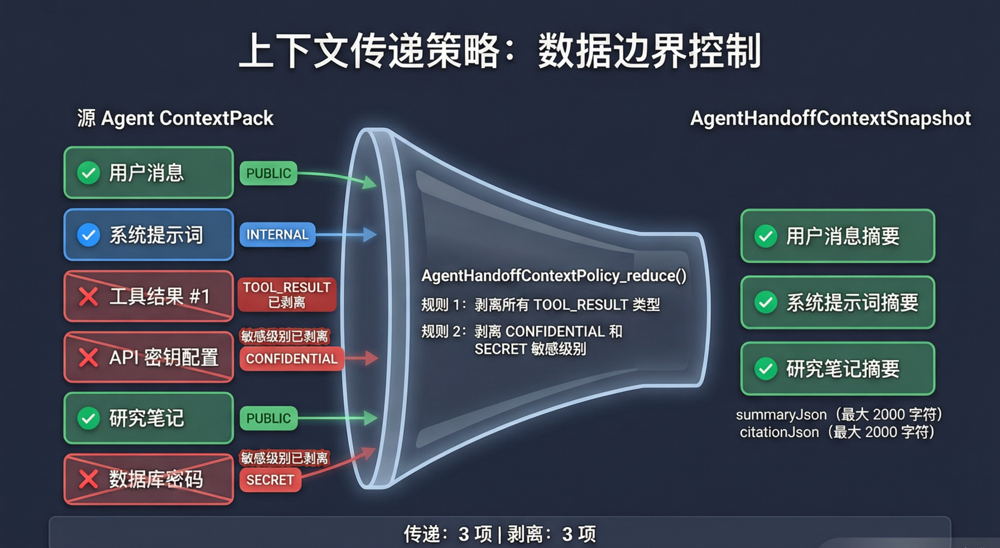
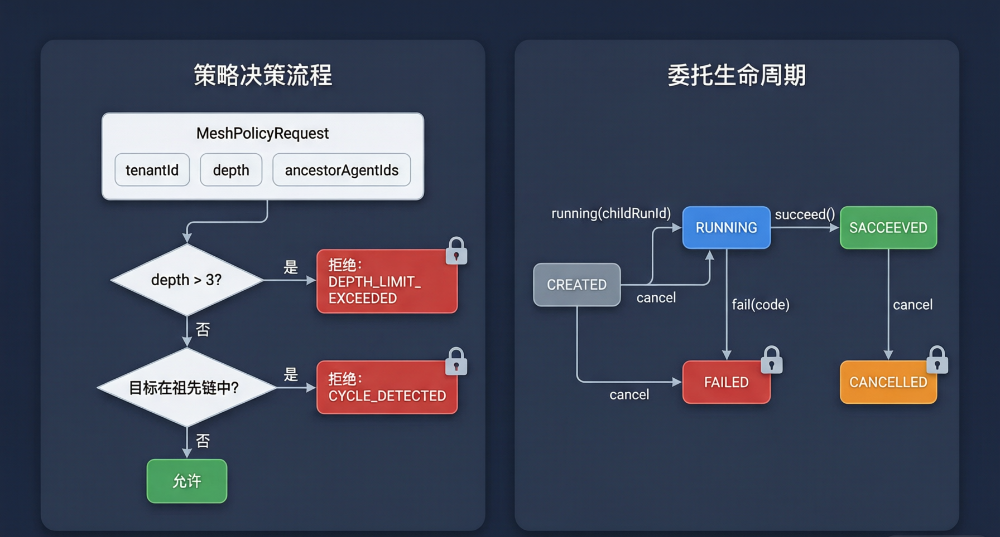
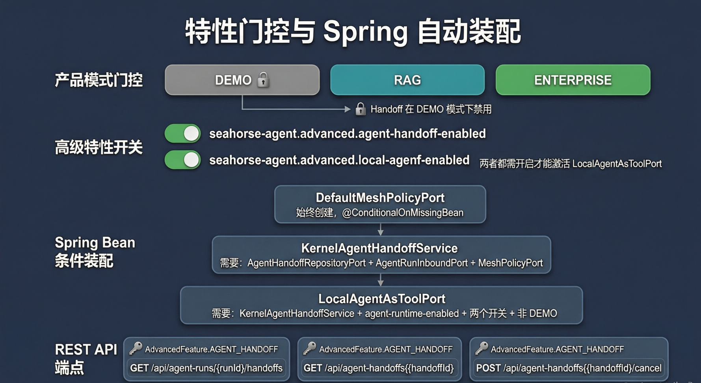

# Agent Handoff 网格：策略驱动的多智能体委托

> **导读**｜当一个 Agent 遇到超出自身能力范围的任务时，它应该怎么做？Seahorse Agent 没有选择"硬扛"或"返回错误"，而是构建了一套**策略驱动的多智能体委托系统**——Agent Handoff 网格。LLM 可以通过调用 `local_agent_handoff` 工具将工作委托给另一个 Agent，而网格策略（Mesh Policy）在每次委托前执行深度限制和循环检测，确保委托链不会无限递归。同时，上下文传递策略（Context Transfer Policy）严格控制敏感数据在 Agent 间的流动，防止密钥、密码等机密信息泄露。本文将从架构设计、策略引擎、上下文边界、生命周期管理、特性门控五个维度拆解这套"给 LLM 委托自由，但用策略兜底"的工程实现。

---

## 一、为什么需要 Agent Handoff？

### 1.1 单 Agent 的能力边界

在 Seahorse Agent 的设计中，每个 Agent 都有明确的职责边界——Research Agent 擅长信息检索和综合分析，Code Agent 擅长代码生成和调试，Data Agent 擅长数据查询和可视化。当 Research Agent 在分析过程中需要执行一段代码来验证假设时，它有两个选择：

- **硬扛**：自己尝试生成代码并执行。代价是可能写出低质量代码，或者因为缺乏代码执行工具而失败。
- **委托**：把代码生成任务交给 Code Agent。代价是需要一套安全的委托机制。

Seahorse Agent 选择了后者，但加上了**策略约束**——不是任意 Agent 都能随意委托给任意 Agent，每次委托都要经过网格策略的审查。

### 1.2 架构总览



整个 Handoff 系统遵循**六边形架构（Ports & Adapters）**，分为四层：

- **Domain 层**：`AgentHandoff` 是不可变记录（record），持有委托的完整状态。`MeshPolicyRequest` 和 `MeshPolicyDecision` 定义了策略的输入输出契约。
- **Application 层**：`KernelAgentHandoffService` 是核心编排器，协调策略检查、子运行创建和审计日志。`DefaultMeshPolicyPort` 是默认策略实现。
- **Ports 层**：`AgentHandoffInboundPort` 定义入站用例接口，`AgentHandoffRepositoryPort` 和 `MeshPolicyPort` 定义出站基础设施依赖。
- **Adapters 层**：`SeahorseAgentHandoffController` 提供 REST API，`JdbcAgentHandoffRepositoryAdapter` 提供 PostgreSQL 持久化，`LocalAgentAsToolPort` 将委托暴露为 LLM 可调用的工具。

> **💡 设计哲学**
>
> Handoff 被设计为一个**工具**而非独立的编排层。这意味着 LLM 像调用其他工具一样调用 `local_agent_handoff`——它拥有委托的自主权，但每次委托都要经过策略审查。这种设计让 LLM 成为"有判断力的委托者"而非"被动的执行者"。

---

## 二、策略引擎：Mesh Policy 的两道防线

### 2.1 MeshPolicyPort 接口

```java
public interface MeshPolicyPort {
    MeshPolicyDecision decide(MeshPolicyRequest request);
}
```

`MeshPolicyPort` 是整个 Handoff 系统的**策略扩展点**。任何实现该接口的 Bean 都可以替换默认策略，加入自定义的授权矩阵、团队 DAG 关系、租户特定规则等。

`MeshPolicyRequest` 携带了策略决策所需的全部上下文：

| 字段 | 类型 | 说明 |
|------|------|------|
| `tenantId` | String | 租户标识，默认 `DEFAULT_TENANT_ID` |
| `parentRunId` | String | 父运行 ID，用于追溯委托链 |
| `sourceAgentId` | String | 发起委托的 Agent |
| `targetAgentId` | String | 被委托的目标 Agent |
| `depth` | int | 当前委托深度（从 0 开始） |
| `ancestorAgentIds` | List\<String\> | 委托链上的所有祖先 Agent ID |

`MeshPolicyDecision` 是一个简单的允许/拒绝记录：

```java
public record MeshPolicyDecision(boolean allowed,
                                 AgentHandoffFailureCode failureCode,
                                 String reasonMessage) {
    public static MeshPolicyDecision allow() { ... }
    public static MeshPolicyDecision deny(AgentHandoffFailureCode failureCode, String reasonMessage) { ... }
}
```

### 2.2 DefaultMeshPolicyPort：两道防线

默认策略实现 `DefaultMeshPolicyPort` 只检查两件事：

```java
public class DefaultMeshPolicyPort implements MeshPolicyPort {

    @Override
    public MeshPolicyDecision decide(MeshPolicyRequest request) {
        // 防线 1：深度限制
        if (request.depth() > AgentHandoffLimits.MAX_LOCAL_HANDOFF_DEPTH) {
            return MeshPolicyDecision.deny(
                    AgentHandoffFailureCode.DEPTH_LIMIT_EXCEEDED,
                    "Local handoff depth exceeded");
        }
        // 防线 2：循环检测
        if (request.ancestorAgentIds().contains(request.targetAgentId())) {
            return MeshPolicyDecision.deny(
                    AgentHandoffFailureCode.CYCLE_DETECTED,
                    "Local handoff cycle detected");
        }
        return MeshPolicyDecision.allow();
    }
}
```

**防线 1：深度限制（MAX_LOCAL_HANDOFF_DEPTH = 3）**

委托链的最大深度为 3。这意味着：Agent A → Agent B → Agent C → Agent D 是允许的（depth=3），但 Agent A → B → C → D → E 会被拒绝（depth=4）。这个限制防止了委托链无限增长导致的资源耗尽。

**防线 2：循环检测**

如果目标 Agent 已经在祖先链中出现过，委托被拒绝。这防止了 A → B → A 这样的循环委托——两个 Agent 互相踢皮球，永远无法完成任务。

### 2.3 策略扩展的可能性

`MeshPolicyPort` 的设计允许替换为更丰富的策略实现：

- **授权矩阵**：检查 sourceAgent 是否有权委托给 targetAgent（比如 Code Agent 不能委托给 Admin Agent）。
- **团队 DAG**：基于团队有向无环图判断委托方向是否合法。
- **租户规则**：不同租户有不同的委托策略（比如租户 A 允许深度 5，租户 B 只允许深度 2）。
- **目标 Agent 状态**：检查目标 Agent 是否处于启用状态。

这些扩展只需实现 `MeshPolicyPort` 接口并注册为 Spring Bean（`@ConditionalOnMissingBean` 确保自定义实现优先于默认实现）。

> **💡 设计哲学**
>
> 策略引擎的核心是**"默认安全，按需扩展"**。默认策略只检查深度和循环——这是防止系统崩溃的最低要求。但策略接口是开放的，允许部署环境根据业务需求加入更细粒度的控制。`@ConditionalOnMissingBean` 确保了自定义策略可以无缝替换默认策略，无需修改任何现有代码。

---

## 三、上下文边界：数据不越界

### 3.1 为什么需要上下文传递策略？

当 Agent A 委托给 Agent B 时，A 的上下文（ContextPack）中可能包含敏感信息——API 密钥、数据库密码、内部配置等。如果这些信息被完整传递给 B，就形成了数据泄露风险。

`AgentHandoffContextPolicy` 就是解决这个问题的**数据边界控制器**。

### 3.2 传递规则



`AgentHandoffContextPolicy.reduce()` 方法对 ContextPack 中的每个 ContextItem 执行两个过滤规则：

**规则 1：剥离所有 TOOL_RESULT 类型的上下文项。** 工具调用结果通常包含大量原始数据（API 响应、文件内容等），这些信息对目标 Agent 没有直接价值，反而可能泄露敏感数据。

**规则 2：剥离 CONFIDENTIAL 和 SECRET 敏感级别的上下文项。** 只有 PUBLIC 和 INTERNAL 级别的上下文项可以被传递。

```java
private boolean canTransfer(ContextItem item) {
    if (item.sourceType() == ContextItemSourceType.TOOL_RESULT) {
        return false;  // 工具结果一律剥离
    }
    return item.sensitivity() == ContextSensitivity.PUBLIC
            || item.sensitivity() == ContextSensitivity.INTERNAL;
}
```

### 3.3 上下文快照

过滤后的上下文被封装为 `AgentHandoffContextSnapshot`：

```java
public record AgentHandoffContextSnapshot(
    String summaryJson,      // 摘要 JSON（最大 2000 字符）
    String citationJson,     // 引用元数据 JSON（最大 2000 字符）
    int transferredItemCount, // 传递的上下文项数量
    int strippedItemCount     // 被剥离的上下文项数量
)
```

`summaryJson` 包含每个传递项的 itemId、sourceType 和 summary（截断至 2000 字符）。`citationJson` 包含每个传递项的引用元数据。两个 JSON 字段都有长度上限，防止上下文爆炸。

### 3.4 限制常量

```java
public final class AgentHandoffLimits {
    public static final int MAX_LOCAL_HANDOFF_DEPTH = 3;       // 最大委托深度
    public static final int INPUT_SUMMARY_MAX_LENGTH = 1000;   // 输入摘要最大长度
    public static final int CONTEXT_SUMMARY_MAX_LENGTH = 2000; // 上下文摘要最大长度
}
```

这三个常量定义了 Handoff 系统的资源边界。`INPUT_SUMMARY_MAX_LENGTH` 限制传递给子 Agent 的任务描述长度，`CONTEXT_SUMMARY_MAX_LENGTH` 限制上下文摘要长度。

> **💡 设计哲学**
>
> 上下文传递策略遵循**"最小必要原则"**——只传递目标 Agent 完成任务所需的最少信息。工具结果被剥离（因为子 Agent 会自己调用工具），敏感信息被剥离（因为子 Agent 不需要知道父 Agent 的密钥）。这形成了一个**数据防火墙**：Agent 间的委托是"任务委托"而非"上下文复制"。

---

## 四、生命周期管理：不可变的委托记录

### 4.1 AgentHandoff 状态机



`AgentHandoff` 是一个不可变的 Java record，拥有五个状态：

| 状态 | 说明 | 是否终态 |
|------|------|---------|
| `CREATED` | 委托已创建，等待策略决策 | 否 |
| `RUNNING` | 策略通过，子 Agent 运行中（必须有 childRunId） | 否 |
| `SUCCEEDED` | 子 Agent 成功完成 | 是 |
| `FAILED` | 委托失败（携带 failureCode） | 是 |
| `CANCELLED` | 委托被取消 | 是 |

### 4.2 不可变状态转换

每个状态转换方法返回一个新的 `AgentHandoff` 实例，而非修改当前实例：

```java
public AgentHandoff running(String nextChildRunId, Instant now) {
    if (status.isTerminal()) return this;  // 终态不可转换
    return withStatus(AgentHandoffStatus.RUNNING, null, nextChildRunId, now, null);
}

public AgentHandoff succeed(Instant now) {
    if (status.isTerminal()) return this;
    return withStatus(AgentHandoffStatus.SUCCEEDED, null, childRunId, now, now);
}

public AgentHandoff fail(AgentHandoffFailureCode nextFailureCode, Instant now) {
    if (status.isTerminal()) return this;
    return withStatus(AgentHandoffStatus.FAILED,
            Objects.requireNonNullElse(nextFailureCode, AgentHandoffFailureCode.CHILD_RUN_FAILED),
            childRunId, now, now);
}
```

关键设计：**终态保护**。一旦 Handoff 进入 SUCCEEDED、FAILED 或 CANCELLED 状态，所有后续转换尝试都返回 `this`（自身），不做任何改变。这在并发场景下提供了额外的安全保障。

### 4.3 构造函数不变量

`AgentHandoff` 的紧凑构造函数（compact constructor）强制执行以下不变量：

- `handoffId`、`parentRunId`、`sourceAgentId`、`targetAgentId` 不能为空。
- `RUNNING` 状态必须有非空的 `childRunId`。
- `FAILED` 状态的 `failureCode` 默认为 `CHILD_RUN_FAILED`。
- JSON 字段（`inputSummaryJson`、`contextSummaryJson`）默认为 `{}`。

### 4.4 失败码体系

```java
public enum AgentHandoffFailureCode {
    DEPTH_LIMIT_EXCEEDED,   // 委托深度超过限制
    CYCLE_DETECTED,         // 检测到循环委托
    POLICY_DENIED,          // 自定义策略拒绝
    TARGET_DISABLED,        // 目标 Agent 未启用
    CONTEXT_DENIED,         // 上下文传递被拒绝
    CHILD_RUN_FAILED        // 子 Agent 运行失败（默认）
}
```

六个失败码覆盖了 Handoff 可能失败的所有场景。前两个由 `DefaultMeshPolicyPort` 产生，后四个预留给了更丰富的策略实现和运行时错误。

### 4.5 完整委托流程

`KernelAgentHandoffService.createLocalHandoff()` 是核心编排方法，完整流程如下：

1. **构造策略请求**：从 `AgentHandoffCreateCommand` 提取参数，构建 `MeshPolicyRequest`。
2. **策略决策**：调用 `meshPolicyPort.decide(request)`。
3. **创建委托记录**：生成 `handoff_` 前缀的雪花 ID，创建 `CREATED` 状态的 `AgentHandoff`。
4. **策略拒绝路径**：如果策略拒绝，立即将 Handoff 转为 `FAILED`，保存并记录审计事件（CREATED + FINISHED）。
5. **策略允许路径**：调用 `runPort.startRun()` 创建子 Agent 运行（`triggerType = A2A`），将 Handoff 转为 `RUNNING`，保存并记录 CREATED 审计事件。

```java
// 核心流程（简化）
MeshPolicyDecision decision = meshPolicyPort.decide(request);
AgentHandoff created = new AgentHandoff(nextHandoffId(), ...);

if (!decision.allowed()) {
    // 策略拒绝：立即失败
    AgentHandoff failed = handoffRepository.save(created.fail(decision.failureCode(), now));
    appendCreatedAudit(failed);
    appendFinishedAudit(failed);
    return failed;
}

// 策略允许：创建子运行
AgentRun childRun = runPort.startRun(new AgentRunStartCommand(
    targetAgentId, targetVersionId, tenantId, parentRunId,
    AgentRunTriggerType.A2A, inputSummary, traceId));
AgentHandoff running = handoffRepository.save(created.running(childRun.runId(), now));
appendCreatedAudit(running);
return running;
```

> **💡 设计哲学**
>
> 生命周期管理的核心是**"不可变 + 终态保护"**。`AgentHandoff` 是不可变 record，每次状态转换产生新实例。终态（SUCCEEDED/FAILED/CANCELLED）一旦进入就不可逆转——即使代码错误地调用了 `succeed()` 或 `fail()`，也会被静默忽略。这在分布式系统中尤为重要：网络重试、并发操作等场景下，不可变模型避免了状态被意外覆盖的风险。

---

## 五、工具化委托：LLM 的自主委托权

### 5.1 LocalAgentAsToolPort

`LocalAgentAsToolPort` 将 Handoff 能力暴露为 LLM 可调用的工具：

```java
public class LocalAgentAsToolPort implements DescribedToolPort {
    public static final String TOOL_ID = "local_agent_handoff";

    @Override
    public ToolDescriptor descriptor() {
        return new ToolDescriptor(TOOL_ID, "Local Agent Handoff",
                "Delegate a governed local child Agent run.", TOOL_SCHEMA);
    }

    @Override
    public ToolInvocationResult invoke(String toolCallId, String toolId, Map<String, Object> arguments) {
        if (!TOOL_ID.equals(toolId)) {
            return ToolInvocationResult.failed("LOCAL_AGENT_TOOL_ID_MISMATCH");
        }
        AgentHandoff handoff = handoffService.createLocalHandoff(new AgentHandoffCreateCommand(...));
        return ToolInvocationResult.ok(
            "{\"handoffId\":\"" + handoff.handoffId()
            + "\",\"childRunId\":\"" + handoff.childRunId()
            + "\",\"status\":\"" + handoff.status().name() + "\"}");
    }
}
```

工具 Schema 定义了 LLM 需要提供的参数：

```json
{
  "type": "object",
  "properties": {
    "tenantId": {"type": "string"},
    "parentRunId": {"type": "string"},
    "sourceAgentId": {"type": "string"},
    "targetAgentId": {"type": "string"},
    "targetVersionId": {"type": "string"},
    "handoffReason": {"type": "string"},
    "inputSummary": {"type": "string"},
    "contextSummaryJson": {"type": "string"},
    "depth": {"type": "integer"},
    "ancestorAgentIds": {"type": "array", "items": {"type": "string"}}
  },
  "required": ["parentRunId", "sourceAgentId", "targetAgentId", "inputSummary"]
}
```

四个必填参数（`parentRunId`、`sourceAgentId`、`targetAgentId`、`inputSummary`）是委托的最小信息集。可选参数（`depth`、`ancestorAgentIds`）用于策略决策，`handoffReason` 用于审计追溯。

### 5.2 工具注册机制

`LocalAgentAsToolPort` 通过 `BuiltInAgentToolRegistrar` 注册到 `InMemoryToolRegistry`，与所有其他工具（搜索、代码执行、文件操作等）并列。这意味着 LLM 在决策时，`local_agent_handoff` 和其他工具具有同等的可见性——LLM 可以根据任务需求自主决定是调用搜索工具还是委托给另一个 Agent。

### 5.3 子运行的触发类型

子 Agent 运行使用 `AgentRunTriggerType.A2A`（Agent-to-Agent）触发类型，区别于 `CHAT`（用户对话触发）、`API`（API 调用触发）、`SCHEDULE`（定时触发）和 `EVENT`（事件触发）。这使得在审计和监控中可以清晰区分"用户发起的运行"和"Agent 间委托产生的运行"。

子运行的 `conversationId` 被设置为父运行的 `runId`，形成了可追溯的委托链。

> **💡 设计哲学**
>
> 将 Handoff 设计为工具而非特殊协议，是**"一致性优于特殊性"**的体现。LLM 不需要学习新的委托语法——它只需要像调用其他工具一样调用 `local_agent_handoff`。这降低了 LLM 的使用门槛，也让工具注册、审计、监控等基础设施可以复用现有机制。

---

## 六、特性门控与 Spring 自动装配

### 6.1 多层门控体系



Handoff 功能的启用需要经过四层门控：

**第一层：Product Mode Gate**

`AdvancedFeatureGate` 检查当前产品模式。在 DEMO 模式下，`AGENT_HANDOFF` 不是核心功能（`isDemoCoreFeature` 返回 false），因此默认禁用。只有在 RAG 或 ENTERPRISE 模式下才可能启用。

**第二层：Advanced Feature Flags**

两个独立的配置属性必须同时为 `true`：

- `seahorse-agent.advanced.agent-handoff-enabled`：启用 Handoff REST API。
- `seahorse-agent.advanced.local-agent-enabled`：启用 LocalAgentAsToolPort（LLM 可调用的委托工具）。

**第三层：Spring Bean Conditions**

Bean 的创建遵循依赖链：

- `DefaultMeshPolicyPort`：始终创建（`@ConditionalOnMissingBean`），无外部依赖。
- `KernelAgentHandoffService`：需要 `AgentHandoffRepositoryPort` + `AgentRunInboundPort` + `MeshPolicyPort` 三个 Bean 都存在。
- `LocalAgentAsToolPort`：需要 `KernelAgentHandoffService` + Agent 运行时启用 + 两个 Feature Flag 都为 true + 非 DEMO 模式。

**第四层：REST API 门控**

所有三个 REST 端点（查询、详情、取消）在执行前都调用 `advancedFeatureGate.requireEnabled(AdvancedFeature.AGENT_HANDOFF)`，未启用时抛出 `AdvancedFeatureDisabledException`。

### 6.2 Spring 自动装配

```java
// Registry 配置：策略和服务
@Bean
@ConditionalOnMissingBean(MeshPolicyPort.class)
public DefaultMeshPolicyPort seahorseMeshPolicyPort() {
    return new DefaultMeshPolicyPort();
}

@Bean
@ConditionalOnBean({AgentHandoffRepositoryPort.class, AgentRunInboundPort.class, MeshPolicyPort.class})
@ConditionalOnMissingBean(AgentHandoffInboundPort.class)
public KernelAgentHandoffService seahorseAgentHandoffInboundPort(
        AgentHandoffRepositoryPort agentHandoffRepositoryPort,
        AgentRunInboundPort agentRunInboundPort,
        MeshPolicyPort meshPolicyPort,
        ObjectProvider<KernelAuditLedgerService> auditLedgerService,
        ObjectProvider<Clock> clockProvider) {
    return new KernelAgentHandoffService(
            agentHandoffRepositoryPort, agentRunInboundPort,
            meshPolicyPort, auditLedgerService.getIfAvailable(),
            clockProvider.getIfAvailable(Clock::systemUTC));
}

// Agent 配置：工具注册
@Bean
@ConditionalOnAgentRuntimeEnabled
@Conditional(AdvancedLocalAgentToolEnabledCondition.class)
@ConditionalOnBean(KernelAgentHandoffService.class)
@ConditionalOnMissingBean
public LocalAgentAsToolPort seahorseLocalAgentAsToolPort(KernelAgentHandoffService handoffService) {
    return new LocalAgentAsToolPort(handoffService);
}
```

`AdvancedLocalAgentToolEnabledCondition` 是一个自定义 Spring Condition，同时检查三个条件：非 DEMO 模式、`agent-handoff-enabled=true`、`local-agent-enabled=true`。

### 6.3 REST API

| 方法 | 路径 | 说明 |
|------|------|------|
| GET | `/api/agent-runs/{runId}/handoffs?tenantId=` | 列出父运行的所有委托 |
| GET | `/api/agent-handoffs/{handoffId}` | 查询单个委托详情 |
| POST | `/api/agent-handoffs/{handoffId}/cancel` | 取消委托（同时取消子运行） |

所有端点返回 `AgentHandoffResponse`，包含 handoffId、状态、失败码、时间戳等字段。

### 6.4 持久化

`JdbcAgentHandoffRepositoryAdapter` 提供 PostgreSQL 持久化，表名为 `sa_agent_handoff`。关键设计：

- **终端状态守卫**：`update()` 方法拒绝更新已处于终态的 Handoff 记录——即使应用层代码错误地尝试更新，数据库层也会保护数据一致性。
- **索引设计**：`(tenant_id, parent_run_id, created_at)` 复合索引支持按父运行查询，`(child_run_id)` 索引支持子运行关联查询。
- **save vs update**：`save()` 方法先检查记录是否存在，存在则走 `update()`，不存在则走 `insert()`——实现了 upsert 语义。

### 6.5 审计日志

每次 Handoff 生命周期事件都通过 `KernelAuditLedgerService` 记录：

- **AGENT_HANDOFF_CREATED**：记录 handoffId、parentRunId、childRunId、sourceAgentId、targetAgentId、状态、inputSummary 长度、contextSummary 长度。
- **AGENT_HANDOFF_FINISHED**：记录 handoffId、childRunId、状态、failureCode。

审计 payload 中**不包含原始输入内容**——只记录长度和元数据。这遵循了 `AuditRedactionPolicy` 的脱敏规则，防止敏感信息通过审计日志泄露。

> **💡 设计哲学**
>
> 特性门控遵循**"渐进式启用"**原则。Handoff 功能不是简单的"开/关"——它有四层门控，每一层都可以独立控制。这意味着部署环境可以灵活配置：在 DEMO 模式下完全禁用，在测试环境中通过 `allEnabledForTests()` 全部启用，在生产环境中按租户和场景精细控制。Spring 的条件装配确保了"不需要的 Bean 不会被创建"，避免了资源浪费。

---

## 七、防御性设计：六重安全网

### 7.1 终态不可变性

`AgentHandoff` 的每个状态转换方法都检查 `status.isTerminal()`，终态下返回 `this` 不做任何改变。这防止了并发场景下的状态覆盖。

### 7.2 仓库层终端守卫

`JdbcAgentHandoffRepositoryAdapter.update()` 在更新前检查现有记录的状态，如果已处于终态则直接返回现有记录，不执行 SQL UPDATE。这是**数据库层的最后一道防线**。

### 7.3 幂等取消

`cancel()` 方法检查当前状态，如果已处于终态则直接返回，不做任何操作。这意味着多次调用 `cancel()` 是安全的——不会产生副作用。

### 7.4 工具 ID 校验

`LocalAgentAsToolPort.invoke()` 首先检查 `toolId` 是否匹配 `local_agent_handoff`，不匹配则返回 `TOOL_ID_MISMATCH` 错误。这防止了工具路由错误导致的意外调用。

### 7.5 异常捕获

`LocalAgentAsToolPort.invoke()` 的整个调用链被 `try-catch` 包裹，任何 `RuntimeException` 都被捕获并转化为 `ToolInvocationResult.failed()`。这保证了 Handoff 工具的异常不会传播到 Agent 循环中导致整个运行崩溃。

### 7.6 审计脱敏

审计 payload 中只包含元数据（ID、状态、长度），不包含原始输入内容。`AuditRedactionPolicy` 确保敏感信息不会通过审计日志泄露。

### 7.7 失败码枚举

```java
public enum AgentHandoffFailureCode {
    DEPTH_LIMIT_EXCEEDED,   // 深度超限
    CYCLE_DETECTED,         // 循环检测
    POLICY_DENIED,          // 策略拒绝
    TARGET_DISABLED,        // 目标未启用
    CONTEXT_DENIED,         // 上下文拒绝
    CHILD_RUN_FAILED        // 子运行失败（默认）
}
```

六个失败码覆盖了所有已知失败场景，每个失败码都有明确的语义，便于监控和告警。

> ** 设计哲学**
>
> 防御性设计的核心是**"纵深防御"**——不依赖单一防线，而是在应用层、仓库层、工具层、审计层都设置检查点。即使某一层失效，其他层仍然能保护系统。终态不可变性 + 仓库层守卫 + 幂等取消形成了"三重终态保护"，确保 Handoff 记录一旦完成就不会被意外修改。

---

## 总结

Seahorse Agent 的 Handoff 网格围绕六个核心设计决策构建：

**1. 工具化委托。** Handoff 被设计为 LLM 可调用的工具（`local_agent_handoff`），而非独立的编排协议。LLM 拥有委托的自主权，但每次委托都要经过策略审查。子运行使用 `A2A` 触发类型，与父运行形成可追溯的委托链。

**2. 策略驱动的网格治理。** `MeshPolicyPort` 是策略扩展点，默认实现检查深度限制（max 3）和循环检测。自定义策略可以加入授权矩阵、团队 DAG、租户规则等。`@ConditionalOnMissingBean` 确保自定义策略无缝替换默认策略。

**3. 上下文数据边界。** `AgentHandoffContextPolicy` 剥离 TOOL_RESULT 类型和 CONFIDENTIAL/SECRET 敏感级别的上下文项，只传递 PUBLIC 和 INTERNAL 级别的摘要。summaryJson 和 citationJson 各有 2000 字符上限，防止上下文爆炸。

**4. 不可变生命周期。** `AgentHandoff` 是不可变 record，状态转换产生新实例。终态（SUCCEEDED/FAILED/CANCELLED）不可逆转。仓库层提供额外的终端守卫，形成"三重终态保护"。

**5. 四层特性门控。** Product Mode → Feature Flags → Spring Bean Conditions → REST API Gate，每一层独立控制。DEMO 模式下默认禁用，测试环境可全部启用，生产环境按场景精细控制。

**6. 纵深防御。** 终态不可变性 + 仓库层守卫 + 幂等取消 + 工具 ID 校验 + 异常捕获 + 审计脱敏，六重安全网确保 Handoff 系统的健壮性。六个失败码覆盖所有已知失败场景。

这套系统的核心价值在于：**给 LLM 委托的自由，但用策略兜底安全**。LLM 可以自主决定何时委托、委托给谁，但网格策略确保委托链不会失控，上下文策略确保敏感数据不会泄露，生命周期管理确保委托记录不可篡改。这正是企业级多智能体系统从"能工作"走向"可信赖"的关键一步。

---

*本文基于 [Seahorse Agent](https://github.com/your-repo/seahorse-agent) 项目源码分析。*
