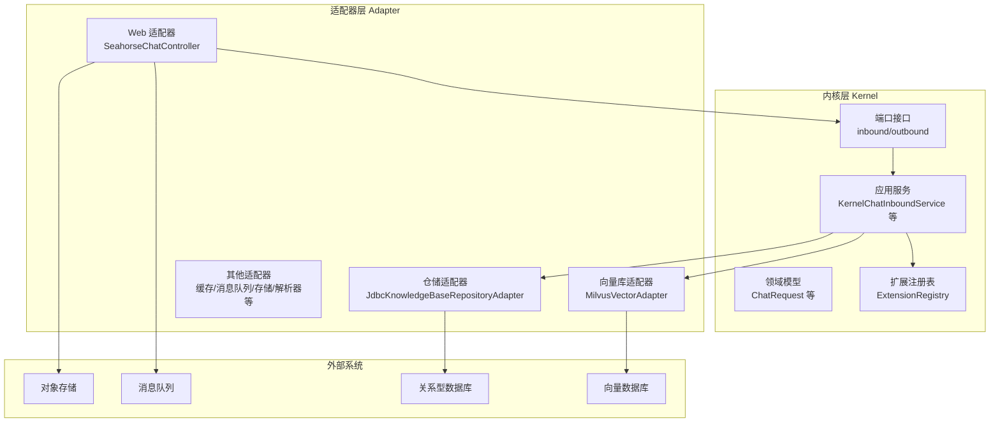
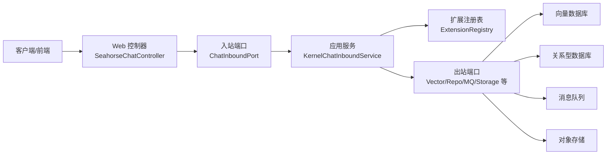
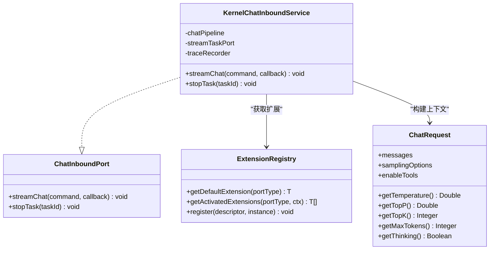
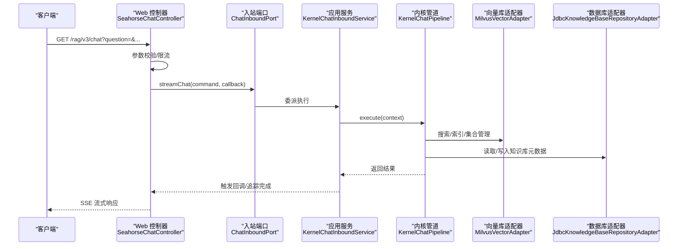
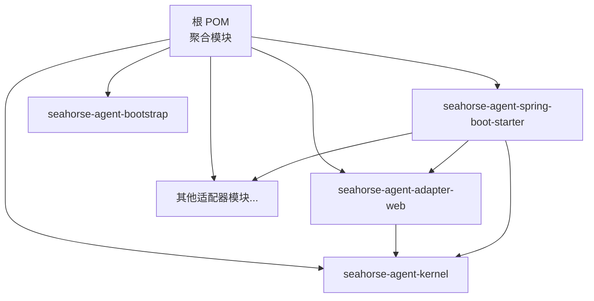

# Clean Architecture 模式

<cite>
**本文引用的文件**
- [pom.xml](file://pom.xml)
- [seahorse-agent-kernel/pom.xml](file://seahorse-agent-kernel/pom.xml)
- [seahorse-agent-adapter-web/pom.xml](file://seahorse-agent-adapter-web/pom.xml)
- [seahorse-agent-spring-boot-starter/pom.xml](file://seahorse-agent-spring-boot-starter/pom.xml)
- [SeahorseAgentApplication.java](file://seahorse-agent-bootstrap/src/main/java/com/miracle/ai/seahorse/agent/SeahorseAgentApplication.java)
- [KernelChatInboundService.java](file://seahorse-agent-kernel/src/main/java/com/miracle/ai/seahorse/agent/kernel/application/chat/KernelChatInboundService.java)
- [ChatInboundPort.java](file://seahorse-agent-kernel/src/main/java/com/miracle/ai/seahorse/agent/ports/inbound/chat/ChatInboundPort.java)
- [ChatRequest.java](file://seahorse-agent-kernel/src/main/java/com/miracle/ai/seahorse/agent/kernel/domain/chat/ChatRequest.java)
- [KnowledgeBaseRepositoryPort.java](file://seahorse-agent-kernel/src/main/java/com/miracle/ai/seahorse/agent/ports/outbound/knowledge/KnowledgeBaseRepositoryPort.java)
- [SeahorseChatController.java](file://seahorse-agent-adapter-web/src/main/java/com/miracle/ai/seahorse/agent/adapters/web/SeahorseChatController.java)
- [MilvusVectorAdapter.java](file://seahorse-agent-adapter-vector-milvus/src/main/java/com/miracle/ai/seahorse/agent/adapters/vector/milvus/MilvusVectorAdapter.java)
- [JdbcKnowledgeBaseRepositoryAdapter.java](file://seahorse-agent-adapter-repository-jdbc/src/main/java/com/miracle/ai/seahorse/agent/adapters/repository/jdbc/JdbcKnowledgeBaseRepositoryAdapter.java)
- [SeahorseAgentKernelAutoConfiguration.java](file://seahorse-agent-spring-boot-autoconfigure/src/main/java/com/miracle/ai/seahorse/agent/adapters/spring/SeahorseAgentKernelAutoConfiguration.java)
- [ExtensionRegistry.java](file://seahorse-agent-kernel/src/main/java/com/miracle/ai/seahorse/agent/kernel/plugin/ExtensionRegistry.java)
</cite>

## 目录
1. [简介](#简介)
2. [项目结构](#项目结构)
3. [核心组件](#核心组件)
4. [架构总览](#架构总览)
5. [详细组件分析](#详细组件分析)
6. [依赖分析](#依赖分析)
7. [性能考虑](#性能考虑)
8. [故障排查指南](#故障排查指南)
9. [结论](#结论)

## 简介
本文件面向 Seahorse Agent 的 Clean Architecture 实践，系统化阐述其分层架构、依赖倒置原则、内核层（Kernel Layer）业务编排、适配器层（Adapter Layer）对外交互以及外部系统层（External Systems）边界。文档以代码为依据，结合架构图与序列图，帮助读者理解从 Web 请求到下游数据库、向量库、消息队列、对象存储等系统的完整数据流与控制流，并总结该架构在可测试性、可维护性与可扩展性方面的优势。

## 项目结构
Seahorse Agent 采用多模块 Maven 结构，核心模块包括：
- seahorse-agent-kernel：内核层，定义端口接口、领域模型与应用服务，不依赖任何外部框架或实现。
- seahorse-agent-adapter-*：适配器层，实现各类端口接口，连接外部系统（Web、缓存、消息队列、向量库、存储、解析器、Feishu 文档源等）。
- seahorse-agent-spring-boot-starter：Spring Boot 自动装配模块，负责在运行时装配内核与适配器，形成可独立运行的微内核。
- seahorse-agent-bootstrap：Spring Boot 启动入口，限定扫描包范围，避免误扫描。

图表来源
- [SeahorseAgentApplication.java:30-36](file://seahorse-agent-bootstrap/src/main/java/com/miracle/ai/seahorse/agent/SeahorseAgentApplication.java#L30-L36)
- [KernelChatInboundService.java:34-94](file://seahorse-agent-kernel/src/main/java/com/miracle/ai/seahorse/agent/kernel/application/chat/KernelChatInboundService.java#L34-L94)
- [SeahorseChatController.java:43-133](file://seahorse-agent-adapter-web/src/main/java/com/miracle/ai/seahorse/agent/adapters/web/SeahorseChatController.java#L43-L133)
- [MilvusVectorAdapter.java:56-319](file://seahorse-agent-adapter-vector-milvus/src/main/java/com/miracle/ai/seahorse/agent/adapters/vector/milvus/MilvusVectorAdapter.java#L56-L319)
- [JdbcKnowledgeBaseRepositoryAdapter.java:40-251](file://seahorse-agent-adapter-repository-jdbc/src/main/java/com/miracle/ai/seahorse/agent/adapters/repository/jdbc/JdbcKnowledgeBaseRepositoryAdapter.java#L40-L251)

章节来源
- [pom.xml:37-60](file://pom.xml#L37-L60)
- [seahorse-agent-kernel/pom.xml:1-67](file://seahorse-agent-kernel/pom.xml#L1-L67)
- [seahorse-agent-adapter-web/pom.xml:1-64](file://seahorse-agent-adapter-web/pom.xml#L1-L64)
- [seahorse-agent-spring-boot-starter/pom.xml:1-142](file://seahorse-agent-spring-boot-starter/pom.xml#L1-L142)

## 核心组件
- 内核层（Kernel Layer）
  - 端口接口：inbound 与 outbound 两大类，分别定义“入站”与“出站”契约，隔离业务规则与外部实现。
  - 领域模型：如 ChatRequest，封装对话请求的数据结构与访问器。
  - 应用服务：如 KernelChatInboundService，负责编排一次问答的控制流，调用内核管道与追踪记录。
  - 扩展注册表：ExtensionRegistry，提供基于端口类型的扩展链注册与激活机制，支持特性开关与可插拔扩展。
- 适配器层（Adapter Layer）
  - Web 适配器：SeahorseChatController，将 HTTP/SSE 协议转换为内核入站端口调用。
  - 外部系统适配器：如 MilvusVectorAdapter（向量库）、JdbcKnowledgeBaseRepositoryAdapter（数据库）等，实现对应端口接口。
- 外部系统层（External Systems）
  - 数据库：关系型数据库（示例：JDBC 适配器）。
  - 向量数据库：Milvus 等。
  - 消息队列：Pulsar、Direct 等。
  - 对象存储：S3、本地存储等。
  - 缓存与分布式协调：Redis、本地实现等。
  - 解析器与文档源：Apache Tika、Feishu 文档源等。

章节来源
- [KernelChatInboundService.java:34-94](file://seahorse-agent-kernel/src/main/java/com/miracle/ai/seahorse/agent/kernel/application/chat/KernelChatInboundService.java#L34-L94)
- [ChatInboundPort.java:22-44](file://seahorse-agent-kernel/src/main/java/com/miracle/ai/seahorse/agent/ports/inbound/chat/ChatInboundPort.java#L22-L44)
- [ChatRequest.java:27-67](file://seahorse-agent-kernel/src/main/java/com/miracle/ai/seahorse/agent/kernel/domain/chat/ChatRequest.java#L27-L67)
- [ExtensionRegistry.java:22-84](file://seahorse-agent-kernel/src/main/java/com/miracle/ai/seahorse/agent/kernel/plugin/ExtensionRegistry.java#L22-L84)
- [SeahorseChatController.java:43-133](file://seahorse-agent-adapter-web/src/main/java/com/miracle/ai/seahorse/agent/adapters/web/SeahorseChatController.java#L43-L133)
- [MilvusVectorAdapter.java:56-319](file://seahorse-agent-adapter-vector-milvus/src/main/java/com/miracle/ai/seahorse/agent/adapters/vector/milvus/MilvusVectorAdapter.java#L56-L319)
- [JdbcKnowledgeBaseRepositoryAdapter.java:40-251](file://seahorse-agent-adapter-repository-jdbc/src/main/java/com/miracle/ai/seahorse/agent/adapters/repository/jdbc/JdbcKnowledgeBaseRepositoryAdapter.java#L40-L251)

## 架构总览
Clean Architecture 在本项目中的体现：
- 层次清晰：外层适配器依赖内核端口接口；内核不依赖外部实现。
- 依赖倒置：上层模块不依赖下层模块，而是依赖抽象（端口接口）。
- 可替换性：通过实现相同端口接口即可替换任意适配器。
- 运行时装配：Spring Boot Starter 在运行时装配内核与适配器，形成统一微内核。

图表来源
- [SeahorseChatController.java:83-102](file://seahorse-agent-adapter-web/src/main/java/com/miracle/ai/seahorse/agent/adapters/web/SeahorseChatController.java#L83-L102)
- [ChatInboundPort.java:27-43](file://seahorse-agent-kernel/src/main/java/com/miracle/ai/seahorse/agent/ports/inbound/chat/ChatInboundPort.java#L27-L43)
- [KernelChatInboundService.java:56-78](file://seahorse-agent-kernel/src/main/java/com/miracle/ai/seahorse/agent/kernel/application/chat/KernelChatInboundService.java#L56-L78)
- [ExtensionRegistry.java:28-64](file://seahorse-agent-kernel/src/main/java/com/miracle/ai/seahorse/agent/kernel/plugin/ExtensionRegistry.java#L28-L64)

## 详细组件分析

### 内核层：应用服务与端口组织
- KernelChatInboundService
  - 责任：接收流式问答命令，构建上下文，交由 KernelChatPipeline 执行，并进行追踪记录与错误处理。
  - 关键点：通过构造注入 StreamTaskPort 与 KernelRagTraceRecorder，遵循依赖倒置，便于替换与测试。
- ChatInboundPort
  - 责任：定义问答入站契约，约束协议无关的业务调用。
- ChatRequest
  - 责任：封装对话请求的结构与采样参数，作为领域模型承载业务语义。
- ExtensionRegistry
  - 责任：提供扩展注册与激活能力，使内核通过端口类型而非具体实现获取扩展链，提升可插拔性与可测试性。

图表来源
- [KernelChatInboundService.java:34-94](file://seahorse-agent-kernel/src/main/java/com/miracle/ai/seahorse/agent/kernel/application/chat/KernelChatInboundService.java#L34-L94)
- [ChatInboundPort.java:27-43](file://seahorse-agent-kernel/src/main/java/com/miracle/ai/seahorse/agent/ports/inbound/chat/ChatInboundPort.java#L27-L43)
- [ChatRequest.java:30-66](file://seahorse-agent-kernel/src/main/java/com/miracle/ai/seahorse/agent/kernel/domain/chat/ChatRequest.java#L30-L66)
- [ExtensionRegistry.java:28-64](file://seahorse-agent-kernel/src/main/java/com/miracle/ai/seahorse/agent/kernel/plugin/ExtensionRegistry.java#L28-L64)

章节来源
- [KernelChatInboundService.java:34-94](file://seahorse-agent-kernel/src/main/java/com/miracle/ai/seahorse/agent/kernel/application/chat/KernelChatInboundService.java#L34-L94)
- [ChatInboundPort.java:22-44](file://seahorse-agent-kernel/src/main/java/com/miracle/ai/seahorse/agent/ports/inbound/chat/ChatInboundPort.java#L22-L44)
- [ChatRequest.java:27-67](file://seahorse-agent-kernel/src/main/java/com/miracle/ai/seahorse/agent/kernel/domain/chat/ChatRequest.java#L27-L67)
- [ExtensionRegistry.java:22-84](file://seahorse-agent-kernel/src/main/java/com/miracle/ai/seahorse/agent/kernel/plugin/ExtensionRegistry.java#L22-L84)

### 适配器层：Web 适配器与外部系统适配器
- Web 适配器（SeahorseChatController）
  - 责任：HTTP/SSE 协议转换，参数校验与限流，构造 StreamChatCommand 并调用 ChatInboundPort。
  - 关键点：通过注入 RateLimiterPort 实现可替换的限流策略；通过 ChatStreamCallbackFactoryPort 生成流式回调。
- 向量库适配器（MilvusVectorAdapter）
  - 责任：实现 VectorSearchPort/VectorIndexPort/VectorCollectionAdminPort，封装 Milvus 客户端操作。
  - 关键点：严格遵守字段约定与维度校验，提供 collection 确保、插入/更新/删除、搜索等能力。
- 仓储适配器（JdbcKnowledgeBaseRepositoryAdapter）
  - 责任：实现 KnowledgeBaseRepositoryPort，封装知识库 CRUD、分页、存在性检查等 SQL 操作。
  - 关键点：对输入参数进行校验与裁剪，防止非法值进入数据库。

图表来源
- [SeahorseChatController.java:83-102](file://seahorse-agent-adapter-web/src/main/java/com/miracle/ai/seahorse/agent/adapters/web/SeahorseChatController.java#L83-L102)
- [KernelChatInboundService.java:56-78](file://seahorse-agent-kernel/src/main/java/com/miracle/ai/seahorse/agent/kernel/application/chat/KernelChatInboundService.java#L56-L78)
- [MilvusVectorAdapter.java:76-90](file://seahorse-agent-adapter-vector-milvus/src/main/java/com/miracle/ai/seahorse/agent/adapters/vector/milvus/MilvusVectorAdapter.java#L76-L90)
- [JdbcKnowledgeBaseRepositoryAdapter.java:102-117](file://seahorse-agent-adapter-repository-jdbc/src/main/java/com/miracle/ai/seahorse/agent/adapters/repository/jdbc/JdbcKnowledgeBaseRepositoryAdapter.java#L102-L117)

章节来源
- [SeahorseChatController.java:43-133](file://seahorse-agent-adapter-web/src/main/java/com/miracle/ai/seahorse/agent/adapters/web/SeahorseChatController.java#L43-L133)
- [MilvusVectorAdapter.java:56-319](file://seahorse-agent-adapter-vector-milvus/src/main/java/com/miracle/ai/seahorse/agent/adapters/vector/milvus/MilvusVectorAdapter.java#L56-L319)
- [JdbcKnowledgeBaseRepositoryAdapter.java:40-251](file://seahorse-agent-adapter-repository-jdbc/src/main/java/com/miracle/ai/seahorse/agent/adapters/repository/jdbc/JdbcKnowledgeBaseRepositoryAdapter.java#L40-L251)

### 外部系统层边界
- 数据库：通过 JDBC 适配器实现知识库等实体的持久化，SQL 明确、参数校验严格。
- 向量数据库：通过 Milvus 适配器实现集合管理、向量索引与检索，字段与维度约束明确。
- 消息队列：通过 Pulsar/Direct 适配器实现事件发布/订阅，用于文档增量刷新等异步流程。
- 对象存储：通过 S3/本地适配器实现文档上传与归档。
- 缓存与分布式协调：通过 Redis/本地适配器实现键值缓存、发布订阅、限流、分布式锁与信号量。

章节来源
- [JdbcKnowledgeBaseRepositoryAdapter.java:40-251](file://seahorse-agent-adapter-repository-jdbc/src/main/java/com/miracle/ai/seahorse/agent/adapters/repository/jdbc/JdbcKnowledgeBaseRepositoryAdapter.java#L40-L251)
- [MilvusVectorAdapter.java:56-319](file://seahorse-agent-adapter-vector-milvus/src/main/java/com/miracle/ai/seahorse/agent/adapters/vector/milvus/MilvusVectorAdapter.java#L56-L319)

## 依赖分析
- 模块依赖
  - seahorse-agent-adapter-web 依赖 seahorse-agent-kernel。
  - seahorse-agent-spring-boot-starter 依赖内核与所有适配器模块，形成统一装配入口。
  - seahorse-agent-bootstrap 引导 Spring Boot 启动。
- 运行时装配
  - SeahorseAgentKernelAutoConfiguration 在运行时根据可用端口 Bean 装配内核应用服务与适配器，未找到实现时提供空实现（noop），保证系统可启动且具备可替换性。

图表来源
- [pom.xml:37-60](file://pom.xml#L37-L60)
- [seahorse-agent-adapter-web/pom.xml:18-32](file://seahorse-agent-adapter-web/pom.xml#L18-L32)
- [seahorse-agent-spring-boot-starter/pom.xml:18-109](file://seahorse-agent-spring-boot-starter/pom.xml#L18-L109)

章节来源
- [pom.xml:37-60](file://pom.xml#L37-L60)
- [seahorse-agent-adapter-web/pom.xml:18-32](file://seahorse-agent-adapter-web/pom.xml#L18-L32)
- [seahorse-agent-spring-boot-starter/pom.xml:18-109](file://seahorse-agent-spring-boot-starter/pom.xml#L18-L109)

## 性能考虑
- 可替换性与隔离：通过端口接口与适配器实现，可在不改动内核的情况下替换底层实现（如向量库、缓存、消息队列），便于针对不同场景选择最优实现。
- 可观测性：内核通过 KernelRagTraceRecorder 记录追踪，结合 ObservationPort 适配器，可接入 Micrometer 等监控体系。
- 并发与线程池：内核在装配时注入执行器（如检索、上下文构建、MCP 批处理等），便于控制并发度与资源占用。
- 限流与降级：Web 层通过 RateLimiterPort 实现限流，未实现时使用 noop，保证系统稳定性。

## 故障排查指南
- 端口未实现导致的异常
  - 现象：调用某端口时报未找到实现或抛出异常。
  - 排查：确认相应适配器模块是否在运行时装配，或在 Starter 中启用对应适配器。
- 向量维度不匹配
  - 现象：Milvus 适配器在索引/搜索时因维度不一致报错。
  - 排查：核对嵌入维度配置与实际向量长度，确保一致。
- 数据库约束与参数校验
  - 现象：知识库创建/更新失败或返回空结果。
  - 排查：检查输入参数是否为空或越界，查看 JDBC 适配器的参数校验逻辑。
- 追踪与可观测性
  - 现象：无法定位问题链路。
  - 排查：确认 KernelRagTraceRecorder 是否正确装配，观察追踪记录与日志。

章节来源
- [MilvusVectorAdapter.java:266-274](file://seahorse-agent-adapter-vector-milvus/src/main/java/com/miracle/ai/seahorse/agent/adapters/vector/milvus/MilvusVectorAdapter.java#L266-L274)
- [JdbcKnowledgeBaseRepositoryAdapter.java:244-249](file://seahorse-agent-adapter-repository-jdbc/src/main/java/com/miracle/ai/seahorse/agent/adapters/repository/jdbc/JdbcKnowledgeBaseRepositoryAdapter.java#L244-L249)
- [SeahorseAgentKernelAutoConfiguration.java:470-472](file://seahorse-agent-spring-boot-autoconfigure/src/main/java/com/miracle/ai/seahorse/agent/adapters/spring/SeahorseAgentKernelAutoConfiguration.java#L470-L472)

## 结论
Seahorse Agent 的 Clean Architecture 将业务规则与外部实现解耦，通过端口接口与适配器实现依赖倒置，使内核稳定、可测试、可维护，同时具备强大的可扩展性。运行时装配机制进一步提升了系统的灵活性与可插拔性。该架构在复杂的企业级 RAG 场景中，能够有效平衡功能演进与系统稳定性。