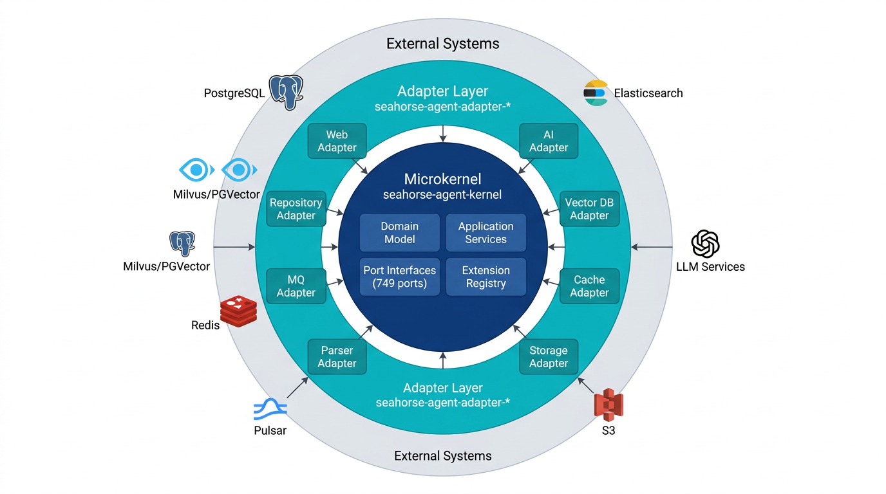
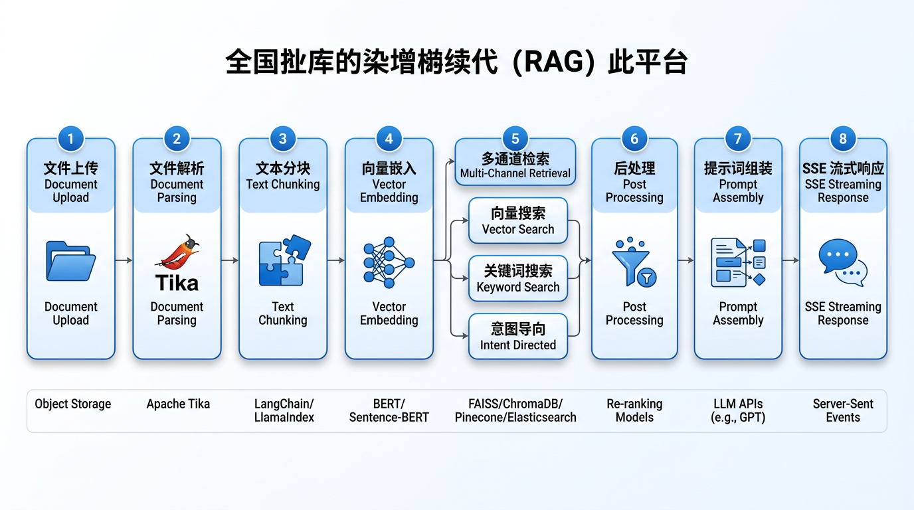
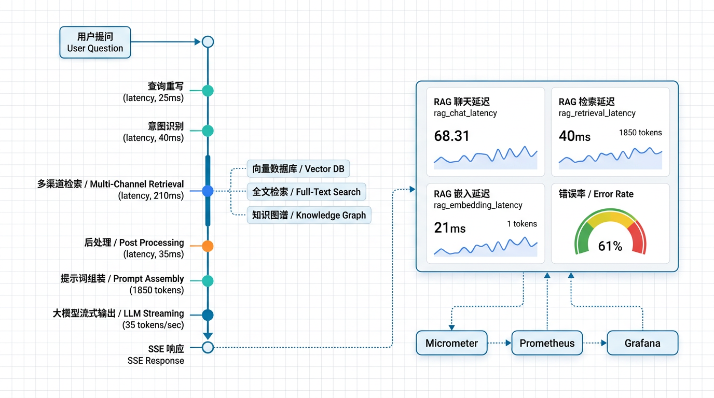

# Seahorse Agent：企业级可插拔 RAG 智能体平台的架构设计之道

> **导读**｜在大模型落地企业的过程中，团队普遍面临三个痛点：知识问答不准、智能体难维护、外部依赖绑架。Seahorse Agent 以 Clean Architecture 为骨架，以微内核 + 端口适配器为血脉，构建了一个"内核稳定、外围可换"的生产级 AI Agent 平台。本文将从架构设计、可插拔特性、RAG 可观测性和企业治理四个维度，拆解这套架构的工程实现。

---

## 📌 一、为什么需要 Clean Architecture？

想象一个场景：你的 RAG 系统深度绑定了 Milvus 向量库和 OpenAI 模型。某天，CTO 说"我们要换成 PGVector"，或者安全团队要求"模型必须部署在私有环境"。怎么办？

如果代码是"铁板一块"，换任何一个组件都意味着大面积重构。这正是 Seahorse Agent 选择 Clean Architecture 的根本原因——**让变化只发生在边界，而不是核心**。

> **💡 核心理念**
>
> "内核不依赖任何外部实现"——这不是一句口号，而是通过 749 个端口接口和严格的依赖倒置规则，在每一行代码中 enforced 的架构纪律。

---

## 📌 二、Clean Architecture 在 Seahorse Agent 中的工程实践

### 2.1 三层架构：内核 → 适配器 → 外部系统

Seahorse Agent 将系统划分为三个清晰的层次：



| 层级 | 模块 | 核心职责 |
|------|------|---------|
| **微内核层** | `seahorse-agent-kernel` | 领域模型、端口接口、应用服务、入库引擎、检索引擎、对话流水线、插件扩展 |
| **适配器层** | `seahorse-agent-adapter-*` | Web 控制器、AI 模型、向量库、缓存、消息队列、存储、解析器、仓储、可观测等外部实现 |
| **外部系统层** | PostgreSQL / Milvus / Redis / Pulsar / S3 / LLM | 实际的基础设施服务 |

**依赖规则只有一条：依赖只能由外向内流动。** 适配器依赖内核的端口接口，内核不依赖任何适配器实现。这意味着：

- 切换向量库？只需替换适配器，内核代码**一行不改**
- 新增消息队列实现？实现 `MessageQueuePort` 接口即可
- 本地开发？用 local/noop 适配器，零外部依赖启动

### 2.2 端口接口：749 个契约定义

端口接口是整个架构的"神经突触"，分为两大类：

**入站端口**（外部调用内核的入口）：

| 端口 | 职责 |
|------|------|
| `ChatInboundPort` | 流式对话、任务停止 |
| `KnowledgeBaseInboundPort` | 知识库管理 |
| `IngestionTaskInboundPort` | 入库任务编排 |
| `RagTraceInboundPort` | RAG Trace 查询 |
| `AuthInboundPort` / `UserInboundPort` | 认证与用户管理 |

**出站端口**（内核访问外部能力的契约）：

| 能力域 | 典型端口 |
|--------|---------|
| AI 模型 | `ChatModelPort`、`StreamingChatModelPort`、`EmbeddingModelPort`、`RerankModelPort` |
| 向量检索 | `VectorSearchPort`、`VectorIndexPort`、`VectorCollectionAdminPort` |
| 知识管理 | `KnowledgeBaseRepositoryPort`、`KnowledgeChunkRepositoryPort` |
| 基础设施 | `KeyValueCachePort`、`MessageQueuePort`、`ObjectStoragePort`、`ObservationPort` |

伪代码示例——向量检索端口的可插拔实现：

```java
// 出站端口：向量检索契约（定义在内核中）
interface VectorSearchPort {
    List<RetrievedChunk> search(String collection, float[] vector, int topK);
}

// 适配器 A：Milvus 实现（HNSW 检索）
class MilvusVectorAdapter implements VectorSearchPort { /* ... */ }

// 适配器 B：pgvector 实现（SQL 近邻检索）
class PgVectorAdapter implements VectorSearchPort { /* ... */ }

// 适配器 C：Noop（开发测试用，返回空列表）
class NoopVectorStoreAdapter implements VectorSearchPort { /* ... */ }
```

### 2.3 运行时装配：一个 JAR，多种部署形态

Seahorse Agent 通过 Spring Boot AutoConfiguration 实现运行时装配。`SeahorseAgentKernelAutoConfiguration` 在启动期根据配置文件和类路径条件，自动选择对应的适配器 Bean：

```java
@Bean
@ConditionalOnProperty(prefix = "seahorse-agent.adapters.vector", 
                       name = "type", havingValue = "milvus")
@ConditionalOnMissingBean(VectorSearchPort.class)
public MilvusVectorAdapter milvusVectorAdapter(MilvusClient client) {
    return new MilvusVectorAdapter(client);
}
```

未找到实现时提供空实现（noop），保证系统可启动且具备降级能力。最终效果是：**一个代码库，通过配置切换，可以呈现为轻量开发版、集成测试版或生产部署版**。

> **💡 设计哲学**
>
> **依赖倒置是手段，业务稳定才是目的。** 端口接口的设计遵循"先定义契约，再实现适配器"的原则。微内核而非微服务的选型，避免了分布式复杂性，同时通过模块化实现关注点分离。2378 个 Java 文件组织在一个仓库中，却能做到切换任何外部组件都不影响核心业务逻辑。

---

## 📌 三、微内核的可插拔特性：749 个端口如何驱动灵活配置

### 3.1 内核稳定性：零外部 SDK 依赖

`seahorse-agent-kernel` 是系统的"稳定中心"，其内部组织如下：

| 包 | 职责 |
|---|------|
| `domain` | 领域模型与值对象（ChatRequest、RetrievedChunk 等） |
| `application` | 应用服务（Chat / Knowledge / Memory / Ingestion / Retrieval） |
| `ports.inbound` | 入站端口接口 |
| `ports.outbound` | 出站端口接口 |
| `feature` | 可插拔特性接口（检索通道、入库节点、MCP 工具） |
| `plugin` | 插件化基础设施（ExtensionRegistry、AgentFeature） |

**关键约束**：内核的 `pom.xml` 中不包含任何 Spring、Milvus、Redis、Pulsar、S3、Tika、OpenAI SDK 等外部依赖。所有外部能力通过端口接口抽象，由适配器层实现。

### 3.2 适配器矩阵：全栈可插拔

| 能力 | 可选适配器 | 配置入口 |
|------|-----------|---------|
| **AI 模型** | OpenAI Compatible | `seahorse-agent.adapters.ai.type` |
| **向量库** | Milvus / PGVector / NoOp | `seahorse-agent.adapters.vector.type` |
| **缓存** | Local / Redis | `seahorse-agent.adapters.cache.type` |
| **消息队列** | Direct / Pulsar | `seahorse-agent.adapters.mq.type` |
| **对象存储** | Local / S3 | `seahorse-agent.adapters.storage.type` |
| **文档解析** | Tika | `seahorse-agent.adapters.parser.type` |
| **可观测** | Micrometer / NoOp | `seahorse-agent.adapters.observation.type` |
| **认证** | Sa-Token / Spring Header | `seahorse-agent.auth.current-user` |

### 3.3 渐进式部署：从本地开发到企业生产

同一套代码，通过配置切换部署形态：

**本地开发**——零外部依赖：
```yaml
seahorse-agent:
  adapters:
    cache: { type: local }
    mq: { type: direct }
    storage: { type: local }
    vector: { type: pgvector }
    observation: { type: noop }
```

**企业生产**——全栈高可用：
```yaml
seahorse-agent:
  adapters:
    cache: { type: redis }
    mq: { type: pulsar }
    storage: { type: s3 }
    vector: { type: milvus }
    observation: { type: micrometer }
```

### 3.4 Feature 扩展点：零侵入接入新能力

内核通过 `AgentFeature` 接口和 `ExtensionRegistry` 管理扩展点。已落地的扩展包括：

- **入库节点**：Fetcher → Parser → Chunker → Embedder → Indexer → Enhancer → Enricher
- **检索通道**：`IntentDirectedSearchFeature`、`VectorGlobalSearchFeature`
- **后处理链**：`SearchResultPostProcessorFeature`（融合、去重、rerank）

新增适配器或 Feature 不需要修改内核代码，只需实现对应端口接口并注册为 Spring Bean。`ExtensionLoader` 在启动期扫描 `META-INF/seahorse-agent` 资源文件构建索引，**运行期零反射**，确保性能。

> **💡 设计哲学**
>
> 微内核的价值不在于"小"，而在于"稳"。内核承载的是不变的业务规则——对话怎么编排、检索怎么合并、入库怎么流水线。而变化频繁的外部依赖——用什么向量库、什么模型、什么缓存——全部推到适配器层。这让系统在面对企业环境的千差万别时，能够以配置驱动而非代码修改来应对。

---

## 📌 四、RAG 系统的可验证与可追踪能力

### 4.1 RAG 闭环：从文档入库到流式回答的完整链路

RAG 是 Seahorse Agent 的第一能力。一次完整的知识问答经历 **8 个严格有序的阶段**：



**阶段一：文档入库 Pipeline**

入库引擎 `KernelIngestionEngine` 采用可配置流水线设计，每个节点是一个 `IngestionNodeFeature` 插件：

```java
// 伪代码：入库引擎编排
class KernelIngestionEngine {
    void execute(PipelineConfig config) {
        Map<String, NodeConfig> nodeMap = buildAndValidate(config);
        String current = findStartNode(nodeMap);
        while (current != null) {
            IngestionNodeFeature feature = registry.getFeature(current);
            NodeResult result = feature.execute(context, nodeMap.get(current));
            if (result.shouldStop()) { markFailed(); return; }
            current = nodeMap.get(current).getNextNodeId();
        }
        markCompleted();
    }
}
```

完整入库链路：文件上传 → 对象存储 → Fetcher → Parser（Tika 解析 PDF/Office/HTML） → Chunker（文本分块） → Embedder（向量化） → Indexer（写入元数据 + 向量索引）。

**阶段二：多通道检索**

`KernelMultiChannelRetrievalEngine` 支持多通道**并行执行**：

| 通道 | 策略 |
|------|------|
| `INTENT_DIRECTED` | 按意图定向特定知识库（默认启用） |
| `VECTOR_GLOBAL` | 全局向量相似度 TopK |
| `KEYWORD_ES` | Elasticsearch 倒排索引 |
| `HYBRID` | 向量 + 关键词 RRF 融合 |

```java
// 伪代码：多通道检索
List<RetrievedChunk> retrieve(SearchContext ctx) {
    List<SearchChannelFeature> channels = registry.getActivated(ctx);
    // 并行执行各通道
    List<List<RetrievedChunk>> results = channels.parallelStream()
        .map(ch -> ch.search(ctx)).collect(toList());
    // 合并 + 后处理链
    List<RetrievedChunk> merged = mergeChunks(results);
    for (var pp : postProcessors) merged = pp.process(merged, ctx);
    return merged;
}
```

单通道异常只记录日志并返回空结果，**不影响其他通道**——这是生产级容错设计。

**阶段三：Prompt 组装与 SSE 流式回答**

检索结果与对话记忆、系统提示合并后，构造 RAG Prompt，通过 `StreamingChatModelPort` 流式调用大模型，以 SSE 事件增量返回给用户。

### 4.2 三个短路出口：避免无效计算

Pipeline 在三个关键节点设置了短路出口：

1. **引导提示**：意图歧义时输出引导，不进入检索
2. **系统仅回答**：所有意图均为 SYSTEM 类型时，绕过检索直接回答
3. **空检索兜底**：检索结果为空时返回预置提示

一个"你好"不应该触发向量检索——这是性能优化，也是行为边界的明确定义。

### 4.3 RAG Trace：每次问答的全链路可观测



每次问答都会通过 `KernelRagTraceRecorder` 记录**节点级追踪**，涵盖以下关键阶段：

| Trace 阶段 | 记录内容 |
|-----------|---------|
| 查询改写 | 改写前后的问题文本、耗时 |
| 意图解析 | 匹配的意图节点、置信度 |
| 多通道检索 | 各通道的召回数量、耗时、检索证据 |
| 后处理 | 融合策略、rerank 结果、过滤数量 |
| Prompt 组装 | 最终 Prompt 片段、Token 数量 |
| 模型调用 | 流式响应耗时、首 Token 延迟、总 Token 数 |

通过 API 可查询 Trace 数据：

- `/rag/traces/runs` — 查询运行记录列表
- `/rag/traces/runs/{traceId}/nodes` — 查看单次问答的节点详情

当用户反馈"回答不准"时，运维可以通过 Trace 精确定位是检索没召回、Prompt 组装有误、还是模型本身的问题。

### 4.4 观测端口：统一的可观测抽象

`ObservationPort` 作为内核的统一观测抽象，当前由 Micrometer 适配器实现指标采集：

```java
interface ObservationPort {
    ObservationScope start(ObservationCommand cmd);
}

// Micrometer 适配器（生产环境）
class MicrometerObservationAdapter implements ObservationPort { /* ... */ }

// Noop 适配器（轻量部署）
class NoopObservationAdapter implements ObservationPort { /* ... */ }
```

建议接入的关键指标：

| 指标 | 维度 |
|------|------|
| `rag_chat_latency` | model、tenant、success |
| `rag_retrieval_latency` | channel、vectorType、success |
| `rag_embedding_latency` | model、batchSize、success |
| `rag_model_error_total` | provider、model、errorCode |

通过 Micrometer 桥接 Prometheus + Grafana，即可构建完整的监控告警体系。未来还可桥接 OpenTelemetry，现有埋点代码**无需任何修改**即可产出分布式追踪 span。

> **💡 设计哲学**
>
> RAG 链路的设计遵循三个原则：**① 阶段有序，短路优先**——8 个阶段严格按顺序执行，但 3 个短路出口避免无效计算。**② 多路召回，后处理兜底**——多通道并行 + RRF 融合 + Rerank 后处理链，是工业界验证的最佳实践。**③ 每个环节都有证据，每个证据都可追溯**——RAG Trace 是问答主链路的"黑匣子"，让质量问题可定位、可分析、可优化。

---

## 📌 五、企业级治理能力：生产不是可选项，是及格线

一个 RAG 系统要从 Demo 走向生产，必须具备企业级治理能力。Seahorse Agent 在以下维度提供了完整的实现方案：

### 5.1 多租户与权限隔离

| 能力 | 实现方式 |
|------|---------|
| 多租户隔离 | `tenant_id` 行级隔离，贯穿知识库、文档、分块、会话、Trace 全链路 |
| 认证鉴权 | Sa-Token + Bearer Token，支持企业网关透传用户身份 |
| 检索权限 | `SearchContext` 注入权限范围，向量检索与元数据查询均执行权限过滤 |
| 资源 ACL | `/api/resource-acl-rules` 细粒度资源访问控制 |
| 密钥管理 | 模型 API Key、S3 Secret 等统一由环境变量或 Secret 注入，不写入配置 |

### 5.2 监控指标与告警

通过 `ObservationPort` + Micrometer 适配器，系统可产出以下维度的监控数据：

- **模型调用**：耗时、错误率、Token 消耗
- **检索质量**：召回数量、通道耗时、后处理效果
- **入库流水线**：节点级耗时、失败率、队列积压
- **基础设施**：Redis 连接池、Pulsar 消费延迟、Milvus 查询延迟

结合 `FeatureHealthAggregator` 聚合各 Feature 和适配器健康状态，运维团队可以实时掌握系统全貌。

### 5.3 降级策略：容错不传播

| 风险场景 | 降级方案 |
|---------|---------|
| 模型服务超时 | OkHttp 超时 + 模型健康检查 + 失败提示 + 可选备用模型 |
| 向量库不可用 | 降级为无检索回答或提示知识库暂不可用 |
| Redis 不可用 | 单实例临时回退 local 缓存 |
| Pulsar 不可用 | Outbox 暂存待投递事件，Relay 恢复后补发 |
| 检索通道异常 | 失败通道按空结果降级，不影响其他通道 |
| 后处理异常 | 跳过该处理器，继续执行后续处理 |
| 记忆加载失败 | 降级为空记忆上下文，不阻断问答主链路 |

核心原则：**主链路永远不能被辅助功能拖垮。** 任何一个环节的局部失败都不会导致整条链路崩溃。

### 5.4 配额管理与灰度发布

| 能力 | API / 实现 |
|------|-----------|
| 配额管理 | `/api/quotas/*` 按租户控制资源使用上限 |
| Feature Gate | `/api/features` 运行时功能开关与菜单控制 |
| 灰度发布 | Agent Rollout + Canary 渐进式发布新版本 |
| 消息可靠性 | Outbox Relay 模式，业务事务先写 Outbox，再由 Relay 批量投递 |

### 5.5 横切治理：PortWrapper 机制

`PortWrapper` / `PortWrapperChain` 承载横切能力，统一在端口调用层面实施，不散落在业务代码中：

- **限流**：模型调用、embedding、检索、上传和 MCP 调用
- **重试**：仅对幂等读请求或明确可重试的外部调用
- **熔断**：对模型、向量库、MCP Server 等外部依赖设置错误率和慢调用阈值
- **审计**：对敏感端口调用记录用户、资源、参数摘要和结果状态

> **💡 设计哲学**
>
> 企业级特性不是"加分项"，而是"及格线"。多租户隔离、配额管理、降级策略、审计日志——这些能力在 Demo 中可以省略，但在生产环境中缺一不可。Seahorse Agent 通过端口抽象统一治理，通过横切机制避免治理能力散落，确保"该管的管得住，该放的放得开"。

---

## 📌 六、架构收益总结

### 6.1 这种架构带来了什么？

| 维度 | 收益 |
|------|------|
| **可测试性** | 内核测试使用 fake/noop 适配器，不依赖任何真实外部服务 |
| **可扩展性** | 新增适配器不改内核，新增 Feature 不改已有代码 |
| **可维护性** | 业务规则集中在内核，外部实现隔离在适配器，职责清晰 |
| **可观测性** | RAG Trace + Micrometer 指标 + 健康检查，全链路可追溯 |
| **部署灵活性** | 同一代码库，配置切换即可适配开发/测试/生产不同环境 |
| **企业适配性** | 不同企业可用不同向量库、模型、缓存方案，无需改代码 |

### 6.2 核心设计哲学回顾

> **1. 内核稳定，外围可换** —— 749 个端口接口让外部依赖成为可插拔组件，切换向量库时内核代码一行不改。

> **2. 流水线编排，阶段可观测** —— RAG 8 阶段、入库 N 节点，每步可追踪、可度量、可优化。

> **3. 容错不传播，降级不中断** —— 通道异常返回空、记忆失败降级空上下文、后处理异常跳过，主链路永远优先。

> **4. 配置驱动，渐进演进** —— 从 local/noop 到 Redis/Pulsar/Milvus，同一个代码库平滑过渡到生产级部署。

---

## 🎯 结语

Seahorse Agent 回答了一个核心工程命题：**如何把 AI Agent 从 Demo 做到生产级**。

答案不是更好的模型，而是更好的工程——更清晰的分层、更稳定的契约、更优雅的降级、更可观测的链路。

Clean Architecture 不是学术概念，而是实实在在的工程选择：当你的系统需要适配不同企业的不同基础设施时，当你的向量库需要从 Milvus 切换到 PGVector 时，当你的模型需要从 OpenAI 切换到私有部署时——端口适配器架构让你**以配置代替代码，以装配代替重构**。

这，就是企业级 AI Agent 平台应有的架构样子。

---

*本文所有架构图和代码均基于 Seahorse Agent 项目实际代码与设计文档。项目地址：[GitHub - seahorse-agent](https://github.com/seahorse-agent)*
