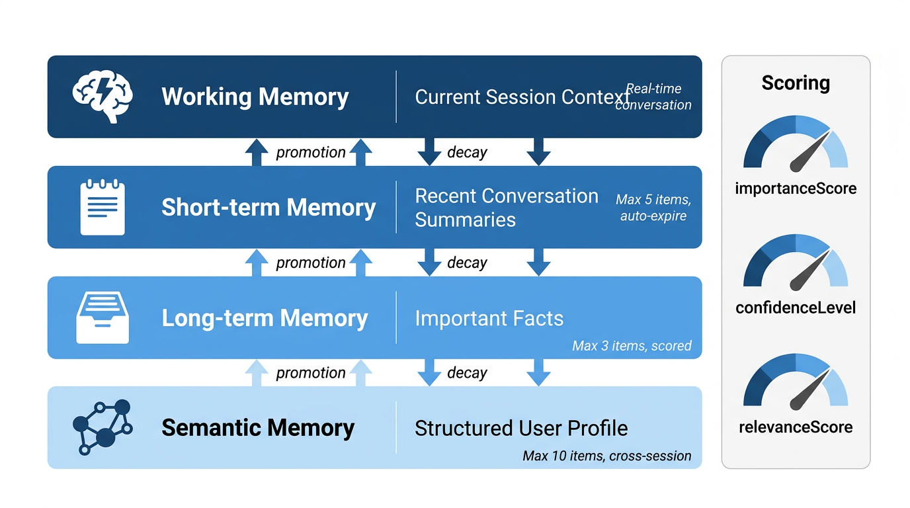
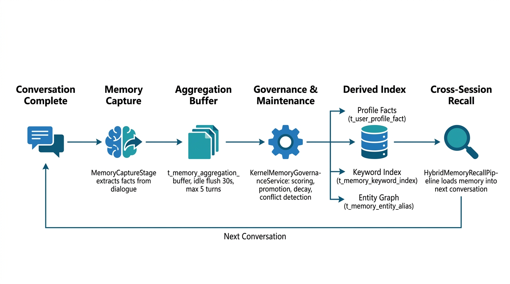
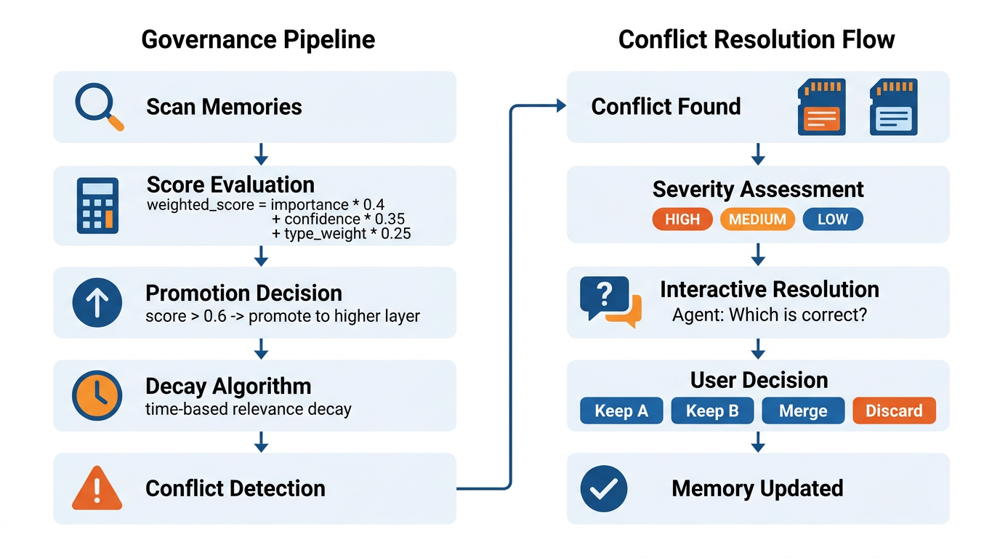

# Seahorse Agent 记忆系统深度解析：让 AI Agent 真正"记住"你

> **导读**｜大多数 AI 聊天机器人都是"金鱼记忆"——关掉对话窗口，它就忘了你是谁。Seahorse Agent 设计了一套四层记忆架构，从工作记忆到语义记忆，从自动捕获到交互式冲突解决，让 Agent 真正具备跨会话的认知能力。本文将深入源码，拆解这套记忆系统的工程实现。

---

##  一、为什么 AI Agent 需要记忆系统？

大模型本身是无状态的。每次对话对模型来说都是"初次见面"。要让 Agent 提供个性化服务，必须解决三个核心问题：

1. **记得住**——跨会话保留用户偏好、历史事实和对话上下文
2. **忘得掉**——过时信息自动衰减，避免上下文窗口被噪声撑爆
3. **对得上**——发现记忆矛盾时主动确认，而不是静默覆盖

Seahorse Agent 的记忆系统围绕这三个目标，构建了一个完整的**记忆生命周期闭环**：

| 闭环阶段 | 核心组件 | 存储表 |
|---------|---------|--------|
| 捕获 | `MemoryCaptureStage` | `t_short_term_memory` |
| 聚合 | `MemoryAggregationBufferPort` | `t_memory_aggregation_buffer` |
| 治理 | `KernelMemoryGovernanceService` | `t_memory_quality_snapshot` |
| 维护 | `SeahorseMemoryMaintenanceJob` | `t_memory_outbox` |
| 召回 | `HybridMemoryRecallPipeline` | 注入 `MemoryContext` |
| 画像 | `ProfileFact` 派生 | `t_user_profile_fact` |

---

## 📌 二、四层记忆架构：从即时对话到跨会话认知

### 2.1 记忆分层模型



Seahorse Agent 将记忆分为四个层次，每层有不同的生命周期、容量限制和使用场景：

| 记忆层 | 枚举值 | 容量限制 | 生命周期 | 典型内容 |
|--------|-------|---------|---------|---------|
| **工作记忆** | `WORKING` | 当前会话上下文 | 会话结束即清除 | 本轮对话的消息历史 |
| **短期记忆** | `SHORT_TERM` | 最多 5 条 | 数小时 ~ 数天 | 近期对话摘要、临时事实 |
| **长期记忆** | `LONG_TERM` | 最多 3 条 | 数周 ~ 数月 | 重要事实、关键决策 |
| **语义记忆** | `SEMANTIC` | 最多 10 条 | 持久化 | 用户画像、偏好、结构化知识 |

源码中，`MemoryLayer` 枚举定义了这四个层次：

```java
// MemoryLayer.java
public enum MemoryLayer {
    WORKING,      // 工作记忆：当前会话
    SHORT_TERM,   // 短期记忆：近期对话
    LONG_TERM,    // 长期记忆：重要事实
    SEMANTIC      // 语义记忆：跨会话画像
}
```

### 2.2 MemoryItem：每条记忆都是有评分的资产

与传统系统的"日志式存储"不同，Seahorse 的每条记忆 `MemoryItem` 都携带丰富的评分维度：

```java
// MemoryItem.java（内核领域模型）
@Value
@Builder
public class MemoryItem {
    String id;
    String userId;
    String conversationId;
    MemoryLayer layer;          // 所属记忆层
    String type;                // PROFILE / PREFERENCE / SUMMARY / FACT / TODO
    String content;             // 记忆内容
    String metadataJson;        // 扩展元数据
    String sourceIdsJson;       // 来源消息ID
    Double importanceScore;     // 重要性评分
    Double confidenceLevel;     // 置信度
    Double relevanceScore;      // 相关性评分
    LocalDateTime createTime;   // 创建时间
}
```

三个评分维度的含义：

| 评分 | 取值范围 | 作用 |
|------|---------|------|
| `importanceScore` | 0.0 ~ 1.0 | 记忆的重要程度，治理时用于晋升决策 |
| `confidenceLevel` | 0.0 ~ 1.0 | 信息的可信度，规则提取默认 0.7，LLM 推断可更高 |
| `relevanceScore` | 0.0 ~ 1.0 | 与当前问题的相关性，召回时用于排序 |

> **💡 设计哲学**
>
> **记忆不是日志，是有评分的资产。** 传统系统将用户信息当作简单的键值对存储，而 Seahorse 的每条记忆都携带三个评分维度。这让记忆不再是静态的"存取"，而是可以被治理、被优化、被淘汰的"认知资产"。治理引擎根据这些评分决定哪些记忆值得晋升到更高层，哪些应该衰减淘汰。

### 2.3 MemoryContext：对话前的上下文注入

每次对话开始前，`HybridMemoryRecallPipeline` 从各记忆层加载数据，组装成 `MemoryContext` 注入到对话流水线：

```java
// MemoryContext.java
@Builder
public class MemoryContext {
    String conversationId;
    String userId;
    String currentQuestion;
    List<ChatMessage> workingMemory;          // 工作记忆
    List<MemoryItem> correctionMemories;      // 纠正记忆（用户修正过的事实）
    List<MemoryItem> profileMemories;         // 画像记忆（用户身份/偏好）
    List<MemoryItem> shortTermMemories;       // 短期记忆
    List<MemoryItem> businessDocumentMemories;// 业务文档记忆
    List<MemoryItem> longTermMemories;        // 长期记忆
    List<MemoryItem> semanticMemories;        // 语义记忆
    List<ChatMessage> promptMessages;         // 格式化后的提示消息
}
```

在 `KernelChatInboundService` 中，记忆加载被包装在 try-catch 中——**记忆加载失败时降级为空上下文，不阻断问答主链路**：

```java
// KernelChatInboundService.java
try {
    MemoryContext loaded = memoryEnginePort.loadMemory(
        MemoryLoadRequest.builder()
            .conversationId(command.conversationId())
            .userId(command.userId())
            .currentQuestion(command.question())
            .build());
    // 组装完整的 MemoryContext
} catch (Exception ex) {
    // 降级：返回空记忆上下文，主链路不受影响
    return fallback;
}
```

---

## 📌 三、记忆生命周期：从捕获到召回的完整流程

### 3.1 全链路概览



记忆从产生到被下次对话使用，经历以下完整链路：

### 3.2 阶段一：记忆捕获（Capture）

对话完成后，`MemoryCaptureStage` 从对话消息中提取事实。系统支持两种提取方式：

**方式A：规则提取（Phase 4A，不调用 LLM）**

`RuleBasedMemoryCandidateExtractor` 通过正则模式匹配高确定性的用户声明：

```java
// RuleBasedMemoryCandidateExtractor.java
// 匹配"我是/我在/我做"等自我声明
private static final Pattern PROFILE_PATTERN = Pattern.compile(
    "我(?:是|在|做|从事|负责|擅长|来自)(.{2,30})");

// 匹配"我喜欢/我偏好/我习惯"等偏好声明
private static final Pattern PREFERENCE_PATTERN = Pattern.compile(
    "我(?:喜欢|偏好|习惯|常用|prefer|like)(.{2,30})");

// 匹配"我需要/我想要/我希望"等需求声明
private static final Pattern NEED_PATTERN = Pattern.compile(
    "我(?:需要|想要|希望|想|要)(.{2,30})");
```

规则提取的优势是**零成本、高确定性**——只识别明确的用户声明，不会把噪声写入记忆。

**方式B：LLM 推断（可选，通过 `MemoryInferencePort`）**

对于隐含的事实（如用户说"今天又加班到10点"，推断出"用户经常加班"），系统通过 `MemoryInferencePort` 调用 LLM 进行推断，置信度阈值默认 0.7。

### 3.3 阶段二：聚合缓冲（Aggregation Buffer）

捕获的记忆不会立即写入长期存储，而是先进入**聚合缓冲区**：

```java
// MemoryAggregationBufferPort.java
interface MemoryAggregationBufferPort {
    MemoryBufferState appendTurn(MemoryTurnEvent event);
    Optional<MemoryBufferSnapshot> flushReady(
        String userId, String sessionId, String tenantId,
        MemoryFlushTrigger trigger, Instant now);
}
```

聚合策略由 `MemoryAggregationPolicy` 控制：

| 配置项 | 默认值 | 说明 |
|--------|-------|------|
| `maxTurns` | 5 | 缓冲区最多累积 5 轮对话后触发 flush |
| `idleFlushMillis` | 30000 | 空闲 30 秒后自动 flush |
| `forceTokens` | 可配置 | Token 数超限强制 flush |

Flush 触发条件（`MemoryFlushTrigger`）：

```java
public enum MemoryFlushTrigger {
    IDLE_TIMEOUT,    // 空闲超时
    FORCE_TURNS,     // 轮数达到上限
    FORCE_TOKENS,    // Token 数达到上限
    TOPIC_SHIFT,     // 话题转移
    SESSION_END      // 会话结束
}
```

聚合缓冲的设计意义：**避免每次对话都触发记忆写入**，将多轮对话的事实合并后批量处理，减少存储压力和治理开销。

### 3.4 阶段三：治理与维护（Governance & Maintenance）

Flush 后的记忆进入治理引擎 `KernelMemoryGovernanceService`，执行以下操作：

1. **评分计算**：加权计算记忆的综合得分
2. **晋升决策**：得分超过阈值（默认 0.6）的记忆晋升到更高层
3. **衰减算法**：基于时间的 relevanceScore 衰减
4. **冲突检测**：发现矛盾记忆并记录到 `t_memory_conflict_log`
5. **派生索引**：生成画像事实、关键词索引、实体关系

### 3.5 阶段四：跨会话召回（Recall）

下次对话时，`HybridMemoryRecallPipeline` 通过多通道并行召回记忆：

```
MemoryLoadRequest
    ├── MemoryTrack.PROFILE      → 加载画像事实
    ├── MemoryTrack.CORRECTION   → 加载纠正记忆
    ├── MemoryTrack.EPISODIC     → 加载情景记忆（向量检索）
    └── MemoryTrack.BUSINESS_DOCUMENT → 加载业务文档
```

各通道的召回结果经过融合（Fusion）、重排（Rerank）和截断（Truncate），最终组装为 `MemoryContext` 注入对话流水线。

---

## 📌 四、用户画像构建：从记忆到跨会话认知

### 4.1 画像事实的数据模型

用户画像以 `ProfileFact` 记录存储，每个事实绑定一个 `slotKey`（画像槽位）：

```java
// ProfileFact.java
public record ProfileFact(
    String id,
    String userId,
    String tenantId,
    String slotKey,        // 画像槽位，如 "identity.occupation"
    String valueText,      // 槽位值，如 "软件工程师"
    double confidenceLevel,// 置信度
    String sourceType,     // 来源类型
    List<String> sourceIds,// 来源消息ID
    String generationId,   // 世代ID（用于版本追踪）
    String status,         // ACTIVE / INACTIVE
    Instant updatedAt,
    long version,          // 版本号
    Instant lastReferencedAt,
    int accessCount        // 被引用次数
) {}
```

### 4.2 画像派生的三种路径

```
┌─────────────────────────────────────────────────────────┐
│                  用户画像派生路径                          │
├─────────────────────────────────────────────────────────┤
│                                                         │
│  ① 规则提取                                              │
│     用户说"我是软件工程师"                                 │
│     → PROFILE_PATTERN 匹配                               │
│     → slotKey="identity.occupation", value="软件工程师"    │
│     → confidenceLevel=0.75                               │
│                                                         │
│  ② 对话捕获                                               │
│     MemoryCaptureStage 从对话中提取显式事实                 │
│     → MemoryProfileValueNormalizer 规范化槽位值            │
│     → TrackWriteService.writeProfileFact() 写入           │
│                                                         │
│  ③ 治理晋升                                               │
│     短期记忆经治理引擎评分后晋升到语义层                     │
│     → 类型标记为 PROFILE                                  │
│     → 作为语义记忆在后续会话中被召回                        │
│                                                         │
└─────────────────────────────────────────────────────────┘
```

画像事实在召回时被转换为 `MemoryItem`，以 `SEMANTIC` 层注入 `MemoryContext`：

```java
// HybridMemoryRecallPipeline.java
private MemoryItem toProfileItem(ProfileFact fact) {
    return MemoryItem.builder()
            .id(fact.id())
            .userId(fact.userId())
            .layer(MemoryLayer.SEMANTIC)
            .type("PROFILE")
            .content(fact.valueText())
            .metadataJson(serializeMetadata(Map.of(
                    "profileSlot", fact.slotKey(),
                    "sourceType", fact.sourceType(),
                    "status", fact.status())))
            .importanceScore(1D)
            .confidenceLevel(fact.confidenceLevel())
            .build();
}
```

注意画像记忆的 `importanceScore` 固定为 1.0——**用户画像是最优先的记忆类型**，在上下文注入时享有最高优先级。

### 4.3 画像召回机制

通过 API `/memories/profile-facts` 可查询当前用户的活跃画像事实。在对话中，画像记忆通过 `MemoryTrack.PROFILE` 通道加载，与短期记忆、语义记忆一起构成完整的用户认知上下文。

---

##  五、记忆治理机制：质量评估、冲突检测与衰减

### 5.1 治理引擎概览



`KernelMemoryGovernanceService` 是记忆治理的核心，通过定时任务 `SeahorseMemoryGovernanceJob` 周期触发。

### 5.2 评分与晋升算法

治理引擎对每条短期记忆计算加权综合得分：

```
weighted_score = importanceScore × 0.4
               + confidenceLevel × 0.35
               + typeWeight × 0.25
```

类型权重排序：**PROFILE > FACT > TODO**

当 `weighted_score > promotionThreshold`（默认 0.6）时，记忆被晋升到更高层：

```java
// KernelMemoryGovernanceService.java
private static final double DEFAULT_PROMOTION_THRESHOLD = 0.6D;
private static final double INFERENCE_CONFIDENCE_THRESHOLD = 0.7D;
private static final int PROMOTION_SCAN_LIMIT = 500;
```

### 5.3 衰减算法

记忆的 `relevanceScore` 随时间衰减，确保过时信息不会长期占据上下文窗口：

```java
// MemoryDecayOptions 配置
class MemoryDecayOptions {
    boolean timeDecayEnabled;       // 是否启用时间衰减
    double decayRate;               // 衰减速率
    double minRelevanceScore;       // 最低相关性阈值（低于则淘汰）
    long decayIntervalHours;        // 衰减检查间隔
}
```

衰减策略的核心思想：**被频繁引用的记忆衰减更慢，长期无人问津的记忆加速淘汰**。`HybridMemoryRecallPipeline` 在每次召回时记录 `recordLayerReadFeedback`，更新记忆的 `lastReferencedAt` 和 `accessCount`，形成"用进废退"的正反馈循环。

### 5.4 冲突检测与四种冲突类型

治理引擎扫描记忆库，发现以下四类冲突：

| 冲突类型 | 说明 | 严重度 |
|---------|------|--------|
| `CONTRADICTION` | 同一事实的相反描述（"喜欢暗色" vs "喜欢亮色"） | HIGH |
| `PREFERENCE_POLARITY` | 偏好正负矛盾（"喜欢咖啡" vs "讨厌咖啡"） | MEDIUM |
| `PROFILE_OVERWRITE` | 同一画像槽位的多值冲突 | MEDIUM |
| `DUPLICATE_NEAR` | 近似重复记忆（语义相似度 > 0.85） | LOW |

### 5.5 交互式冲突处理

这是 Seahorse 记忆系统最具特色的设计。传统系统发现矛盾时会静默覆盖或忽略，而 Seahorse 设计了**交互式冲突处理机制**——Agent 在对话中主动反问用户：

```
Agent: "我注意到您的记忆中有一处矛盾：
        - 之前记录：「我喜欢暗色主题」
        - 后来又记录：「我喜欢亮色主题」

        这两条信息看起来是矛盾的，请问哪个是准确的？
        您也可以告诉我最新的情况，我会帮您更新记忆。"

用户: "最近改成亮色了，保留第二条"

Agent: "好的，已更新您的偏好为亮色主题。"
```

交互式处理的完整流程：

1. **检测时机**：对话开始前查询 PENDING 冲突 + 治理任务运行后入队通知
2. **策略筛选**：`InteractiveConflictPolicy` 筛选 HIGH/MEDIUM 严重度冲突，每次最多 3 条
3. **反问生成**：模板化兜底 + LLM 自然语言增强
4. **用户反馈**：Agent Tool Call（主路径）+ 前端结构化卡片（辅助路径）
5. **状态更新**：根据用户选择执行 keep_a / keep_b / merge / discard / update

```java
// 用户选择与记忆状态映射
| 用户选择 | action    | memory_id_1 | memory_id_2 |
|---------|-----------|-------------|-------------|
| 保留A   | keep_a    | 保持 ACTIVE  | 标记 INACTIVE |
| 保留B   | keep_b    | 标记 INACTIVE | 保持 ACTIVE  |
| 合并    | merge     | 内容更新     | 标记 INACTIVE |
| 都废弃  | discard   | 标记 INACTIVE | 标记 INACTIVE |
| 新内容  | update    | 内容替换     | 标记 INACTIVE |
```

> **💡 设计哲学**
>
> **冲突不掩盖，交互式解决。** 记忆冲突不是 bug，而是用户偏好演变的自然结果。Seahorse 不替用户做决定，而是把选择权交还给用户。这种设计体现了"Agent 应该懂规矩，但不应该替用户做主"的产品理念。冷却机制（同一冲突最多尝试 2 次、30 分钟冷却期）确保不会反复打扰用户。

---

## 📌 六、可观测性：记忆系统的健康仪表盘

### 6.1 三个关键端点

| 端点 | 用途 | 返回内容 |
|------|------|---------|
| `/memories/readiness` | 能力就绪检查 | 写入、召回、上下文注入、review、outbox、maintenance 的 capability 状态 |
| `/memories/health` | 健康快照 | 记忆健康、策略配置、最近运行状态 |
| `/memories/profile-facts` | 画像查询 | 当前用户/租户的 active 画像事实列表 |

### 6.2 记忆链路 Trace

`t_memory_trace_event` 表记录记忆操作的完整链路：

- 记忆捕获事件（capture）
- 聚合 flush 事件（aggregation）
- 治理评估事件（governance）
- 召回事件（recall）
- 冲突检测事件（conflict）

### 6.3 维护 vs 治理：两个不同的定时任务

| 任务 | 控制器 | 职责 |
|------|-------|------|
| `/memories/maintenance/run` | `SeahorseMemoryMaintenanceController` | 数据整理：聚合、压缩、别名合并、垃圾回收 |
| `/memories/governance/run` | `SeahorseMemoryController` | 质量管控：策略评估、质量快照、清理建议、冲突检测 |

---

## 📌 七、技术实现亮点总结

### 7.1 端口驱动的可插拔记忆存储

记忆系统的每一层都通过独立的端口接口抽象：

```java
interface ShortTermMemoryPort extends MemoryStorePort { ... }
interface LongTermMemoryPort extends MemoryStorePort { ... }
interface SemanticMemoryPort extends MemoryStorePort { ... }
```

`MemoryLayerStoreRegistry` 封装了 `MemoryLayer` → `MemoryStorePort` 的分发逻辑：

```java
public MemoryStorePort storeFor(MemoryLayer layer) {
    return switch (layer) {
        case LONG_TERM -> longTerm;
        case SEMANTIC  -> semantic;
        case WORKING, SHORT_TERM -> shortTerm;  // WORKING 回退到 SHORT_TERM
    };
}
```

### 7.2 混合召回管线

`HybridMemoryRecallPipeline` 是记忆召回的核心，支持多通道并行：

```
MemoryLoadRequest
    │
    ├── MemoryRouterPort.route()     → 路由计划（哪些通道需要激活）
    │
    ├── Vector Channel               → 向量相似度检索
    ├── Keyword Channel              → 关键词匹配
    └── Profile/Correction Channel   → 精确匹配
    │
    ├── Fusion（融合）               → RRF 加权合并
    ├── Rerank（重排）               → 模型重排（可选）
    └── Truncate（截断）             → 按 topK 截断
    │
    └── MemoryContext                → 注入对话流水线
```

单通道异常只记录日志并返回空结果，**不影响其他通道**——与 RAG 检索引擎的容错设计一脉相承。

### 7.3 Outbox 模式保证派生可靠性

记忆治理产生的派生任务（画像更新、关键词索引、实体关系）通过 `t_memory_outbox` 表异步执行，确保即使派生失败也不会丢失数据。Relay 任务批量投递，支持重试和死信策略。

---

## 🎯 总结

Seahorse Agent 的记忆系统回答了 AI Agent 工程化的一个核心问题：**如何让无状态的大模型具备有状态的认知能力**。

> **1. 分层限量是基线。** 工作记忆 → 短期记忆 → 长期记忆 → 语义记忆，每层有明确的容量限制和信息优先级。这解决了"记得住但不爆掉"的矛盾。

> **2. 评分驱动是核心。** 重要性、置信度、相关性三个评分维度让记忆成为可治理的资产，而非静态的日志。晋升、衰减、淘汰都基于数据而非硬编码规则。

> **3. 交互式解决是创新。** 记忆冲突不掩盖、不静默覆盖，而是通过 Agent 反问让用户参与决策。这体现了"Agent 懂规矩但不替用户做主"的产品哲学。

> **4. 降级兜底是底线。** 记忆加载失败降级为空上下文，单通道异常返回空结果——主链路永远不被辅助功能拖垮。

> **5. 可观测是保障。** readiness、health、profile-facts 三个端点 + 链路 Trace，让记忆系统的质量可度量、可追溯、可优化。

这套记忆系统不是学术研究，而是经过生产验证的工程实现。它证明了一件事：**好的 AI Agent 不是靠更大的模型，而是靠更好的工程**。

---

*本文所有架构图和代码均基于 Seahorse Agent 项目实际代码与设计文档。*
