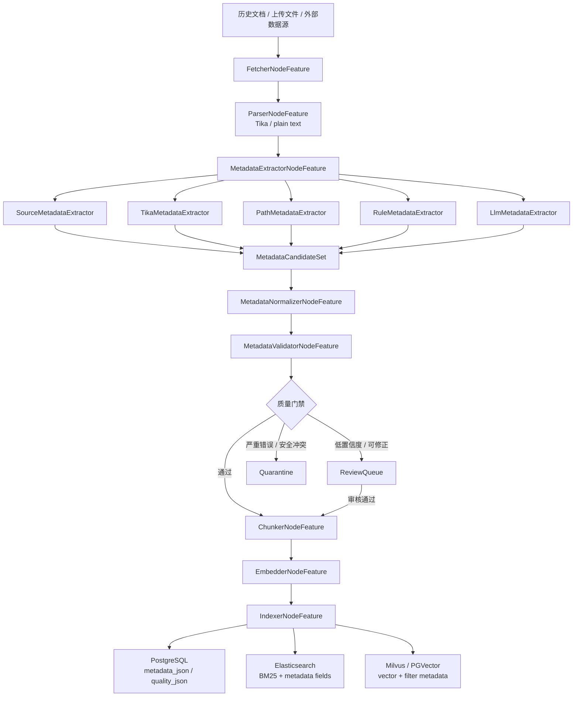
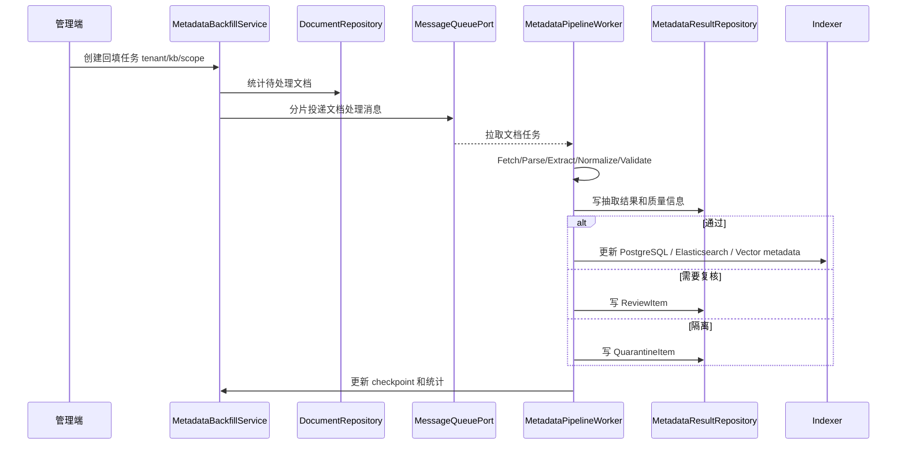

# 企业级元数据抽取与治理管道设计

## 1. 背景与目标

Seahorse Agent 当前已经具备可插拔文档入库管道、Tika 文本解析、LLM 元数据增强钩子和 chunk 元数据传递能力。现有能力可以完成基础知识入库，但面对海量历史非结构化数据时，还缺少稳定抽取、标准化填充、质量校验、人工复核、失败隔离和批量回填能力。

本文设计一套企业级 Metadata Extraction & Governance Pipeline，作为混合检索、元数据过滤、BM25 字段权重、Elasticsearch mapping、PostgreSQL JSONB/表达式索引和向量库过滤的上游数据基础。

目标链路：

```text
Fetcher -> Parser -> MetadataExtractor -> MetadataNormalizer -> MetadataValidator -> Review/Quarantine -> Chunker -> Embedder -> Indexer
```

核心目标：

- 在不破坏现有微内核和端口适配器架构的前提下，新增可插拔元数据抽取治理节点。
- 支持历史非结构化数据的批量回填、断点续跑、幂等重跑和失败隔离。
- 支持规则、Tika 元信息、文件路径/文件名、数据源元数据和 LLM 抽取组合。
- 使用 Metadata Schema Registry 管控动态业务字段，避免任意 `Map<String,Object>` 直接进入检索过滤和索引 mapping。
- 为 Elasticsearch、PostgreSQL、Milvus/PGVector 提供稳定、规范、可解释的元数据。

## 2. 设计原则

- **微内核优先**：`seahorse-agent-kernel` 只定义领域对象、端口、Feature 和编排规则，不依赖 Tika、Elasticsearch、PostgreSQL SDK、对象存储 SDK 或外部模型 SDK。
- **确定性优先**：数据源、文件路径、Tika 元信息、正则/字典规则优先于 LLM；LLM 用于补充语义字段和弱结构化字段。
- **字段级治理**：每个字段必须保留来源、抽取器、置信度、证据片段、schemaVersion 和 extractorVersion。
- **Schema 管控动态字段**：动态元数据不是固定领域，但字段能否过滤、排序、聚合、索引必须由租户级或知识库级 Schema 注册决定。
- **失败可隔离**：解析失败、抽取失败、校验失败、低置信度和安全字段冲突不能直接污染索引，应进入 Review 或 Quarantine。
- **可重放与可审计**：历史数据回填必须支持按 schemaVersion/extractorVersion 幂等重跑，并记录每次抽取结果和人工修正痕迹。

## 3. 当前能力与缺口

| 能力          | 当前状态                                                              | 本方案补齐内容                                            |
| ----------- | ----------------------------------------------------------------- | -------------------------------------------------- |
| 入库编排        | `KernelIngestionEngine` 可按 `PipelineDefinition` 执行节点              | 新增元数据抽取、标准化、校验、复核路由节点                              |
| 文档解析        | `ParserNodeFeature` + `DocumentParserPort` + Tika 适配器             | 扩展 Tika adapter 返回 parser metadata，而不只返回 text      |
| LLM 元数据增强   | `EnhancerNodeFeature` 可把 LLM JSON 合并到 `IngestionContext.metadata` | 新增字段级来源、置信度、Schema 校验和复核机制                         |
| Chunk 元数据传递 | `EnricherNodeFeature` 可把文档 metadata 附加到 chunk                     | 只把规范化后的 canonical metadata 传递到 chunk               |
| 索引写入        | `IndexerNodeFeature` 写关系库和向量库                                     | 联动 PostgreSQL JSONB、Elasticsearch、向量库过滤字段          |
| 历史回填        | 有文档刷新 Job，但不是完整回填治理                                               | 新增 backfill job、checkpoint、retry、review、quarantine |

## 4. 总体架构



架构分层：

| 层级         | 新增组件                                                                                                                                  | 职责                      |
| ---------- | ------------------------------------------------------------------------------------------------------------------------------------- | ----------------------- |
| L1 内核领域    | `MetadataSchema`、`ExtractedMetadata`、`MetadataFieldValue`、`MetadataValidationResult`                                                  | 定义元数据治理领域模型             |
| L2 Feature | `MetadataExtractorNodeFeature`、`MetadataNormalizerNodeFeature`、`MetadataValidatorNodeFeature`、`MetadataReviewRouterNodeFeature`       | 接入入库流水线，承载单节点业务处理       |
| L2 端口      | `MetadataSchemaRegistryPort`、`MetadataExtractionRulePort`、`MetadataDictionaryPort`、`MetadataReviewQueuePort`、`MetadataQuarantinePort` | 隔离数据库、配置中心、字典、复核队列等外部实现 |
| L3 适配器     | JDBC、YAML、Elasticsearch、PostgreSQL、OpenAI Compatible                                                                                  | 提供可替换实现                 |
| Web/API    | 管理 Schema、回填任务、复核项、复核审计轨迹、隔离项、质量报表                                                                                                    | 面向企业治理操作                |

## 5. 入库流水线节点设计

### 5.1 Fetcher

复用现有 `FetcherNodeFeature` 和 `DocumentFetcherPort`。数据源适配器需要尽量补齐稳定的 source metadata：

| 字段               | 说明                               |
| ---------------- | -------------------------------- |
| `source_type`    | `upload`、`feishu`、`s3`、`local` 等 |
| `source_uri`     | 原始来源地址或对象存储 key                  |
| `source_doc_id`  | 外部系统文档 ID                        |
| `source_version` | 外部系统版本号或更新时间戳                    |
| `file_name`      | 原始文件名                            |
| `file_path`      | 原始路径，用于路径规则抽取                    |
| `mime_type`      | MIME 类型                          |
| `owner`          | 来源系统的负责人或创建者                     |
| `updated_at`     | 来源系统更新时间                         |

### 5.2 Parser

复用现有 `ParserNodeFeature`，但建议扩展 `TikaDocumentParserAdapter`：

- 当前 Tika adapter 主要返回文本；后续应使用 Tika `Metadata` 对象返回标题、作者、创建时间、修改时间、页数、语言、内容类型等 parser metadata。
- parser metadata 不直接进入检索字段，只进入 `raw_parse_metadata`，由抽取与标准化节点按 Schema 选择性转正。
- 对 PDF、Office、HTML、Markdown、TXT 分别记录解析器名称、解析器版本、耗时和警告。

当前实现状态：

- `TikaDocumentParserAdapter` 已保留 Tika 原始 metadata key，并补充 `parser`、`parserVersion`、`title`、`author`、`createdAt`/`createdTime`、`modifiedAt`/`modifiedTime`、`pageCount`、`language`、`contentType`/`mimeType`、`resourceName`/`fileName` 等稳定 key。
- `text/html` 已进入 Tika/JSoupParser 解析以抽取 HTML 标题和作者；`text/plain`、Markdown 和 TXT 继续走轻量 UTF-8 文本路径，并返回一致的基础 parser metadata。

建议 `DocumentParseResult` 保持现有 `text + metadata` 结构，metadata 示例：

```json
{
  "parser": "tika",
  "parserVersion": "2.x",
  "title": "员工手册",
  "author": "HR Center",
  "createdAt": "2024-01-03T10:12:00Z",
  "modifiedAt": "2024-03-01T09:00:00Z",
  "pageCount": 42,
  "warnings": []
}
```

### 5.3 MetadataExtractor

新增节点类型：`metadata_extractor`。

职责：

- 加载当前租户/知识库的 Metadata Schema 和抽取规则。
- 按优先级执行多个 extractor，生成字段候选集。
- 合并候选值，保留字段级 provenance 和 confidence。
- 不做最终类型转换和准入决策，避免抽取器职责过重。

建议接口：

```java
public interface MetadataExtractorFeature extends AgentFeature {
    MetadataExtractionResult extract(MetadataExtractionRequest request);
}

public record MetadataExtractionRequest(
        String tenantId,
        String knowledgeBaseId,
        String documentId,
        String rawText,
        Map<String, Object> sourceMetadata,
        Map<String, Object> parseMetadata,
        MetadataSchema schema,
        Map<String, Object> options
) {
}

public record MetadataExtractionResult(
        List<MetadataFieldCandidate> candidates,
        List<MetadataExtractionIssue> issues,
        String extractorVersion
) {
}
```

字段候选值：

```java
public record MetadataFieldCandidate(
        String fieldKey,
        Object rawValue,
        String sourceType,
        String extractorName,
        double confidence,
        String evidence,
        int schemaVersion,
        String extractorVersion
) {
}
```

抽取器优先级建议：

| 优先级 | 抽取器                           | 适用字段                                       | 特点          |
| --- | ----------------------------- | ------------------------------------------ | ----------- |
| 10  | `SourceMetadataExtractor`     | 来源系统 ID、更新时间、负责人、权限标签                      | 稳定性最高       |
| 20  | `TikaMetadataExtractor`       | title、author、createdAt、modifiedAt、mimeType | 来自文件元信息     |
| 30  | `PathMetadataExtractor`       | 部门、产品线、年份、地区、密级                            | 适合历史文件目录治理  |
| 40  | `RuleMetadataExtractor`       | 合同编号、制度编号、生效日期、版本号                         | 正则、表头、关键段落  |
| 50  | `DictionaryMetadataExtractor` | 部门、地区、业务线、密级归一候选                           | 依赖企业字典      |
| 80  | `LlmMetadataExtractor`        | 摘要、主题、适用范围、语义分类                            | 成本较高，需限流和审计 |

候选合并策略：

- 系统字段和权限字段只接受 source/rule 结果，不接受 LLM 覆盖。
- 同一字段多个候选值一致时提升置信度。
- 同一字段多个候选值冲突时，根据 extractor priority 和 confidence 选择主值，同时记录 conflict issue。
- LLM 结果只能补充缺失字段，或在规则低置信度时进入 Review，不能直接覆盖高置信度确定性字段。

### 5.4 MetadataNormalizer

新增节点类型：`metadata_normalizer`。

职责：

- 按 Schema 将字段值转换为 canonical key 和 canonical value。
- 执行类型转换、格式统一、枚举映射、同义词归一、数组去重和空值清理。
- 输出可写入索引的 `normalizedMetadata` 和字段质量信息。

建议接口：

```java
public interface MetadataNormalizerPort {
    MetadataNormalizationResult normalize(MetadataNormalizationRequest request);
}

public record MetadataNormalizationRequest(
        MetadataSchema schema,
        List<MetadataFieldCandidate> candidates,
        String tenantId,
        String knowledgeBaseId
) {
}

public record MetadataNormalizationResult(
        Map<String, Object> normalizedMetadata,
        List<MetadataFieldQuality> fieldQualities,
        List<MetadataNormalizationIssue> issues
) {
}
```

常见标准化规则：

| 类型             | 标准化规则                                 |
| -------------- | ------------------------------------- |
| `STRING`       | trim、全角半角处理、空字符串转 null、大小写策略          |
| `NUMBER`       | 去单位、千分位清理、范围校验前转换为 `BigDecimal`       |
| `BOOLEAN`      | `是/否`、`Y/N`、`true/false` 映射           |
| `DATE_TIME`    | 多格式解析，统一 ISO-8601 或数据库 timestamp      |
| `STRING_ARRAY` | 分隔符拆分、trim、去重、字典归一                    |
| `ENUM`         | 使用 `MetadataDictionaryPort` 做别名到标准值映射 |

字典示例：

```yaml
metadata-dictionaries:
  security_level:
    aliases:
      公开: public
      内部: internal
      机密: confidential
  department:
    aliases:
      人力: HR
      人力资源部: HR
      Human Resources: HR
```

### 5.5 MetadataValidator

新增节点类型：`metadata_validator`。

职责：

- 绑定 `MetadataSchemaRegistryPort` 加载的 Schema。
- 校验字段是否注册、类型是否匹配、必填字段是否缺失、枚举值是否合法、置信度是否达标。
- 区分可自动通过、需要人工复核、必须隔离三种结果。

建议接口：

```java
public interface MetadataValidatorPort {
    MetadataValidationResult validate(MetadataValidationRequest request);
}

public record MetadataValidationRequest(
        String tenantId,
        String knowledgeBaseId,
        String documentId,
        MetadataSchema schema,
        Map<String, Object> normalizedMetadata,
        List<MetadataFieldQuality> fieldQualities
) {
}

public record MetadataValidationResult(
        MetadataValidationDecision decision,
        List<MetadataValidationIssue> issues,
        Map<String, Object> acceptedMetadata,
        Map<String, Object> rejectedMetadata
) {
}

public enum MetadataValidationDecision {
    ACCEPT, REVIEW_REQUIRED, QUARANTINE
}
```

门禁规则建议：

| 规则                                      | 结果                                        |
| --------------------------------------- | ----------------------------------------- |
| 必填系统字段缺失，如 `tenant_id`、`kb_id`、`doc_id` | `QUARANTINE`                              |
| 权限字段来源不可信或与数据源冲突                        | `QUARANTINE`                              |
| 可过滤字段未注册 Schema                         | 不写入 filterable metadata，记录 issue          |
| 非关键字段低置信度                               | `REVIEW_REQUIRED`                         |
| LLM 抽取字段无证据片段                           | 降低 confidence 或进入 Review                  |
| 枚举值无法归一                                 | `REVIEW_REQUIRED`                         |
| 类型转换失败                                  | 关键字段 `QUARANTINE`，非关键字段 `REVIEW_REQUIRED` |

当前实现状态：

- `MetadataValidatorNodeFeature` 已区分 `ACCEPT`、`REVIEW_REQUIRED`、`QUARANTINE`：只有 `ACCEPT` 会写入 canonical metadata 并继续索引链路。
- `REVIEW_REQUIRED` 会写入复核队列并主动终止后续节点，同时设置 `skipIndexerWrite`；`QUARANTINE` 会写入隔离项并终止后续节点，避免低置信度或严重错误字段污染索引。

### 5.6 Review/Quarantine

新增节点类型：`metadata_review_router`，也可以先在 `metadata_validator` 内部完成路由，后续再拆节点。

Review 用于可人工修正的数据：

- 低置信度字段。
- 非关键字段缺失。
- 多候选冲突但可人工选择。
- LLM 与规则结果冲突。

Quarantine 用于不能继续入库的数据：

- 文件无法解析或内容为空。
- 系统字段缺失。
- 权限字段冲突。
- Schema 版本不兼容。
- 抽取器异常超过重试上限。

审核动作：

| 动作             | 说明                         |
| -------------- | -------------------------- |
| `APPROVE`      | 接受系统抽取结果，继续入库              |
| `CORRECT`      | 人工修正字段值，记录审计后继续入库          |
| `IGNORE_FIELD` | 忽略单个非关键字段                  |
| `RE_EXTRACT`   | 使用指定 extractorVersion 重新抽取 |
| `QUARANTINE`   | 转入隔离，不进入索引                 |

当前实现状态：

- `KernelMetadataReviewService` 已提供只读审计查询入口，查询审计轨迹不会触发 canonical metadata 写回或索引补偿。
- JDBC 治理仓储已支持按复核项查询 `t_metadata_review_audit`，并兼容缺少 `previous_metadata`、`updated_metadata` 的旧表结构。
- 管理端 Web API 已提供 `GET /metadata-review/items/{item-id}/audits`，用于展示复核前后元数据快照和决策元数据。
- 复核列表已支持按 `reasonCode` 和 `documentId` 筛选；隔离列表已支持按 `stage`、`reasonCode`、`documentId` 和 `jobId` 筛选，便于从质量报表或回填任务直接定位治理项。
- `KernelMetadataReviewService` 已记录 `metadata.review.decision.completed` 观测事件，包含 action、reviewStatus、reasonCode、字段数量、canonical 写回、索引补偿、隔离和重抽取标记；具体审核人和前后值仍以审计表为准。
- `KernelMetadataQuarantineService` 已记录 `metadata.quarantine.action.completed` 观测事件，覆盖隔离项 RESOLVE 与 RETRY 动作，并保留 stage、reasonCode、retryCount、maxRetryCount 和 resolved 状态。

## 6. Schema 与字段治理

本方案复用《混合检索与重排完善设计方案》中的 `MetadataSchemaRegistryPort`、`MetadataFieldDescriptor` 和 `t_metadata_field_schema` 思路，并增加抽取治理属性。

建议扩展字段描述：

```java
public record MetadataFieldDescriptor(
        String fieldKey,
        String displayName,
        MetadataValueType valueType,
        Set<MetadataOperator> allowedOperators,
        boolean required,
        boolean filterable,
        boolean sortable,
        boolean facetable,
        boolean indexed,
        MetadataIndexPolicy indexPolicy,
        double minConfidence,
        Set<String> trustedSources,
        Map<String, Object> extractionHints,
        BackendFieldMapping backendMapping
) {
}
```

字段分层：

| 层级     | 示例                                                               | 治理要求                   |
| ------ | ---------------------------------------------------------------- | ---------------------- |
| 系统治理字段 | `tenant_id`、`kb_id`、`doc_id`、`chunk_id`、`enabled`                | 系统生成，不允许 LLM 覆盖        |
| 权限字段   | `acl_subjects`、`security_level`、`visibility`                     | 必须来源可信，可 Review，不可盲目通过 |
| 文档基础字段 | `file_type`、`source_type`、`source_uri`、`created_at`、`updated_at` | 优先来源系统和 Tika           |
| 业务动态字段 | `department`、`region`、`product_line`、`effective_date`            | 租户/知识库注册后可过滤           |
| 展示字段   | `summary`、`keywords`、`topic`                                     | 可由 LLM 生成，但不默认用于权限过滤   |

## 7. 数据模型与表结构

### 7.1 抽取任务表

```sql
CREATE TABLE IF NOT EXISTS t_metadata_extraction_job (
    id                 VARCHAR(32) PRIMARY KEY,
    tenant_id          VARCHAR(64) NOT NULL,
    kb_id              VARCHAR(20),
    pipeline_id        VARCHAR(32),
    job_type           VARCHAR(32) NOT NULL,
    status             VARCHAR(32) NOT NULL,
    schema_version     INTEGER NOT NULL,
    extractor_version  VARCHAR(64) NOT NULL,
    scope_json         JSONB NOT NULL,
    options_json       JSONB,
    checkpoint_json    JSONB,
    total_count        BIGINT NOT NULL DEFAULT 0,
    processed_count    BIGINT NOT NULL DEFAULT 0,
    success_count      BIGINT NOT NULL DEFAULT 0,
    review_count       BIGINT NOT NULL DEFAULT 0,
    quarantine_count   BIGINT NOT NULL DEFAULT 0,
    failed_count       BIGINT NOT NULL DEFAULT 0,
    last_error         TEXT,
    create_time        TIMESTAMP NOT NULL DEFAULT CURRENT_TIMESTAMP,
    update_time        TIMESTAMP NOT NULL DEFAULT CURRENT_TIMESTAMP
);

CREATE INDEX IF NOT EXISTS idx_metadata_job_tenant_status
ON t_metadata_extraction_job (tenant_id, status);

CREATE INDEX IF NOT EXISTS idx_metadata_job_kb
ON t_metadata_extraction_job (kb_id);

COMMENT ON TABLE t_metadata_extraction_job IS '元数据抽取与回填任务表';
COMMENT ON COLUMN t_metadata_extraction_job.id IS '任务 ID';
COMMENT ON COLUMN t_metadata_extraction_job.tenant_id IS '租户 ID';
COMMENT ON COLUMN t_metadata_extraction_job.kb_id IS '知识库 ID，空值表示跨知识库任务';
COMMENT ON COLUMN t_metadata_extraction_job.pipeline_id IS '使用的入库流水线 ID';
COMMENT ON COLUMN t_metadata_extraction_job.job_type IS '任务类型：INGESTION/BACKFILL/REINDEX/RE_EXTRACT';
COMMENT ON COLUMN t_metadata_extraction_job.status IS '任务状态：PENDING/RUNNING/PAUSED/SUCCEEDED/FAILED/CANCELLED';
COMMENT ON COLUMN t_metadata_extraction_job.schema_version IS '任务使用的 Metadata Schema 版本';
COMMENT ON COLUMN t_metadata_extraction_job.extractor_version IS '任务使用的抽取器版本';
COMMENT ON COLUMN t_metadata_extraction_job.scope_json IS '任务处理范围 JSON，如知识库、文档类型、时间范围、文档 ID 列表';
COMMENT ON COLUMN t_metadata_extraction_job.options_json IS '任务运行选项 JSON，如批大小、是否启用 LLM、置信度阈值';
COMMENT ON COLUMN t_metadata_extraction_job.checkpoint_json IS '断点续跑游标 JSON';
COMMENT ON COLUMN t_metadata_extraction_job.total_count IS '计划处理文档总数';
COMMENT ON COLUMN t_metadata_extraction_job.processed_count IS '已处理文档数量';
COMMENT ON COLUMN t_metadata_extraction_job.success_count IS '成功通过并入库的文档数量';
COMMENT ON COLUMN t_metadata_extraction_job.review_count IS '进入人工复核的文档数量';
COMMENT ON COLUMN t_metadata_extraction_job.quarantine_count IS '进入隔离区的文档数量';
COMMENT ON COLUMN t_metadata_extraction_job.failed_count IS '执行失败的文档数量';
COMMENT ON COLUMN t_metadata_extraction_job.last_error IS '最近一次任务错误信息';
COMMENT ON COLUMN t_metadata_extraction_job.create_time IS '创建时间';
COMMENT ON COLUMN t_metadata_extraction_job.update_time IS '更新时间';
```

### 7.2 抽取结果表

```sql
CREATE TABLE IF NOT EXISTS t_metadata_extraction_result (
    id                    VARCHAR(32) PRIMARY KEY,
    tenant_id             VARCHAR(64) NOT NULL,
    kb_id                 VARCHAR(20) NOT NULL,
    doc_id                VARCHAR(32) NOT NULL,
    job_id                VARCHAR(32),
    schema_version        INTEGER NOT NULL,
    extractor_version     VARCHAR(64) NOT NULL,
    status                VARCHAR(32) NOT NULL,
    normalized_metadata   JSONB NOT NULL,
    raw_candidates        JSONB NOT NULL,
    field_quality         JSONB NOT NULL,
    validation_issues     JSONB,
    approved_metadata     JSONB,
    approved_by           VARCHAR(64),
    approved_time         TIMESTAMP,
    create_time           TIMESTAMP NOT NULL DEFAULT CURRENT_TIMESTAMP,
    update_time           TIMESTAMP NOT NULL DEFAULT CURRENT_TIMESTAMP
);

CREATE UNIQUE INDEX IF NOT EXISTS uk_metadata_result_doc_version
ON t_metadata_extraction_result (tenant_id, kb_id, doc_id, schema_version, extractor_version);

CREATE INDEX IF NOT EXISTS idx_metadata_result_doc
ON t_metadata_extraction_result (doc_id);

CREATE INDEX IF NOT EXISTS idx_metadata_result_status
ON t_metadata_extraction_result (tenant_id, status);

CREATE INDEX IF NOT EXISTS idx_metadata_result_normalized_gin
ON t_metadata_extraction_result USING GIN (normalized_metadata);

COMMENT ON TABLE t_metadata_extraction_result IS '文档元数据抽取结果表';
COMMENT ON COLUMN t_metadata_extraction_result.id IS '抽取结果 ID';
COMMENT ON COLUMN t_metadata_extraction_result.tenant_id IS '租户 ID';
COMMENT ON COLUMN t_metadata_extraction_result.kb_id IS '知识库 ID';
COMMENT ON COLUMN t_metadata_extraction_result.doc_id IS '文档 ID';
COMMENT ON COLUMN t_metadata_extraction_result.job_id IS '来源抽取任务 ID';
COMMENT ON COLUMN t_metadata_extraction_result.schema_version IS '抽取结果对应的 Metadata Schema 版本';
COMMENT ON COLUMN t_metadata_extraction_result.extractor_version IS '抽取结果对应的抽取器版本';
COMMENT ON COLUMN t_metadata_extraction_result.status IS '结果状态：ACCEPTED/REVIEW_REQUIRED/QUARANTINED/REJECTED';
COMMENT ON COLUMN t_metadata_extraction_result.normalized_metadata IS '标准化后的元数据 JSON';
COMMENT ON COLUMN t_metadata_extraction_result.raw_candidates IS '原始字段候选值、来源、证据和置信度 JSON';
COMMENT ON COLUMN t_metadata_extraction_result.field_quality IS '字段级质量信息 JSON';
COMMENT ON COLUMN t_metadata_extraction_result.validation_issues IS '校验问题 JSON';
COMMENT ON COLUMN t_metadata_extraction_result.approved_metadata IS '人工审核后确认的元数据 JSON';
COMMENT ON COLUMN t_metadata_extraction_result.approved_by IS '审核人 ID';
COMMENT ON COLUMN t_metadata_extraction_result.approved_time IS '审核时间';
COMMENT ON COLUMN t_metadata_extraction_result.create_time IS '创建时间';
COMMENT ON COLUMN t_metadata_extraction_result.update_time IS '更新时间';
```

当前实现状态：

- 已新增 `MetadataExtractionResultInboundPort`、`MetadataExtractionResultManagementRepositoryPort`、`MetadataExtractionResultQuery`、`MetadataExtractionResultRecord` 与 `KernelMetadataExtractionResultService`，支持按租户、知识库、文档、任务、状态、`schemaVersion` 和 `extractorVersion` 分页查询抽取结果。
- `JdbcMetadataGovernanceRepositoryAdapter` 已提供 `t_metadata_extraction_result` 的只读分页和详情查询，返回 normalized metadata、raw candidates、field quality、validation issues 与 approved metadata 快照。
- 管理端 Web API 已提供 `GET /metadata-extraction/results` 和 `GET /metadata-extraction/results/{result-id}`；该接口只用于结果追溯，不触发复核决策、canonical metadata 写回或索引补偿。

### 7.3 人工复核表

```sql
CREATE TABLE IF NOT EXISTS t_metadata_review_item (
    id                  VARCHAR(32) PRIMARY KEY,
    tenant_id           VARCHAR(64) NOT NULL,
    kb_id               VARCHAR(20) NOT NULL,
    doc_id              VARCHAR(32) NOT NULL,
    result_id           VARCHAR(32) NOT NULL,
    review_status       VARCHAR(32) NOT NULL,
    priority            INTEGER NOT NULL DEFAULT 0,
    reason_code         VARCHAR(64) NOT NULL,
    reason_message      TEXT,
    suggested_metadata  JSONB,
    corrected_metadata  JSONB,
    reviewer_id         VARCHAR(64),
    review_comment      TEXT,
    create_time         TIMESTAMP NOT NULL DEFAULT CURRENT_TIMESTAMP,
    update_time         TIMESTAMP NOT NULL DEFAULT CURRENT_TIMESTAMP
);

CREATE INDEX IF NOT EXISTS idx_metadata_review_status
ON t_metadata_review_item (tenant_id, review_status, priority);

CREATE INDEX IF NOT EXISTS idx_metadata_review_doc
ON t_metadata_review_item (doc_id);

COMMENT ON TABLE t_metadata_review_item IS '元数据人工复核项表';
COMMENT ON COLUMN t_metadata_review_item.id IS '复核项 ID';
COMMENT ON COLUMN t_metadata_review_item.tenant_id IS '租户 ID';
COMMENT ON COLUMN t_metadata_review_item.kb_id IS '知识库 ID';
COMMENT ON COLUMN t_metadata_review_item.doc_id IS '文档 ID';
COMMENT ON COLUMN t_metadata_review_item.result_id IS '关联的抽取结果 ID';
COMMENT ON COLUMN t_metadata_review_item.review_status IS '复核状态：PENDING/APPROVED/CORRECTED/REJECTED/QUARANTINED';
COMMENT ON COLUMN t_metadata_review_item.priority IS '复核优先级，数值越大优先级越高';
COMMENT ON COLUMN t_metadata_review_item.reason_code IS '进入复核的原因编码';
COMMENT ON COLUMN t_metadata_review_item.reason_message IS '进入复核的原因说明';
COMMENT ON COLUMN t_metadata_review_item.suggested_metadata IS '系统建议的标准化元数据 JSON';
COMMENT ON COLUMN t_metadata_review_item.corrected_metadata IS '人工修正后的元数据 JSON';
COMMENT ON COLUMN t_metadata_review_item.reviewer_id IS '复核人 ID';
COMMENT ON COLUMN t_metadata_review_item.review_comment IS '复核备注';
COMMENT ON COLUMN t_metadata_review_item.create_time IS '创建时间';
COMMENT ON COLUMN t_metadata_review_item.update_time IS '更新时间';
```

### 7.4 隔离表

```sql
CREATE TABLE IF NOT EXISTS t_metadata_quarantine_item (
    id                VARCHAR(32) PRIMARY KEY,
    tenant_id         VARCHAR(64) NOT NULL,
    kb_id             VARCHAR(20),
    doc_id            VARCHAR(32),
    job_id            VARCHAR(32),
    stage             VARCHAR(64) NOT NULL,
    reason_code       VARCHAR(64) NOT NULL,
    reason_message    TEXT,
    source_snapshot   JSONB,
    retry_count       INTEGER NOT NULL DEFAULT 0,
    next_retry_time   TIMESTAMP,
    resolved          SMALLINT NOT NULL DEFAULT 0,
    resolved_by       VARCHAR(64),
    resolved_time     TIMESTAMP,
    create_time       TIMESTAMP NOT NULL DEFAULT CURRENT_TIMESTAMP,
    update_time       TIMESTAMP NOT NULL DEFAULT CURRENT_TIMESTAMP
);

CREATE INDEX IF NOT EXISTS idx_metadata_quarantine_status
ON t_metadata_quarantine_item (tenant_id, resolved, next_retry_time);

CREATE INDEX IF NOT EXISTS idx_metadata_quarantine_doc
ON t_metadata_quarantine_item (doc_id);

COMMENT ON TABLE t_metadata_quarantine_item IS '元数据抽取隔离项表';
COMMENT ON COLUMN t_metadata_quarantine_item.id IS '隔离项 ID';
COMMENT ON COLUMN t_metadata_quarantine_item.tenant_id IS '租户 ID';
COMMENT ON COLUMN t_metadata_quarantine_item.kb_id IS '知识库 ID';
COMMENT ON COLUMN t_metadata_quarantine_item.doc_id IS '文档 ID';
COMMENT ON COLUMN t_metadata_quarantine_item.job_id IS '来源抽取任务 ID';
COMMENT ON COLUMN t_metadata_quarantine_item.stage IS '失败阶段：FETCH/PARSE/EXTRACT/NORMALIZE/VALIDATE/INDEX';
COMMENT ON COLUMN t_metadata_quarantine_item.reason_code IS '隔离原因编码';
COMMENT ON COLUMN t_metadata_quarantine_item.reason_message IS '隔离原因说明';
COMMENT ON COLUMN t_metadata_quarantine_item.source_snapshot IS '隔离时的来源、解析结果、候选值等快照 JSON';
COMMENT ON COLUMN t_metadata_quarantine_item.retry_count IS '已重试次数';
COMMENT ON COLUMN t_metadata_quarantine_item.next_retry_time IS '下一次允许重试时间';
COMMENT ON COLUMN t_metadata_quarantine_item.resolved IS '是否已处理，0 表示未处理，1 表示已处理';
COMMENT ON COLUMN t_metadata_quarantine_item.resolved_by IS '处理人 ID';
COMMENT ON COLUMN t_metadata_quarantine_item.resolved_time IS '处理时间';
COMMENT ON COLUMN t_metadata_quarantine_item.create_time IS '创建时间';
COMMENT ON COLUMN t_metadata_quarantine_item.update_time IS '更新时间';
```

### 7.5 字典表

```sql
CREATE TABLE IF NOT EXISTS t_metadata_dictionary_item (
    id              VARCHAR(32) PRIMARY KEY,
    tenant_id       VARCHAR(64) NOT NULL,
    dict_code       VARCHAR(64) NOT NULL,
    raw_value       VARCHAR(256) NOT NULL,
    canonical_value VARCHAR(256) NOT NULL,
    display_name    VARCHAR(256),
    enabled         SMALLINT NOT NULL DEFAULT 1,
    create_time     TIMESTAMP NOT NULL DEFAULT CURRENT_TIMESTAMP,
    update_time     TIMESTAMP NOT NULL DEFAULT CURRENT_TIMESTAMP
);

CREATE UNIQUE INDEX IF NOT EXISTS uk_metadata_dict_alias
ON t_metadata_dictionary_item (tenant_id, dict_code, raw_value);

COMMENT ON TABLE t_metadata_dictionary_item IS '元数据标准化字典项表';
COMMENT ON COLUMN t_metadata_dictionary_item.id IS '字典项 ID';
COMMENT ON COLUMN t_metadata_dictionary_item.tenant_id IS '租户 ID';
COMMENT ON COLUMN t_metadata_dictionary_item.dict_code IS '字典编码，如 department、security_level';
COMMENT ON COLUMN t_metadata_dictionary_item.raw_value IS '原始值或别名';
COMMENT ON COLUMN t_metadata_dictionary_item.canonical_value IS '标准值';
COMMENT ON COLUMN t_metadata_dictionary_item.display_name IS '展示名称';
COMMENT ON COLUMN t_metadata_dictionary_item.enabled IS '是否启用，0 表示禁用，1 表示启用';
COMMENT ON COLUMN t_metadata_dictionary_item.create_time IS '创建时间';
COMMENT ON COLUMN t_metadata_dictionary_item.update_time IS '更新时间';
```

当前实现状态：

- 已新增 `MetadataDictionaryInboundPort`、`MetadataDictionaryManagementRepositoryPort`、`MetadataDictionaryItemPayload`、`MetadataDictionaryItemRecord` 与 `KernelMetadataDictionaryService`，补齐字典项查询、创建、更新和禁用闭环。
- `JdbcMetadataGovernanceRepositoryAdapter` 复用现有 `t_metadata_dictionary_item.enabled` 做软删除；`MetadataNormalizerNodeFeature` 仍只消费启用字典项完成 raw value 到 canonical value 的归一映射。
- 管理端 Web API 已提供 `GET /metadata-dictionaries/items`、`POST /metadata-dictionaries/items`、`PUT /metadata-dictionaries/items/{item-id}`、`DELETE /metadata-dictionaries/items/{item-id}`；该接口只治理标准化字典，不承载动态 metadata 过滤条件。

## 8. 历史数据回填机制

### 8.1 回填流程



### 8.2 分片与幂等

回填任务建议按以下维度分片：

- `tenant_id + kb_id`
- 文档创建时间或更新时间区间
- 文档 ID hash 分桶
- 文档类型，如 PDF/Word/HTML/TXT

幂等键：

```text
tenant_id + kb_id + doc_id + schema_version + extractor_version
```

幂等策略：

- 已有相同幂等键且状态为 `ACCEPTED` 时默认跳过。
- Schema 或 extractor 版本变化时允许生成新结果。
- 人工审核过的字段默认优先保留，除非任务配置 `overwriteApproved=true`。
- 索引更新使用 docId/chunkId upsert，避免重复写入。

### 8.3 重试与隔离

| 失败类型      | 策略                     |
| --------- | ---------------------- |
| 临时网络错误    | 指数退避重试                 |
| Tika 解析超时 | 降级为纯文本或进入隔离            |
| LLM 调用失败  | 如果非关键字段可跳过，否则进入 Review |
| Schema 缺失 | 暂停任务，等待 Schema 修正      |
| 权限字段冲突    | 直接隔离，禁止入库              |
| 索引写入失败    | 保留抽取结果，生成补偿索引任务        |

当前实现状态：

- 历史回填上下文会要求 `metadata_validator` 必须加载到 Metadata Schema；Schema 缺失时回填任务会进入 `PAUSED`，checkpoint 记录 `pauseReason=SCHEMA_MISSING`，不会把该文档继续写入 Review/Quarantine 或索引链路。
- 回填任务列表已支持按 `pipelineId`、`operator`、`documentId`、`pauseReason`、`failureKeyword`、`hasFailures` 和 `reExtract` 筛选，便于从复核重抽取、Schema 缺失暂停和失败摘要直接回查任务。

## 9. 与检索索引的联动

### 9.1 PostgreSQL

PostgreSQL 是默认关系数据和治理数据存储：

- `t_metadata_field_schema` 保存 Schema。
- `t_metadata_extraction_result` 保存抽取结果。
- `t_knowledge_document.metadata_json` 保存文档级 canonical metadata。
- `t_knowledge_chunk.metadata_json` 保存 chunk 级 canonical metadata。
- 低中间件依赖环境可使用 PostgreSQL FTS 作为关键词检索 fallback。

写入要求：

- 只有 `MetadataValidator` 通过的字段才能写入 canonical metadata。
- 未注册字段可保留在 raw candidates 中，但不能进入过滤字段。
- 高频过滤字段可以由 Schema 驱动创建 JSONB 表达式索引。

当前实现状态：

- `JdbcMetadataGovernanceRepositoryAdapter` 已在 `t_knowledge_document.metadata_json` 列存在时写入文档级 canonical metadata；列不存在时兼容跳过，列存在后的写入异常会向上传递。
- `JdbcKnowledgeChunkRepositoryAdapter` 已在 `t_knowledge_chunk.metadata_json` 列存在时写入 chunk 级 metadata；未执行治理 DDL 的环境继续保持无 metadata 列兼容。
- `IndexerNodeFeature` 会在写入 chunk repository、关键词索引和向量索引前统一补齐 `tenant_id`、`kb_id`、`doc_id`、`chunk_id`、`chunk_index`、`collection_name`、`enabled` 等系统字段，避免后续过滤、重建和隔离统计缺少治理维度。
- `JdbcKeywordSearchAdapter` 已在 `t_knowledge_chunk.metadata_json` 列存在时消费已编译过滤 AST，下推系统字段、ACL 和动态 metadata 条件；未执行治理 DDL 的旧环境仍依赖查询后处理兜底过滤。
- PostgreSQL Schema 索引同步已为 `NUMBER` 字段生成类型化 JSONB 表达式索引，`DATE_TIME` 字段沿用规范化 ISO 字符串表达式；JDBC 关键词 fallback 的范围过滤会使用同一表达式，避免数值字段按字符串字典序比较。
- Outbox 异步投递失败会写入 `MetadataQuarantinePort`，阶段为 `INDEX`、原因为 `OUTBOX_RELAY_FAILED`，并尽量从事件 payload/chunk metadata 提取 tenant/kb/doc 维度，质量报表可继续通过索引同步失败计数暴露关键词索引补偿风险。

### 9.2 Elasticsearch

Elasticsearch 是生产默认 BM25/关键词检索实现：

- Schema 中 `indexed=true` 且 `indexPolicy=SEARCH_KEYWORD/SEARCH_TEXT` 的字段进入 mapping。
- mapping 更新由 Schema 变更驱动，不允许运行期无限动态扩张字段。
- 入库默认通过 Outbox 异步写 Elasticsearch，避免搜索引擎抖动影响主入库链路。
- OpenSearch 使用相同 `KeywordSearchPort` / `KeywordIndexPort` 契约作为低优先级可插拔实现，仅在企业已有 OpenSearch 基础设施时引入。

文档示例：

```json
{
  "tenant_id": "t1",
  "kb_id": "kb1",
  "doc_id": "doc1",
  "chunk_id": "chunk1",
  "title": "员工手册",
  "content": "分块正文",
  "department": "HR",
  "security_level": "internal",
  "effective_date": "2024-01-01T00:00:00Z",
  "metadata_quality": {
    "department": {"confidence": 0.96, "source": "path"},
    "security_level": {"confidence": 0.91, "source": "rule"}
  }
}
```

### 9.3 Milvus / PGVector

向量库只写入检索必要字段：

- 系统字段：`tenant_id`、`kb_id`、`doc_id`、`chunk_id`、`enabled`。
- 权限字段：`acl_subjects`、`security_level`。
- 高频业务过滤字段：由 Schema 标记 `pushdownToVector=true`。
- 其他展示字段保留在 PostgreSQL 和 Elasticsearch，不强制写入向量库。

## 10. 配置示例

```yaml
seahorse-agent:
  metadata-governance:
    enabled: true
    schema:
      source: jdbc
      cache-ttl: 5m
    extraction:
      node-type: metadata_extractor
      deterministic-first: true
      extractor-version: v1
      enabled-extractors:
        - source
        - tika
        - path
        - rule
        - dictionary
        - llm
      llm:
        enabled: true
        model-id: metadata-extractor
        timeout: 20s
        max-input-chars: 12000
        min-confidence: 0.70
    normalization:
      dictionary-source: jdbc
      unknown-value-policy: review
      date-time-zone: Asia/Shanghai
    validation:
      default-min-confidence: 0.80
      system-field-min-confidence: 1.00
      permission-field-min-confidence: 0.95
      unknown-field-policy: store_raw_only
    review:
      enabled: true
      auto-continue-after-approval: true
    quarantine:
      enabled: true
      max-retry-count: 3
    backfill:
      enabled: true
      batch-size: 100
      partition-count: 16
      overwrite-approved: false
    index-sync:
      postgres: true
      elasticsearch: true
      vector: true
      mode: outbox
```

流水线配置示例：

```json
{
  "pipelineId": "enterprise-metadata-rag-v1",
  "nodes": [
    {"nodeId": "fetch", "nodeType": "fetcher", "nextNodeId": "parse"},
    {"nodeId": "parse", "nodeType": "parser", "nextNodeId": "extract"},
    {"nodeId": "extract", "nodeType": "metadata_extractor", "nextNodeId": "normalize"},
    {"nodeId": "normalize", "nodeType": "metadata_normalizer", "nextNodeId": "validate"},
    {"nodeId": "validate", "nodeType": "metadata_validator", "nextNodeId": "chunk"},
    {"nodeId": "chunk", "nodeType": "chunker", "nextNodeId": "embed"},
    {"nodeId": "embed", "nodeType": "embedder", "nextNodeId": "index"},
    {"nodeId": "index", "nodeType": "indexer"}
  ]
}
```

## 11. 观测与质量报表

建议新增指标：

| 指标                                     | 维度                          | 说明       |
| -------------------------------------- | --------------------------- | -------- |
| `metadata_extraction_latency`          | tenant、kb、extractor、success | 抽取耗时     |
| `metadata_extraction_field_confidence` | tenant、kb、fieldKey          | 字段置信度分布  |
| `metadata_validation_total`            | tenant、kb、decision          | 校验结果计数   |
| `metadata_review_pending`              | tenant、kb、reasonCode        | 待复核数量    |
| `metadata_quarantine_total`            | tenant、kb、stage、reasonCode  | 隔离数量     |
| `metadata_backfill_progress`           | tenant、kb、jobId             | 回填进度     |
| `metadata_index_sync_failure_total`    | backend、reasonCode          | 索引同步失败次数 |

质量报表：

- 字段覆盖率：每个字段在文档集合中的填充比例。
- 字段低置信度比例：用于优化抽取规则和 prompt。
- 复核通过率：判断自动抽取是否可逐步提升自动通过阈值。
- 隔离原因 TopN：定位解析器、源数据、Schema 或索引问题。
- Schema 使用情况：哪些字段被过滤查询高频使用，驱动索引优化。

当前实现状态：

- `MetadataQualityReport` 已提供总体覆盖率、总体低置信度比例、复核通过率、待复核数量、未处理隔离数量、索引同步失败数量和隔离原因 TopN。
- `MetadataFieldCoverage` 已补充字段级低置信度文档数与低置信度比例，报表可直接定位需要优化抽取规则、字典或 prompt 的具体字段。
- 质量报表查询已支持按 `schemaVersion` 和 `extractorVersion` 过滤抽取快照，便于对比不同 Schema、规则抽取器或 LLM prompt/extractor 版本的治理效果。
- 元数据抽取、标准化和校验节点已记录 `metadata.extraction.completed`、`metadata.normalization.completed`、`metadata.validation.completed` 观测事件，包含 tenant、kb、schemaVersion、耗时、候选/标准化/问题数量和校验决策，作为后续指标适配器落库或上报的统一证据。
- 人工复核决策已记录 `metadata.review.decision.completed` 观测事件，便于统计复核通过、修正、拒绝、隔离和重抽取动作量。
- 隔离项处理与重试调度已记录 `metadata.quarantine.action.completed` 观测事件，便于统计隔离项关闭、重试次数和达到重试上限前的处理趋势。
- 检索编排器已在 Metadata Filter 编译成功后记录 `retrieval.metadata.filter.compiled` 观测事件，包含 `fieldKeys`、`guardOnlyFieldKeys` 和 `schemaVersion`，作为后续 Schema 使用情况报表的数据来源。
- 检索兜底过滤已记录 `retrieval.metadata.guard` 观测事件，包含 inputCount、outputCount、filteredCount、tenant、kb、耗时和成功状态，可用于统计权限与动态 metadata 后处理剔除量。
- 多通道检索已记录 `retrieval.empty` 观测事件，区分无可用通道、通道返回空和后处理过滤为空三类原因，可作为空召回率和检索策略诊断的数据来源。

## 12. 安全与治理要求

- LLM 不允许生成或覆盖 `tenant_id`、`kb_id`、`doc_id`、`acl_subjects` 等系统/权限字段。
- LLM prompt 必须限制只输出 Schema 中声明的业务字段。
- 模型输入应做脱敏和最大长度裁剪，避免把整份敏感文档无控制发送给外部模型。
- Review 操作必须记录审核人、审核时间、修改前后值和原因。
- Quarantine 数据不能进入 Elasticsearch、向量库和 RAG prompt。
- 元数据字段进入检索过滤前必须经过 Schema 校验和 Filter Compiler。

## 13. 分阶段落地计划

### P0：确定性抽取与 Schema 基础

目标：不引入复杂中间件，先让历史数据具备稳定 canonical metadata。

任务：

1. 新增 `MetadataSchemaRegistryPort` JDBC/YAML 实现。
2. 新增 `metadata_extractor`、`metadata_normalizer`、`metadata_validator` 节点。
3. 扩展 Tika adapter 返回 parser metadata。（已完成基础稳定 key、解析耗时、输入体积、文本长度和 warnings 补齐，后续可继续增加更多格式特有字段。）
4. 实现 source、tika、path、rule、dictionary 抽取器。
5. 新增抽取结果、复核、隔离、字典表。
6. 将 accepted metadata 写入 `t_knowledge_document.metadata_json` 和 `t_knowledge_chunk.metadata_json`。

### P1：历史回填与人工复核

目标：支持海量历史文档稳定回填。

任务：

1. 新增 `MetadataBackfillService` 和回填任务表。
2. 支持 checkpoint、分片、批处理、暂停/恢复、取消。
3. 接入 ReviewQueue 和 Quarantine。
4. 提供基础管理 API：任务创建、任务进度、复核提交、复核审计查询、隔离重试。
5. 增加字段覆盖率和隔离原因报表。

### P2：LLM 抽取与质量闭环

目标：补齐规则难以覆盖的语义字段。

任务：

1. 新增 `LlmMetadataExtractor`，按 Schema 输出结构化 JSON。
2. 为 LLM 字段增加证据片段、置信度和 Review 门禁。
3. 支持 prompt version 和 extractorVersion。
4. 建立人工复核结果回灌机制，优化规则和 prompt。

当前实现状态：

- `MetadataExtractorNodeFeature` 已将 `llmPromptVersion` 注入 LLM prompt 和抽取上下文；LLM 字段候选会在 `raw_candidates` 中保留 `promptVersion`，便于按 prompt 版本追溯字段级证据。

### P3：索引联动与检索增强

目标：让规范化元数据服务于混合检索。

任务：

1. PostgreSQL JSONB/表达式索引由 Schema 驱动生成。
2. Elasticsearch mapping 由 Schema 驱动更新，生产默认异步写入。
3. 向量库只下推系统字段、权限字段和高频业务过滤字段。
4. 与 `MetadataFilterCompiler`、`MetadataGuardPostProcessorFeature` 打通。

## 14. 验收标准

功能验收：

- 能对历史文档批量执行 `Fetcher -> Parser -> Extractor -> Normalizer -> Validator -> Indexer`。
- 能按 schemaVersion/extractorVersion 幂等重跑。
- 能把低置信度字段送入 Review，把严重错误送入 Quarantine。
- 能把 accepted metadata 写入 PostgreSQL、Elasticsearch 和向量库。
- 未注册字段不能参与元数据过滤。

质量验收：

- 关键字段覆盖率、低置信度比例、复核通过率、隔离原因可查询。
- 抽取结果保留字段级 source、extractorName、confidence、evidence。
- 人工修正保留审计记录。

工程验收：

- 新增节点均通过 `IngestionNodeFeature` 注册，不破坏现有 Pipeline。
- 新增外部依赖均通过 outbound port 和 adapter 接入。
- DDL 每个新增表和新增字段都有注释。
- Elasticsearch 和 OpenSearch 只作为 `KeywordIndexPort` / `KeywordSearchPort` 的可替换实现；默认优先 Elasticsearch，PostgreSQL 作为治理存储和轻量 fallback。

## 15. 推荐测试清单

| 测试类型   | 覆盖内容                                                    |
| ------ | ------------------------------------------------------- |
| 单元测试   | 字段候选合并、类型标准化、字典映射、Schema 校验                             |
| 端口契约测试 | Schema Registry、ReviewQueue、Quarantine、ResultRepository |
| 集成测试   | 一条完整入库流水线写入 PostgreSQL metadata_json                    |
| 回填测试   | checkpoint、幂等、暂停恢复、失败重试                                 |
| 安全测试   | LLM 覆盖权限字段被拒绝，未注册字段不能过滤                                 |
| 索引测试   | Elasticsearch mapping、PostgreSQL JSONB、向量 metadata 下推   |
| 回归测试   | schemaVersion/extractorVersion 变化后的重抽取和重索引              |

## 16. 与混合检索方案的关系

《混合检索与重排完善设计方案》解决的是查询侧问题：元数据过滤、向量检索、BM25、RRF 和 Reranker。

本文解决的是入库侧问题：如何让历史非结构化数据产出可信、规范、可过滤、可索引的 canonical metadata。

两者的衔接点：

- 入库侧 `MetadataValidator` 产出 accepted metadata。
- 存储侧写入 PostgreSQL `metadata_json`，并同步 Elasticsearch / 向量库必要字段。
- 查询侧 `MetadataSchemaRegistryPort` 和 `MetadataFilterCompiler` 只允许使用已注册且通过治理的字段。
- 查询侧 `MetadataGuardPostProcessorFeature` 对召回结果做兜底权限与元数据过滤，防止索引侧漏过滤。
