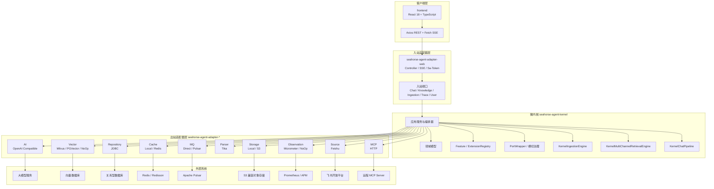
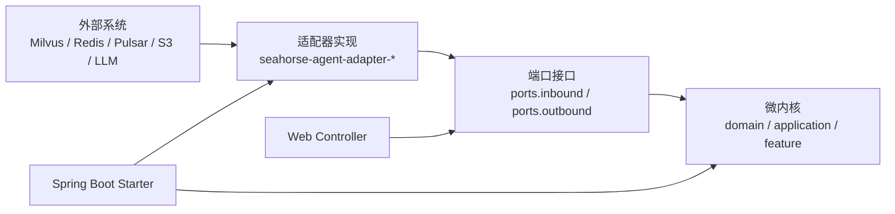
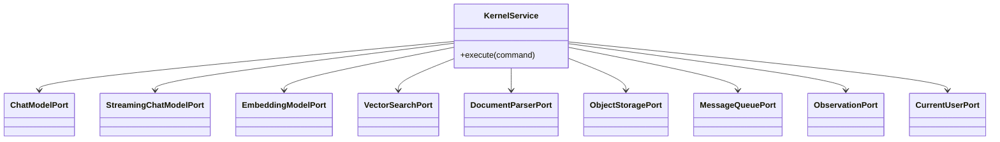
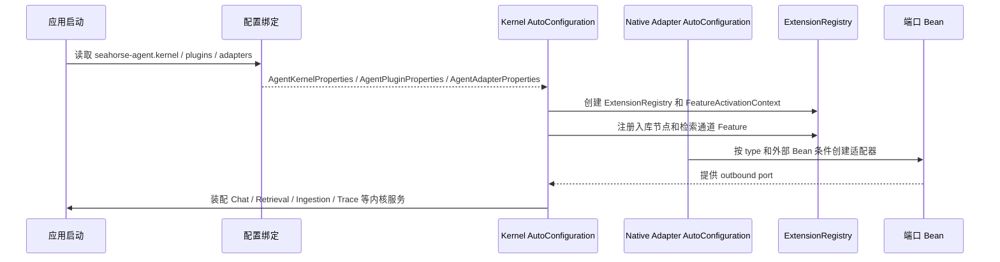
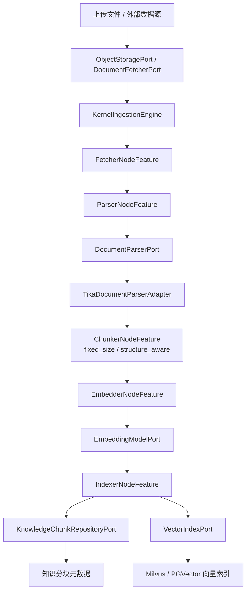
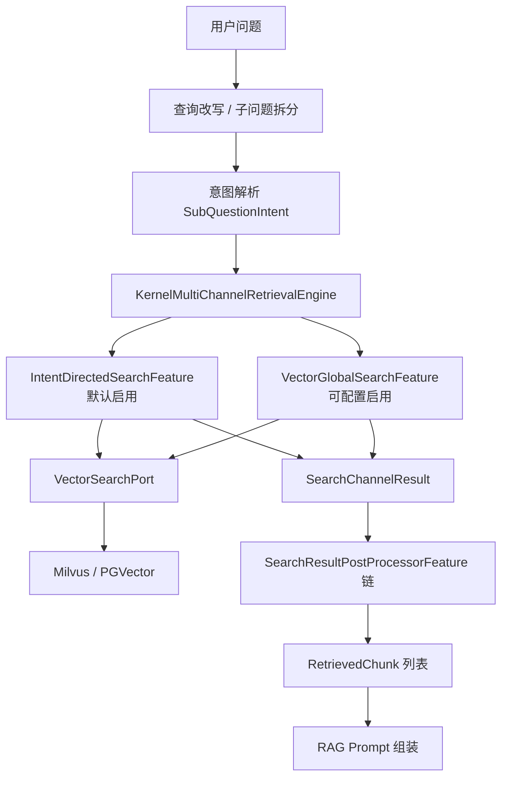
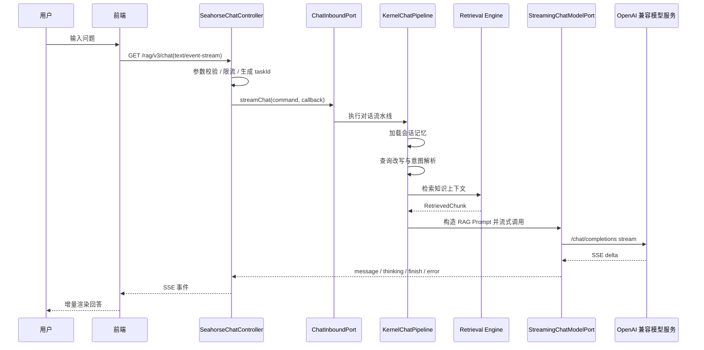
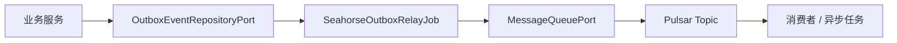
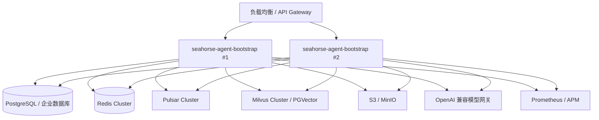

# 企业级可插拔 RAG 架构设计

## 1. 背景与目标

Seahorse Agent 面向企业知识问答与智能体应用场景，核心目标不是把所有能力固化在一个单体服务中，而是以 `seahorse-agent-kernel` 微内核承载稳定业务规则，通过 `seahorse-agent-adapter-*` 适配器模块接入模型、向量库、缓存、消息队列、对象存储、文档解析、数据源、MCP 工具和可观测系统。

本文档基于当前项目结构、README 与现有架构文档，给出一套可落地的企业级架构设计方案。设计重点包括：

- 在 Clean Architecture 约束下保持内核稳定，外部实现通过端口接口接入。
- 支持适配器模块独立开发、替换与部署组合，降低企业环境差异带来的集成成本。
- 支持文档解析、知识入库、多路检索、RAG 对话、Trace 观测、权限隔离等完整业务链路。
- 为企业级性能、稳定性、安全、治理和后续混合检索增强提供清晰演进路径。

## 2. 设计原则

### 2.1 微内核优先

`seahorse-agent-kernel` 是系统的稳定中心，只保留领域模型、入站端口、出站端口、应用服务、Feature 扩展点和核心编排逻辑。内核不直接依赖 Spring、Milvus、Redis、Pulsar、S3、Tika、OpenAI SDK 等外部实现，避免业务规则随基础设施变化而频繁震荡。

### 2.2 端口适配器解耦

所有外部能力通过端口接口进入内核：

- 模型能力：`ChatModelPort`、`StreamingChatModelPort`、`EmbeddingModelPort`、`RerankModelPort`、`ModelProviderPort`、`ModelHealthPort`。
- 检索能力：`VectorSearchPort`、`VectorIndexPort`、`VectorCollectionAdminPort`、`RetrievalContextFormatPort`。
- 知识能力：`KnowledgeBaseRepositoryPort`、`KnowledgeDocumentRepositoryPort`、`KnowledgeChunkRepositoryPort`、`KnowledgeBaseQueryPort`。
- 入库能力：`DocumentFetcherPort`、`DocumentParserPort`、`IngestionTaskRepositoryPort`、`PipelineDefinitionRepositoryPort`。
- 基础设施：`KeyValueCachePort`、`MessageQueuePort`、`ObjectStoragePort`、`ObservationPort`、`CurrentUserPort`、`StreamTaskPort`。

适配器只依赖端口契约并实现端口，不反向污染内核。

### 2.3 可插拔与配置优先

适配器选择优先由配置驱动，当前通过 Spring Boot AutoConfiguration、`@ConditionalOnProperty`、`@ConditionalOnBean`、`@ConditionalOnMissingBean` 完成运行时装配。企业部署可以按环境选择 local/noop、Redis、Pulsar、Milvus、PGVector、S3、Micrometer 等实现。

### 2.4 企业级渐进落地

设计允许从低成本本地开发形态逐步升级到企业生产形态：

- 本地开发：local cache、direct mq、local storage、noop vector 或单机 PGVector。
- 测试集成：Redis、Pulsar、Milvus、JDBC repository、OpenAI 兼容模型服务。
- 生产运行：Redis 集群、Pulsar 集群、Milvus/PGVector 高可用、S3 兼容对象存储、Micrometer 指标、统一鉴权与审计。

## 3. 总体架构



模块职责如下：

| 层级 | 模块 | 主要职责 |
| --- | --- | --- |
| 启动层 | `seahorse-agent-bootstrap` | Spring Boot 启动入口、应用配置、运行时组装入口 |
| 自动装配层 | `seahorse-agent-spring-boot-starter` | 装配内核 Bean、Feature、原生适配器 Bean 和默认降级实现 |
| 微内核层 | `seahorse-agent-kernel` | 领域模型、端口接口、应用服务、入库引擎、检索引擎、对话流水线、插件扩展 |
| 入站适配器 | `seahorse-agent-adapter-web` | REST/SSE 控制器、Sa-Token 当前用户、流式回调适配 |
| 出站适配器 | `seahorse-agent-adapter-*` | AI、缓存、MQ、存储、向量库、解析器、仓储、观测、数据源、MCP 等外部实现 |
| 前端 | `frontend` | 知识库、文档、聊天、Trace、用户、设置、入库流水线等管理界面 |

## 4. Clean Architecture 分层设计

### 4.1 依赖规则

Clean Architecture 在 Seahorse Agent 中的核心规则是：依赖只能由外向内流动，内核不感知外部实现。



落地约束：

- 内核新增业务能力时，先定义端口和领域对象，再由适配器实现外部访问。
- 适配器可以依赖第三方 SDK，内核不能依赖第三方基础设施 SDK。
- Web 层负责协议转换、参数校验、SSE 回调和认证上下文，不承载核心业务规则。
- 自动装配层负责 Bean 选择和默认实现，不把业务分支写入配置类。

### 4.2 入站端口

入站端口表示外部调用内核的业务入口，典型端口包括：

- `ChatInboundPort`：流式对话、任务停止。
- `KnowledgeBaseInboundPort`、`KnowledgeDocumentInboundPort`、`KnowledgeChunkInboundPort`：知识库、文档和分块管理。
- `IngestionTaskInboundPort`、`IngestionPipelineInboundPort`：入库任务与入库流水线。
- `RagTraceInboundPort`：RAG Trace 查询。
- `AuthInboundPort`、`UserInboundPort`：认证与用户管理。

### 4.3 出站端口

出站端口表示内核需要访问但不应直接依赖的能力。每类能力都可以有多个适配器实现。



## 5. 模块化与可插拔适配器设计

### 5.1 适配器矩阵

| 能力 | 端口 | 当前适配器 | 配置入口 | 生产建议 |
| --- | --- | --- | --- | --- |
| AI 模型 | `ChatModelPort`、`StreamingChatModelPort`、`EmbeddingModelPort`、`RerankModelPort` | `OpenAiCompatibleModelAdapter` | `seahorse-agent.adapters.ai.type=openai-compatible` | 接入企业统一模型网关或 OpenAI 兼容私有模型服务 |
| 缓存/协调 | `KeyValueCachePort`、`DistributedSemaphorePort` | Local、Redis/Redisson | `seahorse-agent.adapters.cache.type=local/redis` | 生产使用 Redis，隔离命名空间并设置 TTL 策略 |
| 流式任务状态 | `StreamTaskPort` | Local、Redis | `seahorse-agent.adapters.stream-task.type=redis` | 多实例部署使用 Redis，确保 stop 任务跨节点生效 |
| 消息队列 | `MessageQueuePort` | Direct、Pulsar | `seahorse-agent.adapters.mq.type=direct/pulsar` | 生产使用 Pulsar + Outbox Relay |
| 对象存储 | `ObjectStoragePort` | Local、S3 | `seahorse-agent.adapters.storage.type=local/s3` | 生产使用 S3 兼容存储，按租户/知识库分桶或分前缀 |
| 向量数据库 | `VectorSearchPort`、`VectorIndexPort`、`VectorCollectionAdminPort` | Milvus、PGVector、NoOp | `seahorse-agent.adapters.vector.type=milvus/pgvector/noop` | 大规模检索用 Milvus，中小规模或数据库优先场景用 PGVector |
| 文档解析 | `DocumentParserPort` | Tika | `seahorse-agent.adapters.parser.type=tika` | 使用独立解析资源池，限制文件大小和解析耗时 |
| 关系仓储 | 多个 Repository Port | JDBC | `seahorse-agent.adapters.repository.type=jdbc` | 使用 PostgreSQL 或企业标准数据库，配合迁移脚本 |
| 可观测 | `ObservationPort` | Micrometer、NoOp | `seahorse-agent.adapters.observation.type=micrometer/noop` | 生产启用 Micrometer 并接 Prometheus/APM |
| 当前用户 | `CurrentUserPort` | Sa-Token、Spring Header | `seahorse-agent.auth.current-user=sa-token/spring-header` | 生产默认 Sa-Token，可通过网关透传用户身份 |
| 数据源 | `DocumentFetcherPort` | Local、Feishu | `seahorse-agent.adapters.source.feishu.*` | 飞书等企业数据源以独立适配器接入 |
| MCP 工具 | `McpToolRegistryPort`、`McpParameterExtractionPort` | MCP HTTP | `seahorse-agent.adapters.mcp.*` | 工具服务独立部署，限制超时、权限和参数范围 |

### 5.2 独立开发与替换规范

新增适配器建议按以下规范实施：

1. 新建 `seahorse-agent-adapter-{capability}-{provider}` 模块。
2. 依赖 `seahorse-agent-kernel`，实现对应 outbound port。
3. 将第三方 SDK、序列化、重试、鉴权、连接池等实现细节封装在适配器内部。
4. 提供独立属性类，例如 `XxxAdapterProperties`，使用 `seahorse-agent.adapters.{capability}` 前缀。
5. 提供 AutoConfiguration，并使用 `@ConditionalOnProperty` 控制启用，使用 `@ConditionalOnMissingBean` 保持用户自定义 Bean 的优先级。
6. 编写端口契约测试、适配器单元测试和最小集成测试。

适配器替换示例：

```java
@Bean
@ConditionalOnProperty(prefix = "seahorse-agent.adapters.vector", name = "type", havingValue = "enterprise-vector")
@ConditionalOnMissingBean(VectorSearchPort.class)
public EnterpriseVectorAdapter enterpriseVectorAdapter(EnterpriseVectorClient client) {
    return new EnterpriseVectorAdapter(client);
}
```

### 5.3 Feature 扩展点

内核通过 `AgentFeature`、`ExtensionRegistry` 和 `FeatureActivationContext` 管理扩展点。当前已落地的典型扩展包括：

- 入库节点：`FetcherNodeFeature`、`ParserNodeFeature`、`ChunkerNodeFeature`、`EmbedderNodeFeature`、`IndexerNodeFeature`、`EnhancerNodeFeature`、`EnricherNodeFeature`。
- 检索通道：`IntentDirectedSearchFeature`、`VectorGlobalSearchFeature`。
- 检索后处理：`SearchResultPostProcessorFeature` 接口已存在，可用于后续融合、去重、rerank 等策略扩展。

## 6. 运行时装配机制

### 6.1 装配流程



当前运行时装配以启动期配置为主，能够根据配置和类路径选择不同 Bean。对于企业要求的“运行时动态切换”，建议分两层理解：

- **当前已支持**：启动期按环境动态装配不同适配器；业务 Feature 可通过 `seahorse-agent.plugins.enabled-features` 控制激活状态；`@ConditionalOnMissingBean` 支持企业自定义 Bean 覆盖默认实现。
- **规划/扩展方向**：接入配置中心后，对可安全热切换的 Feature 开关、检索策略参数、topK、超时、限流阈值做动态刷新；对有连接状态的底层适配器采用蓝绿实例或滚动重启，不建议在请求中途强行替换。

### 6.2 核心配置模型

| 配置类 | 前缀 | 职责 |
| --- | --- | --- |
| `AgentKernelProperties` | `seahorse-agent.kernel` | 内核开关、运行模式、扩展解析超时、默认适配器缺失策略、边界检查 |
| `AgentPluginProperties` | `seahorse-agent.plugins` | Feature 默认启用策略、指定 Feature 开关、Feature 自定义配置 |
| `AgentAdapterProperties` | `seahorse-agent.adapters` | 适配器选择映射与适配器自定义配置 |
| `McpHttpAdapterProperties` | `seahorse-agent.adapters.mcp` | MCP HTTP 远程 Server、调用超时、启用状态 |
| `FeishuDocumentSourceProperties` | `seahorse-agent.adapters.source.feishu` | 飞书数据源地址、凭证、下载路径与重试参数 |

### 6.3 企业生产配置示例

```yaml
seahorse-agent:
  kernel:
    enabled: true
    mode: kernel
    extension-resolve-timeout: 50ms
    fail-fast-on-missing-default: true
    strict-boundary-check: true

  adapters:
    ai:
      type: openai-compatible
      base-url: ${AI_BASE_URL:https://api.openai.com/v1}
      api-key: ${AI_API_KEY}
      chat-model: ${AI_CHAT_MODEL}
      embedding-model: ${AI_EMBEDDING_MODEL}
      rerank-model: ${AI_RERANK_MODEL:}

    cache:
      type: redis

    stream-task:
      type: redis

    mq:
      type: pulsar
      outbox:
        relay:
          enabled: true
          batch-size: 50

    storage:
      type: s3

    parser:
      type: tika

    repository:
      type: jdbc

    vector:
      type: milvus
      collection-name: seahorse_knowledge
      dimension: 1024
      metric-type: COSINE

    observation:
      type: micrometer

    source:
      feishu:
        base-url: https://open.feishu.cn
        app-id: ${FEISHU_APP_ID}
        app-secret: ${FEISHU_APP_SECRET}
        max-attempts: 2
        retry-backoff-millis: 200

    mcp:
      enabled: true
      call-timeout: 30s
      servers:
        - name: enterprise-tools
          url: http://mcp-server:8080/mcp
          enabled: true

  auth:
    current-user: sa-token

  plugins:
    default-enabled: true
    enabled-features:
      IntentDirectedSearch: true
      VectorGlobalSearch: false
    feature-settings:
      retrieval:
        topK: 5
```

### 6.4 本地开发配置示例

```yaml
seahorse-agent:
  kernel:
    enabled: true
    mode: kernel

  adapters:
    ai:
      type: openai-compatible
      base-url: http://localhost:11434/v1
      api-key: local-dev
      chat-model: local-chat
      embedding-model: local-embedding
    cache:
      type: local
    mq:
      type: direct
    storage:
      type: local
      local:
        root: ${java.io.tmpdir}/seahorse-agent-storage
    parser:
      type: tika
    repository:
      type: jdbc
    vector:
      type: pgvector
      dimension: 1024
    observation:
      type: noop

  auth:
    current-user: spring-header
```

## 7. 核心业务链路

### 7.1 文档解析与知识入库



链路说明：

1. Web 层或数据源适配器创建入库任务，原始文件进入本地或 S3 对象存储。
2. `KernelIngestionEngine` 根据流水线定义寻找起始节点，并按 `nextNodeId` 串联执行。
3. `parser` 节点调用 `DocumentParserPort`，当前 Tika 适配器支持 PDF、Office、HTML、Markdown、TXT 等常见格式解析。
4. `chunker` 节点将文本切分为分块，默认策略面向向量化召回。
5. `embedder` 节点通过 OpenAI 兼容模型生成 embedding。
6. `indexer` 节点写入 `KnowledgeChunkRepositoryPort` 和 `VectorIndexPort`，完成元数据和向量索引落库。

企业落地建议：

- 文件上传前限制大小、类型和租户配额，避免解析资源被异常文件耗尽。
- 解析、embedding、索引写入建议拆分线程池或任务队列，防止慢模型调用阻塞 Web 请求。
- 入库任务状态、节点日志和失败原因必须持久化，支持断点排查和失败重试。
- 对外部数据源如飞书，使用数据源适配器实现 `DocumentFetcherPort`，不要把数据源协议写入内核。

### 7.2 多路检索与检索增强

`KernelMultiChannelRetrievalEngine` 是当前多路检索编排核心。它负责构建 `SearchContext`、从 `ExtensionRegistry` 获取已激活的 `SearchChannelFeature`、并行执行检索通道、合并结果，并按顺序执行 `SearchResultPostProcessorFeature` 后处理链。



当前已实现能力：

- 多路检索通道抽象：`SearchChannelFeature`。
- 意图定向检索：`IntentDirectedSearchFeature`。
- 全局向量检索：`VectorGlobalSearchFeature`，默认可通过 Feature 开关控制。
- 多通道并行编排：`KernelMultiChannelRetrievalEngine` 使用检索线程池并行执行已激活通道。
- 后处理扩展点：`SearchResultPostProcessorFeature` 已定义，支持后续策略插件化。

规划/扩展方向：

- **RRF 融合**：新增 `RrfFusionPostProcessorFeature`，基于多通道排名做 reciprocal rank fusion，避免单一通道分数不可比导致召回偏置。
- **BM25 检索**：新增关键词检索通道，例如 `Bm25SearchChannelFeature`，可接 Elasticsearch、OpenSearch、Lucene 或数据库全文索引。
- **向量 + BM25 混合检索**：通过 `KernelMultiChannelRetrievalEngine` 并行执行向量通道与关键词通道，再由 RRF 或加权融合后处理器统一排序。
- **元数据过滤**：在 `SearchContext` 和向量查询参数中补充租户、知识库、文档类型、时间范围、权限标签等过滤条件，确保召回结果满足权限与治理要求。
- **Reranker**：当前 AI 适配器已暴露 `RerankModelPort`，后续应通过 `SearchResultPostProcessorFeature` 接入 rerank 处理器，对候选 chunk 做模型重排。

以上能力的接口、数据结构、适配器改造、配置示例、表结构和分阶段实施计划见《[混合检索与重排详细设计.md](./混合检索与重排详细设计.md)》。

### 7.3 流式对话链路



关键点：

- `SeahorseChatController` 使用 SSE 返回流式回答，并支持停止任务。
- `RateLimiterPort` 可插拔实现聊天限流。
- `StreamTaskPort` 在单机场景可使用 local，多实例场景应使用 Redis 实现。
- `KernelRagTraceRecorder` 记录检索、Prompt、模型调用等阶段，为质量分析和故障定位提供依据。

### 7.4 Outbox 与消息可靠性

当前 MQ 适配器通过 `ReliableMessageQueueAdapter` 包装 Direct 或 Pulsar。生产环境建议启用 Outbox Relay：



落地要求：

- 业务事务先写 Outbox，再由 Relay 批量投递，降低消息丢失风险。
- Relay 使用批量大小、重试次数和死信策略控制吞吐与失败隔离。
- Direct MQ 只建议用于本地开发和单进程测试，不作为生产可靠消息方案。

## 8. 企业级特性实施方案

### 8.1 性能优化

| 场景 | 实施方案 |
| --- | --- |
| 流式对话 | 使用 SSE 增量返回；模型调用设置超时；任务状态放入 `StreamTaskPort` 以支持取消 |
| 多路检索 | `KernelMultiChannelRetrievalEngine` 并行执行检索通道；按通道设置 topK 和超时 |
| 文档入库 | 解析、embedding、索引写入分阶段执行；大文件限制大小；批量 embedding；向量批量写入 |
| 向量检索 | Milvus 使用合适 dimension、metric、索引类型和 collection；PGVector 适合中小规模部署 |
| 缓存 | Redis 缓存模型列表、热点知识库元数据、权限信息和短期任务状态 |
| 消息队列 | Pulsar 承接异步入库、刷新、清理和通知任务；Outbox 提升可靠性 |

### 8.2 可观测性

可观测应覆盖指标、日志、Trace 和健康检查：

- 指标：通过 `ObservationPort` 接入 Micrometer，记录模型耗时、embedding 耗时、检索耗时、入库节点耗时、错误率和队列积压。
- RAG Trace：使用 `KernelRagTraceRecorder` 持久化查询改写、意图解析、召回结果、Prompt 片段、模型调用阶段。
- 插件健康：`FeatureHealthAggregator` 聚合 `AgentFeature` 和 `AdapterHealthIndicatorPort` 状态。
- 日志：关键业务日志必须携带 tenantId、userId、conversationId、traceId、taskId，便于跨服务排查。

建议指标：

| 指标 | 维度 |
| --- | --- |
| `rag_chat_latency` | model、tenant、success |
| `rag_retrieval_latency` | channel、vectorType、success |
| `rag_embedding_latency` | model、batchSize、success |
| `rag_ingestion_node_latency` | nodeType、pipelineId、success |
| `rag_model_error_total` | provider、model、errorCode |
| `rag_outbox_pending` | topic、status |

### 8.3 安全认证与权限隔离

当前项目提供 Sa-Token 与 Spring Header 当前用户适配方式。企业生产建议：

- API 入口统一使用 Sa-Token 或企业网关认证，内部通过 `CurrentUserPort` 获取当前用户。
- 知识库、文档、分块、Trace、会话均需要绑定 tenantId/userId/role 信息。
- 检索前在 `SearchContext` 中注入权限范围，向量检索与元数据仓储查询都必须执行权限过滤。
- 模型 API Key、飞书 App Secret、S3 Secret、数据库密码统一由密钥系统或环境变量注入，不写入仓库配置。
- MCP 工具调用需要白名单、参数校验、超时控制和审计日志，防止越权调用外部工具。

### 8.4 数据治理

企业级 RAG 的治理对象包括原始文件、解析文本、分块、embedding、向量索引、会话、Trace 和审计记录。

治理方案：

- 数据分层：对象存储保存原始文件，关系库保存文档/分块元数据，向量库保存 embedding 和检索字段。
- 生命周期：支持文档刷新、删除、重建索引、过期清理和归档。
- 一致性：文档删除时必须同步删除对象存储、元数据和向量索引；失败时写入补偿任务。
- 审计：记录上传、解析、索引、检索、问答、反馈、删除等关键事件。
- 备份：关系库、对象存储和向量库分别制定备份恢复策略，恢复后用文档版本校验索引一致性。

### 8.5 稳定性与降级

| 风险 | 方案 |
| --- | --- |
| 模型服务超时 | 设置 OkHttp 超时、模型健康检查、失败提示、可选备用模型 |
| 向量库不可用 | 降级为无检索回答或提示知识库暂不可用；保留 NoOpVectorStoreAdapter 用于测试 |
| Redis 不可用 | 单实例可临时回退 local；生产应优先恢复 Redis，避免多实例任务取消失效 |
| Pulsar 不可用 | Outbox 暂存待投递事件；Relay 恢复后补发 |
| 文档解析失败 | 节点级失败日志、失败重试、隔离异常文件 |
| Feature 异常 | `KernelMultiChannelRetrievalEngine` 对失败通道按空结果降级，对失败后处理器跳过 |

### 8.6 横切治理

`PortWrapper` / `PortWrapperChain` 适合承载横切能力，不应散落在业务代码中：

- 限流：模型调用、embedding、检索、上传和 MCP 调用。
- 重试：仅对幂等读请求或明确可重试的外部调用生效。
- 熔断：对模型、向量库、MCP Server 等外部依赖设置错误率和慢调用阈值。
- 审计：对敏感端口调用记录用户、资源、参数摘要和结果状态。
- 观测：统一记录端口调用耗时、异常和标签。

## 9. 部署指南

### 9.1 本地开发部署

推荐组合：

- 后端：`seahorse-agent-bootstrap`
- 仓储：本地 PostgreSQL 或开发库
- 向量：PGVector 或 NoOp
- MQ：Direct
- Cache：Local
- Storage：Local
- Observation：NoOp
- AI：本地 OpenAI 兼容模型服务或测试模型网关

适用目标：开发调试、单元测试、接口联调。

### 9.2 集成测试部署

推荐组合：

- Cache：Redis/Redisson
- MQ：Pulsar
- Vector：Milvus 或 PGVector
- Storage：MinIO/S3
- Parser：Tika
- Observation：Micrometer
- AI：OpenAI 兼容测试模型服务

项目中可参考以下资源启动基础设施：

- `resources/docker/milvus-stack-2.6.6.compose.yaml`
- `resources/docker/pulsar-stack-3.1.3.compose.yaml`

### 9.3 生产部署建议



生产要求：

- 应用服务无状态化，任务状态、会话、缓存、队列和文件全部外置。
- 多实例部署必须使用 Redis `StreamTaskPort`，保证停止流式任务跨节点生效。
- 使用 Pulsar 和 Outbox Relay 承接异步任务，避免同步请求承载长耗时链路。
- 向量库和关系库按租户、知识库、文档维度建立索引或分区策略。
- 模型网关统一限流、鉴权、审计和成本统计。
- 通过探针检查数据库、Redis、Pulsar、向量库、对象存储、模型服务和 MCP Server。

### 9.4 Kubernetes 部署要点

- ConfigMap：非敏感配置，例如适配器 type、模型名、collection 名、feature 开关。
- Secret：AI API Key、数据库密码、Redis 密码、S3 Secret、飞书凭证。
- Deployment：后端服务水平扩展，设置 CPU/内存 requests 和 limits。
- HPA：以 CPU、请求延迟、队列积压或自定义指标扩缩容。
- Ingress：SSE 接口需要关闭过短代理超时，避免流式回答被中断。
- PodDisruptionBudget：保障滚动升级期间至少保留可用实例。
- CronJob/Worker：若后续将 Outbox Relay 或入库任务拆为独立进程，可独立扩缩容。

## 10. 最佳实践

### 10.1 内核开发

- 新业务规则优先放入 `seahorse-agent-kernel` 的 application/domain/feature。
- 所有外部访问先抽象端口，再实现适配器。
- 内核测试使用 fake/noop port，不依赖真实外部服务。
- 不在内核中读取 Spring 配置、环境变量或第三方 SDK 对象。

### 10.2 适配器开发

- 适配器模块只负责协议、SDK、序列化、连接池、重试和错误映射。
- 使用 `@ConditionalOnMissingBean` 给企业自定义实现留出覆盖空间。
- 适配器异常应转换成内核可理解的业务异常或端口异常。
- 对网络调用必须设置超时，避免线程池被无限占用。

### 10.3 RAG 质量优化

- 入库阶段保留文档标题、层级、来源、更新时间、权限标签等元数据。
- 检索阶段先保证权限过滤，再做召回排序。
- topK、chunk size、overlap、embedding 模型和 rerank 策略应按知识库类型调优。
- 使用 RAG Trace 和用户反馈闭环优化意图解析、召回和 Prompt。

### 10.4 企业演进路线

| 阶段 | 目标 | 关键工作 |
| --- | --- | --- |
| P0 | 单环境可运行 | local/direct/noop 组合，打通上传、入库、检索、对话 |
| P1 | 集成环境可验证 | 接入 Redis、Pulsar、Milvus/PGVector、S3、Micrometer |
| P2 | 生产可用 | Sa-Token、权限隔离、Outbox、Trace、监控告警、备份恢复 |
| P3 | 检索增强 | 落地 RRF、BM25、元数据过滤、reranker 和检索质量评估 |
| P4 | 企业智能体平台 | MCP 工具治理、多数据源同步、模型路由、成本治理、多租户运营 |

## 11. 验收清单

### 11.1 架构验收

- `seahorse-agent-kernel` 不依赖外部基础设施 SDK。
- 新能力通过端口接口进入内核，通过适配器实现外部系统访问。
- `seahorse-agent-adapter-*` 模块可以按需引入、替换或禁用。
- 自动装配支持配置选择与用户自定义 Bean 覆盖。
- README 中标注的规划能力在设计文档中明确区分“已实现”和“规划/扩展方向”。

### 11.2 运行验收

- 本地环境可以使用 local/direct/noop 或 PGVector 组合启动。
- 生产环境可以使用 Redis、Pulsar、S3、Milvus、Micrometer、OpenAI 兼容模型服务组合启动。
- SSE 流式对话支持正常完成、异常返回和任务停止。
- 文档入库失败能够记录节点级原因，并支持排查或重试。
- RAG Trace 可以还原一次问答的关键阶段。

### 11.3 企业治理验收

- 所有敏感密钥通过环境变量或 Secret 注入。
- 知识库和检索结果具备租户、用户或角色维度的隔离方案。
- 外部依赖均有超时、错误处理和降级策略。
- 关键链路具备指标、日志和 Trace。
- 数据删除、刷新、重建索引和备份恢复有明确流程。

## 12. 结论

Seahorse Agent 当前已经具备企业级 RAG 系统的核心架构基础：微内核、Clean Architecture、端口适配器、Spring Boot 自动装配、可插拔适配器、多路检索编排、文档入库流水线、OpenAI 兼容模型接入、向量检索、SSE 流式对话和 RAG Trace。

后续演进应继续保持内核稳定，把变化集中在适配器和 Feature 扩展中。混合检索、RRF、BM25、元数据过滤和 reranker 应作为检索增强方向，通过 `SearchChannelFeature` 和 `SearchResultPostProcessorFeature` 插件化落地，避免破坏当前多路检索编排模型。
