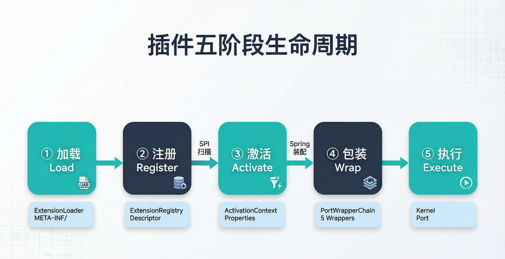
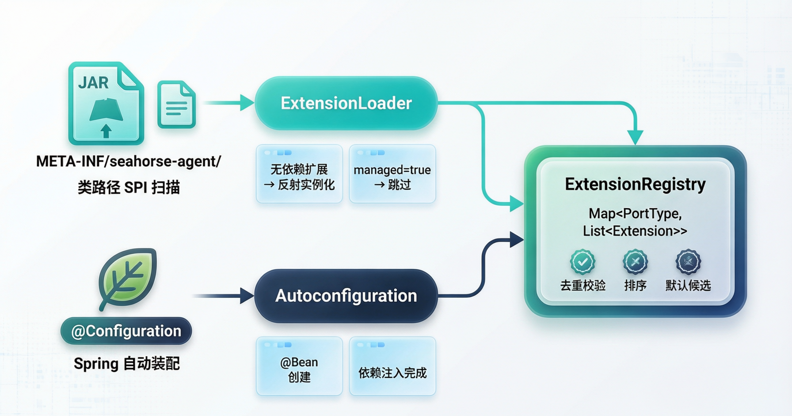
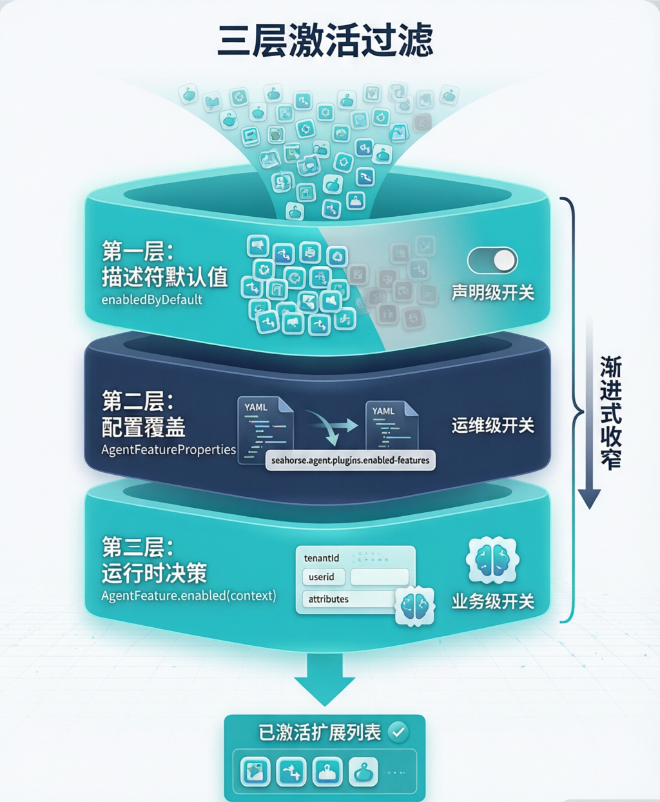
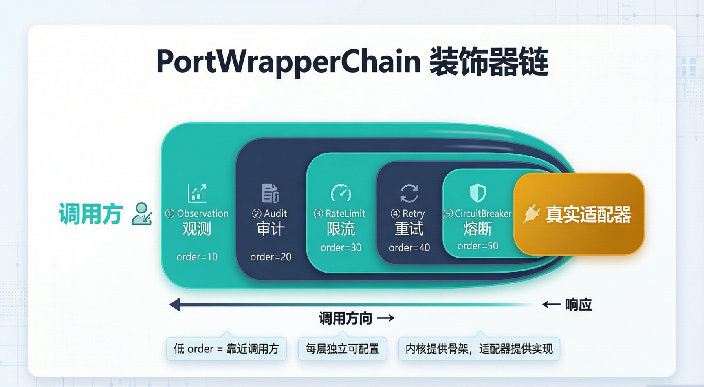

# Seahorse Agent 微内核插件系统：从 ExtensionRegistry 到 PortWrapperChain 的可插拔架构

> **导读**｜企业级 AI Agent 平台面临一个核心矛盾：内核需要稳定，但能力边界必须持续扩展。向量库要换、搜索通道要加、后处理链要调、横切关注点（熔断、限流、审计）要按需叠加——如果这些都写死在内核里，系统很快会变成"改一处动全身"的泥球。Seahorse Agent 的答案是**微内核 + 插件扩展**：内核只定义端口契约和扩展点，所有具体能力通过 SPI 声明、双轨注册、三层激活、装饰器包装后注入运行。本文将从插件生命周期、双轨注册、三层激活、装饰器链、Feature SPI 和诊断体系六个维度，拆解这套"内核稳定、外围可换"的工程实现。

---

## 📌 一、为什么需要微内核？

### 1.1 企业级 Agent 的"扩展困境"

想象一个场景：你的 RAG 系统上线后，产品团队提出了一系列需求——

- "搜索通道要加一个意图导向检索，和现有的向量检索并行跑"
- "后处理链要接 Jina Rerank，再做一层 RRF 融合"
- "不同租户要能开关不同的扩展"
- "所有端口调用都要加熔断、限流、审计，但要能按端口独立配置"

如果这些能力都硬编码在内核里，每一次变更都是一次发版风险。更棘手的是，不同客户的环境差异巨大：A 客户用 Milvus + Redis + Pulsar，B 客户用 PGVector + Caffeine + 直连——内核不可能预知所有组合。

### 1.2 微内核的设计哲学

Seahorse Agent 的选择是：**内核只做编排，不做实现**。

这和操作系统的微内核思想一脉相承——Linux 内核把驱动放在用户态，Seahorse Agent 把向量库、缓存、搜索通道、后处理器、MCP 工具、记忆治理策略全部放在"适配器态"。内核只关心三件事：

1. **端口契约**——定义"做什么"，不关心"怎么做"
2. **扩展注册表**——知道"谁做了什么"，按规则筛选激活
3. **装饰器链**——在端口调用前后叠加横切关注点

> **💡 核心理念**
> 
> 内核不依赖 Spring、不依赖任何适配器 SDK。`ExtensionRegistry`、`ExtensionLoader`、`AgentFeature`、`PortWrapperChain` 全部是纯 Java 实现。Spring 只在自动装配阶段出现，把 DI 完成的 Bean 注入到同一个注册表中。

---

## 📌 二、插件的五阶段生命周期

整个插件系统围绕一条清晰的生命周期主线运转：**加载 → 注册 → 激活 → 包装 → 执行**。



| 阶段                | 触发时机  | 核心组件                       | 关键动作                                                     |
| ----------------- | ----- | -------------------------- | -------------------------------------------------------- |
| **① 加载 Load**     | 应用启动  | `ExtensionLoader`          | 扫描 `META-INF/seahorse-agent/` 属性文件，反射实例化非托管扩展            |
| **② 注册 Register** | 应用启动  | `DefaultExtensionRegistry` | 校验类型、去重、按 order 排序，统一存入 `Map<PortType, List<Extension>>` |
| **③ 激活 Activate** | 每次请求  | `FeatureActivationContext` | 三层过滤（描述符默认值 → 配置覆盖 → 运行时决策），输出已激活列表                      |
| **④ 包装 Wrap**     | 端口创建时 | `PortWrapperChain`         | 按 order 叠加 5 层装饰器（观测 → 审计 → 限流 → 重试 → 熔断）                |
| **⑤ 执行 Execute**  | 运行时   | Kernel                     | 调用方透过装饰器链访问真实适配器，横切关注点自动生效                               |

这个设计的关键在于**阶段分离**：加载和注册是启动时的一次性动作，激活是每请求的动态决策，包装是端口级的静态装配，执行是纯运行时行为。每个阶段都可以独立测试、独立替换。

---

## 📌 三、ExtensionLoader：类路径 SPI 的重新设计

### 3.1 为什么不用 Java SPI？

Java 原生的 `ServiceLoader` 有两个问题：第一，它只能按接口加载实现列表，没有"默认实现"、"排序"、"能力标签"的概念；第二，它的实例化策略是非黑即白的——要么全由 SPI 创建，要么全不管。在 Spring 环境下，大量适配器需要依赖注入，`ServiceLoader` 无法处理。

Seahorse Agent 设计了自己的 SPI 协议：在 `META-INF/seahorse-agent/{端口接口全限定名}` 路径下放置属性文件，声明扩展的元数据。

### 3.2 属性文件协议

以 `ChatModelPort` 为例，适配器模块在 classpath 中放置文件 `META-INF/seahorse-agent/com.miracle.ai.seahorse.agent.ports.outbound.ai.ChatModelPort`：

```properties
# 默认扩展名
default=openai-compatible

# 扩展声明：name.class / name.order / name.managed / name.capabilities
openai-compatible.class=com.miracle.ai.seahorse.agent.adapters.ai.openai.OpenAiCompatibleModelAdapter
openai-compatible.managed=true
openai-compatible.order=100

# 非托管扩展（无依赖，直接反射实例化）
local-fallback=com.miracle.ai.seahorse.agent.adapters.ai.local.LocalModelAdapter
local-fallback.order=200
local-fallback.capabilities=chat,fallback
```

| 属性键                         | 含义                                  | 默认值                   |
| --------------------------- | ----------------------------------- | --------------------- |
| `default`                   | 哪个扩展是默认实现                           | 无                     |
| `{name}.class`              | 实现类全限定名                             | `{name}={class}` 简写形式 |
| `{name}.order`              | 排序权重，越小越靠前                          | `0`                   |
| `{name}.managed`            | 是否由 Spring 容器管理（`true` 则 SPI 加载器跳过） | `false`               |
| `{name}.capabilities`       | 能力标签，逗号分隔                           | 空                     |
| `{name}.enabled-by-default` | 默认是否启用                              | `true`                |

### 3.3 加载算法

```java
// ExtensionLoader 核心逻辑（简化）
public <T> List<ExtensionLoadDiagnostic> load(
        Class<T> portType, FeatureType featureType, ExtensionRegistry registry) {

    // 1. 扫描所有 JAR 中的 META-INF/seahorse-agent/{portType}
    Enumeration<URL> resources = classLoader.getResources(
        "META-INF/seahorse-agent/" + portType.getName());

    for (URL url : Collections.list(resources)) {
        Properties props = loadProperties(url);

        // 2. 提取扩展名（去除已知后缀）
        Set<String> names = extractExtensionNames(props);

        for (String name : names) {
            // 3. 托管扩展 → 跳过，等 Spring 装配
            if (props.getBoolean(name + ".managed", false)) {
                continue;
            }

            // 4. 非托管扩展 → 反射实例化
            Class<?> implClass = Class.forName(props.getProperty(name + ".class"));
            T instance = (T) implClass.getDeclaredConstructor().newInstance();

            // 5. 构建描述符并注册
            ExtensionDescriptor descriptor = new ExtensionDescriptor(
                name, portType, featureType,
                props.getInteger(name + ".order", 0),
                name.equals(props.getProperty("default")),
                parseCapabilities(props.getProperty(name + ".capabilities")),
                props.getBoolean(name + ".enabled-by-default", true)
            );
            registry.register(descriptor, instance);
        }
    }
}
```

这里的关键设计是 **`managed=true` 分流**：SPI 加载器只处理零依赖的轻量扩展；需要 Spring 依赖注入的适配器声明 `managed=true`，由自动配置类在 Spring 容器启动后注册到同一个注册表。两条路径最终汇入同一个 `ExtensionRegistry`。

> **💡 设计哲学**
> 
> SPI 属性文件不是"配置文件"，而是**扩展的自声明契约**。每个适配器模块在打包时就把自己的元数据写进 classpath，运行时由加载器统一发现。这比"在中心化的配置文件里罗列所有扩展"更符合开闭原则——新增适配器只需加一个 JAR 依赖，无需修改任何中心配置。

---

## 📌 四、ExtensionRegistry：双轨注册的统一注册表



### 4.1 注册表接口

`ExtensionRegistry` 只有四个方法，却撑起了整个扩展体系的查询与注册：

```java
public interface ExtensionRegistry {

    // 获取某端口的默认实现
    <T> T getDefaultExtension(Class<T> portType);

    // 获取某端口在给定上下文下的已激活扩展列表
    <T> List<T> getActivatedExtensions(Class<T> portType, FeatureActivationContext context);

    // 启动时的全量注册快照（诊断用）
    List<ExtensionRegistration> registeredExtensions();

    // 注册一个扩展（启动阶段调用）
    void register(ExtensionDescriptor descriptor, Object instance);
}
```

注意：内核中没有任何代码调用 `applicationContext.getBean()`。注册表是内核获取扩展实现的**唯一途径**。这保证了内核与 Spring 的彻底解耦。

### 4.2 双轨注册

扩展进入注册表有两条路径：

| 路径              | 触发方                    | 适用场景                               | 关键标志                |
| --------------- | ---------------------- | ---------------------------------- | ------------------- |
| **SPI 类路径扫描**   | `ExtensionLoader`      | 无 Spring 依赖的轻量扩展（如本地缓存、Noop 实现）    | `managed=false`（默认） |
| **Spring 自动装配** | `@AutoConfiguration` 类 | 需要依赖注入的适配器（如 Milvus 客户端、Redis 连接池） | `managed=true`      |

Spring 路径的注册代码：

```java
// 自动配置中的统一注册方法
private static void register(ExtensionRegistry registry, AgentFeature feature,
                             Class<?> contractType, FeatureType featureType,
                             boolean defaultEnabled) {
    registry.register(
        new ExtensionDescriptor(
            feature.name(), contractType,
            featureType, feature.order(), defaultEnabled),
        feature  // Spring 已完成依赖注入的 Bean
    );
}
```

### 4.3 注册表的防御式设计

`DefaultExtensionRegistry` 在注册时执行严格的校验：

```java
public synchronized void register(ExtensionDescriptor descriptor, Object instance) {
    // 1. 类型校验：实例必须实现声明的端口接口
    Preconditions.checkArgument(
        descriptor.portType().isInstance(instance),
        "Extension '%s' does not implement port %s",
        descriptor.name(), descriptor.portType().getName());

    List<RegisteredExtension> list = extensions
        .computeIfAbsent(descriptor.portType(), k -> new ArrayList<>());

    // 2. 去重校验：同一端口下的扩展名必须唯一（启动即失败，而非运行时诡异行为）
    Preconditions.checkArgument(
        list.stream().noneMatch(r -> r.descriptor().name().equals(descriptor.name())),
        "Duplicate extension name '%s' for port %s",
        descriptor.name(), descriptor.portType().getName());

    list.add(new RegisteredExtension(descriptor, instance));

    // 3. 排序：按 order 升序排列，注册时排好，请求时不再排序
    list.sort(Comparator.comparingInt(r -> r.descriptor().order()));
}
```

> **💡 设计哲学**
> 
> "启动时快速失败"优于"运行时静默覆盖"。重复名称、类型不匹配等问题在注册阶段就会抛出异常，而不是等到请求时才发现"怎么调到了错误的实现"。所有公共方法都是 `synchronized` 的——注册只发生在启动阶段，锁竞争不是问题。

---

## 📌 五、三层激活过滤：从配置到运行时的渐进决策

一个端口下可能注册了 5 个扩展，但不是每个都该在每次请求中激活。Seahorse Agent 用三层过滤实现渐进式收窄：



### 5.1 第一层：描述符默认值

每个 `ExtensionDescriptor` 在注册时携带 `enabledByDefault` 标志。这是扩展作者对该扩展"是否应该默认启用"的判断。例如，`IntentDirectedSearchFeature` 默认启用，而某些实验性的后处理器可能默认关闭。

### 5.2 第二层：配置覆盖

运维人员通过 YAML 配置进行粗粒度控制：

```yaml
seahorse.agent.plugins:
  default-enabled: true          # 全局默认值
  enabled-features:
    RerankPostProcessor: true    # 显式启用
    KeywordSearch: false         # 显式关闭
    VectorGlobalSearch: true
```

解析逻辑：

```java
// AgentFeatureProperties
public boolean enabled(String name, boolean descriptorEnabledByDefault) {
    if (name == null || name.isBlank()) {
        return descriptorEnabledByDefault && defaultEnabled;
    }
    // 配置表中有显式值 → 用显式值；否则 → 描述符默认值 ∩ 全局默认值
    return enabledFeatures.getOrDefault(name, descriptorEnabledByDefault && defaultEnabled);
}
```

### 5.3 第三层：运行时决策

通过前两层过滤后，如果扩展实现了 `AgentFeature` 接口，还会调用 `feature.enabled(context)` 做最终的运行时判断：

```java
// FeatureActivationContext —— 运行时上下文
public record FeatureActivationContext(
    String tenantId,                    // 租户 ID
    String userId,                      // 用户 ID
    Map<String, Object> attributes,     // 灰度/实验属性
    AgentFeatureProperties properties   // 配置快照
) {}

// 搜索通道 Feature 的运行时决策示例
public boolean enabled(SearchContext context) {
    // 意图置信度极高时，跳过全局向量搜索，节省资源
    if (context.intentConfidence() > 0.95
            && this.channelType() == ChannelType.GLOBAL_VECTOR) {
        return false;
    }
    return true;
}
```

### 5.4 三层协同

```java
// DefaultExtensionRegistry.getActivatedExtensions() 核心逻辑
public synchronized <T> List<T> getActivatedExtensions(
        Class<T> portType, FeatureActivationContext context) {

    return extensions.getOrDefault(portType, List.of()).stream()
        // 第一层 + 第二层：配置级过滤
        .filter(r -> enabledByConfiguration(r.descriptor(), context.properties()))
        // 第三层：运行时决策
        .filter(r -> enabledByFeature(r.instance(), context))
        .map(r -> (T) r.instance())
        .toList();  // 注册时已排好序，此处保持顺序
}
```

| 层级  | 决策者        | 决策时机 | 粒度     | 典型场景               |
| --- | ---------- | ---- | ------ | ------------------ |
| 第一层 | 扩展作者       | 编码时  | 扩展级    | "这个后处理器是实验性的，默认关闭" |
| 第二层 | 运维人员       | 部署时  | 租户/全局级 | "A 租户不需要关键词搜索"     |
| 第三层 | Feature 实现 | 每次请求 | 请求级    | "意图明确时跳过全局搜索"      |

> **💡 设计哲学**
> 
> 三层过滤的本质是**关注点分离**：扩展作者管"能不能用"，运维管"让不让用"，业务逻辑管"该不该用"。每层只做自己最擅长的判断，互不越界。这使得系统在不修改代码的情况下，能适配从"单机开发"到"多租户 SaaS"的各种部署形态。

---

## 📌 六、PortWrapperChain：横切关心的装饰器链

### 6.1 问题：横切关注点的组合爆炸

企业级系统对端口调用有一系列通用要求：观测（Tracing/Metrics）、审计日志、限流、重试、熔断。如果为每个端口手动组合这些关注点，N 个端口 × M 个关注点 = N×M 种组合，维护成本爆炸。

Seahorse Agent 的解法是**装饰器链**：定义 5 个 `PortWrapper`，按 order 排序后自动叠加到所有端口上。



### 6.2 PortWrapper 接口

```java
public interface PortWrapper<T> {
    T wrap(T delegate);       // 装饰：接收内层委托，返回装饰后的代理
    String name();            // 唯一名称（用于诊断去重）
    int order();              // 排序权重（越小越靠近调用方）
    default boolean passThrough() { return false; }  // 骨架实现标记
}
```

### 6.3 五层装饰器

| 层级  | 名称                          | Order | 职责        | 当前状态                      |
| --- | --------------------------- | ----- | --------- | ------------------------- |
| ①   | `ObservationPortWrapper`    | 10    | 链路追踪、指标采集 | 内核骨架，Micrometer 适配器提供实现   |
| ②   | `AuditPortWrapper`          | 20    | 调用审计日志    | 内核骨架，待适配器实现               |
| ③   | `RateLimitPortWrapper`      | 30    | 请求限流      | 内核骨架，待适配器实现               |
| ④   | `RetryPortWrapper`          | 40    | 失败重试      | 内核骨架，Resilience4j 适配器提供实现 |
| ⑤   | `CircuitBreakerPortWrapper` | 50    | 熔断降级      | 内核骨架，Resilience4j 适配器提供实现 |

### 6.4 链的装配

```java
public class PortWrapperChain<T> {
    private final List<PortWrapper<T>> wrappers;  // 构造时按 order 排序

    public PortWrapperChain(Collection<PortWrapper<T>> wrappers) {
        this.wrappers = new ArrayList<>(wrappers);
        this.wrappers.sort(Comparator.comparingInt(PortWrapper::order));
        // 构造时诊断：检测重复名称和 order 冲突
        diagnose();
    }

    public T wrap(T delegate) {
        T result = delegate;
        // 逆序包装：order 最大的最先被 wrap（最内层）
        // order 最小的最后被 wrap（最外层，最靠近调用方）
        for (int i = wrappers.size() - 1; i >= 0; i--) {
            result = wrappers.get(i).wrap(result);
        }
        return result;
    }
}
```

**执行顺序**：当调用方发起调用时，请求依次穿过 Observation → Audit → RateLimit → Retry → CircuitBreaker → 真实适配器。响应则反向穿过各层。

这意味着：观测层能看到完整的调用耗时（包括重试），审计层能记录每次重试，限流层在重试之前生效（防止重试绕过限流），熔断层最靠近真实调用（只保护实际的外部调用）。

### 6.5 诊断与可观测

`PortWrapperChain` 在构造时自动执行诊断：

```java
private void diagnose() {
    Set<String> seen = new HashSet<>();
    for (PortWrapper<T> w : wrappers) {
        if (!seen.add(w.name())) {
            diagnostics.add(PortWrapperDiagnostic.error(
                "Duplicate wrapper name: " + w.name()));
        }
    }
    // 检测 order 冲突
    for (int i = 0; i < wrappers.size() - 1; i++) {
        if (wrappers.get(i).order() == wrappers.get(i + 1).order()) {
            diagnostics.add(PortWrapperDiagnostic.warn(
                "Order conflict at " + wrappers.get(i).order()));
        }
    }
}
```

诊断结果通过 `PortWrapperChainSnapshot` 暴露给 Actuator 端点，运维可以在运行时查看装饰器链的健康状态。

> **💡 设计哲学**
> 
> 内核只提供装饰器链的**骨架**（passThrough 实现），真正的横切逻辑由适配器提供。这保持了内核的纯净——它知道"需要有熔断层"，但不知道"熔断用什么实现"。新增横切关注点只需添加一个新的 `PortWrapper` 实现，无需修改任何现有代码。

---

## 📌 七、Feature SPI：七大扩展点与业务扩展

### 7.1 FeatureType 枚举：稳定的扩展点清单

```java
public enum FeatureType {
    SEARCH_CHANNEL,              // 搜索通道（向量全局、意图导向、关键词）
    SEARCH_RESULT_POST_PROCESSOR,// 搜索结果后处理（Rerank、RRF 融合、截断）
    INGESTION_NODE,              // 入库管线节点（解析、分块、嵌入、索引）
    MCP_TOOL,                    // MCP 工具扩展
    MEMORY_GOVERNANCE,           // 记忆治理（晋升、衰减、质量快照）
    MODEL_ROUTING_POLICY,        // 模型路由策略
    OBSERVATION_WRAPPER          // 观测装饰器
}
```

设计原则：**新业务扩展应复用这些类型；只有当真正出现新的主干能力时，才扩展枚举**。这防止了扩展点的碎片化。

### 7.2 Feature 子接口体系

每个 `FeatureType` 对应一个 Feature 子接口，锁定类型并添加领域方法：

| Feature 子接口                        | FeatureType                  | 核心方法                                                  | 典型实现                                                                                                                                                                                      |
| ---------------------------------- | ---------------------------- | ----------------------------------------------------- | ----------------------------------------------------------------------------------------------------------------------------------------------------------------------------------------- |
| `SearchChannelFeature`             | SEARCH_CHANNEL               | `channelType()`, `enabled(SearchContext)`, `search()` | `VectorGlobalSearchFeature`, `KeywordSearchChannelFeature`, `IntentDirectedSearchFeature`                                                                                                 |
| `SearchResultPostProcessorFeature` | SEARCH_RESULT_POST_PROCESSOR | `enabled(SearchContext)`, `process()`                 | `RerankPostProcessorFeature`, `RrfFusionPostProcessorFeature`, `MetadataGuardPostProcessorFeature`, `FinalTruncatePostProcessorFeature`                                                   |
| `IngestionNodeFeature`             | INGESTION_NODE               | `nodeType()`, `execute(context, config)`              | `ParserNodeFeature`, `ChunkerNodeFeature`, `EmbedderNodeFeature`, `IndexerNodeFeature`, `EnhancerNodeFeature`, `EnricherNodeFeature`, `MetadataExtractor/Normalizer/ValidatorNodeFeature` |
| `McpToolFeature`                   | MCP_TOOL                     | `descriptor()`, `supports(request)`                   | 按请求分发的 MCP 工具路由                                                                                                                                                                           |
| `MemoryGovernanceFeature`          | MEMORY_GOVERNANCE            | `govern(request)`                                     | 记忆晋升、衰减、质量管控                                                                                                                                                                              |
| `ModelRoutingPolicyFeature`        | MODEL_ROUTING_POLICY         | `route(request)`                                      | 按租户/模型/成本路由                                                                                                                                                                               |

### 7.3 以 RAG 检索为例：Feature 的协同

一次 RAG 检索请求中，多个 Feature 协同工作：

```
用户查询 → 上下文构建
    │
    ├── 搜索通道（并行执行）
    │   ├── VectorGlobalSearchFeature     ← SEARCH_CHANNEL
    │   ├── IntentDirectedSearchFeature    ← SEARCH_CHANNEL
    │   └── KeywordSearchChannelFeature    ← SEARCH_CHANNEL
    │
    ├── 结果融合 & 后处理（顺序执行）
    │   ├── RrfFusionPostProcessorFeature       ← SEARCH_RESULT_POST_PROCESSOR
    │   ├── RerankPostProcessorFeature           ← SEARCH_RESULT_POST_PROCESSOR
    │   ├── MetadataGuardPostProcessorFeature    ← SEARCH_RESULT_POST_PROCESSOR
    │   └── FinalTruncatePostProcessorFeature    ← SEARCH_RESULT_POST_PROCESSOR
    │
    └── 返回最终结果
```

每个 Feature 都经过三层激活过滤：运维可以关闭 `KeywordSearchChannelFeature`（比如客户不需要关键词搜索），`RerankPostProcessorFeature` 可以在没有配置 Jina API Key 时自动禁用。

### 7.4 入库管线的节点链

`IngestionNodeFeature` 的使用方式略有不同——它不是并行执行，而是通过 `nextNodeId` 链接成一条有向管线：

```
Fetcher → Parser → MetadataExtractor → MetadataNormalizer → MetadataValidator
    → Chunker → Embedder → Enhancer → Enricher → Indexer
```

每个节点是一个 `IngestionNodeFeature`，通过 `nodeType()` 标识、`nextNodeId()` 链接。引擎在启动时检测环路，运行时支持条件跳过和逐节点日志。新增处理步骤（比如加一个"敏感信息脱敏"节点）只需实现 `IngestionNodeFeature` 并注册，无需修改引擎代码。

> **💡 设计哲学**
> 
> Feature SPI 的本质是**把系统的扩展点显式化**。不是"哪里需要扩展就在哪里留个 if-else"，而是用类型安全的接口和枚举，让所有扩展点都有一份"户口本"。新开发者阅读 `FeatureType` 枚举就能理解系统的所有可扩展之处。

---

## 📌 八、诊断与健康：可观测性的内建支持

### 8.1 启动诊断

插件系统在启动阶段收集完整的诊断信息：

| 诊断项          | 来源                           | 级别    | 含义                               |
| ------------ | ---------------------------- | ----- | -------------------------------- |
| 扩展加载失败       | `ExtensionLoader`            | ERROR | SPI 属性文件声明的类找不到或实例化异常            |
| 重复扩展名        | `DefaultExtensionRegistry`   | ERROR | 同一端口下有两个同名扩展                     |
| 装饰器名称重复      | `PortWrapperChain`           | ERROR | 两个 PortWrapper 使用了相同的 name       |
| 装饰器 order 冲突 | `PortWrapperChain`           | WARN  | 两个 PortWrapper 的 order 相同（顺序不确定） |
| Noop 端口守卫    | `SeahorseAgentNoopPortGuard` | WARN  | 检测到关键端口使用了 Noop 实现               |

### 8.2 运行时健康

`FeatureHealthAggregator` 聚合所有 `AgentFeature` 和 `AdapterHealthIndicatorPort` 的健康状态：

```java
public interface AgentFeature {
    // ...
    default FeatureHealth health() {
        return FeatureHealth.up(name());  // 默认健康
    }
}

// 健康聚合器
public FeatureHealthReport aggregate() {
    // 所有 Feature 和 Adapter 都 UP → 整体 UP
    // 任何一个 DOWN → 整体 DOWN
    // 健康检查异常 → 捕获并标记为 DOWN
}
```

### 8.3 扩展状态持久化

`AgentExtensionStatusPort` 允许将扩展的运行时状态持久化到数据库：

```java
public record AgentExtensionStatus(
    String name,              // 扩展名
    String portType,          // 端口接口
    FeatureType featureType,  // 扩展类型
    String version,           // 版本
    boolean enabled,          // 是否启用
    boolean healthy,          // 是否健康
    Set<String> capabilities, // 能力标签
    String lastError,         // 最近错误信息
    Instant updatedAt         // 最后更新时间
) {}
```

这使得运维面板可以展示所有扩展的实时状态，而不仅仅是"启动时加载了哪些"。

> **💡 设计哲学**
> 
> "可观测性不是附加功能，而是架构的一部分。" 诊断和健康检查不是事后补丁，而是从 `ExtensionLoader` 到 `PortWrapperChain` 到 `FeatureHealthAggregator` 一路内建的。系统宁可启动失败，也不愿静默地运行在错误配置下。

---

## 🎯 总结

Seahorse Agent 的微内核插件系统围绕六个核心设计决策构建：

**1. 内核零依赖。** `ExtensionRegistry`、`ExtensionLoader`、`AgentFeature`、`PortWrapperChain` 全部是纯 Java 实现，不依赖 Spring 或任何外部框架。Spring 只在自动装配阶段作为"搬运工"出现。

**2. 双轨注册，统一注册表。** SPI 类路径扫描处理零依赖扩展，Spring 自动装配处理需要 DI 的扩展，两条路径汇入同一个 `ExtensionRegistry`。`managed=true` 标志防止重复注册。

**3. 三层激活，渐进收窄。** 描述符默认值（扩展作者）→ 配置覆盖（运维）→ 运行时决策（业务逻辑），三层各司其职，使得同一套代码能适配从单机开发到多租户 SaaS 的各种场景。

**4. 装饰器链，组合而非继承。** 5 层 `PortWrapper`（观测 → 审计 → 限流 → 重试 → 熔断）按 order 自动叠加到所有端口，N 个端口 × M 个关注点不再需要 N×M 的手动组合。

**5. Feature SPI，扩展点显式化。** 7 个 `FeatureType` 枚举值定义了系统的全部可扩展之处，每个类型对应一个类型安全的子接口。新开发者阅读枚举就能理解系统的能力边界。

**6. 诊断内建，快速失败。** 从启动时的加载诊断到运行时的健康聚合，系统选择"启动失败"而非"静默错误"。

这套架构的核心价值在于：**内核的稳定性不以外围能力的扩展为代价**。新增一个向量库、一条搜索通道、一个后处理器、一层横切关注点——都是"加文件"而非"改文件"。这正是开闭原则在 AI Agent 平台上的工程实践。

---

*本文基于 [Seahorse Agent](https://github.com/onceMisery/seahorse-agent) 项目源码分析。*
