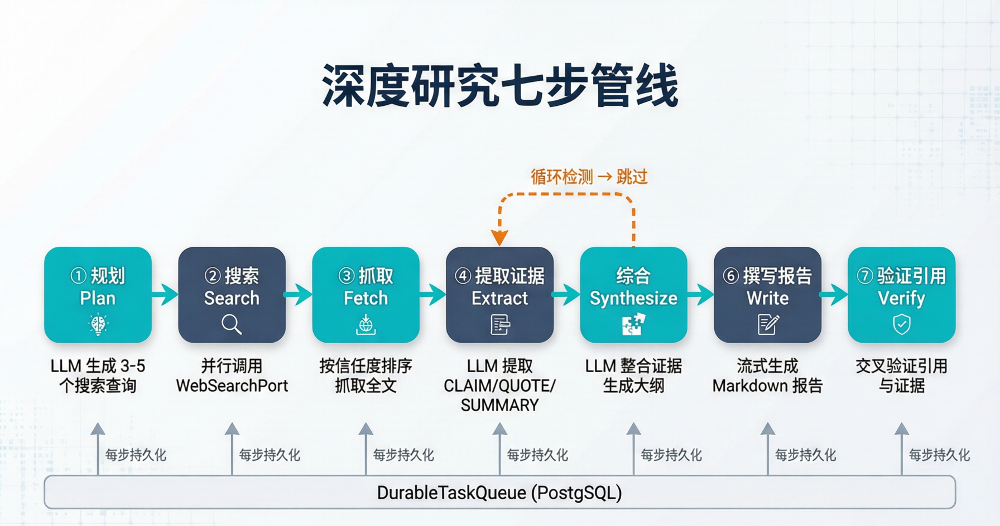
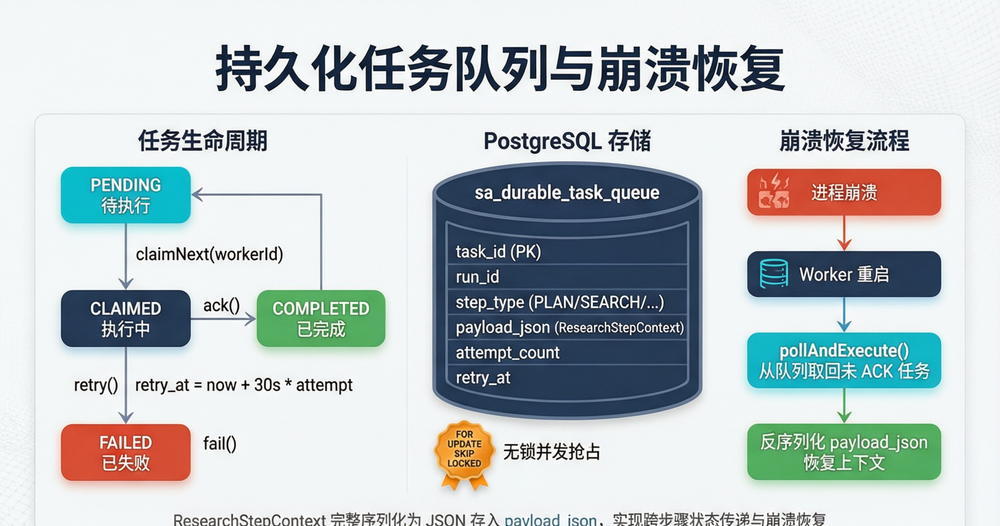
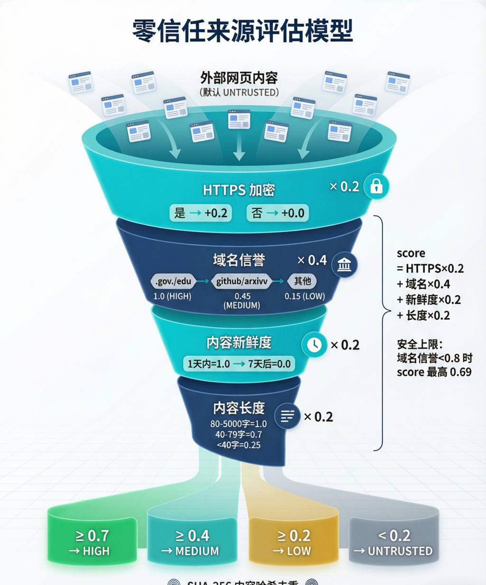
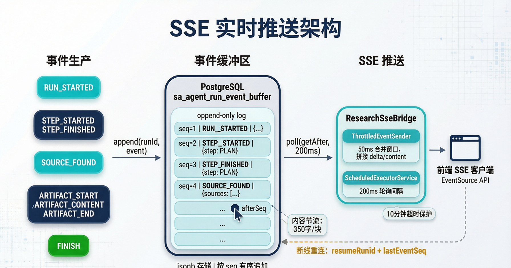

# Seahorse Agent 深度研究智能体：有界编排器、零信任来源与流式报告生成

> **导读**｜当用户提出一个需要多源信息交叉验证的复杂问题时，简单的"搜索→回答"模式远远不够。Seahorse Agent 的 Research Agent 子系统实现了一个**有界编排的深度研究管线**：从 LLM 规划搜索查询，到多源并行检索、可信度评估、证据提取、综合推理、流式报告生成，再到引用交叉验证——7 个步骤由持久化任务队列驱动，每一步都可崩溃恢复，全程通过 SSE 实时推送进度。本文将从管线设计、持久化队列、零信任来源模型、循环检测、流式推送和引用验证六个维度，拆解这套"确定性编排 + 弹性执行"的工程实现。

---

## 📌 一、为什么是有界编排器？

### 1.1 通用工作流引擎 vs 固定管线

深度研究任务看起来很适合用通用工作流引擎（如 Temporal、Camunda）来编排：多步骤、有状态、需要重试和恢复。但 Seahorse Agent 选择了一条更简单的路——**固定 7 步管线，用 `Enum.next()` 驱动**。

原因很直接：

- **研究流程是确定的**。不管用户问什么，"规划→搜索→抓取→提取→综合→撰写→验证"这个顺序不会变。唯一的路由分支是循环检测时的"跳过"。
- **通用引擎的复杂度溢价太高**。引入 Temporal 意味着多一个基础设施依赖、多一套 DSL、多一层调试抽象。对于一个步骤数固定、逻辑清晰的管线，这是过度设计。
- **KISS 原则**。正如 `ResearchRunOrchestrator` 的 Javadoc 所写："避免通用工作流引擎，采用固定步骤编排"。

### 1.2 七步管线的职责划分



| 步骤                  | 核心动作                                     | 依赖端口                                       | 关键设计                            |
| ------------------- | ---------------------------------------- | ------------------------------------------ | ------------------------------- |
| **① 规划 Plan**       | LLM 将用户问题拆解为 3-5 个搜索查询                   | `ChatModelPort`                            | 解析失败时回退到原始查询                    |
| **② 搜索 Search**     | 并行调用 `WebSearchPort`，每个查询最多 5 条结果        | `WebSearchPort`                            | SHA-256 内容哈希去重，信任度即时评估          |
| **③ 抓取 Fetch**      | 按信任度降序抓取全文，每页最多 8000 字符                  | `WebFetchPort`                             | 高信任度来源优先，失败静默跳过                 |
| **④ 提取证据 Extract**  | LLM 从每篇全文提取 1-3 条证据（CLAIM/QUOTE/SUMMARY） | `ChatModelPort`                            | 内容截断至 3000 字符，标记 IRRELEVANT 的跳过 |
| **⑤ 综合 Synthesize** | LLM 整合所有证据，生成带引用编号的结构化大纲                 | `ChatModelPort`                            | 证据以 `[序号] 主张 -- 摘要` 格式输入        |
| **⑥ 撰写报告 Write**    | 流式生成完整 Markdown 报告，上传至对象存储               | `StreamingChatModelPort` / `ChatModelPort` | 350 字符/块流式推送，10 分钟超时保护          |
| **⑦ 验证引用 Verify**   | 交叉检查报告中每个 `[N]` 引用是否有对应证据                | 纯领域逻辑                                      | 缺失引用标记为 `[引用待补]`，触发重试           |

> **💡 设计哲学**
> 
> 七步管线的每一步都是一个独立的 `ResearchStepHandler` 实现，通过策略模式注册到 `EnumMap<ResearchStepType, ResearchStepHandler>` 中。新增步骤只需实现接口并注册，删除步骤只需从枚举中移除——编排器代码**零修改**。

---

## 📌 二、持久化任务队列：崩溃恢复的核心

### 2.1 为什么需要持久化？

深度研究一次运行可能持续数分钟，涉及多次 LLM 调用、网页抓取和文件上传。如果进程在第 4 步崩溃，从头重跑意味着浪费已经完成的搜索和抓取结果。

Seahorse Agent 的解法是：**每一步的执行状态都持久化到 PostgreSQL**，崩溃后 Worker 重启时从队列中取回未 ACK 的任务，反序列化上下文，从中断处继续。



### 2.2 任务生命周期

```java
// 任务状态机
PENDING ──claimNext(workerId)──→ CLAIMED ──ack()──→ COMPLETED
                                    │
                                    ├──retry()──→ PENDING (retry_at = now + 30s * attempt)
                                    │
                                    └──fail()──→ FAILED
```

核心接口：

```java
public interface DurableTaskQueuePort {
    void enqueue(DurableTask task);                          // 入队
    Optional<DurableTask> claimNext(String workerId);        // 原子抢占
    void ack(String taskId);                                 // 确认完成
    void retry(String taskId, Instant retryAt, String reason);// 延迟重试
    void fail(String taskId, String reason);                 // 标记失败
    void cancel(String runId);                               // 取消整个研究
}
```

### 2.3 无锁并发抢占

JDBC 适配器使用 PostgreSQL 的 `FOR UPDATE SKIP LOCKED` 实现无分布式锁的并发抢占：

```sql
SELECT * FROM sa_durable_task_queue
WHERE status = 'PENDING' AND (retry_at IS NULL OR retry_at <= NOW())
ORDER BY created_at ASC
FOR UPDATE SKIP LOCKED
LIMIT 1
```

`SKIP LOCKED` 确保多个 Worker 实例并发运行时，不会互相阻塞——每个 Worker 拿到的是其他 Worker 未锁定的第一条待执行任务。这使得水平扩展 Worker 数量不需要任何分布式协调。

### 2.4 上下文序列化与跨步骤传递

`ResearchStepContext` 是整个研究运行的可变状态容器，包含搜索查询列表、来源列表、证据列表、抓取内容、报告内容等。每一步执行后，完整的上下文被序列化为 JSON 存入下一个任务的 `payloadJson`：

```java
// 上下文序列化（简化）
public String toJson() {
    Snapshot snapshot = new Snapshot(
        runId, query,
        searchQueries,
        sources.stream().map(SourceSnapshot::from).toList(),
        evidence, fetchedContent,
        reportContent, tenantId, userId, artifactId,
        maxSearchQueries, maxSources
    );
    return objectMapper.writeValueAsString(snapshot);
}

// 崩溃恢复时反序列化
ResearchStepContext ctx = ResearchStepContext.fromJson(task.payloadJson());
// ctx 包含了之前所有步骤的累积结果，直接从断点继续
```

这意味着**步骤之间没有内存共享**——所有状态传递都通过 JSON 序列化完成。这不仅实现了崩溃恢复，还使得步骤可以分布到不同的 Worker 进程执行。

### 2.5 重试策略

```java
// RetryableResearchException
public boolean shouldRetry(int maxAttempts) {
    if (attemptCount >= maxAttempts) return false;  // 默认 3 次
    // 安全相关异常不重试
    Throwable cause = this;
    while (cause != null) {
        if (cause instanceof SecurityException
                || cause instanceof IllegalArgumentException) {
            return false;
        }
        cause = cause.getCause();
    }
    return true;
}

// 重试延迟：线性递增
// 第 1 次重试：30s，第 2 次：60s，第 3 次：90s
Instant retryAt = Instant.now().plusSeconds(30L * task.attemptCount());
```

> **💡 设计哲学**
> 
> 持久化任务队列的本质是**把"状态"从内存转移到数据库**。内存中的上下文是临时的、易失的；数据库中的任务是持久的、可恢复的。代价是每一步都要做一次 JSON 序列化——但对于分钟级的研究任务来说，这个开销可以忽略不计。

---

## 📌 三、零信任来源模型：来源可信度评估

### 3.1 所有外部内容默认不可信

Research Agent 对互联网内容采取**零信任**立场：所有通过搜索发现的网页来源，初始信任级别都是 `UNTRUSTED`。信任度不是"赋予"的，而是通过一个确定性的评分公式"计算"出来的。



### 3.2 四维评分公式

```
score = HTTPS × 0.2
      + 域名信誉 × 0.4
      + 内容新鲜度 × 0.2
      + 内容长度 × 0.2
```

| 维度           | 权重  | 评分规则                                                        |
| ------------ | --- | ----------------------------------------------------------- |
| **HTTPS 加密** | 0.2 | 是 → +0.2，否 → +0.0                                           |
| **域名信誉**     | 0.4 | `.gov/.edu` → 1.0；`github.com/arxiv.org` 等 → 0.45；其他 → 0.15 |
| **内容新鲜度**    | 0.2 | 1 天内 → 1.0，线性衰减至 7 天后 → 0.0                                 |
| **内容长度**     | 0.2 | 80-5000 字 → 1.0；40-79 字 → 0.7；< 40 字 → 0.25                 |

### 3.3 安全上限机制

评分公式有一个关键的安全阀：**如果域名信誉 < 0.8（即非 `.gov/.edu` 级别），即使其他维度得分很高，最终 score 也被限制在 0.69**。

这意味着一个来自未知域名的页面，即使它是 HTTPS、内容新鲜、长度适中，也永远无法达到 `HIGH`（≥ 0.7）信任级别。这防止了攻击者通过优化非域名维度的信号来"刷高"信任度。

### 3.4 信任级别阈值

| Score 范围 | 信任级别          | 含义                                 |
| -------- | ------------- | ---------------------------------- |
| ≥ 0.7    | **HIGH**      | 政府/教育/权威学术来源                       |
| ≥ 0.4    | **MEDIUM**    | 知名技术社区（GitHub、arXiv、StackOverflow） |
| ≥ 0.2    | **LOW**       | 普通 HTTPS 网站                        |
| < 0.2    | **UNTRUSTED** | 无加密或内容过短的页面                        |

### 3.5 信任度的实际用途

信任度不是"仅供参考"的标签——它直接影响执行流程：

- **抓取优先级**：`FetchStepHandler` 按信任度降序排列来源，高信任度的先抓取。如果达到 `maxSources` 上限，低信任度的来源直接跳过。
- **证据权重**：后续的证据提取和综合步骤中，高信任度来源的证据在 LLM 提示词中排在前面，获得更大的注意力权重。
- **去重键**：`SourceTrustEvaluator.contentHash()` 计算 SHA-256（URL scheme+authority + 标题 + 摘要，归一化后），用于在搜索阶段去重——不同查询返回的同一页面不会被重复处理。

> **💡 设计哲学**
> 
> 零信任模型的核心是**评分公式的确定性和可审计性**。不是"LLM 判断这个来源是否可信"（LLM 的判断不可复现、不可审计），而是一个纯函数：给定 URL、时间戳、内容长度，输出一个确定的分数。这使得信任评估可以被单元测试覆盖，被运维人员理解，被安全团队审查。

---

## 📌 四、循环检测：防止无限搜索

### 4.1 问题：LLM 可能生成重复查询

在 PLAN 步骤中，LLM 负责将用户问题拆解为多个搜索查询。但 LLM 并不总是可靠的——它可能生成语义高度重复的查询（比如"AI 发展趋势"、"人工智能发展方向"、"AI 未来走向"），导致搜索步骤反复抓取相似内容，陷入无限循环。

### 4.2 双重检测策略

`ResearchLoopDetector` 实现了两种检测机制：

```java
// 策略 1：查询去重检测
public static boolean isSearchLooping(List<String> queries) {
    Map<String, Long> normalizedCounts = queries.stream()
        .map(q -> q.trim().replaceAll("\\s+", " ").toLowerCase())
        .collect(Collectors.groupingBy(Function.identity(), Collectors.counting()));
    // 同一归一化查询出现 ≥ 3 次 → 循环
    return normalizedCounts.values().stream().anyMatch(c -> c >= MAX_SAME_QUERY);
}

// 策略 2：步骤重复检测
public static boolean isStepLooping(List<ResearchStepType> stepHistory) {
    // 同一步骤类型连续出现 ≥ 3 次 → 循环
    int consecutiveCount = 1;
    for (int i = stepHistory.size() - 1; i > 0; i--) {
        if (stepHistory.get(i).equals(stepHistory.get(i - 1))) {
            consecutiveCount++;
            if (consecutiveCount >= MAX_SAME_STEP) return true;
        } else break;
    }
    return false;
}
```

### 4.3 循环发生时的降级策略

当检测到循环时，编排器不会报错终止，而是**优雅降级**：

```java
// ResearchRunOrchestrator.executeTask() 核心逻辑
if (stepType == SEARCH || stepType == FETCH) {
    if (ResearchLoopDetector.isSearchLooping(context.getSearchQueries())) {
        // 跳过当前步骤，直接进入 SYNTHESIZE
        eventPublisher.publish(runId, context, STEP_FINISHED,
            Map.of("status", "SKIPPED", "skippedReason", "loop_detected"));
        enqueueNextStep(SYNTHESIZE, context);  // 直接跳到综合步骤
        return;
    }
}
```

这意味着即使搜索阶段出了问题（查询重复、无结果），系统仍然可以利用已有的来源和证据进入综合和报告生成阶段，产出一个"尽力而为"的结果，而不是直接失败。

> **💡 设计哲学**
> 
> 循环检测的设计原则是**"检测 → 降级 → 继续"，而非"检测 → 报错 → 终止"**。深度研究是一个"尽力而为"的任务——即使某些步骤不完美，产出一个 80 分的报告也比返回一个错误更有价值。

---

## 📌 五、SSE 实时推送架构

### 5.1 从事件生产到前端渲染

深度研究运行时间长（可能数分钟），用户不能盯着一个旋转的加载图标等结果。Seahorse Agent 通过 **SSE（Server-Sent Events）** 实现实时进度推送：每完成一个步骤、每发现一个来源、每生成一块报告内容，都立即推送到前端。



### 5.2 三层架构

整个推送链路分为三层，通过**事件缓冲区**解耦：

**第一层：事件生产**

每个步骤处理器在执行过程中通过 `ResearchEventPublisher` 发布事件：

```java
// 步骤生命周期事件
eventPublisher.publish(runId, context, RUN_STARTED, ...);
eventPublisher.publish(runId, context, STEP_STARTED, Map.of("step", "PLAN"));
eventPublisher.publish(runId, context, STEP_FINISHED, Map.of("step", "PLAN"));

// 业务事件
eventPublisher.publish(runId, context, SOURCE_FOUND, Map.of("sources", newSources));

// 报告流式事件
eventPublisher.publish(runId, context, ARTIFACT_START, ...);
eventPublisher.publish(runId, context, ARTIFACT_CONTENT, Map.of("content", chunk));
eventPublisher.publish(runId, context, ARTIFACT_END, ...);
```

**第二层：事件缓冲区**

所有事件追加写入 PostgreSQL 的 `sa_agent_run_event_buffer` 表，按 `eventSeq`（每运行单调递增）排序。这是一个**append-only log**：

```java
public interface AgentRunEventBufferPort {
    void append(String runId, StreamEventEnvelope event);     // 追加
    List<StreamEventEnvelope> getAfter(String runId, long afterSeq); // 按序号读取
    long getLatestSeq(String runId);                           // 最新序号
    void expire(String runId);                                 // 清理
}
```

**第三层：SSE 桥接**

`ResearchSseBridge` 为每个研究运行启动一个独立的轮询任务，每 200ms 从事件缓冲区拉取新事件并推送到 SSE 客户端：

```java
// 核心轮询逻辑（简化）
private void pollLoop(SseEmitter emitter, String runId, AtomicLong cursor) {
    while (!terminated) {
        List<StreamEventEnvelope> events = eventBuffer.getAfter(runId, cursor.get());
        for (StreamEventEnvelope event : events) {
            throttledSender.send(emitter, event);  // 节流发送
            cursor.set(event.eventSeq());
            if (event.eventType() == FINISH) { terminate(); break; }
        }
        Thread.sleep(200);  // 轮询间隔
    }
}
```

### 5.3 内容节流

报告生成阶段会产生大量 `ARTIFACT_CONTENT` 事件（每 350 字符一块）。如果每块都立即发送，SSE 连接会被高频小事件淹没。`ThrottledEventSender` 通过 50ms 合并窗口解决这个问题：

```java
class ThrottledEventSender {
    private final long throttleWindowMs = 50;
    private String accumulatedContent = "";

    void send(SseEmitter emitter, StreamEventEnvelope event) {
        if (isContentEvent(event)) {
            accumulatedContent += extractContent(event);
            scheduleFlush(emitter);  // 50ms 后 flush
        } else {
            flush(emitter);          // 非内容事件立即发送
            sendEvent(emitter, event);
        }
    }
}
```

### 5.4 断线重连

SSE 客户端可能因为网络波动断开连接。`ResearchSseBridge` 支持从指定序号恢复：

```java
// 控制器支持断线重连
@GetMapping("/rag/v3/chat")
public SseEmitter chat(
    @RequestParam(required = false) String resumeRunId,
    @RequestParam(required = false) Long lastEventSeq) {

    if (resumeRunId != null) {
        // 先回放错过的事件
        List<StreamEventEnvelope> missed = eventBuffer.getAfter(resumeRunId, lastEventSeq);
        replay(emitter, missed);
        // 然后 attach 到实时流
        bridge.attach(emitter, resumeRunId, conversationId, taskId, lastEventSeq);
    }
}
```

### 5.5 超时保护

每个 SSE 连接有 10 分钟的硬超时（`CountDownLatch.await(10, MINUTES)`），防止僵尸连接占用资源。流式生成也支持通过 `StreamCancellationHandle` 主动取消。

> **💡 设计哲学**
> 
> 事件缓冲区是整个推送架构的**解耦枢纽**。生产者（步骤处理器）不知道消费者的存在，消费者（SSE 桥）不依赖生产者的实现。这使得未来可以添加新的消费者（比如 WebSocket 推送、事件回放审计、多客户端同时订阅）而不修改任何生产者代码。

---

## 📌 六、引用验证：最后一道防线

### 6.1 问题：LLM 可能编造引用

LLM 在撰写报告时，可能生成一个 `[5]` 引用，但实际只有 3 条证据。这种"幻觉引用"会严重损害报告的可信度。

### 6.2 交叉验证机制

`CitationVerifier` 在报告生成后执行最后的交叉检查：

```java
public record VerificationResult(
    List<Integer> verified,      // 有对应证据的引用
    List<Integer> missing,       // 引用了但没有证据的
    List<Integer> unreferenced   // 有证据但没被引用的
) {
    public boolean isFullyVerified() {
        return missing.isEmpty();
    }
}

public VerificationResult verify(String reportContent, List<EvidenceItem> evidence) {
    // 1. 用正则提取报告中所有 [N] 引用
    Set<Integer> citedIndices = Pattern.compile("\\[(\\d+)\\]")
        .matcher(reportContent).results()
        .map(r -> Integer.parseInt(r.group(1)))
        .collect(Collectors.toSet());

    // 2. 收集所有证据的引用序号
    Set<Integer> evidenceIndices = evidence.stream()
        .map(EvidenceItem::citationIndex)
        .collect(Collectors.toSet());

    // 3. 交叉比对
    List<Integer> verified = citedIndices.stream()
        .filter(evidenceIndices::contains).sorted().toList();
    List<Integer> missing = citedIndices.stream()
        .filter(i -> !evidenceIndices.contains(i)).sorted().toList();
    List<Integer> unreferenced = evidenceIndices.stream()
        .filter(i -> !citedIndices.contains(i)).sorted().toList();

    return new VerificationResult(verified, missing, unreferenced);
}
```

### 6.3 验证失败的处理

如果存在缺失引用，系统不会直接返回错误报告，而是：

1. **就地修复**：将缺失的 `[N]` 标记替换为 `[引用待补]`，让用户知道这里有引用但证据缺失
2. **触发重试**：抛出 `RetryableResearchException`，让编排器重新执行 WRITE_REPORT 步骤，希望 LLM 这次能生成正确的引用

```java
// VerifyCitationsStepHandler
VerificationResult result = citationVerifier.verify(reportContent, evidence);
if (!result.isFullyVerified()) {
    // 替换缺失引用标记
    String fixedContent = result.missing().stream()
        .reduce(reportContent,
            (content, idx) -> content.replace("[" + idx + "]", "[引用待补]"),
            (a, b) -> a);
    context.setReportContent(fixedContent);
    throw new RetryableResearchException(
        "Missing citations: " + result.missing() + ". Retrying report generation.");
}
```

> **💡 设计哲学**
> 
> 引用验证体现了 Research Agent 的一个核心设计原则：**不信任 LLM 的输出，但给 LLM 自我修正的机会**。验证失败不是终点，而是触发一次"带着反馈的重新生成"。最多 3 次重试后，如果引用仍然缺失，`[引用待补]` 标记至少让用户知道哪些结论缺乏证据支撑——这比一个看似完整但暗藏幻觉的报告诚实得多。

---

## 📌 七、Worker 调度与条件装配

### 7.1 定时轮询 Worker

研究任务的执行由一个 `@Scheduled` 定时任务驱动：

```java
@Component
public class SeahorseResearchWorkerJob {
    private static final int MAX_BATCH_PER_TICK = 10;

    @Scheduled(fixedDelayString = "${seahorse.agent.research.worker.fixed-delay-ms:500}")
    public void tick() {
        for (int i = 0; i < MAX_BATCH_PER_TICK; i++) {
            if (!orchestrator.pollAndExecute()) break;  // 无任务则退出
        }
    }
}
```

每 500ms（可配置）唤醒一次，每次最多处理 10 个任务。如果队列为空，立即退出等待下一次唤醒。这种**拉模式**（而非推模式）避免了任务调度框架的复杂度，同时通过 `FOR UPDATE SKIP LOCKED` 保证了多 Worker 实例下的正确性。

### 7.2 条件装配

每个步骤处理器的 Bean 创建都带有条件注解，只有当所需的端口 Bean 存在时才装配：

```java
@Bean
@ConditionalOnBean(ChatModelPort.class)
public PlanStepHandler planStepHandler(ChatModelPort chatModel) {
    return new PlanStepHandler(chatModel);
}

@Bean
@ConditionalOnBean(WebSearchPort.class)
public SearchStepHandler searchStepHandler(WebSearchPort webSearch, ...) {
    return new SearchStepHandler(webSearch, ...);
}
```

这意味着如果部署环境中没有配置 `WebSearchPort`（比如纯内网环境），`SearchStepHandler` 不会被创建，但其他不依赖它的步骤（如 Plan、Synthesize）仍然可以正常工作。

### 7.3 速率限制

Research Agent 在控制器层实施了两级速率限制：

| 限制维度               | 默认值     | 说明            |
| ------------------ | ------- | ------------- |
| 每用户                | 60 次/分钟 | 防止单个用户滥用      |
| 每模板（DEEP_RESEARCH） | 50 次/天  | 控制深度研究的总体资源消耗 |

---

## 总结

Seahorse Agent 的 Research Agent 围绕六个核心设计决策构建：

**1. 有界编排，拒绝通用引擎。** 7 步固定管线用 `Enum.next()` 驱动，避免了引入 Temporal/Camunda 等通用工作流引擎的复杂度。唯一的动态路由是循环检测时的降级跳过。

**2. 持久化任务队列，崩溃可恢复。** 每一步的状态通过 JSON 序列化存入 PostgreSQL，`FOR UPDATE SKIP LOCKED` 实现无锁并发抢占。进程崩溃后 Worker 重启即可从断点继续，不丢失已完成的工作。

**3. 零信任来源模型。** 所有外部网页默认 `UNTRUSTED`，通过四维确定性评分公式（HTTPS + 域名信誉 + 新鲜度 + 长度）计算信任度，安全上限防止非权威域名刷分。信任度直接影响抓取优先级和证据权重。

**4. 循环检测与优雅降级。** 双重检测（查询重复 + 步骤重复）防止无限搜索。检测到循环时不报错终止，而是跳过问题步骤进入综合阶段，产出一个"尽力而为"的报告。

**5. 事件缓冲解耦的 SSE 推送。** 步骤处理器 → 事件缓冲区（append-only log）→ SSE 桥接的三层架构，支持内容节流（50ms 合并窗口）、断线重连（按序号恢复）、超时保护（10 分钟）。

**6. 引用交叉验证与自我修正。** 报告生成后验证每个 `[N]` 引用是否有对应证据，缺失引用标记为 `[引用待补]` 并触发重试。宁可标注"证据缺失"，也不交付暗藏幻觉的报告。

这套架构的核心价值在于：**用确定性的编排约束 LLM 的不确定性，用持久化保障长任务的可靠性，用零信任模型保障来源的可信度**。它不追求"完美的研究结果"，而是追求"可审计、可恢复、可降级的研究过程"——这正是企业级 AI 应用与玩具 demo 的分水岭。

---

*本文基于 [Seahorse Agent](https://github.com/onceMisery/seahorse-agent) 项目源码分析。*
