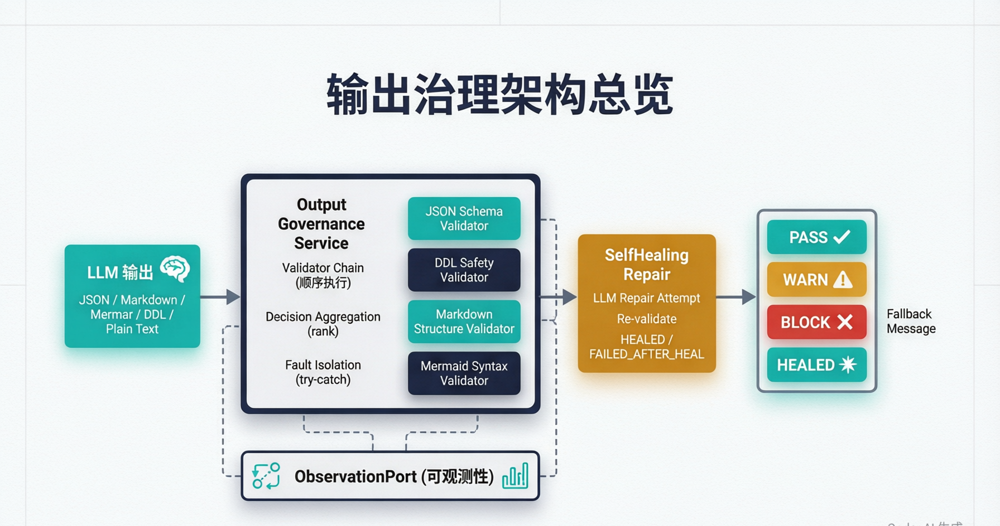
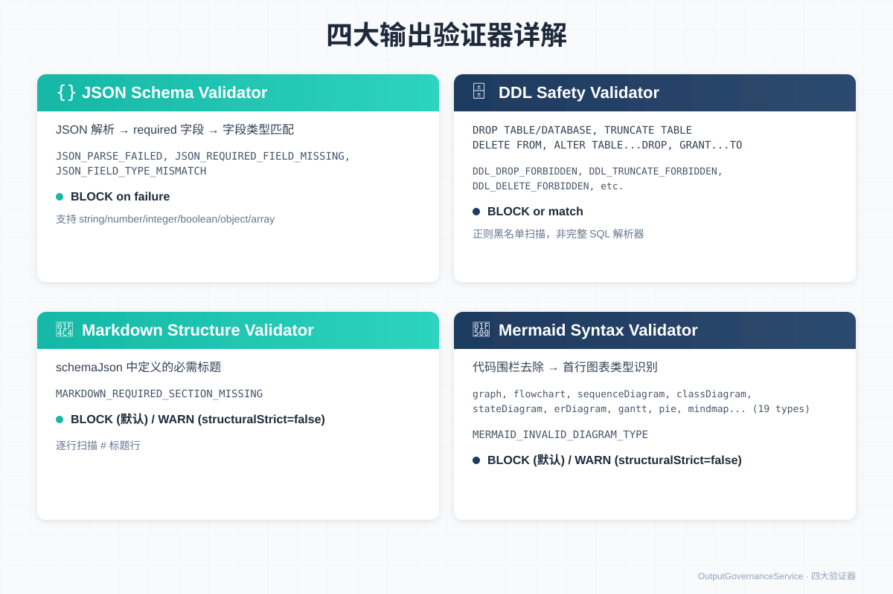
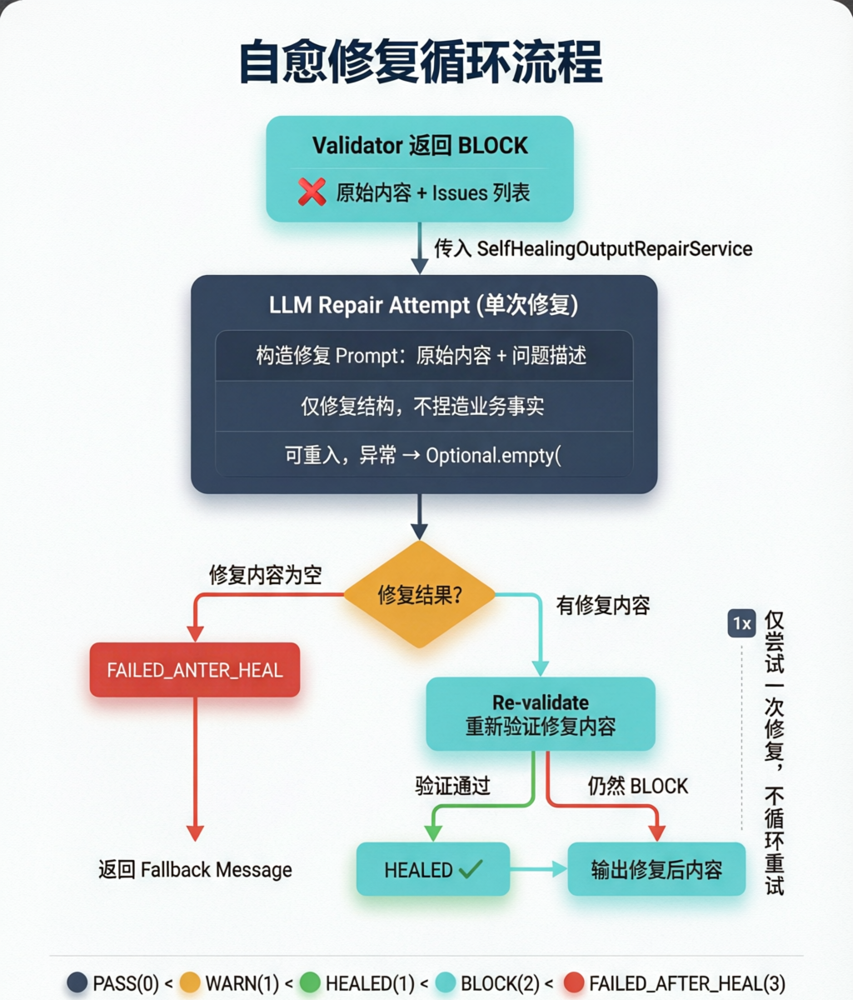
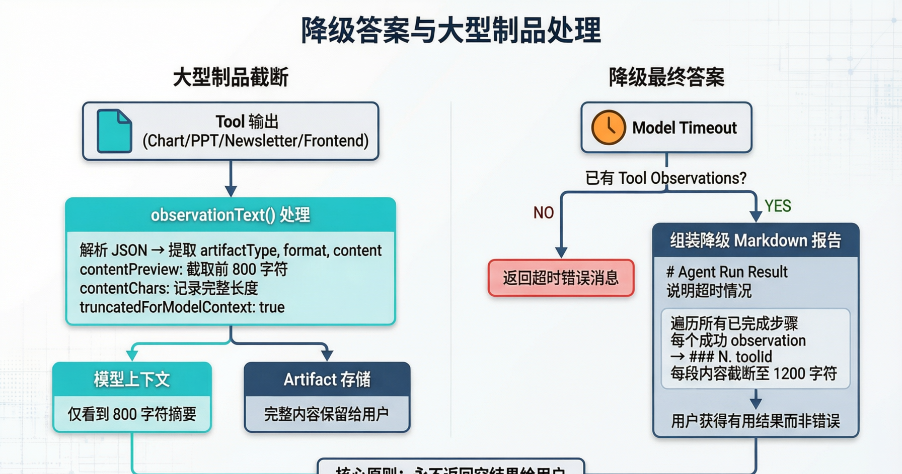

# Seahorse Agent 输出治理与自愈：OutputGovernanceService 的设计哲学

> **导读**｜LLM 生成的结构化输出（JSON、Markdown、Mermaid、DDL）天然不可靠——字段可能缺失、语法可能错误、DDL 可能包含危险操作。Seahorse Agent 没有选择"相信 LLM"或"直接拒绝"的二元方案，而是构建了一套**输出治理与自愈系统**：四大验证器链式校验，BLOCK 时触发 LLM 自愈修复，修复后重新验证，通过则输出修复内容（HEALED），失败则返回降级消息。同时，大型制品（图表、PPT）被截断后喂给模型以节省上下文，模型超时已有工具结果时组装降级报告而非返回错误。本文将从治理架构、验证器链、自愈循环、降级策略四个维度拆解这套"不信任但给机会"的工程实现。

---

## 一、为什么需要输出治理？

### 1.1 LLM 输出的结构性风险

当 Agent 被要求输出结构化内容时，LLM 的"创造力"反而成了最大的风险源。JSON 可能缺少 required 字段，Mermaid 可能使用了不支持的图表类型，DDL 可能包含 `DROP TABLE` 这样的危险操作，Markdown 可能缺少必需的章节标题。

传统的处理方式有两种极端：

- **完全信任**：直接把 LLM 输出发给下游。代价是下游可能因为格式错误而崩溃，或者更糟——执行了危险的 DDL 语句。
- **完全拒绝**：验证失败就返回错误。代价是用户体验极差，一个小的格式问题导致整个任务失败。

Seahorse Agent 选择了第三条路：**验证 → 修复 → 再验证 → 降级**。

### 1.2 治理架构总览



整个治理流程分为四个阶段：

1. **LLM 输出分类**：根据 `OutputArtifactType`（`PLAIN_TEXT` / `JSON` / `MARKDOWN` / `MERMAID` / `DDL`）确定需要哪些验证器介入。`PLAIN_TEXT` 不做结构验证，直接放行。
2. **验证器链执行**：所有注册的 `OutputValidatorPort` 按顺序执行，每个验证器通过 `supports()` 判断是否适用。最高严重级别的决策胜出，BLOCK 时立即短路。
3. **自愈修复**：如果初验结果为 BLOCK 且配置了 `SelfHealingOutputRepairService`，调用 LLM 做一次结构修复，然后重新验证修复内容。
4. **决策输出**：PASS/WARN 输出原内容（可能经过标准化），HEALED 输出修复内容，BLOCK/FAILED_AFTER_HEAL 输出 fallback 消息。

> **💡 设计哲学**
>
> 治理服务是**可选的**——`OutputGovernanceService` 在 `KernelAgentLoop` 中为 nullable。没有配置治理服务时，Agent 行为与治理引入前完全一致。这保证了向后兼容性，也允许不同部署环境按需启用。

---

## 二、验证器链：四大验证器详解

### 2.1 验证器接口与注册机制

所有验证器实现 `OutputValidatorPort` 接口：

```java
public interface OutputValidatorPort {
    String name();                                          // 验证器标识
    boolean supports(OutputValidationRequest request);      // 是否适用
    OutputValidationResult validate(OutputValidationRequest request); // 执行验证
}
```

关键契约：**验证器不得通过抛出异常来表达验证失败**。运行时异常被视为验证器自身的故障，由治理服务捕获并降级为 WARN 级别的 `VALIDATOR_RUNTIME_FAILURE` 事件。这保证了单个验证器的崩溃不会阻塞整个治理流程。

验证器通过 Spring 的 `ObjectProvider<OutputValidatorPort>.orderedStream()` 注入，按注册顺序执行。

### 2.2 决策聚合与短路机制

治理服务使用一个 `rank()` 函数将五种决策映射为数值：

```
PASS = 0, WARN = 1, HEALED = 1, BLOCK = 2, FAILED_AFTER_HEAL = 3
```

遍历验证器时，维护当前最高决策。每个验证器的结果与当前最高决策比较，取更严重的。一旦遇到 BLOCK，**立即短路**——不再执行后续验证器，直接进入自愈或返回 BLOCK。

### 2.3 四大验证器



#### JSON Schema Validator

| 维度 | 说明 |
|------|------|
| **适用类型** | `JSON`，且 `schemaJson` 非空 |
| **验证步骤** | ① 解析 JSON → `JSON_PARSE_FAILED` ② 解析 Schema → `JSON_SCHEMA_INVALID` ③ 根类型匹配 → `JSON_ROOT_TYPE_MISMATCH` ④ required 字段检查 → `JSON_REQUIRED_FIELD_MISSING`  字段类型检查 → `JSON_FIELD_TYPE_MISMATCH` |
| **类型支持** | string, number, integer, boolean, object, array |
| **标准化** | PASS 时返回去除空白字符的内容 |
| **已知限制** | 不支持嵌套 schema、anyOf、enum、pattern 等高级特性 |

#### DDL Safety Validator

| 维度 | 说明 |
|------|------|
| **适用类型** | `DDL`，且内容非空 |
| **验证方式** | 正则黑名单扫描（case-insensitive） |
| **禁止模式** | `DROP TABLE/DATABASE/SCHEMA/INDEX/VIEW/TRIGGER/FUNCTION/PROCEDURE`、`TRUNCATE TABLE`、`DELETE FROM`、`ALTER TABLE...DROP`、`GRANT...TO` |
| **Issue 定位** | 每个匹配携带偏移量 `$[offset]` |
| **已知限制** | 不是完整的 SQL 解析器——注释中的 DROP 也会触发，复杂嵌套语句可能漏检 |

#### Markdown Structure Validator

| 维度 | 说明 |
|------|------|
| **适用类型** | `MARKDOWN`，且 `schemaJson` 非空 |
| **Schema 格式** | JSON 数组，如 `["## Overview", "## Approach"]` |
| **验证方式** | 逐行扫描以 `#` 开头的行，精确匹配必需标题 |
| **Issue 代码** | `MARKDOWN_REQUIRED_SECTION_MISSING` |
| **决策策略** | 委托 `OutputStructuralValidationPolicy`：默认 BLOCK，`structuralStrict=false` 时降级为 WARN |

#### Mermaid Syntax Validator

| 维度 | 说明 |
|------|------|
| **适用类型** | `MERMAID` |
| **验证步骤** | ① 去除代码围栏（` ```mermaid ... ``` `）② 检查非空 → `MERMAID_EMPTY_CONTENT` ③ 提取首行第一个 token ④ 匹配 19 种图表类型 |
| **支持的图表类型** | graph, flowchart, sequenceDiagram, classDiagram, stateDiagram, stateDiagram-v2, erDiagram, journey, gantt, pie, mindmap, timeline, gitGraph, C4Context 等 |
| **标准化** | PASS 时返回去除围栏的内容 |
| **已知限制** | 不做完整的 Mermaid 渲染验证——语法正确性由前端/CI 负责 |

### 2.4 structuralStrict： severity 的弹性控制

`OutputStructuralValidationPolicy` 为 Markdown 和 Mermaid 验证器提供了 severity 降级机制：

```java
// 从 request.attributes 读取 structuralStrict
// 默认值：true（BLOCK）
// 显式设为 false（Boolean 或 String "false"）→ WARN
OutputValidationDecision decisionForViolation(OutputValidationRequest request) {
    Object flag = request.attributes().get("structuralStrict");
    if (flag == null) return BLOCK;
    if (flag instanceof Boolean b && !b) return WARN;
    if (flag instanceof String s && "false".equalsIgnoreCase(s)) return WARN;
    return BLOCK;
}
```

这意味着调用方可以根据场景灵活控制：在严格模式（如生产环境 DDL 审核）下结构错误直接阻断，在宽松模式（如草稿生成）下结构错误仅标记警告。

> **💡 设计哲学**
>
> 验证器的设计遵循**"单一职责 + 故障隔离"**原则。每个验证器只关心自己负责的格式类型，通过 `supports()` 声明适用范围。验证器内部的异常被治理服务捕获，不会传播到调用方。这使得新增验证器（比如 XML Schema 验证器）只需实现接口并注册为 Spring Bean，现有代码零修改。

---

## 三、自愈循环：给 LLM 一次修正的机会

### 3.1 从 BLOCK 到 HEALED 的完整路径

当验证器链返回 BLOCK 时，治理服务不会立即放弃。如果配置了 `SelfHealingOutputRepairService`，它会尝试一次 LLM 驱动的修复。



### 3.2 单次修复策略

```java
// SelfHealingOutputRepairService.repairOnce()
public Optional<OutputRepairResult> repairOnce(OutputValidationRequest request,
                                                List<OutputValidationIssue> issues) {
    try {
        OutputRepairResult result = repairModel.repair(
            new OutputRepairRequest(request, issues));
        return (result != null && result.hasRepairedContent())
            ? Optional.of(result) : Optional.empty();
    } catch (RuntimeException e) {
        return Optional.empty();  // 异常 = 修复失败
    }
}
```

关键设计决策：**只修复一次，不循环重试**。原因有三：

1. **成本可控**：每次修复都是一次额外的 LLM 调用。无限重试可能导致成本失控。
2. **收敛性**：如果 LLM 一次修复不了，大概率多次也修不了——问题可能超出了"结构修复"的范畴（比如缺少业务事实）。
3. **延迟敏感**：Agent 循环是同步的，修复耗时直接增加用户等待时间。

### 3.3 修复契约

`OutputRepairModelPort` 的契约明确规定了修复的边界：

- **仅修复结构，不捏造业务事实**。如果 JSON 缺少一个 required 字段，修复模型应该补上字段结构（比如 `"name": ""`），而不是编造一个具体的名字。
- **必须可重入**。修复模型可能被多次调用（不同请求），不应依赖外部状态。
- **运行时异常 = 修复失败**。与验证器一样，修复模型的异常被捕获并转化为 `Optional.empty()`。

### 3.4 修复后的重新验证

修复内容产生后，治理服务用**同一组验证器**重新验证修复内容：

```java
// OutputGovernanceService.governFinalAnswer() 核心逻辑（简化）
OutputValidationResult initial = runValidators(request);

if (initial.decision() == BLOCK && selfHealing != null) {
    Optional<OutputRepairResult> repair = selfHealing.repairOnce(request, initial.issues());

    if (repair.isEmpty()) {
        return OutputGovernanceResult.failedAfterHeal(fallbackMessage, initial.issues());
    }

    // 用修复内容重新验证
    OutputValidationRequest repairRequest = request.withContent(repair.get().repairedContent());
    OutputValidationResult reValidation = runValidators(repairRequest);

    if (reValidation.decision() != BLOCK) {
        return OutputGovernanceResult.healed(repair.get().repairedContent(), reValidation.issues());
    } else {
        return OutputGovernanceResult.failedAfterHeal(fallbackMessage, reValidation.issues());
    }
}
```

注意 `HEALED` 和 `FAILED_AFTER_HEAL` 这两个决策级别**永远不会由单个验证器返回**——它们是治理服务在自愈流程后产生的"元决策"。

### 3.5 可观测性

治理服务通过 `ObservationPort` 发射三类事件：

| 事件 | 触发条件 | 关键数据 |
|------|---------|---------|
| `agent-output-validation` | 每次治理调用 | artifactType, decision, validatorCount, duration |
| `agent-output-validation-failed` | BLOCK 或 FAILED_AFTER_HEAL | issues, content |
| `agent-output-self-heal` | 自愈尝试后 | outcome (healed/failed/skipped), duration |

这些事件可以被下游的指标系统、日志系统或告警系统消费，用于监控治理效果和自愈成功率。

> **💡 设计哲学**
>
> 自愈循环的核心是**"不信任但给机会"**。LLM 的输出被默认视为"可能有结构性缺陷"，但系统不直接拒绝——而是把缺陷信息（issues 列表）反馈给 LLM，让它自己修正。修正后的内容仍然要经过验证，不通过就降级。这形成了一个**"验证 → 反馈 → 修正 → 再验证"的闭环**，比单纯的"通过/拒绝"二元决策更健壮。

---

## 四、降级策略：永不返回空结果

### 4.1 大型制品截断

Agent 调用的某些工具（图表可视化、PPT 生成、Newsletter 生成、前端设计）会产生大量内容。如果把这些内容完整喂回给模型作为 observation，会迅速耗尽上下文窗口。

`KernelAgentLoop` 对这四类工具做了特殊处理：

```java
private static final Set<String> LARGE_ARTIFACT_TOOL_IDS = Set.of(
    "chart_visualization",
    "newsletter_generation",
    "ppt_generation",
    "frontend_design"
);

// observationText() 中的处理
private String summarizeLargeArtifact(String toolOutput) {
    // 解析工具输出的 JSON
    JsonObject json = JsonParser.parseString(toolOutput).getAsJsonObject();
    String content = json.get("content").getAsString();

    return Map.of(
        "artifactType", json.get("artifactType").getAsString(),
        "format", json.get("format").getAsString(),
        "contentPreview", truncate(content, 800),      // 仅 800 字符
        "contentChars", String.valueOf(content.length()), // 完整长度
        "truncatedForModelContext", "true"
    ).toString();
}
```



这意味着模型只看到一个 800 字符的摘要，但完整的制品内容通过 Artifact 发布系统保留给了最终用户。模型不需要"理解"完整的 PPT 内容才能继续工作——它只需要知道"PPT 已生成，共 N 字符"就足够了。

### 4.2 降级最终答案

当模型在 Agent 循环中超时（`isModelTurnTimeout`），且已经有一些工具 observation 时，系统不会返回一个冷冰冰的错误消息，而是**组装一个降级 Markdown 报告**：

```java
// KernelAgentLoop.assembleDegradedFinalAnswer()
private String assembleDegradedFinalAnswer(List<AgentStep> completedSteps) {
    StringBuilder md = new StringBuilder();
    md.append("# Agent Run Result\n\n");
    md.append("The agent encountered a timeout while processing your request. ");
    md.append("Below are the results collected before the timeout:\n\n");

    int index = 1;
    for (AgentStep step : completedSteps) {
        for (ToolObservation obs : step.successfulObservations()) {
            md.append("### ").append(index++).append(". ").append(obs.toolId()).append("\n\n");
            md.append(truncate(obs.content(), 1200));  // 每段 1200 字符
            md.append("\n\n");
        }
    }

    if (index == 1) {
        md.append("No successful tool results were collected before the timeout.\n");
    }

    return md.toString();
}
```

这个降级报告的价值在于：即使模型没能完成所有步骤，用户仍然能看到已经完成的工作成果。比如一个研究任务搜索了 5 个来源但还没来得及综合，用户至少能看到这 5 个来源的摘要。

### 4.3 工具风险审批

与输出治理并行的是工具调用的风险审批机制。每个工具被标记为 `LOW` / `MEDIUM` / `HIGH` / `CRITICAL` 四个风险等级。当高风险工具被调用时：

```java
// KernelAgentLoop 中的审批等待
if (observation.errorCode().equals("TOOL_APPROVAL_REQUIRED")) {
    GovernedToolApproval approval = GovernedToolApproval.builder()
        .toolId(toolId)
        .riskLevel(riskLevel)
        .summary(toolSummary)
        .arguments(toolArguments)
        .build();

    approvalWaitHandler.waitForApproval(approval);  // 阻塞等待用户审批
    // 用户批准后继续，拒绝则终止
}
```

这形成了一个**双向治理**：输入侧（工具调用）通过风险审批控制"能做什么"，输出侧（治理服务）通过验证和自愈控制"输出什么"。

> **💡 设计哲学**
>
> 降级策略的核心原则是**"永不返回空结果给用户"**。无论是大型制品截断（模型看到摘要，用户看到完整内容），还是超时降级（组装已有结果为 Markdown 报告），系统都在尽力交付"有价值的部分结果"而非"完美的零结果"。这与 Research Agent 的循环检测降级策略一脉相承——**尽力而为优于完美主义**。

---

## 五、治理在 Agent 循环中的集成点

### 5.1 两个调用时机

`OutputGovernanceService` 在 `KernelAgentLoop` 中被调用了两次：

```java
// 时机 1：模型直接输出最终答案（无工具调用）
if (!modelResponse.hasToolCalls()) {
    String governed = applyOutputGovernance(modelResponse.content());
    emitFinalAnswer(governed);
    return;
}

// 时机 2：工具步骤完成后，请求模型生成最终答案
String finalAnswer = requestFinalAnswer(toolObservations);
String governed = applyOutputGovernance(finalAnswer);
emitFinalAnswer(governed);
```

两次调用之间夹着完整的工具调用循环。这意味着治理服务在**最终输出之前**做最后一道检查——无论模型是直接回答还是经过工具增强后回答，都要过治理这一关。

### 5.2 Markdown 标准化

治理之后、输出之前，还有一道 `MarkdownNormalizer` 处理：

```java
// applyOutputGovernance() 的完整流程
private String applyOutputGovernance(String content) {
    if (outputGovernance == null) return content;  // 未配置则跳过

    OutputGovernanceResult result = outputGovernance.governFinalAnswer(
        OutputValidationRequest.builder()
            .artifactType(request.expectedOutputArtifactType())
            .content(content)
            .build()
    );

    // 治理后的内容再经过 Markdown 标准化
    return markdownNormalizer.normalizeFinalMarkdown(result.governedContent());
}
```

`MarkdownNormalizer` 是一个 552 行的格式化修复器，处理 LLM 输出中常见的 Markdown 格式问题：行尾标准化（`\r\n` → `\n`）、Mermaid 围栏修复（` ```mermaid flowchart` → ` ```mermaid\nflowchart`）、标题与正文间距、代码块闭合等。

### 5.3 Spring 自动装配

```java
@Bean
public OutputGovernanceService outputGovernanceService(
        ObjectProvider<OutputValidatorPort> validators,
        ObjectProvider<OutputValidationRecordPort> recordPort,
        ObjectProvider<ObservationPort> observationPort,
        ObjectProvider<SelfHealingOutputRepairService> selfHealing) {

    return new OutputGovernanceService(
        validators.orderedStream().toList(),
        recordPort.getIfAvailable(OutputValidationRecordPort::noop),
        observationPort.getIfAvailable(),
        selfHealing.getIfAvailable(),
        null  // blockFallbackMessage 使用默认值
    );
}
```

所有 `OutputValidatorPort` Bean 自动收集，`SelfHealingOutputRepairService` 仅在 `OutputRepairModelPort` Bean 存在时创建（`@ConditionalOnBean`）。这使得治理服务的功能可以按需组合：只配验证器 = 无自愈的纯验证；配了修复模型 = 完整治理 + 自愈。

> **💡 设计哲学**
>
> 治理服务的集成遵循**"零配置可用，按需增强"**原则。默认配置下，JSON Schema 和 DDL Safety 两个验证器始终生效。Markdown 和 Mermaid 验证器需要下游显式注册。自愈修复需要额外的 `OutputRepairModelPort` 实现。每一层增强都是可选的，但组合起来形成了一套完整的输出质量保障体系。

---

## 总结

Seahorse Agent 的输出治理与自愈系统围绕五个核心设计决策构建：

**1. 验证器链 + 决策聚合。** 四大验证器（JSON Schema、DDL Safety、Markdown Structure、Mermaid Syntax）按顺序执行，最高严重级别决策胜出，BLOCK 时短路。每个验证器故障隔离，异常降级为 WARN 而非阻塞流程。

**2. 零配置向后兼容。** `OutputGovernanceService` 为 nullable，未配置时 Agent 行为与治理引入前完全一致。验证器通过 Spring 自动收集，新增验证器只需实现接口并注册 Bean。

**3. 单次自愈修复。** BLOCK 时触发 LLM 修复，修复后重新验证。仅尝试一次（不循环），修复契约限定"仅修复结构，不捏造事实"。通过则 HEALED 输出修复内容，失败则 FAILED_AFTER_HEAL 返回 fallback 消息。

**4. structuralStrict 弹性控制。** Markdown 和 Mermaid 验证器的 severity 可通过 `structuralStrict` 属性在 BLOCK 和 WARN 之间切换，适应不同场景的严格程度需求。

**5. 降级优于空结果。** 大型制品截断至 800 字符喂给模型（完整内容保留给用户），模型超时时组装已有工具结果为 Markdown 报告。核心原则：永远交付"有价值的部分结果"而非"完美的零结果"。

这套系统的核心价值在于：**用确定性的验证规则约束 LLM 的结构性输出，用自愈修复给 LLM 自我修正的机会，用降级策略保证用户永远不面对空结果**。它不追求"LLM 一次就输出完美内容"，而是追求"即使 LLM 输出有缺陷，系统也能兜底处理"——这正是企业级 AI 应用从 demo 走向生产的关键一步。

---

*本文基于 [Seahorse Agent](https://github.com/your-repo/seahorse-agent) 项目源码分析。*
