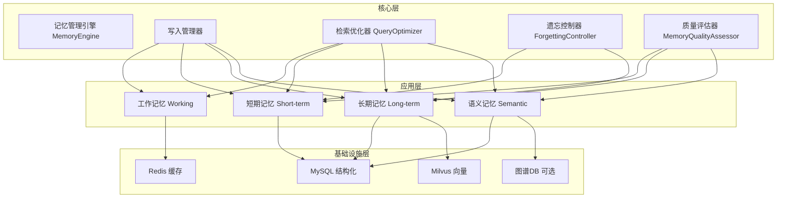

# 智能体记忆系统架构设计

## 1. 背景与动机

### 1.1 行业痛点

根据 Elastic 全球副总裁肖涵（原 Jina AI 创始人）在 2026 年 Elastic 中国 AI 搜索技术大会上的演讲，智能体记忆领域存在以下核心痛点：

1. **Query 构造错误导致检索失效**：用户问"911 的图表"，Agent 错误翻译为 "September 11th" 导致检索失败。根因是多语言转译、语义理解偏差、上下文缺失，即使记忆系统整条链路正确，Query 构造错误就会导致整个检索失败。
2. **遗忘比记住更难**：当前产品要么完全不记，要么不加区分地全记。缺少像人脑一样的选择性记忆机制，错误记忆一旦进入系统会被反复召回、引用、强化，导致记忆库污染。
3. **跨会话推理能力不足**：单条提取容易，跨会话推理难。无法将分散在多个会话中的信息关联起来做推理，基准测试中产品间得分差距接近一倍。
4. **长时程任务的记忆连续性**：前沿智能体能自主完成任务时长已达 4-5 小时，中间要搜索数百次、读数百个文档、在失败路径上回退数十次，这些经历不可能全部塞入上下文窗口。

行业共识的五件事：记忆分层（短期/长期）、记忆压缩与摘要、记忆检索增强、记忆写入验证、记忆衰减机制。正在成为分水岭的两件事：智能遗忘机制（仿生衰减）、记忆质量评估（独立于写入过程）。

### 1.2 Seahorse Agent 现有记忆架构局限

Phase 1 实施前，聊天链路只加载会话消息历史：

```text
KernelChatPipeline.loadMemory()
  -> ConversationMemoryPort.loadAndAppend()
  -> JdbcConversationMemoryAdapter
  -> t_message
```

四层记忆相关端口和表已经存在，但没有被聊天主链路消费：

```text
MemoryEnginePort
  -> 当前默认 noop

ShortTermMemoryPort   -> JdbcShortTermMemoryRepositoryAdapter   -> t_short_term_memory
LongTermMemoryPort    -> JdbcLongTermMemoryRepositoryAdapter    -> t_long_term_memory
SemanticMemoryPort    -> JdbcSemanticMemoryRepositoryAdapter    -> t_semantic_memory
MemoryVectorPort      -> 当前仅端口，未接入真实向量后端
```

关键断裂点：

| 断裂点 | 当前位置 | 影响 |
| --- | --- | --- |
| `ChatPreparationPorts` 不含 `MemoryEnginePort` | `kernel/application/chat` | `KernelChatPipeline` 无法激活四层记忆 |
| `StreamChatContext` 不含 `MemoryContext` | `kernel/domain/chat` | 主链路中间阶段无法传递记忆上下文 |
| `PromptContext` 不含 `MemoryContext` | `kernel/domain/chat` | `RagPromptPort` 无法把记忆写入 Prompt |
| `LocalRagPromptAdapter` 只消费 KB/MCP 上下文 | `adapter-web` | 即使加载了记忆，也不会进入模型输入 |
| `MemoryEnginePort` 默认 noop | `starter` | 记忆治理中的衰减/质量评估实际无法执行 |

现有局限性总结：

1. **记忆分层单一**：只有"历史消息 + 摘要"两层，缺少工作记忆、情景记忆、语义记忆的区分，无法支持跨会话的长期记忆。
2. **Query 构造缺乏优化**：依赖 `MultiQuestionRewriteService` 改写，但没有针对记忆检索的专门 Query 优化，多语言、同义词、上下文指代处理能力弱。
3. **遗忘机制缺失**：只保留固定轮数（8 轮），没有基于访问频率、重要性、时效性的衰减，错误记忆无法自动清理。
4. **记忆质量无评估**：摘要生成后没有质量验证，错误摘要会持续影响后续对话，缺少记忆冲突检测机制。
5. **跨会话推理不足**：每个会话独立管理记忆，无法关联用户在不同会话中的偏好，缺少用户画像的累积与更新。
6. **记忆检索不够智能**：简单按时间倒序加载，没有基于相关性的记忆检索，无法根据当前问题动态召回相关记忆。

---

## 2. 总体架构设计

### 2.1 四层记忆 + 双循环机制

基于行业前瞻性思路，结合 Seahorse Agent 现有架构，提出**四层记忆 + 双循环机制**的改进方案：



双循环机制：

- **写入循环 (Write Loop)**：对话 → 提取 → 验证 → 存储
- **检索循环 (Retrieve Loop)**：问题 → 优化 Query → 多层检索 → 合并结果

### 2.2 设计原则

- **最小可验证闭环**：先做读路径闭环，避免把衰减、质量评估、向量检索、跨会话推理一次性塞进首轮改造。
- **默认关闭**：LLM 优化与跨会话推理必须显式开关、可降级、可回滚。
- **不伪实现**：不声称已实现向量记忆检索、仿生衰减、冲突检测、跨会话推理，除非真正落地。
- **三段状态**：保留原始问题、优化问题、改写问题三段状态，不直接覆盖 `context.question`。
- **质量评估独立**：记忆的写入和质量评估分离，防止脏数据污染。
- **证据驱动验收**：运行时是否形成闭环，不能只看端口、类或配置存在；应以 `/memories/readiness` 返回的最近操作日志、trace、审核记录和 outbox/maintenance 证据为准。

### 2.3 当前代码落地边界（2026-05-29）

当前代码已经提供记忆系统运行态诊断口：`GET /memories/readiness?userId=...&tenantId=...`。该接口按 capability 返回闭环证据：

| capability | 判定来源 | 含义 |
| --- | --- | --- |
| `capture_write_loop` | 当前用户/租户最近成功或已应用的 `MemoryOperationRecord` | 写入链路确实产生过可接受操作 |
| `recall_loop` | 当前用户/租户最近 `memory-recall` 成功 trace | 召回链路确实运行过 |
| `context_injection` | 当前用户/租户最近 `memory-context-weaver` 成功 trace | 召回结果确实进入上下文编排 |
| `review_loop` | 当前用户/租户 `PENDING/APPLIED/REJECTED` 审核记录，且策略开启 | 人工审核链路有待审或决策证据 |
| `derived_index_sync` | 当前用户/租户最近 `memory-outbox` 成功 trace | 派生索引/outbox 同步链路运行过 |
| `maintenance_loop` | 当前租户最近 `memory-maintenance` 成功 trace | 后台维护链路运行过 |
| `self_training_loop` | 固定为 `MANUAL_EXPORT_ONLY` | 审核反馈可导出，但自动 SFT/DPO 不属于当前运行时链路 |

接口状态语义：

| 状态 | 说明 |
| --- | --- |
| `READY` | 必需链路和可启用运行链路都有最近证据 |
| `DEGRADED` | 必需链路有证据，但存在可选链路缺证据或被关闭 |
| `NO_EVIDENCE` | 写入、召回、上下文注入等必需链路缺少运行证据 |
| `DISABLED` | capability 被策略关闭，例如 review 未开启 |
| `MANUAL_EXPORT_ONLY` | 只支持人工/离线导出，不表示运行时自动闭环 |

因此，当前可确认的是**运行时记忆闭环可被证据化诊断**；是否已经在某个环境真正闭环，应看 readiness 报告，而不是只看设计文档。

---

## 3. 四层记忆分层模型

### 3.1 分层定义

| 记忆类型 | 存储位置 | 保留策略 | 检索方式 | 更新频率 |
| --- | --- | --- | --- | --- |
| **工作记忆** (Working Memory) | Redis 缓存 | 当前会话，会话结束清除 | 全量加载 | 实时 |
| **短期记忆** (Short-term Memory) | MySQL | 最近 30 天，按访问频率衰减 | 时间 + 相关性 | 每次对话 |
| **长期记忆** (Long-term Memory) | MySQL + Milvus | 永久，基于重要性评分衰减 | 向量检索 | 异步汇总 |
| **语义记忆** (Semantic Memory) | MySQL + 可选图谱 | 永久，用户画像 | 关键词 + 图谱查询 | 低频更新 |

### 3.2 各层详细说明

**1. 工作记忆 (Working Memory)**

- **定义**：当前对话会话的即时上下文
- **内容**：最近 8-10 轮对话原文
- **特点**：存储在 Redis 中，访问延迟 < 10ms；会话结束后自动清理；支持快速加载和追加
- **实现**：改进现有 `JdbcConversationMemoryStore`，增加 Redis 缓存层
- **当前状态**：`ConversationMemoryPort` 已在 `loadMemory()` 阶段处理，不在 `MemoryEnginePort` 中重复加载

**2. 短期记忆 (Short-term Memory)**

- **定义**：近期对话的结构化摘要和关键信息
- **内容**：会话级摘要（已有）、关键事实提取（新增）、用户偏好标记（新增）、未解决问题的跟踪（新增）
- **特点**：保留 30 天；基于访问频率和应用重要性进行衰减；支持时间范围查询和相关性检索
- **实现**：`ShortTermMemoryPort` → `JdbcShortTermMemoryRepositoryAdapter` → `t_short_term_memory`
- **读取策略**：取 Top 5，沿用现有 `importance_score DESC, create_time DESC`

**3. 长期记忆 (Long-term Memory)**

- **定义**：跨会话的持久化知识和经验
- **内容**：用户画像（职业、兴趣、偏好）、历史决策和结果、常见问题和解决方案、领域知识积累
- **特点**：永久存储，但有衰减机制；向量化存储，支持语义检索；定期合并和去重
- **实现**：`LongTermMemoryPort` → `JdbcLongTermMemoryRepositoryAdapter` → `t_long_term_memory`
- **读取策略**：取 Top 3
- **向量检索**：`MemoryVectorPort` 当前仅端口，Phase 1 未接入真实向量后端

**4. 语义记忆 (Semantic Memory)**

- **定义**：结构化的用户知识和关系网络
- **内容**：用户实体关系（可选图谱存储）、概念关联网络、领域知识图谱、规则和经验法则
- **特点**：高度结构化；支持复杂推理；更新频率低但影响深远
- **实现**：`SemanticMemoryPort` → `JdbcSemanticMemoryRepositoryAdapter` → `t_semantic_memory`
- **读取策略**：取 Top 10

### 3.3 记忆流转机制

```text
工作记忆 (实时)
    ↓ [会话结束，30 分钟无活动]
短期记忆 (30天)
    ↓ [定期汇总 + 重要性评估，每周]
长期记忆 (永久)
    ↓ [深度分析 + 模式识别，每月]
语义记忆 (永久)
```

**流转规则**：

1. **工作记忆 → 短期记忆**：触发于会话结束（30 分钟无活动），内容为完整会话摘要 + 提取的关键事实，异步执行不阻塞用户。
2. **短期记忆 → 长期记忆**：触发于每周定期任务，条件为重要性评分 > 0.6、被访问次数 > 3、与其他记忆有关联，处理时合并相似记忆、去重。
3. **长期记忆 → 语义记忆**：触发于每月定期任务，条件为形成稳定模式、跨多个会话验证、具有高通用性，处理时结构化提取，构建关系网络。

### 3.4 记忆激活机制

当用户提出问题时，从各层记忆中激活相关内容：

**多层融合**：

```text
最终记忆 = 工作记忆（100%）
         + 短期记忆 Top-5（按相关性）
         + 长期记忆 Top-3（按相关性）
         + 语义记忆 Top-2（按关联度）
```

**冲突解决**：检测到矛盾记忆时，优先保留更新时间的记忆、置信度更高的记忆、用户明确确认的记忆。

---

## 4. 核心组件设计

### 4.1 记忆管理引擎 (MemoryEnginePort)

```java
public interface MemoryEnginePort {

    /**
     * 综合记忆加载：根据当前问题从各层记忆中提取相关信息
     */
    MemoryContext loadMemory(MemoryLoadRequest request);

    /**
     * 记忆写入：异步处理新对话，分层存储
     */
    void writeMemory(MemoryWriteRequest request);

    /**
     * 记忆衰减：定期执行遗忘和清理任务
     */
    void executeMemoryDecay();

    /**
     * 记忆质量评估：评估已有记忆的准确性和相关性
     */
    MemoryQualityReport assessMemoryQuality(String userId);
}
```

#### 4.1.1 DefaultMemoryEnginePort 实现位置

实际实现位于内核侧组合实现：

```text
seahorse-agent-kernel/.../application/memory/DefaultMemoryEnginePort.java
```

职责：

- 实现 `MemoryEnginePort`
- 组合 `ShortTermMemoryPort`、`LongTermMemoryPort`、`SemanticMemoryPort`
- `loadMemory()` 做多层读取、限量、转换、去重
- `writeMemory()` Phase 1 保持 no-op
- `executeMemoryDecay()` Phase 1 不实现全量扫描
- `assessMemoryQuality()` 返回基础计数，不声称具备冲突检测能力

#### 4.1.2 读取策略

| 层级 | 数据来源 | 策略 |
| --- | --- | --- |
| working | `ConversationMemoryPort` 已在 `loadMemory()` 阶段处理 | 不在 `MemoryEnginePort` 中重复加载 |
| short_term | `ShortTermMemoryPort.listByUser(userId, limit)` | 取 Top 5，沿用 `importance_score DESC, create_time DESC` |
| long_term | `LongTermMemoryPort.listByUser(userId, limit)` | 取 Top 3 |
| semantic | `SemanticMemoryPort.listByUser(userId, limit)` | 取 Top 10 |
| vector | `MemoryVectorPort` | Phase 1 未接入 |

转换约束：

- `MemoryRecord` 是 Java record，使用构造器
- `MemoryItem` 使用 Lombok builder
- `metadataJson` 使用 Jackson 序列化，不用 `Map.toString()`
- `record.updatedAt()` 为 `Instant.EPOCH` 时兜底处理

### 4.2 查询优化器 (QueryOptimizerPort)

解决 Query 构造错误导致检索失效的核心痛点。

```java
public interface QueryOptimizerPort {

    QueryOptimizationResult optimize(String originalQuestion,
                                     List<ChatMessage> history,
                                     MemoryContext memoryContext);

    static QueryOptimizerPort passthrough() {
        return (question, history, memoryContext) -> new QueryOptimizationResult(
                Objects.requireNonNullElse(question, ""),
                Objects.requireNonNullElse(question, ""),
                Map.of(),
                List.of(),
                List.of("passthrough"));
    }
}
```

#### 4.2.1 QueryOptimizationResult 领域对象

```java
public record QueryOptimizationResult(
        String originalQuestion,      // 用户原始输入，不可丢
        String optimizedQuestion,     // 给 QueryRewritePort 使用的输入
        Map<String, String> protectedTerms,  // 后续 rewrite prompt 必须尊重的保护词
        List<String> expandedTerms,   // 检索侧可选消费
        List<String> appliedRules     // debug log 使用
) {
}
```

语义约束：

- `originalQuestion`：用户原始输入，不可丢
- `optimizedQuestion`：给 `QueryRewritePort` 使用的输入。Phase 3A 中与 originalQuestion 相同
- `protectedTerms`：后续 rewrite prompt 必须尊重的保护词。Phase 3A 中通过 debug log 输出
- `expandedTerms`：检索侧可选消费，不应直接污染用户问题
- `appliedRules`：debug log 使用

#### 4.2.2 Phase 3A：QueryNormalizer（已完成，默认开启）

用确定性逻辑解决低成本问题：

- 术语映射：如 "消息队列" -> "MQ / Pulsar / Kafka"
- 专有名词保护：如 `911`、`HNSW`、`pgvector`、`MCP` 不被后续改写破坏
- 查询状态可观测：debug log 中能看到 protectedTerms / expandedTerms

**不做**：不调用 LLM；不做复杂指代消解；不做时间解析；不做跨会话推理。

实际实现：

```text
kernel/application/chat/RuleBasedQueryOptimizerPort.java
```

术语映射接入独立出站端口：

```java
public interface QueryTermExpansionPort {
    Map<String, List<String>> expand(String queryText);
    static QueryTermExpansionPort noop() { return queryText -> Map.of(); }
}
```

当前无 JDBC 实现，默认退化为 noop。需要后续实现 `JdbcQueryTermExpansionAdapter` 才能让术语映射真正生效。

#### 4.2.3 Phase 3B：LLM QueryOptimizer（已完成，默认关闭）

通过配置开关控制：

```properties
seahorse-agent.query-optimizer.llm-enabled=false
```

实现位置：

```text
seahorse-agent-adapter-ai-openai-compatible/.../LlmQueryOptimizerAdapter.java
seahorse-agent-adapter-ai-openai-compatible/src/main/resources/prompt/query-optimizer.st
```

**降级策略**：LLM 超时、解析失败或置信度低于 0.6 时返回 passthrough 结果。

**LLM 输出约束**：

```json
{
  "optimizedQuestion": "...",
  "protectedTerms": { "HNSW": "technical_term" },
  "expandedTerms": ["..."],
  "confidence": 0.82,
  "changed": true
}
```

落地规则：

- `confidence < 0.6` 时不替换查询，只记录候选
- `optimizedQuestion` 为空或过长时降级
- 不允许 LLM 删除用户原始实体

#### 4.2.4 Pipeline 集成

`KernelChatPipeline.execute()` 实际顺序：

```text
loadMemory
activateMemory
optimizeQuery
rewriteQuery
resolveIntents
handleGuidance
handleSystemOnly
retrieve
handleEmptyRetrieval
streamRagResponse
```

`optimizeQuery()` 规则：

- 输入使用 `context.getOriginalQuestion()`，不用已被改写过的字段
- 输出存入 `context.queryOptimizationResult`
- `rewriteQuery()` 通过 `resolveRewriteInput()` 使用 `optimizedQuestion` 作为输入
- `ConversationMemoryPort.loadAndAppend()` 仍保存原始用户问题

### 4.3 遗忘控制器 (ForgettingController)

实现"遗忘比记住更难"理念，基于仿生衰减的记忆清理机制。

```java
public interface ForgettingController {

    double computeDecayScore(MemoryItem item);

    void applyDecay(List<MemoryItem> items);

    void cleanupExpiredMemories(String userId);

    void consolidateImportantMemories(String userId);
}
```

**衰减算法**：

```text
衰减分数 = 基础分 × 时间衰减 × 访问衰减 × 重要性权重

其中：
- 基础分：初始质量评分（0-1）
- 时间衰减：e^(-λt)，λ 为衰减系数，t 为天数
- 访问衰减：1 / (1 + α × 未访问天数)
- 重要性权重：用户标记、引用频率、关联度综合计算
```

**阈值策略**：

| 分数范围 | 处理方式 |
| --- | --- |
| < 0.2 | 标记为可清理 |
| 0.2 - 0.4 | 降权存储（低成本存储） |
| 0.4 - 0.7 | 正常存储 |
| > 0.7 | 优先缓存 + 定期巩固 |

**当前状态**：`KernelMemoryGovernanceService.runDecay()` 已通过短期记忆维护端口执行过期/低衰减清理。Phase 1 不伪实现 `executeMemoryDecay()`，正确路径需要新增仓储能力。

### 4.4 记忆质量评估器 (MemoryQualityAssessor)

独立于写入过程的质量评估。

```java
public interface MemoryQualityAssessor {

    QualityScore assessSingle(MemoryItem item);

    MemoryQualityReport assessUserMemories(String userId);

    List<MemoryConflict> detectConflicts(String userId);

    List<RepairSuggestion> generateRepairSuggestions(MemoryQualityReport report);
}
```

**评估维度**：

1. **准确性**：与事实的一致性（可交叉验证）
2. **时效性**：信息的当前有效性
3. **相关性**：与用户需求的关联度
4. **完整性**：信息的完整程度
5. **一致性**：与其他记忆项的冲突情况

**当前状态**：`assessMemoryQuality()` 返回基础计数，不声称具备冲突检测能力。冲突检测、偏好极性检测、画像唯一性检测不能标记为"已实现"，除非写入 `t_memory_conflict_log` 或 `t_memory_quality_snapshot`。

### 4.5 跨会话推理 (MemoryInferencePort)

跨会话推理不是实时聊天步骤，目标是把多次对话中的稳定事实、偏好、画像提取成长期/语义记忆。

```java
public interface MemoryInferencePort {
    List<InferredMemory> infer(String userId, List<MemoryRecord> shortTermMemories);
}
```

#### 4.5.1 Phase 4A：规则版候选记忆提取（已完成，默认关闭）

通过配置开关控制：

```properties
seahorse-agent.memory.inference-enabled=false
seahorse-agent.memory.inference.confidence-threshold=0.7
```

实现位置：

```text
kernel/application/memory/RuleBasedMemoryCandidateExtractor.java
```

`KernelMemoryGovernanceService.runGovernance()` 在 `inferenceEnabled=true` 时调用 `MemoryInferencePort.infer()`。

`InferredMemory` 必须提供 `semanticKey`：

| 类型 | semanticKey 示例 |
| --- | --- |
| PROFILE | `profile:后端工程师` |
| PREFERENCE | 无 semanticKey（写入 long_term） |

#### 4.5.2 置信度阈值

| 来源 | 置信度 | 阈值 | 结果 |
| --- | --- | --- | --- |
| 规则提取 PROFILE | 0.75D | 0.7D | ✅ 通过 |
| 规则提取 PREFERENCE | 0.7D | 0.7D | ✅ 通过 |
| LLM 推理（未来） | 可配置 | 0.7D | 待实现 |

#### 4.5.3 `isUserMessage` 逻辑

```java
Object role = record.metadata().get("role");
if (role != null) {
    return "user".equalsIgnoreCase(role.toString());
}
// metadata 中无 role 字段时，按 type 兜底
return "CONVERSATION".equalsIgnoreCase(record.type());
```

当 `role` 存在时直接按 `role` 判定，避免 assistant CONVERSATION 被误当用户消息。

---

## 5. 主链路集成

### 5.1 聊天 Pipeline 集成

Phase 1 做的"读路径闭环"：

```text
用户提问
  -> loadMemory()           读取 t_message 会话历史
  -> activateMemory()       读取短期/长期/语义记忆
  -> optimizeQuery()        查询优化（Phase 3A 同步实施）
  -> rewriteQuery()
  -> resolveIntents()
  -> retrieve()
  -> streamRagResponse()
       -> PromptContext.memoryContext
       -> LocalRagPromptAdapter 注入用户记忆
```

### 5.2 ChatPreparationPorts 实际签名

```java
public record ChatPreparationPorts(
        ConversationMemoryPort memoryPort,
        MemoryEnginePort memoryEnginePort,
        QueryOptimizerPort queryOptimizerPort,
        QueryRewritePort queryRewritePort,
        IntentResolutionPort intentResolutionPort,
        IntentGuidancePort intentGuidancePort,
        RetrievalContextPort retrievalContextPort) {
}
```

兼容：保留旧 5 参数构造函数委托到新 7 参数构造函数。

### 5.3 StreamChatContext 实际字段

```java
private String originalQuestion;                       // 用户原始输入
private MemoryContext memoryContext;                    // 四层记忆上下文
private QueryOptimizationResult queryOptimizationResult;  // 查询优化结果
```

### 5.4 PromptContext 实际字段

```java
private MemoryContext memoryContext;

public boolean hasMemory() {
    return memoryContext != null
            && (notEmpty(memoryContext.getShortTermMemories())
            || notEmpty(memoryContext.getLongTermMemories())
            || notEmpty(memoryContext.getSemanticMemories()));
}
```

### 5.5 Prompt 消费

`LocalRagPromptAdapter` 在 system prompt 中追加记忆区块：

```text
用户记忆上下文：
用户画像：
- ...
长期记忆：
- ...
近期记忆：
- ...
注意：若用户记忆与知识库上下文冲突，以知识库上下文为准，除非问题明确询问用户偏好或历史。
```

约束：

- 每层限制：语义 10、长期 3、短期 5（由 DefaultMemoryEnginePort 控制）
- 单条内容截断 200 字符
- 不暴露 `metadataJson`

---

## 6. 存储机制设计

### 6.1 数据库表设计

**短期记忆表：t_short_term_memory**

```sql
CREATE TABLE t_short_term_memory (
    id VARCHAR(64) PRIMARY KEY,
    user_id VARCHAR(64) NOT NULL,
    conversation_id VARCHAR(64),
    memory_type VARCHAR(32) NOT NULL,  -- SUMMARY, FACT, PREFERENCE, ISSUE
    content TEXT NOT NULL,
    metadata JSON,                      -- 结构化元数据
    importance_score DECIMAL(3,2),      -- 重要性评分 0-1
    confidence_level DECIMAL(3,2),      -- 置信度 0-1
    source_message_ids JSON,            -- 来源消息 ID 列表
    decay_score DECIMAL(3,2),           -- 衰减分数
    created_at TIMESTAMP DEFAULT CURRENT_TIMESTAMP,
    updated_at TIMESTAMP DEFAULT CURRENT_TIMESTAMP,
    expires_at TIMESTAMP,               -- 过期时间
    INDEX idx_user_decay (user_id, decay_score),
    INDEX idx_user_type (user_id, memory_type),
    INDEX idx_expires (expires_at)
);
```

**长期记忆表：t_long_term_memory**

```sql
CREATE TABLE t_long_term_memory (
    id VARCHAR(64) PRIMARY KEY,
    user_id VARCHAR(64) NOT NULL,
    memory_category VARCHAR(32) NOT NULL,  -- PROFILE, KNOWLEDGE, EXPERIENCE, PREFERENCE
    title VARCHAR(256),
    content TEXT NOT NULL,
    vector_id VARCHAR(64),                 -- Milvus 中的向量 ID
    embedding_version VARCHAR(32),         -- 嵌入模型版本
    importance_score DECIMAL(3,2),
    confidence_level DECIMAL(3,2),         -- 置信度 0-1
    source_type VARCHAR(32),               -- EXPLICIT, EXTRACTED, INFERRED
    source_ids JSON,                       -- 来源记忆 ID 列表
    tags JSON,                             -- 标签
    created_at TIMESTAMP DEFAULT CURRENT_TIMESTAMP,
    updated_at TIMESTAMP DEFAULT CURRENT_TIMESTAMP,
    INDEX idx_user_category (user_id, memory_category),
    INDEX idx_importance (user_id, importance_score DESC)
);
```

**语义记忆表：t_semantic_memory**

```sql
CREATE TABLE t_semantic_memory (
    id VARCHAR(64) PRIMARY KEY,
    user_id VARCHAR(64) NOT NULL,
    semantic_key VARCHAR(256),             -- 语义唯一键，如 profile:后端工程师
    memory_type VARCHAR(32) NOT NULL,      -- PROFILE, CONCEPT, RULE, RELATIONSHIP
    title VARCHAR(256),
    content TEXT NOT NULL,
    confidence_level DECIMAL(3,2),
    source_ids JSON,
    metadata JSON,
    created_at TIMESTAMP DEFAULT CURRENT_TIMESTAMP,
    updated_at TIMESTAMP DEFAULT CURRENT_TIMESTAMP,
    UNIQUE INDEX idx_user_semantic_key (user_id, semantic_key),
    INDEX idx_user_type (user_id, memory_type)
);
```

**记忆冲突日志表：t_memory_conflict_log**（规划中）

```sql
CREATE TABLE t_memory_conflict_log (
    id VARCHAR(64) PRIMARY KEY,
    user_id VARCHAR(64) NOT NULL,
    memory_id_1 VARCHAR(64) NOT NULL,
    memory_id_2 VARCHAR(64) NOT NULL,
    conflict_type VARCHAR(32),             -- CONTRADICTION, OUTDATED, DUPLICATE
    severity VARCHAR(16),                  -- HIGH, MEDIUM, LOW
    resolution_status VARCHAR(16),         -- PENDING, RESOLVED, IGNORED
    resolution_action VARCHAR(32),         -- KEEP_FIRST, KEEP_SECOND, MERGE, DELETE_BOTH
    resolved_by VARCHAR(32),               -- AUTO, USER, ADMIN
    resolved_at TIMESTAMP,
    created_at TIMESTAMP DEFAULT CURRENT_TIMESTAMP,
    INDEX idx_user_status (user_id, resolution_status)
);
```

### 6.2 Milvus 向量集合设计

**集合名称：`user_long_term_memory`**

```text
字段：
- id: VARCHAR(64), 主键
- user_id: VARCHAR(64)
- memory_embedding: FLOAT_VECTOR, dim=1536（根据 embedding 模型调整）
- memory_category: VARCHAR(32)
- importance_score: FLOAT
- created_at: INT64（时间戳）

索引参数：
- metric_type: IP（内积）
- index_type: HNSW
- params: M=16, efConstruction=256
```

### 6.3 混合检索策略

结合多种检索方式提高召回率：

```text
最终分数 = α × 向量分数 + β × 关键词分数 + γ × 时间分数 + δ × 重要性分数

其中：
- α = 0.5（语义匹配权重）
- β = 0.2（精确匹配权重）
- γ = 0.1（时间权重）
- δ = 0.2（重要性权重）

使用 Reciprocal Rank Fusion (RRF) 合并多路结果：
RRF(score) = Σ 1 / (k + rank_i)
k = 60（经验值）
```

### 6.4 分层存储策略

| 存储层 | 介质 | 访问延迟 | 成本 | 容量策略 |
| --- | --- | --- | --- | --- |
| L0: 热数据 | Redis | < 10ms | 高 | 仅当前会话 |
| L1: 温数据 | MySQL 主库 | < 50ms | 中 | 最近 30 天 |
| L2: 冷数据 | MySQL 归档库 | < 200ms | 低 | 30 天 - 1 年 |
| L3: 冰数据 | 对象存储 | < 1s | 极低 | 1 年以上 |

---

## 7. 写入闭环设计

### 7.1 写入策略

Phase 1 不无条件写入用户原始问题。第二阶段写入策略：

| 写入对象 | 是否写入 | 说明 |
| --- | --- | --- |
| 用户原始问题 | 默认不写 | 避免把噪声写进短期记忆 |
| 助手完整回答 | 默认不写 | 容易造成模型自我污染 |
| 对话摘要 | 可写 | 需要基于完整问答生成摘要 |
| 明确事实 | 可写 | 如"用户使用 Java 21" |
| 明确偏好 | 可写 | 如"用户偏好中文回答" |

### 7.2 实现建议

- 用 `StreamCallback` 装饰器收集助手输出，在 `onComplete()` 后异步触发候选记忆提取
- 提取器可以先做规则版：只识别明确的用户偏好/事实标记，不调用 LLM
- 写入 `ShortTermMemoryPort` 时必须设置：`userId`、`conversationId`、`importanceScore`、`confidenceLevel`、`sourceMessageIds`、`decayScore`
- 晋升到长期/语义仍交给现有 `KernelMemoryGovernanceService`

### 7.3 记忆压缩与摘要

**多级摘要策略**：

| 级别 | 触发时机 | 内容 | 存储位置 | 更新频率 |
| --- | --- | --- | --- | --- |
| L1 | 每 9 轮对话 | 对话要点 | conversation_summary | 实时 |
| L2 | 会话结束（30 分钟无活动） | 完整会话总结 | short_term_memory | 会话级 |
| L3 | 每周定期 | 主题趋势和模式 | long_term_memory | 周级 |
| L4 | 每月或重大事件 | 用户画像更新 | semantic_memory | 月级 |

**关键事实提取**：从对话中自动提取关键事实，包括用户偏好、用户属性、决策、解决的问题、待解决问题、领域知识、实体关系。

**增量式摘要改进**：当前增量摘要基于消息 ID 范围，改进为基于语义边界，检测话题转换点和自然断点。

---

## 8. Token 预算与性能

### 8.1 Token 预算管理

```text
总预算 = 模型最大上下文 - 预留空间（20%）

分配比例：
- 工作记忆：40%（必须完整保留）
- 短期记忆：30%（按相关性截取）
- 长期记忆：20%（Top-N 相关）
- 语义记忆：10%（关键画像）

截断规则：
1. 工作记忆不可截断（最多 10 轮）
2. 短期记忆按相关性分数降序截取
3. 长期记忆只保留分数 > 阈值的项
4. 语义记忆只保留核心画像
```

### 8.2 缓存策略

- 预加载：基于访问模式预测需要的记忆
- 缓存淘汰：基于 LRU + 重要性评分
- 缓存预热：用户活跃时段前预热
- 动态缓存大小：基础大小 × (1 + 活跃度系数 × 重要性系数)

---

## 9. 自动配置

### 9.1 DefaultMemoryEnginePort Bean

```java
@Bean
@ConditionalOnBean({ShortTermMemoryPort.class, LongTermMemoryPort.class, SemanticMemoryPort.class})
@ConditionalOnMissingBean(MemoryEnginePort.class)
public MemoryEnginePort seahorseDefaultMemoryEnginePort(
        ShortTermMemoryPort shortTermMemoryPort,
        LongTermMemoryPort longTermMemoryPort,
        SemanticMemoryPort semanticMemoryPort,
        ObjectProvider<ObjectMapper> objectMapperProvider) {
    ObjectMapper objectMapper = objectMapperProvider.getIfAvailable(ObjectMapper::new);
    return new DefaultMemoryEnginePort(
            shortTermMemoryPort,
            longTermMemoryPort,
            semanticMemoryPort,
            objectMapper);
}
```

注意：`ObjectMapper` 使用 `ObjectProvider<ObjectMapper>` + fallback `ObjectMapper::new`，避免无 Jackson 自动配置时启动失败。

### 9.2 LLM QueryOptimizer Bean

```java
@Bean
@ConditionalOnBean(ChatModelPort.class)
@ConditionalOnProperty(prefix = "seahorse-agent.query-optimizer", name = "llm-enabled", havingValue = "true")
@ConditionalOnMissingBean(QueryOptimizerPort.class)
public QueryOptimizerPort seahorseLlmQueryOptimizer(...) { ... }
```

当 `llm-enabled=false` 时，自动退化为 `RuleBasedQueryOptimizerPort`。

### 9.3 跨会话推理配置

```properties
seahorse-agent.memory.inference-enabled=false
seahorse-agent.memory.inference.confidence-threshold=0.7
```

---

## 10. 文件清单

### Phase 1：记忆读路径接入主链路与 Prompt

**新增文件：**

| 文件 | 说明 |
| --- | --- |
| `DefaultMemoryEnginePort.java` | 编排 ShortTerm/LongTerm/Semantic 三层记忆读取 |
| `DefaultMemoryEnginePortTests.java` | 8 个测试覆盖多层加载、去重、降级 |

**修改文件：**

| 文件 | 变更 |
| --- | --- |
| `ChatPreparationPorts.java` | 增加 `MemoryEnginePort` 字段，保留旧 5 参数构造函数向后兼容 |
| `StreamChatContext.java` | 增加 `MemoryContext memoryContext` 字段 |
| `PromptContext.java` | 增加 `MemoryContext memoryContext` 字段 + `hasMemory()` 方法 |
| `KernelChatPipeline.java` | 增加 `activateMemory()` 阶段，memoryContext 传递到 PromptContext |
| `LocalRagPromptAdapter.java` | system prompt 注入用户画像/长期/近期记忆，附冲突优先级说明 |
| `SeahorseAgentKernelAutoConfiguration.java` | 装配 DefaultMemoryEnginePort bean |
| `KernelChatPipelineTests.java` | 更新 trace 断言包含 activate-memory 节点 |

### Phase 3A：QueryNormalizer

**新增文件：**

| 文件 | 说明 |
| --- | --- |
| `kernel/ports/outbound/chat/QueryOptimizerPort.java` | 查询优化端口 |
| `kernel/domain/chat/QueryOptimizationResult.java` | 优化结果 record |
| `kernel/ports/outbound/mapping/QueryTermExpansionPort.java` | 术语扩展端口 |
| `kernel/application/chat/RuleBasedQueryOptimizerPort.java` | 规则版实现 |
| `seahorse-agent-tests/.../RuleBasedQueryOptimizerPortTests.java` | 8 个测试 |

**修改文件：**

| 文件 | 改动 |
| --- | --- |
| `ChatPreparationPorts.java` | 增加 `QueryOptimizerPort`，7 参数构造函数 |
| `StreamChatContext.java` | 增加 `originalQuestion` 和 `queryOptimizationResult` |
| `KernelChatPipeline.java` | 增加 `optimizeQuery()` + `resolveRewriteInput()` |
| `SeahorseAgentKernelAutoConfiguration.java` | 装配 RuleBasedQueryOptimizerPort |

### Phase 3B：LLM QueryOptimizer

**新增文件：**

| 文件 | 说明 |
| --- | --- |
| `adapter-ai-openai-compatible/.../LlmQueryOptimizerAdapter.java` | LLM 实现，默认关闭 |
| `adapter-ai-openai-compatible/.../resources/prompt/query-optimizer.st` | Prompt 模板 |

**修改文件：**

| 文件 | 改动 |
| --- | --- |
| `SeahorseAgentKernelAutoConfiguration.java` | 装配 LLM optimizer，`@ConditionalOnProperty` 门控 |

### Phase 4：跨会话推理

**新增文件：**

| 文件 | 说明 |
| --- | --- |
| `kernel/ports/outbound/memory/MemoryInferencePort.java` | 推理端口 |
| `kernel/domain/memory/InferredMemory.java` | 推理候选结果 |
| `kernel/application/memory/RuleBasedMemoryCandidateExtractor.java` | 规则版实现 |

**修改文件：**

| 文件 | 改动 |
| --- | --- |
| `KernelMemoryGovernanceService.java` | 增加 `inferenceEnabled` 标志，`runGovernance()` 调用推理 |
| `MemoryGovernanceServicePorts.java` | 增加 `MemoryInferencePort`，5 参数构造函数 |
| `MemoryGovernanceRunResult.java` | 增加 `inferredCount` 字段 |
| `SeahorseAgentKernelAutoConfiguration.java` | 装配 RuleBasedMemoryCandidateExtractor + inference-enabled 配置 |

---

## 11. 阶段状态与验收标准

### 11.1 阶段状态

| 阶段 | 内容 | 状态 |
| --- | --- | --- |
| Phase 1 | 记忆读路径接入主链路与 Prompt | ✅ 已完成 |
| Phase 2 | 规则版记忆写入闭环 | ✅ 已部分落地；运行闭环以 `/memories/readiness` 证据为准 |
| Phase 3A | QueryNormalizer | ✅ 已完成 |
| Phase 3B | LLM QueryOptimizer | ✅ 已完成，默认关闭 |
| Phase 4A | 规则版候选记忆提取 | ✅ 已完成，默认关闭 |
| Phase 4B | 跨会话推理基础设施 | ✅ 已完成，默认关闭 |
| Phase 5 | 衰减、质量评估、冲突治理 | ✅ 已部分落地；生产级自动治理取决于配置、adapter 和后台任务 |

### 11.2 已完成阶段验收标准

**Phase 1 验收：**

| # | 标准 | 状态 |
| --- | --- | --- |
| 1 | 预置 `t_short_term_memory` 后，聊天 Prompt 包含近期记忆 | ✅ |
| 2 | 预置 `t_long_term_memory` 后，聊天 Prompt 包含长期记忆 | ✅ |
| 3 | 预置 `t_semantic_memory` 后，聊天 Prompt 包含用户画像 | ✅ |
| 4 | `MemoryEnginePort.loadMemory()` 抛异常时，聊天仍能走 KB/MCP 回答 | ✅ |
| 5 | 空记忆场景下 Prompt 与现有行为基本一致 | ✅ |
| 6 | 不新增数据库表，不引入新依赖 | ✅ |
| 7 | 不声称已实现向量记忆检索、仿生衰减、冲突检测、跨会话推理 | ✅ |

**QueryNormalizer 验收：**

| # | 标准 | 状态 |
| --- | --- | --- |
| 1 | 原始问题不会丢失（originalQuestion 三段状态） | ✅ |
| 2 | `rewriteQuery()` 使用优化后的问题 | ✅ |
| 3 | debug log 中能看到 protectedTerms / expandedTerms | ✅ |
| 4 | 没有术语映射命中时行为等同 passthrough | ✅ |
| 5 | 规则实现不调用 LLM | ✅ |

**LLM QueryOptimizer 验收：**

| # | 标准 | 状态 |
| --- | --- | --- |
| 1 | 默认关闭（`llm-enabled=false`） | ✅ |
| 2 | 超时或解析失败时返回 passthrough | ✅ |
| 3 | 短指代问题不会被错误跳过 | ✅ |
| 4 | 低置信度结果不替换查询（threshold 0.6） | ✅ |
| 5 | 保护词通过 debug log 输出，不宣称保护生效 | ✅ |

**跨会话推理验收：**

| # | 标准 | 状态 |
| --- | --- | --- |
| 1 | 推理集成在 `runGovernance(userId)` 中 | ✅ |
| 2 | 推理结果写入长期记忆 | ✅ |
| 3 | 写入语义记忆必须提供 `semanticKey` | ✅ |
| 4 | 置信度 < 0.7 不写入 | ✅ |
| 5 | 默认关闭（`inference-enabled=false`） | ✅ |

**运行时闭环 readiness 验收：**

| # | 标准 | 状态 |
| --- | --- | --- |
| 1 | `GET /memories/readiness?userId=...&tenantId=...` 暴露运行态闭环报告 | ✅ |
| 2 | 写入、召回、上下文注入必须有最近证据，否则整体为 `NO_EVIDENCE` | ✅ |
| 3 | trace 证据按 `userId`/`tenantId` 隔离，避免用其他用户或租户的运行记录误报就绪 | ✅ |
| 4 | review 未开启时标记为 `DISABLED`，不阻塞必需链路判断 | ✅ |
| 5 | `self_training_loop` 标记为 `MANUAL_EXPORT_ONLY`，不声称自动 SFT/DPO 已运行 | ✅ |

### 11.3 测试覆盖

- `DefaultMemoryEnginePortTests` — 8 个测试
- `KernelChatPipelineTests` — 3 个测试（含 activate-memory trace 节点）
- `SeahorseAgentKernelAutoConfigurationTests` — 17 个测试
- `RuleBasedQueryOptimizerPortTests` — 8 个测试
- `KernelMemoryObservabilityServiceTests` — 覆盖 health、policy config、readiness 与 evidence scoping
- `SeahorseWebApiContractTests` — 覆盖 `/memories/readiness` Web 合同

---

## 12. 风险评估与缓解

### 12.1 技术风险

| 风险 | 影响 | 概率 | 缓解措施 |
| --- | --- | --- | --- |
| Milvus 集成复杂 | 高 | 中 | 提前进行 PoC，准备降级方案 |
| 向量检索性能不达标 | 高 | 低 | 使用 HNSW 索引，增加缓存层 |
| 异步任务积压 | 中 | 中 | 监控队列长度，动态扩容 |
| 记忆冲突误判 | 中 | 中 | 人工审核机制，持续优化规则 |
| Query 构造错误 | 高 | 中 | 多语言保护、专有名词保护、上下文感知 |

### 12.2 业务风险

| 风险 | 影响 | 概率 | 缓解措施 |
| --- | --- | --- | --- |
| 用户隐私泄露 | 高 | 低 | 数据加密，访问控制，审计日志 |
| 记忆污染 | 高 | 中 | 质量评估，快速回滚机制 |
| 性能下降 | 高 | 低 | 性能测试，灰度发布，快速回滚 |
| 上下文爆炸 | 中 | 中 | 视图切片，数据降维，Token 预算管理 |

---

## 13. 配置参考

### 13.1 记忆系统配置

```yaml
seahorse-agent:
  memory:
    # 记忆推理
    inference-enabled: false
    inference:
      confidence-threshold: 0.7

  # 查询优化
  query-optimizer:
    llm-enabled: false

  # 记忆治理（规划中）
  memory-governance:
    decay-enabled: true
    quality-assessment-enabled: false
    cleanup-cron: "0 0 4 * * ?"
    quality-assessment-cron: "0 0 5 * * ?"
    decay-cleanup-threshold: 0.2
```

### 13.2 完整配置模型（规划中）

| 配置项 | 前缀 | 默认值 | 说明 |
| --- | --- | --- | --- |
| workingMemoryTurns | rag.memory | 10 | 工作记忆保留轮数 |
| workingMemoryTtlMinutes | rag.memory | 60 | 工作记忆缓存 TTL |
| shortTermRetentionDays | rag.memory | 30 | 短期记忆保留天数 |
| shortTermDecayRate | rag.memory | 0.05 | 短期记忆衰减系数 |
| longTermMemoryEnabled | rag.memory | true | 是否启用长期记忆 |
| longTermEmbeddingModel | rag.memory | bge-large-zh-v1.5 | 长期记忆向量化模型 |
| longTermImportanceThreshold | rag.memory | 0.6 | 长期记忆重要性阈值 |
| multiLevelSummaryEnabled | rag.memory | true | 是否启用多级摘要 |
| intelligentForgettingEnabled | rag.memory | true | 是否启用智能遗忘 |
| decayCleanupThreshold | rag.memory | 0.2 | 记忆衰减清理阈值 |
| memoryQualityAssessmentEnabled | rag.memory | true | 是否启用记忆质量评估 |
| maxMemoryTokens | rag.memory | 8000 | 最大记忆 Token 预算 |
| workingMemoryTokenRatio | rag.memory | 0.4 | 工作记忆 Token 占比 |

---

## 14. 后续演进

1. **Phase 2 深化**：补齐更多可解释的写入候选来源，让 `capture_write_loop` 的 evidence 能覆盖摘要、明确事实、明确偏好等不同类型
2. **Phase 5 深化**：把已具备的 health/readiness、质量快照、冲突治理、outbox、maintenance 证据接入生产环境告警与调度
3. **知识图谱集成**：可选集成 Neo4j，增强语义记忆
4. **多模态记忆**：支持图片、音频等多模态记忆
5. **联邦记忆**：跨用户的安全知识共享
6. **记忆可解释性**：提供记忆来源和推理路径的可解释性
7. **离线自适应学习**：审核反馈可作为训练样本导出；自动 SFT/DPO、模型评估和发布仍需独立工程闭环
8. **MemoryVectorPort 向量检索闭环**：接入真实向量后端实现语义记忆检索
