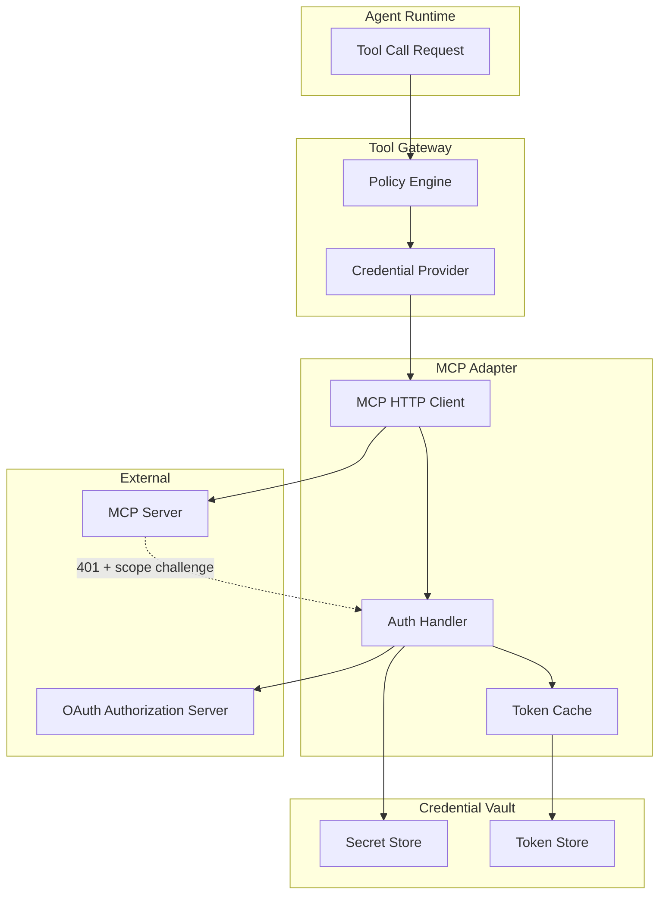

# MCP OAuth2 安全增强详细设计

## 1. 背景与目标

### 1.1 当前状态

当前 `seahorse-agent-adapter-mcp-http` 模块已实现基础的 MCP HTTP 适配器，支持：
- MCP Server 配置（name/url/enabled）
- 基础的 HTTP 调用
- 工具发现和注册
- Allowlist 机制

### 1.2 缺失能力

根据 [MCP Authorization Specification](https://modelcontextprotocol.io/specification/2025-11-25/basic/authorization)，当前缺失：
1. **OAuth 2.1 支持**：无法处理需要 OAuth 认证的 MCP Server
2. **Scope Challenge 处理**：无法响应 `WWW-Authenticate` 头中的 scope 要求
3. **Token 管理**：缺少 token 获取、刷新、撤销机制
4. **凭据隔离**：token 可能泄露到日志、trace 或 prompt 中
5. **多租户支持**：无法按 tenant/user/agent 隔离凭据

### 1.3 设计目标

1. **安全第一**：token 不进入明文日志、trace、prompt
2. **标准兼容**：遵循 OAuth 2.1 和 MCP Authorization 规范
3. **多策略支持**：支持 NONE、STATIC_BEARER、OAUTH2、CLIENT_CREDENTIALS、USER_DELEGATED
4. **降级友好**：OAuth 失败时能降级或明确拒绝
5. **可观测**：认证失败、token 刷新、scope 不足等事件可审计

---

## 2. 架构设计

### 2.1 整体架构



### 2.2 核心组件

| 组件 | 职责 | 位置 |
|------|------|------|
| `McpAuthStrategy` | 认证策略接口 | `kernel/ports/outbound/mcp` |
| `OAuth2McpAuthStrategy` | OAuth 2.1 实现 | `adapter-mcp-http` |
| `McpTokenProvider` | Token 获取与刷新 | `adapter-mcp-http` |
| `McpCredentialVault` | 凭据存储 | `adapter-credential-vault` (新增) |
| `McpScopeChallenge` | Scope challenge 解析 | `adapter-mcp-http` |
| `McpAuthAuditPort` | 认证审计 | `kernel/ports/outbound/audit` |

---

## 3. 领域模型设计

### 3.1 MCP Server 配置扩展

```java
public class McpServerConfig {
    private String name;
    private String url;
    private boolean enabled;
    
    // 新增字段
    private McpAuthType authType;  // NONE, STATIC_BEARER, OAUTH2, CLIENT_CREDENTIALS, USER_DELEGATED
    private String authorizationServerMetadataUrl;  // OAuth 2.1 metadata endpoint
    private String protectedResourceMetadataUrl;    // MCP protected resource metadata
    private String clientId;
    private String clientSecretRef;  // 引用 Vault 中的 secret，不存明文
    private List<String> defaultScopes;
    private String audience;         // OAuth audience
    private String resource;         // OAuth resource indicator
    private McpTokenStrategy tokenStrategy;  // AGENT_IDENTITY, USER_DELEGATED
    private String trustPolicyId;    // 信任策略 ID
}

public enum McpAuthType {
    NONE,                    // 无认证
    STATIC_BEARER,          // 静态 Bearer Token
    OAUTH2,                 // OAuth 2.1
    CLIENT_CREDENTIALS,     // OAuth Client Credentials Flow
    USER_DELEGATED          // OAuth Authorization Code Flow (用户委托)
}

public enum McpTokenStrategy {
    AGENT_IDENTITY,   // 使用 Agent 身份获取 token
    USER_DELEGATED    // 使用用户委托的 token
}
```

### 3.2 Token 模型

```java
public record McpAccessToken(
        String accessToken,
        String tokenType,        // Bearer
        Instant expiresAt,
        String refreshToken,
        List<String> scopes,
        String audience,
        Map<String, Object> metadata
) {
    public boolean isExpired() {
        return Instant.now().isAfter(expiresAt.minus(Duration.ofMinutes(5)));
    }
    
    public boolean hasScope(String scope) {
        return scopes != null && scopes.contains(scope);
    }
}
```

### 3.3 Scope Challenge 模型

```java
public record McpScopeChallenge(
        String realm,
        List<String> requiredScopes,
        String error,
        String errorDescription,
        String authorizationUri
) {
    public static McpScopeChallenge parse(String wwwAuthenticateHeader) {
        // 解析 WWW-Authenticate: Bearer realm="...", scope="...", error="insufficient_scope"
        // ...
    }
}
```

### 3.4 认证上下文

```java
public record McpAuthContext(
        String tenantId,
        String userId,
        String agentId,
        String runId,
        String mcpServerName,
        List<String> requestedScopes,
        Map<String, String> metadata
) {
}
```

---

## 4. 端口设计

### 4.1 出站端口

#### McpAuthStrategyPort

```java
public interface McpAuthStrategyPort {
    
    /**
     * 为 MCP 请求准备认证头
     */
    Optional<String> prepareAuthHeader(McpAuthContext context);
    
    /**
     * 处理 scope challenge
     */
    McpAuthResult handleScopeChallenge(McpScopeChallenge challenge, McpAuthContext context);
    
    /**
     * 刷新 token
     */
    Optional<McpAccessToken> refreshToken(String mcpServerName, String refreshToken);
    
    /**
     * 撤销 token
     */
    void revokeToken(String mcpServerName, String token);
}
```

#### McpCredentialVaultPort

```java
public interface McpCredentialVaultPort {
    
    /**
     * 存储 client secret
     */
    void storeClientSecret(String mcpServerName, String clientId, String clientSecret);
    
    /**
     * 获取 client secret
     */
    Optional<String> getClientSecret(String mcpServerName, String clientId);
    
    /**
     * 存储 access token
     */
    void storeAccessToken(String key, McpAccessToken token);
    
    /**
     * 获取 access token
     */
    Optional<McpAccessToken> getAccessToken(String key);
    
    /**
     * 删除 token
     */
    void deleteToken(String key);
    
    /**
     * 生成 token cache key
     */
    default String buildTokenKey(String mcpServerName, String tenantId, String userId) {
        return String.format("mcp:token:%s:%s:%s", mcpServerName, tenantId, userId);
    }
}
```

#### McpAuthAuditPort

```java
public interface McpAuthAuditPort {
    
    void logAuthAttempt(McpAuthContext context, boolean success, String reason);
    
    void logTokenRefresh(String mcpServerName, String tenantId, boolean success);
    
    void logScopeChallenge(McpScopeChallenge challenge, McpAuthContext context);
    
    void logTokenRevocation(String mcpServerName, String tokenId);
}
```

---

## 5. 适配器实现

### 5.1 OAuth2McpAuthStrategy

```java
@Slf4j
public class OAuth2McpAuthStrategy implements McpAuthStrategyPort {
    
    private final McpCredentialVaultPort credentialVault;
    private final McpAuthAuditPort auditPort;
    private final OkHttpClient httpClient;
    private final ObjectMapper objectMapper;
    
    @Override
    public Optional<String> prepareAuthHeader(McpAuthContext context) {
        String tokenKey = credentialVault.buildTokenKey(
                context.mcpServerName(),
                context.tenantId(),
                context.userId()
        );
        
        Optional<McpAccessToken> tokenOpt = credentialVault.getAccessToken(tokenKey);
        
        if (tokenOpt.isEmpty()) {
            // 首次请求，需要获取 token
            tokenOpt = acquireToken(context);
            if (tokenOpt.isEmpty()) {
                auditPort.logAuthAttempt(context, false, "token_acquisition_failed");
                return Optional.empty();
            }
            credentialVault.storeAccessToken(tokenKey, tokenOpt.get());
        }
        
        McpAccessToken token = tokenOpt.get();
        
        // 检查是否过期
        if (token.isExpired()) {
            if (token.refreshToken() != null) {
                Optional<McpAccessToken> refreshed = refreshToken(
                        context.mcpServerName(),
                        token.refreshToken()
                );
                if (refreshed.isPresent()) {
                    credentialVault.storeAccessToken(tokenKey, refreshed.get());
                    token = refreshed.get();
                } else {
                    // 刷新失败，删除旧 token
                    credentialVault.deleteToken(tokenKey);
                    auditPort.logAuthAttempt(context, false, "token_refresh_failed");
                    return Optional.empty();
                }
            } else {
                // 无 refresh token，需要重新获取
                credentialVault.deleteToken(tokenKey);
                return Optional.empty();
            }
        }
        
        // 检查 scope
        if (context.requestedScopes() != null) {
            for (String scope : context.requestedScopes()) {
                if (!token.hasScope(scope)) {
                    auditPort.logAuthAttempt(context, false, "insufficient_scope");
                    return Optional.empty();
                }
            }
        }
        
        auditPort.logAuthAttempt(context, true, "token_valid");
        return Optional.of("Bearer " + token.accessToken());
    }
    
    @Override
    public McpAuthResult handleScopeChallenge(McpScopeChallenge challenge, McpAuthContext context) {
        log.warn("MCP Server {} requires additional scopes: {}", 
                context.mcpServerName(), challenge.requiredScopes());
        
        auditPort.logScopeChallenge(challenge, context);
        
        // 尝试获取包含所需 scope 的新 token
        McpAuthContext enrichedContext = new McpAuthContext(
                context.tenantId(),
                context.userId(),
                context.agentId(),
                context.runId(),
                context.mcpServerName(),
                challenge.requiredScopes(),
                context.metadata()
        );
        
        Optional<McpAccessToken> newToken = acquireToken(enrichedContext);
        
        if (newToken.isPresent()) {
            String tokenKey = credentialVault.buildTokenKey(
                    context.mcpServerName(),
                    context.tenantId(),
                    context.userId()
            );
            credentialVault.storeAccessToken(tokenKey, newToken.get());
            return McpAuthResult.success(newToken.get());
        } else {
            return McpAuthResult.failure("scope_acquisition_failed", challenge);
        }
    }
    
    private Optional<McpAccessToken> acquireToken(McpAuthContext context) {
        // 实现 OAuth 2.1 Client Credentials Flow
        // 1. 从 Vault 获取 client secret
        // 2. 调用 token endpoint
        // 3. 解析响应
        // 4. 返回 McpAccessToken
        // ...
    }
    
    @Override
    public Optional<McpAccessToken> refreshToken(String mcpServerName, String refreshToken) {
        // 实现 token 刷新逻辑
        // ...
    }
    
    @Override
    public void revokeToken(String mcpServerName, String token) {
        // 实现 token 撤销逻辑
        // ...
    }
}
```

### 5.2 McpHttpClient 集成

```java
public class McpHttpToolAdapter implements ToolPort {
    
    private final McpAuthStrategyPort authStrategy;
    private final McpAuthAuditPort auditPort;
    
    @Override
    public ToolInvocationResult invoke(ToolInvocationRequest request) {
        McpAuthContext authContext = buildAuthContext(request);
        
        // 准备认证头
        Optional<String> authHeader = authStrategy.prepareAuthHeader(authContext);
        
        Request.Builder requestBuilder = new Request.Builder()
                .url(buildMcpUrl(request))
                .post(buildRequestBody(request));
        
        authHeader.ifPresent(header -> requestBuilder.addHeader("Authorization", header));
        
        try (Response response = httpClient.newCall(requestBuilder.build()).execute()) {
            
            if (response.code() == 401) {
                // 处理 scope challenge
                String wwwAuth = response.header("WWW-Authenticate");
                if (wwwAuth != null && wwwAuth.startsWith("Bearer")) {
                    McpScopeChallenge challenge = McpScopeChallenge.parse(wwwAuth);
                    McpAuthResult authResult = authStrategy.handleScopeChallenge(challenge, authContext);
                    
                    if (authResult.isSuccess()) {
                        // 重试请求
                        return retryWithNewToken(request, authResult.token());
                    } else {
                        return ToolInvocationResult.failure(
                                "insufficient_scope",
                                "MCP Server requires additional permissions: " + challenge.requiredScopes()
                        );
                    }
                }
            }
            
            if (!response.isSuccessful()) {
                return ToolInvocationResult.failure(
                        "mcp_error",
                        "MCP Server returned " + response.code()
                );
            }
            
            return parseSuccessResponse(response);
            
        } catch (IOException e) {
            log.error("MCP request failed", e);
            return ToolInvocationResult.failure("network_error", e.getMessage());
        }
    }
}
```

---

## 6. 凭据存储设计

### 6.1 Redis 实现（推荐）

```java
@RequiredArgsConstructor
public class RedisMcpCredentialVault implements McpCredentialVaultPort {
    
    private final RedisTemplate<String, String> redisTemplate;
    private final ObjectMapper objectMapper;
    private static final String SECRET_PREFIX = "mcp:secret:";
    private static final String TOKEN_PREFIX = "mcp:token:";
    
    @Override
    public void storeClientSecret(String mcpServerName, String clientId, String clientSecret) {
        String key = SECRET_PREFIX + mcpServerName + ":" + clientId;
        // 加密存储
        String encrypted = encrypt(clientSecret);
        redisTemplate.opsForValue().set(key, encrypted);
    }
    
    @Override
    public Optional<String> getClientSecret(String mcpServerName, String clientId) {
        String key = SECRET_PREFIX + mcpServerName + ":" + clientId;
        String encrypted = redisTemplate.opsForValue().get(key);
        if (encrypted == null) {
            return Optional.empty();
        }
        return Optional.of(decrypt(encrypted));
    }
    
    @Override
    public void storeAccessToken(String key, McpAccessToken token) {
        try {
            String json = objectMapper.writeValueAsString(token);
            long ttl = Duration.between(Instant.now(), token.expiresAt()).getSeconds();
            redisTemplate.opsForValue().set(TOKEN_PREFIX + key, json, ttl, TimeUnit.SECONDS);
        } catch (JsonProcessingException e) {
            throw new RuntimeException("Failed to serialize token", e);
        }
    }
    
    @Override
    public Optional<McpAccessToken> getAccessToken(String key) {
        String json = redisTemplate.opsForValue().get(TOKEN_PREFIX + key);
        if (json == null) {
            return Optional.empty();
        }
        try {
            return Optional.of(objectMapper.readValue(json, McpAccessToken.class));
        } catch (JsonProcessingException e) {
            log.error("Failed to deserialize token", e);
            return Optional.empty();
        }
    }
    
    @Override
    public void deleteToken(String key) {
        redisTemplate.delete(TOKEN_PREFIX + key);
    }
    
    private String encrypt(String plaintext) {
        // 使用 AES-256-GCM 加密
        // 密钥从环境变量或 KMS 获取
        // ...
    }
    
    private String decrypt(String ciphertext) {
        // 解密
        // ...
    }
}
```

### 6.2 JDBC 实现（备选）

```sql
CREATE TABLE sa_mcp_credential (
    id VARCHAR(64) PRIMARY KEY,
    mcp_server_name VARCHAR(128) NOT NULL,
    credential_type VARCHAR(32) NOT NULL,  -- CLIENT_SECRET, ACCESS_TOKEN, REFRESH_TOKEN
    tenant_id VARCHAR(64),
    user_id VARCHAR(64),
    encrypted_value TEXT NOT NULL,
    expires_at TIMESTAMP,
    created_at TIMESTAMP DEFAULT CURRENT_TIMESTAMP,
    updated_at TIMESTAMP DEFAULT CURRENT_TIMESTAMP,
    INDEX idx_server_type (mcp_server_name, credential_type),
    INDEX idx_tenant_user (tenant_id, user_id),
    INDEX idx_expires (expires_at)
);
```

---

## 7. 配置设计

### 7.1 application.yml

```yaml
seahorse-agent:
  adapters:
    mcp:
      servers:
        - name: github-mcp
          url: https://mcp.github.com
          enabled: true
          auth:
            type: OAUTH2
            authorization-server-metadata-url: https://github.com/.well-known/oauth-authorization-server
            protected-resource-metadata-url: https://mcp.github.com/.well-known/oauth-protected-resource
            client-id: seahorse-agent
            client-secret-ref: vault://mcp/github/client-secret
            default-scopes:
              - mcp:read
              - mcp:write
            audience: https://mcp.github.com
            token-strategy: AGENT_IDENTITY
            trust-policy-id: default-mcp-trust
            
        - name: internal-mcp
          url: http://internal-mcp.company.com
          enabled: true
          auth:
            type: STATIC_BEARER
            client-secret-ref: vault://mcp/internal/token
            
  credential-vault:
    type: redis  # redis, jdbc, vault
    encryption:
      algorithm: AES-256-GCM
      key-source: env  # env, kms, vault
      key-env-var: MCP_ENCRYPTION_KEY
```

---

## 8. 安全设计

### 8.1 Token 保护

| 场景 | 保护措施 |
|------|----------|
| 日志输出 | token 字段自动脱敏，只显示前 8 位 + `***` |
| Trace 记录 | 不记录 token 明文，只记录 token_id 或 hash |
| Prompt 注入 | token 不进入 prompt，只在 HTTP 层使用 |
| 错误消息 | 错误响应不包含 token |
| 审计日志 | 只记录 token 使用事件，不记录 token 值 |

### 8.2 加密存储

```java
public class McpCredentialEncryption {
    
    private static final String ALGORITHM = "AES/GCM/NoPadding";
    private static final int GCM_TAG_LENGTH = 128;
    private static final int GCM_IV_LENGTH = 12;
    
    public static String encrypt(String plaintext, SecretKey key) throws Exception {
        Cipher cipher = Cipher.getInstance(ALGORITHM);
        byte[] iv = new byte[GCM_IV_LENGTH];
        SecureRandom.getInstanceStrong().nextBytes(iv);
        GCMParameterSpec spec = new GCMParameterSpec(GCM_TAG_LENGTH, iv);
        cipher.init(Cipher.ENCRYPT_MODE, key, spec);
        
        byte[] ciphertext = cipher.doFinal(plaintext.getBytes(StandardCharsets.UTF_8));
        
        // 格式: iv + ciphertext
        byte[] combined = new byte[iv.length + ciphertext.length];
        System.arraycopy(iv, 0, combined, 0, iv.length);
        System.arraycopy(ciphertext, 0, combined, iv.length, ciphertext.length);
        
        return Base64.getEncoder().encodeToString(combined);
    }
    
    public static String decrypt(String encrypted, SecretKey key) throws Exception {
        byte[] combined = Base64.getDecoder().decode(encrypted);
        
        byte[] iv = new byte[GCM_IV_LENGTH];
        byte[] ciphertext = new byte[combined.length - GCM_IV_LENGTH];
        System.arraycopy(combined, 0, iv, 0, iv.length);
        System.arraycopy(combined, iv.length, ciphertext, 0, ciphertext.length);
        
        Cipher cipher = Cipher.getInstance(ALGORITHM);
        GCMParameterSpec spec = new GCMParameterSpec(GCM_TAG_LENGTH, iv);
        cipher.init(Cipher.DECRYPT_MODE, key, spec);
        
        byte[] plaintext = cipher.doFinal(ciphertext);
        return new String(plaintext, StandardCharsets.UTF_8);
    }
}
```

---

## 9. 测试设计

### 9.1 单元测试

```java
@Test
void shouldAcquireTokenWithClientCredentials() {
    // Given
    McpAuthContext context = new McpAuthContext(
            "tenant-1", "user-1", "agent-1", "run-1",
            "test-mcp", List.of("mcp:read"), Map.of()
    );
    
    when(credentialVault.getClientSecret("test-mcp", "client-id"))
            .thenReturn(Optional.of("client-secret"));
    
    // Mock OAuth server response
    mockWebServer.enqueue(new MockResponse()
            .setResponseCode(200)
            .setBody("""
                {
                    "access_token": "test-token",
                    "token_type": "Bearer",
                    "expires_in": 3600,
                    "scope": "mcp:read mcp:write"
                }
                """));
    
    // When
    Optional<String> authHeader = authStrategy.prepareAuthHeader(context);
    
    // Then
    assertThat(authHeader).isPresent();
    assertThat(authHeader.get()).startsWith("Bearer ");
    verify(auditPort).logAuthAttempt(context, true, "token_valid");
}

@Test
void shouldHandleScopeChallenge() {
    // Given
    String wwwAuth = "Bearer realm=\"mcp\", scope=\"mcp:admin\", error=\"insufficient_scope\"";
    McpScopeChallenge challenge = McpScopeChallenge.parse(wwwAuth);
    
    McpAuthContext context = new McpAuthContext(
            "tenant-1", "user-1", "agent-1", "run-1",
            "test-mcp", List.of("mcp:read"), Map.of()
    );
    
    // When
    McpAuthResult result = authStrategy.handleScopeChallenge(challenge, context);
    
    // Then
    verify(auditPort).logScopeChallenge(challenge, context);
}

@Test
void shouldRefreshExpiredToken() {
    // Given
    McpAccessToken expiredToken = new McpAccessToken(
            "old-token", "Bearer",
            Instant.now().minus(Duration.ofHours(1)),
            "refresh-token",
            List.of("mcp:read"), null, Map.of()
    );
    
    when(credentialVault.getAccessToken(anyString()))
            .thenReturn(Optional.of(expiredToken));
    
    mockWebServer.enqueue(new MockResponse()
            .setResponseCode(200)
            .setBody("""
                {
                    "access_token": "new-token",
                    "token_type": "Bearer",
                    "expires_in": 3600,
                    "refresh_token": "new-refresh-token"
                }
                """));
    
    // When
    Optional<String> authHeader = authStrategy.prepareAuthHeader(context);
    
    // Then
    assertThat(authHeader).isPresent();
    verify(credentialVault).storeAccessToken(anyString(), argThat(token ->
            token.accessToken().equals("new-token")
    ));
}
```

### 9.2 集成测试

```java
@SpringBootTest
@TestPropertySource(properties = {
        "seahorse-agent.adapters.mcp.servers[0].name=test-mcp",
        "seahorse-agent.adapters.mcp.servers[0].auth.type=OAUTH2"
})
class McpOAuth2IntegrationTests {
    
    @Autowired
    private ToolGatewayPort toolGateway;
    
    @Autowired
    private McpCredentialVaultPort credentialVault;
    
    @Test
    void shouldInvokeMcpToolWithOAuth() {
        // Given
        credentialVault.storeClientSecret("test-mcp", "client-id", "client-secret");
        
        ToolInvocationRequest request = ToolInvocationRequest.builder()
                .toolId("test-mcp:search")
                .tenantId("tenant-1")
                .userId("user-1")
                .arguments(Map.of("query", "test"))
                .build();
        
        // When
        ToolInvocationResult result = toolGateway.invoke(request);
        
        // Then
        assertThat(result.isSuccess()).isTrue();
    }
}
```

---

## 10. 实施计划

### 10.1 Phase 1：基础设施（2 周）

- [ ] 创建 `McpAuthStrategyPort` 端口
- [ ] 创建 `McpCredentialVaultPort` 端口
- [ ] 实现 `RedisMcpCredentialVault`
- [ ] 实现凭据加密/解密
- [ ] 单元测试覆盖

### 10.2 Phase 2：OAuth 实现（2 周）

- [ ] 实现 `OAuth2McpAuthStrategy`
- [ ] 实现 token 获取（Client Credentials Flow）
- [ ] 实现 token 刷新
- [ ] 实现 scope challenge 处理
- [ ] 集成测试

### 10.3 Phase 3：集成与审计（1 周）

- [ ] 集成到 `McpHttpToolAdapter`
- [ ] 实现 `McpAuthAuditPort`
- [ ] Token 脱敏处理
- [ ] 配置自动装配
- [ ] 文档更新

### 10.4 Phase 4：生产化（1 周）

- [ ] 性能测试
- [ ] 安全审计
- [ ] 监控告警
- [ ] 运维文档

---

## 11. 风险与缓解

| 风险 | 影响 | 概率 | 缓解措施 |
|------|------|------|----------|
| OAuth Server 不可用 | 高 | 中 | 实现降级机制，缓存 token |
| Token 泄露 | 高 | 低 | 加密存储，脱敏日志，定期轮换 |
| Scope 不足 | 中 | 中 | 明确错误提示，支持 step-up auth |
| 性能开销 | 中 | 低 | Token 缓存，连接池复用 |
| 多租户隔离失败 | 高 | 低 | 严格的 key 命名规范，审计日志 |

---

## 12. 参考资料

- [MCP Authorization Specification](https://modelcontextprotocol.io/specification/2025-11-25/basic/authorization)
- [OAuth 2.1 Draft](https://datatracker.ietf.org/doc/html/draft-ietf-oauth-v2-1-10)
- [RFC 8707 - Resource Indicators](https://datatracker.ietf.org/doc/html/rfc8707)
- [RFC 9068 - JWT Profile for OAuth 2.0 Access Tokens](https://datatracker.ietf.org/doc/html/rfc9068)
