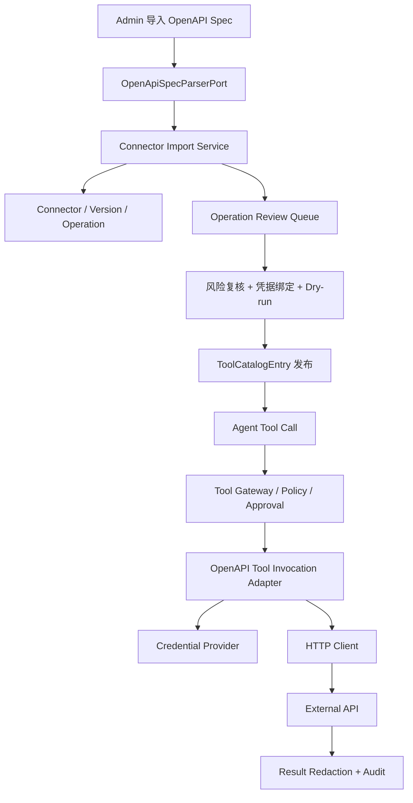

# OpenAPI Connector 详细设计

生成日期：2026-05-31

## 1. 结论

OpenAPI Connector 已经不是“完全未实现”的规划项。当前代码已具备 OpenAPI 3.0 spec 解析、Connector/Version/Operation/CredentialBinding 领域模型、JDBC 持久化、Web API、前端导入与 operation 启停入口，并且 operation 启用时会写入 Tool Catalog。

剩余设计重点不应再重复“如何创建连接器表”，而应聚焦四个闭环：

1. Connector 从“导入结果”升级为“可审查、可回滚、可执行”的外部系统接入资产。
2. Operation 从“生成 ToolCatalogEntry”升级为“可 dry-run、可绑定凭据、可审计调用”的真实工具。
3. CredentialBinding 从“手填 secretRef”升级为“可选择、可验证、可轮换、可最小权限”的凭据绑定工作流。
4. UI 从“列表/详情/启停”升级为“导入向导、版本 diff、风险复核、发布门禁、调用回放”的运营台。

## 2. 当前实现状态

### 2.1 已落地能力

| 能力 | 当前状态 | 代码证据 |
| --- | --- | --- |
| OpenAPI spec 解析 | 已有 OpenAPI 3.x parser adapter，解析 operation/schema/resourceType | `seahorse-agent-adapter-openapi/src/main/java/com/miracle/ai/seahorse/agent/adapters/openapi/OpenApiSpecParserAdapter.java` |
| 连接器导入 | 已有 `KernelOpenApiConnectorImportService#importSpec`，按 tenant/name 生成 connectorId，按 spec hash 生成 version | `KernelOpenApiConnectorImportService.java` |
| 版本与 operation 持久化 | 已有 `Connector`、`ConnectorVersion`、`ConnectorOperation` 领域模型与 JDBC adapter | `JdbcConnectorRepositoryAdapter.java` |
| operation 风险初判 | GET=LOW/READ，POST/PUT/PATCH=MEDIUM/WRITE，DELETE=HIGH/DELETE 且需要审批 | `ConnectorOperationRiskMapper.java` |
| 默认禁用 | 导入后的 operation 默认 `DISABLED`，管理员启用后才写入 Tool Catalog | `KernelOpenApiConnectorImportService#toOperation` |
| 凭据绑定 | 已有 `ConnectorCredentialBinding`，新绑定会把同 authType 旧绑定 rotate | `JdbcConnectorCredentialBindingRepositoryAdapter.java` |
| 启用门禁 | 需要凭据的 operation 必须有 active binding；高风险 operation 需要 approvalPolicyId 或 operator confirmation | `KernelOpenApiConnectorImportService#enableOperation` |
| 审计 | import、credential bind、enable、disable 都写入 audit ledger | `KernelOpenApiConnectorImportService#appendAudit` |
| Web API | 已有导入、列表、operation 查询、凭据绑定、启停接口 | `SeahorseOpenApiConnectorController.java` |
| 前端入口 | 已有 `/admin/integrations/connectors` 与详情页，支持导入 spec、查看 operation、绑定凭据、启停 | `frontend/src/pages/admin/integrations/*` |

### 2.2 真实缺口

| 缺口 | 影响 | 设计处理 |
| --- | --- | --- |
| 缺少 OpenAPI operation 执行适配器 | Tool Catalog 中出现 OPENAPI provider 后，真实 agent tool call 仍没有 provider-specific invoker | 新增 OpenAPI tool invocation adapter，接入 Tool Gateway、Credential Provider、HTTP client 与响应脱敏 |
| 缺少 spec 版本 diff 与变更复核 | 重导入同一 connector 时，管理员无法看到新增、删除、破坏性 schema 变更 | 新增 version diff、operation review、变更摘要和启用策略继承规则 |
| 启用 UI 没有完整高风险确认流 | 高风险 DELETE 等 operation 可能因缺少 approvalPolicyId/operatorConfirmedRisk 而启用失败，或只能走弱确认 | 详情页启用弹窗必须展示风险、审批策略、凭据状态和 dry-run 结果 |
| 凭据绑定只接受引用文本 | 管理员无法选择已有 secret、验证 scope、查看轮换状态 | 接入 Secret 管理页，支持 secret picker、scope 校验、试连和轮换提醒 |
| 缺少 dry-run 与 mock 测试 | 启用前无法验证 path 参数、auth、schema、错误响应 | 引入 `ConnectorDryRunPort` 与 dry-run API，保存最近一次验证结果 |
| 缺少调用级审计与输出治理 | 外部系统调用结果可能携带敏感字段，调用失败也缺少可定位信息 | 走 Tool Gateway audit、redaction、policy decision、cost/latency metrics |
| 缺少 operation 生命周期批量治理 | 多 operation 接入时逐个处理效率低，禁用/回滚不够清晰 | 支持按 tag/path/risk 批量确认、批量禁用和回滚到上一 version |

## 3. 目标架构



目标架构保留当前六边形边界：kernel 负责 Connector 领域模型、导入、审查、发布和审计；adapter 负责 OpenAPI parser、HTTP 调用、JDBC 存储和 Web API。外部 API 调用不得绕过 Tool Gateway。

## 4. 领域模型设计

### 4.1 Connector

继续使用现有 `Connector`，补充运营字段：

| 字段 | 说明 |
| --- | --- |
| `status` | `IMPORTED`、`REVIEWING`、`ACTIVE`、`DISABLED`、`ARCHIVED` |
| `baseUrl` | 从 servers 推断或由管理员确认，执行时必须来自受信配置 |
| `ownerTeam` | 默认 `connector:{connectorId}`，可转为真实团队 |
| `lastPublishedVersionId` | 当前 Tool Catalog 生效版本 |
| `lastDryRunStatus` | 最近一次 dry-run 总体状态 |

### 4.2 ConnectorVersion

当前已有 spec hash 和 specJson。需要补充：

| 字段 | 说明 |
| --- | --- |
| `versionNo` | 同 connector 下递增，供 UI 展示 |
| `diffSummaryJson` | 新增、删除、schema change、risk change 统计 |
| `reviewStatus` | `PENDING`、`APPROVED`、`REJECTED` |
| `publishedAt` | 该版本首次有 operation 发布到 Tool Catalog 的时间 |

### 4.3 ConnectorOperation

当前模型已经覆盖 method/path/schema/toolId/risk/status。需要补充：

| 字段 | 说明 |
| --- | --- |
| `authRequirementJson` | 从 security scheme 推断出的认证方式、scope、header/query 注入位置 |
| `serverPolicyJson` | 允许的 baseUrl、path template、host allowlist |
| `reviewStatus` | `AUTO_ACCEPTED`、`NEEDS_REVIEW`、`APPROVED`、`REJECTED` |
| `dryRunStatus` | `NOT_RUN`、`PASSED`、`FAILED` |
| `lastDryRunId` | 最近一次验证记录 |
| `approvalPolicyId` | 高风险 operation 的审批策略 |

### 4.4 ConnectorCredentialBinding

继续使用现有 binding，补充：

| 字段 | 说明 |
| --- | --- |
| `scopeJson` | 绑定 scope 与 operation 要求 scope 的交集 |
| `validationStatus` | `UNVERIFIED`、`VALID`、`INVALID`、`EXPIRED` |
| `lastValidatedAt` | 最近一次试连或 token 验证时间 |
| `rotationDueAt` | 轮换提醒时间 |

## 5. 后端端口与服务

### 5.1 导入与 diff

```text
OpenApiConnectorInboundPort
  importSpec(command) -> ConnectorImportResult
  page(query) -> ConnectorPage
  listOperations(connectorId) -> List<ConnectorOperation>
  diffVersion(connectorId, versionId) -> ConnectorVersionDiff
  approveOperation(command) -> ConnectorOperation
  rejectOperation(command) -> ConnectorOperation
```

diff 规则：

| 变更 | 处理 |
| --- | --- |
| 新增 operation | 默认 `DISABLED`，进入 review |
| 删除 operation | Tool Catalog 对应 tool 默认禁用，保留历史调用审计 |
| schema 输入变更 | 标记 `BREAKING_SCHEMA_CHANGE`，需要人工确认 |
| method/path 变更 | 视为新 operation，不复用旧 operationId |
| risk 从低到高 | 清空自动启用状态，要求重新确认 |
| risk 从高到低 | 保留审批策略，但允许管理员降级 |

### 5.2 执行适配器

新增 `OpenApiToolInvocationPort` 或直接新增 `OpenApiToolPortAdapter implements DescribedToolPort`：

```text
OpenApiToolPortAdapter.invoke(toolCallId, toolId, arguments)
  -> ConnectorRepository.findOperationByToolId(toolId)
  -> ToolCatalogRepository.findById(toolId)
  -> ConnectorCredentialBindingRepository.findActive(tenantId, connectorId, operationId, authType)
  -> CredentialProvider.resolve(secretRef)
  -> OpenApiRequestBuilder.build(operation, arguments, credential)
  -> HttpClient.execute(request)
  -> OpenApiResponseSanitizer.sanitize(response)
  -> ToolInvocationResult.ok(json)
```

执行约束：

1. 只允许调用 enabled operation。
2. URL 必须由 `baseUrl + path template` 构造，不允许 arguments 覆盖 host/scheme。
3. Header 注入只允许来自 CredentialProvider 和 operation 白名单。
4. 响应体必须经过 size limit、content-type allowlist、敏感字段脱敏。
5. HTTP 4xx/5xx 转为结构化失败，不抛出到 agent loop。

### 5.3 Dry-run

新增 dry-run API：

| Method | Path | 说明 |
| --- | --- | --- |
| `POST` | `/api/connectors/{connectorId}/operations/{operationId}/dry-run` | 使用管理员输入参数和绑定凭据执行一次验证 |
| `GET` | `/api/connectors/{connectorId}/operations/{operationId}/dry-runs` | 查看最近验证记录 |

dry-run 记录字段：

| 字段 | 说明 |
| --- | --- |
| `dryRunId` | 验证 ID |
| `operationId` | operation |
| `requestPreviewJson` | 脱敏后的 method/path/query/header 摘要 |
| `statusCode` | HTTP 状态码 |
| `success` | 是否通过 |
| `errorCode` | `SCHEMA_INVALID`、`AUTH_FAILED`、`HOST_DENIED`、`HTTP_ERROR` |
| `responsePreviewJson` | 截断和脱敏后的响应预览 |

## 6. 前端设计

### 6.1 页面结构

| 页面 | 路由 | 当前状态 | 目标增强 |
| --- | --- | --- | --- |
| Connector 列表 | `/admin/integrations/connectors` | 已有列表和导入弹窗 | 增加 status、version、lastDryRun、enabled operation 数 |
| 导入向导 | 弹窗或 `/new` | 已有 name/spec 文本输入 | 拆成 spec 输入、解析预览、风险复核、导入确认四步 |
| Connector 详情 | `/admin/integrations/connectors/:connectorId` | 已有 operation 表格、凭据绑定、启停 | 增加 version diff、tag 分组、批量操作、dry-run |
| Operation 详情 | 新增 drawer | 未独立展示 | 展示 schema、auth、risk、approval、dry-run history、调用审计 |
| Credential 绑定 | 弹窗 | 已有 secretRef 文本输入 | 改为 secret picker、scope 校验、试连 |

### 6.2 启用 operation 工作流

1. 管理员点击启用。
2. UI 拉取 operation 风险、auth requirement、credential binding、latest dry-run。
3. 若缺少 active credential，则要求先绑定。
4. 若 `requiresApproval=true`，要求选择 approval policy 或输入高风险确认理由。
5. 若 dry-run 未通过，默认不允许启用；管理员可用 `operatorConfirmedRisk=true` 强制启用，但必须写审计 reason。
6. 后端启用 operation 并写 Tool Catalog。

### 6.3 导入向导校验

| 校验 | 阻断级别 |
| --- | --- |
| 非 OpenAPI 3.x | 阻断 |
| 无 paths 或无 operation | 阻断 |
| operationId 冲突 | 阻断，需要管理员选择重命名策略 |
| 无 servers | 警告，要求手动填写 baseUrl |
| DELETE/PATCH/POST 写操作 | 警告，进入风险复核 |
| security scheme 未识别 | 警告，默认 operation 不能启用 |

## 7. 安全治理

1. OpenAPI spec 中的 server host 必须进入 connector host allowlist。
2. 导入后 operation 默认 disabled，不允许自动进入可调用工具集。
3. 高风险 operation 必须绑定 approval policy 或由管理员显式确认。
4. 凭据只以 secretRef 传递，禁止写入 prompt、trace、audit 明文。
5. 请求与响应都写审计摘要，不记录完整敏感 payload。
6. 响应脱敏规则优先级：显式 schema 标记 > 默认敏感字段名 > content-type 策略 > size limit。
7. 禁用 operation 时必须同步禁用 Tool Catalog entry，历史版本保留审计查询能力。

## 8. 分阶段落地

### P0：把已导入 operation 变成真实可执行工具

1. 新增 OpenAPI invocation adapter。
2. 通过 `toolId -> ConnectorOperation` 定位 operation。
3. 接入 CredentialProvider 与 HTTP client。
4. 输出统一 `ToolInvocationResult`，失败不抛异常。
5. 增加单元测试覆盖 GET/POST/DELETE、凭据缺失、host deny、响应脱敏。

### P1：导入审查与 dry-run

1. 增加 version diff 和 operation review 字段。
2. 增加 dry-run API 与 dry-run history。
3. 前端导入向导增加解析预览、风险复核和 dry-run。
4. 高风险启用弹窗要求 approval policy 或确认理由。

### P2：凭据运营化

1. Credential 绑定弹窗接入 Secret picker。
2. 增加 scope 校验与 binding validation status。
3. 增加凭据轮换提醒与失效提示。
4. 导入 security scheme 时自动生成 auth requirement。

### P3：连接器版本治理

1. 支持 connector version diff 视图。
2. 支持按 version 批量禁用删除的 operation。
3. 支持回滚到上一 published version。
4. 增加 operation 调用审计筛选入口。

## 9. 验收标准

1. 导入 OpenAPI 3.x spec 后，connector、version、operation 均持久化，operation 默认 disabled。
2. 启用低风险 GET operation 后，Tool Catalog 出现 enabled OPENAPI tool。
3. 未绑定凭据的 operation 启用失败，并返回明确错误。
4. 高风险 DELETE operation 没有 approval policy 且没有 operator confirmation 时启用失败。
5. 真实 tool call 通过 Tool Gateway 进入 OpenAPI invocation adapter，并完成 HTTP 调用。
6. 外部 API 响应中的敏感字段不会进入 tool result 明文。
7. 禁用 operation 后，对应 Tool Catalog entry 变为 disabled。
8. 前端可展示 spec diff、operation dry-run、凭据状态和最近调用审计摘要。

## 10. 测试清单

| 测试 | 目标 |
| --- | --- |
| `KernelOpenApiConnectorImportServiceTests` | 导入、重复导入、风险映射、启停门禁 |
| `OpenApiToolPortAdapterTests` | HTTP 构造、凭据注入、host allowlist、错误映射 |
| `JdbcConnectorRepositoryAdapterTests` | connector/version/operation/binding 持久化 |
| `SeahorseOpenApiConnectorControllerTests` | API 入参、权限、响应结构 |
| `OpenApiConnectorPage.test.tsx` | 导入向导、operation 启停、凭据绑定 |

## 11. 非目标

1. 不在 Connector 中实现通用 API 网关；它只负责把 OpenAPI operation 安全地注册成 Seahorse tool。
2. 不允许 OpenAPI spec 自带脚本或任意代码执行。
3. 不在 P0 支持任意 OAuth 用户授权流程；P0 只消费已有 secretRef 或平台 CredentialProvider 能解析的凭据。
4. 不自动启用导入的写操作。
