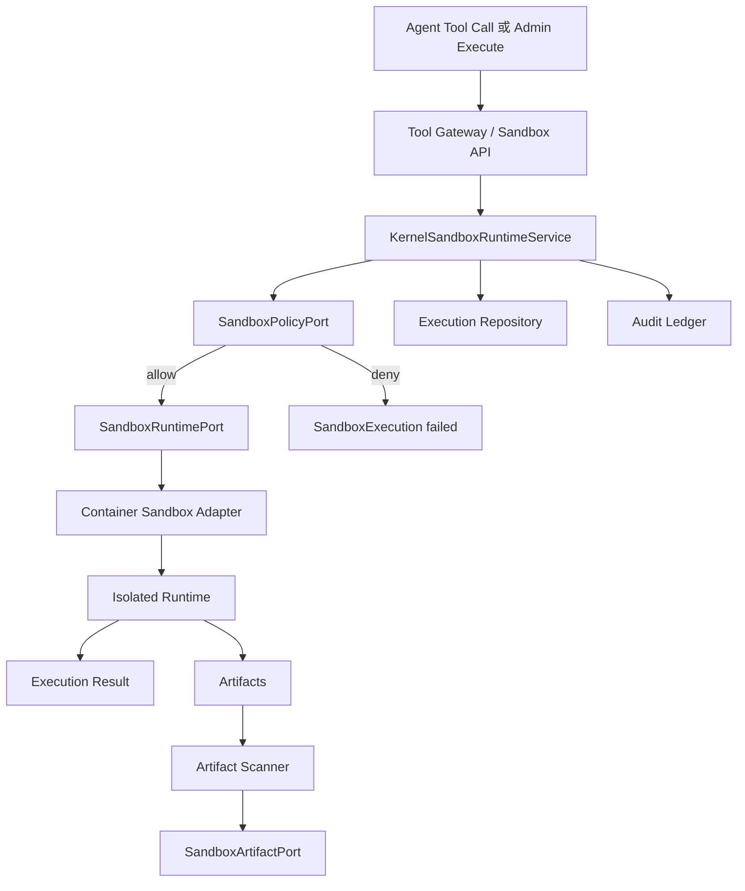

# Sandbox Runtime 详细设计

生成日期：2026-05-31

## 1. 结论

Sandbox Runtime 当前已经具备 kernel 编排、策略端口、运行时端口、artifact 端口、JDBC 存储、Web API 和前端页面骨架，但默认 `SandboxRuntimePort` 是 `unsupported()`，并不会提供真实隔离执行能力。因此它的现状应定义为“控制面与审计基础已实现，生产级隔离 runtime 未落地”。

剩余设计重点是：新增外部隔离 runtime adapter，补齐资源配额、网络 allowlist、内容级 MIME/病毒/PII 扫描、artifact 详情/下载治理，并把 sandbox 执行接入 Agent 工具和运行记录。

## 2. 当前实现状态

### 2.1 已落地能力

| 能力 | 当前状态 | 代码证据 |
| --- | --- | --- |
| 入站端口 | 已有 `SandboxRuntimeInboundPort#createSession/execute/close/listArtifacts` | `SandboxRuntimeInboundPort.java` |
| 编排服务 | 已有 `KernelSandboxRuntimeService`，负责 policy check、runtime 调用、执行记录、artifact 保存和 audit | `KernelSandboxRuntimeService.java` |
| 策略端口 | 已有 `SandboxPolicyPort` 与 `DefaultSandboxPolicyPort`，默认网络 `DENY_ALL` | `DefaultSandboxPolicyPort.java` |
| 运行时端口 | 已有 `SandboxRuntimePort#createSession/execute/closeSession` | `SandboxRuntimePort.java` |
| 默认 runtime | 默认 bean 是 `SandboxRuntimePort.unsupported()`，execute 返回 `RUNTIME_UNSUPPORTED` | `SeahorseAgentKernelRegistryAutoConfiguration.java` |
| 存储 | 已有 `sa_sandbox_session`、`sa_sandbox_execution`、`sa_sandbox_artifact` 对应 JDBC adapter | `JdbcSandboxRepositoryAdapter.java` |
| Web API | 已有创建 session、execute、close、list executions、list artifacts API | `SeahorseSandboxController.java` |
| 前端页面 | 已有 `/admin/sandbox`，可创建 session、输入参数、执行、查看结果、execution history 和 artifact | `frontend/src/pages/admin/sandbox/SandboxPage.tsx` |
| artifact scanner | 已有 `SandboxArtifactScannerPort`、默认保守 scanner、`REDACTED` 状态和 prompt visibility gate；scanner 失败 fail closed | `DefaultSandboxArtifactScannerPort.java`、`KernelSandboxRuntimeService.java` |

### 2.2 真实缺口

| 缺口 | 影响 | 设计处理 |
| --- | --- | --- |
| 缺少真实隔离 runtime | 无法执行 Code Interpreter、Browser Automation、Shell 等高风险能力 | 新增 Docker/Podman sandbox adapter，P1 可替换为 gVisor 或 Firecracker |
| 真实 runtime 清理未落地 | close 已透传到 `SandboxRuntimePort#closeSession`，但默认 unsupported runtime 没有真实容器/进程可释放 | Docker/Podman adapter 实现时接入容器、进程和 workspace 清理 |
| 缺少资源配额 | CPU、内存、磁盘、执行时间、输出大小不可控 | 新增 `SandboxResourcePolicy` 和 runtime profile |
| 内容级 artifact 扫描未落地 | 基础 metadata scanner 和 prompt visibility gate 已落地；仍缺对象内容读取、病毒/PII/secret 深度扫描、redaction summary 和下载授权闭环 | 在真实 container runtime 与 object storage artifact 写入后接入内容级 scanner |
| 网络策略只有默认 deny 与 allowlist 基础 | 缺少按 tenant/agent/tool 的策略配置、DNS/IP 限制、审计可视化 | 引入 policy profile 和 network decision log |
| UI 偏 demo | execution history 已补齐；仍缺 session 列表、artifact 详情、policy preview | 升级为 Sandbox Operations 页面 |
| 未接入 Agent 工具 | 沙箱页面可手动调用，但 agent loop 中的 code/shell/browser 工具尚无统一 sandbox wrapper | 新增 sandbox-backed tool adapters |

## 3. 目标架构



核心原则：

1. 主 JVM 不执行任意脚本、shell 或浏览器自动化。
2. 所有高风险执行都必须通过 `SandboxRuntimePort`，且默认 fail closed。
3. artifact 进入 prompt 前必须经过扫描和脱敏。
4. network 默认 deny，只能按 policy profile 开放。
5. session、execution、artifact 都要具备审计与可追溯 ID。

## 4. 运行时模型

### 4.1 SandboxRuntimeType

| 类型 | P0 行为 | P1/P2 扩展 |
| --- | --- | --- |
| `CODE_INTERPRETER` | Python/Node 受限执行 | 预装数据分析包、图表产物 |
| `BROWSER_AUTOMATION` | Playwright 受限浏览器 | 视频录制、HAR、截图 artifact |
| `SHELL` | 只允许 allowlisted command | 交互式 shell 不进入 P0 |
| `FILE_CONVERSION` | 文档转换、OCR、压缩解压 | 与 Tika/LibreOffice adapter 隔离运行 |

### 4.2 SandboxSession

当前字段已经覆盖 sessionId、tenantId、runId、runtimeType、status、reasonCode、createdAt、finishedAt。目标补充：

| 字段 | 说明 |
| --- | --- |
| `profileId` | runtime profile，如 `python-small`、`browser-readonly` |
| `containerId` | 外部 runtime handle，只存引用，不暴露给 prompt |
| `resourceLimitsJson` | CPU、memory、disk、timeout、output limit |
| `networkPolicyJson` | deny/allowlist、DNS、egress proxy |
| `workspaceRef` | workspace 存储引用 |
| `expiresAt` | session TTL |

### 4.3 SandboxExecution

目标字段：

| 字段 | 说明 |
| --- | --- |
| `executionId` | 执行 ID |
| `sessionId` | 所属 session |
| `inputDigest` | 输入摘要，不保存完整敏感 input |
| `status` | `RUNNING`、`SUCCEEDED`、`FAILED`、`CANCELLED`、`TIMED_OUT` |
| `stdoutPreview` | 截断输出 |
| `stderrPreview` | 截断错误 |
| `exitCode` | 外部进程退出码 |
| `durationMs` | 耗时 |
| `resourceUsageJson` | CPU time、memory peak、network bytes |
| `reasonCode` | policy/runtime failure code |

### 4.4 SandboxArtifact

目标字段：

| 字段 | 说明 |
| --- | --- |
| `artifactId` | artifact ID |
| `sessionId` | session |
| `executionId` | 来源 execution |
| `storageRef` | 真实对象存储引用 |
| `mimeType` | 内容类型 |
| `sizeBytes` | 大小 |
| `scanStatus` | `PENDING`、`CLEAN`、`REDACTED`、`BLOCKED` |
| `promptVisible` | 只有 scan clean 或 redacted 后可为 true |
| `redactionSummaryJson` | 脱敏摘要 |

## 5. 端口设计

### 5.1 Runtime lifecycle

当前 `SandboxRuntimePort` 只有 create 和 execute。建议扩展：

```text
SandboxRuntimePort
  createSession(SandboxSessionRequest) -> SandboxSession
  execute(SandboxExecutionRequest) -> SandboxExecutionResult
  closeSession(SandboxSession) -> SandboxSession
  snapshot(SandboxSession) -> SandboxSnapshot
```

兼容策略：先新增 default 方法，避免破坏已有 `unsupported()`：

```text
default closeSession(session) -> session.closed(now)
default snapshot(session) -> SandboxSnapshot.unsupported(sessionId)
```

### 5.2 Policy

```text
SandboxPolicyPort.decide(SandboxPolicyRequest) -> SandboxPolicyDecision
```

`SandboxPolicyRequest` 需要补充：

| 字段 | 说明 |
| --- | --- |
| `tenantId` | 租户 |
| `agentId` | 发起 agent |
| `runId` | 发起 run |
| `toolId` | 发起工具 |
| `runtimeType` | runtime 类型 |
| `profileId` | runtime profile |
| `networkRequested` | 是否请求网络 |
| `requestedHosts` | host allowlist |
| `estimatedInputSize` | 输入大小 |
| `requestedTimeoutMs` | 请求超时 |

### 5.3 Artifact scanner

当前已落地基础端口：

```text
SandboxArtifactScannerPort
  scan(SandboxArtifactScanRequest) -> SandboxArtifactScanResult
```

当前 prompt visibility gate 由 `SandboxArtifact#promptVisible()` 承担：只有 `CLEAN` 或 `REDACTED` 且 sensitivity 不是 `SECRET` 的 artifact 可进入 prompt。后续内容级 scanner 或下载授权策略需要更细粒度治理时，可再扩展独立 `SandboxArtifactPolicyPort`。

扫描规则：

1. 当前默认 scanner 基于 media type、sensitivity 和敏感 URI marker 做保守 metadata 判定。
2. 命中 secret、token、private key、PII 的 artifact 默认 blocked 或 redacted。
3. 二进制文件除图片/PDF 预览外默认不进入 prompt。
4. scanner 失败时 fail closed，`promptVisible=false`。
5. 后续真实 runtime 写入 object storage 后，补齐内容级病毒/PII/secret 扫描和 redaction summary。

## 6. 运行时适配器设计

### 6.1 P0 Docker/Podman adapter

新增模块建议：`seahorse-agent-adapter-sandbox-container`

职责：

1. 根据 profile 创建临时容器。
2. 使用只读基础镜像和 per-session workspace volume。
3. 设置 CPU、memory、pids、disk quota。
4. 注入最小环境变量，不注入业务 secret。
5. 执行命令时设置 timeout 和 output limit。
6. 容器关闭后删除 workspace，artifact 先写入 object storage 或本地 storage adapter。

P0 profile：

| Profile | Runtime | Network | Command |
| --- | --- | --- | --- |
| `python-small` | Python 3 | deny | `python /workspace/main.py` |
| `node-small` | Node.js | deny | `node /workspace/main.js` |
| `browser-readonly` | Playwright | allowlist only | `node /workspace/browser-task.js` |
| `file-conversion` | LibreOffice/Tika helper | deny | allowlisted converter |

### 6.2 P1 加固 runtime

1. gVisor 或 Firecracker profile，用于更强隔离。
2. egress proxy 统一审计网络请求。
3. 镜像 SBOM 与镜像签名校验。
4. runtime 节点池健康检查与容量调度。

## 7. API 与 UI 设计

### 7.1 API

| Method | Path | 说明 |
| --- | --- | --- |
| `POST` | `/api/sandbox/sessions` | 创建 session |
| `POST` | `/api/sandbox/sessions/{sessionId}/execute` | 执行输入 |
| `POST` | `/api/sandbox/sessions/{sessionId}/close` | 关闭并释放 runtime |
| `GET` | `/api/sandbox/sessions/{sessionId}/executions` | 执行历史 |
| `GET` | `/api/sandbox/sessions/{sessionId}/artifacts` | artifact 列表 |
| `GET` | `/api/sandbox/artifacts/{artifactId}` | artifact 元数据 |
| `POST` | `/api/sandbox/policies/preview` | 策略预检查 |

### 7.2 UI

当前 `/admin/sandbox` 可保留为调试入口，目标升级为 Sandbox Operations：

| 区域 | 内容 |
| --- | --- |
| Session 列表 | runtimeType、status、runId、profile、createdAt、expiresAt |
| Policy Preview | network、host、quota、profile 的 allow/deny 解释 |
| Execution Console | 输入、执行、stdout/stderr、reasonCode、duration |
| Artifact Browser | scan status、promptVisible、mimeType、download、preview |
| Audit Timeline | session created、execution finished、artifact scanned、close |

## 8. 与 Agent 工具集成

新增 sandbox-backed tools：

| Tool | Runtime | 说明 |
| --- | --- | --- |
| `sandbox_python` | `CODE_INTERPRETER` | 执行 Python 片段，返回 stdout 和 artifact |
| `sandbox_browser` | `BROWSER_AUTOMATION` | 受限 Playwright 浏览，返回截图/HAR/summary |
| `sandbox_file_convert` | `FILE_CONVERSION` | 文件转换，返回 artifact |

集成规则：

1. 工具本身是普通 `DescribedToolPort`，内部只调用 `SandboxRuntimeInboundPort`。
2. 工具调用仍先通过 Tool Gateway policy 和 approval。
3. Tool result 只包含扫描通过的 artifact summary。
4. 真实 artifact 下载必须走授权 API，不进入 prompt。

## 9. 安全治理

1. 默认 runtime 为 unsupported 或 deny，不配置真实 adapter 时不执行。
2. 默认 network deny，allowlist 必须精确到 host，禁止通配公网。
3. 禁止挂载宿主敏感目录，workspace per session 隔离。
4. 禁止把平台 secret 注入 sandbox；需要外部凭据时通过受控 proxy。
5. stdout/stderr/output artifact 都做 size limit。
6. artifact scan 失败时不可 prompt visible。
7. session TTL 到期必须 close 并清理资源。
8. audit payload 只保存摘要、状态和引用，不保存完整敏感输入。

## 10. 分阶段落地

### P0：真实隔离执行最小闭环

1. 扩展 `SandboxRuntimePort` lifecycle。（已补齐 `closeSession` hook）
2. 新增 Docker/Podman runtime adapter。
3. 新增 runtime profile 配置。
4. 增加 execution history API。（已补齐 `GET /api/sandbox/sessions/{sessionId}/executions`）
5. 增加 container adapter 单元测试和本地集成测试。

### P1：artifact 安全闭环

1. 新增 artifact scanner port。（已补齐基础 metadata scanner）
2. 只有 scan clean/redacted 的 artifact 可 prompt visible。（已补齐）
3. UI 增加 artifact scan 状态和预览。（scan 状态已补齐；详情/预览/下载仍后续）
4. 增加 scanner fail-closed 测试。（已补齐）

### P2：Agent 工具化

1. 新增 `sandbox_python`、`sandbox_browser`、`sandbox_file_convert` tool adapters。
2. Tool Gateway policy 中区分 sandbox-backed tool。
3. Agent Inspector 展示 sandbox execution 与 artifact。
4. 加入审批与配额联动。

### P3：生产加固

1. 引入 egress proxy、runtime pool health、镜像签名。
2. 增加 gVisor/Firecracker profile。
3. 加入 tenant/agent 级 sandbox quota。
4. 增加自动清理与孤儿容器巡检。

## 11. 验收标准

1. 未配置真实 runtime adapter 时，execute 返回 `RUNTIME_UNSUPPORTED`，不执行任何宿主命令。
2. 配置 Docker/Podman adapter 后，Python profile 可在隔离容器内执行简单脚本。
3. 默认网络 deny 时，请求外部 host 会被 policy 拦截。
4. allowlisted host 可访问，非 allowlisted host 被拒绝并写 audit。
5. session close 会释放容器和 workspace。
6. artifact 未扫描通过前不会出现在 prompt-visible artifact 列表中。
7. execution history 可按 session 查询。
8. Agent tool 调用 sandbox 时，Tool Gateway、Policy、Audit 均生效。

## 12. 测试清单

| 测试 | 目标 |
| --- | --- |
| `KernelSandboxRuntimeServiceTests` | policy deny、runtime unsupported、artifact filtering、audit |
| `DefaultSandboxPolicyPortTests` | network deny、allowlist |
| `ContainerSandboxRuntimeAdapterTests` | create/execute/close、timeout、resource limit |
| `KernelSandboxRuntimeServiceTests` / `SandboxArtifactTests` | clean、redacted、blocked、scanner failure、prompt visibility |
| `SeahorseSandboxControllerTests` | API 入参和响应 |
| `SandboxPage.test.tsx` | session、execute、artifact history UI |

## 13. 非目标

1. 不在主 JVM 内运行任意脚本。
2. P0 不提供交互式 shell。
3. P0 不支持把平台 secret 直接暴露给 sandbox。
4. P0 不承诺强多租户内核级隔离，生产高风险租户使用 P1 加固 runtime。
