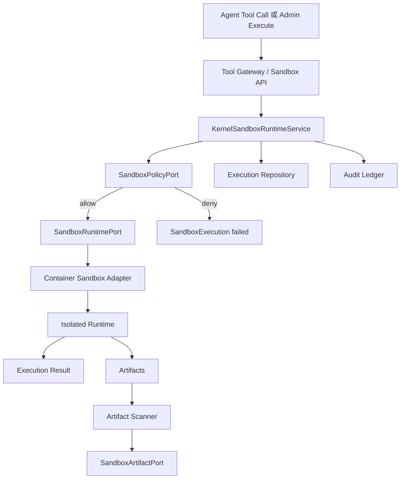

# Sandbox Runtime 详细设计

生成日期：2026-05-31

## 1. 结论

Sandbox Runtime 当前已经具备 kernel 编排、策略端口、运行时端口、artifact 端口、JDBC 存储、Web API、前端页面骨架、opt-in 的 Docker/Podman CLI 容器 adapter、full-compose backend Docker host-socket/CLI opt-in 接入、orphan workspace 清理、live container 只读巡检、runtime health 只读检查、active session capacity 只读信号与受控 orphan container 回收，以及 `sandbox_python`、`sandbox_file_convert` 和受限 `sandbox_browser` Agent 工具链路：配置 `seahorse-agent.adapters.sandbox.runtime=container` 后，`CODE_INTERPRETER`、`FILE_CONVERSION` 和 inline no-network `BROWSER_AUTOMATION` 可以在无网络容器中完成最小闭环。默认 `SandboxRuntimePort` 仍是 `unsupported()`，不配置真实 adapter 时继续 fail closed。

因此它的现状应定义为“控制面、审计基础、Code Interpreter/File Conversion/受限 Browser Automation 容器 runtime 最小闭环、full-compose host-socket opt-in 接入、runtime 巡检/受控回收基础和 sandbox-backed 工具链路已实现，生产级 sandbox 还需要补齐更广格式/外联/会话场景、profile/配额和强隔离加固”。

剩余设计重点是：补齐磁盘/网络 allowlist、tenant/agent 配额、病毒/二进制深扫、PDF 转换、Office 渲染/编辑、LibreOffice/Tika 与二进制转换、browser egress/URL policy 与 auth/session state capture，并继续加固运行隔离和审计可视化。

## 2. 当前实现状态

### 2.1 已落地能力

| 能力 | 当前状态 | 代码证据 |
| --- | --- | --- |
| 入站端口 | 已有 `SandboxRuntimeInboundPort#createSession/execute/close/listArtifacts` | `SandboxRuntimeInboundPort.java` |
| 编排服务 | 已有 `KernelSandboxRuntimeService`，负责 policy check、runtime 调用、执行记录、artifact 保存和 audit | `KernelSandboxRuntimeService.java` |
| 策略端口 | 已有 `SandboxPolicyPort` 与 `DefaultSandboxPolicyPort`，默认网络 `DENY_ALL` | `DefaultSandboxPolicyPort.java` |
| 运行时端口 | 已有 `SandboxRuntimePort#createSession/execute/closeSession` | `SandboxRuntimePort.java` |
| 默认 runtime | 默认 bean 是 `SandboxRuntimePort.unsupported()`，execute 返回 `RUNTIME_UNSUPPORTED` | `SeahorseAgentKernelRegistryAutoConfiguration.java` |
| 容器 runtime | 显式配置 `seahorse-agent.adapters.sandbox.runtime=container` 后，可用 Docker/Podman CLI 执行 `CODE_INTERPRETER` Python 最小闭环 | `ContainerSandboxRuntimeAdapter.java` |
| full-compose 接入 | 新增 `docker-compose.sandbox.yml` opt-in overlay，backend 镜像内置 Docker CLI，可显式挂载宿主 Docker socket 和 daemon-visible workspace mount source | `docker-compose.sandbox.yml`、`Dockerfile.backend` |
| runtime 巡检与清理 | 已有 expired session sweep、scheduled TTL sweep、orphan workspace sweep、Docker/Podman live container 只读巡检、runtime health 只读检查、active session capacity 只读信号和 dry-run 默认的 orphan container 受控回收 | `KernelSandboxRuntimeService.java`、`ContainerSandboxRuntimeAdapter.java`、`SandboxRuntimeOrphanSweepJob.java` |
| 存储 | 已有 `sa_sandbox_session`、`sa_sandbox_execution`、`sa_sandbox_artifact` 对应 JDBC adapter | `JdbcSandboxRepositoryAdapter.java` |
| Web API | 已有创建 session、execute、close、list executions、list artifacts API | `SeahorseSandboxController.java` |
| 前端页面 | 已有 `/admin/sandbox`，可创建 session、输入参数、执行、查看结果、execution history 和 artifact | `frontend/src/pages/admin/sandbox/SandboxPage.tsx` |
| Agent 工具 | 已有 `sandbox_python`、`sandbox_file_convert` 和受限 inline no-network `sandbox_browser` 工具链路，经过 Tool Gateway policy/audit/redaction，并调用 `SandboxRuntimeInboundPort` 执行对应 sandbox runtime | `SandboxPythonToolPortAdapter.java`、`SandboxFileConvertToolPortAdapter.java`、`SandboxBrowserToolPortAdapter.java` |
| artifact scanner | 已有 `SandboxArtifactScannerPort`、默认保守 scanner、`REDACTED` 状态、prompt visibility gate，以及 file:// 文本类 artifact 的 secret/PII 内容扫描；scanner 失败 fail closed | `DefaultSandboxArtifactScannerPort.java`、`KernelSandboxRuntimeService.java` |

### 2.2 真实缺口

| 缺口 | 影响 | 设计处理 |
| --- | --- | --- |
| 真实隔离 runtime 覆盖仍窄 | Code Interpreter Python 最小容器闭环与 full-compose backend Docker host-socket opt-in 接入已落地；File Conversion 已有 CSV/TSV/JSON 表格转换、txt/html/markdown 文本文档转换与 base64 `docx -> txt` 保守 Office 文本提取闭环；Browser Automation 已有 inline no-network 截图/HAR/download-only 视频 artifact；Shell、PDF 转换、Office 渲染/编辑、LibreOffice/Tika、二进制转换、外部 URL/egress 和 auth/session capture 仍未完成 | 扩展 Docker/Podman adapter 的 profile 覆盖，P1/P2 可替换为 gVisor 或 Firecracker |
| 真实 runtime 清理仍需生产化 | 当前 adapter 使用 `--rm` 并在 close 时删除 per-session workspace；session TTL metadata 已持久化，管理员手动 expired session sweep 与后台定时 TTL sweep 均可将过期未终态 session 释放并标记为 `TIMED_OUT`；orphan workspace sweep 会保守删除旧 workspace 并只读巡检 `seahorse-sandbox-*` live/exited container；runtime health API 已暴露 engine/workspace/container 与 active session capacity 只读健康信号且不暴露 workspace root；orphan container reap 已提供默认 dry-run 的显式管理员操作并保护非终态 session container；仍缺 runtime pool 调度和节点级健康检查 | 接入 runtime 节点健康检查、调度/admission control 和更完整的自动化回收策略 |
| 资源配额仍不完整 | 当前 adapter 有固定 CPU、内存、pids、timeout、stdout/stderr limit，session `profileId`/`expiresAt` 已持久化；仍缺磁盘配额和按 tenant/agent/tool 的资源策略联动 | 新增 `SandboxResourcePolicy` 和更完整 runtime profile policy |
| 真实 artifact 产物已进入最小闭环 | Code Interpreter adapter 已收集 workspace 文件，kernel 已将 prompt-visible file:// artifact 写入 object storage，并通过治理 API 下载/查看详情 | 后续补齐 preview、生命周期和更广运行时产物 |
| 内容级 artifact 扫描仍需加固 | 基础 metadata scanner、file:// 文本类 secret/PII 内容阻断、prompt visibility gate、scan summary 和结构化 redaction summary 已落地；仍缺病毒扫描、二进制/PDF 深度扫描 | 后续接入专业扫描引擎和更深内容扫描 |
| 网络策略只有默认 deny 与 allowlist 基础 | 当前容器 adapter 强制 `--network none`；仍缺按 tenant/agent/tool 的网络 profile、DNS/IP 限制、egress proxy 和审计可视化 | 引入 policy profile、egress proxy 和 network decision log |
| UI 偏 demo | execution history 已补齐；仍缺 session 列表、artifact 详情、policy preview | 升级为 Sandbox Operations 页面 |
| Agent 工具化未完整 | `sandbox_python` 已接入 Tool Gateway；`sandbox_file_convert` 已有 CSV/TSV/JSON 表格转换、txt/html/markdown 文本文档转换与 base64 `docx -> txt` 保守 Office 文本提取闭环；`sandbox_browser` 已有 inline no-network 截图/HAR/download-only 视频 artifact；PDF 转换、Office 渲染/编辑、LibreOffice/Tika、二进制格式转换、browser egress/session capture 和 Inspector 展示仍未完成 | 继续补齐更广 sandbox-backed tool adapters |

## 3. 目标架构


```mermaid
flowchart TD
    A["Agent Tool Call 或 Admin Execute"] --> B["Tool Gateway / Sandbox API"]
    B --> C["KernelSandboxRuntimeService"]
    C --> D["SandboxPolicyPort"]
    D -->|allow| E["SandboxRuntimePort"]
    D -->|deny| F["SandboxExecution failed"]
    E --> G["Container Sandbox Adapter"]
    G --> H["Isolated Runtime"]
    H --> I["Execution Result"]
    H --> J["Artifacts"]
    J --> K["Artifact Scanner"]
    K --> L["SandboxArtifactPort"]
    C --> M["Execution Repository"]
    C --> N["Audit Ledger"]
```

核心原则：

1. 主 JVM 不执行任意脚本、shell 或浏览器自动化。
2. 所有高风险执行都必须通过 `SandboxRuntimePort`，且默认 fail closed。
3. artifact 进入 prompt 前必须经过扫描和脱敏。
4. network 默认 deny，只能按 policy profile 开放。
5. session、execution、artifact 都要具备审计与可追溯 ID。

## 4. 运行时模型

### 4.1 SandboxRuntimeType

| 类型 | P0 行为 | P1/P2 扩展 |
| --- | --- | --- |
| `CODE_INTERPRETER` | Python/Node 受限执行 | 预装数据分析包、图表产物 |
| `BROWSER_AUTOMATION` | Playwright 受限浏览器 | 截图、HAR、download-only 视频 artifact；外部 URL/egress 与会话 capture 后续 |
| `SHELL` | 只允许 allowlisted command | 交互式 shell 不进入 P0 |
| `FILE_CONVERSION` | 文档转换、OCR、压缩解压 | 与 Tika/LibreOffice adapter 隔离运行 |

### 4.2 SandboxSession

当前字段已经覆盖 sessionId、tenantId、runId、runtimeType、status、reasonCode、createdAt、finishedAt。目标补充：

| 字段 | 说明 |
| --- | --- |
| `profileId` | runtime profile，如 `python-small`、`browser-readonly` |
| `containerId` | 外部 runtime handle，只存引用，不暴露给 prompt |
| `resourceLimitsJson` | CPU、memory、disk、timeout、output limit |
| `networkPolicyJson` | deny/allowlist、DNS、egress proxy |
| `workspaceRef` | workspace 存储引用 |
| `expiresAt` | session TTL |

### 4.3 SandboxExecution

目标字段：

| 字段 | 说明 |
| --- | --- |
| `executionId` | 执行 ID |
| `sessionId` | 所属 session |
| `inputDigest` | 输入摘要，不保存完整敏感 input |
| `status` | `RUNNING`、`SUCCEEDED`、`FAILED`、`CANCELLED`、`TIMED_OUT` |
| `stdoutPreview` | 截断输出 |
| `stderrPreview` | 截断错误 |
| `exitCode` | 外部进程退出码 |
| `durationMs` | 耗时 |
| `resourceUsageJson` | CPU time、memory peak、network bytes |
| `reasonCode` | policy/runtime failure code |

### 4.4 SandboxArtifact

目标字段：

| 字段 | 说明 |
| --- | --- |
| `artifactId` | artifact ID |
| `sessionId` | session |
| `executionId` | 来源 execution |
| `storageRef` | 真实对象存储引用 |
| `mimeType` | 内容类型 |
| `sizeBytes` | 大小 |
| `scanStatus` | `PENDING`、`CLEAN`、`REDACTED`、`BLOCKED` |
| `promptVisible` | 只有 scan clean 或 redacted 后可为 true |
| `redactionSummaryJson` | 脱敏摘要 |

## 5. 端口设计

### 5.1 Runtime lifecycle

当前 `SandboxRuntimePort` 已有 create、execute 和 close。后续如需暂停/恢复、调试快照或长任务 checkpoint，可继续扩展 snapshot：

```text
SandboxRuntimePort
  createSession(SandboxSessionRequest) -> SandboxSession
  execute(SandboxExecutionRequest) -> SandboxExecutionResult
  closeSession(SandboxSession) -> SandboxSession
  snapshot(SandboxSession) -> SandboxSnapshot
```

兼容策略：`closeSession` 已以 default 方法补齐，避免破坏已有 `unsupported()`；snapshot 仍可按同样方式后续引入：

```text
default closeSession(session) -> session.closed(now)
default snapshot(session) -> SandboxSnapshot.unsupported(sessionId)
```

### 5.2 Policy

```text
SandboxPolicyPort.decide(SandboxPolicyRequest) -> SandboxPolicyDecision
```

`SandboxPolicyRequest` 需要补充：

| 字段 | 说明 |
| --- | --- |
| `tenantId` | 租户 |
| `agentId` | 发起 agent |
| `runId` | 发起 run |
| `toolId` | 发起工具 |
| `runtimeType` | runtime 类型 |
| `profileId` | runtime profile |
| `networkRequested` | 是否请求网络 |
| `requestedHosts` | host allowlist |
| `estimatedInputSize` | 输入大小 |
| `requestedTimeoutMs` | 请求超时 |

### 5.3 Artifact scanner

当前已落地基础端口：

```text
SandboxArtifactScannerPort
  scan(SandboxArtifactScanRequest) -> SandboxArtifactScanResult
```

当前 prompt visibility gate 由 `SandboxArtifact#promptVisible()` 承担：只有 `CLEAN` 或 `REDACTED` 且 sensitivity 不是 `SECRET` 的 artifact 可进入 prompt。后续内容级 scanner 或下载授权策略需要更细粒度治理时，可再扩展独立 `SandboxArtifactPolicyPort`。

扫描规则：

1. 当前默认 scanner 基于 media type、sensitivity 和敏感 URI marker 做保守 metadata 判定。
2. 命中 secret、token、private key、PII 的 artifact 默认 blocked 或 redacted。
3. 二进制文件除图片/PDF 预览外默认不进入 prompt。
4. scanner 失败时 fail closed，`promptVisible=false`。
5. file:// 文本类 artifact 会读取小窗口内容并阻断 secret、token、private key、email、SSN 等高置信命中；后续补齐病毒扫描、二进制/PDF 深度扫描和 redaction summary。

## 6. 运行时适配器设计

### 6.1 P0 Docker/Podman adapter

已新增模块：`seahorse-agent-adapter-sandbox-container`

当前职责：

1. 显式配置 `seahorse-agent.adapters.sandbox.runtime=container` 后才替换默认 unsupported runtime。
2. 支持 `CODE_INTERPRETER`，把输入写入 per-session workspace 的 `main.py`。
3. 通过 Docker/Podman CLI 运行 `python /workspace/main.py`，容器使用 `--rm`、`--network none` 和 workspace bind mount。
4. 设置固定 CPU、memory、pids、timeout、stdout/stderr preview limit。
5. 不注入业务 secret，不继承额外 runtime 环境。
6. `closeSession` 删除 session workspace；非 `CODE_INTERPRETER` runtime fail closed。
7. `sweepOrphanedResources` 删除旧的孤儿 `sandbox_container_*` workspace，并通过 Docker/Podman CLI 只读巡检 `seahorse-sandbox-*` container，返回 active/orphan container 计数和名称。
8. `inspectHealth` 复用 active session id 和只读 container 巡检，返回 engine/workspace 可用性、managed container 计数、active/orphan container 信号、active session capacity 信号和 `HEALTHY`/`DEGRADED`/`UNAVAILABLE`/`UNSUPPORTED` 状态，不暴露 workspace root 路径。
9. `reapOrphanedContainers` 默认 dry-run，只回收命名为 `seahorse-sandbox-*` 且不匹配任何非终态 session id 的 managed container，真实执行前再次校验 managed prefix。

后续职责：

1. 引入持久化 runtime profile 和按 tenant/agent/tool 的资源策略。
2. 增加磁盘配额、runtime pool 调度/节点级健康检查和更完整的自动化回收策略。
3. 收集 workspace 产物，写入 object storage，并进入 artifact scanner。
4. 在 full-compose backend 容器内提供 Docker host-socket/CLI 的可运维接入方式。（已补齐 opt-in overlay、Docker CLI 和 workspace mount source 配置）

P0 profile：

| Profile | Runtime | Network | Command | 状态 |
| --- | --- | --- | --- | --- |
| `python-small` | Python 3 | deny | `python /workspace/main.py` | 已有最小闭环，session profile/TTL metadata 已持久化并通过 API/UI 展示 |
| `node-small` | Node.js | deny | `node /workspace/main.js` | 后续 |
| `browser-readonly` | Playwright | allowlist only | `node /workspace/browser-task.js` | 后续 |
| `file-conversion` | LibreOffice/Tika helper | deny | allowlisted converter | 后续 |

### 6.2 P1 加固 runtime

1. gVisor 或 Firecracker profile，用于更强隔离。
2. egress proxy 统一审计网络请求。
3. 镜像 SBOM 与镜像签名校验。
4. runtime 节点池健康检查与容量调度。

## 7. API 与 UI 设计

### 7.1 API

| Method | Path | 说明 |
| --- | --- | --- |
| `POST` | `/api/sandbox/sessions` | 创建 session |
| `POST` | `/api/sandbox/sessions/{sessionId}/execute` | 执行输入 |
| `POST` | `/api/sandbox/sessions/{sessionId}/close` | 关闭并释放 runtime |
| `POST` | `/api/sandbox/sessions/expired:sweep` | 手动 sweep 过期未终态 session，释放 runtime 并标记为 `TIMED_OUT` |
| `POST` | `/api/sandbox/runtime/orphans:sweep` | 手动 sweep 旧的孤儿 runtime workspace，保留所有非终态 session workspace，并返回 live container active/orphan 巡检结果 |
| `POST` | `/api/sandbox/runtime/orphan-containers:reap` | 默认 dry-run 预览并可显式确认回收 orphan managed container，保护所有非终态 session container |
| `GET` | `/api/sandbox/runtime/health` | 只读检查 runtime engine、workspace 和 managed container 健康信号 |
| `GET` | `/api/sandbox/sessions/{sessionId}/executions` | 执行历史 |
| `GET` | `/api/sandbox/sessions/{sessionId}/artifacts` | artifact 列表 |
| `GET` | `/api/sandbox/artifacts/{artifactId}` | artifact 元数据 |
| `POST` | `/api/sandbox/policies/preview` | 策略预检查 |

### 7.2 UI

当前 `/admin/sandbox` 可保留为调试入口，目标升级为 Sandbox Operations：

| 区域 | 内容 |
| --- | --- |
| Session 列表 | runtimeType、status、runId、profile、createdAt、expiresAt、手动 expired sweep、runtime health |
| Policy Preview | network、host、quota、profile 的 allow/deny 解释 |
| Execution Console | 输入、执行、stdout/stderr、reasonCode、duration |
| Artifact Browser | scan status、promptVisible、mimeType、download、preview |
| Audit Timeline | session created、execution finished、artifact scanned、close |

## 8. 与 Agent 工具集成

新增 sandbox-backed tools：

当前已落地 `sandbox_python` 最小版本和 `sandbox_file_convert` CSV/TSV/JSON 表格转换与 txt/html/markdown 文本文档转换版本：工具本身是普通 `DescribedToolPort`，通过 `LocalToolGatewayPort` 的 request-aware 路径拿到 tenant/run/user 上下文，再调用 `SandboxRuntimeInboundPort` 创建 session、执行并关闭 session。后续仍需补齐浏览器自动化、PDF/Office/二进制格式转换和 Inspector 展示。

| Tool | Runtime | 说明 |
| --- | --- | --- |
| `sandbox_python` | `CODE_INTERPRETER` | 已有最小闭环：执行 Python 片段并返回 execution summary；artifact 收集后续补齐 |
| `sandbox_browser` | `BROWSER_AUTOMATION` | 受限 Playwright 浏览，返回 summary、截图、HAR 和 download-only 视频 artifact；外部 URL/egress 与 auth/session capture 后续 |
| `sandbox_file_convert` | `FILE_CONVERSION` | 已有 CSV/TSV -> JSON、JSON -> CSV/TSV、txt -> html、html -> txt、markdown/md -> html/txt 转换闭环，返回 governed artifact；PDF/Office/二进制格式后续补齐 |

集成规则：

1. 工具本身是普通 `DescribedToolPort`，内部只调用 `SandboxRuntimeInboundPort`。
2. 工具调用仍先通过 Tool Gateway policy 和 approval。
3. Tool result 只包含扫描通过的 artifact summary。
4. 真实 artifact 下载必须走授权 API，不进入 prompt。

## 9. 安全治理

1. 默认 runtime 为 unsupported 或 deny，不配置真实 adapter 时不执行。
2. 默认 network deny，allowlist 必须精确到 host，禁止通配公网。
3. 禁止挂载宿主敏感目录，workspace per session 隔离。
4. 禁止把平台 secret 注入 sandbox；需要外部凭据时通过受控 proxy。
5. stdout/stderr/output artifact 都做 size limit。
6. artifact scan 失败时不可 prompt visible。
7. session TTL 到期必须 close 并清理资源；当前已提供管理员手动 expired sweep、后台定时 TTL sweep、orphan workspace sweep、live container 只读巡检、runtime health 只读检查和默认 dry-run 的 orphan container 受控回收。
8. audit payload 只保存摘要、状态和引用，不保存完整敏感输入。

## 10. 分阶段落地

### P0：真实隔离执行最小闭环

1. 扩展 `SandboxRuntimePort` lifecycle。（已补齐 `closeSession` hook）
2. 新增 Docker/Podman runtime adapter。（已补齐 `CODE_INTERPRETER` Python 最小闭环）
3. 新增 runtime profile 配置。（已补齐 session profile/TTL metadata 持久化、旧库 startup upgrade、API/UI 展示；资源策略联动仍后续）
4. 增加 execution history API。（已补齐 `GET /api/sandbox/sessions/{sessionId}/executions`）
5. 增加 container adapter 单元测试和本地集成测试。（已补齐 mock runner 单测、auto-config 测试和 Docker CLI gated smoke）
6. full-compose backend 容器内接入 Docker/Podman CLI/socket。（已补齐 Docker host-socket opt-in overlay；Podman 可通过自定义镜像/engine 配置继续扩展）

### P1：artifact 安全闭环

1. 新增 artifact scanner port。（已补齐基础 metadata scanner 和 file:// 文本内容 secret/PII 阻断）
2. 只有 scan clean/redacted 的 artifact 可 prompt visible。（已补齐）
3. UI 增加 artifact scan 状态和预览。（scan 状态已补齐；详情/预览/下载仍后续）
4. 增加 scanner fail-closed 测试。（已补齐）

### P2：Agent 工具化

1. 新增 `sandbox_python`、`sandbox_browser`、`sandbox_file_convert` tool adapters。（`sandbox_python`、`sandbox_file_convert` CSV/TSV/JSON 表格转换和 txt/html/markdown 文本文档转换、受限 inline no-network `sandbox_browser` 截图/HAR/download-only 视频 artifact 已补齐；browser 外部 URL/egress、auth/session capture、PDF/Office/二进制转换格式后续）
2. Tool Gateway policy 中区分 sandbox-backed tool。（`sandbox_python` 与 `sandbox_file_convert` 已注册为 HIGH / EXECUTE / SANDBOX）
3. Agent Inspector 展示 sandbox execution 与 artifact。
4. 加入审批与配额联动。

### P3：生产加固

1. 引入 egress proxy、runtime pool health、镜像签名。
2. 增加 gVisor/Firecracker profile。
3. 加入 tenant/agent 级 sandbox quota。
4. 增加自动清理与孤儿容器巡检/回收。（管理员手动 expired session sweep、后台定时化、orphan workspace sweep、live container 只读巡检、runtime health 只读检查和默认 dry-run 的 orphan container 受控回收已补齐；容量/节点健康仍后续）

## 11. 验收标准

1. 未配置真实 runtime adapter 时，execute 返回 `RUNTIME_UNSUPPORTED`，不执行任何宿主命令。
2. 配置 Docker/Podman adapter 后，Python profile 可在隔离容器内执行简单脚本。（已由 host JVM + Docker CLI smoke 覆盖）
3. 默认网络 deny 时，请求外部 host 会被 policy 或 runtime 拦截。（当前 adapter 使用 `--network none`；allowlist/egress proxy 后续）
4. allowlisted host 可访问，非 allowlisted host 被拒绝并写 audit。
5. session close 会释放容器和 workspace。（当前 adapter 使用 `--rm` 并删除 workspace；管理员手动和后台定时 TTL sweep 已验证 `TIMED_OUT` 持久化；orphan sweep 已返回 live container 巡检结果；runtime health API 已返回只读 engine/workspace/container 状态；orphan container reap 已验证 dry-run 不删除、确认后删除 managed orphan container）
6. artifact 未扫描通过前不会出现在 prompt-visible artifact 列表中。
7. execution history 可按 session 查询。
8. Agent tool 调用 sandbox 时，Tool Gateway、Policy、Audit 均生效。（`sandbox_python` 已有单测与 Docker smoke 证据；更广工具后续）

## 12. 测试清单

| 测试 | 目标 |
| --- | --- |
| `KernelSandboxRuntimeServiceTests` | policy deny、runtime unsupported、artifact filtering、audit |
| `DefaultSandboxPolicyPortTests` | network deny、allowlist |
| `ContainerSandboxRuntimeAdapterTests` | create/execute/close、timeout、resource limit |
| `ContainerSandboxRuntimeAdapterDockerSmokeTest` | 环境变量门控的真实 Docker/Podman CLI 执行 smoke |
| `SandboxPythonToolPortAdapterTests` | `sandbox_python` 参数校验、session 创建、执行失败和 close 清理 |
| `SandboxPythonToolContainerDockerSmokeTest` | `sandbox_python` 通过真实 Docker/Podman container runtime 执行 Python |
| `ContainerSandboxAutoConfigurationTests` | 默认禁用、显式启用、custom runtime 不被替换 |
| `KernelSandboxRuntimeServiceTests` / `SandboxArtifactTests` | clean、redacted、blocked、scanner failure、prompt visibility |
| `SeahorseSandboxControllerTests` | API 入参和响应 |
| `SandboxPage.test.tsx` | session、execute、artifact history UI |

### 2026-07-02 Update: orphan workspace sweep

The Docker/Podman container adapter now supports orphan workspace cleanup. `POST /api/sandbox/runtime/orphans:sweep` gathers all non-terminal sandbox session ids through the repository, then asks the runtime adapter to remove old `sandbox_container_*` workspace directories under the configured workspace root when they are not active sessions. A scheduled `SandboxRuntimeOrphanSweepJob` is available behind `seahorse.agent.sandbox.runtime-sweep.*`, and `orphan-workspace-min-age` protects newly created workspaces from racey cleanup.

This completes the conservative workspace cleanup part of runtime patrol. Live container reaping, runtime pool health/capacity checks, and deeper isolation profiles such as gVisor/Firecracker remain follow-up production hardening work.

### 2026-07-02 Update: live container inspection

The same runtime orphan sweep path now performs a read-only Docker/Podman container inspection. `ContainerSandboxRuntimeAdapter` runs `ps -a --filter name=seahorse-sandbox- --format "{{.Names}}\t{{.Status}}"`, classifies managed containers as active when their names match non-terminal sandbox sessions, and reports orphan container names without killing or deleting containers. `SandboxRuntimeCleanupResult` now includes inspected/active/orphan container counts plus inspection failure messages, so `/api/sandbox/runtime/orphans:sweep` can serve as the first runtime pool health signal.

This completed the low-risk live container visibility portion of runtime patrol. The follow-up controlled reap API now covers explicit operator cleanup, while capacity metrics, node health checks, and stronger isolation profiles such as gVisor/Firecracker remain follow-up production hardening work.

### 2026-07-02 Update: runtime health endpoint

Sandbox Runtime now exposes a read-only health endpoint at `GET /api/sandbox/runtime/health`. The kernel gathers non-terminal session ids through `SandboxSessionRepositoryPort.listActiveSessionIds()`, then asks `SandboxRuntimePort.inspectHealth(...)` for adapter-owned runtime signals. The Docker/Podman container adapter reports runtime type, engine, `HEALTHY`/`DEGRADED`/`UNAVAILABLE` status, engine availability, workspace availability, active session count, inspected/active/orphan managed container counts, active/orphan container names, and inspection failure messages. The unsupported default runtime returns `UNSUPPORTED` without touching the host.

The endpoint intentionally remains non-destructive: it does not kill or remove containers, and it does not expose the configured workspace root path. Container reaping, active-session capacity signals, node-level health, and stronger isolation profiles such as gVisor/Firecracker remain follow-up production hardening work.

Fresh full-Docker evidence: `.\scripts\e2e-sandbox-artifact-storage-smoke.ps1 -BaseUrl http://127.0.0.1:9090 -Password admin123 -Marker seahorse-sandbox-runtime-health-smoke` passed 16/16 after rebuilding the full-compose backend. The smoke verified `runtime=container`, `engine=docker`, `engineAvailable=true`, `workspaceAvailable=true`, `failedContainerInspectionCount=0`, and no configured sandbox workspace root leak.

### 2026-07-02 Update: controlled orphan container reap

Sandbox Runtime now exposes an explicit operator endpoint at `POST /api/sandbox/runtime/orphan-containers:reap`. The API defaults to `dryRun=true`; the kernel only supplies the current non-terminal session ids, and the Docker/Podman adapter owns inspection plus optional removal. Only managed `seahorse-sandbox-*` containers that do not match an active session id are eligible, and the adapter revalidates the managed prefix immediately before running `docker rm -f`.

The admin Sandbox page uses a preview-then-confirm flow so operators see the candidate orphan containers before sending a non-dry-run reap. This leaves workspace cleanup under `/api/sandbox/runtime/orphans:sweep` and keeps live-container reaping as a separate, intentional recovery action.

Fresh full-Docker evidence: `.\scripts\e2e-sandbox-artifact-storage-smoke.ps1 -BaseUrl http://127.0.0.1:9090 -Password admin123 -Marker seahorse-sandbox-orphan-container-reap-smoke` passed 16/16 after rebuilding the full-compose backend. The smoke created a real `seahorse-sandbox-orphan-live-*` container, verified dry-run reported it without deletion, verified non-dry-run returned it in `reapedContainerNames`, and verified `docker ps -a` no longer listed it afterward.

### 2026-07-02 Update: runtime capacity signal

Sandbox Runtime health now reports read-only active session capacity signals. The container adapter exposes `max-active-sessions` configuration, defaulting to `0` for unbounded capacity. `GET /api/sandbox/runtime/health` now includes `activeSessionLimit`, `activeSessionRemaining`, `activeSessionCapacityAvailable`, and `capacityStatus` (`UNBOUNDED`, `AVAILABLE`, or `SATURATED`). A saturated configured capacity degrades health to `DEGRADED`, but this slice does not reject session creation or introduce runtime pool scheduling ownership.

The full-compose sandbox overlay exposes `SEAHORSE_AGENT_ADAPTERS_SANDBOX_CONTAINER_MAX_ACTIVE_SESSIONS`, and the admin Sandbox health toast includes the capacity status. This completes the first single-node capacity visibility signal; runtime admission control, tenant/agent quota policy, node-pool scheduling, and node-level health remain follow-up production hardening work.

### 2026-07-02 Update: runtime capacity admission preflight

Sandbox Runtime session creation now uses the capacity signal as a conservative admission preflight. After `SandboxPolicyPort` allows a create request and before `SandboxRuntimePort#createSession` is called, `KernelSandboxRuntimeService` reads non-terminal session ids from `SandboxSessionRepositoryPort.listActiveSessionIds()`, asks `SandboxRuntimePort.inspectHealth(...)` for adapter-owned capacity state, and persists a failed session with `RUNTIME_CAPACITY_EXCEEDED` when `activeSessionCapacityAvailable=false`.

The default `max-active-sessions=0` remains unbounded, and the unsupported runtime keeps its existing fail-closed execution behavior because its health reports unbounded capacity. This is still a single-node preflight, not a tenant/agent quota model or runtime pool scheduler; those remain follow-up production hardening work.

### 2026-07-02 Update: artifact scan summary auditability

Sandbox artifacts now preserve the scanner-owned decision summary across the runtime boundary. `SandboxArtifact` carries a bounded `scanSummary`, `KernelSandboxRuntimeService` persists `SandboxArtifactScanResult.summary()` for clean/redacted/blocked scanner decisions, and fail-closed scanner/storage-copy branches use fixed safe summaries that do not include exception messages, local paths, secrets, or storage references.

`sa_sandbox_artifact.scan_summary` is present in the init schema, migration `V47__sandbox_artifact_scan_summary.sql`, and the startup `JdbcTenantSchemaUpgrade` repair path for existing volumes. The sandbox artifact list/detail API and admin Sandbox page expose this summary while still omitting `objectUri` and `storageRef`.

This closes the immediate auditability gap for the existing metadata/text scanner. Virus scanning, binary/PDF deep scanning, and structured redaction-summary payloads remain follow-up hardening work.

### 2026-07-03 Update: runtime governance profile visibility

Sandbox Runtime now exposes `GET /api/sandbox/runtime/profiles` as a read-only governance endpoint. The response is derived from kernel-owned defaults instead of Docker inspection: `CODE_INTERPRETER -> python-small`, `FILE_CONVERSION -> file-conversion`, `BROWSER_AUTOMATION -> browser-readonly`, and `SHELL -> shell-restricted`, with default network policy `DENY_ALL` and default TTL `3600` seconds. Container support is marked as supported for Code Interpreter and File Conversion, while Browser Automation and Shell stay planned.

The admin Sandbox page now has a persistent Runtime governance panel that combines this profile metadata with `GET /api/sandbox/runtime/health` capacity and container signals. This closes the first Operations visibility gap for profile/capacity state. It deliberately does not add profile mutation, tenant/agent quota policy writes, runtime pool scheduling, or adapter side effects; those remain production hardening follow-ups.

### 2026-07-03 Update: sandbox document text conversion

`sandbox_file_convert` now supports conservative text-oriented document conversions in the `FILE_CONVERSION` runtime: `txt -> html`, `html -> txt`, `markdown/md -> html/txt`, and base64 `docx -> txt`. The container adapter still generates a stdlib-only Python converter, writes text source content to `input.txt`/`input.html`/`input.md`, decodes DOCX input to `input.docx`, runs with network disabled, and collects only `converted.<targetFormat>` as the governed artifact. The DOCX path reads `word/document.xml` with Python stdlib `zipfile` plus `xml.etree.ElementTree`; it deliberately avoids LibreOffice/Tika, PDF rendering, Office editing, arbitrary binary conversion, external packages, and network access.

Fresh full-Docker evidence: `.\scripts\e2e-sandbox-file-convert-tool-smoke.ps1 -BaseUrl http://127.0.0.1:9090 -Password admin123 -Marker seahorse-sandbox-docx-convert-smoke` passed 19/19 after rebuilding the full-compose backend, including CSV/JSON conversions, Markdown-to-HTML invocation, DOCX-to-TXT invocation through Tool Gateway, persisted `FILE_CONVERSION` session/profile metadata, governed TXT download, local object storage verification, no leftover managed sandbox containers, and zero non-terminal sandbox sessions. Browser egress/URL policy, auth/session capture, PDF conversion, Office rendering/editing beyond conservative DOCX text extraction, LibreOffice/Tika-backed conversion, virus scanning, and binary/PDF deep scanning remain follow-up hardening work.

### 2026-07-03 Update: sandbox-backed tool quota governance

Sandbox Runtime now exposes a narrow Operations write path for sandbox-backed tool quota policy:
`POST /api/sandbox/runtime/tool-quota-policies`. The endpoint is intentionally scoped to Tool Gateway-owned enforcement. It requires both `SANDBOX` and `QUOTA_MANAGEMENT`, accepts only `sandbox_python`, `sandbox_file_convert`, and the planned `sandbox_browser`, normalizes the tool id, and writes the existing quota model as `QuotaScope.TOOL` with `subjectId=<toolId>`.

The admin Sandbox page now includes a compact Tool quota panel for policy id, sandbox tool id, status, calls, tokens, cost, and warn ratio. The frontend sandbox service uses the browser proxy path required by the packaged Nginx/Vite proxy so UI calls reach backend `/api/sandbox/...` routes correctly.

This closes the immediate operator path for sandbox-backed tool quotas without adding a separate `SandboxResourcePolicy`, runtime profile mutation, or broad tenant/agent quota UI. Tenant/agent quota UX, PDF/Office/binary conversion, virus scanning, binary/PDF deep scanning, and stronger isolation remain follow-up hardening work.

Fresh full-Docker evidence: `.\scripts\e2e-tool-gateway-quota-smoke.ps1 -BaseUrl http://127.0.0.1:9090 -Password admin123 -Marker seahorse-sandbox-tool-quota-smoke-rerun` passed 4/4. The smoke created a zero-call sandbox tool quota policy through the Sandbox API, invoked `sandbox_python` through Tool Gateway, and observed `QUOTA_HARD_LIMIT_EXCEEDED`; cleanup confirmed no leftover managed sandbox containers and zero non-terminal sandbox sessions.

Fresh UX evidence: `npm test -- src/services/frontendCapabilityContracts.test.ts` passed 10/10, `npm run build` completed with only existing warnings, and `.\scripts\e2e-sandbox-tool-quota-page-smoke.ps1 -BaseUrl http://127.0.0.1 -Password admin123 -Marker seahorse-sandbox-tool-quota-ux-smoke` passed against the local full-Docker frontend. Cleanup confirmed the page-smoke `sandbox-tool-quota-page-*` policies were disabled, no leftover managed sandbox containers, and zero non-terminal sandbox sessions. A fresh Tool Gateway quota rerun with marker `seahorse-sandbox-tool-quota-ux-smoke` also passed 4/4.

### 2026-07-03 Update: sandbox browser automation

`sandbox_browser` now covers the first browser automation minimum path. The tool accepts bounded inline HTML and supports `snapshot` plus `extract_text`; it creates a `BROWSER_AUTOMATION` session with network disabled, invokes the container runtime through `SandboxRuntimeInboundPort`, and closes the session after execution. The runtime writes `browser-input.html`, generates a Python Playwright script, runs it in `seahorse-sandbox-browser:playwright-1.48.0`, and collects only `browser-result.json` plus optional `screenshot.png` as governed artifacts.

The browser runtime image is project-owned at `resources/docker/Dockerfile.sandbox-browser-runtime`, based on the upstream Playwright Python image with the matching Python `playwright` package installed. This keeps the runtime reproducible for local full-Docker validation while preserving the no-network execution posture. This slice does not add external URL browsing, egress allowlists, video recording, auth/session capture, or broad browser workflow building.

Fresh full-Docker evidence: `.\scripts\e2e-sandbox-browser-tool-smoke.ps1 -BaseUrl http://127.0.0.1:9090 -Password admin123 -Marker seahorse-sandbox-browser-smoke` passed 10/10. The smoke verified built-in catalog exposure, Tool Gateway invocation, persisted `BROWSER_AUTOMATION` session/profile metadata, governed JSON and PNG artifacts, governed result download, local object storage files, no leftover managed sandbox containers, and zero non-terminal sandbox sessions.

### 2026-07-03 Update: sandbox runtime profile policy writes

Sandbox Runtime now exposes a bounded Operations write path for existing runtime profile policies:
`POST /api/sandbox/runtime/profile-policies`. The endpoint accepts only existing kernel-owned profile ids, supports `ACTIVE` and `DISABLED`, allows `sessionTtlSeconds` from 60 to 7200, and keeps `networkAllowed=false`.

`GET /api/sandbox/runtime/profiles?tenantId=default` returns persisted policy metadata so the admin Runtime governance panel can show `policyId`, `policyStatus`, and the effective TTL. New session creation applies the policy before runtime allocation: disabled profiles persist a failed session with `RUNTIME_PROFILE_DISABLED`, while active TTL overrides update `expiresAt`.

The policy table is persisted as `sa_sandbox_runtime_profile_policy` through migration `V48__sandbox_runtime_profile_policy.sql`, fresh init schema, and startup tenant schema upgrade/RLS repair. This slice does not add arbitrary profile creation, network egress/allowlists, tenant/agent quota UX, gVisor/Firecracker, or broader resource policy modeling.

Fresh full-Docker evidence: `.\scripts\e2e-sandbox-runtime-profile-policy-smoke.ps1 -BaseUrl http://127.0.0.1:9090 -Password admin123 -Marker seahorse-sandbox-runtime-profile-policy-smoke` passed 12/12. The smoke verified TTL policy persistence, runtime profile API policy metadata, `RUNTIME_PROFILE_DISABLED` rejection, PostgreSQL records, restore to `CODE_INTERPRETER|ACTIVE|3600|false`, no leftover managed sandbox containers, and zero non-terminal sandbox sessions.

### 2026-07-03 Update: sandbox artifact structured redaction summary

Sandbox artifacts now store and expose a bounded structured `redactionSummaryJson` payload in addition to the human-readable `scanSummary`. The schema records `schemaVersion`, scanner id, decision, blocked/redacted booleans, `contentScanned`, categories, and a safe reason. Category values cover current metadata/text scanner and fail-closed decisions such as `SECRET`, `PERSONAL_DATA`, `PRIVATE_KEY`, `CONTENT_UNAVAILABLE`, `CONTENT_TOO_LARGE`, `UNSUPPORTED_MEDIA_TYPE`, `SCAN_ERROR`, and `STORAGE_COPY_FAILED`.

`sa_sandbox_artifact.redaction_summary_json VARCHAR(2048)` is covered by migration `V49__sandbox_artifact_redaction_summary.sql`, the fresh init schema, startup tenant schema upgrade, JDBC persistence, sandbox list/detail APIs, sandbox-backed tool artifact metadata, and the admin Sandbox artifact detail. The payload deliberately avoids raw secret/PII values and storage references.

Fresh full-Docker evidence: `.\scripts\e2e-sandbox-artifact-storage-smoke.ps1 -BaseUrl http://127.0.0.1:9090 -Password admin123 -Marker seahorse-sandbox-redaction-summary-smoke` passed 17/17 after rebuilding the full-compose backend. Cleanup confirmed no leftover managed sandbox containers, zero non-terminal sandbox sessions, and PostgreSQL column metadata `redaction_summary_json|character varying|2048`.

This completes the structured summary payload for the current conservative scanner. Virus scanning, PDF/binary deep scanning, external scanner engines, browser egress/URL policy, video capture, stronger isolation, and node-pool health remain follow-up production hardening work.

### 2026-07-03 Update: sandbox browser restricted HAR capture

`sandbox_browser` now supports an optional `har=true` argument on the existing inline no-network browser automation path. The container adapter records Playwright request, response, and request-failed events, emits a governed `browser-network.har` artifact as `application/har+json`, and marks blocked non-inline requests with `_blocked: true`.

The runtime security boundary is unchanged: the tool still accepts bounded inline HTML only, runs the browser container with network disabled, aborts non-`about:`/`blob:`/`data:` requests at the page route layer, and exposes artifacts only through the existing scanner/object-storage/governed-download path. This update does not add external URL browsing, egress allowlists or proxying, credentials, video recording, session/auth capture, or broader browser workflow automation.

Fresh full-Docker evidence: `.\scripts\e2e-sandbox-browser-tool-smoke.ps1 -BaseUrl http://127.0.0.1:9090 -Password admin123 -Marker seahorse-sandbox-browser-har-smoke` passed 11/11, verifying real Tool Gateway invocation, three governed artifacts (`browser-result.json`, `screenshot.png`, `browser-network.har`), PostgreSQL `application/har+json` metadata, blocked external request markers in the downloaded HAR, no storage-reference leakage, object storage files, no leftover managed sandbox containers, and zero non-terminal sandbox sessions.

### 2026-07-03 Update: sandbox browser download-only video capture

`sandbox_browser` now supports an optional `video=true` argument on the existing inline no-network browser automation path. The container adapter records the Playwright context and emits `browser-video.webm` as `video/webm`, while keeping bounded inline HTML input, container `--network none`, and the route-level block for non-inline requests.

This update splits governed download eligibility from prompt visibility. `SandboxArtifact.downloadable()` now controls clean/redacted non-secret artifact storage copy and download; `promptVisible()` additionally requires a prompt-safe media type. Therefore WebM video is copied to object storage and can be downloaded through artifact detail/download APIs, but remains prompt-blocked and is not included in tool observations.

Fresh full-Docker evidence: `.\scripts\e2e-sandbox-browser-tool-smoke.ps1 -BaseUrl http://127.0.0.1:9090 -Password admin123 -Marker seahorse-sandbox-browser-video-smoke` passed 12/12 after rebuilding the full-compose backend. The smoke verified real Tool Gateway invocation with `video=true`, prompt-visible JSON/PNG/HAR artifacts only, persisted clean/internal `video/webm` metadata, prompt-blocked but downloadable video detail, WebM download with EBML header, object storage, no leftover managed sandbox containers, and zero non-terminal sandbox sessions.

This completes download-only browser video artifact capture for inline no-network browser automation. External URL browsing, egress allowlists/proxying, credentials, auth/session state capture, richer browser workflows, stronger isolation, PDF conversion, Office rendering/editing beyond conservative DOCX text extraction, LibreOffice/Tika-backed conversion, arbitrary binary conversion, virus/binary/PDF deep scanning, and broader A2A/cross-provider Tool Gateway hardening remain follow-up work.

### 2026-07-03 Update: sandbox browser allowlisted URL egress

`sandbox_browser` now adds the first explicit URL egress path. The existing inline HTML path remains no-network and still runs the browser container with `--network none`. URL mode requires an HTTP/HTTPS `url` plus `allowedHosts`; the tool normalizes hosts, requires the URL host to be present, and passes `networkRequested=true` with the requested hosts into sandbox session creation and execution.

Runtime enforcement is layered. `networkAllowed=true` runtime profile policies are accepted only for `BROWSER_AUTOMATION`; the global sandbox policy must be `ALLOWLISTED` and contain the requested host; the container runtime only removes `--network none` for requested-network executions and adds `--add-host host.docker.internal:host-gateway`; and the generated Playwright route handler only allows `about:`, `blob:`, `data:`, or HTTP/HTTPS requests whose hostname is in `allowedHosts`.

This is intentionally a minimum viable egress path, not a full browser platform. Credentials, auth/session capture, arbitrary browsing policy UX, proxy/audit-rich egress, broader workflows, stronger runtime isolation, and external scanner hardening remain follow-up production work.

### 2026-07-03 Update: sandbox browser request-scoped cookie injection

`sandbox_browser` URL mode now supports explicit, bounded cookie injection for allowlisted hosts. The request may include `cookies` with name/value/domain/path/httpOnly/secure/sameSite metadata; cookie domains must be present in `allowedHosts`, and empty cookie arrays are treated as no injection. Inline HTML remains no-network and does not carry cookie state.

The container adapter writes cookie values only to transient `browser-cookies.json`, excludes that file from artifact collection, and loads cookies through Playwright `context.add_cookies(...)`. Tool observations and governed browser result JSON expose only cookie count and domains; cookie values are not written to observations, generated scripts, governed result assertions, HAR downloads, or collected artifacts.

Fresh full-Docker evidence: after focused kernel/container tests passed 33/33 and the full-compose backend rebuilt with an in-image Maven `BUILD SUCCESS`, `.\scripts\e2e-sandbox-browser-tool-smoke.ps1 -BaseUrl http://127.0.0.1:9090 -Password admin123 -Marker seahorse-sandbox-browser-cookie-smoke` passed 20/20. The smoke covered inline no-network regression, URL-mode cookie-authenticated fixture access, governed result/HAR downloads without cookie-value leakage, browser profile network restore, no leftover managed sandbox containers, and zero non-terminal sandbox sessions.

This is the first request-scoped auth/session step only. Persistent browser session capture/replay, credential governance, operator session UX, proxy/audit-rich egress, and broader browser workflow controls remain follow-up production work.

## 13. 非目标

1. 不在主 JVM 内运行任意脚本。
2. P0 不提供交互式 shell。
3. P0 不支持把平台 secret 直接暴露给 sandbox。
4. P0 不承诺强多租户内核级隔离，生产高风险租户使用 P1 加固 runtime。
