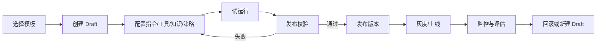

# Agent Factory UI 详细设计

生成日期：2026-05-31

## 1. 结论

Agent Factory 已经具备后端和前端骨架：模板查询、从模板创建 draft、Agent 列表、创建、详情、编辑、发布校验、发布、回滚、工具绑定等能力都已经出现。当前缺口不是“没有 UI”，而是 UI 仍偏基础表单，尚未把业务用户创建、测试、发布、回滚 Agent 的完整工作流产品化。

目标是把现有 `/admin/agents` 页面族升级为 Agent Factory Studio：以模板派生为入口，以配置向导、工具/知识/策略绑定、试运行、发布门禁、版本 diff、灰度/回滚为主线，让业务团队不写代码也能创建低风险 Agent，同时保证高风险 Agent 必须经过治理门禁。

## 2. 当前实现状态

### 2.1 已落地能力

| 能力 | 当前状态 | 代码证据 |
| --- | --- | --- |
| 模板模型 | 已有 `AgentTemplate`、`AgentTemplateId`、`AgentTemplateStatus` | `kernel/domain/agent/factory` |
| 模板派生规则 | 已校验 requested tools 是 template tools 子集，requested risk 不超过 template cap | `KernelAgentFactoryService#createFromTemplate` |
| 发布校验 | 已校验 instructions、tool enabled、高风险工具审批、owner、changeSummary；ACL/eval/quota 当前以 pass/warn 占位 | `KernelAgentFactoryService#validatePublish` |
| 回滚 | 已有 `AgentVersionActivation` 与 rollback 逻辑 | `KernelAgentFactoryService#rollback` |
| Agent Catalog | 已有 `AgentCatalogQueryPort` 与 JDBC query adapter | `JdbcAgentCatalogQueryAdapter.java` |
| Web API | 已有 `/api/agent-templates`、`/api/agents/from-template`、`/api/agents/{id}/validate`、rollback、catalog | `SeahorseAgentFactoryController.java` |
| 前端路由 | 已有 `/admin/agents`、`/admin/agents/new`、`/admin/agents/:agentId`、`/admin/agents/:agentId/edit` | `frontend/src/router.tsx` |
| 前端服务 | 已有 `agentFactoryService.ts`、`agentDefinitionService.ts` | `frontend/src/services` |
| 前端组件 | 已有 Agent 列表、创建、详情、编辑、发布弹窗、回滚弹窗、工具绑定面板 | `frontend/src/pages/admin/agents/*` |

### 2.2 真实缺口

| 缺口 | 影响 | 设计处理 |
| --- | --- | --- |
| 创建页只是 blank/template 二选一 | 业务用户无法逐步理解模板约束、工具风险、知识范围和发布要求 | 改成 5 步创建向导 |
| 编辑页大量使用 JSON textarea | 模型、上下文、风险、记忆、审批、quota 策略不可运营 | 增加结构化表单与高级 JSON 抽屉 |
| 工具绑定与发布门禁割裂 | 用户不知道哪些工具导致发布失败 | 工具页、风险页和 publish gate 共用同一检查结果 |
| 版本历史不完整 | 当前详情页只拼出当前版本，缺少完整版本列表和 diff | 新增 version history API/UI 和 diff 视图 |
| 缺少试运行闭环 | 发布前无法用样例输入验证 prompt、工具、知识、审批 | 新增 test-run panel，接 Agent Run API 和 eval set |
| eval/quota/readiness 是弱展示 | 后端已有 readiness/rollout/quota 基础，但 UI 未形成发布决策链 | 发布门禁接 readiness、quota、eval、rollout |
| 缺少模板治理 UI | 无法创建/禁用/审查模板 | P2 增加 Template Admin，仅 admin 可见 |

## 3. 目标工作流

页面不把“发布”当成单独按钮，而是围绕 Draft readiness 逐步收敛。用户在任何时候都能看到还差哪些条件才能发布。

## 4. 信息架构

### 4.1 页面总览

| 页面 | 路由 | 当前状态 | 目标增强 |
| --- | --- | --- | --- |
| Agent Catalog | `/admin/agents` | 已有列表、筛选、禁用 | 增加模板来源、readiness、rollout、最近 run、质量信号 |
| Agent Create Wizard | `/admin/agents/new` | 已有 blank/template 创建 | 改成模板选择、基础信息、范围、工具、确认五步 |
| Agent Detail | `/admin/agents/:agentId` | 已有摘要、版本、工具、检查、校验 | 增加 readiness dashboard、test runs、version diff、rollout |
| Agent Editor | `/admin/agents/:agentId/edit` | 已有基本信息、instructions、JSON 策略 | 结构化配置，保留 JSON 高级模式 |
| Publish Gate | detail 内 tab 或 drawer | 已有 validate 与 publish dialog | 汇总 tool/risk/ACL/eval/quota/owner/change summary |
| Version Diff | 新增 `/admin/agents/:agentId/versions/:versionId` | 未独立实现 | 展示 instructions、tools、model、memory、guardrail 差异 |
| Test Run Panel | detail 内 tab | 未形成闭环 | 支持样例输入、dry-run 工具、审批模拟、输出评分 |
| Template Admin | P2 新增 | 未实现 | 管理模板启停、默认配置、风险上限 |

### 4.2 Create Wizard

五步：

| 步骤 | 字段 | 后端交互 |
| --- | --- | --- |
| 1. 模板 | template、category、risk cap、默认工具 | `GET /api/agent-templates` |
| 2. 基础信息 | name、description、tenant、owner、ownerTeam | 本地校验 |
| 3. 能力范围 | knowledge scopes、memory scope、resource ACL | ACL/search API |
| 4. 工具与风险 | requested tools、risk level、approval policy | Tool Catalog、Policy Preview |
| 5. 创建确认 | 派生规则、预估发布门禁 | `POST /api/agents/from-template` |

派生规则 UI：

1. 工具只能从模板 allowed tools 中减少，不能增加。
2. risk level 不能高于模板 risk cap。
3. approval policy 可以更严格，不能更宽松。
4. quota 可以降低，不能高于模板默认。
5. guardrail 必须包含模板默认项。

## 5. Agent Editor 设计

### 5.1 基础 Tab

| Tab | 控件 | 保存字段 |
| --- | --- | --- |
| 基础信息 | name、description、owner、ownerTeam | `AgentDefinitionDraft` |
| Instructions | system instructions、style、refusal policy | `instructions` |
| Tools | tool selector、risk badge、approval badge | `toolBindingSummary` |
| Knowledge | knowledge base selector、resource ACL preview | `contextStrategy` |
| Model | model tier、fallback、temperature、budget | `modelStrategy` |
| Memory | memory read/write scope、retention | `contextStrategy` 或 `memoryConfigJson` |
| Risk | approval policy、redaction、allowed actions | `riskStrategy` |
| Quota | token/run/day caps、cost center | quota policy API |

### 5.2 JSON 高级模式

保留 JSON textarea，但移动到 “Advanced JSON” 抽屉：

1. 结构化表单为默认入口。
2. JSON 修改实时 schema validate。
3. JSON 与表单双向同步，冲突时提示字段路径。
4. 保存前显示 diff。

## 6. 发布门禁设计

### 6.1 检查项

| 检查 | 当前状态 | 目标状态 |
| --- | --- | --- |
| Instructions 非空 | 已实现 | 保持阻断 |
| Tools enabled | 已实现 | 增加工具 provider exposure 和 operation 凭据状态 |
| 高风险工具审批 | 已实现基础 | 展示具体工具与 policy |
| Resource ACL | 当前 kernel slice pass | 接入 ResourceAcl/AccessDecision evidence |
| Eval set | 当前 warn | 接入 RAG eval/agent test run，低风险可 warn，高风险阻断 |
| Quota | 当前 warn | 接入 quota policy，生产发布必须通过 |
| Owner | 已实现 | 增加 fallback owner |
| Change summary | 已实现 | 发布弹窗必须填写 |
| Readiness | 部分服务存在 | 汇总 audit、rollback、cost、SRE evidence |

### 6.2 UI 状态

| 状态 | 展示 | 操作 |
| --- | --- | --- |
| `BLOCKED` | 红色阻断项、不可发布 | 跳转到对应配置 Tab |
| `WARN` | 黄色风险项、可申请例外 | 需要填写 waiver reason |
| `PASS` | 绿色通过 | 可发布 |
| `STALE` | 灰色过期 | 重新运行 validate |

发布按钮规则：

1. 没有最新 publish check 时，按钮文案是“运行发布检查”。
2. 有 blocking failure 时，按钮禁用并展示失败项。
3. 有 warning 时，可以发布，但必须填写 waiver reason。
4. 高风险 Agent 发布必须要求二次确认和 approval policy。

## 7. Test Run Panel

### 7.1 目标

发布前让用户用样例输入验证：

1. prompt 是否按预期回答。
2. 工具是否可用。
3. resource ACL 是否拦截不该访问的数据。
4. 高风险动作是否进入 approval。
5. 成本、延迟和输出质量是否可接受。

### 7.2 运行模式

| 模式 | 行为 |
| --- | --- |
| `DRY_RUN` | 工具走 mock 或 dry-run，不产生外部写操作 |
| `SANDBOXED` | 高风险代码/浏览器工具走 sandbox |
| `LIVE_LOW_RISK` | 只允许 READ/LOW 工具真实执行 |

### 7.3 UI 展示

1. 输入区域：用户问题、上下文变量、选择测试集。
2. Timeline：model step、tool call、approval wait、artifact。
3. Evidence：引用、上下文包、ACL 决策。
4. Metrics：latency、tokens、cost、tool count。
5. Rating：人工评分和失败原因。

## 8. Version Diff 与回滚

### 8.1 Diff 内容

| 区域 | Diff 方式 |
| --- | --- |
| Instructions | 文本 diff |
| Tools | added/removed/risk changed |
| Model config | JSON path diff |
| Memory/context | scope diff |
| Guardrail/risk | policy diff |
| Quota | 数值 diff |

### 8.2 回滚流程

1. 用户在版本列表选择目标版本。
2. UI 显示目标版本与当前版本 diff。
3. 用户填写 reasonCode 和 comment。
4. 后端 `rollback` 创建 `AgentVersionActivation` 并更新 active version。
5. UI 刷新当前版本，并在 activity 中展示 rollback 记录。

## 9. API 增强

| Method | Path | 说明 |
| --- | --- | --- |
| `GET` | `/api/agents/{agentId}/versions` | 完整版本列表 |
| `GET` | `/api/agents/{agentId}/versions/{versionId}` | 版本详情 |
| `GET` | `/api/agents/{agentId}/versions/{versionId}/diff?baseVersionId=` | 版本 diff |
| `POST` | `/api/agents/{agentId}/test-runs` | 创建测试运行 |
| `GET` | `/api/agents/{agentId}/test-runs` | 测试运行历史 |
| `POST` | `/api/agents/{agentId}/publish-checks` | 运行发布检查 |
| `GET` | `/api/agents/{agentId}/readiness` | readiness 汇总 |

## 10. 前端组件拆分

| 组件 | 职责 |
| --- | --- |
| `AgentCreateWizard` | 五步创建流程 |
| `AgentTemplatePicker` | 模板列表、风险上限、默认工具 |
| `AgentCapabilityScopeStep` | 知识、ACL、memory scope |
| `AgentToolRiskStep` | 工具选择、风险与审批策略 |
| `AgentConfigTabs` | 编辑页结构化 Tabs |
| `AgentPublishGatePanel` | 发布检查结果与跳转修复 |
| `AgentTestRunPanel` | 测试运行输入、timeline、metrics |
| `AgentVersionDiffView` | 版本 diff |
| `AgentRollbackDialog` | 回滚确认 |

## 11. 分阶段落地

### P0：把现有页面整理成可用 Studio

1. AgentCreatePage 改造成五步 wizard，但复用现有 `createAgentFromTemplate`。
2. AgentDetailPage 增加 publish gate summary，validate 后自动刷新 latest checks。
3. AgentEditorPage 把 JSON textarea 包到高级模式，基础字段结构化。
4. 版本 tab 不再只展示当前版本，新增后端版本列表 API。

### P1：试运行与发布门禁闭环

1. 新增 test-run API 与前端 panel。
2. publish gate 接入 tool、ACL、quota、eval、readiness。
3. 发布弹窗展示 blocking/warning/waiver。
4. 高风险发布必须填写审批策略或例外理由。

### P2：版本治理与模板治理

1. 新增 version diff 页面。
2. 回滚前强制显示 diff。
3. 新增 Template Admin，只允许 admin 管理模板启停和默认配置。
4. Agent Catalog 增加 readiness、rollout、quality signals。

### P3：运营化体验

1. 接入 rollout/canary 控制。
2. 接入 eval dataset 和质量趋势。
3. 接入成本、SRE health 和 audit timeline。
4. 支持复制 Agent、从历史版本创建新 draft。

## 12. 验收标准

1. 业务用户可以从模板创建 Agent draft，并看到模板工具/risk 限制。
2. 创建过程不能选择模板之外的工具，也不能提升风险等级。
3. 编辑页不要求普通用户直接编辑 JSON。
4. 发布前必须能运行 publish check，并清楚展示阻断项和修复入口。
5. 发布时必须填写 change summary。
6. 高风险 Agent 发布必须有 approval policy 或例外理由。
7. 用户可以发起 test run，并看到 tool timeline、成本和输出。
8. 用户可以查看版本 diff，并基于 diff 回滚到历史版本。

## 13. 测试清单

| 测试 | 目标 |
| --- | --- |
| `KernelAgentFactoryServiceTests` | 模板派生、发布检查、回滚 |
| `SeahorseAgentFactoryControllerTests` | templates/from-template/validate/rollback/catalog |
| `AgentCreateWizard.test.tsx` | 模板选择、派生规则、创建提交 |
| `AgentPublishGatePanel.test.tsx` | blocking/warning/pass/stale |
| `AgentEditorPage.test.tsx` | 结构化配置与 JSON 高级模式 |
| `AgentVersionDiffView.test.tsx` | diff 展示与回滚入口 |

## 14. 非目标

1. 不让业务用户绕过模板安全边界。
2. 不在 UI 中允许直接绑定未启用或未审查的高风险工具。
3. 不把 test run 结果自动视为 eval pass；eval 仍需明确数据集和评分规则。
4. 不在 P0 实现完整模板管理后台。
