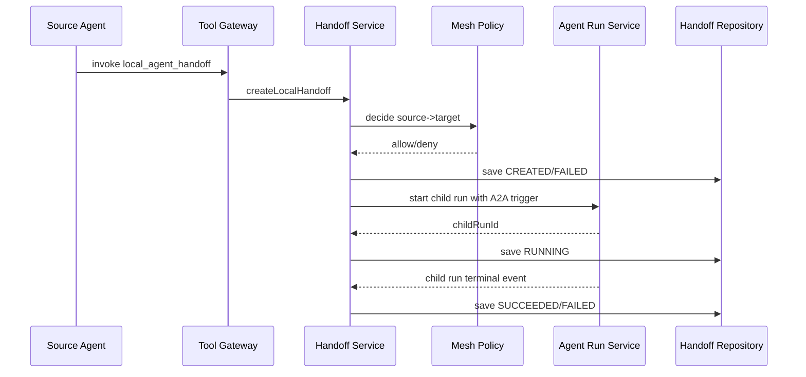

# Multi-Agent / A2A / Agent Mesh 详细设计

生成日期：2026-05-31

## 1. 结论

Multi-Agent 当前不是完全空白。代码已经落地本地 Agent-as-Tool / Handoff 的基础切片：`LocalAgentAsToolPort` 可以把目标 Agent 当作工具触发本地 child run；`KernelAgentHandoffService` 会创建 handoff 记录、执行深度/环路检查、启动 `AgentRunTriggerType.A2A` 子 run；JDBC 和 Web API 也已支持 handoff 查询与取消。

未落地的部分是完整协作平台：handoff 完成态回写、source-target 授权、上下文委托策略 UI、Supervisor/Workflow Team、远程 A2A Client/Server、Remote Agent Registry、Mesh 路由、限流、熔断和控制面。本文档把它们拆成 P0-P3，避免把“多 Agent 自由聊天”误当成近期目标。

## 2. 设计原则

1. 近期目标是受治理的 handoff 和 agent-as-tool，不是自由自治 swarm。
2. 每一次 agent-to-agent 调用都必须有 parentRunId、childRunId、sourceAgentId、targetAgentId、policy decision 和 audit。
3. 默认只传摘要上下文，不传完整 message history。
4. 不传 private memory 和 secret context，除非目标 Agent 有 delegated access。
5. 远程 Agent 默认 disabled，必须注册、鉴权、健康检查和管理员启用。
6. Mesh 控制面只做发现、路由、策略、限流、熔断和观测，不改变 Agent Run 主语义。

## 3. 当前实现状态

### 3.1 已落地能力

| 能力 | 当前状态 | 代码证据 |
| --- | --- | --- |
| Handoff 领域模型 | 已有 `AgentHandoff`、status、failureCode、limits | `kernel/domain/agent/handoff` |
| Context 策略基础 | 已有 `AgentHandoffContextPolicy`，只传 public/internal，过滤 tool result | `AgentHandoffContextPolicy.java` |
| Mesh policy 基础 | 已有 `DefaultMeshPolicyPort`，覆盖 depth limit 和 cycle detection | `DefaultMeshPolicyPort.java` |
| Handoff 服务 | 已有 `KernelAgentHandoffService#createLocalHandoff/cancel/find/list` | `KernelAgentHandoffService.java` |
| Agent-as-Tool | 已有 `LocalAgentAsToolPort`，toolId 为 `local_agent_handoff` | `LocalAgentAsToolPort.java` |
| A2A 触发类型 | child run 使用 `AgentRunTriggerType.A2A` | `KernelAgentHandoffService#createLocalHandoff` |
| JDBC 存储 | 已有 `JdbcAgentHandoffRepositoryAdapter` | `JdbcAgentHandoffRepositoryAdapter.java` |
| Web API | 已有按 parent run 查询 handoff、按 ID 查询、取消 | `SeahorseAgentHandoffController.java` |
| Feature Gate | 已有 agent handoff 与 remote agent feature flag | `AdvancedFeatureGate.java` |

### 3.2 真实缺口

| 缺口 | 影响 | 设计处理 |
| --- | --- | --- |
| handoff 完成态未自动回写 | child run 成功或失败后，handoff 可能长期停留 RUNNING | 监听 child run terminal event，调用 `succeed/fail` |
| 缺少 source->target 授权矩阵 | 任意 source Agent 可能请求目标 Agent | 新增 `AgentCollaborationPolicyPort` |
| creation API 不对外开放 | 只能通过 LocalAgentAsToolPort 创建，不利于工作流编排和测试 | 新增受控 `POST /api/agent-handoffs`，默认仅 admin/workflow engine 可用 |
| context policy 不可配置 | 当前只有默认摘要策略，无法表达委托访问 | 新增 context delegation policy 与 UI |
| 缺少 Supervisor/Workflow Team | 无法配置固定 DAG 或 supervisor 分派 | 新增 Team Definition 与 Team Run |
| 远程 A2A 未实现 | 无 Agent Card、remote task、streaming event | 新增 Remote Agent Registry、A2A client/server |
| 缺少 Mesh 控制面 | 无 discovery、routing、quota、circuit breaker | P3 增加 Mesh Routing/Health/Quota |
| 前端缺少专门页面 | handoff 只存在 service，未在 Inspector/Run 详情中形成完整视图 | Agent Inspector 增加 Handoff Timeline，Admin 增加 Multi-Agent 页面 |

## 4. 分层目标

| 阶段 | 范围 | 目标 |
| --- | --- | --- |
| P0 | 本地 Agent-as-Tool 加固 | 让当前 handoff 可结束、可授权、可审计、可观测 |
| P1 | Supervisor / Workflow Team | 支持固定 DAG 与 supervisor 分派，但仍只调用本地 Agent |
| P2 | Remote A2A | 支持注册远程 Agent Card、创建远程 task、对外暴露 Seahorse Agent |
| P3 | Agent Mesh | 支持发现、路由、配额、熔断、健康、版本兼容和控制面 UI |

## 5. P0：本地 Handoff 加固

### 5.1 目标流程



### 5.2 Handoff 完成态回写

新增端口：

```text
AgentRunLifecycleObserver
  onRunTerminal(AgentRun run)

AgentHandoffCompletionPort
  completeByChildRun(childRunId, status, failureCode)
```

规则：

| child run 状态 | handoff 状态 |
| --- | --- |
| `SUCCEEDED` | `SUCCEEDED` |
| `FAILED` | `FAILED` + `CHILD_RUN_FAILED` |
| `CANCELLED` | `CANCELLED` |
| `TIMED_OUT` | `FAILED` + `CHILD_RUN_TIMED_OUT` |

### 5.3 授权策略

新增：

```text
AgentCollaborationPolicyPort
  decide(AgentCollaborationPolicyRequest) -> AgentCollaborationPolicyDecision
```

策略输入：

| 字段 | 说明 |
| --- | --- |
| `tenantId` | 租户 |
| `sourceAgentId` | 发起 Agent |
| `targetAgentId` | 目标 Agent |
| `targetRiskLevel` | 目标风险 |
| `requestedCapabilities` | 请求能力 |
| `contextPolicyId` | 上下文传递策略 |
| `depth` | handoff 深度 |
| `ancestorAgentIds` | 祖先 Agent |

默认策略：

1. source 与 target 必须属于同一 tenant。
2. source 必须在 target 的 allowed callers 中。
3. 高风险 target 需要 approval policy。
4. depth 超过 `MAX_LOCAL_HANDOFF_DEPTH` 拒绝。
5. ancestor 中包含 target 拒绝。

### 5.4 Context 传递

默认只传：

1. 用户输入摘要。
2. 可转移 ContextItem 的 summary 与 citation。
3. public/internal sensitivity。

默认不传：

1. TOOL_RESULT 原文。
2. PRIVATE/SECRET context item。
3. 用户 private memory。
4. credential、token、approval secret。

委托访问需要显式策略：

```text
ContextDelegationPolicy
  policyId
  sourceAgentId
  targetAgentId
  allowedSensitivity
  allowedMemoryScopes
  maxContextItems
  expiresAt
```

## 6. P1：Supervisor / Workflow Team

### 6.1 TeamDefinition

```text
AgentTeamDefinition
  teamId
  tenantId
  name
  mode: SUPERVISOR | WORKFLOW_DAG
  ownerTeam
  status
  version

AgentTeamMember
  teamId
  agentId
  role
  capabilitiesJson
  maxConcurrency

AgentTeamEdge
  teamId
  sourceMemberId
  targetMemberId
  conditionJson
  contextPolicyId
```

### 6.2 Supervisor 模式

Supervisor 不直接“自由聊天”，而是受工具和策略约束：

1. Supervisor 接收任务。
2. 规划子任务列表。
3. 每个子任务通过 handoff 调用目标 Agent。
4. 结果回到 supervisor 汇总。
5. 每个 handoff 都写 child run 和 audit。

### 6.3 Workflow DAG 模式

固定 DAG：

1. 节点是 Agent 或 Tool。
2. 边定义输入映射和执行条件。
3. 每个节点执行产生 node run。
4. agent 节点通过 handoff 创建 child run。
5. DAG 失败按策略 retry、skip、fail fast 或 wait human。

## 7. P2：Remote A2A

### 7.1 Remote Agent Registry

```text
RemoteAgent
  remoteAgentId
  tenantId
  name
  endpointUrl
  agentCardJson
  authPolicyId
  trustLevel: INTERNAL | PARTNER | EXTERNAL
  status: DISABLED | ENABLED | UNHEALTHY
  lastHealthCheckAt
```

API：

| Method | Path | 说明 |
| --- | --- | --- |
| `POST` | `/api/remote-agents` | 注册 remote agent |
| `GET` | `/api/remote-agents` | 分页列表 |
| `GET` | `/api/remote-agents/{id}` | 详情 |
| `POST` | `/api/remote-agents/{id}/health-check` | 拉取 Agent Card 并检查 |
| `POST` | `/api/remote-agents/{id}/enable` | 启用 |
| `POST` | `/api/remote-agents/{id}/disable` | 禁用 |

### 7.2 A2A Client

```text
A2AClientPort
  fetchAgentCard(endpoint, credential) -> AgentCard
  createTask(remoteAgent, request) -> RemoteTask
  streamEvents(remoteTask) -> Flux<RemoteAgentEvent>
  cancelTask(remoteTaskId)
```

远程调用流程：

1. Mesh routing 选择 remote agent。
2. Policy 检查 source->remote target。
3. CredentialProvider 解析 auth policy。
4. A2A client 创建 remote task。
5. remote events 映射为本地 AgentStep。
6. 远程结果写入 child run 和 handoff。

### 7.3 A2A Server

对外暴露 Seahorse Agent：

1. 生成 Agent Card，只暴露 published version 和允许的 capabilities。
2. 外部 task 进入本地 `AgentRunTriggerType.A2A`。
3. 外部身份映射为 tenant policy subject。
4. event stream 不泄漏内部 private context。
5. 外部取消映射为本地 run cancel。

## 8. P3：Agent Mesh 控制面

### 8.1 控制面能力

| 能力 | 设计 |
| --- | --- |
| Discovery | 本地 Agent Catalog + Remote Agent Card |
| Routing | capability、risk、health、cost、latency、version |
| Policy | source->target authorization、context delegation、trust level |
| Quota | agent-to-agent daily/monthly budget、concurrency |
| Tracing | parentRunId、childRunId、handoffId、traceId |
| Circuit Breaker | 失败率、超时率、健康检查 |
| Version Compatibility | target version、Agent Card schema version |

### 8.2 Mesh 路由决策

```text
MeshRoutingPort
  route(MeshRoutingRequest) -> MeshRoutingDecision

MeshRoutingDecision
  targetType: LOCAL_AGENT | REMOTE_AGENT
  targetId
  targetVersion
  reason
  fallbackTargets
  requiredApproval
```

路由优先级：

1. policy allow 是前置条件。
2. 本地 stable target 优先于远程 target。
3. 健康 target 优先于 unhealthy target。
4. 低成本不能覆盖安全策略。
5. 无法判断时进入 human approval，不自动猜测。

## 9. 前端设计

### 9.1 Agent Inspector Handoff Timeline

在现有 Agent Inspector / Run Detail 中增加：

| 区域 | 内容 |
| --- | --- |
| Handoff Tree | parent run 到 child run 的树 |
| Handoff Detail | source、target、status、failureCode、reason |
| Context Summary | stripped item count、transferred items、policyId |
| Policy Decision | allow/deny、depth、cycle、authorization |
| Actions | 查看 child run、取消 handoff、重试 |

### 9.2 Multi-Agent Admin

新增 `/admin/multi-agent`：

| Tab | 内容 |
| --- | --- |
| Local Handoffs | handoff 查询、状态、失败原因 |
| Collaboration Policies | source->target 授权矩阵 |
| Teams | Supervisor / Workflow DAG 定义 |
| Remote Agents | remote registry、health、enable/disable |
| Mesh Health | 熔断、quota、latency、failure rate |

## 10. API 设计

### P0 API

| Method | Path | 说明 |
| --- | --- | --- |
| `POST` | `/api/agent-handoffs` | 受控创建 handoff |
| `GET` | `/api/agent-runs/{runId}/handoffs` | 查询 run 下 handoff |
| `GET` | `/api/agent-handoffs/{handoffId}` | handoff 详情 |
| `POST` | `/api/agent-handoffs/{handoffId}/cancel` | 取消 |
| `GET` | `/api/agent-handoffs/{handoffId}/context` | context 摘要 |

### P1 API

| Method | Path | 说明 |
| --- | --- | --- |
| `POST` | `/api/agent-teams` | 创建 team |
| `GET` | `/api/agent-teams` | 列表 |
| `POST` | `/api/agent-teams/{teamId}/runs` | 启动 team run |
| `GET` | `/api/agent-team-runs/{runId}` | team run 详情 |

### P2/P3 API

| Method | Path | 说明 |
| --- | --- | --- |
| `POST` | `/api/remote-agents` | 注册 |
| `POST` | `/api/remote-agents/{id}/health-check` | 健康检查 |
| `POST` | `/api/mesh/routes/preview` | 路由预览 |
| `GET` | `/api/mesh/health` | mesh health |
| `GET` | `/api/mesh/circuit-breakers` | 熔断状态 |

## 11. 数据库设计

当前 `sa_agent_handoff` 已存在。新增建议：

```sql
CREATE TABLE sa_agent_collaboration_policy (
  policy_id VARCHAR(64) PRIMARY KEY,
  tenant_id VARCHAR(64) NOT NULL,
  source_agent_id VARCHAR(64) NOT NULL,
  target_agent_id VARCHAR(64) NOT NULL,
  allowed BOOLEAN NOT NULL,
  context_policy_id VARCHAR(64),
  approval_policy_id VARCHAR(64),
  max_depth INTEGER NOT NULL,
  created_at TIMESTAMP NOT NULL,
  updated_at TIMESTAMP NOT NULL
);

CREATE TABLE sa_remote_agent (
  remote_agent_id VARCHAR(64) PRIMARY KEY,
  tenant_id VARCHAR(64) NOT NULL,
  name VARCHAR(128) NOT NULL,
  endpoint_url VARCHAR(512) NOT NULL,
  agent_card_json TEXT NOT NULL,
  auth_policy_id VARCHAR(64),
  trust_level VARCHAR(32) NOT NULL,
  status VARCHAR(32) NOT NULL,
  last_health_check_at TIMESTAMP,
  created_at TIMESTAMP NOT NULL,
  updated_at TIMESTAMP NOT NULL
);

CREATE TABLE sa_agent_team (
  team_id VARCHAR(64) PRIMARY KEY,
  tenant_id VARCHAR(64) NOT NULL,
  name VARCHAR(128) NOT NULL,
  mode VARCHAR(32) NOT NULL,
  owner_team VARCHAR(128) NOT NULL,
  status VARCHAR(32) NOT NULL,
  definition_json TEXT NOT NULL,
  created_at TIMESTAMP NOT NULL,
  updated_at TIMESTAMP NOT NULL
);
```

## 12. 安全治理

1. 默认不允许跨 tenant handoff。
2. 默认不允许 source 调用未授权 target。
3. 高风险 target 默认需要 approval。
4. Context 只传摘要，private/secret/tool result 默认剥离。
5. Remote Agent 默认 disabled。
6. Remote Agent Card 必须记录版本和签名摘要。
7. 远程调用失败不得自动重试无限次，必须受 retry/circuit breaker 控制。
8. 每次 handoff 都必须能从 parent run 追到 child run。

## 13. 分阶段落地

### P0：本地 handoff 闭环

1. 增加 child run terminal observer，自动完成 handoff。
2. 增加 collaboration policy port 和 JDBC adapter。
3. 增加受控 create handoff API。
4. Agent Inspector 展示 handoff tree。
5. 增加 depth/cycle/authorization/context stripping 测试。

### P1：Team 协作

1. 增加 `AgentTeamDefinition`、member、edge。
2. 支持 Workflow DAG run。
3. 支持 Supervisor planning，但子任务仍通过 handoff。
4. UI 增加 Teams tab。

### P2：Remote A2A

1. 增加 Remote Agent Registry。
2. 增加 A2A client。
3. 增加 A2A server agent card endpoint。
4. Remote event 映射到本地 run step。

### P3：Mesh 控制面

1. 增加 mesh routing preview。
2. 增加 quota 和 circuit breaker。
3. 增加 mesh health UI。
4. 增加 version compatibility 校验。

## 14. 验收标准

1. `local_agent_handoff` 能创建 child run，并写入 handoff。
2. child run 成功后，handoff 自动变为 `SUCCEEDED`。
3. child run 失败后，handoff 自动变为 `FAILED` 并记录 failureCode。
4. 未授权 source->target handoff 被拒绝。
5. depth 超限和 cycle 被拒绝。
6. Context 中 private、secret、tool result 不会传给 target。
7. Agent Inspector 能展示 parent/child run 关系。
8. Remote Agent 未启用时不能被路由调用。
9. Mesh routing 决策有可解释 reason。

## 15. 测试清单

| 测试 | 目标 |
| --- | --- |
| `KernelAgentHandoffServiceTests` | create、deny、cancel、audit |
| `AgentHandoffCompletionTests` | child terminal event 回写 |
| `AgentCollaborationPolicyTests` | 授权矩阵、tenant、risk |
| `AgentHandoffContextPolicyTests` | context stripping |
| `SeahorseAgentHandoffControllerTests` | 查询、取消、受控创建 |
| `JdbcAgentHandoffRepositoryAdapterTests` | 持久化 |
| `RemoteAgentRegistryTests` | 注册、健康检查、启停 |
| `AgentInspectorHandoffTimeline.test.tsx` | 前端 handoff tree |

## 16. 非目标

1. 不在近期实现无边界的多 Agent 自主群聊。
2. 不允许 Agent 绕过 Tool Gateway 直接调用另一个 Agent。
3. 不默认开放远程 Agent 调用。
4. 不把远程 Agent 结果视为可信事实；仍需要 provenance、risk 和 trust level。
