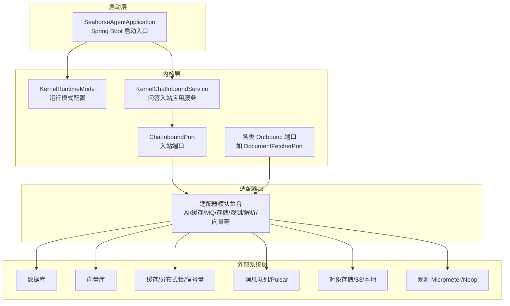
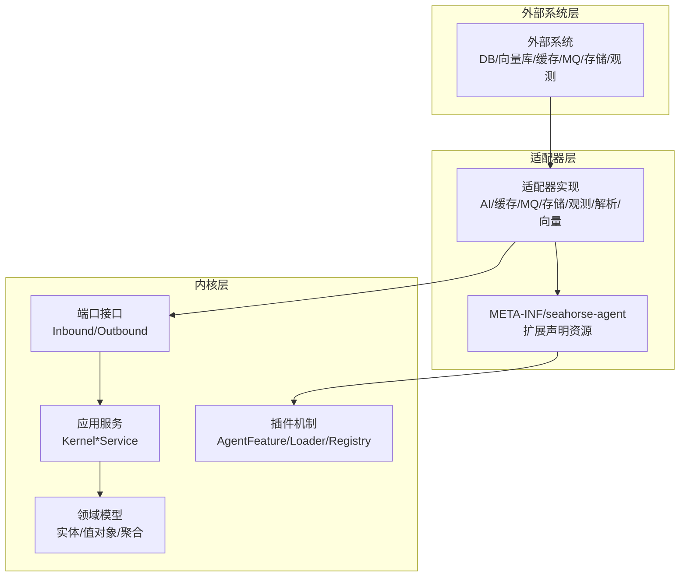
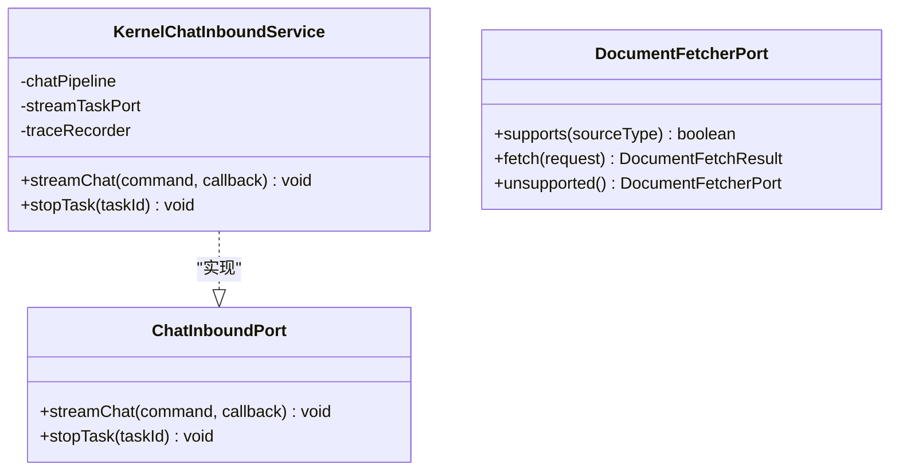
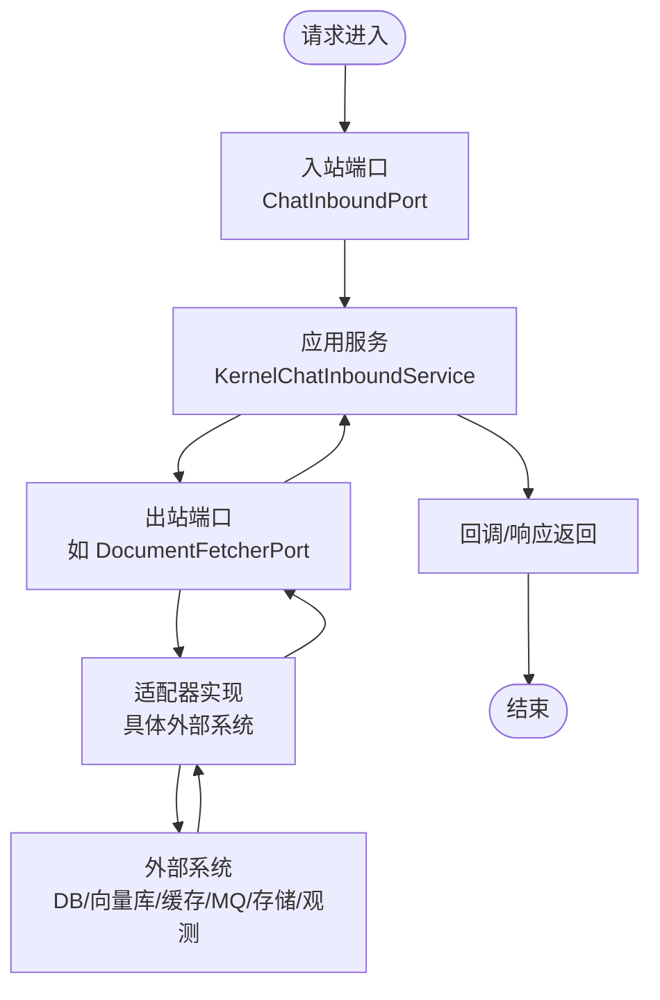
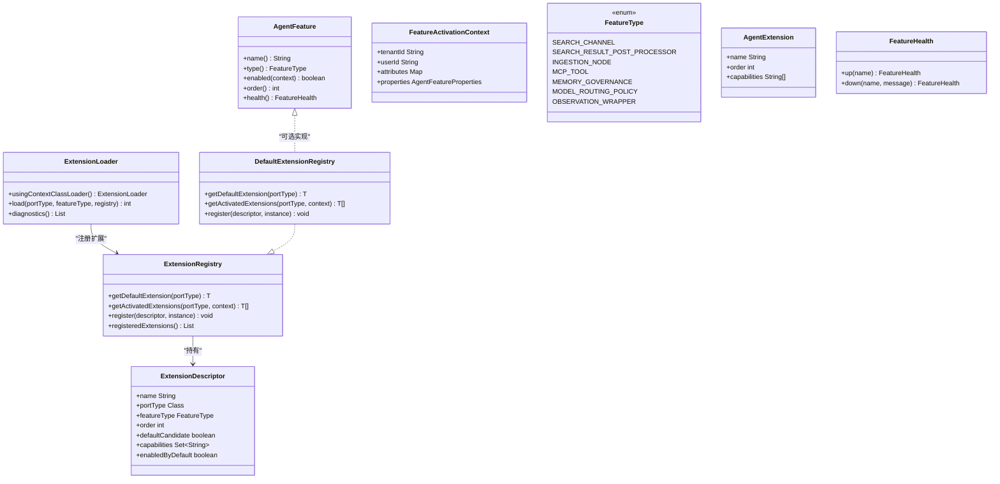
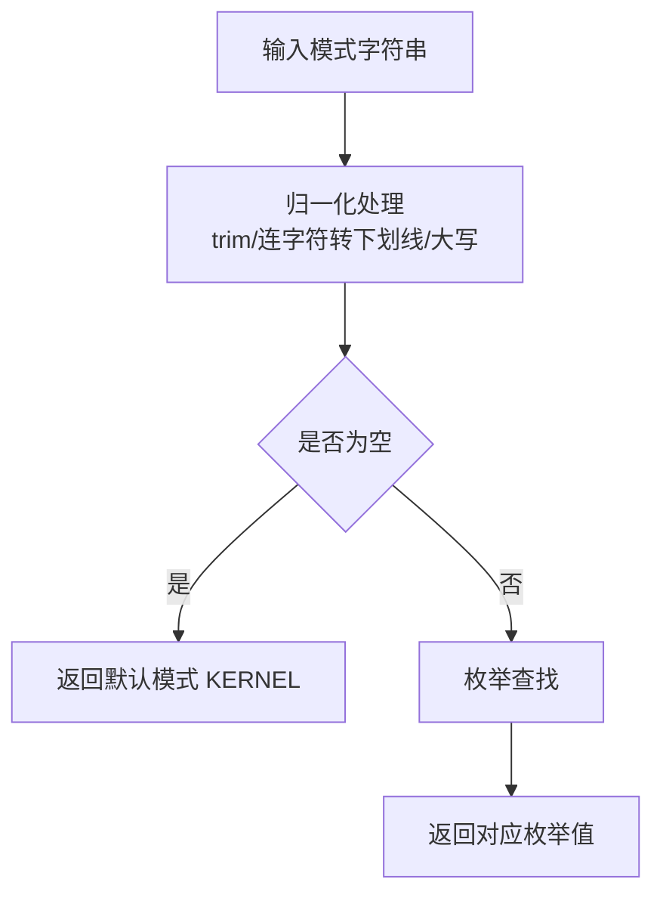
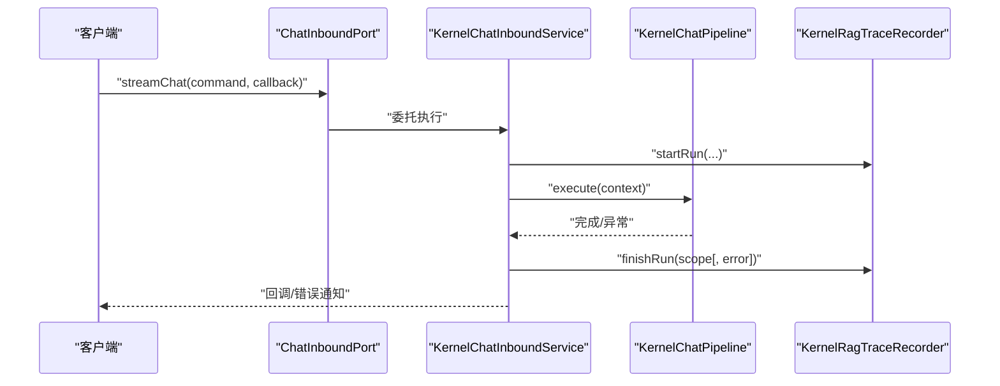
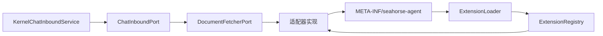
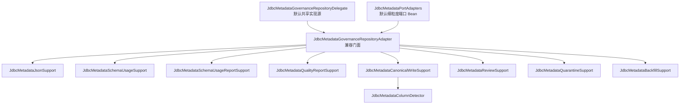
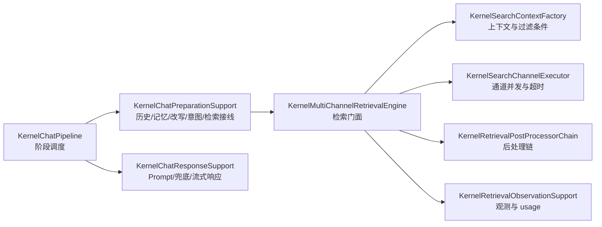

# 架构设计

<cite>
**本文引用的文件**
- [KernelRuntimeMode.java](file://seahorse-agent-kernel/src/main/java/com/miracle/ai/seahorse/agent/kernel/config/KernelRuntimeMode.java)
- [AgentFeature.java](file://seahorse-agent-kernel/src/main/java/com/miracle/ai/seahorse/agent/kernel/plugin/AgentFeature.java)
- [ExtensionLoader.java](file://seahorse-agent-kernel/src/main/java/com/miracle/ai/seahorse/agent/kernel/plugin/ExtensionLoader.java)
- [ExtensionRegistry.java](file://seahorse-agent-kernel/src/main/java/com/miracle/ai/seahorse/agent/kernel/plugin/ExtensionRegistry.java)
- [DefaultExtensionRegistry.java](file://seahorse-agent-kernel/src/main/java/com/miracle/ai/seahorse/agent/kernel/plugin/DefaultExtensionRegistry.java)
- [FeatureType.java](file://seahorse-agent-kernel/src/main/java/com/miracle/ai/seahorse/agent/kernel/plugin/FeatureType.java)
- [ExtensionDescriptor.java](file://seahorse-agent-kernel/src/main/java/com/miracle/ai/seahorse/agent/kernel/plugin/ExtensionDescriptor.java)
- [FeatureActivationContext.java](file://seahorse-agent-kernel/src/main/java/com/miracle/ai/seahorse/agent/kernel/plugin/FeatureActivationContext.java)
- [AgentExtension.java](file://seahorse-agent-kernel/src/main/java/com/miracle/ai/seahorse/agent/kernel/plugin/AgentExtension.java)
- [FeatureHealth.java](file://seahorse-agent-kernel/src/main/java/com/miracle/ai/seahorse/agent/kernel/plugin/FeatureHealth.java)
- [DocumentFetcherPort.java](file://seahorse-agent-kernel/src/main/java/com/miracle/ai/seahorse/agent/ports/outbound/ingestion/DocumentFetcherPort.java)
- [ChatInboundPort.java](file://seahorse-agent-kernel/src/main/java/com/miracle/ai/seahorse/agent/ports/inbound/chat/ChatInboundPort.java)
- [KernelChatInboundService.java](file://seahorse-agent-kernel/src/main/java/com/miracle/ai/seahorse/agent/kernel/application/chat/KernelChatInboundService.java)
- [SeahorseAgentApplication.java](file://seahorse-agent-bootstrap/src/main/java/com/miracle/ai/seahorse/agent/SeahorseAgentApplication.java)
</cite>

## 目录
1. [简介](#简介)
2. [项目结构](#项目结构)
3. [核心组件](#核心组件)
4. [架构总览](#架构总览)
5. [组件详解](#组件详解)
6. [依赖关系分析](#依赖关系分析)
7. [性能考量](#性能考量)
8. [故障排查指南](#故障排查指南)
9. [架构收敛设计与实现](#架构收敛设计与实现)
10. [结论](#结论)
11. [附录](#附录)

## 简介
本文件为 Seahorse Agent 的架构设计文档，聚焦以下目标：
- 全面阐述系统的整体架构模式，重点说明端口适配器模式（Port and Adapters）在项目中的落地方式；
- 解释 Clean Architecture 在项目中的具体实现，明确内核层、适配器层、外部系统层的职责边界；
- 深入介绍插件系统的设计，包括 AgentFeature、ExtensionLoader、ExtensionRegistry 等核心组件及其交互关系；
- 说明 KernelRuntimeMode 的运行模式配置及对执行环境的支持；
- 提供系统边界图与组件交互图，帮助开发者快速理解模块间的依赖关系；
- 总结架构决策的技术考量与权衡，覆盖可扩展性、可维护性与性能等方面。

## 项目结构
Seahorse Agent 采用多模块 Maven 结构，围绕“内核 + 适配器 + 外部系统”三层进行组织：
- 内核层（Kernel）：包含领域模型、应用服务、端口接口与插件机制，承载业务内核与可插拔扩展。
- 适配器层（Adapters）：面向不同外部系统（如 AI 模型、缓存、消息队列、存储、观测等）的具体实现，通过端口对接内核。
- 外部系统层（External Systems）：如数据库、向量库、对象存储、消息中间件等基础设施。
- 启动层（Bootstrap）：Spring Boot 启动入口，负责装配与引导。

图表来源
- [SeahorseAgentApplication.java:30-36](file://seahorse-agent-bootstrap/src/main/java/com/miracle/ai/seahorse/agent/SeahorseAgentApplication.java#L30-L36)
- [KernelRuntimeMode.java:25-45](file://seahorse-agent-kernel/src/main/java/com/miracle/ai/seahorse/agent/kernel/config/KernelRuntimeMode.java#L25-L45)
- [KernelChatInboundService.java:34-54](file://seahorse-agent-kernel/src/main/java/com/miracle/ai/seahorse/agent/kernel/application/chat/KernelChatInboundService.java#L34-L54)
- [ChatInboundPort.java:27-43](file://seahorse-agent-kernel/src/main/java/com/miracle/ai/seahorse/agent/ports/inbound/chat/ChatInboundPort.java#L27-L43)
- [DocumentFetcherPort.java:23-42](file://seahorse-agent-kernel/src/main/java/com/miracle/ai/seahorse/agent/ports/outbound/ingestion/DocumentFetcherPort.java#L23-L42)

章节来源
- [SeahorseAgentApplication.java:30-36](file://seahorse-agent-bootstrap/src/main/java/com/miracle/ai/seahorse/agent/SeahorseAgentApplication.java#L30-L36)

## 核心组件
本节从 Clean Architecture 的视角，梳理内核层、适配器层与外部系统层的关键构件与职责。

- 内核层（Kernel）
  - 应用服务：封装业务用例，如 KernelChatInboundService，负责编排问答流程、追踪与错误处理。
  - 领域模型：承载业务实体与规则，如聊天消息、采样参数等。
  - 端口接口：定义入站/出站契约，隔离业务逻辑与外部依赖。
  - 插件机制：通过 AgentFeature、ExtensionLoader、ExtensionRegistry 实现可插拔扩展与运行时选择。

- 适配器层（Adapters）
  - 面向不同外部系统的实现，如 OpenAI 兼容模型、本地/Redis 缓存、Pulsar MQ、S3/本地对象存储、Micrometer 观测等。
  - 通过 META-INF/seahorse-agent 下的资源文件声明扩展，由 ExtensionLoader 在启动期加载并注册至 ExtensionRegistry。

- 外部系统层（External Systems）
  - 数据库、向量库、缓存、消息队列、对象存储、观测系统等基础设施。

章节来源
- [KernelChatInboundService.java:34-93](file://seahorse-agent-kernel/src/main/java/com/miracle/ai/seahorse/agent/kernel/application/chat/KernelChatInboundService.java#L34-L93)
- [DocumentFetcherPort.java:23-42](file://seahorse-agent-kernel/src/main/java/com/miracle/ai/seahorse/agent/ports/outbound/ingestion/DocumentFetcherPort.java#L23-L42)
- [ExtensionLoader.java:79-84](file://seahorse-agent-kernel/src/main/java/com/miracle/ai/seahorse/agent/kernel/plugin/ExtensionLoader.java#L79-L84)
- [ExtensionRegistry.java:28-83](file://seahorse-agent-kernel/src/main/java/com/miracle/ai/seahorse/agent/kernel/plugin/ExtensionRegistry.java#L28-L83)

## 架构总览
Clean Architecture 将系统划分为多个同心层，内核层包含稳定的业务逻辑与抽象，外层为具体实现。Seahorse Agent 通过端口适配器模式实现“依赖倒置”，使上层仅依赖抽象，下层实现抽象。

图表来源
- [ExtensionLoader.java:39-55](file://seahorse-agent-kernel/src/main/java/com/miracle/ai/seahorse/agent/kernel/plugin/ExtensionLoader.java#L39-L55)
- [ExtensionRegistry.java:28-83](file://seahorse-agent-kernel/src/main/java/com/miracle/ai/seahorse/agent/kernel/plugin/ExtensionRegistry.java#L28-L83)
- [KernelChatInboundService.java:34-54](file://seahorse-agent-kernel/src/main/java/com/miracle/ai/seahorse/agent/kernel/application/chat/KernelChatInboundService.java#L34-L54)

## 组件详解

### 端口适配器模式（Port and Adapters）
- 端口（Port）
  - 入站端口：如 ChatInboundPort，定义对外提供的服务契约，屏蔽内部实现细节。
  - 出站端口：如 DocumentFetcherPort，定义内核对外部能力的抽象调用。
- 适配器（Adapter）
  - 面向具体外部系统的实现，遵循对应端口接口，注入到内核运行时。
  - 通过 META-INF/seahorse-agent 下的资源文件声明扩展，由 ExtensionLoader 在启动期加载。

图表来源
- [ChatInboundPort.java:27-43](file://seahorse-agent-kernel/src/main/java/com/miracle/ai/seahorse/agent/ports/inbound/chat/ChatInboundPort.java#L27-L43)
- [KernelChatInboundService.java:34-93](file://seahorse-agent-kernel/src/main/java/com/miracle/ai/seahorse/agent/kernel/application/chat/KernelChatInboundService.java#L34-L93)
- [DocumentFetcherPort.java:23-42](file://seahorse-agent-kernel/src/main/java/com/miracle/ai/seahorse/agent/ports/outbound/ingestion/DocumentFetcherPort.java#L23-L42)

章节来源
- [ChatInboundPort.java:27-43](file://seahorse-agent-kernel/src/main/java/com/miracle/ai/seahorse/agent/ports/inbound/chat/ChatInboundPort.java#L27-L43)
- [KernelChatInboundService.java:34-93](file://seahorse-agent-kernel/src/main/java/com/miracle/ai/seahorse/agent/kernel/application/chat/KernelChatInboundService.java#L34-L93)
- [DocumentFetcherPort.java:23-42](file://seahorse-agent-kernel/src/main/java/com/miracle/ai/seahorse/agent/ports/outbound/ingestion/DocumentFetcherPort.java#L23-L42)

### Clean Architecture 层次与职责
- 内核层（稳定）
  - 应用服务：编排业务流程，协调端口调用，负责追踪与错误处理。
  - 领域模型：承载业务不变量与规则。
  - 端口接口：定义清晰的依赖边界，隔离变化。
  - 插件机制：统一扩展生命周期与健康检查。
- 适配器层（可替换）
  - 面向不同外部系统的实现，通过端口对接内核。
  - 通过资源文件声明扩展，启动期加载注册。
- 外部系统层（基础设施）
  - 数据库、向量库、缓存、消息队列、对象存储、观测系统等。

图表来源
- [KernelChatInboundService.java:56-78](file://seahorse-agent-kernel/src/main/java/com/miracle/ai/seahorse/agent/kernel/application/chat/KernelChatInboundService.java#L56-L78)
- [ChatInboundPort.java:27-43](file://seahorse-agent-kernel/src/main/java/com/miracle/ai/seahorse/agent/ports/inbound/chat/ChatInboundPort.java#L27-L43)
- [DocumentFetcherPort.java:23-42](file://seahorse-agent-kernel/src/main/java/com/miracle/ai/seahorse/agent/ports/outbound/ingestion/DocumentFetcherPort.java#L23-L42)

章节来源
- [KernelChatInboundService.java:56-78](file://seahorse-agent-kernel/src/main/java/com/miracle/ai/seahorse/agent/kernel/application/chat/KernelChatInboundService.java#L56-L78)

### 插件系统架构设计
插件系统围绕 AgentFeature、ExtensionLoader、ExtensionRegistry 三大核心组件展开，实现启动期发现、注册与运行期选择。

- AgentFeature
  - 定义 Feature 的唯一名称、类型、启用条件、排序与健康状态。
- ExtensionLoader
  - 基于 classpath 资源（META-INF/seahorse-agent/{port-fqcn}）加载扩展，构造 ExtensionDescriptor 并注册到注册表。
- ExtensionRegistry
  - 提供默认扩展与已激活扩展链查询；默认实现 DefaultExtensionRegistry 在注册时校验端口一致性与名称唯一性，并按 order 排序。
- ExtensionDescriptor
  - 描述扩展的元数据：名称、端口类型、Feature 类型、排序、默认候选、能力标签、默认启用标志。
- FeatureActivationContext
  - 传递租户、用户、灰度属性与配置快照，驱动 Feature 的启用判断。
- FeatureType
  - 定义稳定的扩展点类型，如检索通道、入库节点、MCP 工具、记忆治理、模型路由策略、观测包装器等。
- AgentExtension
  - 注解形式声明扩展名称、顺序与能力标签，便于显式注册与加载器读取。
- FeatureHealth
  - 描述 Feature 的健康状态，用于启动检查与运维展示。

图表来源
- [AgentFeature.java:26-79](file://seahorse-agent-kernel/src/main/java/com/miracle/ai/seahorse/agent/kernel/plugin/AgentFeature.java#L26-L79)
- [ExtensionLoader.java:39-55](file://seahorse-agent-kernel/src/main/java/com/miracle/ai/seahorse/agent/kernel/plugin/ExtensionLoader.java#L39-L55)
- [ExtensionRegistry.java:28-83](file://seahorse-agent-kernel/src/main/java/com/miracle/ai/seahorse/agent/kernel/plugin/ExtensionRegistry.java#L28-L83)
- [DefaultExtensionRegistry.java:34-123](file://seahorse-agent-kernel/src/main/java/com/miracle/ai/seahorse/agent/kernel/plugin/DefaultExtensionRegistry.java#L34-L123)
- [ExtensionDescriptor.java:37-64](file://seahorse-agent-kernel/src/main/java/com/miracle/ai/seahorse/agent/kernel/plugin/ExtensionDescriptor.java#L37-L64)
- [FeatureActivationContext.java:33-60](file://seahorse-agent-kernel/src/main/java/com/miracle/ai/seahorse/agent/kernel/plugin/FeatureActivationContext.java#L33-L60)
- [FeatureType.java:26-62](file://seahorse-agent-kernel/src/main/java/com/miracle/ai/seahorse/agent/kernel/plugin/FeatureType.java#L26-L62)
- [AgentExtension.java:35-57](file://seahorse-agent-kernel/src/main/java/com/miracle/ai/seahorse/agent/kernel/plugin/AgentExtension.java#L35-L57)
- [FeatureHealth.java:33-67](file://seahorse-agent-kernel/src/main/java/com/miracle/ai/seahorse/agent/kernel/plugin/FeatureHealth.java#L33-L67)

章节来源
- [AgentFeature.java:26-79](file://seahorse-agent-kernel/src/main/java/com/miracle/ai/seahorse/agent/kernel/plugin/AgentFeature.java#L26-L79)
- [ExtensionLoader.java:79-114](file://seahorse-agent-kernel/src/main/java/com/miracle/ai/seahorse/agent/kernel/plugin/ExtensionLoader.java#L79-L114)
- [ExtensionRegistry.java:37-47](file://seahorse-agent-kernel/src/main/java/com/miracle/ai/seahorse/agent/kernel/plugin/ExtensionRegistry.java#L37-L47)
- [DefaultExtensionRegistry.java:39-58](file://seahorse-agent-kernel/src/main/java/com/miracle/ai/seahorse/agent/kernel/plugin/DefaultExtensionRegistry.java#L39-L58)
- [ExtensionDescriptor.java:37-64](file://seahorse-agent-kernel/src/main/java/com/miracle/ai/seahorse/agent/kernel/plugin/ExtensionDescriptor.java#L37-L64)
- [FeatureActivationContext.java:33-60](file://seahorse-agent-kernel/src/main/java/com/miracle/ai/seahorse/agent/kernel/plugin/FeatureActivationContext.java#L33-L60)
- [FeatureType.java:26-62](file://seahorse-agent-kernel/src/main/java/com/miracle/ai/seahorse/agent/kernel/plugin/FeatureType.java#L26-L62)
- [AgentExtension.java:35-57](file://seahorse-agent-kernel/src/main/java/com/miracle/ai/seahorse/agent/kernel/plugin/AgentExtension.java#L35-L57)
- [FeatureHealth.java:33-67](file://seahorse-agent-kernel/src/main/java/com/miracle/ai/seahorse/agent/kernel/plugin/FeatureHealth.java#L33-L67)

### KernelRuntimeMode 运行模式配置
- KernelRuntimeMode 提供运行时模式枚举，默认模式为 kernel。
- 支持从字符串值解析为枚举，进行大小写与连字符归一化处理，便于配置灵活输入。
- 该模式可用于在不同执行环境中切换内核行为（如单机、容器、嵌入式等），但当前仓库中仅定义了单一模式常量。

图表来源
- [KernelRuntimeMode.java:39-45](file://seahorse-agent-kernel/src/main/java/com/miracle/ai/seahorse/agent/kernel/config/KernelRuntimeMode.java#L39-L45)

章节来源
- [KernelRuntimeMode.java:25-45](file://seahorse-agent-kernel/src/main/java/com/miracle/ai/seahorse/agent/kernel/config/KernelRuntimeMode.java#L25-L45)

### 端到端调用序列（问答）

图表来源
- [KernelChatInboundService.java:56-78](file://seahorse-agent-kernel/src/main/java/com/miracle/ai/seahorse/agent/kernel/application/chat/KernelChatInboundService.java#L56-L78)
- [ChatInboundPort.java:27-43](file://seahorse-agent-kernel/src/main/java/com/miracle/ai/seahorse/agent/ports/inbound/chat/ChatInboundPort.java#L27-L43)

章节来源
- [KernelChatInboundService.java:56-78](file://seahorse-agent-kernel/src/main/java/com/miracle/ai/seahorse/agent/kernel/application/chat/KernelChatInboundService.java#L56-L78)

## 依赖关系分析
- 组件耦合与内聚
  - 内核层通过端口接口与适配器层解耦，提升内核稳定性与可测试性。
  - 插件注册表在启动期集中管理扩展，运行期仅做轻量过滤，降低请求链路开销。
- 直接与间接依赖
  - 应用服务依赖端口接口与注册表；端口实现依赖外部系统；外部系统独立于内核。
- 外部依赖与集成点
  - 适配器通过资源文件声明扩展，统一由 ExtensionLoader 加载，避免硬编码依赖。
- 接口契约与实现细节
  - 端口接口定义清晰的输入输出与异常语义，适配器实现严格遵循契约。

图表来源
- [KernelChatInboundService.java:34-54](file://seahorse-agent-kernel/src/main/java/com/miracle/ai/seahorse/agent/kernel/application/chat/KernelChatInboundService.java#L34-L54)
- [ChatInboundPort.java:27-43](file://seahorse-agent-kernel/src/main/java/com/miracle/ai/seahorse/agent/ports/inbound/chat/ChatInboundPort.java#L27-L43)
- [DocumentFetcherPort.java:23-42](file://seahorse-agent-kernel/src/main/java/com/miracle/ai/seahorse/agent/ports/outbound/ingestion/DocumentFetcherPort.java#L23-L42)
- [ExtensionLoader.java:79-84](file://seahorse-agent-kernel/src/main/java/com/miracle/ai/seahorse/agent/kernel/plugin/ExtensionLoader.java#L79-L84)
- [ExtensionRegistry.java:37-47](file://seahorse-agent-kernel/src/main/java/com/miracle/ai/seahorse/agent/kernel/plugin/ExtensionRegistry.java#L37-L47)

章节来源
- [ExtensionLoader.java:79-114](file://seahorse-agent-kernel/src/main/java/com/miracle/ai/seahorse/agent/kernel/plugin/ExtensionLoader.java#L79-L114)
- [ExtensionRegistry.java:37-47](file://seahorse-agent-kernel/src/main/java/com/miracle/ai/seahorse/agent/kernel/plugin/ExtensionRegistry.java#L37-L47)

## 性能考量
- 启动期加载，运行期静态查询
  - 扩展在启动期通过 ExtensionLoader 加载并注册至 ExtensionRegistry，运行期仅做轻量过滤与类型转换，避免反射扫描带来的抖动。
- 端口接口最小化
  - 通过精简的端口接口减少跨层调用成本，提高编排效率。
- 健康检查与可观测性
  - FeatureHealth 仅报告自身状态，不参与主链路，避免健康检查影响在线请求；结合观测适配器记录追踪信息。
- 可扩展性与可维护性
  - 插件类型 FeatureType 限定扩展点，防止无序插件化导致核心能力空心化；扩展名称唯一性约束与默认候选机制确保可治理性。

## 故障排查指南
- 扩展加载失败
  - 症状：启动期抛出非法状态或实例化异常。
  - 排查：检查 META-INF/seahorse-agent 下的资源文件键值与类名是否正确；确认扩展类实现了正确的端口类型。
- 重复扩展名称
  - 症状：注册阶段抛出重复名称异常。
  - 排查：确保同一端口下的扩展名称唯一，修正重复项。
- 默认扩展缺失
  - 症状：查询默认扩展时报未找到默认扩展。
  - 排查：确认至少存在一个默认候选扩展，或在配置中显式指定启用。
- Feature 启用条件不满足
  - 症状：扩展未出现在已激活链中。
  - 排查：检查 FeatureActivationContext 与 AgentFeatureProperties 的配置，确认 enabledByDefault 与显式开关。

章节来源
- [ExtensionLoader.java:166-171](file://seahorse-agent-kernel/src/main/java/com/miracle/ai/seahorse/agent/kernel/plugin/ExtensionLoader.java#L166-L171)
- [DefaultExtensionRegistry.java:94-101](file://seahorse-agent-kernel/src/main/java/com/miracle/ai/seahorse/agent/kernel/plugin/DefaultExtensionRegistry.java#L94-L101)
- [DefaultExtensionRegistry.java:42-46](file://seahorse-agent-kernel/src/main/java/com/miracle/ai/seahorse/agent/kernel/plugin/DefaultExtensionRegistry.java#L42-L46)
- [FeatureActivationContext.java:103-114](file://seahorse-agent-kernel/src/main/java/com/miracle/ai/seahorse/agent/kernel/plugin/FeatureActivationContext.java#L103-L114)

## 架构收敛设计与实现

本节记录近期围绕扩展性、职责分离和企业级治理能力完成的架构收敛结果。收敛原则是：不按文件数量机械合并或拆分，而按变更原因、事务边界、外部能力替换边界和主链路稳定性判断职责归属。

### 收敛目标

- 保持 Clean Architecture 边界：内核不直接依赖 Milvus、Redis、S3、OpenAI、Elasticsearch、Lucene、JDBC 等外部 SDK。
- 主流程类只负责编排固定阶段，不承载通道发现、后处理、观测、SQL 细节或跨子域统计。
- 自动配置按技术域聚合，避免新增能力时反复修改超大配置类。
- JDBC 元数据治理适配器按协作者组合拆分，先保持端口 Bean 兼容，再逐步下沉子域实现。
- 端口数量按契约价值治理，不把 DTO 文件数量等同于端口爆炸。

### 已落地的设计

| 领域 | 当前实现 | 架构收益 |
|------|----------|----------|
| Kernel 自动配置 | `SeahorseAgentKernelAutoConfiguration` 已拆出 memory、trace、model、auth/user、chat、ops、keyword、document refresh、metadata、retrieval、knowledge/ingestion、plugin 等技术域配置，主配置只保留 `@Import` 聚合与少量跨域 Bean。 | 降低配置类合并冲突和条件装配回归风险。 |
| Native 自动配置 | `SeahorseAgentNativeAdapterAutoConfiguration` 作为旧入口聚合多个子配置类，不再直接声明大量 `@Bean`。 | 保持外部入口兼容，同时让适配器装配边界更清晰。 |
| 聊天主链路 | `KernelChatPipeline` 只保留阶段顺序、短路判断和 trace 编排；历史加载、记忆激活、查询优化、改写、意图解析、引导短路和检索接线下沉到 `KernelChatPreparationSupport`；system-only、空检索兜底、RAG prompt 和流式返回下沉到 `KernelChatResponseSupport`。 | 后续增加记忆写入、工具调用或答案安全策略时，不需要回填到主流程类。 |
| 检索编排 | `KernelMultiChannelRetrievalEngine` 只保留 L1 串联和空结果编排；通道发现、并发执行、timeout、通道 trace 下沉到 `KernelSearchChannelExecutor`；后处理链下沉到 `KernelRetrievalPostProcessorChain`；上下文构建和 metadata filter 编译下沉到 `KernelSearchContextFactory`；观测与 metadata usage 记录下沉到 `KernelRetrievalObservationSupport`。 | 新增检索通道只实现 `SearchChannelFeature`，新增排序/重排只实现 `SearchResultPostProcessorFeature`。 |
| 元数据治理 JDBC | 默认 Spring Bean 已由 `JdbcMetadataGovernanceRepositoryDelegate` 和 `JdbcMetadataPortAdapters` 暴露为细粒度 metadata 端口；`JdbcMetadataGovernanceRepositoryAdapter` 仅在显式兼容开关下作为旧门面 Bean 创建，并已抽出 `JdbcMetadataJsonSupport`、`JdbcMetadataSchemaUsageSupport`、`JdbcMetadataSchemaUsageReportSupport`、`JdbcMetadataQualityReportSupport`、`JdbcMetadataCanonicalWriteSupport`、`JdbcMetadataColumnDetector`、`JdbcMetadataReviewSupport`、`JdbcMetadataQuarantineSupport`、`JdbcMetadataBackfillSupport` 等协作者。 | 默认注入不再全部绑定到旧大 adapter Bean；后续继续把 SQL、row mapper 和统计逻辑按子域迁出兼容实现。 |
| 记忆闭环 | 主链路已通过 `activateMemory()` 读取记忆；`MemoryCaptureStage` 已接入响应完成后的可信记忆捕获；`KernelMemoryGovernanceService.runDecay()` 已通过短期记忆维护端口执行过期/低衰减清理。 | 四层记忆具备最小读写和治理闭环，后续重点转向质量和预算策略。 |

### 元数据治理适配器职责边界

当前默认 Bean 边界已经把 metadata 端口拆成细粒度 Bean；旧 `JdbcMetadataGovernanceRepositoryAdapter` 仍作为兼容实现源和可选门面保留，但已不再作为默认端口 Bean 暴露：

保留门面的原因是兼容既有直接注入具体类的少量旧用法。后续如果继续拆分，应先定义事务边界，再让 JDBC 子域 adapter 直接承载 schema、dictionary、extraction、review、quarantine、backfill、canonical write、quality report 等 SQL owner，旧门面保留一轮兼容期后再删除。

### 聊天与检索阶段边界

聊天链路和检索链路都按“主流程只排阶段，协作者处理细节”的方式收敛：

这条边界的设计要求是：阶段协作者之间通过领域对象、上下文对象或端口交互，不反向依赖 Web、JDBC 或具体模型 SDK；新增能力优先新增协作者或 Feature，不直接膨胀主流程类。

### 剩余规划

| 优先级 | 事项 | 说明 |
|--------|------|------|
| P1 | Starter 依赖治理 | bootstrap 默认依赖已迁移到 `starter-core`，并禁止回退到 `starter-all`；后续继续翻转 `starter-core`/`starter` 坐标方向并补齐 core-only context 验证。 |
| P1 | 元数据治理 SQL owner 拆分 | 默认 metadata Bean 已细粒度化；后续需要把 schema、dictionary、extraction、review、quarantine、backfill、canonical write、quality report 的 SQL、row mapper 和事务边界从兼容实现迁移到独立子域 adapter。 |
| P1 | 记忆质量治理 | 补齐 token budget、复杂衰减分更新、高价值记忆晋升、冲突检测和语义记忆检索闭环。 |
| P2 | 端口准入 ADR | 固化新增端口准入规则，避免因为页面查询或 DTO 增长继续扩大端口目录。 |
| P2 | 大类治理阈值 | 超过 500 行且有多个变更原因的类进入观察；超过 800 行且跨 3 个以上职责时列为 P1 拆分候选。 |

## 结论
Seahorse Agent 通过 Clean Architecture 与端口适配器模式，实现了业务内核与外部依赖的清晰分离；借助插件系统与扩展注册表，提供了高可扩展性与可治理性的运行时选择能力。KernelRuntimeMode 为未来多执行环境支持预留了空间。整体架构在可扩展性、可维护性与性能之间取得平衡，适合在复杂业务场景中持续演进。

## 附录
- 关键术语
  - 端口（Port）：入站/出站契约，隔离业务与外部系统。
  - 适配器（Adapter）：端口的具体实现，对接外部系统。
  - 插件（Feature）：具备名称、类型、启用条件与健康状态的扩展单元。
  - 注册表（Registry）：启动期索引，运行期提供扩展链查询。
  - 运行模式（Runtime Mode）：内核在不同执行环境下的行为配置。
