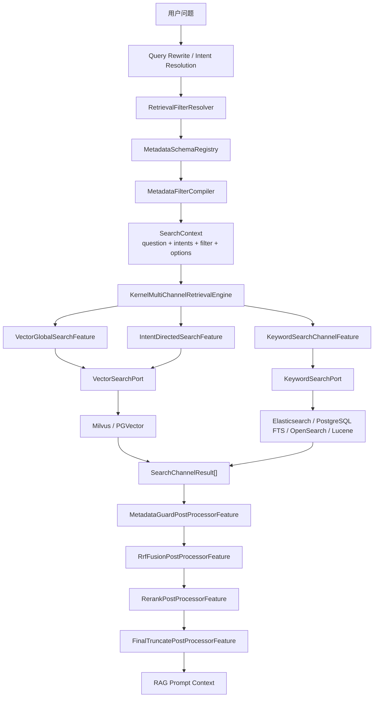
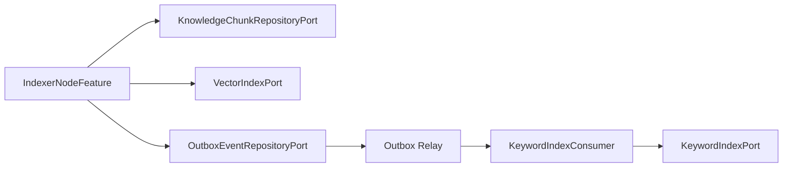

# 混合检索与重排完善设计方案

## 1. 目标与边界

本文基于《[混合检索与重排详细设计.md](./混合检索与重排详细设计.md)》整理，是面向 Seahorse Agent 的可落地混合检索方案。目标是在不破坏现有微内核架构的前提下，补齐以下能力：

- 动态元数据过滤：支持租户、权限等系统字段，也支持业务自定义 metadata 字段；但自定义字段必须经过 Schema 注册、类型校验和后端能力声明。
- 向量检索闭环：补齐 query embedding 生成、过滤条件下推、命中元数据返回。
- BM25 / 关键词检索：默认优先接入 Elasticsearch；PostgreSQL FTS 作为轻量 fallback；OpenSearch、Lucene 作为可插拔的低优先级扩展，按企业环境需要引入。
- RRF 结果融合：用后处理 Feature 将向量、意图定向、关键词通道结果做去重、融合和截断。
- Reranker：复用已有 `RerankModelPort`，在 RRF 后对候选集做二阶段重排。
- 企业级治理：配置、索引、观测、降级、测试和分阶段上线方案完整闭环。

设计边界：

- 不把 Milvus、PGVector、Elasticsearch、OpenSearch 等 SDK 泄漏到 `seahorse-agent-kernel`。
- 不重写 `KernelMultiChannelRetrievalEngine` 主流程，只做必要的稳定编排增强，例如后处理器按 `order` 排序。
- 不允许任意 `Map<String,Object>` 直接透传到后端查询；动态元数据必须先通过 Schema 校验和 Filter Compiler。
- 权限过滤必须有下推和兜底两层保护，不能只依赖搜索引擎侧过滤。

## 2. 当前现状

| 组件 | 当前状态 | 主要缺口 |
| --- | --- | --- |
| `SearchContext` | 已支持 `filter`、`options`、`compiledFilter` | 后续可补充面向管理端的默认策略配置 |
| `RetrievedChunk` | 已补齐 `kbId`、`docId`、`metadata`、通道分、融合分、重排分 | 后续按业务扩展更多可观测字段 |
| `VectorSearchRequest` | 已支持强类型过滤、编译后过滤表达式和 metadata 返回 | 不允许原始动态 metadata Map 绕过 Schema/Filter Compiler |
| `KernelMultiChannelRetrievalEngine` | 并行执行通道，并按 `SearchResultPostProcessorFeature.order()` 顺序执行后处理链 | 后续可增加更细粒度 Trace |
| `SearchChannelFeature` | 已支持向量、意图定向和关键词/BM25 通道 | OpenSearch/Lucene 可按同一端口后续接入 |
| `SearchResultPostProcessorFeature` | 已支持元数据兜底过滤、RRF、Rerank、最终截断 | 后续可继续补充业务重排规则 |
| `RerankModelPort` | 已通过 `RerankPostProcessorFeature` 接入检索后处理链 | 生产启用需配置具体 rerank 模型 |
| `EmbeddingModelPort` | 向量通道已生成 query embedding | 未配置模型时仍按 noop 降级 |
| 向量适配器 | Milvus、PGVector、NoOp 已有；Milvus/PGVector 已支持过滤下推和 metadata 返回 | 动态字段必须先经过 Schema 编译 |
| `SearchChannelType` | 保留 `KEYWORD_ES` 兼容旧语义，新增 `KEYWORD_BM25` 表达后端无关关键词检索 | 新通道应优先使用 `KEYWORD_BM25` |

## 3. 总体架构



核心思想：

- 过滤条件先被解析成领域对象，再通过 Schema 编译成 Filter AST。
- 各检索后端只接收已校验的 AST，不直接接收用户原始字段和值。
- 多路召回结果统一映射为 `RetrievedChunk`。
- 后处理链负责兜底过滤、RRF 融合、Rerank 和最终截断。

## 4. 动态元数据过滤设计

### 4.1 字段分层

动态元数据不是固定领域，但需要分层治理。

| 层级 | 字段来源 | 是否可动态 | 说明 |
| --- | --- | --- | --- |
| 系统治理字段 | 租户、知识库、文档、分块、启用状态、ACL | 否 | 安全边界，系统内置，必须稳定 |
| 文档基础字段 | 文件类型、来源类型、来源地址、更新时间 | 半动态 | Seahorse 内置，但可按业务选择使用 |
| 业务元数据字段 | 部门、地域、产品线、密级、生效日期等 | 是 | 由租户/知识库注册 Schema 后使用 |
| 原始展示元数据 | 解析器或数据源附带的任意 metadata | 是 | 可存储、可展示，但未注册时不可过滤 |

关键约束：

- 可以写入任意 metadata。
- 只有注册为 `filterable=true` 的字段允许参与检索过滤。
- 高频过滤字段必须声明索引策略。
- 未注册字段不能进入 Milvus / PGVector / Elasticsearch / OpenSearch 查询条件。

### 4.2 RetrievalFilter

建议新增位置：`seahorse-agent-kernel/.../kernel/domain/retrieval/RetrievalFilter.java`

```java
@Builder
public record RetrievalFilter(
        SystemRetrievalFilter system,
        List<MetadataCondition> metadataConditions
) {
    public RetrievalFilter {
        system = system == null ? SystemRetrievalFilter.defaults() : system;
        metadataConditions = List.copyOf(
                metadataConditions == null ? List.of() : metadataConditions);
    }
}
```

系统过滤字段：

```java
@Builder
public record SystemRetrievalFilter(
        String tenantId,
        String userId,
        List<String> knowledgeBaseIds,
        List<String> collectionNames,
        List<String> documentIds,
        List<String> aclSubjectIds,
        List<String> fileTypes,
        List<String> sourceTypes,
        Instant createdFrom,
        Instant createdTo,
        Instant updatedFrom,
        Instant updatedTo,
        boolean enabledOnly
) {
    public static SystemRetrievalFilter defaults() {
        return SystemRetrievalFilter.builder().enabledOnly(true).build();
    }
}
```

动态元数据条件：

```java
public record MetadataCondition(
        String fieldKey,
        MetadataOperator operator,
        Object value
) {
}

public enum MetadataOperator {
    EQ, IN, RANGE, CONTAINS, EXISTS
}
```

说明：

- `fieldKey` 是业务字段逻辑名，不是 Milvus JSON path、PG SQL 字段、Elasticsearch 字段或 OpenSearch 字段名。
- `value` 在编译阶段根据 Schema 转换为确定类型。
- 系统字段不放进 `metadataConditions`，避免权限过滤被业务侧覆盖。

### 4.3 Metadata Schema

新增 Schema 描述对象：

```java
public record MetadataFieldDescriptor(
        String fieldKey,
        String displayName,
        MetadataValueType valueType,
        Set<MetadataOperator> allowedOperators,
        boolean filterable,
        boolean sortable,
        boolean facetable,
        boolean indexed,
        MetadataIndexPolicy indexPolicy,
        BackendFieldMapping backendMapping
) {
}

public enum MetadataValueType {
    STRING, NUMBER, BOOLEAN, DATE_TIME, STRING_ARRAY, NUMBER_ARRAY
}

public enum MetadataIndexPolicy {
    NONE, JSON_GIN, EXPRESSION_INDEX, SEARCH_KEYWORD, SEARCH_TEXT, MILVUS_JSON, MILVUS_SCALAR
}
```

后端映射：

```java
public record BackendFieldMapping(
        String canonicalName,
        String milvusPath,
        String pgJsonPath,
        String searchFieldName,
        boolean pushdownToVector,
        boolean pushdownToKeyword,
        boolean guardOnly
) {
}
```

示例 Schema：

```yaml
metadata-schema:
  fields:
    - field-key: department
      display-name: 部门
      value-type: STRING
      allowed-operators: [EQ, IN]
      filterable: true
      indexed: true
      index-policy: SEARCH_KEYWORD
      backend-mapping:
        canonical-name: department
        milvus-path: metadata["department"]
        pg-json-path: metadata->>'department'
        search-field-name: department
        pushdown-to-vector: true
        pushdown-to-keyword: true
    - field-key: effectiveDate
      display-name: 生效日期
      value-type: DATE_TIME
      allowed-operators: [RANGE]
      filterable: true
      indexed: true
      index-policy: EXPRESSION_INDEX
      backend-mapping:
        canonical-name: effective_date
        milvus-path: metadata["effective_date"]
        pg-json-path: metadata->>'effective_date'
        search-field-name: effectiveDate
        pushdown-to-vector: false
        pushdown-to-keyword: true
        guard-only: true
```

### 4.4 Schema Registry

新增端口：

```java
public interface MetadataSchemaRegistryPort {
    MetadataSchema loadSchema(String tenantId, String knowledgeBaseId);
}

public record MetadataSchema(
        String tenantId,
        String knowledgeBaseId,
        List<MetadataFieldDescriptor> fields
) {
    public Optional<MetadataFieldDescriptor> find(String fieldKey) {
        return fields.stream().filter(f -> f.fieldKey().equals(fieldKey)).findFirst();
    }
}
```

落地建议：

- 初期可以用 classpath / YAML / DB 表加载 Schema。
- 企业环境建议持久化到关系库，支持租户级、知识库级 Schema。
- Schema 变更必须有版本号，索引重建任务按版本执行。

参考表结构：

```sql
CREATE TABLE IF NOT EXISTS t_metadata_field_schema (
    id                VARCHAR(32) PRIMARY KEY,
    tenant_id         VARCHAR(64) NOT NULL,
    kb_id             VARCHAR(20),
    field_key         VARCHAR(128) NOT NULL,
    display_name      VARCHAR(128),
    value_type        VARCHAR(32) NOT NULL,
    allowed_ops       JSONB NOT NULL,
    filterable        SMALLINT NOT NULL DEFAULT 0,
    sortable          SMALLINT NOT NULL DEFAULT 0,
    facetable         SMALLINT NOT NULL DEFAULT 0,
    indexed           SMALLINT NOT NULL DEFAULT 0,
    index_policy      VARCHAR(32) NOT NULL DEFAULT 'NONE',
    backend_mapping   JSONB,
    schema_version    INTEGER NOT NULL DEFAULT 1,
    create_time       TIMESTAMP NOT NULL DEFAULT CURRENT_TIMESTAMP,
    update_time       TIMESTAMP NOT NULL DEFAULT CURRENT_TIMESTAMP,
    deleted           SMALLINT NOT NULL DEFAULT 0
);

CREATE UNIQUE INDEX IF NOT EXISTS uk_metadata_schema_field
ON t_metadata_field_schema (tenant_id, kb_id, field_key)
WHERE deleted = 0;

COMMENT ON TABLE t_metadata_field_schema IS '检索元数据字段 Schema 表';
COMMENT ON COLUMN t_metadata_field_schema.id IS '主键 ID';
COMMENT ON COLUMN t_metadata_field_schema.tenant_id IS '租户 ID';
COMMENT ON COLUMN t_metadata_field_schema.kb_id IS '知识库 ID，空值表示租户级通用字段';
COMMENT ON COLUMN t_metadata_field_schema.field_key IS '业务元数据字段逻辑名';
COMMENT ON COLUMN t_metadata_field_schema.display_name IS '字段展示名称';
COMMENT ON COLUMN t_metadata_field_schema.value_type IS '字段值类型：STRING/NUMBER/BOOLEAN/DATE_TIME/STRING_ARRAY/NUMBER_ARRAY';
COMMENT ON COLUMN t_metadata_field_schema.allowed_ops IS '允许的过滤操作符集合 JSON';
COMMENT ON COLUMN t_metadata_field_schema.filterable IS '是否允许作为检索过滤条件';
COMMENT ON COLUMN t_metadata_field_schema.sortable IS '是否允许排序';
COMMENT ON COLUMN t_metadata_field_schema.facetable IS '是否允许聚合筛选';
COMMENT ON COLUMN t_metadata_field_schema.indexed IS '是否已建立或要求建立索引';
COMMENT ON COLUMN t_metadata_field_schema.index_policy IS '索引策略：NONE/JSON_GIN/EXPRESSION_INDEX/SEARCH_KEYWORD/SEARCH_TEXT/MILVUS_JSON/MILVUS_SCALAR';
COMMENT ON COLUMN t_metadata_field_schema.backend_mapping IS '后端字段映射配置 JSON';
COMMENT ON COLUMN t_metadata_field_schema.schema_version IS 'Schema 版本号';
COMMENT ON COLUMN t_metadata_field_schema.create_time IS '创建时间';
COMMENT ON COLUMN t_metadata_field_schema.update_time IS '更新时间';
COMMENT ON COLUMN t_metadata_field_schema.deleted IS '是否删除，0 表示正常，1 表示删除';
```

### 4.5 Filter Compiler

动态过滤不能由适配器直接解析。统一编译流程：

```text
RetrievalFilter
  -> MetadataSchemaRegistry.loadSchema()
  -> MetadataFilterValidator 校验字段、类型、操作符
  -> MetadataFilterCompiler 生成 Filter AST
  -> Adapter Translator 生成后端查询条件
```

接口设计：

```java
public interface MetadataFilterCompiler {
    CompiledMetadataFilter compile(RetrievalFilter filter, MetadataSchema schema);
}

public record CompiledMetadataFilter(
        MetadataFilterExpr expression,
        List<MetadataCondition> guardOnlyConditions,
        List<String> warnings
) {
}
```

Filter AST：

```java
public sealed interface MetadataFilterExpr permits FieldEq, FieldIn, FieldRange, FieldContains, FieldExists, FilterAnd {
}

public record FieldEq(MetadataFieldDescriptor field, Object value) implements MetadataFilterExpr {}
public record FieldIn(MetadataFieldDescriptor field, List<?> values) implements MetadataFilterExpr {}
public record FieldRange(MetadataFieldDescriptor field, Object from, Object to) implements MetadataFilterExpr {}
public record FieldContains(MetadataFieldDescriptor field, Object value) implements MetadataFilterExpr {}
public record FieldExists(MetadataFieldDescriptor field) implements MetadataFilterExpr {}
public record FilterAnd(List<MetadataFilterExpr> children) implements MetadataFilterExpr {}
```

校验规则：

- 字段不存在：拒绝请求或降级为 guard-only，生产建议拒绝。
- 字段 `filterable=false`：拒绝进入检索过滤。
- 操作符不在 `allowedOperators`：拒绝。
- 值类型不匹配：拒绝。
- 条件数量超过阈值：拒绝或截断，默认拒绝。
- `tenantId` 生产环境为空：拒绝。

## 5. SearchContext 与 RetrievedChunk 扩展

### 5.1 SearchContext

在现有 `SearchContext` 追加字段：

```java
private RetrievalFilter filter;

private RetrievalOptions options;

private CompiledMetadataFilter compiledFilter;
```

兼容策略：

- 保留原 `metadata` 字段。
- 已有通道不读取新字段时仍可运行。
- 新通道优先读取 `compiledFilter`，缺失时使用空过滤。

### 5.2 RetrievalOptions

```java
@Builder
public record RetrievalOptions(
        int finalTopK,
        int vectorTopK,
        int keywordTopK,
        int fusionTopK,
        int rerankTopK,
        boolean enableVector,
        boolean enableIntentDirected,
        boolean enableKeyword,
        boolean enableRrf,
        boolean enableRerank,
        String embeddingModel,
        String rerankModel,
        Duration vectorTimeout,
        Duration keywordTimeout,
        Duration rerankTimeout,
        Map<String, Object> channelSettings
) {
}
```

默认值：

| 参数 | 默认值 |
| --- | --- |
| `finalTopK` | 5 |
| `vectorTopK` | `finalTopK * 4` |
| `keywordTopK` | `finalTopK * 4` |
| `fusionTopK` | `finalTopK * 3` |
| `rerankTopK` | `finalTopK` |
| `enableVector` | true |
| `enableIntentDirected` | true |
| `enableKeyword` | false |
| `enableRrf` | true |
| `enableRerank` | false |

### 5.3 RetrievedChunk

建议扩展：

```java
@Builder
public class RetrievedChunk {
    private String id;
    private String text;
    private Float score;

    private String tenantId;
    private String kbId;
    private String docId;
    private String collectionName;
    private Integer chunkIndex;

    @Builder.Default
    private Map<String, Object> metadata = new LinkedHashMap<>();

    @Builder.Default
    private Map<String, Float> channelScores = new LinkedHashMap<>();

    @Builder.Default
    private Map<String, Integer> channelRanks = new LinkedHashMap<>();

    private Float fusionScore;
    private Float rerankScore;
}
```

实现要求：

- `metadata`、`channelScores`、`channelRanks` 必须默认初始化，避免 RRF 后处理 NPE。
- RRF 不直接修改原始 chunk，建议复制出新对象后合并字段。
- `score` 表示当前阶段排序分，`fusionScore` 和 `rerankScore` 用于解释。

## 6. 向量检索设计

### 6.1 Query Embedding

当前向量通道传空 vector 会导致 Milvus/PGVector 返回空结果。需要在向量通道内生成 query embedding。

新增端口或直接复用 `EmbeddingModelPort`：

```java
public interface QueryEmbeddingPort {
    List<Float> embedQuery(String modelId, String query);
}
```

默认实现委托：

```java
public class DefaultQueryEmbeddingAdapter implements QueryEmbeddingPort {
    private final EmbeddingModelPort embeddingModelPort;

    public List<Float> embedQuery(String modelId, String query) {
        return embeddingModelPort.embed(modelId, query);
    }
}
```

通道构造请求：

```java
List<Float> queryVector = queryEmbeddingPort.embedQuery(
        context.getOptions().embeddingModel(),
        context.getMainQuestion());

VectorSearchRequest request = new VectorSearchRequest(
        collectionName,
        context.getMainQuestion(),
        queryVector,
        context.getOptions().vectorTopK(),
        VectorFilterPayload.from(context.getCompiledFilter())
);
```

### 6.2 VectorSearchRequest 迁移

当前 `VectorSearchRequest.filters` 是 `Map<String,Object>`。建议分两步迁移：

P1 兼容：

```java
Map<String, Object> filters
```

但只允许放入 `CompiledMetadataFilter` 或编译后的后端无关 payload，不允许用户原始 Map。

P2 强类型：

```java
public record VectorSearchRequest(
        String collectionName,
        String query,
        List<Float> vector,
        int topK,
        CompiledMetadataFilter filter
) {
}
```

### 6.3 Milvus 过滤翻译

Milvus 适配器新增：

```java
public final class MilvusMetadataFilterTranslator {
    public String translate(CompiledMetadataFilter filter) {
        // 只翻译 field.backendMapping().pushdownToVector() == true 的条件
    }
}
```

示例输出：

```text
metadata["tenant_id"] == "t1"
and metadata["department"] in ["finance","hr"]
and metadata["enabled"] == true
```

安全要求：

- 字段路径来自 Schema，不来自用户输入。
- 字符串值必须转义。
- 列表长度要有限制。
- 不支持的条件进入 `guardOnlyConditions`。

### 6.4 PGVector 过滤翻译

PGVector 适配器新增 `PgVectorFilterSqlBuilder`：

```java
public record SqlFilter(String whereSql, List<Object> args) {
}
```

示例 SQL：

```sql
SELECT id, content, metadata, 1 - (embedding <=> ?::vector) AS score
FROM t_knowledge_vector
WHERE metadata->>'collection_name' = ?
  AND metadata->>'tenant_id' = ?
  AND metadata->>'department' = ANY(?)
ORDER BY embedding <=> ?::vector
LIMIT ?
```

要求：

- 字段路径来自 Schema。
- 值全部参数化。
- 返回 `metadata` 列并映射到 `RetrievedChunk`。

### 6.5 向量命中映射

Milvus / PGVector 返回后统一映射：

```java
RetrievedChunk.builder()
        .id(chunkId)
        .text(content)
        .score(score)
        .tenantId(string(metadata, "tenant_id"))
        .kbId(string(metadata, "kb_id"))
        .docId(string(metadata, "doc_id"))
        .collectionName(string(metadata, "collection_name"))
        .chunkIndex(integer(metadata, "chunk_index"))
        .metadata(metadata)
        .build();
```

## 7. BM25 / 关键词检索设计

### 7.1 端口

```java
public interface KeywordSearchPort {
    List<RetrievedChunk> search(KeywordSearchRequest request);
}

public record KeywordSearchRequest(
        String query,
        int topK,
        RetrievalFilter filter,
        CompiledMetadataFilter compiledFilter,
        KeywordSearchOptions options
) {
}

public record KeywordSearchOptions(
        String indexName,
        Map<String, Float> fieldBoosts,
        String analyzer,
        String minimumShouldMatch
) {
}
```

### 7.2 KeywordSearchChannelFeature

```java
public class KeywordSearchChannelFeature implements SearchChannelFeature {
    private final KeywordSearchPort keywordSearchPort;

    @Override
    public SearchChannelType channelType() {
        return SearchChannelType.KEYWORD_BM25;
    }

    @Override
    public boolean enabled(SearchContext context) {
        return context.getOptions() != null && context.getOptions().enableKeyword();
    }

    @Override
    public SearchChannelResult search(SearchContext context) {
        KeywordSearchRequest request = new KeywordSearchRequest(
                context.getMainQuestion(),
                context.getOptions().keywordTopK(),
                context.getFilter(),
                context.getCompiledFilter(),
                keywordOptions(context)
        );
        List<RetrievedChunk> chunks = keywordSearchPort.search(request);
        return SearchChannelResult.builder()
                .channelType(channelType())
                .channelName(name())
                .chunks(chunks)
                .metadata(Map.of("topK", request.topK()))
                .build();
    }
}
```

### 7.3 适配器优先级

关键词检索坚持可插拔，但默认技术栈不额外引入非必要中间件。

| 优先级 | 适配器 | 模块建议 | 适用场景 |
| --- | --- | --- | --- |
| P0 | Elasticsearch | `seahorse-agent-adapter-search-elasticsearch` | 企业生产默认方案，提供成熟 BM25、中文分词、字段权重、过滤和高亮 |
| P0 | PostgreSQL FTS | `seahorse-agent-adapter-search-postgres` | 本地开发、小规模部署、减少中间件依赖；排序使用 `ts_rank_cd`，不是严格 BM25 |
| P1 | OpenSearch | `seahorse-agent-adapter-search-opensearch` | 企业已有 OpenSearch 基础设施时按需接入 |
| P2 | Lucene Embedded | `seahorse-agent-adapter-search-lucene` | 单机轻量方案，适合测试或私有化极简部署 |

生产建议：

- 默认优先 Elasticsearch + PostgreSQL。Elasticsearch 承载 BM25 主链路，PostgreSQL 负责元数据 Schema、关系数据和轻量全文检索 fallback。
- OpenSearch 不作为默认依赖，只作为 `KeywordSearchPort` 的可插拔实现之一。
- 没有 Elasticsearch 集群的环境可以先启用 PostgreSQL FTS，后续通过配置切换到 Elasticsearch 或 OpenSearch。

### 7.4 Elasticsearch Mapping

系统字段固定 mapping，动态字段由 Schema 控制。

```json
{
  "mappings": {
    "dynamic": "strict",
    "properties": {
      "chunkId": { "type": "keyword" },
      "tenantId": { "type": "keyword" },
      "kbId": { "type": "keyword" },
      "docId": { "type": "keyword" },
      "collectionName": { "type": "keyword" },
      "enabled": { "type": "boolean" },
      "aclSubjects": { "type": "keyword" },
      "fileType": { "type": "keyword" },
      "sourceType": { "type": "keyword" },
      "updatedAt": { "type": "date" },
      "content": {
        "type": "text",
        "analyzer": "ik_max_word",
        "search_analyzer": "ik_smart"
      },
      "title": {
        "type": "text",
        "analyzer": "ik_max_word"
      },
      "summary": { "type": "text", "analyzer": "ik_smart" },
      "metadata": {
        "properties": {
          "department": { "type": "keyword" },
          "effectiveDate": { "type": "date" },
          "securityLevel": { "type": "keyword" }
        }
      }
    }
  }
}
```

说明：

- `dynamic: strict` 防止 mapping 膨胀。
- Schema 中 `indexed=true` 的动态字段才进入 mapping。
- Schema 变更需要触发索引模板更新和重建任务。

### 7.5 查询结构

```json
{
  "size": 20,
  "query": {
    "bool": {
      "must": [
        {
          "multi_match": {
            "query": "报销制度",
            "fields": ["title^3", "summary^2", "content"],
            "type": "best_fields"
          }
        }
      ],
      "filter": [
        { "term": { "tenantId": "t1" } },
        { "terms": { "kbId": ["kb1", "kb2"] } },
        { "term": { "enabled": true } },
        { "terms": { "aclSubjects": ["user:u1", "role:finance"] } },
        { "term": { "metadata.department": "finance" } }
      ]
    }
  }
}
```

### 7.6 关键词索引同步

新增端口：

```java
public interface KeywordIndexPort {
    void upsertChunks(List<KeywordDocument> documents);
    void deleteByDocument(String tenantId, String docId);
    void deleteByChunkIds(String tenantId, List<String> chunkIds);
}
```

推荐生产链路：



同步策略：

- 本地开发可同步写入 PostgreSQL FTS。
- 生产默认使用 Outbox 异步写 Elasticsearch，避免搜索引擎抖动影响入库。
- 企业已有 OpenSearch 时，可通过替换 `KeywordIndexPort` / `KeywordSearchPort` 适配器切换。
- 删除文档或 chunk 时必须产生删除索引事件。
- 提供按知识库、文档、chunkIds 的重建任务。

## 8. RRF 融合设计

### 8.1 算法

```text
rrfScore(chunk) = Σ weight(channel) * 1 / (k + rank(chunk, channel))
```

默认参数：

- `k = 60`
- `IntentDirectedSearch = 1.2`
- `VectorGlobalSearch = 1.0`
- `KeywordSearch = 1.0`
- 输出 `fusionTopK`

### 8.2 实现要点

新增 `RrfFusionPostProcessorFeature`：

```java
public class RrfFusionPostProcessorFeature implements SearchResultPostProcessorFeature {
    @Override
    public int order() {
        return 100;
    }

    @Override
    public boolean enabled(SearchContext context) {
        return context.getOptions() != null && context.getOptions().enableRrf();
    }

    @Override
    public List<RetrievedChunk> process(
            List<RetrievedChunk> chunks,
            List<SearchChannelResult> results,
            SearchContext context) {
        Map<String, RetrievedChunk> merged = new LinkedHashMap<>();
        Map<String, Float> scores = new HashMap<>();

        for (SearchChannelResult result : safeResults(results)) {
            List<RetrievedChunk> channelChunks = safeChunks(result);
            float weight = channelWeight(result.getChannelName(), result.getChannelType());
            for (int index = 0; index < channelChunks.size(); index++) {
                RetrievedChunk source = channelChunks.get(index);
                String key = dedupeKey(source);
                RetrievedChunk target = merged.computeIfAbsent(key, ignored -> copyChunk(source));
                int rank = index + 1;
                float score = weight / (k + rank);
                scores.merge(key, score, Float::sum);
                target.getChannelRanks().put(result.getChannelName(), rank);
                target.getChannelScores().put(result.getChannelName(),
                        source.getScore() == null ? 0F : source.getScore());
            }
        }

        return merged.entrySet().stream()
                .peek(entry -> entry.getValue().setFusionScore(scores.get(entry.getKey())))
                .map(Map.Entry::getValue)
                .sorted(Comparator.comparing(RetrievedChunk::getFusionScore,
                        Comparator.nullsLast(Comparator.reverseOrder())))
                .limit(context.getOptions().fusionTopK())
                .toList();
    }
}
```

修正点：

- 不修改原始通道返回对象，使用 `copyChunk`。
- `channelScores`、`channelRanks` 必须初始化。
- `dedupeKey` 使用 `id -> docId:chunkIndex -> sha256(text)`。
- RRF 后 `score` 可同步设置为 `fusionScore`，但保留 `fusionScore` 便于解释。

## 9. Reranker 设计

### 9.1 接入点

当前 `RerankModelPort` 已存在，`OpenAiCompatibleModelAdapter` 已实现 `/rerank`。新增后处理器：

```java
public class RerankPostProcessorFeature implements SearchResultPostProcessorFeature {
    private final RerankModelPort rerankModelPort;

    @Override
    public int order() {
        return 200;
    }

    @Override
    public boolean enabled(SearchContext context) {
        RetrievalOptions options = context.getOptions();
        return options != null
                && options.enableRerank()
                && options.rerankModel() != null
                && !options.rerankModel().isBlank();
    }

    @Override
    public List<RetrievedChunk> process(
            List<RetrievedChunk> chunks,
            List<SearchChannelResult> results,
            SearchContext context) {
        RetrievalOptions options = context.getOptions();
        List<RetrievedChunk> candidates = chunks.stream()
                .limit(options.fusionTopK())
                .map(this::truncateForRerank)
                .toList();
        try {
            List<RetrievedChunk> reranked = rerankModelPort.rerank(
                    options.rerankModel(),
                    context.getMainQuestion(),
                    candidates);
            return normalizeRerankScores(reranked).stream()
                    .limit(options.rerankTopK())
                    .toList();
        } catch (RuntimeException ex) {
            return chunks.stream().limit(options.rerankTopK()).toList();
        }
    }
}
```

### 9.2 分数语义

当前 OpenAI 兼容适配器会把 rerank 分数写入 `RetrievedChunk.score`。后处理器应做一次规范化：

```java
private List<RetrievedChunk> normalizeRerankScores(List<RetrievedChunk> chunks) {
    return chunks.stream()
            .map(chunk -> {
                RetrievedChunk copy = copyChunk(chunk);
                copy.setRerankScore(chunk.getScore());
                copy.setScore(chunk.getScore());
                return copy;
            })
            .toList();
}
```

降级策略：

- 未配置 model：跳过。
- 调用异常：返回 RRF 结果。
- 返回空：返回 RRF 结果。
- 超时：由端口包装器或模型适配器超时控制，后处理器只负责降级。

## 10. 后处理器顺序与内核微改

需要对 `SearchResultPostProcessorFeature` 补充默认顺序：

```java
default int order() {
    return 0;
}
```

`KernelMultiChannelRetrievalEngine.executePostProcessors()` 改为按 `order` 排序：

```java
List<SearchResultPostProcessorFeature> processors = extensionRegistry
        .getActivatedExtensions(SearchResultPostProcessorFeature.class, activationContext)
        .stream()
        .filter(processor -> processor.enabled(context))
        .sorted(Comparator.comparingInt(SearchResultPostProcessorFeature::order))
        .toList();
```

顺序：

| Feature | order | 作用 |
| --- | --- | --- |
| `MetadataGuardPostProcessorFeature` | 50 | 权限和元数据兜底过滤 |
| `RrfFusionPostProcessorFeature` | 100 | 多通道融合 |
| `RerankPostProcessorFeature` | 200 | 模型重排 |
| `FinalTruncatePostProcessorFeature` | 1000 | 最终 topK 截断 |

这属于稳定编排增强，不改变引擎“通道 -> 合并 -> 后处理”的主流程语义。

## 11. MetadataGuardPostProcessor

下推过滤不是绝对可靠，必须有兜底过滤。

```java
public class MetadataGuardPostProcessorFeature implements SearchResultPostProcessorFeature {
    @Override
    public int order() {
        return 50;
    }

    @Override
    public boolean enabled(SearchContext context) {
        return context.getFilter() != null || context.getCompiledFilter() != null;
    }

    @Override
    public List<RetrievedChunk> process(
            List<RetrievedChunk> chunks,
            List<SearchChannelResult> results,
            SearchContext context) {
        return chunks.stream()
                .filter(chunk -> passesSystemFilter(chunk, context.getFilter().system()))
                .filter(chunk -> passesGuardOnlyConditions(chunk, context.getCompiledFilter()))
                .toList();
    }
}
```

注意：

- Guard 可以防越权，但不能弥补召回不完整。
- 如果某个动态字段无法下推，只能在已召回候选里过滤，可能导致结果偏少。
- 对必须完整过滤的字段，应要求 `pushdownToVector` 或 `pushdownToKeyword` 至少一个为 true。

## 12. 运行时装配与配置

### 12.1 自动装配

在 `SeahorseAgentKernelAutoConfiguration` 中新增：

| Bean | 条件 |
| --- | --- |
| `KeywordSearchChannelFeature` | `KeywordSearchPort` 存在 |
| `MetadataGuardPostProcessorFeature` | 默认创建 |
| `RrfFusionPostProcessorFeature` | 默认创建，Feature 开关控制 |
| `RerankPostProcessorFeature` | `RerankModelPort` 存在 |
| `FinalTruncatePostProcessorFeature` | 默认创建 |
| `MetadataSchemaRegistryPort` | 未提供时使用 noop 或 classpath 默认实现 |

在新增搜索适配器模块中装配：

- `seahorse-agent-adapter-search-elasticsearch`
- `seahorse-agent-adapter-search-postgres`
- `seahorse-agent-adapter-search-opensearch`
- `seahorse-agent-adapter-search-lucene`

默认推荐启用 `elasticsearch` 或 `postgres`；`opensearch` 和 `lucene` 作为低优先级可插拔实现，只有在企业环境已有对应基础设施或明确需要时引入。

### 12.2 配置示例

```yaml
seahorse-agent:
  retrieval:
    final-top-k: 5
    vector-top-k: 20
    keyword-top-k: 20
    fusion-top-k: 20
    rerank-top-k: 5
    vector:
      enabled: true
      embedding-model: ${AI_EMBEDDING_MODEL}
      filter-pushdown: true
    keyword:
      enabled: true
      type: elasticsearch
      index-name: seahorse-knowledge-chunk
      analyzer: ik_smart
    rrf:
      enabled: true
      k: 60
      channel-weights:
        IntentDirectedSearch: 1.2
        VectorGlobalSearch: 1.0
        KeywordSearch: 1.0
    rerank:
      enabled: false
      model: ${AI_RERANK_MODEL:}
      input-top-k: 20
      output-top-k: 5
      timeout: 3s
      fallback-on-error: true
    metadata:
      schema-source: jdbc
      reject-unknown-filter-field: true
      max-condition-count: 20
      require-tenant-filter: true
```

也可以先复用现有：

```yaml
seahorse-agent:
  plugins:
    enabled-features:
      KeywordSearch: true
      RrfFusion: true
      Rerank: false
    feature-settings:
      RrfFusion:
        k: 60
        fusionTopK: 20
```

建议中长期新增 `SeahorseAgentRetrievalProperties`，避免检索配置散落到 `feature-settings`。

## 13. 表结构与索引治理

### 13.1 关系库

```sql
ALTER TABLE t_knowledge_document
ADD COLUMN IF NOT EXISTS tenant_id VARCHAR(64),
ADD COLUMN IF NOT EXISTS tags JSONB,
ADD COLUMN IF NOT EXISTS metadata_json JSONB;

ALTER TABLE t_knowledge_chunk
ADD COLUMN IF NOT EXISTS metadata_json JSONB,
ADD COLUMN IF NOT EXISTS search_text TSVECTOR;

CREATE INDEX IF NOT EXISTS idx_doc_tenant ON t_knowledge_document (tenant_id);
CREATE INDEX IF NOT EXISTS idx_doc_tags_gin ON t_knowledge_document USING GIN (tags);
CREATE INDEX IF NOT EXISTS idx_chunk_metadata_gin ON t_knowledge_chunk USING GIN (metadata_json);
CREATE INDEX IF NOT EXISTS idx_chunk_search_text ON t_knowledge_chunk USING GIN (search_text);

COMMENT ON COLUMN t_knowledge_document.tenant_id IS '租户 ID，用于知识库文档多租户隔离';
COMMENT ON COLUMN t_knowledge_document.tags IS '文档标签 JSON 数组，用于业务筛选和展示';
COMMENT ON COLUMN t_knowledge_document.metadata_json IS '文档业务元数据 JSON，由 Metadata Schema 管理可过滤字段';
COMMENT ON COLUMN t_knowledge_chunk.metadata_json IS '分块业务元数据 JSON，由 Metadata Schema 管理可过滤字段';
COMMENT ON COLUMN t_knowledge_chunk.search_text IS 'PostgreSQL 全文检索向量，用于轻量关键词检索 fallback';
```

### 13.2 PGVector

系统字段建议建表达式索引：

```sql
CREATE INDEX IF NOT EXISTS idx_kv_tenant_id
ON t_knowledge_vector ((metadata->>'tenant_id'));

CREATE INDEX IF NOT EXISTS idx_kv_kb_id
ON t_knowledge_vector ((metadata->>'kb_id'));

CREATE INDEX IF NOT EXISTS idx_kv_doc_id
ON t_knowledge_vector ((metadata->>'doc_id'));

CREATE INDEX IF NOT EXISTS idx_kv_enabled
ON t_knowledge_vector ((metadata->>'enabled'));
```

动态字段索引由 Schema 驱动生成。例如 `department`：

```sql
CREATE INDEX IF NOT EXISTS idx_kv_meta_department
ON t_knowledge_vector ((metadata->>'department'));
```

所有新增列必须同步补充 `COMMENT ON COLUMN`，所有新增表必须补充 `COMMENT ON TABLE`。表达式索引和 GIN/HNSW 索引不要求字段注释，但索引命名应体现表、字段和用途。

### 13.3 Milvus

初期：

- 保持 `metadata` JSON 字段。
- 使用 JSON filter 支持低中频动态字段过滤。

高频字段：

- `tenant_id`
- `kb_id`
- `doc_id`
- `enabled`
- 企业高频动态字段，如 `department`、`security_level`

建议从 JSON 拆成标量字段，Schema 中将 `indexPolicy` 标注为 `MILVUS_SCALAR`。

### 13.4 Elasticsearch

- 系统字段固定 mapping。
- 动态字段通过 Schema 更新 index template。
- Schema 变更需要触发 reindex 或新索引别名切换。
- OpenSearch 使用同一套 `KeywordSearchPort` / `KeywordIndexPort` 契约作为可插拔实现，默认不作为主推荐链路。

## 14. 观测与 Trace

RAG Trace 节点：

| 节点 | 记录内容 |
| --- | --- |
| `retrieval.filter.resolve` | system filter 摘要、metadata 条件数 |
| `retrieval.metadata.schema` | schema version、unknown fields、guard-only fields |
| `retrieval.vector` | adapter、collection、topK、filterPushdown、hitCount、latency |
| `retrieval.keyword` | adapter、index、topK、hitCount、latency；默认 adapter 为 Elasticsearch 或 PostgreSQL |
| `retrieval.metadata.guard` | inputCount、outputCount、filteredCount |
| `retrieval.rrf` | channels、candidateCount、fusionTopK、k、weights |
| `retrieval.rerank` | model、inputTopK、outputTopK、latency、fallback |
| `retrieval.final` | finalTopK、chunkIds |

指标：

| 指标 | 标签 |
| --- | --- |
| `rag_metadata_schema_compile_latency` | tenant、kb、success |
| `rag_vector_search_latency` | adapter、collection、filtered、success |
| `rag_keyword_search_latency` | adapter、index、success |
| `rag_rrf_latency` | channelCount、candidateCount |
| `rag_rerank_latency` | model、inputTopK、success |
| `rag_retrieval_guard_filtered_total` | tenant、reason |
| `rag_retrieval_empty_total` | stage、tenant、reason |

## 15. 测试与验收

### 15.1 单元测试

| 对象 | 用例 |
| --- | --- |
| `MetadataSchemaRegistryPort` | 租户级、知识库级 Schema 加载 |
| `MetadataFilterCompiler` | 未知字段、类型错误、操作符不允许、guard-only |
| `MilvusMetadataFilterTranslator` | 字段路径、字符串转义、in/range |
| `PgVectorFilterSqlBuilder` | 参数绑定、组合条件、空条件 |
| `KeywordSearchChannelFeature` | 开关、topK、异常降级 |
| `MetadataGuardPostProcessorFeature` | 系统字段、动态字段、ACL 过滤 |
| `RrfFusionPostProcessorFeature` | 去重、权重、排名、空通道、NPE 防护 |
| `RerankPostProcessorFeature` | 未配置跳过、失败降级、分数规范化 |

### 15.2 集成测试

| 场景 | 验收标准 |
| --- | --- |
| 向量 + 系统字段过滤 | 只返回指定 tenant/kb/doc 范围 chunk |
| 向量 + 动态字段过滤 | 注册字段可下推，未注册字段被拒绝 |
| BM25 检索 | 关键词精确命中文档进入候选 |
| 向量 + BM25 + RRF | 多通道命中 chunk 排名提升 |
| Rerank | rerank 开启后最终顺序按模型结果变化 |
| 兜底过滤 | 适配器未下推字段时能剔除不符合条件候选 |
| 降级 | BM25 或 rerank 异常时仍返回向量/RRF 结果 |

### 15.3 质量评估

评测集字段：

- question
- expectedAnswer
- expectedKbIds
- expectedDocIds
- expectedChunkIds
- tenantId
- aclSubjects
- metadataConditions

指标：

- Recall@K
- MRR
- nDCG@K
- 空召回率
- 平均检索耗时
- P95 检索耗时
- Rerank 平均耗时

## 16. 分阶段落地计划

### P1：过滤治理与向量闭环

目标：向量检索真正可用，且动态元数据过滤受 Schema 管控。

任务：

1. 新增 `RetrievalFilter`、`SystemRetrievalFilter`、`MetadataCondition`、`RetrievalOptions`。
2. 新增 `MetadataFieldDescriptor`、`MetadataSchema`、`MetadataSchemaRegistryPort`。
3. 新增 `MetadataFilterCompiler` 和 Filter AST。
4. 扩展 `SearchContext`、`RetrievedChunk`。
5. 向量通道生成 query embedding。
6. Milvus / PGVector 支持过滤下推和 metadata 返回。
7. 新增 `MetadataGuardPostProcessorFeature`。
8. 增加后处理器 `order` 排序。

验收：

- 空 vector 问题消失。
- 注册动态字段可过滤，未注册字段被拒绝。
- 权限字段有下推和兜底。
- 未开启关键词和 rerank 时，不影响现有聊天链路。

### P2：BM25 / 关键词通道

目标：新增关键词召回能力。

任务：

1. 新增 `KeywordSearchPort`、`KeywordIndexPort`。
2. 新增 `KeywordSearchChannelFeature`。
3. 新增 Elasticsearch 适配器作为生产默认关键词检索实现。
4. 新增 PostgreSQL FTS 适配器作为本地开发、小规模部署和低中间件依赖 fallback。
5. OpenSearch 和 Lucene 作为低优先级可插拔适配器，按需要引入。
6. 关键词索引通过 Outbox 异步同步。
7. 支持 Schema 驱动动态字段 mapping。

验收：

- 精确关键词问题可以通过 BM25 命中。
- Elasticsearch 不可用时，可降级到 PostgreSQL FTS 或仅返回向量检索结果。
- 索引重建任务可按知识库/文档执行。

当前实现状态：

- 已提供 `KeywordSearchPort`、`KeywordIndexPort`、`KeywordSearchChannelFeature`，Spring Boot Starter 会在 Elasticsearch 适配器可用且显式选择时优先注册 Elasticsearch，否则使用 JDBC PostgreSQL FTS fallback。
- `JdbcKeywordSearchAdapter` 已基于 `websearch_to_tsquery('simple', ?)`、`ts_rank_cd` 和 `t_knowledge_chunk.search_text` 执行轻量全文检索；`search_text` 列不存在时会回退到 `content` 动态生成 tsvector。
- `JdbcKeywordSearchAdapter` 在 `t_knowledge_chunk.metadata_json` 存在时会下推租户、知识库、文档、集合、文件类型、来源、ACL 等系统过滤，并只消费 `MetadataFilterCompiler` 生成的 AST 来下推动态 metadata 条件；未执行治理 DDL 的旧环境继续依赖 `MetadataGuardPostProcessorFeature` 兜底。
- JDBC 关键词 fallback 的动态 metadata 范围过滤已按 Schema 类型生成 PostgreSQL 表达式，其中 `NUMBER` 使用类型化比较，并与 `JdbcMetadataSchemaIndexAdapter` 的 Schema 驱动表达式索引保持一致。
- `ElasticsearchKeywordSearchAdapter` 已按配置字段生成 BM25 `multi_match` 和 highlight 请求，并将 ES 返回的高亮片段写入 `RetrievedChunk.metadata.keywordHighlights`，供 API 透传和管理端展示。

### P3：RRF 融合

目标：解决多通道分数不可比问题。

任务：

1. 新增 `RrfFusionPostProcessorFeature`。
2. 支持通道权重配置。
3. 支持融合解释字段。
4. 增加 Trace 和指标。

验收：

- 多通道命中的 chunk 排名提升。
- 单通道可正常输出。
- 空通道、重复 chunk 不报错。

当前实现状态：

- `RrfFusionPostProcessorFeature` 已按 `SearchResultPostProcessorFeature.order()` 接入后处理链，支持 `rrfK`、`rrf.k` 和 `channelWeights` 配置。
- `RetrievedChunk.fusionExplanation` 已记录 RRF 策略、`rrfK`、融合分、通道排名、原始通道分、通道权重和通道贡献，解释信息不写入业务 `metadata`。
- `retrieval.rrf` 事件已补齐 `fusionTopK`、`rrfK` 和权重摘要；RRF 对空通道、空结果和适配器返回的 `null` chunk 做了防护。

### P4：Reranker

目标：提升最终 topK 质量。

任务：

1. 新增 `RerankPostProcessorFeature`。
2. 配置 rerank model。
3. 限制 inputTopK、文本长度、超时。
4. 增加 fallback。

验收：

- rerank 开启后最终排序变化可解释。
- rerank 异常时返回 RRF 结果。
- P95 耗时满足 SLA。

当前实现状态：

- `RerankPostProcessorFeature` 已复用 `RerankModelPort` 接入后处理链，默认未配置模型时跳过，异常、超时、空结果和无法匹配结果时回退原候选。
- Rerank 输入默认使用 `fusionTopK`，也支持 `channelSettings.rerankInputTopK` / `rerank.inputTopK` 覆盖；输出按 `rerankTopK` 截断。
- Rerank 输入文本已通过 `rerankMaxTextChars` / `rerank.maxTextChars` 限制，模型侧使用裁剪副本，最终结果仍合并回原始 chunk 文本和 RRF 融合解释。
- `retrieval.rerank` 事件已记录 model、inputTopK、outputTopK、耗时、超时、fallback 和异常类型。

### P5：检索质量平台化

目标：支持长期调优。

任务：

1. 建立评测集。
2. 增加 Recall@K、MRR、nDCG。
3. 支持策略 A/B。
4. 支持不同知识库检索策略模板。

当前实现状态：

- 已提供临时评测集入口，支持 Recall@K、MRR、nDCG@K、空召回率、平均延迟和 P95 延迟。
- 已支持多策略 A/B 对比，输出相对 baseline 的召回、排序质量、空召回率、平均延迟和 P95 延迟差值。
- 已提供默认检索策略模板，并支持通过 `RetrievalStrategyTemplateRepositoryPort` 合并知识库级覆盖；JDBC 适配器已提供 `t_retrieval_strategy_template` 持久化表、完整 COMMENT 和 Spring Boot 自动装配。
- 管理端 Web API 已支持新增、更新和软删除知识库级检索策略模板覆盖，写入内容限定为强类型 `RetrievalOptions` 模板，不承载动态 metadata 过滤条件。

## 17. 风险与处理

| 风险 | 影响 | 处理 |
| --- | --- | --- |
| 动态字段无限增长 | Elasticsearch/OpenSearch mapping 膨胀、查询慢 | Schema 注册、字段数量上限、索引策略审批 |
| 未注册字段参与过滤 | 安全和性能不可控 | Filter Compiler 默认拒绝 |
| 只靠 Guard 过滤 | 召回不完整 | 关键过滤字段必须支持下推 |
| Milvus JSON filter 性能不足 | 向量检索慢 | 高频字段拆标量列 |
| PGVector JSONB 动态过滤慢 | 查询慢 | 表达式索引、限制条件数 |
| BM25 索引最终一致 | 短时间查不到新文档 | Outbox 状态、重试、重建任务 |
| RRF 候选过多 | Rerank 成本高 | fusionTopK 限制 |
| Rerank 不稳定 | 延迟或失败 | 超时、熔断、fallback |

## 18. 最终推荐

推荐按以下顺序落地：

1. 先做动态元数据治理和向量闭环，尤其是 Schema Registry、Filter Compiler、query embedding、适配器过滤下推和 metadata 返回。
2. 再接 BM25 / 关键词通道，生产优先 Elasticsearch，轻量环境优先 PostgreSQL FTS；OpenSearch 和 Lucene 仅作为按需引入的可插拔适配器。
3. 然后做 RRF 融合，以 `SearchResultPostProcessorFeature` 插件接入，不改多通道检索主流程。
4. 最后接 Reranker，默认关闭，按知识库或租户逐步开启。

这条路线能保持 Seahorse Agent 的微内核和可插拔架构稳定，同时把混合检索拆成可测试、可回退、可分阶段上线的工程单元。
