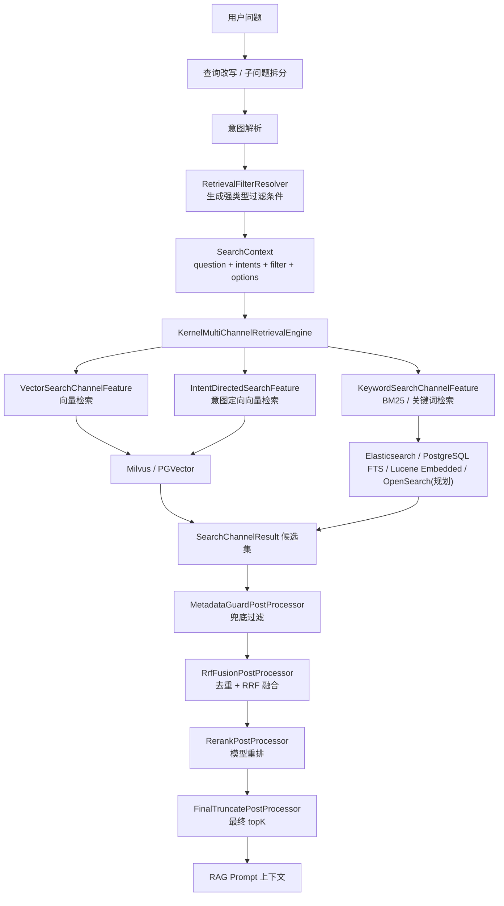
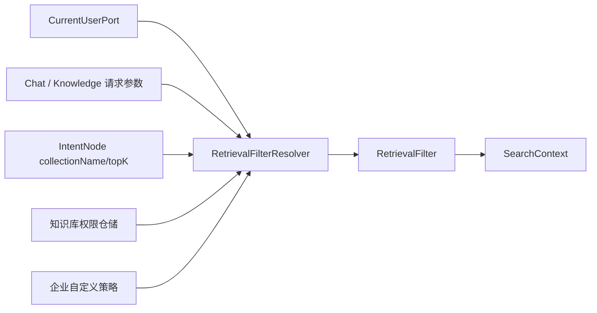
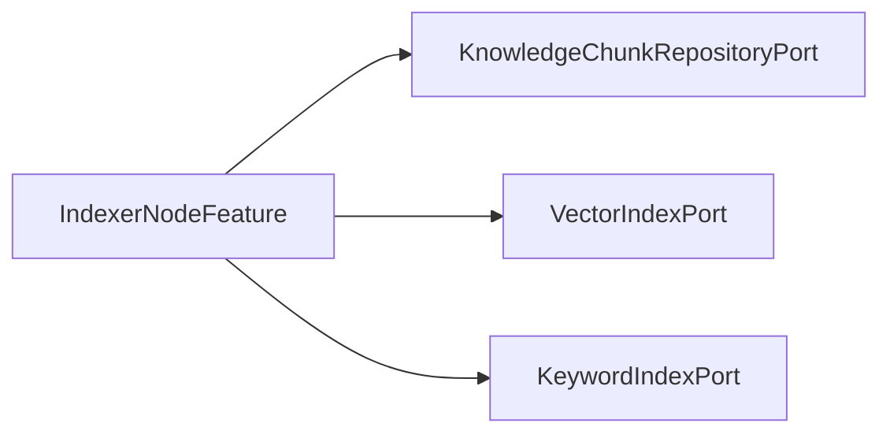
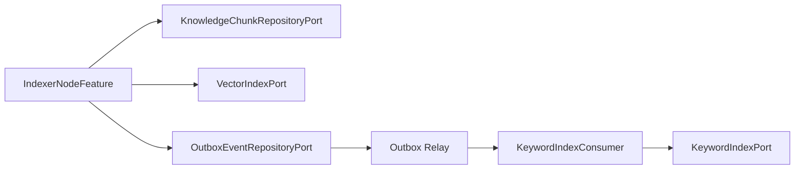
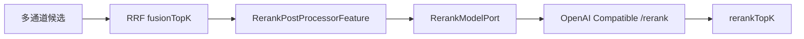

# 混合检索与重排详细设计

## 1. 设计目标

本文档是《[企业级可插拔RAG架构设计.md](./企业级可插拔RAG架构设计.md)》中“混合检索规划/扩展方向”的专项落地设计，聚焦以下能力：

- 元数据过滤：按租户、知识库、文档、文件类型、来源、时间、权限标签等条件过滤召回范围。
- 向量检索：保留现有 Milvus / PGVector 可插拔适配器，并补齐查询向量生成、过滤条件下推和命中元数据返回。
- BM25 / 关键词检索：新增关键词检索端口和检索通道，已覆盖 Elasticsearch、Lucene Embedded 和 PostgreSQL FTS；OpenSearch 保留为后续按同一端口契约接入的可插拔实现。
- RRF 结果融合：新增检索后处理 Feature，把向量通道、意图定向通道、关键词通道的候选结果进行去重、排名融合和截断。
- Reranker：复用现有 `RerankModelPort` 与 OpenAI 兼容 `/rerank` 能力，新增后处理 Feature 做模型重排。

设计原则：

- 不破坏现有微内核和端口适配器边界。
- 新能力优先以 `SearchChannelFeature` 和 `SearchResultPostProcessorFeature` 插件落地。
- 过滤、融合、重排必须可观测、可配置、可回退。
- 不能把未实现能力写成现状；本文保留原始设计推导，当前实现状态以“2.3 当前实现状态”与各阶段“当前实现状态”段落为准。

## 2. 当前现状与缺口

### 2.1 已具备基础

| 能力 | 当前状态 |
| --- | --- |
| 多路检索编排 | `KernelMultiChannelRetrievalEngine` 已支持并行执行多个 `SearchChannelFeature`，并按顺序执行 `SearchResultPostProcessorFeature` |
| 检索通道扩展 | 已有 `IntentDirectedSearchFeature`、`VectorGlobalSearchFeature` |
| 检索后处理扩展 | 已有 `SearchResultPostProcessorFeature` 接口 |
| 向量端口 | 已有 `VectorSearchPort`、`VectorIndexPort`、`VectorCollectionAdminPort` |
| 向量适配器 | 已有 Milvus、PGVector、NoOp |
| 过滤参数位置 | `VectorSearchRequest` 已有 `Map<String, Object> filters` |
| Rerank 端口 | 已有 `RerankModelPort` |
| Rerank 适配器 | `OpenAiCompatibleModelAdapter` 已实现 `/rerank` 调用 |
| 检索通道类型 | `SearchChannelType` 已包含 `KEYWORD_ES`、`HYBRID` |
| 元数据存储 | `VectorChunk.metadata` 已写入 Milvus JSON 字段和 PGVector `metadata JSONB` |

### 2.2 需要补齐的缺口

| 缺口 | 影响 | 设计处理 |
| --- | --- | --- |
| `SearchContext` 只有通用 `metadata`，没有强类型检索过滤 | 权限过滤、文档范围过滤、时间过滤难以稳定传递 | 新增 `RetrievalFilter` 和 `RetrievalOptions` |
| `VectorSearchRequest.filters` 当前未被 Milvus/PGVector 消费 | 向量检索无法真正下推过滤条件 | 新增过滤表达式模型和适配器翻译器 |
| `RetrievedChunk` 只有 `id/text/score` | RRF 无法保存通道分、排名、docId、kbId、metadata 等解释信息 | 扩展 `RetrievedChunk` 字段或新增 `RetrievedChunkMetadata` |
| 向量通道传入空 vector | Milvus/PGVector 会直接返回空结果 | 检索通道必须通过 `EmbeddingModelPort` 生成查询向量 |
| 没有关键词检索端口 | BM25 与关键词通道无法插件化 | 新增 `KeywordSearchPort` 和 `KeywordSearchChannelFeature` |
| 没有融合后处理器 | 多通道结果只是简单拼接 | 新增 `RrfFusionPostProcessorFeature` |
| Rerank 端口未进入检索链路 | 候选集无法二阶段排序 | 新增 `RerankPostProcessorFeature` |

### 2.3 当前实现状态（2026-05-16）

- 已落地 `RetrievalFilter`、`RetrievalOptions`、Filter AST、`MetadataFilterCompiler`、`MetadataGuardPostProcessorFeature`，动态 metadata 进入检索过滤前必须经过 Schema 校验和 Filter Compiler。
- 向量通道已补齐 query embedding、Milvus/PGVector 过滤下推和 metadata 返回；未配置 embedding 模型时仍按 noop 降级。
- 已落地 `KeywordSearchPort`、`KeywordIndexPort`、`KeywordSearchChannelFeature`，关键词后端已覆盖 Elasticsearch、PostgreSQL FTS 和 Lucene Embedded。
- Elasticsearch 是生产默认关键词/BM25 后端；PostgreSQL FTS 是轻量 fallback；Lucene Embedded 通过 `seahorse-agent.adapters.keyword-search.type=lucene` 与 `seahorse-agent.adapters.keyword-index.type=lucene` 显式启用；OpenSearch 仅保留后续规划。
- 关键词索引已通过 Outbox 异步同步，消费端 delegate 顺序为 Elasticsearch -> Lucene -> JDBC。
- 已落地 RRF、Rerank 和最终截断后处理链；检索评测已具备评测集持久化、运行历史、多策略对比与对比批次历史的最小闭环。

## 3. 目标链路



处理顺序：

1. 构造 `SearchContext`：包含问题、意图、topK、过滤条件和检索策略参数。
2. 并行召回：向量通道、意图定向通道、关键词/BM25 通道并行返回候选。
3. 兜底过滤：对不能下推过滤的通道做内核层二次过滤。
4. RRF 融合：按通道排名融合候选，解决不同通道分数不可比问题。
5. Rerank 重排：对融合后的较小候选集调用 rerank 模型。
6. 截断输出：返回最终 topK 给 Prompt 组装。

## 4. 核心数据结构设计

### 4.1 RetrievalFilter

新增位置建议：`seahorse-agent-kernel/src/main/java/.../kernel/domain/retrieval/RetrievalFilter.java`

```java
@Builder
public record RetrievalFilter(
        String tenantId,
        String userId,
        List<String> knowledgeBaseIds,
        List<String> collectionNames,
        List<String> documentIds,
        List<String> fileTypes,
        List<String> sourceTypes,
        List<String> tags,
        List<String> aclSubjectIds,
        Instant createdFrom,
        Instant createdTo,
        Instant updatedFrom,
        Instant updatedTo,
        boolean enabledOnly,
        Map<String, Object> extra
) {
}
```

字段语义：

| 字段 | 用途 | 是否必须 |
| --- | --- | --- |
| `tenantId` | 多租户隔离，生产必须下推 | 生产必填 |
| `userId` | 当前用户审计和个性化过滤 | 建议填充 |
| `knowledgeBaseIds` | 限定知识库范围 | 视请求而定 |
| `collectionNames` | 限定向量 collection | 视请求而定 |
| `documentIds` | 限定文档范围 | 可选 |
| `fileTypes` | 按 PDF、DOCX、MD 等过滤 | 可选 |
| `sourceTypes` | 按 file、url、feishu 等过滤 | 可选 |
| `tags` | 文档标签或业务标签 | 可选 |
| `aclSubjectIds` | 权限主体，如 user、role、dept | 生产建议 |
| `enabledOnly` | 只检索启用文档/分块 | 默认 true |
| `extra` | 企业自定义过滤字段 | 可选 |

### 4.2 RetrievalOptions

新增位置建议：`kernel/domain/retrieval/RetrievalOptions.java`

```java
@Builder
public record RetrievalOptions(
        int finalTopK,
        int vectorTopK,
        int keywordTopK,
        int fusionTopK,
        int rerankTopK,
        boolean enableVector,
        boolean enableKeyword,
        boolean enableRrf,
        boolean enableRerank,
        String embeddingModel,
        String rerankModel,
        Map<String, Object> channelSettings
) {
}
```

默认值建议：

| 参数 | 默认值 | 说明 |
| --- | --- | --- |
| `finalTopK` | 5 | 最终给 Prompt 的 chunk 数 |
| `vectorTopK` | `finalTopK * 4` | 向量候选召回量 |
| `keywordTopK` | `finalTopK * 4` | BM25 候选召回量 |
| `fusionTopK` | `finalTopK * 3` | RRF 后进入 rerank 的候选量 |
| `rerankTopK` | `finalTopK` | rerank 后输出量 |
| `enableRrf` | true | 多通道时默认融合 |
| `enableRerank` | false | 没配置 rerank model 时关闭 |

### 4.3 SearchContext 扩展

当前 `SearchContext` 已包含 `metadata`，建议兼容扩展：

```java
private RetrievalFilter filter;

private RetrievalOptions options;
```

兼容策略：

- 保留 `metadata`，避免破坏已有 Feature。
- 新 Feature 优先读取 `context.getFilter()` 和 `context.getOptions()`。
- 老通道若未改造，仍能按原逻辑运行。

### 4.4 RetrievedChunk 扩展

当前 `RetrievedChunk` 只有 `id/text/score`。RRF 与 Rerank 需要更多信息，建议以非破坏方式增加字段：

```java
private String kbId;
private String docId;
private String collectionName;
private Integer chunkIndex;
private Map<String, Object> metadata;
private Map<String, Float> channelScores;
private Map<String, Integer> channelRanks;
private Float fusionScore;
private Float rerankScore;
```

字段来源：

- Milvus：从 JSON `metadata` 字段读取 `kb_id`、`doc_id`、`chunk_index`、`file_type`、`source_type` 等。
- PGVector：从 `metadata JSONB` 读取。
- BM25：从关键词索引文档字段读取。
- RRF：写入 `channelRanks` 和 `fusionScore`。
- Reranker：写入 `rerankScore`，并把 `score` 更新为最终排序分。

如果希望避免扩展 `RetrievedChunk` 过重，也可以新增 `RetrievedChunkMetadata` 值对象，但当前项目使用 Lombok POJO，直接扩展字段成本最低。

## 5. 元数据过滤详细设计

### 5.1 过滤条件来源



新增组件：

```java
public interface RetrievalFilterResolverPort {
    RetrievalFilter resolve(RetrievalFilterResolveCommand command);
}
```

`RetrievalFilterResolveCommand` 建议包含：

- `userId`
- `tenantId`
- `requestedKnowledgeBaseIds`
- `requestedDocumentIds`
- `requestedTags`
- `sourceTypes`
- `fileTypes`
- `rawMetadataFilters`
- `intentScores`

默认实现：

- 从 `CurrentUserPort` 获取用户。
- 从请求和意图中收集知识库/collection 范围。
- 从权限仓储或企业自定义端口解析用户可访问的知识库/文档范围。
- 输出标准 `RetrievalFilter`。

### 5.2 过滤表达式模型

为避免适配器直接解析 `Map<String, Object>`，新增内部表达式：

```java
public sealed interface MetadataFilterExpression permits And, Or, Eq, In, Range, Contains {
}

public record Eq(String field, Object value) implements MetadataFilterExpression {}
public record In(String field, List<?> values) implements MetadataFilterExpression {}
public record Range(String field, Object from, Object to) implements MetadataFilterExpression {}
public record Contains(String field, Object value) implements MetadataFilterExpression {}
public record And(List<MetadataFilterExpression> children) implements MetadataFilterExpression {}
public record Or(List<MetadataFilterExpression> children) implements MetadataFilterExpression {}
```

再提供转换器：

```java
public interface MetadataFilterTranslator<T> {
    T translate(MetadataFilterExpression expression);
}
```

适配器内实现：

- `MilvusMetadataFilterTranslator`：输出 Milvus filter string。
- `PgVectorMetadataFilterTranslator`：输出 SQL where 片段和参数。
- `OpenSearchMetadataFilterTranslator`：输出 bool/filter DSL。

### 5.3 Milvus 过滤落地

当前 Milvus collection 字段固定为 `id/content/metadata/embedding`，其中 `metadata` 是 JSON。建议生成如下表达式：

```text
metadata["tenant_id"] == "t1"
and metadata["kb_id"] in ["kb1", "kb2"]
and metadata["doc_id"] in ["doc1"]
and metadata["enabled"] == true
and metadata["file_type"] in ["pdf", "docx"]
```

适配器改造点：

```java
private SearchReq searchRequest(VectorSearchRequest request) {
    return SearchReq.builder()
            .collectionName(resolveCollection(request.collectionName()))
            .annsField(FIELD_EMBEDDING)
            .data(List.of(new FloatVec(vectorArray(request.vector()))))
            .topK(topK(request.topK()))
            .filter(milvusFilterTranslator.translate(request.filters()))
            .searchParams(Map.of("metric_type", properties.metricType(), "ef", 128))
            .outputFields(List.of(FIELD_ID, FIELD_CONTENT, FIELD_METADATA))
            .build();
}
```

安全要求：

- 字段名必须白名单校验，禁止把用户输入拼进 filter 字段名。
- 字符串值必须转义。
- 空过滤条件不设置 filter。
- 过滤过严导致召回为空时，由上层决定是否放宽，而不是适配器偷偷忽略过滤。

### 5.4 PGVector 过滤落地

当前 `t_knowledge_vector.metadata` 是 JSONB，已有 GIN 索引。建议 SQL：

```sql
SELECT id, content, metadata, 1 - (embedding <=> ?::vector) AS score
FROM t_knowledge_vector
WHERE metadata->>'collection_name' = ?
  AND metadata @> ?::jsonb
  AND metadata->>'doc_id' = ANY(?)
ORDER BY embedding <=> ?::vector
LIMIT ?
```

适配器改造点：

- `searchSql()` 不再返回固定 SQL，而是由 `PgVectorFilterSqlBuilder` 根据过滤条件生成。
- `retrievedChunk(ResultSet)` 需要读取 `metadata` 并映射到 `RetrievedChunk.metadata`。
- 对常用字段增加表达式索引：

```sql
CREATE INDEX IF NOT EXISTS idx_kv_collection_name
ON t_knowledge_vector ((metadata->>'collection_name'));

CREATE INDEX IF NOT EXISTS idx_kv_doc_id
ON t_knowledge_vector ((metadata->>'doc_id'));

CREATE INDEX IF NOT EXISTS idx_kv_kb_id
ON t_knowledge_vector ((metadata->>'kb_id'));

CREATE INDEX IF NOT EXISTS idx_kv_file_type
ON t_knowledge_vector ((metadata->>'file_type'));
```

### 5.5 元数据写入规范

入库阶段 `VectorChunk.metadata` 必须统一写入以下字段：

| 字段 | 来源 | 说明 |
| --- | --- | --- |
| `tenant_id` | 当前用户/知识库 | 多租户隔离 |
| `kb_id` | 知识库 | 与关系库 `t_knowledge_base.id` 对齐 |
| `collection_name` | 知识库 | 向量 collection |
| `doc_id` | 文档 | 与 `t_knowledge_document.id` 对齐 |
| `chunk_id` | 分块 | 与 `t_knowledge_chunk.id` 对齐 |
| `chunk_index` | 分块 | 文档内顺序 |
| `enabled` | 文档/分块 | 检索过滤 |
| `file_type` | 文档 | 文件类型 |
| `source_type` | 文档 | file/url/feishu 等 |
| `source_location` | 文档 | 来源地址 |
| `created_by` | 文档/分块 | 审计 |
| `updated_at` | 文档/分块 | 时间过滤 |
| `acl_subjects` | 权限服务 | 用户/角色/部门可见性 |
| `tags` | 文档标签 | 业务过滤 |

## 6. 向量检索详细设计

### 6.1 查询向量生成

当前 `IntentDirectedSearchFeature` 和 `VectorGlobalSearchFeature` 构造 `VectorSearchRequest` 时传入 `List.of()`，而 Milvus/PGVector 适配器遇到空 vector 会返回空结果。因此必须把查询向量生成纳入通道。

推荐新增组件：

```java
public interface QueryEmbeddingPort {
    List<Float> embedQuery(String modelId, String query);
}
```

默认实现可以委托 `EmbeddingModelPort`：

```java
public class DefaultQueryEmbeddingAdapter implements QueryEmbeddingPort {
    private final EmbeddingModelPort embeddingModelPort;

    public List<Float> embedQuery(String modelId, String query) {
        return embeddingModelPort.embed(modelId, query);
    }
}
```

通道改造：

- `IntentDirectedSearchFeature` 注入 `QueryEmbeddingPort` 或 `EmbeddingModelPort`。
- `VectorGlobalSearchFeature` 注入 `QueryEmbeddingPort` 或 `EmbeddingModelPort`。
- 先生成 query embedding，再调用 `VectorSearchPort.search(request)`。
- embedding 失败时该通道返回空结果，并记录通道错误，不影响其他通道。

### 6.2 向量通道请求构造

```java
VectorSearchRequest request = new VectorSearchRequest(
        collectionName,
        context.getMainQuestion(),
        queryEmbedding,
        options.vectorTopK(),
        RetrievalFilterMapper.toMap(context.getFilter())
);
```

通道职责：

- 只负责构造请求和调用端口。
- 不拼接 Milvus filter string，不写 SQL。
- 不做 RRF 或 rerank。
- 将通道名、耗时、候选数量写入 `SearchChannelResult.metadata`。

### 6.3 向量适配器返回元数据

Milvus 当前只返回 `id/content/metadata`，但 `retrievedChunk()` 未解析 metadata。PGVector 当前 SQL 未返回 metadata。需要改造：

```java
RetrievedChunk.builder()
        .id(id)
        .text(content)
        .score(score)
        .metadata(metadata)
        .kbId((String) metadata.get("kb_id"))
        .docId((String) metadata.get("doc_id"))
        .collectionName((String) metadata.get("collection_name"))
        .chunkIndex(asInteger(metadata.get("chunk_index")))
        .build();
```

### 6.4 向量检索性能参数

| 参数 | Milvus | PGVector |
| --- | --- | --- |
| 索引 | HNSW | HNSW |
| 距离 | COSINE 默认 | `vector_cosine_ops` |
| 召回量 | `vectorTopK` | `vectorTopK` |
| 搜索参数 | `ef=128` 可配置 | `SET hnsw.ef_search = 200` 可配置 |
| 过滤 | JSON filter 下推 | JSONB where 下推 |
| 空向量 | 返回空结果 | 返回空结果 |

建议把 `ef`、`ef_search`、`vectorTopKMultiplier` 纳入配置：

```yaml
seahorse-agent:
  plugins:
    feature-settings:
      VectorGlobalSearch:
        topKMultiplier: 4
        ef: 128
      IntentDirectedSearch:
        minIntentScore: 0.4
        topKMultiplier: 4
```

## 7. BM25 / 关键词检索详细设计

### 7.1 新增端口

新增位置建议：`ports/outbound/search`

```java
public interface KeywordSearchPort {
    List<RetrievedChunk> search(KeywordSearchRequest request);
}

public record KeywordSearchRequest(
        String query,
        int topK,
        RetrievalFilter filter,
        Map<String, Object> options
) {
}
```

设计说明：

- 返回统一 `RetrievedChunk`，避免上层感知 OpenSearch、Elasticsearch、Lucene 或 PostgreSQL。
- `filter` 使用与向量检索相同的 `RetrievalFilter`，保证向量与关键词通道权限一致。
- `options` 承载 analyzer、minimumShouldMatch、fieldBoost 等适配器差异。

### 7.2 KeywordSearchChannelFeature

新增 Feature：

```java
public class KeywordSearchChannelFeature implements SearchChannelFeature {
    private final KeywordSearchPort keywordSearchPort;

    public SearchChannelType channelType() {
        return SearchChannelType.KEYWORD_ES;
    }

    public boolean enabled(SearchContext context) {
        return context.getOptions().enableKeyword();
    }

    public SearchChannelResult search(SearchContext context) {
        KeywordSearchRequest request = new KeywordSearchRequest(
                context.getMainQuestion(),
                context.getOptions().keywordTopK(),
                context.getFilter(),
                context.getOptions().channelSettings()
        );
        List<RetrievedChunk> chunks = keywordSearchPort.search(request);
        return SearchChannelResult.builder()
                .channelType(channelType())
                .channelName(name())
                .chunks(chunks)
                .metadata(Map.of("topK", request.topK()))
                .build();
    }
}
```

说明：

- 当前枚举已有 `KEYWORD_ES`，可先复用该类型，后续再扩展为 `KEYWORD_BM25` 时需要兼容旧值。
- 通道返回的 `score` 是关键词/BM25 分数，只在通道内有意义，不能直接与向量分数相加。

### 7.3 BM25 适配器选择

| 适配器 | 模块建议 | 排名算法 | 适用场景 |
| --- | --- | --- | --- |
| Elasticsearch | `seahorse-agent-adapter-search-elasticsearch` | Lucene BM25 | 企业生产默认方案，适合已有 ES 基础设施 |
| PostgreSQL FTS | `seahorse-agent-adapter-search-postgres` | `ts_rank_cd`，不是严格 BM25 | 本地开发、小规模 fallback |
| Lucene Embedded | `seahorse-agent-adapter-search-lucene` | Lucene BM25 | 已落地，适合测试、单机和私有化轻量部署 |
| OpenSearch | `seahorse-agent-adapter-search-opensearch` | Lucene BM25 | 后续规划，企业已有 OpenSearch 基础设施时按需接入 |

推荐生产优先 Elasticsearch，因为其 BM25、中文分词、字段权重、过滤和高亮链路成熟；低中间件依赖环境优先 PostgreSQL FTS，单机轻量环境可显式启用 Lucene Embedded；OpenSearch 不作为本轮默认实现。

### 7.4 关键词索引文档模型

Elasticsearch/OpenSearch 索引建议：

```json
{
  "mappings": {
    "properties": {
      "chunkId": { "type": "keyword" },
      "kbId": { "type": "keyword" },
      "docId": { "type": "keyword" },
      "collectionName": { "type": "keyword" },
      "tenantId": { "type": "keyword" },
      "content": {
        "type": "text",
        "analyzer": "ik_max_word",
        "search_analyzer": "ik_smart"
      },
      "title": {
        "type": "text",
        "analyzer": "ik_max_word",
        "boost": 2.0
      },
      "summary": { "type": "text", "analyzer": "ik_smart" },
      "keywords": { "type": "keyword" },
      "fileType": { "type": "keyword" },
      "sourceType": { "type": "keyword" },
      "tags": { "type": "keyword" },
      "aclSubjects": { "type": "keyword" },
      "enabled": { "type": "boolean" },
      "updatedAt": { "type": "date" }
    }
  }
}
```

查询 DSL 结构：

```json
{
  "size": 20,
  "query": {
    "bool": {
      "must": [
        {
          "multi_match": {
            "query": "报销制度",
            "fields": ["title^3", "keywords^2", "content", "summary"],
            "type": "best_fields"
          }
        }
      ],
      "filter": [
        { "term": { "tenantId": "t1" } },
        { "terms": { "kbId": ["kb1", "kb2"] } },
        { "term": { "enabled": true } },
        { "terms": { "aclSubjects": ["user:u1", "role:finance"] } }
      ]
    }
  }
}
```

### 7.5 关键词索引同步

入库 `IndexerNodeFeature` 当前写关系库和向量库。新增关键词索引有两种落地方式：

**方案 A：同步写入**



优点：入库完成即可关键词检索。缺点：搜索后端慢或失败会影响入库链路。

**方案 B：Outbox 异步写入，推荐生产**



优点：隔离搜索引擎抖动，支持重试和补偿。缺点：关键词索引有短暂最终一致延迟。

新增端口：

```java
public interface KeywordIndexPort {
    void upsertChunks(List<KeywordDocument> documents);
    void deleteByDocument(String tenantId, String docId);
    void deleteByChunkIds(String tenantId, List<String> chunkIds);
}
```

## 8. RRF 结果融合详细设计

### 8.1 为什么使用 RRF

向量分数、BM25 分数、意图通道分数不可直接比较。RRF 只依赖每个通道内部排名，适合异构召回融合。

公式：

```text
rrfScore(doc) = Σ channelWeight(channel) * 1 / (k + rank(doc, channel))
```

建议默认：

- `k = 60`
- `vectorWeight = 1.0`
- `intentWeight = 1.2`
- `keywordWeight = 1.0`
- 同一 chunk 多通道命中时取并集并累加 RRF 分。

### 8.2 RrfFusionPostProcessorFeature

新增 Feature：

```java
public class RrfFusionPostProcessorFeature implements SearchResultPostProcessorFeature {
    public int order() {
        return 100;
    }

    public boolean enabled(SearchContext context) {
        return context.getOptions().enableRrf();
    }

    public List<RetrievedChunk> process(
            List<RetrievedChunk> chunks,
            List<SearchChannelResult> results,
            SearchContext context) {
        return fuse(results, context.getOptions().fusionTopK());
    }
}
```

处理步骤：

1. 遍历每个 `SearchChannelResult`。
2. 按通道内顺序为 chunk 分配 rank，从 1 开始。
3. 使用 chunkId 去重，chunkId 缺失时使用 `docId + chunkIndex` 作为 fallback key。
4. 累加 RRF 分数。
5. 合并 `channelScores`、`channelRanks`、`metadata`。
6. 按 `fusionScore` 降序排序。
7. 截断到 `fusionTopK`。

### 8.3 去重规则

| 场景 | 去重 key |
| --- | --- |
| chunkId 存在 | `chunk.id` |
| chunkId 为空但 docId/chunkIndex 存在 | `docId + ":" + chunkIndex` |
| 只有文本 | `sha256(normalizedText)`，仅作为兜底 |

合并策略：

- `text`：优先保留最长非空文本。
- `score`：保留原最高通道分，仅作为调试字段。
- `channelScores`：记录每个通道原始分。
- `channelRanks`：记录每个通道排名。
- `fusionScore`：RRF 计算结果。

### 8.4 配置示例

```yaml
seahorse-agent:
  plugins:
    enabled-features:
      RrfFusion: true
    feature-settings:
      RrfFusion:
        k: 60
        fusionTopK: 20
        channelWeights:
          IntentDirectedSearch: 1.2
          VectorGlobalSearch: 1.0
          KeywordSearch: 1.0
```

## 9. Reranker 详细设计

### 9.1 接入点

`RerankModelPort` 已存在，`OpenAiCompatibleModelAdapter` 已实现：

```java
List<RetrievedChunk> rerank(String modelId, String query, List<RetrievedChunk> chunks);
```

新增 `RerankPostProcessorFeature`，作为 RRF 后的二阶段排序：



### 9.2 RerankPostProcessorFeature

```java
public class RerankPostProcessorFeature implements SearchResultPostProcessorFeature {
    private final RerankModelPort rerankModelPort;

    public int order() {
        return 200;
    }

    public boolean enabled(SearchContext context) {
        return context.getOptions().enableRerank()
                && hasText(context.getOptions().rerankModel());
    }

    public List<RetrievedChunk> process(
            List<RetrievedChunk> chunks,
            List<SearchChannelResult> results,
            SearchContext context) {
        List<RetrievedChunk> candidates = limit(chunks, context.getOptions().fusionTopK());
        List<RetrievedChunk> reranked = rerankModelPort.rerank(
                context.getOptions().rerankModel(),
                context.getMainQuestion(),
                candidates
        );
        return limit(markRerankScore(reranked), context.getOptions().rerankTopK());
    }
}
```

降级策略：

- rerank model 未配置：跳过。
- rerank 调用失败：返回 RRF 排序结果，不让整个检索失败。
- rerank 返回空：返回原候选。
- rerank 耗时超过阈值：熔断或超时降级。

### 9.3 Reranker 输入控制

Reranker 费用和耗时通常高于 RRF，因此必须限制候选量：

| 参数 | 建议 |
| --- | --- |
| 输入上限 | `fusionTopK`，默认 20 |
| 文本长度 | 每个 chunk 最多 1,000 到 2,000 字符 |
| 总 token | 按模型窗口限制截断 |
| 批量策略 | 一次请求传 documents 数组，失败后不拆分重试，避免放大延迟 |
| 超时 | 2 到 5 秒，按企业 SLA 配置 |

### 9.4 配置示例

```yaml
seahorse-agent:
  adapters:
    ai:
      type: openai-compatible
      rerank-model: bge-reranker-v2-m3

  plugins:
    enabled-features:
      Rerank: true
    feature-settings:
      Rerank:
        model: bge-reranker-v2-m3
        inputTopK: 20
        outputTopK: 5
        timeout: 3s
        maxChunkChars: 1500
        fallbackOnError: true
```

## 10. 运行时装配设计

### 10.1 新增 Feature 注册

在 `SeahorseAgentKernelAutoConfiguration` 中新增：

- `KeywordSearchChannelFeature`
- `RrfFusionPostProcessorFeature`
- `RerankPostProcessorFeature`
- `MetadataGuardPostProcessorFeature`
- `FinalTruncatePostProcessorFeature`

装配条件：

| Bean | 条件 |
| --- | --- |
| `KeywordSearchChannelFeature` | `KeywordSearchPort` 存在 |
| `RrfFusionPostProcessorFeature` | 默认可创建，可由 Feature 开关关闭 |
| `RerankPostProcessorFeature` | `RerankModelPort` 存在 |
| `MetadataGuardPostProcessorFeature` | 默认创建 |
| `FinalTruncatePostProcessorFeature` | 默认创建 |

顺序建议：

| Processor | order | 说明 |
| --- | --- | --- |
| `MetadataGuardPostProcessorFeature` | 50 | 兜底权限与元数据过滤 |
| `RrfFusionPostProcessorFeature` | 100 | 多通道融合 |
| `RerankPostProcessorFeature` | 200 | 模型重排 |
| `FinalTruncatePostProcessorFeature` | 1000 | 最终截断 |

### 10.2 配置总览

```yaml
seahorse-agent:
  retrieval:
    final-top-k: 5
    vector-top-k: 20
    keyword-top-k: 20
    fusion-top-k: 20
    rerank-top-k: 5
    metadata-filter:
      enabled: true
      fallback-guard-enabled: true
      require-tenant-filter: true
    vector:
      enabled: true
      embedding-model: ${AI_EMBEDDING_MODEL}
      filter-pushdown: true
    keyword:
      enabled: true
      type: elasticsearch
      index-name: seahorse-knowledge-chunk
      analyzer: ik_smart
      field-boosts:
        title: 3.0
        keywords: 2.0
        content: 1.0
    rrf:
      enabled: true
      k: 60
      fusion-top-k: 20
      channel-weights:
        IntentDirectedSearch: 1.2
        VectorGlobalSearch: 1.0
        KeywordSearch: 1.0
    rerank:
      enabled: true
      model: ${AI_RERANK_MODEL}
      input-top-k: 20
      output-top-k: 5
      timeout: 3s
      fallback-on-error: true
```

Lucene Embedded 显式启用示例：

```properties
seahorse-agent.adapters.keyword-search.type=lucene
seahorse-agent.adapters.keyword-search.lucene.index-directory=/data/seahorse/lucene-keyword
seahorse-agent.adapters.keyword-index.type=lucene
seahorse-agent.adapters.keyword-index.lucene.index-directory=/data/seahorse/lucene-keyword
```

说明：当前项目已有 `seahorse-agent.plugins.feature-settings`，可以先复用该机制；后续如果检索配置变多，再新增 `SeahorseAgentRetrievalProperties` 统一绑定。

## 11. 表结构与索引改造

### 11.1 关系库字段补充

当前 `t_knowledge_document` 有 `source_type`、`source_location`、`file_type` 等字段，`t_knowledge_chunk` 没有 metadata 字段。为了过滤和关键词索引同步，建议补充：

```sql
ALTER TABLE t_knowledge_document
ADD COLUMN IF NOT EXISTS tenant_id VARCHAR(64),
ADD COLUMN IF NOT EXISTS tags JSONB,
ADD COLUMN IF NOT EXISTS metadata_json JSONB;

ALTER TABLE t_knowledge_chunk
ADD COLUMN IF NOT EXISTS metadata_json JSONB,
ADD COLUMN IF NOT EXISTS search_text TSVECTOR;

CREATE INDEX IF NOT EXISTS idx_doc_tenant ON t_knowledge_document (tenant_id);
CREATE INDEX IF NOT EXISTS idx_doc_tags_gin ON t_knowledge_document USING GIN (tags);
CREATE INDEX IF NOT EXISTS idx_chunk_metadata_gin ON t_knowledge_chunk USING GIN (metadata_json);
CREATE INDEX IF NOT EXISTS idx_chunk_search_text ON t_knowledge_chunk USING GIN (search_text);
```

如果生产使用 Elasticsearch 做 BM25，`search_text` 可以只作为本地 fallback，不是必需字段；Lucene Embedded 使用独立索引目录，仍由 `KeywordIndexPort` 快照写入和 Outbox 重试保证最终一致。

### 11.2 向量表索引补充

PGVector：

```sql
CREATE INDEX IF NOT EXISTS idx_kv_tenant_id
ON t_knowledge_vector ((metadata->>'tenant_id'));

CREATE INDEX IF NOT EXISTS idx_kv_kb_id
ON t_knowledge_vector ((metadata->>'kb_id'));

CREATE INDEX IF NOT EXISTS idx_kv_doc_id
ON t_knowledge_vector ((metadata->>'doc_id'));

CREATE INDEX IF NOT EXISTS idx_kv_enabled
ON t_knowledge_vector ((metadata->>'enabled'));
```

Milvus：

- 保留 JSON metadata。
- 对高频过滤字段可评估是否从 JSON 拆成标量字段，例如 `tenant_id`、`kb_id`、`doc_id`、`enabled`。Milvus JSON filter 可用，但高频字段拆列通常更利于性能和可维护性。

### 11.3 关键词索引一致性

需要新增重建任务：

- 按知识库重建关键词索引。
- 按文档重建关键词索引。
- 按 chunkIds 局部重建。
- 对比关系库 chunk 数与搜索引擎索引数，输出一致性报告。

## 12. 观测与 Trace

RAG Trace 需要记录以下节点：

| 节点 | 内容 |
| --- | --- |
| `retrieval.filter.resolve` | 过滤条件摘要、权限范围大小 |
| `retrieval.vector` | collection、topK、命中数、耗时、过滤是否下推 |
| `retrieval.keyword` | index、topK、命中数、耗时、query analyzer |
| `retrieval.metadata.guard` | 输入数、过滤后数量 |
| `retrieval.rrf` | 输入通道数、候选数、输出数、k、权重 |
| `retrieval.rerank` | model、输入数、输出数、耗时、是否降级 |
| `retrieval.final` | finalTopK、最终 chunkIds |

指标建议：

| 指标 | 标签 |
| --- | --- |
| `rag_retrieval_filter_latency` | tenant、success |
| `rag_vector_search_latency` | adapter、collection、filtered、success |
| `rag_keyword_search_latency` | adapter、index、success |
| `rag_rrf_latency` | channelCount、candidateCount |
| `rag_rerank_latency` | model、inputTopK、success |
| `rag_retrieval_empty_total` | stage、tenant、reason |

## 13. 测试与验收

### 13.1 单元测试

| 测试对象 | 重点用例 |
| --- | --- |
| `RetrievalFilterResolver` | 用户权限、知识库范围、空条件、非法字段 |
| `MilvusMetadataFilterTranslator` | eq/in/range/and/or 转换、字符串转义、字段白名单 |
| `PgVectorFilterSqlBuilder` | SQL 参数绑定、空过滤、组合过滤 |
| `KeywordSearchChannelFeature` | Feature 开关、topK、空结果、异常降级 |
| `RrfFusionPostProcessorFeature` | 去重、排名融合、权重、截断、空通道 |
| `RerankPostProcessorFeature` | 未配置跳过、异常降级、分数覆盖、截断 |

### 13.2 集成测试

| 场景 | 验收标准 |
| --- | --- |
| 向量 + 元数据过滤 | 只返回指定 tenant/kb/doc 范围的 chunk |
| BM25 检索 | 关键词命中文档能进入候选集 |
| 向量 + BM25 + RRF | 同一 chunk 多通道命中时排名提升 |
| Reranker | Rerank 后顺序按模型返回结果变化 |
| 权限兜底过滤 | 即使适配器未下推过滤，后处理也能剔除越权 chunk |
| 降级 | BM25 或 rerank 失败时，向量结果仍可返回 |

### 13.3 质量评估

构建固定评测集：

- 问题
- 标准答案
- 期望命中文档
- 期望 chunkIds
- 所属知识库
- 权限主体

评估指标：

- Recall@K
- MRR
- nDCG@K
- Answer groundedness
- 平均检索耗时
- rerank 平均耗时
- 空召回率

## 14. 分阶段落地计划

### P1：补齐过滤和向量检索闭环

目标：让向量检索真正支持 query embedding 和元数据过滤。

任务：

1. 新增 `RetrievalFilter`、`RetrievalOptions`。
2. 扩展 `SearchContext`。
3. 扩展 `RetrievedChunk` 元数据字段。
4. 改造向量通道，生成 query embedding。
5. 改造 Milvus/PGVector，支持 filters 下推和 metadata 返回。
6. 新增 `MetadataGuardPostProcessorFeature` 兜底过滤。

验收：

- 指定 `kbId/docId/fileType/enabled` 时，向量结果严格满足过滤。
- 未配置过滤时，保持原有检索行为。
- 过滤无法下推的字段会由 guard 二次过滤。

### P2：新增 BM25 / 关键词通道和 RRF

目标：让向量召回与关键词召回并行，使用 RRF 融合。

任务：

1. 新增 `KeywordSearchPort`、`KeywordIndexPort`。
2. 新增 `KeywordSearchChannelFeature`。
3. 新增 Elasticsearch 生产适配器、Lucene Embedded 显式可选适配器；PostgreSQL FTS 作为 fallback，OpenSearch 保留后续规划。
4. 入库阶段同步或异步写关键词索引。
5. 新增 `RrfFusionPostProcessorFeature`。
6. 增加 RAG Trace 节点和指标。

验收：

- 关键词精确命中内容可以被召回。
- 向量通道和关键词通道同时命中时，RRF 后排名合理提升。
- 任一通道失败不会导致整体检索失败。

### P3：新增 Reranker 后处理

目标：通过模型重排提升最终上下文质量。

任务：

1. 新增 `RerankPostProcessorFeature`。
2. 配置 `seahorse-agent.adapters.ai.rerank-model`。
3. 限制 rerank 输入 topK、chunk 文本长度和调用超时。
4. 接入 Trace 和指标。
5. 增加失败降级策略。

验收：

- rerank 开启后最终排序由 rerank 分数决定。
- rerank 失败时返回 RRF 结果。
- 平均检索链路耗时满足 SLA。

### P4：检索质量平台化

目标：让检索策略可持续调优。

任务：

1. 增加评测集管理。
2. 增加检索策略 A/B 配置。
3. 增加 Recall@K、MRR、nDCG 评估。
4. 增加不同知识库的策略模板。

## 15. 风险与取舍

| 风险 | 影响 | 处理 |
| --- | --- | --- |
| 过滤条件过多导致向量检索慢 | 延迟升高 | 高频字段拆列或建表达式索引；限制过滤复杂度 |
| BM25 索引与关系库不一致 | 召回过期内容 | Outbox、重建任务、一致性巡检 |
| RRF 后候选过多 | rerank 成本升高 | fusionTopK 截断 |
| Rerank 模型不稳定 | 检索整体失败或超时 | 超时、熔断、fallbackOnError |
| 中文关键词分词质量不稳定 | BM25 召回差 | 企业词典、同义词、术语映射、字段 boost |
| 权限过滤只在搜索引擎侧做 | 存在越权风险 | 必须保留 `MetadataGuardPostProcessorFeature` 兜底 |

## 16. 最终推荐方案

推荐落地路线：

1. **先做 P1**：补齐 `RetrievalFilter`、query embedding、向量过滤下推和 metadata 返回，这是后续 BM25、RRF、Rerank 的基础。
2. **再做 P2**：新增 `KeywordSearchPort` 和关键词通道，生产优先 Elasticsearch BM25，轻量环境可用 PostgreSQL FTS fallback，单机/私有化极简部署可显式启用 Lucene Embedded。
3. **随后做 RRF**：使用 `SearchResultPostProcessorFeature` 实现融合，不改 `KernelMultiChannelRetrievalEngine` 主流程。
4. **最后接 Reranker**：复用现有 `RerankModelPort`，作为 RRF 后的可选后处理器，默认可关闭。

这样可以保持 Seahorse Agent 的微内核和可插拔架构不变，同时把混合检索能力拆成可测试、可回退、可分阶段上线的工程单元。
