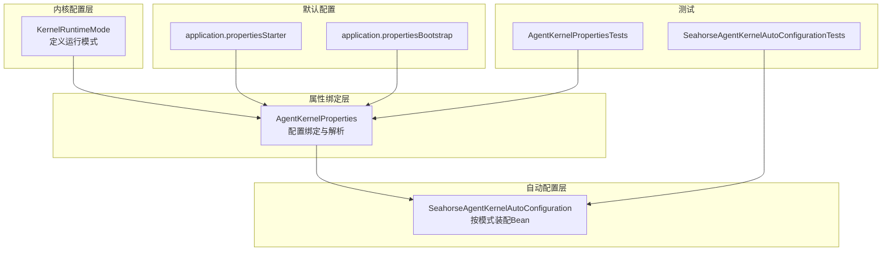
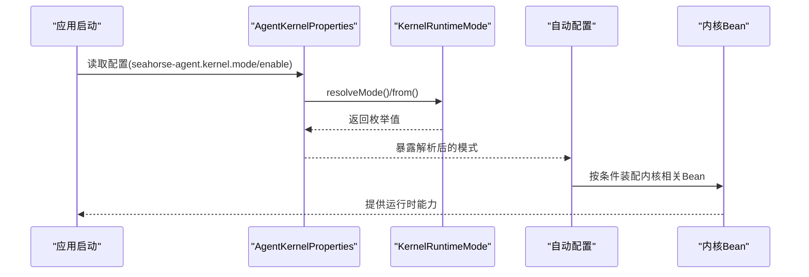
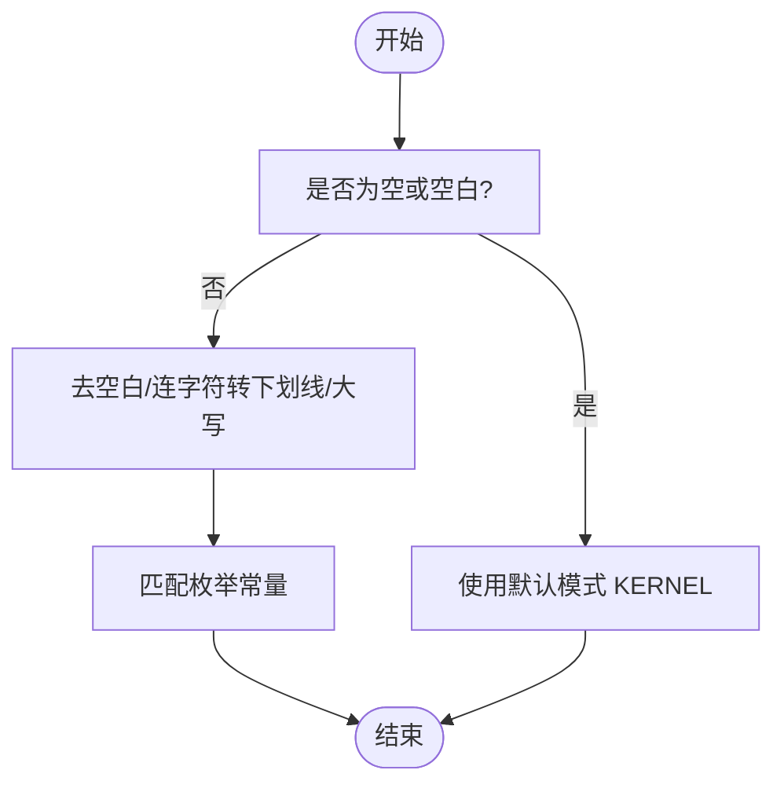
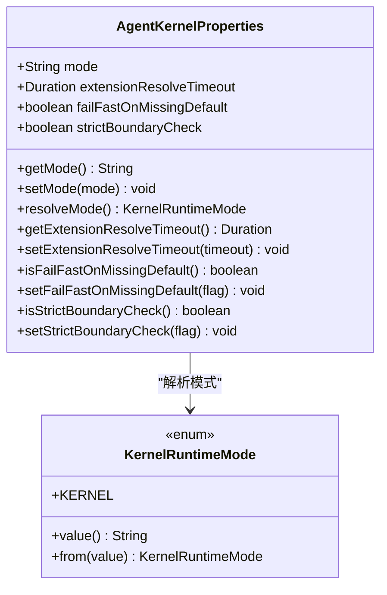
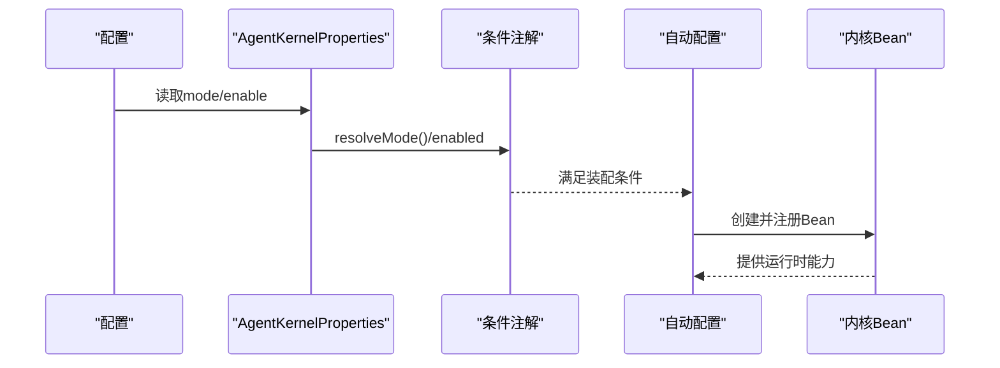
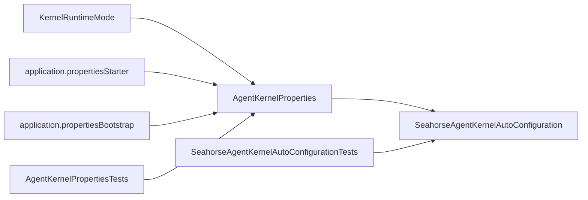

# 运行时模式配置

<cite>
**本文引用的文件**   
- [KernelRuntimeMode.java](file://seahorse-agent-kernel/src/main/java/com/miracle/ai/seahorse/agent/kernel/config/KernelRuntimeMode.java)
- [AgentKernelProperties.java](file://seahorse-agent-spring-boot-autoconfigure/src/main/java/com/miracle/ai/seahorse/agent/adapters/spring/config/AgentKernelProperties.java)
- [application.properties（Spring Boot Starter）](file://seahorse-agent-spring-boot-autoconfigure/src/main/resources/application.properties)
- [application.properties（Bootstrap）](file://seahorse-agent-bootstrap/src/main/resources/application.properties)
- [SeahorseAgentKernelAutoConfiguration.java](file://seahorse-agent-spring-boot-autoconfigure/src/main/java/com/miracle/ai/seahorse/agent/adapters/spring/SeahorseAgentKernelAutoConfiguration.java)
- [AgentKernelPropertiesTests.java](file://seahorse-agent-tests/src/test/java/com/miracle/ai/seahorse/agent/kernel/config/AgentKernelPropertiesTests.java)
- [SeahorseAgentKernelAutoConfigurationTests.java](file://seahorse-agent-tests/src/test/java/com/miracle/ai/seahorse/agent/adapters/spring/SeahorseAgentKernelAutoConfigurationTests.java)
</cite>

## 目录
1. [简介](#简介)
2. [项目结构](#项目结构)
3. [核心组件](#核心组件)
4. [架构总览](#架构总览)
5. [详细组件分析](#详细组件分析)
6. [依赖关系分析](#依赖关系分析)
7. [性能考量](#性能考量)
8. [故障排查指南](#故障排查指南)
9. [结论](#结论)
10. [附录](#附录)

## 简介
本文件聚焦于 Seahorse Agent 的“运行时模式”配置，系统性阐述 KernelRuntimeMode 枚举的设计理念、使用场景与行为特征，并结合 AgentKernelProperties 与自动配置机制，说明如何通过配置文件、环境变量、命令行参数等方式设置运行模式；进一步解释运行时模式对系统行为（如功能装配、日志级别、性能特性、调试能力等）的影响；最后给出不同部署场景下的最佳实践建议，以及如何在不重启系统的情况下动态切换模式的方法论。

## 项目结构
围绕运行时模式的关键文件分布如下：
- 核心枚举：KernelRuntimeMode 定义了可用的运行模式集合
- 属性绑定：AgentKernelProperties 将配置项映射到 Java 对象，支持默认值与解析逻辑
- 自动配置：SeahorseAgentKernelAutoConfiguration 在满足条件时装配内核基础设施
- 默认配置：Spring Boot Starter 与 Bootstrap 提供默认配置示例
- 测试验证：单元测试与集成测试覆盖默认值、空值处理与模式生效路径

**图表来源**
- [KernelRuntimeMode.java:25-46](file://seahorse-agent-kernel/src/main/java/com/miracle/ai/seahorse/agent/kernel/config/KernelRuntimeMode.java#L25-L46)
- [AgentKernelProperties.java:29-50](file://seahorse-agent-spring-boot-autoconfigure/src/main/java/com/miracle/ai/seahorse/agent/adapters/spring/config/AgentKernelProperties.java#L29-L50)
- [SeahorseAgentKernelAutoConfiguration.java:182-188](file://seahorse-agent-spring-boot-autoconfigure/src/main/java/com/miracle/ai/seahorse/agent/adapters/spring/SeahorseAgentKernelAutoConfiguration.java#L182-L188)
- [application.properties（Spring Boot Starter）:1-2](file://seahorse-agent-spring-boot-autoconfigure/src/main/resources/application.properties#L1-L2)
- [application.properties（Bootstrap）:1-4](file://seahorse-agent-bootstrap/src/main/resources/application.properties#L1-L4)
- [AgentKernelPropertiesTests.java:31-55](file://seahorse-agent-tests/src/test/java/com/miracle/ai/seahorse/agent/kernel/config/AgentKernelPropertiesTests.java#L31-L55)
- [SeahorseAgentKernelAutoConfigurationTests.java:136-170](file://seahorse-agent-tests/src/test/java/com/miracle/ai/seahorse/agent/adapters/spring/SeahorseAgentKernelAutoConfigurationTests.java#L136-L170)

**章节来源**
- [KernelRuntimeMode.java:25-46](file://seahorse-agent-kernel/src/main/java/com/miracle/ai/seahorse/agent/kernel/config/KernelRuntimeMode.java#L25-L46)
- [AgentKernelProperties.java:29-50](file://seahorse-agent-spring-boot-autoconfigure/src/main/java/com/miracle/ai/seahorse/agent/adapters/spring/config/AgentKernelProperties.java#L29-L50)
- [SeahorseAgentKernelAutoConfiguration.java:182-188](file://seahorse-agent-spring-boot-autoconfigure/src/main/java/com/miracle/ai/seahorse/agent/adapters/spring/SeahorseAgentKernelAutoConfiguration.java#L182-L188)
- [application.properties（Spring Boot Starter）:1-2](file://seahorse-agent-spring-boot-autoconfigure/src/main/resources/application.properties#L1-L2)
- [application.properties（Bootstrap）:1-4](file://seahorse-agent-bootstrap/src/main/resources/application.properties#L1-L4)
- [AgentKernelPropertiesTests.java:31-55](file://seahorse-agent-tests/src/test/java/com/miracle/ai/seahorse/agent/kernel/config/AgentKernelPropertiesTests.java#L31-L55)
- [SeahorseAgentKernelAutoConfigurationTests.java:136-170](file://seahorse-agent-tests/src/test/java/com/miracle/ai/seahorse/agent/adapters/spring/SeahorseAgentKernelAutoConfigurationTests.java#L136-L170)

## 核心组件
- KernelRuntimeMode：当前版本仅定义 KERNEL 模式，提供字符串值与从任意输入解析为枚举的能力，包含空值与空白值的默认回退策略。
- AgentKernelProperties：将 seahorse-agent.kernel.* 前缀的配置绑定到对象，提供默认模式、超时、严格边界检查等配置项，并负责将字符串模式解析为枚举。
- 自动配置条件：SeahorseAgentKernelAutoConfiguration 以 seahorse-agent.kernel.enabled 为开关，且在模式为 kernel 时装配内核基础设施与本地流式回调等 Bean。

**章节来源**
- [KernelRuntimeMode.java:25-46](file://seahorse-agent-kernel/src/main/java/com/miracle/ai/seahorse/agent/kernel/config/KernelRuntimeMode.java#L25-L46)
- [AgentKernelProperties.java:29-76](file://seahorse-agent-spring-boot-autoconfigure/src/main/java/com/miracle/ai/seahorse/agent/adapters/spring/config/AgentKernelProperties.java#L29-L76)
- [SeahorseAgentKernelAutoConfiguration.java:182-188](file://seahorse-agent-spring-boot-autoconfigure/src/main/java/com/miracle/ai/seahorse/agent/adapters/spring/SeahorseAgentKernelAutoConfiguration.java#L182-L188)

## 架构总览
运行时模式通过“配置 → 绑定 → 解析 → 条件装配”的链路影响系统行为。下图展示了关键交互：

**图表来源**
- [AgentKernelProperties.java:47-50](file://seahorse-agent-spring-boot-autoconfigure/src/main/java/com/miracle/ai/seahorse/agent/adapters/spring/config/AgentKernelProperties.java#L47-L50)
- [KernelRuntimeMode.java:39-45](file://seahorse-agent-kernel/src/main/java/com/miracle/ai/seahorse/agent/kernel/config/KernelRuntimeMode.java#L39-L45)
- [SeahorseAgentKernelAutoConfiguration.java:182-188](file://seahorse-agent-spring-boot-autoconfigure/src/main/java/com/miracle/ai/seahorse/agent/adapters/spring/SeahorseAgentKernelAutoConfiguration.java#L182-L188)

## 详细组件分析

### KernelRuntimeMode 设计与解析
- 设计理念
  - 枚举仅包含 KERNEL，体现当前版本的单一运行模式。
  - 提供稳定的字符串值与解析逻辑，便于未来扩展新的模式而不破坏现有配置。
- 解析规则
  - 空值或空白值回退至 KERNEL。
  - 输入标准化：去除首尾空白、连字符转下划线、统一大写后匹配枚举常量。
- 使用场景
  - 当前用于控制自动配置是否装配内核基础设施与本地流式回调等能力。

**图表来源**
- [KernelRuntimeMode.java:39-45](file://seahorse-agent-kernel/src/main/java/com/miracle/ai/seahorse/agent/kernel/config/KernelRuntimeMode.java#L39-L45)

**章节来源**
- [KernelRuntimeMode.java:25-46](file://seahorse-agent-kernel/src/main/java/com/miracle/ai/seahorse/agent/kernel/config/KernelRuntimeMode.java#L25-L46)

### AgentKernelProperties 配置绑定与解析
- 配置前缀：seahorse-agent.kernel.*
- 关键字段
  - mode：运行模式字符串，默认值来自 KernelRuntimeMode.DEFAULT_MODE
  - extensionResolveTimeout：扩展解析超时
  - failFastOnMissingDefault：缺失默认适配器时快速失败
  - strictBoundaryCheck：严格边界检查（用于后续边界校验）
- 解析流程
  - setMode 支持空值回退
  - resolveMode 调用 KernelRuntimeMode.from 进行标准化解析

**图表来源**
- [AgentKernelProperties.java:29-76](file://seahorse-agent-spring-boot-autoconfigure/src/main/java/com/miracle/ai/seahorse/agent/adapters/spring/config/AgentKernelProperties.java#L29-L76)
- [KernelRuntimeMode.java:25-46](file://seahorse-agent-kernel/src/main/java/com/miracle/ai/seahorse/agent/kernel/config/KernelRuntimeMode.java#L25-L46)

**章节来源**
- [AgentKernelProperties.java:29-76](file://seahorse-agent-spring-boot-autoconfigure/src/main/java/com/miracle/ai/seahorse/agent/adapters/spring/config/AgentKernelProperties.java#L29-L76)

### 自动配置与模式联动
- 启用条件
  - seahorse-agent.kernel.enabled=true（默认开启）
  - 模式为 kernel（即 resolveMode() 返回 KERNEL）
- 装配内容
  - 内核编排、Feature 注册表、本地流式任务与回调、检索引擎、聊天流水线等核心 Bean
- 测试验证
  - 单元测试与集成测试覆盖默认模式、空模式、缺失模式的行为一致性

**图表来源**
- [SeahorseAgentKernelAutoConfiguration.java:182-188](file://seahorse-agent-spring-boot-autoconfigure/src/main/java/com/miracle/ai/seahorse/agent/adapters/spring/SeahorseAgentKernelAutoConfiguration.java#L182-L188)
- [AgentKernelProperties.java:47-50](file://seahorse-agent-spring-boot-autoconfigure/src/main/java/com/miracle/ai/seahorse/agent/adapters/spring/config/AgentKernelProperties.java#L47-L50)

**章节来源**
- [SeahorseAgentKernelAutoConfiguration.java:182-188](file://seahorse-agent-spring-boot-autoconfigure/src/main/java/com/miracle/ai/seahorse/agent/adapters/spring/SeahorseAgentKernelAutoConfiguration.java#L182-L188)
- [SeahorseAgentKernelAutoConfigurationTests.java:136-170](file://seahorse-agent-tests/src/test/java/com/miracle/ai/seahorse/agent/adapters/spring/SeahorseAgentKernelAutoConfigurationTests.java#L136-L170)

## 依赖关系分析
- 组件耦合
  - AgentKernelProperties 依赖 KernelRuntimeMode 进行模式解析
  - 自动配置类依赖 AgentKernelProperties 的解析结果决定 Bean 装配
- 外部依赖
  - Spring Boot 配置绑定与条件装配机制
  - 测试框架验证默认值与解析行为

**图表来源**
- [KernelRuntimeMode.java:25-46](file://seahorse-agent-kernel/src/main/java/com/miracle/ai/seahorse/agent/kernel/config/KernelRuntimeMode.java#L25-L46)
- [AgentKernelProperties.java:29-76](file://seahorse-agent-spring-boot-autoconfigure/src/main/java/com/miracle/ai/seahorse/agent/adapters/spring/config/AgentKernelProperties.java#L29-L76)
- [SeahorseAgentKernelAutoConfiguration.java:182-188](file://seahorse-agent-spring-boot-autoconfigure/src/main/java/com/miracle/ai/seahorse/agent/adapters/spring/SeahorseAgentKernelAutoConfiguration.java#L182-L188)
- [application.properties（Spring Boot Starter）:1-2](file://seahorse-agent-spring-boot-autoconfigure/src/main/resources/application.properties#L1-L2)
- [application.properties（Bootstrap）:1-4](file://seahorse-agent-bootstrap/src/main/resources/application.properties#L1-L4)
- [AgentKernelPropertiesTests.java:31-55](file://seahorse-agent-tests/src/test/java/com/miracle/ai/seahorse/agent/kernel/config/AgentKernelPropertiesTests.java#L31-L55)
- [SeahorseAgentKernelAutoConfigurationTests.java:136-170](file://seahorse-agent-tests/src/test/java/com/miracle/ai/seahorse/agent/adapters/spring/SeahorseAgentKernelAutoConfigurationTests.java#L136-L170)

**章节来源**
- [AgentKernelProperties.java:29-76](file://seahorse-agent-spring-boot-autoconfigure/src/main/java/com/miracle/ai/seahorse/agent/adapters/spring/config/AgentKernelProperties.java#L29-L76)
- [SeahorseAgentKernelAutoConfiguration.java:182-188](file://seahorse-agent-spring-boot-autoconfigure/src/main/java/com/miracle/ai/seahorse/agent/adapters/spring/SeahorseAgentKernelAutoConfiguration.java#L182-L188)

## 性能考量
- 模式解析成本极低：字符串标准化与枚举查找为常数时间复杂度
- 自动配置按需装配：仅在模式为 kernel 且开关开启时加载内核相关 Bean，避免不必要的初始化开销
- 扩展解析超时：可通过 extensionResolveTimeout 调整扩展加载等待时间，平衡启动时间与稳定性

[本节为通用指导，无需列出具体文件来源]

## 故障排查指南
- 模式未生效
  - 检查 seahorse-agent.kernel.enabled 是否为 true
  - 确认 seahorse-agent.kernel.mode 设置为 kernel
- 默认值与空值
  - 若未设置 mode，将回退到 KERNEL
  - 测试用例验证了默认值与空字符串的行为
- 自动配置未装配
  - 确认已引入 Spring Boot Starter 并正确加载 application.properties
  - 使用集成测试断言验证模式为 kernel 时的 Bean 存在性

**章节来源**
- [AgentKernelPropertiesTests.java:31-55](file://seahorse-agent-tests/src/test/java/com/miracle/ai/seahorse/agent/kernel/config/AgentKernelPropertiesTests.java#L31-L55)
- [SeahorseAgentKernelAutoConfigurationTests.java:136-170](file://seahorse-agent-tests/src/test/java/com/miracle/ai/seahorse/agent/adapters/spring/SeahorseAgentKernelAutoConfigurationTests.java#L136-L170)

## 结论
当前版本的运行时模式以 KERNEL 为核心，通过 KernelRuntimeMode 与 AgentKernelProperties 的组合实现了简洁可靠的模式解析与默认回退；配合自动配置的条件装配，确保在正确模式下按需加载内核能力。未来若扩展新模式，可在不破坏现有配置的前提下平滑演进。

[本节为总结性内容，无需列出具体文件来源]

## 附录

### 配置方式一览
- 配置文件（application.properties）
  - seahorse-agent.kernel.mode：设置运行模式（当前仅支持 kernel）
  - seahorse-agent.kernel.enabled：控制是否启用内核自动配置（默认 true）
  - seahorse-agent.kernel.migration-mode：迁移模式（Bootstrap 提供示例）
- 环境变量与命令行参数
  - 可通过 Spring Boot 的标准机制传递配置键值（例如通过 JVM 参数或容器环境变量）

**章节来源**
- [application.properties（Spring Boot Starter）:1-2](file://seahorse-agent-spring-boot-autoconfigure/src/main/resources/application.properties#L1-L2)
- [application.properties（Bootstrap）:1-4](file://seahorse-agent-bootstrap/src/main/resources/application.properties#L1-L4)

### 不同部署场景的最佳实践
- 开发环境
  - 保持默认 kernel 模式，启用本地流式回调与基础检索能力
  - 可开启严格边界检查（strictBoundaryCheck）辅助调试
- 测试环境
  - 明确设置 seahorse-agent.kernel.mode=kernel，确保自动配置按预期装配
  - 使用集成测试验证关键 Bean 的存在性
- 生产环境
  - 固化配置，避免运行时变更
  - 如需调整扩展解析超时，依据负载与资源情况设置 extensionResolveTimeout

[本节为通用指导，无需列出具体文件来源]

### 如何在不重启系统的情况下切换模式
- 当前实现基于启动阶段的配置绑定与条件装配，无法直接热切换运行模式
- 建议方案
  - 通过外部配置中心下发新配置并触发滚动重启
  - 或在应用层面提供受控的配置刷新接口（需自研），并在模式变更时重新初始化相关 Bean

[本节为通用指导，无需列出具体文件来源]