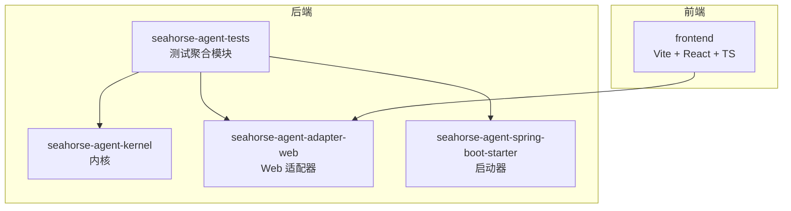
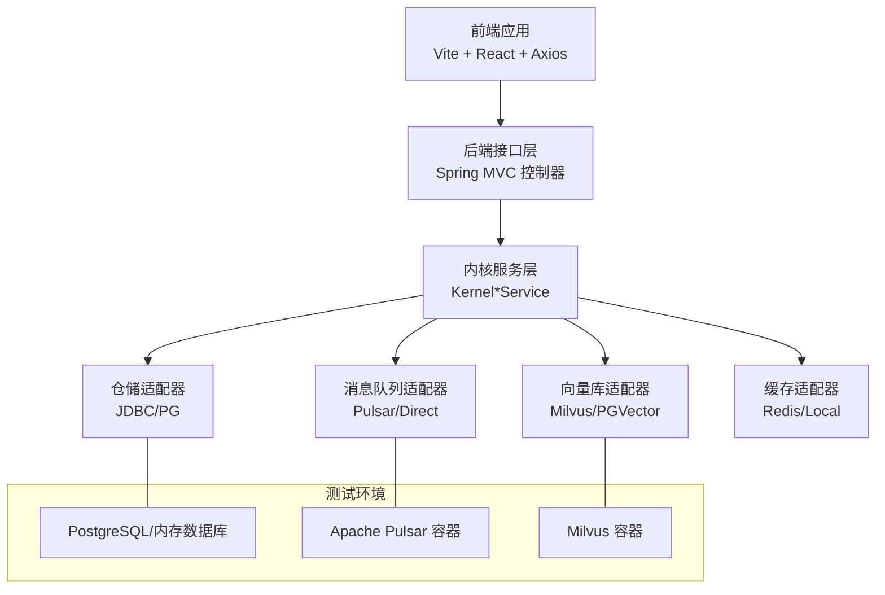
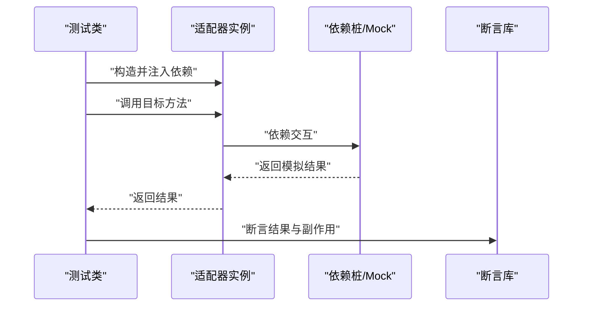
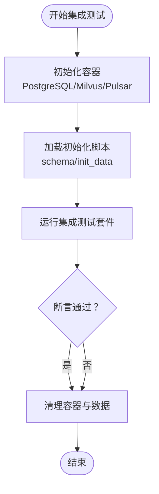
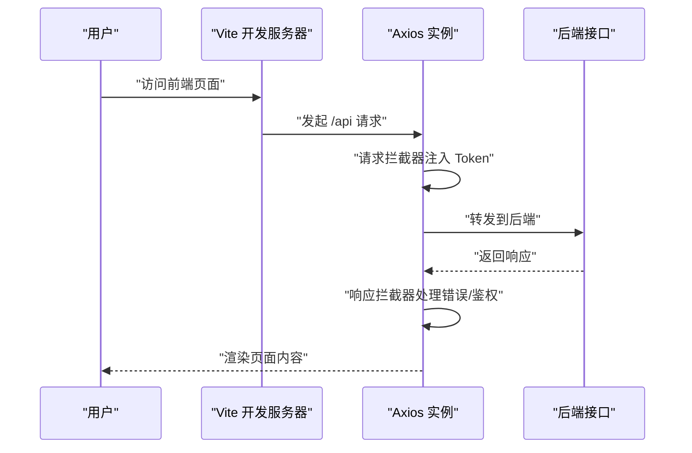
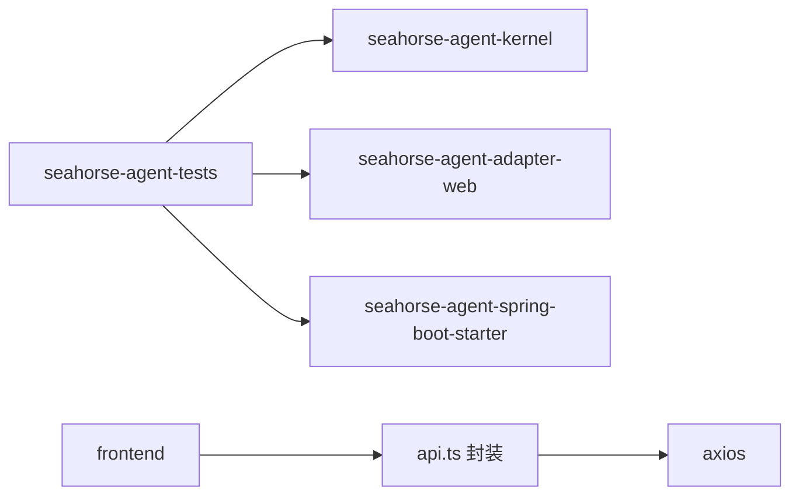

# 测试策略

<cite>
**本文引用的文件**
- [pom.xml](file://pom.xml)
- [seahorse-agent-tests/pom.xml](file://seahorse-agent-tests/pom.xml)
- [frontend/package.json](file://frontend/package.json)
- [frontend/vite.config.ts](file://frontend/vite.config.ts)
- [frontend/src/services/api.ts](file://frontend/src/services/api.ts)
- [frontend/TESTING.md](file://frontend/TESTING.md)
- [frontend/.eslintrc.cjs](file://frontend/.eslintrc.cjs)
- [frontend/.prettierrc](file://frontend/.prettierrc)
- [seahorse-agent-adapter-mcp-http/src/test/java/com/miracle/ai/seahorse/agent/adapters/mcp/http/LlmMcpParameterExtractionAdapterTests.java](file://seahorse-agent-adapter-mcp-http/src/test/java/com/miracle/ai/seahorse/agent/adapters/mcp/http/LlmMcpParameterExtractionAdapterTests.java)
- [seahorse-agent-adapter-repository-jdbc/src/test/java/com/miracle/ai/seahorse/agent/adapters/repository/jdbc/JdbcKnowledgeBaseRepositoryAdapterTests.java](file://seahorse-agent-adapter-repository-jdbc/src/test/java/com/miracle/ai/seahorse/agent/adapters/repository/jdbc/JdbcKnowledgeBaseRepositoryAdapterTests.java)
- [docker-compose.full.yml](file://docker-compose.full.yml)
- [docker-compose.full.yml](file://docker-compose.full.yml)
- [resources/database/seahorse_init.sql](file://resources/database/seahorse_init.sql)
- [resources/database/seahorse_init.sql](file://resources/database/seahorse_init.sql)
- [docs/USER_GUIDE.md](file://docs/USER_GUIDE.md)
- [docs/performance/current-baseline.md](file://docs/performance/current-baseline.md)
</cite>

## 目录
1. [引言](#引言)
2. [项目结构](#项目结构)
3. [核心组件](#核心组件)
4. [架构总览](#架构总览)
5. [详细组件分析](#详细组件分析)
6. [依赖分析](#依赖分析)
7. [性能考虑](#性能考虑)
8. [故障排查指南](#故障排查指南)
9. [结论](#结论)
10. [附录](#附录)

## 引言
本测试策略文档面向 Seahorse Agent 项目，覆盖后端（Spring Boot + JUnit + Mockito + Testcontainers）与前端（Vite + React + TypeScript + ESLint + Prettier）的测试体系，明确单元测试、集成测试、端到端测试、性能测试与压力测试的实施方法，给出测试覆盖率要求与测量方式，以及测试环境搭建、测试数据准备、测试工具链与持续集成/持续测试流程设计。

## 项目结构
项目采用多模块 Maven 结构，前端位于 frontend 目录，后端由多个适配器模块、内核模块、Web 适配器、启动器等组成；seahorse-agent-tests 作为统一测试聚合模块，引入内核与 Web 适配器用于测试契约与集成验证。

图表来源
- [pom.xml](file://pom.xml)
- [seahorse-agent-tests/pom.xml](file://seahorse-agent-tests/pom.xml)

章节来源
- [pom.xml](file://pom.xml)
- [seahorse-agent-tests/pom.xml](file://seahorse-agent-tests/pom.xml)

## 核心组件
- 后端测试框架
  - 单元测试：JUnit 5（在 Maven Surefire 插件中执行）
  - Mock：Mockito（通过 JVM agent 注入）
  - 集成测试：Testcontainers（容器化依赖如数据库、消息队列、向量库）
- 前端测试框架
  - 开发与构建：Vite
  - 语言与类型：TypeScript
  - 质量保障：ESLint、Prettier
  - 接口与拦截器：Axios 封装与认证拦截
- 测试工具链
  - Maven 多模块与插件：Surefire、Spotless
  - Docker Compose：Milvus、Pulsar 等外部依赖
  - 性能基线与对比：`docs/performance/current-baseline.md` 登记真实压测与指标导出

章节来源
- [pom.xml](file://pom.xml)
- [frontend/package.json](file://frontend/package.json)
- [frontend/vite.config.ts](file://frontend/vite.config.ts)
- [frontend/src/services/api.ts](file://frontend/src/services/api.ts)
- [frontend/.eslintrc.cjs](file://frontend/.eslintrc.cjs)
- [frontend/.prettierrc](file://frontend/.prettierrc)

## 架构总览
下图展示后端与前端在测试阶段的交互关系，以及外部依赖（数据库、消息队列、向量库）通过容器化提供的集成测试支持。

图表来源
- [pom.xml](file://pom.xml)
- [docker-compose.full.yml](file://docker-compose.full.yml)
- [docker-compose.full.yml](file://docker-compose.full.yml)
- [resources/database/seahorse_init.sql](file://resources/database/seahorse_init.sql)

## 详细组件分析

### 后端测试：单元测试与 Mock 使用
- 测试框架与运行
  - JUnit 5 由 Maven Surefire 插件驱动执行，默认排除 integration 分组
  - Mockito 通过 JVM agent 注入，支持 @Mock、@InjectMocks 等注解
- 典型测试模式
  - 使用 ObjectProvider 或自定义桩实现注入依赖
  - 使用 AssertJ 断言结果，覆盖成功路径与降级路径
- 示例参考
  - 参数提取适配器单元测试：验证声明参数解析与默认值填充、模型不可用时的回退行为
  - JDBC 知识库仓储适配器单元测试：内存数据库初始化、CRUD 与分页统计

图表来源
- [seahorse-agent-adapter-mcp-http/src/test/java/com/miracle/ai/seahorse/agent/adapters/mcp/http/LlmMcpParameterExtractionAdapterTests.java](file://seahorse-agent-adapter-mcp-http/src/test/java/com/miracle/ai/seahorse/agent/adapters/mcp/http/LlmMcpParameterExtractionAdapterTests.java)

章节来源
- [pom.xml](file://pom.xml)
- [seahorse-agent-adapter-mcp-http/src/test/java/com/miracle/ai/seahorse/agent/adapters/mcp/http/LlmMcpParameterExtractionAdapterTests.java](file://seahorse-agent-adapter-mcp-http/src/test/java/com/miracle/ai/seahorse/agent/adapters/mcp/http/LlmMcpParameterExtractionAdapterTests.java)
- [seahorse-agent-adapter-repository-jdbc/src/test/java/com/miracle/ai/seahorse/agent/adapters/repository/jdbc/JdbcKnowledgeBaseRepositoryAdapterTests.java](file://seahorse-agent-adapter-repository-jdbc/src/test/java/com/miracle/ai/seahorse/agent/adapters/repository/jdbc/JdbcKnowledgeBaseRepositoryAdapterTests.java)

### 后端测试：集成测试与容器化依赖
- Testcontainers 使用场景
  - 数据库：PostgreSQL/内存数据库（H2 内存库用于单元测试）
  - 消息队列：Apache Pulsar
  - 向量库：Milvus
- 建议实践
  - 为每个外部依赖准备独立的 Compose 文件或容器配置
  - 在 CI 中使用预构建镜像，缩短启动时间
  - 通过 @Container 注解管理生命周期，确保测试前后资源清理

图表来源
- [docker-compose.full.yml](file://docker-compose.full.yml)
- [docker-compose.full.yml](file://docker-compose.full.yml)
- [resources/database/seahorse_init.sql](file://resources/database/seahorse_init.sql)
- [resources/database/seahorse_init.sql](file://resources/database/seahorse_init.sql)

章节来源
- [pom.xml](file://pom.xml)
- [docker-compose.full.yml](file://docker-compose.full.yml)
- [docker-compose.full.yml](file://docker-compose.full.yml)
- [resources/database/seahorse_init.sql](file://resources/database/seahorse_init.sql)
- [resources/database/seahorse_init.sql](file://resources/database/seahorse_init.sql)

### 前端测试：开发与质量保障
- 工具链
  - Vite：开发服务器与代理（将 /api 请求转发至后端）
  - TypeScript：类型安全
  - ESLint：规则集推荐配置
  - Prettier：代码风格统一
- 接口与拦截器
  - Axios 实例封装与超时设置
  - 统一请求拦截器：自动注入 Token
  - 统一响应拦截器：处理鉴权失效、错误提示与网络错误
- 测试指南
  - 前端开发需配置代理，确保 API 请求可到达后端
  - 登录后进入管理后台进行功能测试

图表来源
- [frontend/vite.config.ts](file://frontend/vite.config.ts)
- [frontend/src/services/api.ts](file://frontend/src/services/api.ts)
- [frontend/TESTING.md](file://frontend/TESTING.md)

章节来源
- [frontend/package.json](file://frontend/package.json)
- [frontend/vite.config.ts](file://frontend/vite.config.ts)
- [frontend/src/services/api.ts](file://frontend/src/services/api.ts)
- [frontend/.eslintrc.cjs](file://frontend/.eslintrc.cjs)
- [frontend/.prettierrc](file://frontend/.prettierrc)
- [frontend/TESTING.md](file://frontend/TESTING.md)

### 前端测试：端到端测试建议
- 建议使用 Playwright/Cypress 进行端到端测试，覆盖登录、知识库 CRUD、会话交互等关键流程
- 建议在 CI 中与后端联调，使用 Testcontainers 提供的数据库与外部服务

（本节为概念性指导，不直接分析具体文件）

## 依赖分析
- 后端模块间依赖
  - 测试聚合模块依赖内核、Web 适配器与启动器，确保对契约与集成点的验证
- 前端依赖
  - Axios 用于网络请求，Sonner 用于通知提示
  - Vite 插件链路与别名配置保证开发体验与路径解析

图表来源
- [seahorse-agent-tests/pom.xml](file://seahorse-agent-tests/pom.xml)
- [pom.xml](file://pom.xml)
- [frontend/src/services/api.ts](file://frontend/src/services/api.ts)

章节来源
- [seahorse-agent-tests/pom.xml](file://seahorse-agent-tests/pom.xml)
- [pom.xml](file://pom.xml)
- [frontend/src/services/api.ts](file://frontend/src/services/api.ts)

## 性能考虑
- 基准与对比
  - 使用 `docs/performance/current-baseline.md` 约定的真实压测导出、追踪与指标作为性能基线和回归对比依据
  - 对比不同模块演进后的性能指标，识别回归点
- 建议的性能测试类型
  - 基准测试：单模块关键路径的稳定耗时
  - 负载测试：逐步增加并发与数据规模，观察延迟与吞吐
  - 稳定性测试：长时间运行，监控内存与 GC 行为
- 外部依赖性能
  - Milvus、Pulsar 的查询与写入延迟应纳入评估
  - 数据库连接池与索引策略影响整体性能

章节来源
- [docs/USER_GUIDE.md](file://docs/USER_GUIDE.md)
- [docs/performance/current-baseline.md](file://docs/performance/current-baseline.md)

## 故障排查指南
- 前端代理问题
  - 若出现“静态资源未找到”或 404，检查 Vite 代理配置是否正确且已重启开发服务器
  - 确认后端服务已启动并可访问
- 鉴权失效
  - 响应拦截器检测到未登录或登录过期时会清除本地 Token 并跳转登录页
  - 建议在测试中提前登录或在请求拦截器中注入临时 Token
- 数据库与外部依赖
  - 集成测试前确保 PostgreSQL、Milvus、Pulsar 容器可用
  - 初始化脚本需正确加载 schema 与基础数据

章节来源
- [frontend/TESTING.md](file://frontend/TESTING.md)
- [frontend/vite.config.ts](file://frontend/vite.config.ts)
- [frontend/src/services/api.ts](file://frontend/src/services/api.ts)
- [resources/database/seahorse_init.sql](file://resources/database/seahorse_init.sql)
- [resources/database/seahorse_init.sql](file://resources/database/seahorse_init.sql)

## 结论
本测试策略围绕后端 JUnit + Mockito + Testcontainers 与前端 Vite + React + TypeScript + ESLint + Prettier 的技术栈，给出了单元测试、集成测试、端到端测试、性能测试与测试环境管理的实施建议。通过明确的断言策略、Mock 使用规范与容器化依赖管理，可有效提升关键业务逻辑的覆盖率与稳定性，并为持续集成与质量门禁提供支撑。

## 附录
- 测试覆盖率要求与测量
  - 建议后端关键包（kernel、ports、application）行覆盖率不低于 80%，分支覆盖率不低于 70%
  - 前端关键页面与服务模块（如 services、hooks、pages）行覆盖率不低于 75%，分支覆盖率不低于 65%
  - 使用 JaCoCo（后端）与 Istanbul（前端）生成覆盖率报告，并在 CI 中设置阈值门禁
- 持续集成与持续测试
  - Maven 任务：clean compile test（排除 integration 分组），集成测试单独执行
  - 前端任务：lint、build、测试（如后续引入 Jest）
  - 容器化依赖：在 CI 中使用 Docker Compose 启动数据库、消息队列、向量库
  - 报告与门禁：生成测试报告与覆盖率报告，设置质量门禁（失败即阻断）

章节来源
- [pom.xml](file://pom.xml)
- [frontend/package.json](file://frontend/package.json)