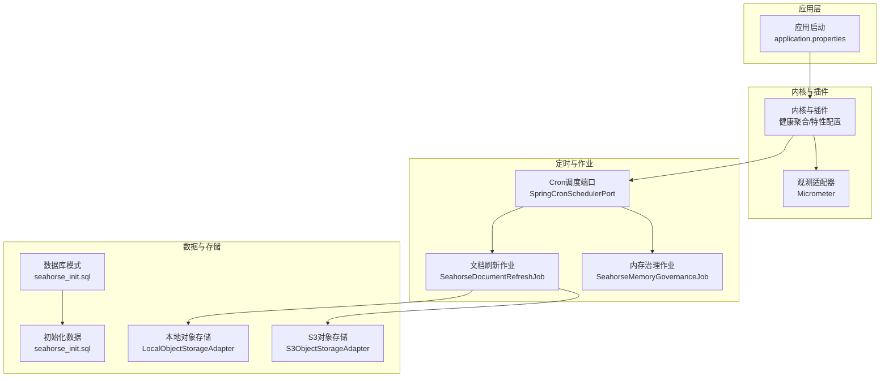
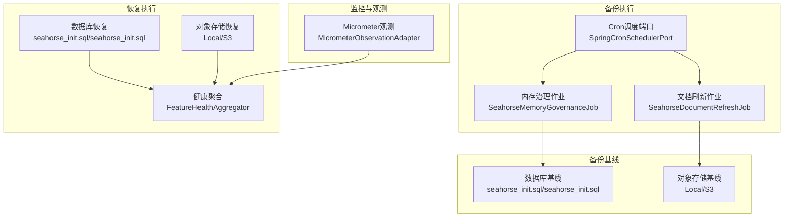
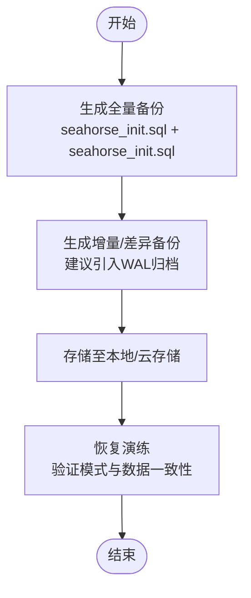
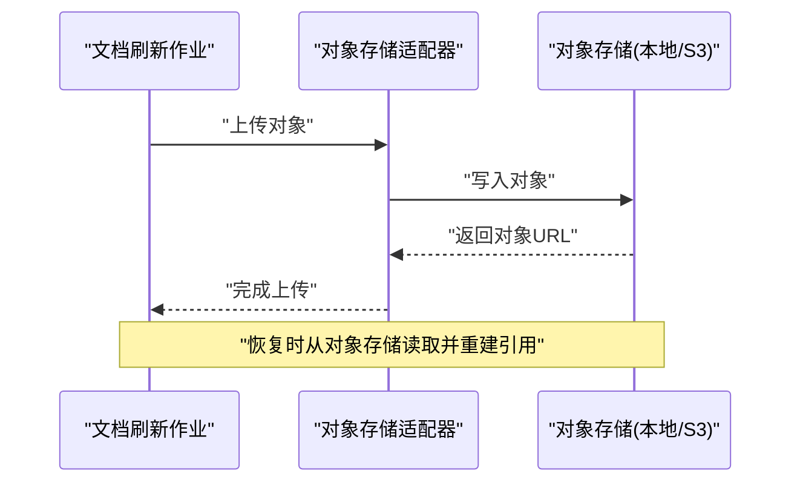
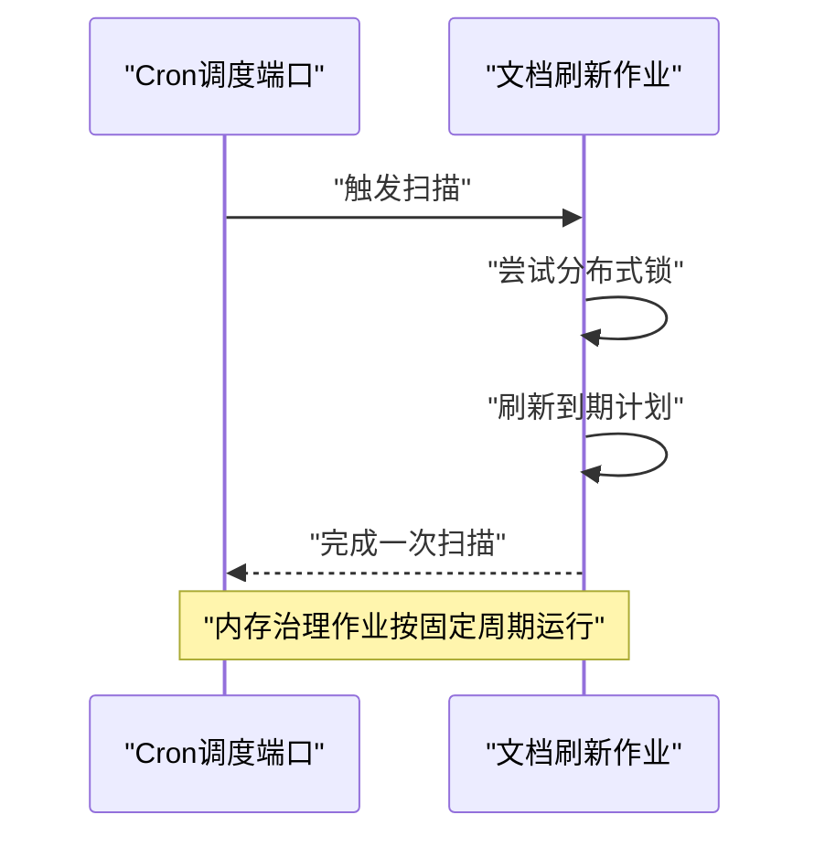
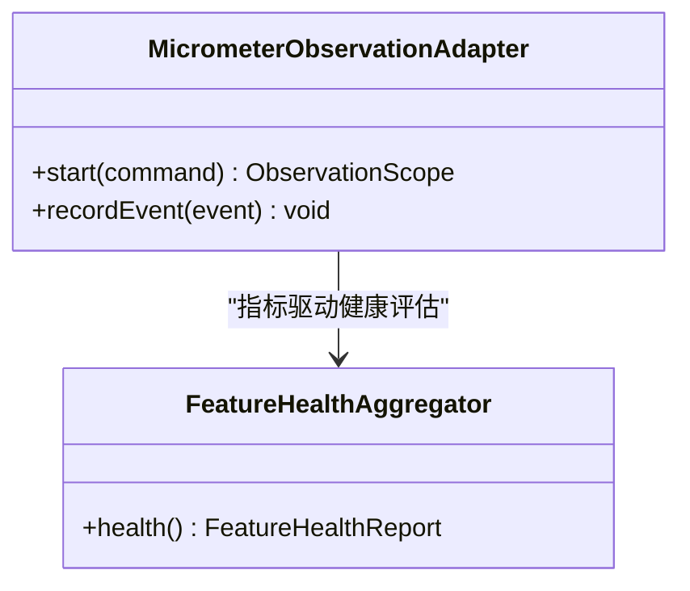
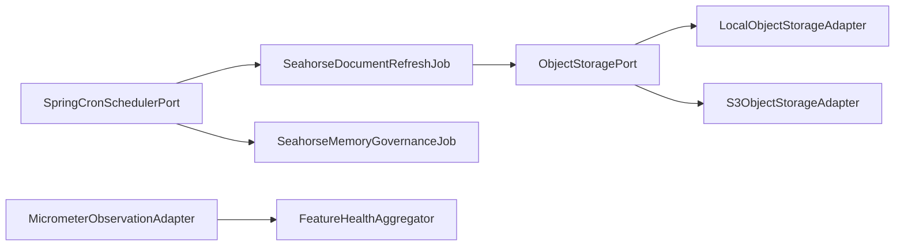

# 备份恢复

<cite>
**本文引用的文件**
- [OA系统数据安全规范文档.md](file://resources/docs/knowledge/biz/biz-oa/OA系统数据安全规范文档.md)
- [application.properties](file://seahorse-agent-bootstrap/src/main/resources/application.properties)
- [seahorse_init.sql](file://resources/database/seahorse_init.sql)
- [seahorse_init.sql](file://resources/database/seahorse_init.sql)
- [init_data.sql](file://resources/database/seahorse_init.sql)
- [LocalObjectStorageAdapter.java](file://seahorse-agent-adapter-storage-local/src/main/java/com/miracle/ai/seahorse/agent/adapters/storage/local/LocalObjectStorageAdapter.java)
- [S3ObjectStorageAdapter.java](file://seahorse-agent-adapter-storage-s3/src/main/java/com/miracle/ai/seahorse/agent/adapters/storage/s3/S3ObjectStorageAdapter.java)
- [ObjectStoragePort.java](file://seahorse-agent-kernel/src/main/java/com/miracle/ai/seahorse/agent/ports/outbound/storage/ObjectStoragePort.java)
- [SeahorseDocumentRefreshJob.java](file://seahorse-agent-spring-boot-autoconfigure/src/main/java/com/miracle/ai/seahorse/agent/adapters/spring/SeahorseDocumentRefreshJob.java)
- [SeahorseMemoryGovernanceJob.java](file://seahorse-agent-spring-boot-autoconfigure/src/main/java/com/miracle/ai/seahorse/agent/adapters/spring/SeahorseMemoryGovernanceJob.java)
- [SpringCronSchedulerPort.java](file://seahorse-agent-spring-boot-autoconfigure/src/main/java/com/miracle/ai/seahorse/agent/adapters/spring/SpringCronSchedulerPort.java)
- [MicrometerObservationAdapter.java](file://seahorse-agent-adapter-observation-micrometer/src/main/java/com/miracle/ai/seahorse/agent/adapters/observation/micrometer/MicrometerObservationAdapter.java)
- [FeatureHealthAggregator.java](file://seahorse-agent-kernel/src/main/java/com/miracle/ai/seahorse/agent/kernel/plugin/FeatureHealthAggregator.java)
- [KernelDocumentRefreshService.java](file://seahorse-agent-kernel/src/main/java/com/miracle/ai/seahorse/agent/kernel/application/knowledge/KernelDocumentRefreshService.java)
</cite>

## 目录
1. [简介](#简介)
2. [项目结构](#项目结构)
3. [核心组件](#核心组件)
4. [架构总览](#架构总览)
5. [详细组件分析](#详细组件分析)
6. [依赖分析](#依赖分析)
7. [性能考量](#性能考量)
8. [故障排查指南](#故障排查指南)
9. [结论](#结论)
10. [附录](#附录)

## 简介
本文件面向企业级数据保护与业务连续性，围绕备份与恢复策略提供系统化方案。结合代码库中现有的数据库模式、对象存储适配器、定时调度与可观测性能力，构建覆盖“数据库备份策略、文件系统与对象存储备份、配置与元数据备份、灾难恢复流程、自动化与监控、合规审计”的完整文档。文中所有技术细节均以仓库实际文件为依据，避免臆测。

## 项目结构
本项目采用多模块分层架构，与备份恢复相关的关键位置如下：
- 数据库模式与初始化脚本位于 resources/database，涵盖 PostgreSQL 表结构与初始数据，是数据库备份与恢复的基础。
- 对象存储适配器位于 seahorse-agent-adapter-storage-*，提供本地与 S3 的对象存储能力，用于知识库文档等对象的备份与恢复。
- 定时调度与作业位于 seahorse-agent-spring-boot-starter，提供基于 Cron 的文档刷新与内存治理等周期性任务，体现备份恢复体系中的“巡检与维护”环节。
- 观测与健康聚合位于 seahorse-agent-adapter-observation-micrometer 与 kernel 插件层，为备份恢复的自动化与监控提供指标与健康度评估能力。
- 应用启动配置位于 seahorse-agent-bootstrap，定义内核启用与迁移模式，是备份恢复演练与切换的运行时前提。

图表来源
- [application.properties:1-4](file://seahorse-agent-bootstrap/src/main/resources/application.properties#L1-L4)
- [seahorse_init.sql:1-850](file://resources/database/seahorse_init.sql#L1-L850)
- [seahorse_init.sql:1-5](file://resources/database/seahorse_init.sql#L1-L5)
- [LocalObjectStorageAdapter.java:1-129](file://seahorse-agent-adapter-storage-local/src/main/java/com/miracle/ai/seahorse/agent/adapters/storage/local/LocalObjectStorageAdapter.java#L1-L129)
- [S3ObjectStorageAdapter.java:1-28](file://seahorse-agent-adapter-storage-s3/src/main/java/com/miracle/ai/seahorse/agent/adapters/storage/s3/S3ObjectStorageAdapter.java#L1-L28)
- [SpringCronSchedulerPort.java:1-36](file://seahorse-agent-spring-boot-autoconfigure/src/main/java/com/miracle/ai/seahorse/agent/adapters/spring/SpringCronSchedulerPort.java#L1-L36)
- [SeahorseDocumentRefreshJob.java:1-70](file://seahorse-agent-spring-boot-autoconfigure/src/main/java/com/miracle/ai/seahorse/agent/adapters/spring/SeahorseDocumentRefreshJob.java#L1-L70)
- [SeahorseMemoryGovernanceJob.java:1-57](file://seahorse-agent-spring-boot-autoconfigure/src/main/java/com/miracle/ai/seahorse/agent/adapters/spring/SeahorseMemoryGovernanceJob.java#L1-L57)
- [MicrometerObservationAdapter.java:1-137](file://seahorse-agent-adapter-observation-micrometer/src/main/java/com/miracle/ai/seahorse/agent/adapters/observation/micrometer/MicrometerObservationAdapter.java#L1-L137)

章节来源
- [application.properties:1-4](file://seahorse-agent-bootstrap/src/main/resources/application.properties#L1-L4)
- [seahorse_init.sql:1-850](file://resources/database/seahorse_init.sql#L1-L850)
- [seahorse_init.sql:1-5](file://resources/database/seahorse_init.sql#L1-L5)

## 核心组件
- 数据库模式与初始化：提供标准的 PostgreSQL 表结构与初始数据，是备份恢复的“数据基线”。备份应覆盖模式与数据，恢复时按顺序执行。
- 对象存储适配器：提供本地与 S3 的对象存储能力，用于知识库文档等对象的持久化与恢复。
- 定时调度与作业：提供基于 Cron 的文档刷新与内存治理等周期性任务，体现备份恢复体系中的“巡检与维护”。
- 观测与健康：通过 Micrometer 指标与健康聚合，为备份恢复的自动化与监控提供支撑。

章节来源
- [LocalObjectStorageAdapter.java:1-129](file://seahorse-agent-adapter-storage-local/src/main/java/com/miracle/ai/seahorse/agent/adapters/storage/local/LocalObjectStorageAdapter.java#L1-L129)
- [S3ObjectStorageAdapter.java:1-28](file://seahorse-agent-adapter-storage-s3/src/main/java/com/miracle/ai/seahorse/agent/adapters/storage/s3/S3ObjectStorageAdapter.java#L1-L28)
- [SeahorseDocumentRefreshJob.java:1-70](file://seahorse-agent-spring-boot-autoconfigure/src/main/java/com/miracle/ai/seahorse/agent/adapters/spring/SeahorseDocumentRefreshJob.java#L1-L70)
- [SeahorseMemoryGovernanceJob.java:1-57](file://seahorse-agent-spring-boot-autoconfigure/src/main/java/com/miracle/ai/seahorse/agent/adapters/spring/SeahorseMemoryGovernanceJob.java#L1-L57)
- [MicrometerObservationAdapter.java:1-137](file://seahorse-agent-adapter-observation-micrometer/src/main/java/com/miracle/ai/seahorse/agent/adapters/observation/micrometer/MicrometerObservationAdapter.java#L1-L137)

## 架构总览
备份恢复体系由“数据基线、对象存储、定时巡检、可观测性与健康度、演练与切换”构成，形成闭环。

图表来源
- [seahorse_init.sql:1-850](file://resources/database/seahorse_init.sql#L1-L850)
- [seahorse_init.sql:1-5](file://resources/database/seahorse_init.sql#L1-L5)
- [LocalObjectStorageAdapter.java:1-129](file://seahorse-agent-adapter-storage-local/src/main/java/com/miracle/ai/seahorse/agent/adapters/storage/local/LocalObjectStorageAdapter.java#L1-L129)
- [S3ObjectStorageAdapter.java:1-28](file://seahorse-agent-adapter-storage-s3/src/main/java/com/miracle/ai/seahorse/agent/adapters/storage/s3/S3ObjectStorageAdapter.java#L1-L28)
- [SeahorseDocumentRefreshJob.java:1-70](file://seahorse-agent-spring-boot-autoconfigure/src/main/java/com/miracle/ai/seahorse/agent/adapters/spring/SeahorseDocumentRefreshJob.java#L1-L70)
- [SeahorseMemoryGovernanceJob.java:1-57](file://seahorse-agent-spring-boot-autoconfigure/src/main/java/com/miracle/ai/seahorse/agent/adapters/spring/SeahorseMemoryGovernanceJob.java#L1-L57)
- [SpringCronSchedulerPort.java:1-36](file://seahorse-agent-spring-boot-autoconfigure/src/main/java/com/miracle/ai/seahorse/agent/adapters/spring/SpringCronSchedulerPort.java#L1-L36)
- [MicrometerObservationAdapter.java:1-137](file://seahorse-agent-adapter-observation-micrometer/src/main/java/com/miracle/ai/seahorse/agent/adapters/observation/micrometer/MicrometerObservationAdapter.java#L1-L137)
- [FeatureHealthAggregator.java:32-63](file://seahorse-agent-kernel/src/main/java/com/miracle/ai/seahorse/agent/kernel/plugin/FeatureHealthAggregator.java#L32-L63)

## 详细组件分析

### 数据库备份策略
- 全量备份：以 seahorse_init.sql 为模式基线，seahorse_init.sql 为初始数据基线，作为每日全量备份的模板。
- 增量/差异备份：当前代码库未提供专用的增量/差异备份实现。建议在生产环境引入数据库层面的增量备份机制（例如 PostgreSQL 的 WAL 归档与时间点恢复），并配合 schema 版本升级脚本进行恢复验证。
- 恢复验证：恢复后执行 schema 校验与关键表数据一致性检查，确保模式与数据一致。

图表来源
- [seahorse_init.sql:1-850](file://resources/database/seahorse_init.sql#L1-L850)
- [seahorse_init.sql:1-5](file://resources/database/seahorse_init.sql#L1-L5)

章节来源
- [seahorse_init.sql:1-850](file://resources/database/seahorse_init.sql#L1-L850)
- [seahorse_init.sql:1-5](file://resources/database/seahorse_init.sql#L1-L5)

### 文件系统与对象存储备份
- 本地对象存储：LocalObjectStorageAdapter 提供本地文件系统上的对象存储能力，适合小规模或开发测试环境的本地备份与恢复。
- S3 对象存储：S3ObjectStorageAdapter 提供云端对象存储能力，适合生产环境的异地备份与跨区域恢复。
- 备份流程：通过文档刷新作业将知识库文档等对象上传至对象存储，作为对象层备份；恢复时从对象存储拉取并重建索引或引用。

图表来源
- [SeahorseDocumentRefreshJob.java:1-70](file://seahorse-agent-spring-boot-autoconfigure/src/main/java/com/miracle/ai/seahorse/agent/adapters/spring/SeahorseDocumentRefreshJob.java#L1-L70)
- [LocalObjectStorageAdapter.java:1-129](file://seahorse-agent-adapter-storage-local/src/main/java/com/miracle/ai/seahorse/agent/adapters/storage/local/LocalObjectStorageAdapter.java#L1-L129)
- [S3ObjectStorageAdapter.java:1-28](file://seahorse-agent-adapter-storage-s3/src/main/java/com/miracle/ai/seahorse/agent/adapters/storage/s3/S3ObjectStorageAdapter.java#L1-L28)
- [ObjectStoragePort.java:1-37](file://seahorse-agent-kernel/src/main/java/com/miracle/ai/seahorse/agent/ports/outbound/storage/ObjectStoragePort.java#L1-L37)

章节来源
- [LocalObjectStorageAdapter.java:1-129](file://seahorse-agent-adapter-storage-local/src/main/java/com/miracle/ai/seahorse/agent/adapters/storage/local/LocalObjectStorageAdapter.java#L1-L129)
- [S3ObjectStorageAdapter.java:1-28](file://seahorse-agent-adapter-storage-s3/src/main/java/com/miracle/ai/seahorse/agent/adapters/storage/s3/S3ObjectStorageAdapter.java#L1-L28)
- [ObjectStoragePort.java:1-37](file://seahorse-agent-kernel/src/main/java/com/miracle/ai/seahorse/agent/ports/outbound/storage/ObjectStoragePort.java#L1-L37)

### 定时调度与巡检
- 文档刷新作业：基于 Cron 的定时任务，负责扫描到期的文档刷新计划并执行刷新，体现备份恢复体系中的“巡检与维护”。
- 内存治理作业：周期性清理与衰减短期记忆，减少无效数据占用，提升恢复效率。
- Cron 调度端口：提供 Cron 表达式解析与下一次执行时间计算，保障定时任务的稳定性。

图表来源
- [SpringCronSchedulerPort.java:1-36](file://seahorse-agent-spring-boot-autoconfigure/src/main/java/com/miracle/ai/seahorse/agent/adapters/spring/SpringCronSchedulerPort.java#L1-L36)
- [SeahorseDocumentRefreshJob.java:1-70](file://seahorse-agent-spring-boot-autoconfigure/src/main/java/com/miracle/ai/seahorse/agent/adapters/spring/SeahorseDocumentRefreshJob.java#L1-L70)
- [SeahorseMemoryGovernanceJob.java:1-57](file://seahorse-agent-spring-boot-autoconfigure/src/main/java/com/miracle/ai/seahorse/agent/adapters/spring/SeahorseMemoryGovernanceJob.java#L1-L57)

章节来源
- [SeahorseDocumentRefreshJob.java:1-70](file://seahorse-agent-spring-boot-autoconfigure/src/main/java/com/miracle/ai/seahorse/agent/adapters/spring/SeahorseDocumentRefreshJob.java#L1-L70)
- [SeahorseMemoryGovernanceJob.java:1-57](file://seahorse-agent-spring-boot-autoconfigure/src/main/java/com/miracle/ai/seahorse/agent/adapters/spring/SeahorseMemoryGovernanceJob.java#L1-L57)
- [SpringCronSchedulerPort.java:1-36](file://seahorse-agent-spring-boot-autoconfigure/src/main/java/com/miracle/ai/seahorse/agent/adapters/spring/SpringCronSchedulerPort.java#L1-L36)

### 观测与健康度
- Micrometer 观测：将命令与事件转换为指标，便于监控备份恢复过程的时延、事件计数等关键指标。
- 健康聚合：聚合各特性与适配器的健康状态，为备份恢复演练与切换提供健康度判断依据。

图表来源
- [MicrometerObservationAdapter.java:1-137](file://seahorse-agent-adapter-observation-micrometer/src/main/java/com/miracle/ai/seahorse/agent/adapters/observation/micrometer/MicrometerObservationAdapter.java#L1-L137)
- [FeatureHealthAggregator.java:32-63](file://seahorse-agent-kernel/src/main/java/com/miracle/ai/seahorse/agent/kernel/plugin/FeatureHealthAggregator.java#L32-L63)

章节来源
- [MicrometerObservationAdapter.java:1-137](file://seahorse-agent-adapter-observation-micrometer/src/main/java/com/miracle/ai/seahorse/agent/adapters/observation/micrometer/MicrometerObservationAdapter.java#L1-L137)
- [FeatureHealthAggregator.java:32-63](file://seahorse-agent-kernel/src/main/java/com/miracle/ai/seahorse/agent/kernel/plugin/FeatureHealthAggregator.java#L32-L63)

### 配置与元数据备份
- 应用配置：application.properties 中的内核启用与迁移模式，是备份恢复切换的重要配置项。
- 插件与适配器配置：通过插件与适配器配置模型，可将运行时配置纳入备份范围，确保恢复后环境一致性。

章节来源
- [application.properties:1-4](file://seahorse-agent-bootstrap/src/main/resources/application.properties#L1-L4)

## 依赖分析
- 组件耦合：定时作业依赖 Cron 调度端口；对象存储适配器实现统一端口；观测与健康聚合为备份恢复提供监控与健康度支撑。
- 外部依赖：对象存储适配器依赖本地文件系统或 S3 SDK；数据库依赖 PostgreSQL 模式与数据脚本。

图表来源
- [SpringCronSchedulerPort.java:1-36](file://seahorse-agent-spring-boot-autoconfigure/src/main/java/com/miracle/ai/seahorse/agent/adapters/spring/SpringCronSchedulerPort.java#L1-L36)
- [SeahorseDocumentRefreshJob.java:1-70](file://seahorse-agent-spring-boot-autoconfigure/src/main/java/com/miracle/ai/seahorse/agent/adapters/spring/SeahorseDocumentRefreshJob.java#L1-L70)
- [SeahorseMemoryGovernanceJob.java:1-57](file://seahorse-agent-spring-boot-autoconfigure/src/main/java/com/miracle/ai/seahorse/agent/adapters/spring/SeahorseMemoryGovernanceJob.java#L1-L57)
- [ObjectStoragePort.java:1-37](file://seahorse-agent-kernel/src/main/java/com/miracle/ai/seahorse/agent/ports/outbound/storage/ObjectStoragePort.java#L1-L37)
- [LocalObjectStorageAdapter.java:1-129](file://seahorse-agent-adapter-storage-local/src/main/java/com/miracle/ai/seahorse/agent/adapters/storage/local/LocalObjectStorageAdapter.java#L1-L129)
- [S3ObjectStorageAdapter.java:1-28](file://seahorse-agent-adapter-storage-s3/src/main/java/com/miracle/ai/seahorse/agent/adapters/storage/s3/S3ObjectStorageAdapter.java#L1-L28)
- [MicrometerObservationAdapter.java:1-137](file://seahorse-agent-adapter-observation-micrometer/src/main/java/com/miracle/ai/seahorse/agent/adapters/observation/micrometer/MicrometerObservationAdapter.java#L1-L137)
- [FeatureHealthAggregator.java:32-63](file://seahorse-agent-kernel/src/main/java/com/miracle/ai/seahorse/agent/kernel/plugin/FeatureHealthAggregator.java#L32-L63)

## 性能考量
- 备份窗口与频率：根据业务 RPO/RTO 目标制定全量/增量/冷备策略，结合定时作业的扫描间隔与锁租期，平衡备份负载与恢复时效。
- 存储吞吐：对象存储上传/下载的并发与带宽直接影响恢复速度，建议在恢复演练中测量端到端时延。
- 观测指标：利用 Micrometer 指标统计备份/恢复的时延与事件计数，识别瓶颈并优化。

## 故障排查指南
- 备份失败：检查对象存储适配器的上传/打开/删除接口异常与路径解析逻辑，确认根目录权限与 URL 前缀合法性。
- 恢复异常：核对数据库模式与数据脚本的执行顺序，确保模式升级脚本与数据一致性。
- 健康度异常：通过健康聚合器检查各特性与适配器状态，定位故障模块并进行隔离与修复。
- 监控告警：基于 Micrometer 指标设置阈值告警，及时发现备份/恢复过程中的异常。

章节来源
- [LocalObjectStorageAdapter.java:1-129](file://seahorse-agent-adapter-storage-local/src/main/java/com/miracle/ai/seahorse/agent/adapters/storage/local/LocalObjectStorageAdapter.java#L1-L129)
- [S3ObjectStorageAdapter.java:1-28](file://seahorse-agent-adapter-storage-s3/src/main/java/com/miracle/ai/seahorse/agent/adapters/storage/s3/S3ObjectStorageAdapter.java#L1-L28)
- [FeatureHealthAggregator.java:32-63](file://seahorse-agent-kernel/src/main/java/com/miracle/ai/seahorse/agent/kernel/plugin/FeatureHealthAggregator.java#L32-L63)
- [MicrometerObservationAdapter.java:1-137](file://seahorse-agent-adapter-observation-micrometer/src/main/java/com/miracle/ai/seahorse/agent/adapters/observation/micrometer/MicrometerObservationAdapter.java#L1-L137)

## 结论
本项目提供了数据库模式与对象存储适配器、定时调度与可观测性的基础能力，可作为备份恢复体系的基石。结合企业级规范中的 RPO/RTO 目标与演练要求，建议在现有基础上补充数据库增量备份与跨区域冷备策略，并完善自动化巡检、监控告警与恢复演练流程，确保满足企业级数据保护需求。

## 附录
- 备份恢复策略建议（来自企业级规范）：日全量、2 小时增量、周冷备、月跨地域；备份加密、独立账号访问、定期恢复演练；明确 RPO ≤ 10 分钟、RTO ≤ 2 小时；备份/恢复脚本化、参数化，纳入巡检；恢复演练出报告，覆盖“库+对象存储+配置中心”。

章节来源
- [OA系统数据安全规范文档.md:166-179](file://resources/docs/knowledge/biz/biz-oa/OA系统数据安全规范文档.md#L166-L179)