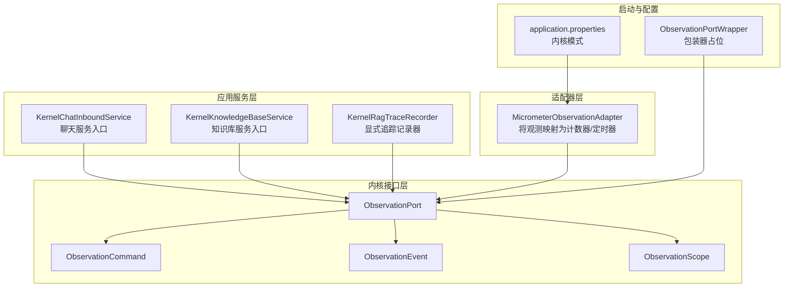
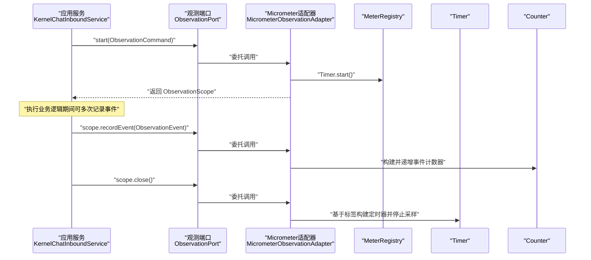
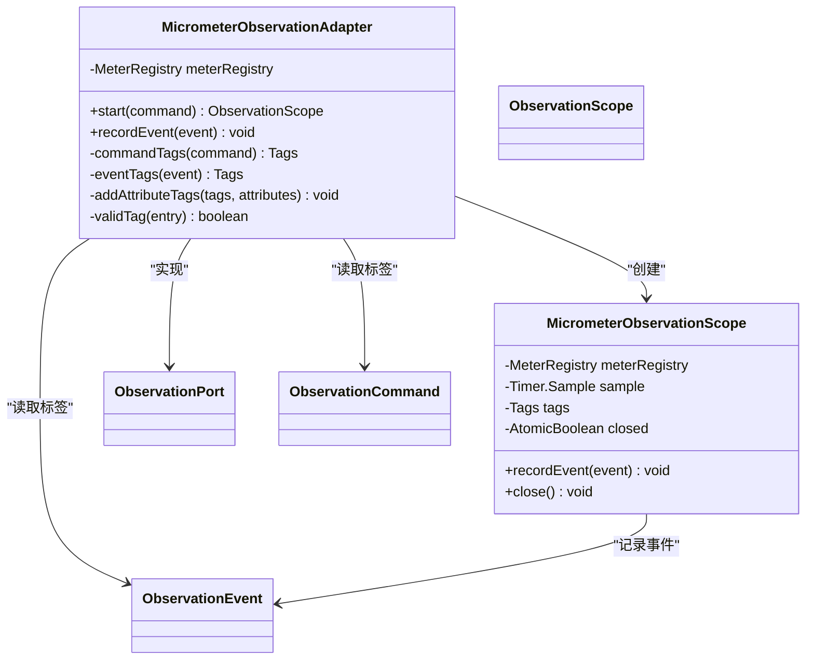
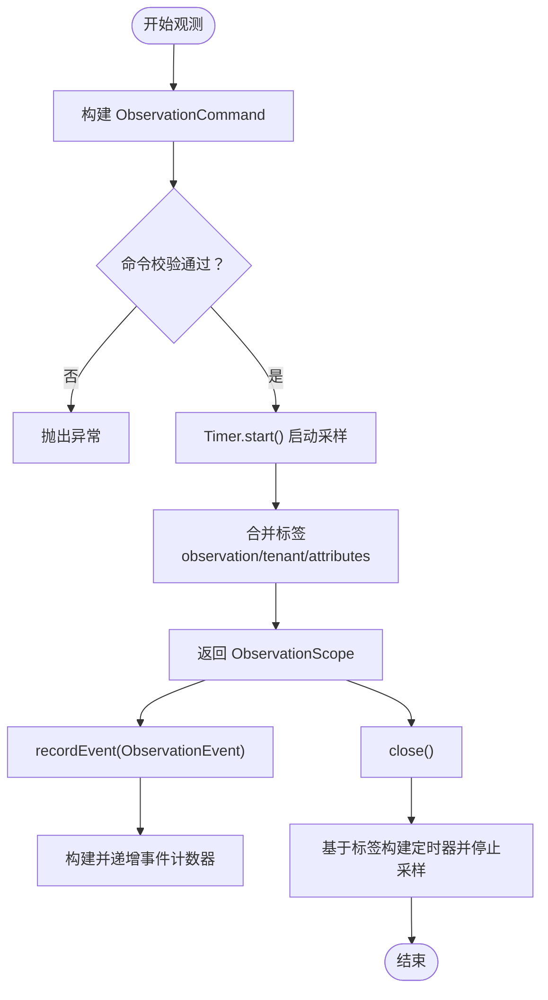
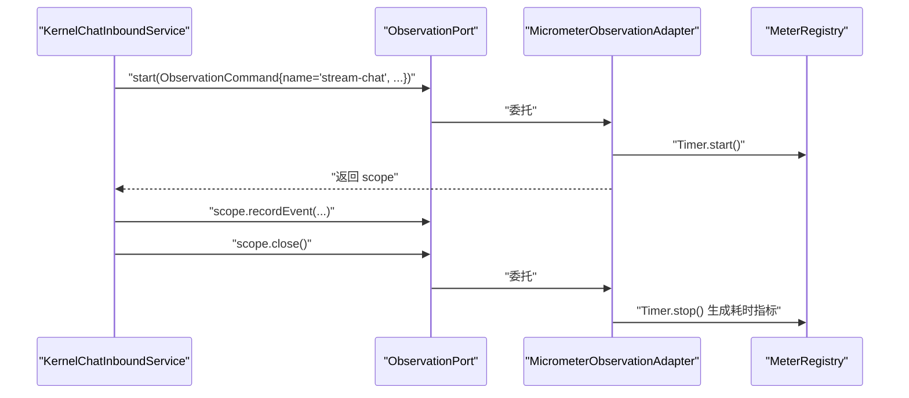
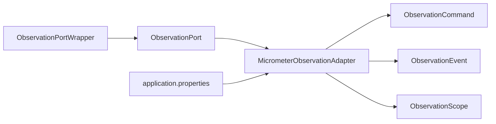

# 应用监控

<cite>
**本文引用的文件**
- [MicrometerObservationAdapter.java](file://seahorse-agent-adapter-observation-micrometer/src/main/java/com/miracle/ai/seahorse/agent/adapters/observation/micrometer/MicrometerObservationAdapter.java)
- [ObservationPort.java](file://seahorse-agent-kernel/src/main/java/com/miracle/ai/seahorse/agent/ports/outbound/observation/ObservationPort.java)
- [ObservationCommand.java](file://seahorse-agent-kernel/src/main/java/com/miracle/ai/seahorse/agent/ports/outbound/observation/ObservationCommand.java)
- [ObservationEvent.java](file://seahorse-agent-kernel/src/main/java/com/miracle/ai/seahorse/agent/ports/outbound/observation/ObservationEvent.java)
- [ObservationScope.java](file://seahorse-agent-kernel/src/main/java/com/miracle/ai/seahorse/agent/ports/outbound/observation/ObservationScope.java)
- [ObservationPortWrapper.java](file://seahorse-agent-kernel/src/main/java/com/miracle/ai/seahorse/agent/kernel/plugin/wrapper/ObservationPortWrapper.java)
- [KernelRagTraceRecorder.java](file://seahorse-agent-kernel/src/main/java/com/miracle/ai/seahorse/agent/kernel/application/trace/KernelRagTraceRecorder.java)
- [KernelChatInboundService.java](file://seahorse-agent-kernel/src/main/java/com/miracle/ai/seahorse/agent/kernel/application/chat/KernelChatInboundService.java)
- [KernelKnowledgeBaseService.java](file://seahorse-agent-kernel/src/main/java/com/miracle/ai/seahorse/agent/kernel/application/knowledge/KernelKnowledgeBaseService.java)
- [application.properties](file://seahorse-agent-spring-boot-autoconfigure/src/main/resources/application.properties)
- [com.miracle.ai.seahorse.agent.ports.outbound.observation.ObservationPort](file://seahorse-agent-adapter-observation-micrometer/src/main/resources/META-INF/seahorse-agent/com.miracle.ai.seahorse.agent.ports.outbound.observation.ObservationPort)
</cite>

## 目录
1. [引言](#引言)
2. [项目结构](#项目结构)
3. [核心组件](#核心组件)
4. [架构总览](#架构总览)
5. [详细组件分析](#详细组件分析)
6. [依赖分析](#依赖分析)
7. [性能考量](#性能考量)
8. [故障排查指南](#故障排查指南)
9. [结论](#结论)
10. [附录](#附录)

## 引言
本文件面向应用监控与可观测性，聚焦于 Micrometer 观测性适配器的实现原理与使用方法，涵盖指标采集机制、指标分类（计数器、定时器、标签管理）、指标暴露方式；并深入解析观测命令与事件的处理流程（ObservationCommand 的构建、ObservationEvent 的记录、ObservationScope 的生命周期管理）。同时提供在聊天服务、知识管理、会话管理等核心业务模块中的监控埋点实践建议，并总结命名规范、标签体系设计与性能影响评估的最佳实践。最后说明如何配置不同 MeterRegistry 实现以对接 InfluxDB、Prometheus、CloudWatch 等外部监控系统。

## 项目结构
本项目采用多模块分层组织，与监控相关的关键模块如下：
- 适配器层：Micrometer 观测适配器实现，负责将内核观测端口映射到 Micrometer 指标。
- 内核接口层：定义观测命令、事件、作用域与端口的 SPI 接口。
- 应用服务层：在核心业务入口（如聊天、知识库）围绕执行链路进行观测与追踪。
- 启动与配置：Spring Boot Starter 提供默认内核模式配置，便于加载适配器。

**图表来源**
- [MicrometerObservationAdapter.java:42-137](file://seahorse-agent-adapter-observation-micrometer/src/main/java/com/miracle/ai/seahorse/agent/adapters/observation/micrometer/MicrometerObservationAdapter.java#L42-L137)
- [ObservationPort.java:25-42](file://seahorse-agent-kernel/src/main/java/com/miracle/ai/seahorse/agent/ports/outbound/observation/ObservationPort.java#L25-L42)
- [ObservationCommand.java:30-39](file://seahorse-agent-kernel/src/main/java/com/miracle/ai/seahorse/agent/ports/outbound/observation/ObservationCommand.java#L30-L39)
- [ObservationEvent.java:31-40](file://seahorse-agent-kernel/src/main/java/com/miracle/ai/seahorse/agent/ports/outbound/observation/ObservationEvent.java#L31-L40)
- [ObservationScope.java:23-34](file://seahorse-agent-kernel/src/main/java/com/miracle/ai/seahorse/agent/ports/outbound/observation/ObservationScope.java#L23-L34)
- [KernelChatInboundService.java:34-94](file://seahorse-agent-kernel/src/main/java/com/miracle/ai/seahorse/agent/kernel/application/chat/KernelChatInboundService.java#L34-L94)
- [KernelKnowledgeBaseService.java:40-142](file://seahorse-agent-kernel/src/main/java/com/miracle/ai/seahorse/agent/kernel/application/knowledge/KernelKnowledgeBaseService.java#L40-L142)
- [KernelRagTraceRecorder.java:41-211](file://seahorse-agent-kernel/src/main/java/com/miracle/ai/seahorse/agent/kernel/application/trace/KernelRagTraceRecorder.java#L41-L211)
- [application.properties:1-2](file://seahorse-agent-spring-boot-autoconfigure/src/main/resources/application.properties#L1-L2)
- [ObservationPortWrapper.java:27-43](file://seahorse-agent-kernel/src/main/java/com/miracle/ai/seahorse/agent/kernel/plugin/wrapper/ObservationPortWrapper.java#L27-L43)

**章节来源**
- [application.properties:1-2](file://seahorse-agent-spring-boot-autoconfigure/src/main/resources/application.properties#L1-L2)

## 核心组件
- MicrometerObservationAdapter：将内核观测端口转换为 Micrometer 的计数器与定时器指标，支持自定义 MeterRegistry 注入，不依赖 Spring Boot 自动装配。
- ObservationPort：观测端口 SPI，默认实现为“空操作”（noop），可通过 SPI 配置替换为 Micrometer 实现。
- ObservationCommand：观测开始命令，包含观测名称、租户标识与属性映射。
- ObservationEvent：观测事件，包含事件名称、发生时间与属性映射。
- ObservationScope：观测生命周期句柄，支持在作用域内记录事件并在关闭时生成耗时指标。
- ObservationPortWrapper：观测包装器占位，固定包装链顺序，具体观测逻辑由适配器提供。
- KernelRagTraceRecorder：显式追踪记录器，用于记录 RAG 执行链路的运行与节点状态，与观测指标互补。

**章节来源**
- [MicrometerObservationAdapter.java:42-137](file://seahorse-agent-adapter-observation-micrometer/src/main/java/com/miracle/ai/seahorse/agent/adapters/observation/micrometer/MicrometerObservationAdapter.java#L42-L137)
- [ObservationPort.java:25-42](file://seahorse-agent-kernel/src/main/java/com/miracle/ai/seahorse/agent/ports/outbound/observation/ObservationPort.java#L25-L42)
- [ObservationCommand.java:30-39](file://seahorse-agent-kernel/src/main/java/com/miracle/ai/seahorse/agent/ports/outbound/observation/ObservationCommand.java#L30-L39)
- [ObservationEvent.java:31-40](file://seahorse-agent-kernel/src/main/java/com/miracle/ai/seahorse/agent/ports/outbound/observation/ObservationEvent.java#L31-L40)
- [ObservationScope.java:23-34](file://seahorse-agent-kernel/src/main/java/com/miracle/ai/seahorse/agent/ports/outbound/observation/ObservationScope.java#L23-L34)
- [ObservationPortWrapper.java:27-43](file://seahorse-agent-kernel/src/main/java/com/miracle/ai/seahorse/agent/kernel/plugin/wrapper/ObservationPortWrapper.java#L27-L43)
- [KernelRagTraceRecorder.java:41-211](file://seahorse-agent-kernel/src/main/java/com/miracle/ai/seahorse/agent/kernel/application/trace/KernelRagTraceRecorder.java#L41-L211)

## 架构总览
下图展示了从应用服务到观测端口再到 Micrometer 的完整调用链路，以及指标生成与标签传递的关键路径。

**图表来源**
- [KernelChatInboundService.java:56-73](file://seahorse-agent-kernel/src/main/java/com/miracle/ai/seahorse/agent/kernel/application/chat/KernelChatInboundService.java#L56-L73)
- [MicrometerObservationAdapter.java:56-134](file://seahorse-agent-adapter-observation-micrometer/src/main/java/com/miracle/ai/seahorse/agent/adapters/observation/micrometer/MicrometerObservationAdapter.java#L56-L134)
- [ObservationPort.java:25-42](file://seahorse-agent-kernel/src/main/java/com/miracle/ai/seahorse/agent/ports/outbound/observation/ObservationPort.java#L25-L42)
- [ObservationScope.java:23-34](file://seahorse-agent-kernel/src/main/java/com/miracle/ai/seahorse/agent/ports/outbound/observation/ObservationScope.java#L23-L34)

## 详细组件分析

### Micrometer 观测适配器实现
- 指标类型与命名
  - 持续时间指标：用于记录观测生命周期内的耗时，名称为固定常量。
  - 事件计数指标：用于记录独立事件的发生次数，名称为固定常量。
- 标签体系
  - 观测维度：observation（来自命令名称）、tenant（来自命令租户标识）。
  - 事件维度：event（来自事件名称）。
  - 属性维度：从命令与事件的 attributes 映射中提取有效键值对作为标签。
- 生命周期管理
  - start：启动计时采样，合并标签后返回作用域实例。
  - recordEvent：在作用域内或独立记录事件计数器。
  - close：在作用域关闭时，基于标签构建定时器并停止采样，完成耗时统计。

**图表来源**
- [MicrometerObservationAdapter.java:42-137](file://seahorse-agent-adapter-observation-micrometer/src/main/java/com/miracle/ai/seahorse/agent/adapters/observation/micrometer/MicrometerObservationAdapter.java#L42-L137)
- [ObservationPort.java:25-42](file://seahorse-agent-kernel/src/main/java/com/miracle/ai/seahorse/agent/ports/outbound/observation/ObservationPort.java#L25-L42)
- [ObservationScope.java:23-34](file://seahorse-agent-kernel/src/main/java/com/miracle/ai/seahorse/agent/ports/outbound/observation/ObservationScope.java#L23-L34)
- [ObservationCommand.java:30-39](file://seahorse-agent-kernel/src/main/java/com/miracle/ai/seahorse/agent/ports/outbound/observation/ObservationCommand.java#L30-L39)
- [ObservationEvent.java:31-40](file://seahorse-agent-kernel/src/main/java/com/miracle/ai/seahorse/agent/ports/outbound/observation/ObservationEvent.java#L31-L40)

**章节来源**
- [MicrometerObservationAdapter.java:42-137](file://seahorse-agent-adapter-observation-micrometer/src/main/java/com/miracle/ai/seahorse/agent/adapters/observation/micrometer/MicrometerObservationAdapter.java#L42-L137)

### 观测命令与事件处理流程
- ObservationCommand 构建
  - 必填字段：name（非空校验）、tenantId（为空则补位为空字符串）、attributes（为空则补位为空映射）。
- ObservationEvent 记录
  - 必填字段：name（非空校验）、occurredAt（为空则使用当前时间）、attributes（为空则补位为空映射）。
- ObservationScope 生命周期
  - 在作用域内可重复记录事件计数器。
  - 关闭时仅允许一次性停止计时采样，避免重复开销。

**图表来源**
- [ObservationCommand.java:30-39](file://seahorse-agent-kernel/src/main/java/com/miracle/ai/seahorse/agent/ports/outbound/observation/ObservationCommand.java#L30-L39)
- [ObservationEvent.java:31-40](file://seahorse-agent-kernel/src/main/java/com/miracle/ai/seahorse/agent/ports/outbound/observation/ObservationEvent.java#L31-L40)
- [MicrometerObservationAdapter.java:56-134](file://seahorse-agent-adapter-observation-micrometer/src/main/java/com/miracle/ai/seahorse/agent/adapters/observation/micrometer/MicrometerObservationAdapter.java#L56-L134)

**章节来源**
- [ObservationCommand.java:30-39](file://seahorse-agent-kernel/src/main/java/com/miracle/ai/seahorse/agent/ports/outbound/observation/ObservationCommand.java#L30-L39)
- [ObservationEvent.java:31-40](file://seahorse-agent-kernel/src/main/java/com/miracle/ai/seahorse/agent/ports/outbound/observation/ObservationEvent.java#L31-L40)
- [ObservationScope.java:23-34](file://seahorse-agent-kernel/src/main/java/com/miracle/ai/seahorse/agent/ports/outbound/observation/ObservationScope.java#L23-L34)

### 在业务模块中集成监控埋点

#### 聊天服务（KernelChatInboundService）
- 入口：streamChat
- 建议埋点
  - 使用 ObservationPort.start 创建观测，名称可设为“stream-chat”，携带 conversationId、taskId、userId 等属性标签。
  - 在执行过程中，针对关键子步骤（如检索、生成、回调）记录独立事件。
  - 在 finally 分支中确保 scope.close() 被调用，以便生成耗时指标。

**图表来源**
- [KernelChatInboundService.java:56-73](file://seahorse-agent-kernel/src/main/java/com/miracle/ai/seahorse/agent/kernel/application/chat/KernelChatInboundService.java#L56-L73)
- [MicrometerObservationAdapter.java:56-134](file://seahorse-agent-adapter-observation-micrometer/src/main/java/com/miracle/ai/seahorse/agent/adapters/observation/micrometer/MicrometerObservationAdapter.java#L56-L134)

**章节来源**
- [KernelChatInboundService.java:56-73](file://seahorse-agent-kernel/src/main/java/com/miracle/ai/seahorse/agent/kernel/application/chat/KernelChatInboundService.java#L56-L73)

#### 知识库服务（KernelKnowledgeBaseService）
- 建议埋点
  - 对于创建、更新、删除等关键操作，分别建立独立观测，名称可分别为“create-kb”、“update-kb”、“delete-kb”。
  - 将 kbId、operator、embeddingModel 等作为属性标签，便于跨操作对比分析。
  - 在每个操作内部，针对存储桶检查、向量集合管理等子步骤记录事件。

**章节来源**
- [KernelKnowledgeBaseService.java:57-101](file://seahorse-agent-kernel/src/main/java/com/miracle/ai/seahorse/agent/kernel/application/knowledge/KernelKnowledgeBaseService.java#L57-L101)

#### 会话管理与通用建议
- 建议在所有对外请求入口（如会话查询、消息发送）统一使用 ObservationPort 进行观测。
- 事件命名建议采用“动作-对象-结果”的组合，例如“search-vector-success”、“embed-chunks-failed”。

### 指标分类与暴露方式
- 指标类型
  - 定时器：seahorse.agent.observation.duration，用于记录观测生命周期耗时。
  - 计数器：seahorse.agent.observation.events，用于记录独立事件发生次数。
- 标签体系
  - 观测标签：observation（观测名称）、tenant（租户标识）、自定义属性标签。
  - 事件标签：event（事件名称）、自定义属性标签。
- 暴露方式
  - 通过注入的 MeterRegistry 将指标注册到 Micrometer，再由外部系统（Prometheus、InfluxDB、CloudWatch 等）抓取。

**章节来源**
- [MicrometerObservationAdapter.java:44-48](file://seahorse-agent-adapter-observation-micrometer/src/main/java/com/miracle/ai/seahorse/agent/adapters/observation/micrometer/MicrometerObservationAdapter.java#L44-L48)
- [MicrometerObservationAdapter.java:73-88](file://seahorse-agent-adapter-observation-micrometer/src/main/java/com/miracle/ai/seahorse/agent/adapters/observation/micrometer/MicrometerObservationAdapter.java#L73-L88)

### 与显式追踪的关系
- KernelRagTraceRecorder 提供显式追踪能力，记录运行与节点的开始、结束与错误信息，适合问题定位与链路可视化。
- 观测指标更偏向于度量与聚合，二者结合可实现“可观测性+可追踪”的双轨保障。

**章节来源**
- [KernelRagTraceRecorder.java:66-110](file://seahorse-agent-kernel/src/main/java/com/miracle/ai/seahorse/agent/kernel/application/trace/KernelRagTraceRecorder.java#L66-L110)

## 依赖分析
- 适配器与接口耦合
  - MicrometerObservationAdapter 实现 ObservationPort，依赖 ObservationCommand、ObservationEvent、ObservationScope。
- 包装器与加载
  - ObservationPortWrapper 固定包装链顺序，配合 SPI 配置文件选择 Micrometer 实现。
- 默认内核模式
  - application.properties 设置内核运行模式，确保适配器被正确加载。

**图表来源**
- [ObservationPortWrapper.java:27-43](file://seahorse-agent-kernel/src/main/java/com/miracle/ai/seahorse/agent/kernel/plugin/wrapper/ObservationPortWrapper.java#L27-L43)
- [ObservationPort.java:25-42](file://seahorse-agent-kernel/src/main/java/com/miracle/ai/seahorse/agent/ports/outbound/observation/ObservationPort.java#L25-L42)
- [MicrometerObservationAdapter.java:42-137](file://seahorse-agent-adapter-observation-micrometer/src/main/java/com/miracle/ai/seahorse/agent/adapters/observation/micrometer/MicrometerObservationAdapter.java#L42-L137)
- [application.properties:1-2](file://seahorse-agent-spring-boot-autoconfigure/src/main/resources/application.properties#L1-L2)

**章节来源**
- [com.miracle.ai.seahorse.agent.ports.outbound.observation.ObservationPort:1-4](file://seahorse-agent-adapter-observation-micrometer/src/main/resources/META-INF/seahorse-agent/com.miracle.ai.seahorse.agent.ports.outbound.observation.ObservationPort#L1-L4)

## 性能考量
- 指标开销
  - 计数器与定时器均为轻量级操作，但在高频事件场景下仍需控制标签基数与事件频率。
- 标签基数
  - 避免动态高基数标签（如用户输入内容、具体 ID 列表），优先使用稳定枚举或归一化键值。
- 采样与批处理
  - 对于高频事件，可考虑在应用侧聚合后再上报，降低指标数量与网络开销。
- 关闭时机
  - 确保 ObservationScope 在 finally 中关闭，避免未停止的采样导致内存泄漏与指标失真。

## 故障排查指南
- 常见问题
  - 观测指标缺失：确认 ObservationPort 已被 Micrometer 实现替换，且 MeterRegistry 注入成功。
  - 标签异常：检查 attributes 是否包含空键或空值，适配器会对无效条目进行过滤。
  - 事件未统计：确认 recordEvent 调用发生在作用域内或独立调用均有效。
  - 耗时指标为零：检查是否正确调用 scope.close()，以及 Timer.start 是否在 start 中调用。
- 排查步骤
  - 在关键入口打印观测命令与事件信息，验证标签与名称。
  - 临时切换为 noop 适配器，确认业务逻辑不受观测代码影响。
  - 检查包装器链顺序与诊断信息，避免同名或冲突顺序导致的异常。

**章节来源**
- [MicrometerObservationAdapter.java:98-102](file://seahorse-agent-adapter-observation-micrometer/src/main/java/com/miracle/ai/seahorse/agent/adapters/observation/micrometer/MicrometerObservationAdapter.java#L98-L102)
- [ObservationPortWrapper.java:77-93](file://seahorse-agent-kernel/src/main/java/com/miracle/ai/seahorse/agent/kernel/plugin/wrapper/ObservationPortWrapper.java#L77-L93)

## 结论
Micrometer 观测适配器提供了与运行时解耦的指标采集能力，通过统一的 ObservationCommand/Event/Scope 抽象，将业务执行过程转化为可聚合、可对比的指标数据。结合显式追踪与合理的标签设计，可在不侵入业务逻辑的前提下，获得高质量的运行时洞察。建议在核心业务模块中统一接入观测端口，并遵循命名与标签规范，持续优化指标基数与上报策略。

## 附录

### 指标命名规范与标签体系设计
- 命名规范
  - 指标前缀：seahorse.agent.observation
  - 持续时间：duration
  - 事件计数：events
- 标签体系
  - 观测标签：observation（观测名称）、tenant（租户标识）
  - 事件标签：event（事件名称）
  - 属性标签：从 attributes 中提取，过滤空键与空值
- 最佳实践
  - 控制标签基数，避免高基数动态键
  - 事件命名采用“动作-对象-结果”结构
  - 在作用域内记录关键子步骤事件，统一在关闭时生成耗时指标

### 外部监控系统集成方案
- Prometheus
  - 使用 Micrometer 提供的 Prometheus Registry，通过 HTTP 暴露指标端点，Prometheus 抓取。
- InfluxDB
  - 使用 Micrometer 的 InfluxMeterRegistry，配置 InfluxDB 端点与认证，自动上报指标。
- CloudWatch
  - 使用 Micrometer 的 CloudWatchMeterRegistry，配置区域与凭证，按维度上报指标。
- 其他
  - 可根据需要引入相应 Micrometer Registry 实现，统一通过 MeterRegistry 注入与适配器对接。