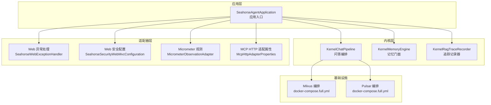
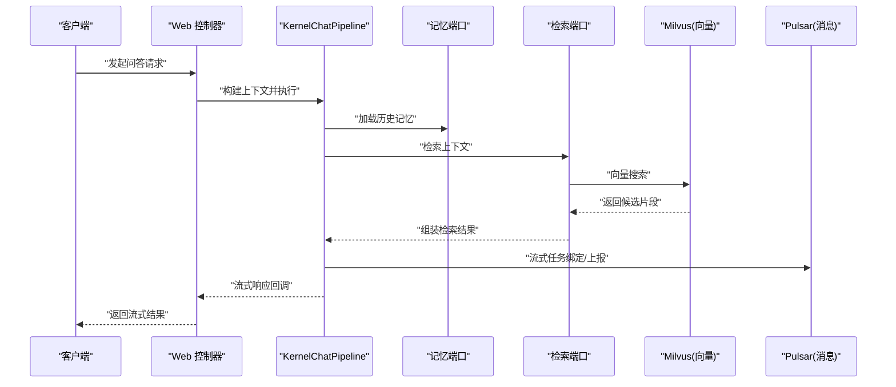
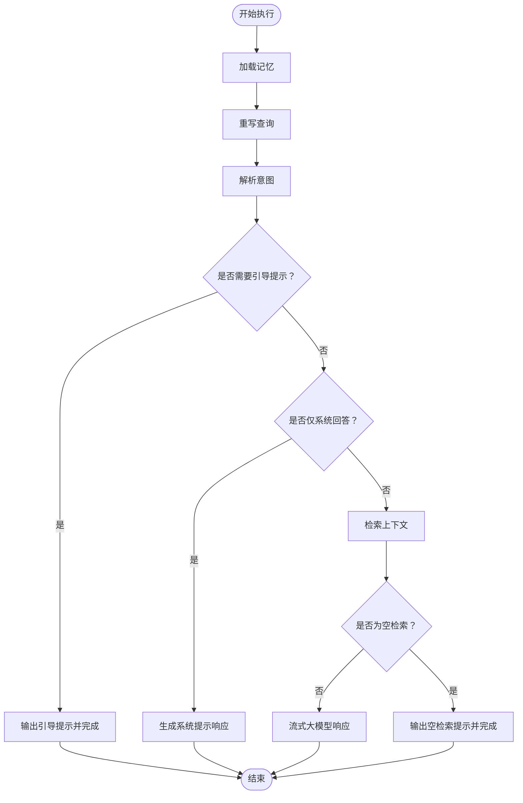
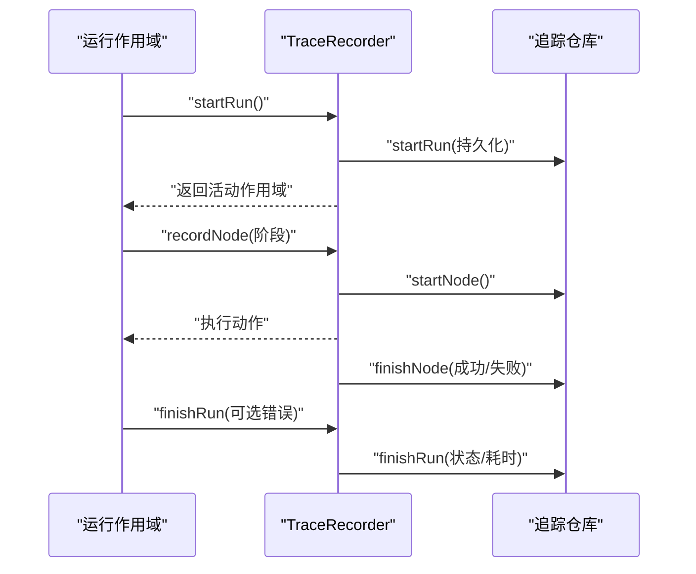
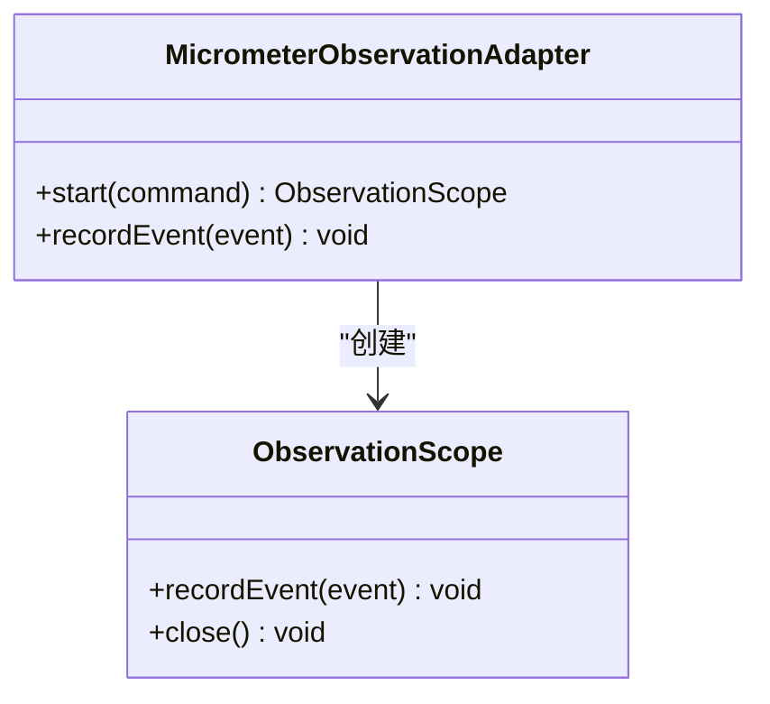
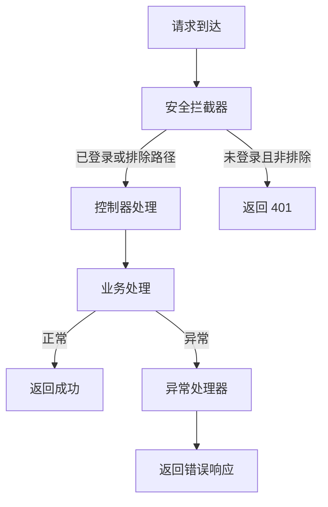
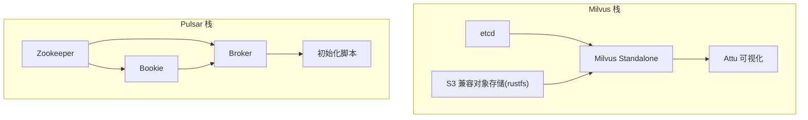
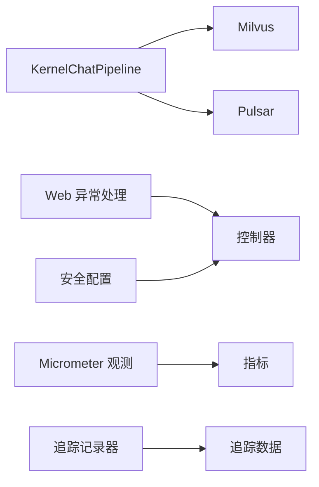
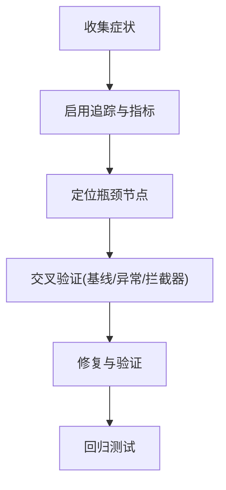

# 故障排查

<cite>
**本文引用的文件**   
- [SeahorseAgentApplication.java](file://seahorse-agent-bootstrap/src/main/java/com/miracle/ai/seahorse/agent/SeahorseAgentApplication.java)
- [SeahorseWebExceptionHandler.java](file://seahorse-agent-adapter-web/src/main/java/com/miracle/ai/seahorse/agent/adapters/web/SeahorseWebExceptionHandler.java)
- [KernelChatPipeline.java](file://seahorse-agent-kernel/src/main/java/com/miracle/ai/seahorse/agent/kernel/application/chat/KernelChatPipeline.java)
- [KernelMemoryEngine.java](file://seahorse-agent-kernel/src/main/java/com/miracle/ai/seahorse/agent/kernel/application/memory/KernelMemoryEngine.java)
- [MicrometerObservationAdapter.java](file://seahorse-agent-adapter-observation-micrometer/src/main/java/com/miracle/ai/seahorse/agent/adapters/observation/micrometer/MicrometerObservationAdapter.java)
- [SeahorseAgentKernelAutoConfiguration.java](file://seahorse-agent-spring-boot-autoconfigure/src/main/java/com/miracle/ai/seahorse/agent/adapters/spring/SeahorseAgentKernelAutoConfiguration.java)
- [KernelRagTraceRecorder.java](file://seahorse-agent-kernel/src/main/java/com/miracle/ai/seahorse/agent/kernel/application/trace/KernelRagTraceRecorder.java)
- [docker-compose.full.yml](file://docker-compose.full.yml)
- [docker-compose.full.yml](file://docker-compose.full.yml)
- [SeahorseSecurityWebMvcConfiguration.java](file://seahorse-agent-adapter-web/src/main/java/com/miracle/ai/seahorse/agent/adapters/web/SeahorseSecurityWebMvcConfiguration.java)
- [McpHttpAdapterProperties.java](file://seahorse-agent-adapter-mcp-http/src/main/java/com/miracle/ai/seahorse/agent/adapters/mcp/http/McpHttpAdapterProperties.java)
- [DashboardPage.tsx](file://frontend/src/pages/admin/dashboard/DashboardPage.tsx)
- [application.properties](file://seahorse-agent-spring-boot-autoconfigure/src/main/resources/application.properties)
- [rag-baseline.json](file://docs/USER_GUIDE.md)
</cite>

## 目录
1. [简介](#简介)
2. [项目结构](#项目结构)
3. [核心组件](#核心组件)
4. [架构总览](#架构总览)
5. [详细组件分析](#详细组件分析)
6. [依赖分析](#依赖分析)
7. [性能考量](#性能考量)
8. [故障排查指南](#故障排查指南)
9. [结论](#结论)
10. [附录](#附录)

## 简介
本指南面向运维与开发人员，提供系统性的故障排查方法论与实操步骤，覆盖启动失败、连接超时、内存溢出、性能下降、数据不一致等典型问题，并结合本项目的可观测性、追踪与基础设施编排能力，给出可落地的诊断与修复建议。

## 项目结构
该项目采用多模块分层设计，包含内核、适配器、前端与资源编排脚本。关键结构如下：
- 启动入口：Spring Boot 应用入口负责应用初始化与调度。
- 内核模块：封装问答、检索、记忆、特征与追踪等核心编排逻辑。
- 适配器模块：对接缓存、消息队列、向量库、观察与 Web 层等外部系统。
- 前端模块：管理后台仪表盘与页面组件，提供指标可视化。
- 资源编排：Docker Compose 提供 Milvus、Pulsar 等依赖服务的快速部署与健康检查。

**图表来源**
- [SeahorseAgentApplication.java:30-36](file://seahorse-agent-bootstrap/src/main/java/com/miracle/ai/seahorse/agent/SeahorseAgentApplication.java#L30-L36)
- [KernelChatPipeline.java:83-106](file://seahorse-agent-kernel/src/main/java/com/miracle/ai/seahorse/agent/kernel/application/chat/KernelChatPipeline.java#L83-L106)
- [KernelMemoryEngine.java:35-62](file://seahorse-agent-kernel/src/main/java/com/miracle/ai/seahorse/agent/kernel/application/memory/KernelMemoryEngine.java#L35-L62)
- [KernelRagTraceRecorder.java:66-110](file://seahorse-agent-kernel/src/main/java/com/miracle/ai/seahorse/agent/kernel/application/trace/KernelRagTraceRecorder.java#L66-L110)
- [SeahorseWebExceptionHandler.java:31-59](file://seahorse-agent-adapter-web/src/main/java/com/miracle/ai/seahorse/agent/adapters/web/SeahorseWebExceptionHandler.java#L31-L59)
- [SeahorseSecurityWebMvcConfiguration.java:30-50](file://seahorse-agent-adapter-web/src/main/java/com/miracle/ai/seahorse/agent/adapters/web/SeahorseSecurityWebMvcConfiguration.java#L30-L50)
- [MicrometerObservationAdapter.java:42-71](file://seahorse-agent-adapter-observation-micrometer/src/main/java/com/miracle/ai/seahorse/agent/adapters/observation/micrometer/MicrometerObservationAdapter.java#L42-L71)
- [McpHttpAdapterProperties.java:33-64](file://seahorse-agent-adapter-mcp-http/src/main/java/com/miracle/ai/seahorse/agent/adapters/mcp/http/McpHttpAdapterProperties.java#L33-L64)
- [docker-compose.full.yml](file://docker-compose.full.yml)
- [docker-compose.full.yml](file://docker-compose.full.yml)

**章节来源**
- [SeahorseAgentApplication.java:30-36](file://seahorse-agent-bootstrap/src/main/java/com/miracle/ai/seahorse/agent/SeahorseAgentApplication.java#L30-L36)
- [application.properties:1-2](file://seahorse-agent-spring-boot-autoconfigure/src/main/resources/application.properties#L1-L2)

## 核心组件
- 应用入口与自动装配：应用入口启用调度与命名空间扫描；自动装配负责注册内核编排、特征、端口与作业调度。
- 问答编排：严格顺序的问答链路，包含加载记忆、重写查询、意图解析、引导提示、检索、空检索处理与流式响应。
- 记忆门面：统一加载、写入、检索、衰减与质量评估接口。
- 追踪记录器：对运行与节点进行生命周期记录，支持错误清洗与降级。
- 观测适配：基于 Micrometer 的计时与事件指标输出，支持标签化与运行时注入。
- Web 异常处理：集中捕获异常并返回标准化错误响应。
- 安全配置：基于 Sa-Token 的拦截器，排除异步与 OPTIONS 请求。
- 基础设施编排：Milvus 与 Pulsar 的健康检查与依赖关系定义。

**章节来源**
- [SeahorseAgentKernelAutoConfiguration.java:188-431](file://seahorse-agent-spring-boot-autoconfigure/src/main/java/com/miracle/ai/seahorse/agent/adapters/spring/SeahorseAgentKernelAutoConfiguration.java#L188-L431)
- [KernelChatPipeline.java:83-106](file://seahorse-agent-kernel/src/main/java/com/miracle/ai/seahorse/agent/kernel/application/chat/KernelChatPipeline.java#L83-L106)
- [KernelMemoryEngine.java:35-62](file://seahorse-agent-kernel/src/main/java/com/miracle/ai/seahorse/agent/kernel/application/memory/KernelMemoryEngine.java#L35-L62)
- [KernelRagTraceRecorder.java:66-110](file://seahorse-agent-kernel/src/main/java/com/miracle/ai/seahorse/agent/kernel/application/trace/KernelRagTraceRecorder.java#L66-L110)
- [MicrometerObservationAdapter.java:42-71](file://seahorse-agent-adapter-observation-micrometer/src/main/java/com/miracle/ai/seahorse/agent/adapters/observation/micrometer/MicrometerObservationAdapter.java#L42-L71)
- [SeahorseWebExceptionHandler.java:31-59](file://seahorse-agent-adapter-web/src/main/java/com/miracle/ai/seahorse/agent/adapters/web/SeahorseWebExceptionHandler.java#L31-L59)
- [SeahorseSecurityWebMvcConfiguration.java:30-50](file://seahorse-agent-adapter-web/src/main/java/com/miracle/ai/seahorse/agent/adapters/web/SeahorseSecurityWebMvcConfiguration.java#L30-L50)
- [docker-compose.full.yml](file://docker-compose.full.yml)
- [docker-compose.full.yml](file://docker-compose.full.yml)

## 架构总览
下图展示从请求到响应的关键路径，以及与外部系统的交互点（向量库、消息队列）。

**图表来源**
- [KernelChatPipeline.java:83-106](file://seahorse-agent-kernel/src/main/java/com/miracle/ai/seahorse/agent/kernel/application/chat/KernelChatPipeline.java#L83-L106)
- [docker-compose.full.yml](file://docker-compose.full.yml)
- [docker-compose.full.yml](file://docker-compose.full.yml)

## 详细组件分析

### 组件一：问答编排 KernelChatPipeline
- 关键职责：按固定顺序执行记忆加载、查询重写、意图解析、引导提示、系统仅回答、检索、空检索处理与流式响应。
- 重要特性：在每个阶段使用追踪记录器包装，便于定位耗时与失败节点。
- 失败处理：若检索为空，直接返回预设提示；否则继续流式模型调用。

**图表来源**
- [KernelChatPipeline.java:83-106](file://seahorse-agent-kernel/src/main/java/com/miracle/ai/seahorse/agent/kernel/application/chat/KernelChatPipeline.java#L83-L106)
- [KernelChatPipeline.java:108-173](file://seahorse-agent-kernel/src/main/java/com/miracle/ai/seahorse/agent/kernel/application/chat/KernelChatPipeline.java#L108-L173)

**章节来源**
- [KernelChatPipeline.java:83-106](file://seahorse-agent-kernel/src/main/java/com/miracle/ai/seahorse/agent/kernel/application/chat/KernelChatPipeline.java#L83-L106)
- [KernelChatPipeline.java:108-173](file://seahorse-agent-kernel/src/main/java/com/miracle/ai/seahorse/agent/kernel/application/chat/KernelChatPipeline.java#L108-L173)

### 组件二：追踪记录器 KernelRagTraceRecorder
- 关键职责：记录运行与节点的开始/结束、状态与耗时；对异常进行清洗并限制长度；在异常时降级为禁用模式以保证稳定性。
- 适用场景：定位慢节点、失败节点与跨组件调用瓶颈。

**图表来源**
- [KernelRagTraceRecorder.java:66-110](file://seahorse-agent-kernel/src/main/java/com/miracle/ai/seahorse/agent/kernel/application/trace/KernelRagTraceRecorder.java#L66-L110)
- [KernelRagTraceRecorder.java:162-185](file://seahorse-agent-kernel/src/main/java/com/miracle/ai/seahorse/agent/kernel/application/trace/KernelRagTraceRecorder.java#L162-L185)

**章节来源**
- [KernelRagTraceRecorder.java:66-110](file://seahorse-agent-kernel/src/main/java/com/miracle/ai/seahorse/agent/kernel/application/trace/KernelRagTraceRecorder.java#L66-L110)
- [KernelRagTraceRecorder.java:162-185](file://seahorse-agent-kernel/src/main/java/com/miracle/ai/seahorse/agent/kernel/application/trace/KernelRagTraceRecorder.java#L162-L185)

### 组件三：观测适配 MicrometerObservationAdapter
- 关键职责：将命令与事件转化为 Micrometer 的计时与计数指标，支持标签化（如观察名称、租户、属性），并在作用域关闭时记录耗时。
- 适用场景：性能基线对比、热点路径识别与容量规划。

**图表来源**
- [MicrometerObservationAdapter.java:42-71](file://seahorse-agent-adapter-observation-micrometer/src/main/java/com/miracle/ai/seahorse/agent/adapters/observation/micrometer/MicrometerObservationAdapter.java#L42-L71)
- [MicrometerObservationAdapter.java:104-135](file://seahorse-agent-adapter-observation-micrometer/src/main/java/com/miracle/ai/seahorse/agent/adapters/observation/micrometer/MicrometerObservationAdapter.java#L104-L135)

**章节来源**
- [MicrometerObservationAdapter.java:42-71](file://seahorse-agent-adapter-observation-micrometer/src/main/java/com/miracle/ai/seahorse/agent/adapters/observation/micrometer/MicrometerObservationAdapter.java#L42-L71)
- [MicrometerObservationAdapter.java:104-135](file://seahorse-agent-adapter-observation-micrometer/src/main/java/com/miracle/ai/seahorse/agent/adapters/observation/micrometer/MicrometerObservationAdapter.java#L104-L135)

### 组件四：Web 异常处理与安全配置
- 异常处理：统一捕获非法参数、状态冲突与通用异常，返回标准化错误码与消息。
- 安全配置：对所有路径启用登录校验，排除异步与 OPTIONS 请求，避免误拦截。

**图表来源**
- [SeahorseSecurityWebMvcConfiguration.java:33-44](file://seahorse-agent-adapter-web/src/main/java/com/miracle/ai/seahorse/agent/adapters/web/SeahorseSecurityWebMvcConfiguration.java#L33-L44)
- [SeahorseWebExceptionHandler.java:36-52](file://seahorse-agent-adapter-web/src/main/java/com/miracle/ai/seahorse/agent/adapters/web/SeahorseWebExceptionHandler.java#L36-L52)

**章节来源**
- [SeahorseWebExceptionHandler.java:31-59](file://seahorse-agent-adapter-web/src/main/java/com/miracle/ai/seahorse/agent/adapters/web/SeahorseWebExceptionHandler.java#L31-L59)
- [SeahorseSecurityWebMvcConfiguration.java:30-50](file://seahorse-agent-adapter-web/src/main/java/com/miracle/ai/seahorse/agent/adapters/web/SeahorseSecurityWebMvcConfiguration.java#L30-L50)

### 组件五：基础设施编排（Milvus/Pulsar）
- Milvus：独立模式运行，依赖 etcd 与 S3 兼容对象存储，提供健康检查端点。
- Pulsar：Zookeeper/Bookie/Broker 分层服务，提供初始化脚本创建集群、租户、命名空间与分区主题。

**图表来源**
- [docker-compose.full.yml](file://docker-compose.full.yml)
- [docker-compose.full.yml](file://docker-compose.full.yml)

**章节来源**
- [docker-compose.full.yml](file://docker-compose.full.yml)
- [docker-compose.full.yml](file://docker-compose.full.yml)

## 依赖分析
- 组件耦合：内核编排通过端口抽象与自动装配解耦外部实现；Web 层通过异常处理器与安全配置统一接入。
- 外部依赖：向量库 Milvus 与消息队列 Pulsar 通过 Docker 编排提供高可用与健康检查。
- 观测与追踪：Micrometer 指标与自定义追踪记录器共同构成可观测性基础。

**图表来源**
- [KernelChatPipeline.java:83-106](file://seahorse-agent-kernel/src/main/java/com/miracle/ai/seahorse/agent/kernel/application/chat/KernelChatPipeline.java#L83-L106)
- [SeahorseWebExceptionHandler.java:31-59](file://seahorse-agent-adapter-web/src/main/java/com/miracle/ai/seahorse/agent/adapters/web/SeahorseWebExceptionHandler.java#L31-L59)
- [SeahorseSecurityWebMvcConfiguration.java:30-50](file://seahorse-agent-adapter-web/src/main/java/com/miracle/ai/seahorse/agent/adapters/web/SeahorseSecurityWebMvcConfiguration.java#L30-L50)
- [MicrometerObservationAdapter.java:42-71](file://seahorse-agent-adapter-observation-micrometer/src/main/java/com/miracle/ai/seahorse/agent/adapters/observation/micrometer/MicrometerObservationAdapter.java#L42-L71)
- [KernelRagTraceRecorder.java:66-110](file://seahorse-agent-kernel/src/main/java/com/miracle/ai/seahorse/agent/kernel/application/trace/KernelRagTraceRecorder.java#L66-L110)

**章节来源**
- [SeahorseAgentKernelAutoConfiguration.java:188-431](file://seahorse-agent-spring-boot-autoconfigure/src/main/java/com/miracle/ai/seahorse/agent/adapters/spring/SeahorseAgentKernelAutoConfiguration.java#L188-L431)

## 性能考量
- 性能基线：项目内置性能基线 JSON，包含问答首 Token、总耗时、检索、多通道检索、MCP 协调、记忆加载、模型路由与入库文档等关键指标的百分位与时长阈值。
- 指标采集：Micrometer 观测适配器提供计时与事件指标，可用于对比基线与识别回归。
- 可视化：前端仪表盘根据阈值对延迟、成功率、错误率、无文档率进行状态分级，辅助快速定位异常区间。

**章节来源**
- [rag-baseline.json:6-32](file://docs/USER_GUIDE.md#L6-L32)
- [MicrometerObservationAdapter.java:42-71](file://seahorse-agent-adapter-observation-micrometer/src/main/java/com/miracle/ai/seahorse/agent/adapters/observation/micrometer/MicrometerObservationAdapter.java#L42-L71)
- [DashboardPage.tsx:120-144](file://frontend/src/pages/admin/dashboard/DashboardPage.tsx#L120-L144)

## 故障排查指南

### 一、问题分类与症状识别
- 启动失败
  - 症状：应用无法启动、端口占用、配置加载失败。
  - 识别要点：查看应用入口与自动装配是否生效；确认内核模式配置。
- 连接超时
  - 症状：请求在网关/控制器阶段超时；下游服务（Milvus/Pulsar）不可达。
  - 识别要点：检查安全拦截器是否误拦截；验证基础设施健康检查。
- 内存溢出
  - 症状：GC 频繁、OOM、服务崩溃。
  - 识别要点：结合追踪记录器定位长时间运行节点；检查向量索引与消息队列堆积。
- 性能下降
  - 症状：首 Token 延迟升高、吞吐下降、P95/P99 回升。
  - 识别要点：对比性能基线；分析 Micrometer 指标与追踪节点耗时。
- 数据不一致
  - 症状：检索结果缺失、知识库更新不同步、反馈数据丢失。
  - 识别要点：检查消息队列订阅与入库流程；核对知识库刷新与向量索引。

**章节来源**
- [application.properties:1-2](file://seahorse-agent-spring-boot-autoconfigure/src/main/resources/application.properties#L1-L2)
- [SeahorseSecurityWebMvcConfiguration.java:33-44](file://seahorse-agent-adapter-web/src/main/java/com/miracle/ai/seahorse/agent/adapters/web/SeahorseSecurityWebMvcConfiguration.java#L33-L44)
- [docker-compose.full.yml](file://docker-compose.full.yml)
- [docker-compose.full.yml](file://docker-compose.full.yml)
- [rag-baseline.json:6-32](file://docs/USER_GUIDE.md#L6-L32)

### 二、根因分析流程
- 第一步：确认症状与影响范围（用户侧/服务侧/依赖侧）。
- 第二步：启用追踪与指标（开启追踪记录器与 Micrometer 指标）。
- 第三步：定位瓶颈（问答链路节点、检索、MCP 协调、向量库、消息队列）。
- 第四步：交叉验证（对比性能基线、查看异常处理器返回码、检查安全拦截器）。
- 第五步：修复与回归验证（调整阈值/扩容/修复依赖、回归测试）。

[本图为概念流程，无需图表来源]

### 三、常见问题排查步骤

#### 启动失败
- 步骤
  - 检查应用入口类与扫描包配置。
  - 确认内核模式配置项存在且有效。
  - 查看自动装配是否加载了必需 Bean（内核编排、特征、端口）。
- 工具与参考
  - 应用入口：[SeahorseAgentApplication.java:30-36](file://seahorse-agent-bootstrap/src/main/java/com/miracle/ai/seahorse/agent/SeahorseAgentApplication.java#L30-L36)
  - 内核模式配置：[application.properties:1-2](file://seahorse-agent-spring-boot-autoconfigure/src/main/resources/application.properties#L1-L2)
  - 自动装配清单：[SeahorseAgentKernelAutoConfiguration.java:188-431](file://seahorse-agent-spring-boot-autoconfigure/src/main/java/com/miracle/ai/seahorse/agent/adapters/spring/SeahorseAgentKernelAutoConfiguration.java#L188-L431)

**章节来源**
- [SeahorseAgentApplication.java:30-36](file://seahorse-agent-bootstrap/src/main/java/com/miracle/ai/seahorse/agent/SeahorseAgentApplication.java#L30-L36)
- [application.properties:1-2](file://seahorse-agent-spring-boot-autoconfigure/src/main/resources/application.properties#L1-L2)
- [SeahorseAgentKernelAutoConfiguration.java:188-431](file://seahorse-agent-spring-boot-autoconfigure/src/main/java/com/miracle/ai/seahorse/agent/adapters/spring/SeahorseAgentKernelAutoConfiguration.java#L188-L431)

#### 连接超时
- 步骤
  - 排查安全拦截器是否误拦截 OPTIONS 或异步请求。
  - 检查 Milvus/Pulsar 健康检查端点与容器状态。
  - 在 Web 层确认异常处理器是否返回超时相关错误。
- 工具与参考
  - 安全拦截器排除规则：[SeahorseSecurityWebMvcConfiguration.java:46-49](file://seahorse-agent-adapter-web/src/main/java/com/miracle/ai/seahorse/agent/adapters/web/SeahorseSecurityWebMvcConfiguration.java#L46-L49)
  - Milvus 健康检查：[docker-compose.full.yml](file://docker-compose.full.yml)
  - Pulsar 初始化与端口：[docker-compose.full.yml](file://docker-compose.full.yml)
  - 异常处理返回码：[SeahorseWebExceptionHandler.java:36-52](file://seahorse-agent-adapter-web/src/main/java/com/miracle/ai/seahorse/agent/adapters/web/SeahorseWebExceptionHandler.java#L36-L52)

**章节来源**
- [SeahorseSecurityWebMvcConfiguration.java:33-44](file://seahorse-agent-adapter-web/src/main/java/com/miracle/ai/seahorse/agent/adapters/web/SeahorseSecurityWebMvcConfiguration.java#L33-L44)
- [docker-compose.full.yml](file://docker-compose.full.yml)
- [docker-compose.full.yml](file://docker-compose.full.yml)
- [SeahorseWebExceptionHandler.java:36-52](file://seahorse-agent-adapter-web/src/main/java/com/miracle/ai/seahorse/agent/adapters/web/SeahorseWebExceptionHandler.java#L36-L52)

#### 内存溢出
- 步骤
  - 通过追踪记录器定位长时间运行节点（检索、MCP 协调、记忆加载）。
  - 对比性能基线中各阶段耗时与内存占用趋势。
  - 检查向量库与消息队列堆积情况，必要时扩容或清理。
- 工具与参考
  - 追踪记录器：[KernelRagTraceRecorder.java:66-110](file://seahorse-agent-kernel/src/main/java/com/miracle/ai/seahorse/agent/kernel/application/trace/KernelRagTraceRecorder.java#L66-L110)
  - 性能基线：[rag-baseline.json:6-32](file://docs/USER_GUIDE.md#L6-L32)

**章节来源**
- [KernelRagTraceRecorder.java:66-110](file://seahorse-agent-kernel/src/main/java/com/miracle/ai/seahorse/agent/kernel/application/trace/KernelRagTraceRecorder.java#L66-L110)
- [rag-baseline.json:6-32](file://docs/USER_GUIDE.md#L6-L32)

#### 性能下降
- 步骤
  - 对比 Micrometer 指标与性能基线百分位，识别回归阶段。
  - 使用追踪记录器定位耗时节点，结合异常处理器返回码判断是否由上游错误导致。
  - 前端仪表盘阈值辅助快速识别异常区间。
- 工具与参考
  - 指标适配器：[MicrometerObservationAdapter.java:42-71](file://seahorse-agent-adapter-observation-micrometer/src/main/java/com/miracle/ai/seahorse/agent/adapters/observation/micrometer/MicrometerObservationAdapter.java#L42-L71)
  - 基线对比：[rag-baseline.json:6-32](file://docs/USER_GUIDE.md#L6-L32)
  - 仪表盘阈值：[DashboardPage.tsx:120-144](file://frontend/src/pages/admin/dashboard/DashboardPage.tsx#L120-L144)

**章节来源**
- [MicrometerObservationAdapter.java:42-71](file://seahorse-agent-adapter-observation-micrometer/src/main/java/com/miracle/ai/seahorse/agent/adapters/observation/micrometer/MicrometerObservationAdapter.java#L42-L71)
- [rag-baseline.json:6-32](file://docs/USER_GUIDE.md#L6-L32)
- [DashboardPage.tsx:120-144](file://frontend/src/pages/admin/dashboard/DashboardPage.tsx#L120-L144)

#### 数据不一致
- 步骤
  - 检查消息队列订阅与主题分区配置，确认事件是否被正确消费。
  - 核对知识库刷新与向量索引流程，确保入库后及时建立索引。
  - 通过追踪记录器定位失败节点，结合异常处理器返回码定位上游错误。
- 工具与参考
  - Pulsar 主题初始化：[docker-compose.full.yml](file://docker-compose.full.yml)
  - 追踪记录器：[KernelRagTraceRecorder.java:66-110](file://seahorse-agent-kernel/src/main/java/com/miracle/ai/seahorse/agent/kernel/application/trace/KernelRagTraceRecorder.java#L66-L110)
  - 异常处理：[SeahorseWebExceptionHandler.java:36-52](file://seahorse-agent-adapter-web/src/main/java/com/miracle/ai/seahorse/agent/adapters/web/SeahorseWebExceptionHandler.java#L36-L52)

**章节来源**
- [docker-compose.full.yml](file://docker-compose.full.yml)
- [KernelRagTraceRecorder.java:66-110](file://seahorse-agent-kernel/src/main/java/com/miracle/ai/seahorse/agent/kernel/application/trace/KernelRagTraceRecorder.java#L66-L110)
- [SeahorseWebExceptionHandler.java:36-52](file://seahorse-agent-adapter-web/src/main/java/com/miracle/ai/seahorse/agent/adapters/web/SeahorseWebExceptionHandler.java#L36-L52)

### 四、性能分析技巧
- CPU 使用率分析：结合 Micrometer 指标与追踪节点耗时，识别高计算阶段（检索、MCP 协调、模型路由）。
- 内存泄漏检测：关注长时间运行节点的持续增长；对比性能基线中的 memoryLoadMs 与检索耗时。
- 数据库查询优化：通过 JDBC 适配器与自动装配，核对查询路径与事务边界；必要时增加索引或分页。
- 网络延迟排查：利用安全拦截器排除误拦截，检查 Milvus/Pulsar 健康检查端点与容器间连通性。

**章节来源**
- [MicrometerObservationAdapter.java:42-71](file://seahorse-agent-adapter-observation-micrometer/src/main/java/com/miracle/ai/seahorse/agent/adapters/observation/micrometer/MicrometerObservationAdapter.java#L42-L71)
- [KernelRagTraceRecorder.java:66-110](file://seahorse-agent-kernel/src/main/java/com/miracle/ai/seahorse/agent/kernel/application/trace/KernelRagTraceRecorder.java#L66-L110)
- [docker-compose.full.yml](file://docker-compose.full.yml)
- [docker-compose.full.yml](file://docker-compose.full.yml)

### 五、日志分析方法
- 错误日志解读：异常处理器统一返回错误码与消息，便于快速定位问题类型（参数错误、状态冲突、内部错误）。
- 堆栈跟踪分析：追踪记录器对异常进行清洗并限制长度，同时保留类名与消息摘要，便于快速归类。
- 慢查询日志分析：结合 Micrometer 指标与追踪节点耗时，定位慢检索与慢 MCP 协调阶段。
- 事务回滚日志：通过 JDBC 适配器与自动装配，核对事务边界与回滚点，确保一致性。

**章节来源**
- [SeahorseWebExceptionHandler.java:36-52](file://seahorse-agent-adapter-web/src/main/java/com/miracle/ai/seahorse/agent/adapters/web/SeahorseWebExceptionHandler.java#L36-L52)
- [KernelRagTraceRecorder.java:194-205](file://seahorse-agent-kernel/src/main/java/com/miracle/ai/seahorse/agent/kernel/application/trace/KernelRagTraceRecorder.java#L194-L205)

### 六、监控指标异常识别
- 指标趋势分析：对比性能基线的 p50/p95/p99，识别回归区间。
- 异常阈值设置：前端仪表盘提供延迟、成功率、错误率、无文档率的阈值，辅助快速告警。
- 相关性分析：追踪记录器与 Micrometer 指标结合，分析节点间耗时相关性，定位瓶颈链路。

**章节来源**
- [rag-baseline.json:6-32](file://docs/USER_GUIDE.md#L6-L32)
- [DashboardPage.tsx:120-144](file://frontend/src/pages/admin/dashboard/DashboardPage.tsx#L120-L144)
- [MicrometerObservationAdapter.java:42-71](file://seahorse-agent-adapter-observation-micrometer/src/main/java/com/miracle/ai/seahorse/agent/adapters/observation/micrometer/MicrometerObservationAdapter.java#L42-L71)

### 七、调试工具使用
- JVM 诊断工具：结合追踪记录器与 Micrometer 指标，定位高 CPU/内存占用阶段。
- 数据库性能分析工具：通过 JDBC 适配器与自动装配，核对 SQL 执行计划与锁等待。
- 网络抓包分析工具：利用安全拦截器排除误拦截，结合 Milvus/Pulsar 健康检查端点定位网络问题。

**章节来源**
- [KernelRagTraceRecorder.java:66-110](file://seahorse-agent-kernel/src/main/java/com/miracle/ai/seahorse/agent/kernel/application/trace/KernelRagTraceRecorder.java#L66-L110)
- [docker-compose.full.yml](file://docker-compose.full.yml)
- [docker-compose.full.yml](file://docker-compose.full.yml)

### 八、故障预防与应急响应
- 容量规划：依据性能基线与 Micrometer 指标，设定 CPU/内存/IO 阈值，预留扩容空间。
- 备份恢复：定期备份数据库与对象存储数据，验证恢复流程。
- 故障演练：模拟 Milvus/Pulsar 健康检查失败与消息队列堆积，验证自动降级与告警机制。

**章节来源**
- [rag-baseline.json:6-32](file://docs/USER_GUIDE.md#L6-L32)
- [docker-compose.full.yml](file://docker-compose.full.yml)
- [docker-compose.full.yml](file://docker-compose.full.yml)

## 结论
本指南基于项目内核编排、追踪记录器、Micrometer 观测与基础设施编排能力，提供了系统化的故障排查方法论与实操步骤。通过性能基线、阈值与指标联动，能够快速定位瓶颈并制定修复策略；结合安全拦截器与异常处理，可有效避免误判与扩大影响面。

## 附录
- MCP 调用超时配置：用于远程 MCP 服务器调用的超时控制，便于在网络抖动或远端服务慢时快速失败与重试。
  
**章节来源**
- [McpHttpAdapterProperties.java:33-64](file://seahorse-agent-adapter-mcp-http/src/main/java/com/miracle/ai/seahorse/agent/adapters/mcp/http/McpHttpAdapterProperties.java#L33-L64)