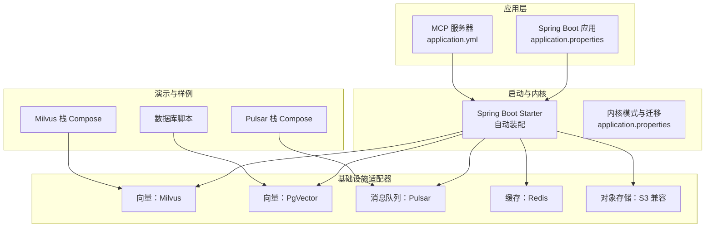
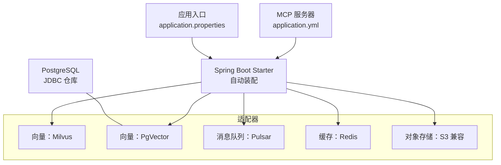
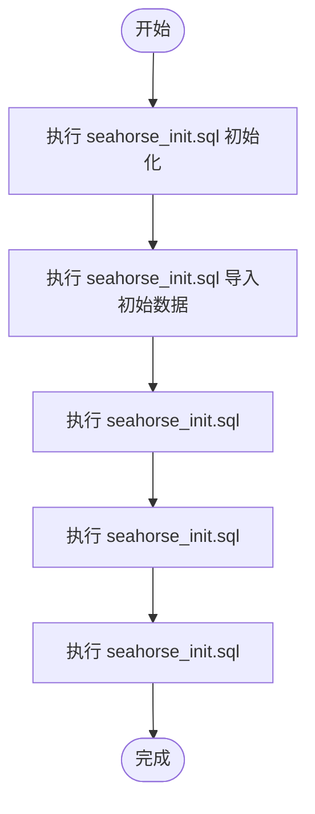
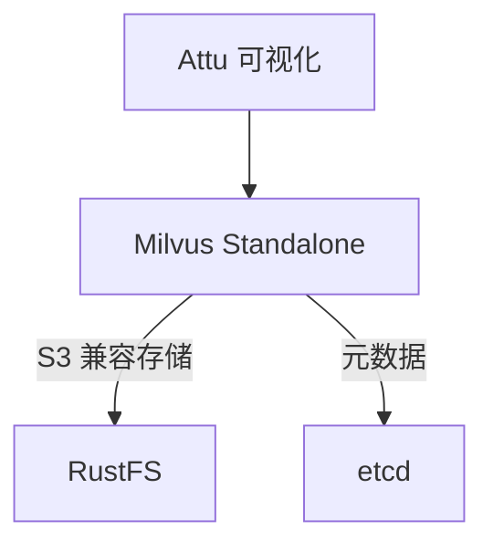
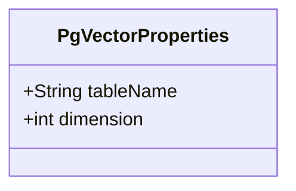
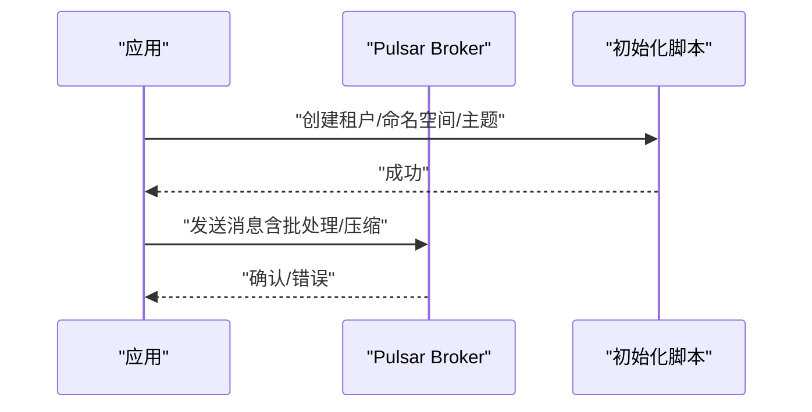
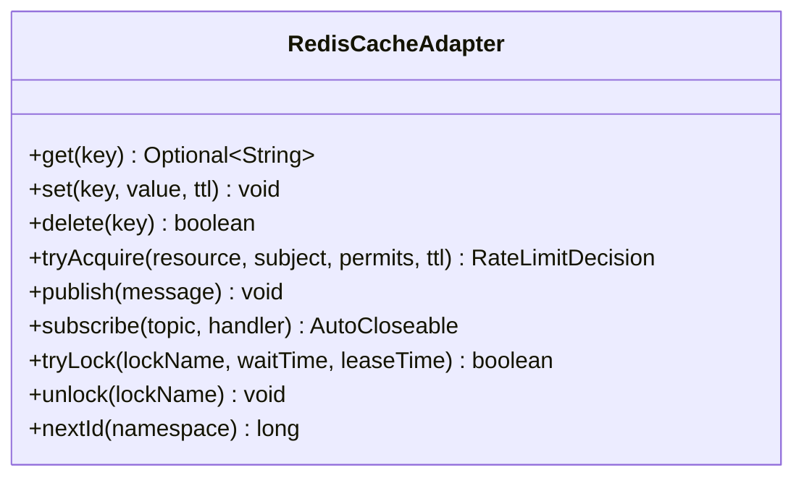
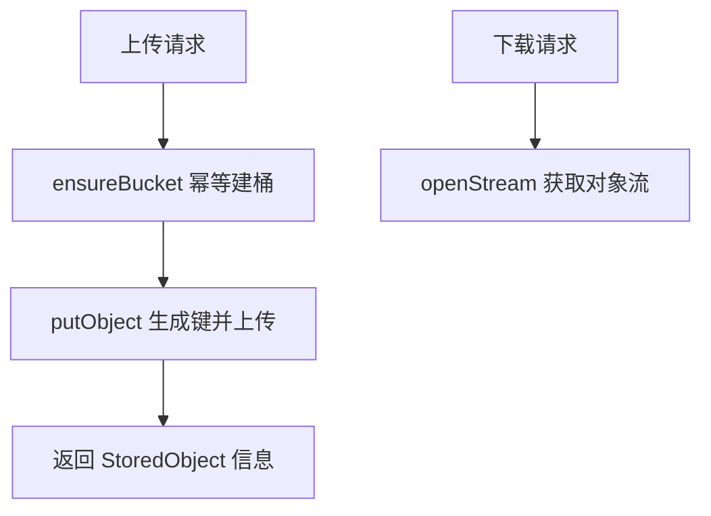
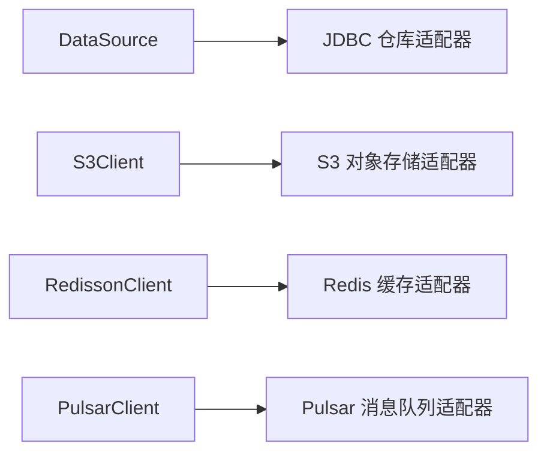

# 基础设施配置

<cite>
**本文引用的文件**   
- [application.properties](file://seahorse-agent-bootstrap/src/main/resources/application.properties)
- [application.properties](file://seahorse-agent-spring-boot-autoconfigure/src/main/resources/application.properties)
- [application.yml](file://seahorse-agent-mcp-server/src/main/resources/application.yml)
- [docker-compose.full.yml](file://docker-compose.full.yml)
- [docker-compose.yml（轻量部署）](file://docker-compose.yml)
- [docker-compose.yml（轻量部署）](file://docker-compose.yml)
- [docker-compose.full.yml](file://docker-compose.full.yml)
- [MilvusVectorProperties.java](file://seahorse-agent-adapter-vector-milvus/src/main/java/com/miracle/ai/seahorse/agent/adapters/vector/milvus/MilvusVectorProperties.java)
- [PgVectorProperties.java](file://seahorse-agent-adapter-vector-pgvector/src/main/java/com/miracle/ai/seahorse/agent/adapters/vector/pgvector/PgVectorProperties.java)
- [PulsarMessageQueueProperties.java](file://seahorse-agent-adapter-mq-pulsar/src/main/java/com/miracle/ai/seahorse/agent/adapters/mq/pulsar/PulsarMessageQueueProperties.java)
- [RedisCacheAdapter.java](file://seahorse-agent-adapter-cache-redis/src/main/java/com/miracle/ai/seahorse/agent/adapters/cache/redis/RedisCacheAdapter.java)
- [S3ObjectStorageAdapter.java](file://seahorse-agent-adapter-storage-s3/src/main/java/com/miracle/ai/seahorse/agent/adapters/storage/s3/S3ObjectStorageAdapter.java)
- [SeahorseAgentNativeAdapterAutoConfiguration.java](file://seahorse-agent-spring-boot-autoconfigure/src/main/java/com/miracle/ai/seahorse/agent/adapters/spring/SeahorseAgentNativeAdapterAutoConfiguration.java)
- [SeahorseChatController.java](file://seahorse-agent-adapter-web/src/main/java/com/miracle/ai/seahorse/agent/adapters/web/SeahorseChatController.java)
- [SeahorseWebGovernanceConfiguration.java](file://seahorse-agent-adapter-web/src/main/java/com/miracle/ai/seahorse/agent/adapters/web/SeahorseWebGovernanceConfiguration.java)
- [seahorse_init.sql](file://resources/database/seahorse_init.sql)
- [seahorse_init.sql](file://resources/database/seahorse_init.sql)
- [seahorse_init.sql](file://resources/database/seahorse_init.sql)
- [seahorse_init.sql](file://resources/database/seahorse_init.sql)
- [seahorse_init.sql](file://resources/database/seahorse_init.sql)
</cite>

## 目录
1. [简介](#简介)
2. [项目结构](#项目结构)
3. [核心组件](#核心组件)
4. [架构总览](#架构总览)
5. [详细组件分析](#详细组件分析)
6. [依赖关系分析](#依赖关系分析)
7. [性能考量](#性能考量)
8. [故障排查指南](#故障排查指南)
9. [结论](#结论)
10. [附录](#附录)

## 简介
本指南面向运维与平台工程团队，提供 Seahorse Agent 在生产环境中的基础设施配置权威参考。内容覆盖数据库（PostgreSQL 连接池与迁移）、向量数据库（Milvus 与 PgVector 的部署与索引）、消息队列（Apache Pulsar 集群与主题分区）、缓存系统（Redis 集群与分布式锁/信号量）、对象存储（S3 兼容）、以及网络与安全（防火墙、证书、域名）。同时给出配置文件模板、环境变量示例与验证方法，帮助快速落地与稳定运行。

## 项目结构
Seahorse Agent 将“基础设施适配器”以模块化方式注入内核，形成可插拔的运行时能力。Spring Boot Starter 负责自动装配与属性绑定；各适配器模块负责对接具体中间件或服务；Docker Compose 提供 Milvus 与 Pulsar 的演示与轻量部署方案；数据库脚本提供初始化与升级路径。

图表来源
- [application.properties:1-4](file://seahorse-agent-bootstrap/src/main/resources/application.properties#L1-L4)
- [application.yml:1-7](file://seahorse-agent-mcp-server/src/main/resources/application.yml#L1-L7)
- [SeahorseAgentNativeAdapterAutoConfiguration.java:160-167](file://seahorse-agent-spring-boot-autoconfigure/src/main/java/com/miracle/ai/seahorse/agent/adapters/spring/SeahorseAgentNativeAdapterAutoConfiguration.java#L160-L167)

章节来源
- [application.properties:1-4](file://seahorse-agent-bootstrap/src/main/resources/application.properties#L1-L4)
- [application.properties:1-2](file://seahorse-agent-spring-boot-autoconfigure/src/main/resources/application.properties#L1-L2)
- [application.yml:1-7](file://seahorse-agent-mcp-server/src/main/resources/application.yml#L1-L7)

## 核心组件
- 数据库（PostgreSQL）
  - 初始化与升级脚本位于 resources/database，包含模式定义、初始数据与版本升级脚本。
  - JDBC 仓库适配器在启动时按条件装配，依赖 DataSource Bean。
- 向量数据库
  - Milvus：通过属性类约束默认集合、维度与度量类型。
  - PgVector：通过属性类约束表名与维度，提供 SPI 映射。
- 消息队列
  - Pulsar：提供发送超时、阻塞策略、批处理与压缩等参数。
- 缓存系统
  - Redis：基于 Redisson 实现键值缓存、发布订阅、分布式锁、限流与自增 ID。
- 对象存储
  - S3 兼容：封装客户端，支持幂等建桶、上传、下载与删除。
- 网络与安全
  - MCP 服务器端口配置；Web 层统一字符集与拦截器；演示栈暴露端口便于联调。

章节来源
- [seahorse_init.sql](file://resources/database/seahorse_init.sql)
- [seahorse_init.sql](file://resources/database/seahorse_init.sql)
- [seahorse_init.sql](file://resources/database/seahorse_init.sql)
- [seahorse_init.sql](file://resources/database/seahorse_init.sql)
- [seahorse_init.sql](file://resources/database/seahorse_init.sql)
- [MilvusVectorProperties.java:29-38](file://seahorse-agent-adapter-vector-milvus/src/main/java/com/miracle/ai/seahorse/agent/adapters/vector/milvus/MilvusVectorProperties.java#L29-L38)
- [PgVectorProperties.java:28-38](file://seahorse-agent-adapter-vector-pgvector/src/main/java/com/miracle/ai/seahorse/agent/adapters/vector/pgvector/PgVectorProperties.java#L28-L38)
- [PulsarMessageQueueProperties.java:25-90](file://seahorse-agent-adapter-mq-pulsar/src/main/java/com/miracle/ai/seahorse/agent/adapters/mq/pulsar/PulsarMessageQueueProperties.java#L25-L90)
- [RedisCacheAdapter.java:48-194](file://seahorse-agent-adapter-cache-redis/src/main/java/com/miracle/ai/seahorse/agent/adapters/cache/redis/RedisCacheAdapter.java#L48-L194)
- [S3ObjectStorageAdapter.java:37-124](file://seahorse-agent-adapter-storage-s3/src/main/java/com/miracle/ai/seahorse/agent/adapters/storage/s3/S3ObjectStorageAdapter.java#L37-L124)
- [SeahorseAgentNativeAdapterAutoConfiguration.java:160-167](file://seahorse-agent-spring-boot-autoconfigure/src/main/java/com/miracle/ai/seahorse/agent/adapters/spring/SeahorseAgentNativeAdapterAutoConfiguration.java#L160-L167)

## 架构总览
下图展示应用如何通过 Spring Boot Starter 自动装配基础设施适配器，并与数据库、向量库、消息队列、缓存与对象存储交互。

图表来源
- [application.properties:1-4](file://seahorse-agent-bootstrap/src/main/resources/application.properties#L1-L4)
- [application.yml:1-7](file://seahorse-agent-mcp-server/src/main/resources/application.yml#L1-L7)
- [SeahorseAgentNativeAdapterAutoConfiguration.java:160-167](file://seahorse-agent-spring-boot-autoconfigure/src/main/java/com/miracle/ai/seahorse/agent/adapters/spring/SeahorseAgentNativeAdapterAutoConfiguration.java#L160-L167)

## 详细组件分析

### 数据库配置（PostgreSQL）
- 初始化与迁移
  - 使用 seahorse_init.sql 创建基础表结构；seahorse_init.sql 插入初始数据；升级脚本按版本顺序执行。
  - JDBC 仓库适配器在存在 DataSource 且未显式声明对应 Port Bean 时自动装配，确保内核功能可用。
- 连接池与事务
  - 连接池与事务管理通常由应用容器与驱动配置提供，建议结合 Spring Boot 的数据源属性进行统一管理（如 hikari、druid 等）。
- 索引优化
  - 建议围绕高频查询字段建立合适索引；对向量检索相关表，优先保证主键与时间戳索引完善。
- 备份策略
  - 建议采用逻辑备份（如 pg_dump）与物理备份相结合的方式，定期校验恢复流程。

图表来源
- [seahorse_init.sql](file://resources/database/seahorse_init.sql)
- [seahorse_init.sql](file://resources/database/seahorse_init.sql)
- [seahorse_init.sql](file://resources/database/seahorse_init.sql)
- [seahorse_init.sql](file://resources/database/seahorse_init.sql)
- [seahorse_init.sql](file://resources/database/seahorse_init.sql)

章节来源
- [SeahorseAgentNativeAdapterAutoConfiguration.java:386-408](file://seahorse-agent-spring-boot-autoconfigure/src/main/java/com/miracle/ai/seahorse/agent/adapters/spring/SeahorseAgentNativeAdapterAutoConfiguration.java#L386-L408)

### 向量数据库配置（Milvus）
- 部署与对象存储集成
  - 示例 Compose 将 Milvus 与 RustFS（S3 兼容）结合，通过环境变量配置 S3 地址与凭据。
  - Milvus 依赖 etcd 作为元数据存储，健康检查端点用于容器编排。
- 分片与副本
  - 在单机演示场景中使用 standalone 模式；生产建议使用分布式模式并结合 etcd 集群与对象存储高可用。
- 索引类型与查询优化
  - 通过属性类约束维度与度量类型；索引参数需结合向量维度与业务相似度计算策略调整。
- 可视化与调试
  - Attu 提供图形化界面，便于查看集合状态与数据分布。

图表来源
- [docker-compose.full.yml](file://docker-compose.full.yml)
- [docker-compose.full.yml](file://docker-compose.full.yml)

章节来源
- [docker-compose.full.yml](file://docker-compose.full.yml)
- [docker-compose.yml（轻量部署）](file://docker-compose.yml)
- [docker-compose.yml（轻量部署）](file://docker-compose.yml)
- [MilvusVectorProperties.java:29-38](file://seahorse-agent-adapter-vector-milvus/src/main/java/com/miracle/ai/seahorse/agent/adapters/vector/milvus/MilvusVectorProperties.java#L29-L38)

### 向量数据库配置（PgVector）
- 表结构与维度
  - 属性类约束表名与维度，表名需符合标识符规范；默认表名为知识向量表。
- 管理与索引
  - 通过 SPI 映射默认为 pgvector，适配器内部对表名进行合法性校验。
- 性能建议
  - 结合业务维度选择合适的索引策略（如 ivfflat、hnsw），并配合向量扩展与索引参数调优。

图表来源
- [PgVectorProperties.java:28-38](file://seahorse-agent-adapter-vector-pgvector/src/main/java/com/miracle/ai/seahorse/agent/adapters/vector/pgvector/PgVectorProperties.java#L28-L38)

章节来源
- [PgVectorProperties.java:28-38](file://seahorse-agent-adapter-vector-pgvector/src/main/java/com/miracle/ai/seahorse/agent/adapters/vector/pgvector/PgVectorProperties.java#L28-L38)
- [PgVectorAdapter.java:316-330](file://seahorse-agent-adapter-vector-pgvector/src/main/java/com/miracle/ai/seahorse/agent/adapters/vector/pgvector/PgVectorAdapter.java#L316-L330)

### 消息队列配置（Apache Pulsar）
- 集群组件
  - ZooKeeper、Bookie、Broker 组成单机演示集群；Broker 暴露管理与服务端口。
- 主题与分区
  - 示例脚本创建分区主题，便于水平扩展与吞吐提升。
- 发送与批处理
  - 支持发送超时、阻塞策略、批处理大小与延迟、压缩类型等参数，建议根据消息体大小与实时性需求调优。

图表来源
- [docker-compose.full.yml](file://docker-compose.full.yml)
- [PulsarMessageQueueProperties.java:25-90](file://seahorse-agent-adapter-mq-pulsar/src/main/java/com/miracle/ai/seahorse/agent/adapters/mq/pulsar/PulsarMessageQueueProperties.java#L25-L90)

章节来源
- [docker-compose.full.yml](file://docker-compose.full.yml)
- [PulsarMessageQueueProperties.java:25-90](file://seahorse-agent-adapter-mq-pulsar/src/main/java/com/miracle/ai/seahorse/agent/adapters/mq/pulsar/PulsarMessageQueueProperties.java#L25-L90)

### 缓存系统配置（Redis）
- 功能覆盖
  - 键值缓存、发布订阅、分布式锁、限流与自增 ID；键前缀统一，避免冲突。
- 分布式锁与信号量
  - 基于 Redisson 的公平锁与原子计数器实现；注意等待时长与租期设置。
- 限流策略
  - 基于原子计数器的令牌桶思想，支持按资源与主体维度限流。

图表来源
- [RedisCacheAdapter.java:48-194](file://seahorse-agent-adapter-cache-redis/src/main/java/com/miracle/ai/seahorse/agent/adapters/cache/redis/RedisCacheAdapter.java#L48-L194)

章节来源
- [RedisCacheAdapter.java:48-194](file://seahorse-agent-adapter-cache-redis/src/main/java/com/miracle/ai/seahorse/agent/adapters/cache/redis/RedisCacheAdapter.java#L48-L194)

### 对象存储配置（S3 兼容）
- 幂等建桶
  - 支持已归属当前账户的桶幂等创建；其他异常需人工介入。
- 上传与下载
  - 自动生成对象键，支持可靠上传；URL 解析与内容类型推断。
- 访问控制
  - 建议在底层 S3 服务端设置桶策略与 IAM 角色，限制访问范围与加密要求。

图表来源
- [S3ObjectStorageAdapter.java:47-102](file://seahorse-agent-adapter-storage-s3/src/main/java/com/miracle/ai/seahorse/agent/adapters/storage/s3/S3ObjectStorageAdapter.java#L47-L102)

章节来源
- [S3ObjectStorageAdapter.java:37-124](file://seahorse-agent-adapter-storage-s3/src/main/java/com/miracle/ai/seahorse/agent/adapters/storage/s3/S3ObjectStorageAdapter.java#L37-L124)

### 网络与安全配置
- 端口与服务
  - MCP 服务器默认端口；Pulsar Broker 暴露管理与服务端口；Milvus 暴露 gRPC 与监控端口。
- 字符集与拦截
  - Web 层统一 UTF-8 字符集；演示模式开关与拦截器可限制写操作。
- 证书与域名
  - 生产建议启用 TLS 与域名解析；反向代理层统一证书管理与路由。

章节来源
- [application.yml:1-7](file://seahorse-agent-mcp-server/src/main/resources/application.yml#L1-L7)
- [SeahorseWebGovernanceConfiguration.java:40-62](file://seahorse-agent-adapter-web/src/main/java/com/miracle/ai/seahorse/agent/adapters/web/SeahorseWebGovernanceConfiguration.java#L40-L62)

## 依赖关系分析
- 自动装配与条件加载
  - 当存在 DataSource 或 S3Client 等 Bean 时，相应适配器才会被装配；未显式声明的 Port Bean 将由原生适配器接管。
- 适配器 SPI 映射
  - PgVector 与 Redis 等适配器通过 SPI 文件声明默认实现与管理标记，便于内核按需选择。

图表来源
- [SeahorseAgentNativeAdapterAutoConfiguration.java:160-167](file://seahorse-agent-spring-boot-autoconfigure/src/main/java/com/miracle/ai/seahorse/agent/adapters/spring/SeahorseAgentNativeAdapterAutoConfiguration.java#L160-L167)

章节来源
- [SeahorseAgentNativeAdapterAutoConfiguration.java:160-167](file://seahorse-agent-spring-boot-autoconfigure/src/main/java/com/miracle/ai/seahorse/agent/adapters/spring/SeahorseAgentNativeAdapterAutoConfiguration.java#L160-L167)

## 性能考量
- 数据库
  - 合理设置连接池大小与空闲回收策略；对高频查询字段建立索引；定期统计信息更新。
- 向量检索
  - Milvus/PgVector 的索引参数需结合数据规模与查询延迟目标反复压测；批量导入与预热有助于降低首次查询延迟。
- 消息队列
  - 批处理窗口与压缩类型影响吞吐与 CPU；分区数量与消费者并发需匹配业务峰值。
- 缓存
  - TTL 策略与键前缀规划减少热点与雪崩；分布式锁租期与重试策略避免死锁。
- 对象存储
  - 分块大小与并发上传结合带宽；签名 URL 与 CDN 加速提升访问性能。

## 故障排查指南
- 数据库
  - 检查初始化与升级脚本是否按顺序执行；核对表结构与索引是否存在。
- 向量库
  - Milvus 健康检查失败时，优先检查 etcd 与对象存储连通性；确认 S3 凭据与网络策略。
- 消息队列
  - Broker 无法启动时，检查 ZooKeeper 与 Bookie 依赖；确认分区主题已创建。
- 缓存
  - 分布式锁无法释放时，检查租期与线程中断；限流拒绝过多时，适当提高配额。
- 对象存储
  - 上传失败时，确认桶策略与 IAM 权限；下载报错时，检查对象键与签名 URL 有效期。

章节来源
- [docker-compose.full.yml](file://docker-compose.full.yml)
- [docker-compose.full.yml](file://docker-compose.full.yml)
- [RedisCacheAdapter.java:89-103](file://seahorse-agent-adapter-cache-redis/src/main/java/com/miracle/ai/seahorse/agent/adapters/cache/redis/RedisCacheAdapter.java#L89-L103)

## 结论
通过模块化的基础设施适配器与演示栈，Seahorse Agent 能够在不同环境中灵活组合数据库、向量库、消息队列、缓存与对象存储。建议在生产环境遵循本文的配置要点与性能建议，结合监控与压测持续优化，确保系统的稳定性与可扩展性。

## 附录

### 配置文件模板与环境变量示例
- 应用基础
  - 应用名称与内核模式：见应用属性文件。
  - MCP 服务器端口：见 MCP 服务器配置。
- 数据库
  - 初始化与升级脚本：见数据库目录。
- 向量库（Milvus）
  - S3 地址与凭据、etcd 端点、容器端口映射：见 Milvus Compose。
- 向量库（PgVector）
  - 表名与维度：见属性类。
- 消息队列（Pulsar）
  - Broker 端口、分区主题：见 Pulsar Compose。
- 缓存（Redis）
  - 键前缀、锁与限流参数：见适配器实现。
- 对象存储（S3 兼容）
  - 客户端与桶策略：见适配器实现。

章节来源
- [application.properties:1-4](file://seahorse-agent-bootstrap/src/main/resources/application.properties#L1-L4)
- [application.properties:1-2](file://seahorse-agent-spring-boot-autoconfigure/src/main/resources/application.properties#L1-L2)
- [application.yml:1-7](file://seahorse-agent-mcp-server/src/main/resources/application.yml#L1-L7)
- [docker-compose.full.yml](file://docker-compose.full.yml)
- [docker-compose.full.yml](file://docker-compose.full.yml)
- [PgVectorProperties.java:28-38](file://seahorse-agent-adapter-vector-pgvector/src/main/java/com/miracle/ai/seahorse/agent/adapters/vector/pgvector/PgVectorProperties.java#L28-L38)
- [RedisCacheAdapter.java:52-57](file://seahorse-agent-adapter-cache-redis/src/main/java/com/miracle/ai/seahorse/agent/adapters/cache/redis/RedisCacheAdapter.java#L52-L57)
- [S3ObjectStorageAdapter.java:47-57](file://seahorse-agent-adapter-storage-s3/src/main/java/com/miracle/ai/seahorse/agent/adapters/storage/s3/S3ObjectStorageAdapter.java#L47-L57)