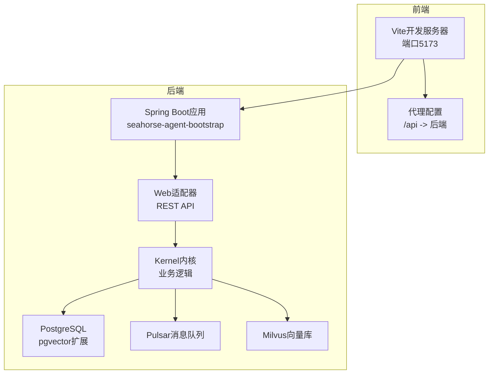
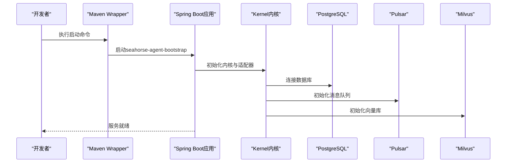
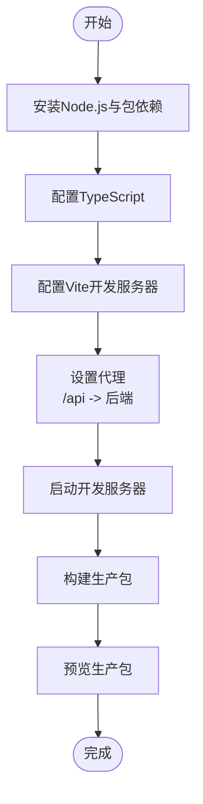
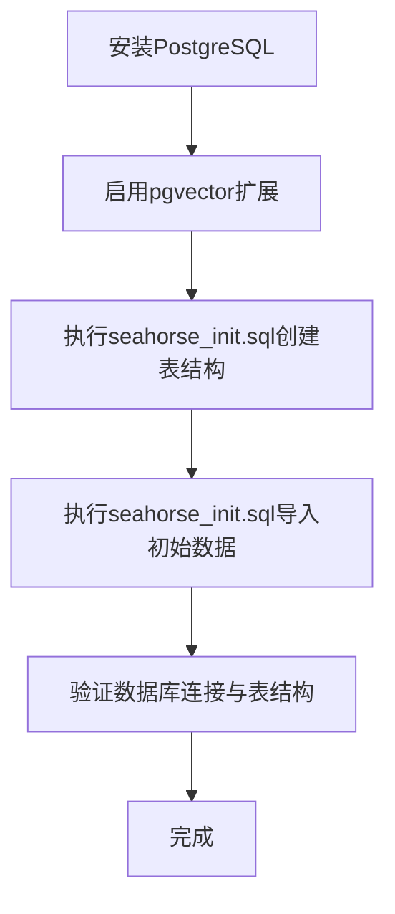
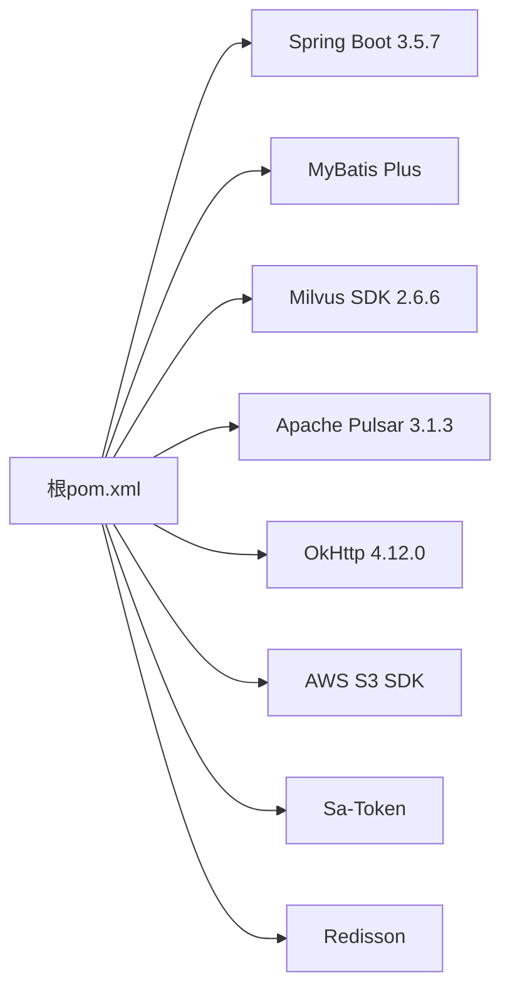

# 开发环境搭建

<cite>
**本文引用的文件**
- [pom.xml](file://pom.xml)
- [mvnw.cmd](file://mvnw.cmd)
- [frontend/package.json](file://frontend/package.json)
- [frontend/vite.config.js](file://frontend/vite.config.js)
- [frontend/tsconfig.json](file://frontend/tsconfig.json)
- [frontend/tailwind.config.cjs](file://frontend/tailwind.config.cjs)
- [frontend/postcss.config.cjs](file://frontend/postcss.config.cjs)
- [frontend/TESTING.md](file://frontend/TESTING.md)
- [docker-compose.full.yml](file://docker-compose.full.yml)
- [docker-compose.full.yml](file://docker-compose.full.yml)
- [resources/database/seahorse_init.sql](file://resources/database/seahorse_init.sql)
- [resources/database/seahorse_init.sql](file://resources/database/seahorse_init.sql)
- [docs/USER_GUIDE.md](file://docs/USER_GUIDE.md)
- [seahorse-agent-bootstrap/src/main/resources/application.properties](file://seahorse-agent-bootstrap/src/main/resources/application.properties)
</cite>

## 目录
1. [简介](#简介)
2. [项目结构](#项目结构)
3. [核心组件](#核心组件)
4. [架构概览](#架构概览)
5. [详细组件分析](#详细组件分析)
6. [依赖分析](#依赖分析)
7. [性能考虑](#性能考虑)
8. [故障排除指南](#故障排除指南)
9. [结论](#结论)
10. [附录](#附录)

## 简介
本指南面向Seahorse Agent项目的本地开发环境搭建，涵盖以下方面：
- 必需软件安装与配置：JDK 17+、Node.js、PostgreSQL、Docker
- Maven项目构建流程：依赖下载、编译打包、测试执行
- 前端开发环境：npm/yarn包管理、TypeScript编译、Vite开发服务器
- 数据库初始化：PostgreSQL安装、数据库创建、表结构与初始数据
- IDE配置建议：IntelliJ IDEA、VS Code的项目导入、插件与调试
- 环境变量设置：数据库连接、第三方服务密钥等
- 常见问题与调试技巧

## 项目结构
该项目采用多模块Maven聚合工程，包含后端核心模块、适配器模块、Web适配器、MCP服务以及前端React应用。根目录的pom.xml定义了Java版本、Spring Boot版本、依赖管理与构建插件；frontend目录包含完整的TypeScript/React前端工程。

```mermaid
graph TB
Root["根项目<br/>Maven聚合工程"] --> Bootstrap["seahorse-agent-bootstrap<br/>可执行启动模块"]
Root --> Kernel["seahorse-agent-kernel<br/>核心业务内核"]
Root --> Web["seahorse-agent-adapter-web<br/>Web适配器"]
Root --> MQDirect["seahorse-agent-adapter-mq-direct<br/>消息队列适配器"]
Root --> MQPulsar["seahorse-agent-adapter-mq-pulsar<br/>Pulsar适配器"]
Root --> Parser["seahorse-agent-adapter-parser-tika<br/>文档解析适配器"]
Root --> Feishu["seahorse-agent-adapter-source-feishu<br/>飞书文档源适配器"]
Root --> OpenAI["seahorse-agent-adapter-ai-openai-compatible<br/>AI模型适配器"]
Root --> MCPHTTP["seahorse-agent-adapter-mcp-http<br/>MCP HTTP适配器"]
Root --> VectorMilvus["seahorse-agent-adapter-vector-milvus<br/>向量库Milvus适配器"]
Root --> VectorPg["seahorse-agent-adapter-vector-pgvector<br/>向量库pgvector适配器"]
Root --> VectorNoop["seahorse-agent-adapter-vector-noop<br/>向量库noop适配器"]
Root --> JDBC["seahorse-agent-adapter-repository-jdbc<br/>JDBC仓储适配器"]
Root --> CacheLocal["seahorse-agent-adapter-cache-local<br/>本地缓存适配器"]
Root --> CacheRedis["seahorse-agent-adapter-cache-redis<br/>Redis缓存适配器"]
Root --> StorageLocal["seahorse-agent-adapter-storage-local<br/>本地存储适配器"]
Root --> StorageS3["seahorse-agent-adapter-storage-s3<br/>S3存储适配器"]
Root --> ObsMicrometer["seahorse-agent-adapter-observation-micrometer<br/>观测Micrometer适配器"]
Root --> ObsNoop["seahorse-agent-adapter-observation-noop<br/>观测noop适配器"]
Root --> Starter["seahorse-agent-spring-boot-starter<br/>Spring Boot Starter"]
Root --> Tests["seahorse-agent-tests<br/>集成测试模块"]
Root --> MCP["seahorse-agent-mcp-server<br/>MCP服务"]
Frontend["frontend<br/>React/Vite前端"] -.-> Web
```

图表来源
- [pom.xml:37-59](file://pom.xml#L37-L59)

章节来源
- [pom.xml:15-35](file://pom.xml#L15-L35)
- [pom.xml:37-59](file://pom.xml#L37-L59)

## 核心组件
- Java与Spring Boot：Java 17、Spring Boot 3.5.7，统一依赖管理与构建插件配置。
- 多模块结构：通过根pom.xml聚合各功能模块，便于独立开发与测试。
- 前端工程：基于Vite + React + TypeScript，TailwindCSS样式框架。
- 数据库：PostgreSQL + pgvector扩展，提供向量检索能力。
- 容器化：Docker Compose用于Milvus与Pulsar的快速部署。

章节来源
- [pom.xml:19](file://pom.xml#L19)
- [pom.xml:20](file://pom.xml#L20)
- [frontend/package.json:13-47](file://frontend/package.json#L13-L47)
- [frontend/tailwind.config.cjs:1-83](file://frontend/tailwind.config.cjs#L1-L83)

## 架构概览
后端采用模块化设计，核心内核(kernel)与外部适配器解耦，通过端口接口实现松耦合。前端通过Vite开发服务器代理到后端API，形成前后端一体化开发体验。

图表来源
- [frontend/vite.config.js:11-21](file://frontend/vite.config.js#L11-L21)
- [docs/USER_GUIDE.md:70-81](file://docs/USER_GUIDE.md#L70-L81)
- [docker-compose.full.yml](file://docker-compose.full.yml)
- [docker-compose.full.yml](file://docker-compose.full.yml)

## 详细组件分析

### 后端构建与运行
- 使用Maven Wrapper脚本启动Spring Boot应用，默认入口为seahorse-agent-bootstrap模块。
- 支持在seahorse-agent-tests与seahorse-agent-bootstrap上执行集成测试。
- 依赖管理集中于根pom.xml，确保版本一致性。

图表来源
- [docs/USER_GUIDE.md:7-9](file://docs/USER_GUIDE.md#L7-L9)
- [seahorse-agent-bootstrap/src/main/resources/application.properties:1-4](file://seahorse-agent-bootstrap/src/main/resources/application.properties#L1-L4)

章节来源
- [docs/USER_GUIDE.md:7-36](file://docs/USER_GUIDE.md#L7-L36)
- [mvnw.cmd:1-190](file://mvnw.cmd#L1-L190)
- [pom.xml:62-165](file://pom.xml#L62-L165)

### 前端开发环境配置
- 包管理：使用npm脚本，支持dev/build/preview/lint/format。
- TypeScript配置：通过tsconfig.json引用app与node配置。
- Vite开发服务器：端口5173，代理/api到后端服务。
- 样式框架：TailwindCSS + PostCSS，提供丰富的UI组件与主题变量。

图表来源
- [frontend/package.json:6-12](file://frontend/package.json#L6-L12)
- [frontend/tsconfig.json:1-8](file://frontend/tsconfig.json#L1-L8)
- [frontend/vite.config.js:11-21](file://frontend/vite.config.js#L11-L21)
- [frontend/tailwind.config.cjs:1-83](file://frontend/tailwind.config.cjs#L1-L83)
- [frontend/postcss.config.cjs:1-7](file://frontend/postcss.config.cjs#L1-L7)

章节来源
- [frontend/package.json:1-70](file://frontend/package.json#L1-L70)
- [frontend/vite.config.js:1-22](file://frontend/vite.config.js#L1-L22)
- [frontend/tsconfig.json:1-8](file://frontend/tsconfig.json#L1-L8)
- [frontend/tailwind.config.cjs:1-83](file://frontend/tailwind.config.cjs#L1-L83)
- [frontend/postcss.config.cjs:1-7](file://frontend/postcss.config.cjs#L1-L7)

### 数据库初始化
- PostgreSQL安装与pgvector扩展启用。
- 执行seahorse_init.sql创建所有表结构。
- 执行seahorse_init.sql插入初始管理员用户数据。
- Docker Compose提供Milvus与Pulsar的快速部署方案。

图表来源
- [resources/database/seahorse_init.sql:1-8](file://resources/database/seahorse_init.sql#L1-L8)
- [resources/database/seahorse_init.sql:1-5](file://resources/database/seahorse_init.sql#L1-L5)
- [docker-compose.full.yml](file://docker-compose.full.yml)
- [docker-compose.full.yml](file://docker-compose.full.yml)

章节来源
- [resources/database/seahorse_init.sql:1-850](file://resources/database/seahorse_init.sql#L1-L850)
- [resources/database/seahorse_init.sql:1-5](file://resources/database/seahorse_init.sql#L1-L5)
- [docker-compose.full.yml](file://docker-compose.full.yml)
- [docker-compose.full.yml](file://docker-compose.full.yml)

### IDE配置建议
- IntelliJ IDEA
  - 导入根pom.xml为Maven项目
  - 设置JDK 17为项目SDK
  - 启用注解处理器（Lombok）
  - 配置Spring Boot运行配置，指向seahorse-agent-bootstrap
- VS Code
  - 安装推荐插件：ESLint、Prettier、Tailwind CSS IntelliSense
  - 配置TypeScript工作区（tsconfig.json引用）
  - 前端开发使用Vite扩展，后端使用Spring Boot插件

章节来源
- [frontend/tsconfig.json:1-8](file://frontend/tsconfig.json#L1-L8)
- [pom.xml:19](file://pom.xml#L19)

### 环境变量设置
- 数据库连接：JDBC URL、用户名、密码（建议通过application.properties或环境变量注入）
- 第三方服务：OpenAI兼容模型、S3存储、Redis等适配器的连接参数
- 开发模式：seahorse-agent.bootstrap.mode可选kernel等模式

章节来源
- [seahorse-agent-bootstrap/src/main/resources/application.properties:1-4](file://seahorse-agent-bootstrap/src/main/resources/application.properties#L1-L4)

## 依赖分析
根pom.xml集中管理Spring Boot、MyBatis Plus、Milvus、Pulsar、OkHttp等依赖版本，确保模块间的一致性与兼容性。

图表来源
- [pom.xml:62-165](file://pom.xml#L62-L165)

章节来源
- [pom.xml:62-165](file://pom.xml#L62-L165)

## 性能考虑
- 使用Maven Wrapper确保团队成员使用一致的构建工具版本。
- Spotless插件统一代码风格，减少格式化差异导致的冲突。
- 单元测试与集成测试分离，通过Surefire插件排除集成测试组，提升开发效率。

章节来源
- [pom.xml:238-258](file://pom.xml#L238-L258)

## 故障排除指南
- 前端代理问题
  - 症状：浏览器提示"No static resource"或404
  - 排查：确认Vite代理配置正确，重启开发服务器
  - 参考：frontend/TESTING.md中的代理配置与测试步骤
- 端口占用
  - 症状：Vite无法绑定端口
  - 排查：确认5173端口未被占用，或等待Vite自动切换到5174/5175
- 后端API返回401
  - 症状：未登录或登录过期
  - 排查：先登录获取token，再进行受保护的API调用
- 数据库连接失败
  - 症状：应用启动时报数据库连接错误
  - 排查：确认PostgreSQL服务运行、pgvector扩展已启用、连接参数正确

章节来源
- [frontend/TESTING.md:3-112](file://frontend/TESTING.md#L3-L112)
- [frontend/vite.config.js:11-21](file://frontend/vite.config.js#L11-L21)

## 结论
通过本指南，您可以完成Seahorse Agent的本地开发环境搭建，包括后端Maven工程构建、前端Vite开发环境、数据库初始化与容器化依赖服务。建议在开发过程中遵循统一的代码风格与测试策略，利用IDE插件提升开发效率，并通过Docker Compose快速部署Milvus与Pulsar以满足向量检索与消息队列需求。

## 附录
- 快速启动命令参考：docs/USER_GUIDE.md
- 前端测试指南：frontend/TESTING.md
- Docker Compose配置：resources/docker/*.compose.yaml
- 数据库脚本：resources/database/*.sql