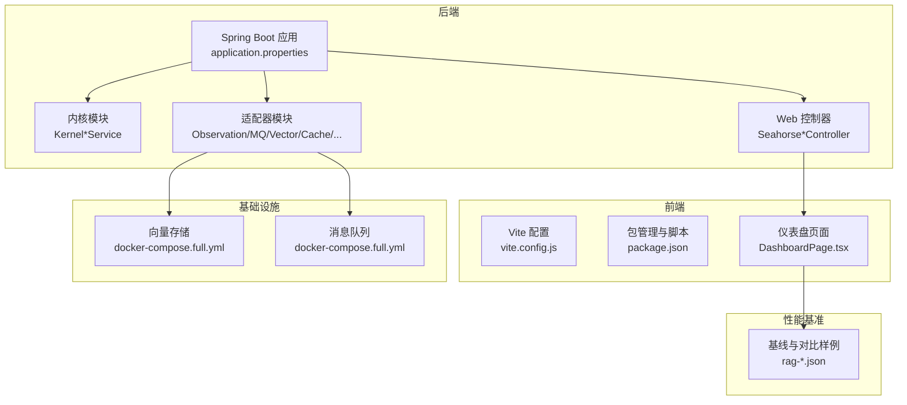
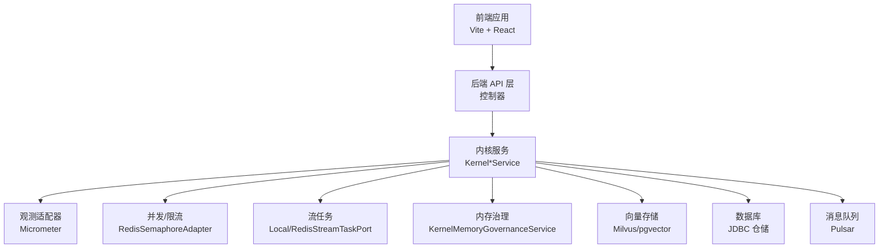
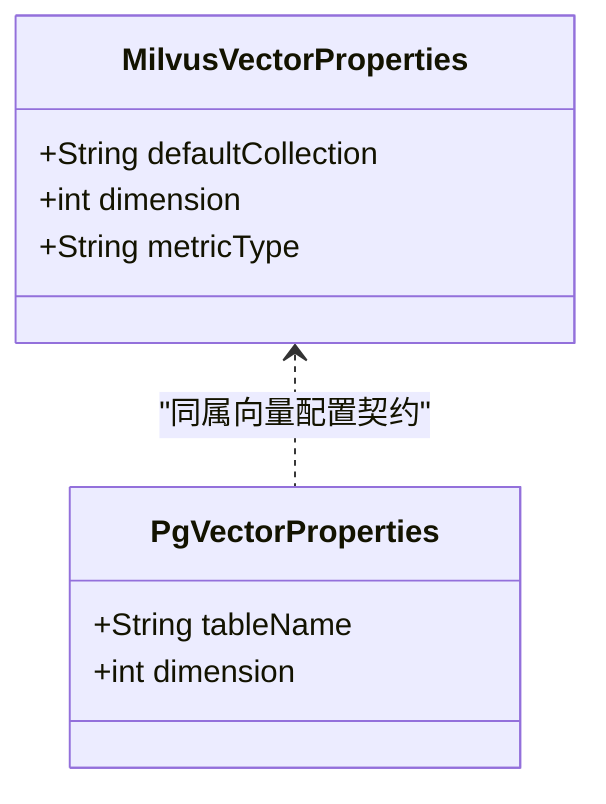
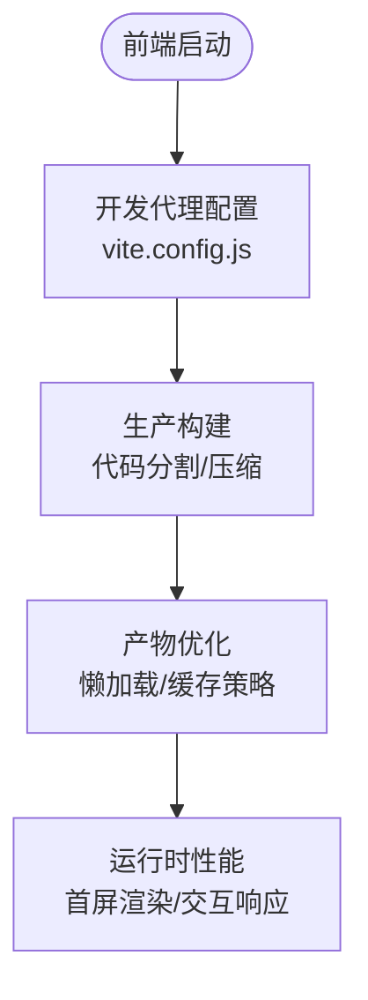
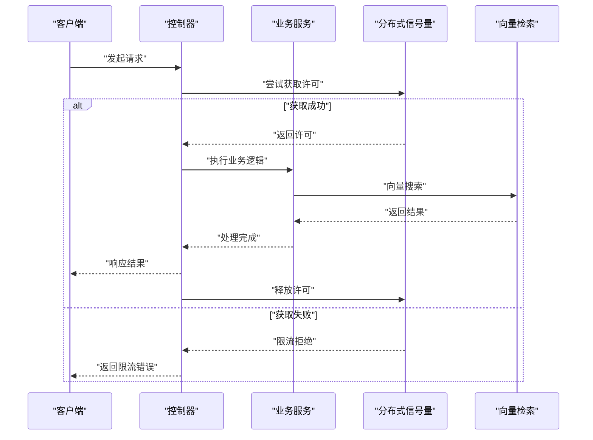
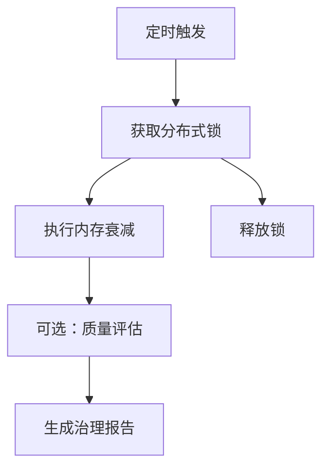
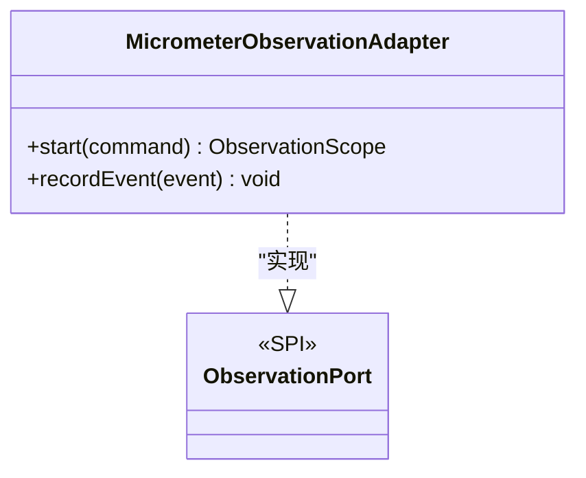
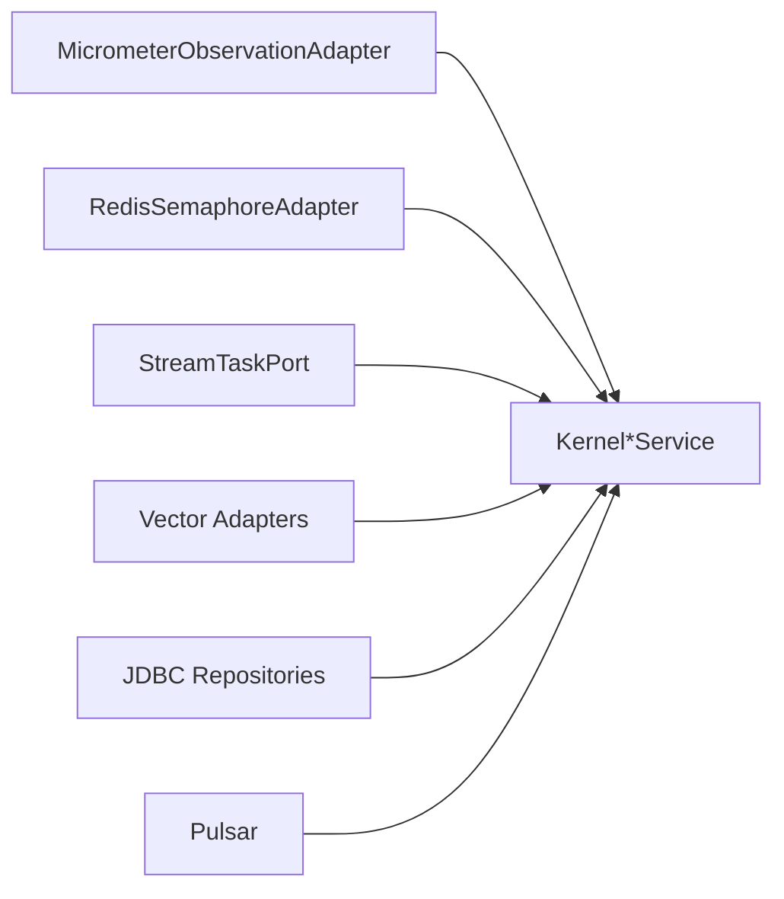

# 性能调优配置

<cite>
**本文引用的文件**
- [application.properties](file://seahorse-agent-bootstrap/src/main/resources/application.properties)
- [vite.config.js](file://frontend/vite.config.js)
- [package.json](file://frontend/package.json)
- [MicrometerObservationAdapter.java](file://seahorse-agent-adapter-observation-micrometer/src/main/java/com/miracle/ai/seahorse/agent/adapters/observation/micrometer/MicrometerObservationAdapter.java)
- [com.miracle.ai.seahorse.agent.ports.outbound.observation.ObservationPort](file://seahorse-agent-adapter-observation-micrometer/src/main/resources/META-INF/seahorse-agent/com.miracle.ai.seahorse.agent.ports.outbound.observation.ObservationPort)
- [MilvusVectorProperties.java](file://seahorse-agent-adapter-vector-milvus/src/main/java/com/miracle/ai/seahorse/agent/adapters/vector/milvus/MilvusVectorProperties.java)
- [PgVectorProperties.java](file://seahorse-agent-adapter-vector-pgvector/src/main/java/com/miracle/ai/seahorse/agent/adapters/vector/pgvector/PgVectorProperties.java)
- [McpHttpAdapterProperties.java](file://seahorse-agent-adapter-mcp-http/src/main/java/com/miracle/ai/seahorse/agent/adapters/mcp/http/McpHttpAdapterProperties.java)
- [SeahorseMemoryGovernanceJob.java](file://seahorse-agent-spring-boot-autoconfigure/src/main/java/com/miracle/ai/seahorse/agent/adapters/spring/SeahorseMemoryGovernanceJob.java)
- [KernelMemoryGovernanceService.java](file://seahorse-agent-kernel/src/main/java/com/miracle/ai/seahorse/agent/kernel/application/memory/KernelMemoryGovernanceService.java)
- [RedisSemaphoreAdapter.java](file://seahorse-agent-adapter-cache-redis/src/main/java/com/miracle/ai/seahorse/agent/adapters/cache/redis/RedisSemaphoreAdapter.java)
- [LocalStreamTaskPort.java](file://seahorse-agent-adapter-web/src/main/java/com/miracle/ai/seahorse/agent/adapters/local/LocalStreamTaskPort.java)
- [RedisStreamTaskPort.java](file://seahorse-agent-adapter-cache-redis/src/main/java/com/miracle/ai/seahorse/agent/adapters/cache/redis/RedisStreamTaskPort.java)
- [JdbcDashboardRepositoryAdapter.java](file://seahorse-agent-adapter-repository-jdbc/src/main/java/com/miracle/ai/seahorse/agent/adapters/repository/jdbc/JdbcDashboardRepositoryAdapter.java)
- [DashboardPage.tsx](file://frontend/src/pages/admin/dashboard/DashboardPage.tsx)
- [rag-baseline.json](file://docs/USER_GUIDE.md)
- [current-baseline.md](file://docs/performance/current-baseline.md)
- [docker-compose.full.yml](file://docker-compose.full.yml)
- [docker-compose.full.yml](file://docker-compose.full.yml)
</cite>

## 目录
1. [简介](#简介)
2. [项目结构](#项目结构)
3. [核心组件](#核心组件)
4. [架构总览](#架构总览)
5. [详细组件分析](#详细组件分析)
6. [依赖分析](#依赖分析)
7. [性能考虑](#性能考虑)
8. [故障排查指南](#故障排查指南)
9. [结论](#结论)
10. [附录](#附录)

## 简介
本指南面向 Seahorse Agent 的性能调优实践，覆盖后端 JVM 参数、数据库与向量存储优化、前端构建与运行时优化、并发与限流、观测与监控、以及性能测试与瓶颈分析方法。文档以仓库中现有实现为依据，结合可配置项与可观测性能力，给出可落地的调优建议与最佳实践。

## 项目结构
Seahorse Agent 采用多模块分层设计：后端 Spring Boot 应用通过启动器装配内核与适配器；前端基于 Vite 构建；性能基准入口位于 `docs/performance/current-baseline.md`，真实结果来自压测导出、追踪与监控；向量存储与消息队列通过 Docker Compose 提供。

图示来源
- [application.properties](file://seahorse-agent-bootstrap/src/main/resources/application.properties)
- [vite.config.js](file://frontend/vite.config.js)
- [docker-compose.full.yml](file://docker-compose.full.yml)
- [docker-compose.full.yml](file://docker-compose.full.yml)
- [rag-baseline.json](file://docs/USER_GUIDE.md)

章节来源
- [application.properties](file://seahorse-agent-bootstrap/src/main/resources/application.properties)
- [vite.config.js](file://frontend/vite.config.js)
- [docker-compose.full.yml](file://docker-compose.full.yml)
- [docker-compose.full.yml](file://docker-compose.full.yml)
- [rag-baseline.json](file://docs/USER_GUIDE.md)

## 核心组件
- 观测与指标：Micrometer 适配器负责记录命令与事件指标，支持标签化统计与采样计时。
- 并发与限流：分布式信号量与流任务协调，支持本地与 Redis 实现，保障跨节点一致性。
- 内存治理：定时清理与质量评估，降低长短期记忆膨胀带来的性能风险。
- 向量存储：Milvus 与 pgvector 属性配置，决定集合/表名、维度与度量类型。
- 前端构建：Vite 默认配置，开发代理与别名路径，便于联调与热更新。
- 性能基准：提供场景化指标样例，用于回归与对比分析。

章节来源
- [MicrometerObservationAdapter.java](file://seahorse-agent-adapter-observation-micrometer/src/main/java/com/miracle/ai/seahorse/agent/adapters/observation/micrometer/MicrometerObservationAdapter.java)
- [com.miracle.ai.seahorse.agent.ports.outbound.observation.ObservationPort](file://seahorse-agent-adapter-observation-micrometer/src/main/resources/META-INF/seahorse-agent/com.miracle.ai.seahorse.agent.ports.outbound.observation.ObservationPort)
- [RedisSemaphoreAdapter.java](file://seahorse-agent-adapter-cache-redis/src/main/java/com/miracle/ai/seahorse/agent/adapters/cache/redis/RedisSemaphoreAdapter.java)
- [LocalStreamTaskPort.java](file://seahorse-agent-adapter-web/src/main/java/com/miracle/ai/seahorse/agent/adapters/local/LocalStreamTaskPort.java)
- [RedisStreamTaskPort.java](file://seahorse-agent-adapter-cache-redis/src/main/java/com/miracle/ai/seahorse/agent/adapters/cache/redis/RedisStreamTaskPort.java)
- [KernelMemoryGovernanceService.java](file://seahorse-agent-kernel/src/main/java/com/miracle/ai/seahorse/agent/kernel/application/memory/KernelMemoryGovernanceService.java)
- [SeahorseMemoryGovernanceJob.java](file://seahorse-agent-spring-boot-autoconfigure/src/main/java/com/miracle/ai/seahorse/agent/adapters/spring/SeahorseMemoryGovernanceJob.java)
- [MilvusVectorProperties.java](file://seahorse-agent-adapter-vector-milvus/src/main/java/com/miracle/ai/seahorse/agent/adapters/vector/milvus/MilvusVectorProperties.java)
- [PgVectorProperties.java](file://seahorse-agent-adapter-vector-pgvector/src/main/java/com/miracle/ai/seahorse/agent/adapters/vector/pgvector/PgVectorProperties.java)
- [vite.config.js](file://frontend/vite.config.js)
- [package.json](file://frontend/package.json)
- [rag-baseline.json](file://docs/USER_GUIDE.md)

## 架构总览
后端通过适配器模式接入多种外部系统（向量、缓存、MQ、观测），前端通过 Vite 构建并与后端 API 通信。性能调优围绕“观测—限流—缓存—向量—数据库—前端构建”全链路展开。

图示来源
- [MicrometerObservationAdapter.java](file://seahorse-agent-adapter-observation-micrometer/src/main/java/com/miracle/ai/seahorse/agent/adapters/observation/micrometer/MicrometerObservationAdapter.java)
- [RedisSemaphoreAdapter.java](file://seahorse-agent-adapter-cache-redis/src/main/java/com/miracle/ai/seahorse/agent/adapters/cache/redis/RedisSemaphoreAdapter.java)
- [LocalStreamTaskPort.java](file://seahorse-agent-adapter-web/src/main/java/com/miracle/ai/seahorse/agent/adapters/local/LocalStreamTaskPort.java)
- [RedisStreamTaskPort.java](file://seahorse-agent-adapter-cache-redis/src/main/java/com/miracle/ai/seahorse/agent/adapters/cache/redis/RedisStreamTaskPort.java)
- [KernelMemoryGovernanceService.java](file://seahorse-agent-kernel/src/main/java/com/miracle/ai/seahorse/agent/kernel/application/memory/KernelMemoryGovernanceService.java)
- [MilvusVectorProperties.java](file://seahorse-agent-adapter-vector-milvus/src/main/java/com/miracle/ai/seahorse/agent/adapters/vector/milvus/MilvusVectorProperties.java)
- [PgVectorProperties.java](file://seahorse-agent-adapter-vector-pgvector/src/main/java/com/miracle/ai/seahorse/agent/adapters/vector/pgvector/PgVectorProperties.java)
- [JdbcDashboardRepositoryAdapter.java](file://seahorse-agent-adapter-repository-jdbc/src/main/java/com/miracle/ai/seahorse/agent/adapters/repository/jdbc/JdbcDashboardRepositoryAdapter.java)
- [docker-compose.full.yml](file://docker-compose.full.yml)

## 详细组件分析

### 后端 JVM 与启动参数优化
- 应用名称与内核启用：通过基础配置启用内核迁移模式，确保后续性能优化在新内核路径上生效。
- JVM 参数建议（通用实践）：
  - 堆内存：根据峰值在线用户数与消息长度估算堆大小，优先采用 G1GC 或 ZGC（取决于 JDK 版本），设置合适的新生代比例与晋升阈值。
  - GC 选择：生产环境推荐 ZGC 或 Shenandoah，以降低停顿；开发/测试可用 G1GC。
  - 元空间：预留足够元空间，避免类加载导致的 Full GC。
  - JIT 与逃逸：开启 TieredCompilation，配合逃逸分析减少对象分配。
  - 安全与合规：禁用不必要服务端口，限制远程调试与 JMX 访问。
- 注意：本仓库未提供显式的 JVM 参数配置文件，建议在容器或 systemd 环境中统一注入。

章节来源
- [application.properties](file://seahorse-agent-bootstrap/src/main/resources/application.properties)

### 数据库性能优化
- 连接池：使用 HikariCP（Spring Boot 默认）时，合理设置最大连接数、空闲超时、连接生命周期与初始化测试。
- 查询超时：对长事务与批量检索设置明确超时，避免阻塞与堆积。
- 索引策略：针对高频查询字段建立复合索引；对时间范围查询使用分区表或范围索引。
- 慢查询日志：开启慢查询阈值与执行计划分析，定期巡检热点 SQL。
- 仓储实现参考：仪表盘仓储中使用 JDBC 模板进行聚合统计，注意避免 N+1 查询与不必要的全表扫描。

章节来源
- [JdbcDashboardRepositoryAdapter.java](file://seahorse-agent-adapter-repository-jdbc/src/main/java/com/miracle/ai/seahorse/agent/adapters/repository/jdbc/JdbcDashboardRepositoryAdapter.java)

### 向量检索性能优化
- 索引类型与度量：Milvus 与 pgvector 均需正确配置集合/表名、维度与度量类型；向量维度越高，索引与检索成本越大。
- 查询批大小与并行度：根据硬件资源与延迟目标调整批大小与并发线程数；对高 QPS 场景建议引入本地缓存与预取。
- 缓存策略：对热门查询结果与嵌入向量进行缓存，结合 TTL 与失效策略；注意缓存一致性与版本控制。
- 向量存储部署：使用官方 Compose 文件快速搭建 Milvus/Pulsar，确保网络与磁盘 I/O 性能满足需求。

图示来源
- [MilvusVectorProperties.java](file://seahorse-agent-adapter-vector-milvus/src/main/java/com/miracle/ai/seahorse/agent/adapters/vector/milvus/MilvusVectorProperties.java)
- [PgVectorProperties.java](file://seahorse-agent-adapter-vector-pgvector/src/main/java/com/miracle/ai/seahorse/agent/adapters/vector/pgvector/PgVectorProperties.java)

章节来源
- [MilvusVectorProperties.java](file://seahorse-agent-adapter-vector-milvus/src/main/java/com/miracle/ai/seahorse/agent/adapters/vector/milvus/MilvusVectorProperties.java)
- [PgVectorProperties.java](file://seahorse-agent-adapter-vector-pgvector/src/main/java/com/miracle/ai/seahorse/agent/adapters/vector/pgvector/PgVectorProperties.java)
- [docker-compose.full.yml](file://docker-compose.full.yml)

### 前端性能优化
- Vite 构建优化：启用压缩与代码分割，按路由与组件拆分包体；生产构建开启最小化与资源内联策略。
- 代码分割与懒加载：对非首屏组件使用动态导入，减少初始包体积；结合路由级懒加载提升首屏速度。
- 静态资源压缩：开启 gzip/br 压缩与 CDN 加速；图片与字体资源按需加载与缓存。
- 开发体验：使用代理将 /api 请求转发至后端，避免跨域与 CORS 复杂配置。

图示来源
- [vite.config.js](file://frontend/vite.config.js)
- [package.json](file://frontend/package.json)

章节来源
- [vite.config.js](file://frontend/vite.config.js)
- [package.json](file://frontend/package.json)

### 后端并发与限流
- 线程池与异步：对 IO 密集型任务（如远程模型调用、向量检索）使用独立线程池，避免阻塞主线程。
- 限流策略：基于分布式信号量控制并发访问，设置合理的许可数与过期时间，防止雪崩。
- 熔断机制：对下游不稳定服务引入短路器，快速失败并降级到本地缓存或默认值。
- 任务编排：流式任务在单机与集群间保持一致的取消与完成语义，确保资源及时释放。

图示来源
- [RedisSemaphoreAdapter.java](file://seahorse-agent-adapter-cache-redis/src/main/java/com/miracle/ai/seahorse/agent/adapters/cache/redis/RedisSemaphoreAdapter.java)
- [LocalStreamTaskPort.java](file://seahorse-agent-adapter-web/src/main/java/com/miracle/ai/seahorse/agent/adapters/local/LocalStreamTaskPort.java)
- [RedisStreamTaskPort.java](file://seahorse-agent-adapter-cache-redis/src/main/java/com/miracle/ai/seahorse/agent/adapters/cache/redis/RedisStreamTaskPort.java)

章节来源
- [RedisSemaphoreAdapter.java](file://seahorse-agent-adapter-cache-redis/src/main/java/com/miracle/ai/seahorse/agent/adapters/cache/redis/RedisSemaphoreAdapter.java)
- [LocalStreamTaskPort.java](file://seahorse-agent-adapter-web/src/main/java/com/miracle/ai/seahorse/agent/adapters/local/LocalStreamTaskPort.java)
- [RedisStreamTaskPort.java](file://seahorse-agent-adapter-cache-redis/src/main/java/com/miracle/ai/seahorse/agent/adapters/cache/redis/RedisStreamTaskPort.java)

### 内存治理与后台任务
- 定时清理：通过调度任务周期性触发内存衰减，避免长期累积导致的性能退化。
- 质量评估：在清理过程中评估记忆质量，识别低价值或重复内容，指导后续优化。
- 锁机制：使用分布式锁保证同一时间仅有一个节点执行清理，避免重复与冲突。

图示来源
- [SeahorseMemoryGovernanceJob.java](file://seahorse-agent-spring-boot-autoconfigure/src/main/java/com/miracle/ai/seahorse/agent/adapters/spring/SeahorseMemoryGovernanceJob.java)
- [KernelMemoryGovernanceService.java](file://seahorse-agent-kernel/src/main/java/com/miracle/ai/seahorse/agent/kernel/application/memory/KernelMemoryGovernanceService.java)

章节来源
- [SeahorseMemoryGovernanceJob.java](file://seahorse-agent-spring-boot-autoconfigure/src/main/java/com/miracle/ai/seahorse/agent/adapters/spring/SeahorseMemoryGovernanceJob.java)
- [KernelMemoryGovernanceService.java](file://seahorse-agent-kernel/src/main/java/com/miracle/ai/seahorse/agent/kernel/application/memory/KernelMemoryGovernanceService.java)

### 监控与指标
- Micrometer 适配器：为命令与事件打点，自动添加标签（如租户、属性），支持计数器与计时器。
- 自定义指标：结合业务关键路径（检索、模型路由、MCP 协调）定义自定义指标，纳入统一采集。
- 基准测试：使用 `docs/performance/current-baseline.md` 登记场景、阈值与真实压测导出，持续回归对比，防止性能回退。

图示来源
- [MicrometerObservationAdapter.java](file://seahorse-agent-adapter-observation-micrometer/src/main/java/com/miracle/ai/seahorse/agent/adapters/observation/micrometer/MicrometerObservationAdapter.java)
- [com.miracle.ai.seahorse.agent.ports.outbound.observation.ObservationPort](file://seahorse-agent-adapter-observation-micrometer/src/main/resources/META-INF/seahorse-agent/com.miracle.ai.seahorse.agent.ports.outbound.observation.ObservationPort)

章节来源
- [MicrometerObservationAdapter.java](file://seahorse-agent-adapter-observation-micrometer/src/main/java/com/miracle/ai/seahorse/agent/adapters/observation/micrometer/MicrometerObservationAdapter.java)
- [com.miracle.ai.seahorse.agent.ports.outbound.observation.ObservationPort](file://seahorse-agent-adapter-observation-micrometer/src/main/resources/META-INF/seahorse-agent/com.miracle.ai.seahorse.agent.ports.outbound.observation.ObservationPort)
- [rag-baseline.json](file://docs/USER_GUIDE.md)

### 远程调用与超时配置
- MCP 远程调用：通过适配器属性设置调用超时，避免下游延迟拖累整体性能。
- 建议：对不同服务设置差异化超时，结合重试与熔断策略，提升鲁棒性。

章节来源
- [McpHttpAdapterProperties.java](file://seahorse-agent-adapter-mcp-http/src/main/java/com/miracle/ai/seahorse/agent/adapters/mcp/http/McpHttpAdapterProperties.java)

### 前端性能监控与洞察
- 仪表盘页面：集成成功率、延迟、错误率与无文档率等关键指标，并提供可视化洞察与改进建议。
- 建议：在生产环境展示实时指标，结合告警阈值触发运维动作。

章节来源
- [DashboardPage.tsx](file://frontend/src/pages/admin/dashboard/DashboardPage.tsx)

## 依赖分析
- 组件耦合：观测适配器作为 SPI 实现被内核服务广泛使用；并发与流任务适配器为跨节点一致性提供基础；向量与数据库适配器分别面向存储层。
- 外部依赖：向量存储与消息队列通过 Compose 部署，建议与应用服务同机房或低延迟网络。

图示来源
- [MicrometerObservationAdapter.java](file://seahorse-agent-adapter-observation-micrometer/src/main/java/com/miracle/ai/seahorse/agent/adapters/observation/micrometer/MicrometerObservationAdapter.java)
- [RedisSemaphoreAdapter.java](file://seahorse-agent-adapter-cache-redis/src/main/java/com/miracle/ai/seahorse/agent/adapters/cache/redis/RedisSemaphoreAdapter.java)
- [LocalStreamTaskPort.java](file://seahorse-agent-adapter-web/src/main/java/com/miracle/ai/seahorse/agent/adapters/local/LocalStreamTaskPort.java)
- [RedisStreamTaskPort.java](file://seahorse-agent-adapter-cache-redis/src/main/java/com/miracle/ai/seahorse/agent/adapters/cache/redis/RedisStreamTaskPort.java)
- [MilvusVectorProperties.java](file://seahorse-agent-adapter-vector-milvus/src/main/java/com/miracle/ai/seahorse/agent/adapters/vector/milvus/MilvusVectorProperties.java)
- [PgVectorProperties.java](file://seahorse-agent-adapter-vector-pgvector/src/main/java/com/miracle/ai/seahorse/agent/adapters/vector/pgvector/PgVectorProperties.java)
- [JdbcDashboardRepositoryAdapter.java](file://seahorse-agent-adapter-repository-jdbc/src/main/java/com/miracle/ai/seahorse/agent/adapters/repository/jdbc/JdbcDashboardRepositoryAdapter.java)
- [docker-compose.full.yml](file://docker-compose.full.yml)

## 性能考虑
- 后端：优先优化慢查询与大对象传输，结合限流与缓存；对模型与检索链路进行分层限流与熔断。
- 数据库：建立合适索引与分区，控制事务粒度与超时；对报表类查询使用只读副本。
- 向量存储：合理设置索引参数与度量类型，控制查询批大小与并行度；对热点集合建立预热与缓存。
- 前端：减少首屏包体、启用懒加载与缓存；对长列表使用虚拟化；优化网络请求合并与去抖。
- 观测：统一指标命名与标签，建立基线与回归测试，持续跟踪关键路径性能。

## 故障排查指南
- 慢查询定位：结合数据库慢日志与 Micrometer 计时器，定位耗时环节；检查索引缺失与锁等待。
- 并发问题：排查信号量许可耗尽与任务堆积，确认 TTL 设置与释放逻辑。
- 向量检索异常：检查集合是否存在、索引是否完成、度量类型是否匹配；观察查询批大小与并行度。
- 前端卡顿：使用浏览器性能面板分析主线程占用与重绘；检查网络请求与资源加载。
- 回归测试：使用压测导出、请求追踪与管理端指标对比 p50/p95/p99，发现异常波动及时告警。

章节来源
- [JdbcDashboardRepositoryAdapter.java](file://seahorse-agent-adapter-repository-jdbc/src/main/java/com/miracle/ai/seahorse/agent/adapters/repository/jdbc/JdbcDashboardRepositoryAdapter.java)
- [rag-baseline.json](file://docs/USER_GUIDE.md)

## 结论
本指南基于仓库现有实现与配置，给出了后端 JVM、数据库、向量检索、前端构建、并发与限流、观测与监控的调优要点，并提供了性能测试与回归对比方法。建议在生产环境中结合实际负载与硬件条件，逐步迭代优化策略，确保系统在高并发与大数据量下的稳定性与低延迟。

## 附录
- 性能基准样例：提供场景化指标与百分位数，便于回归测试与对比分析。
- 基础设施：使用 Compose 快速搭建向量与消息队列，确保与应用服务的网络与性能匹配。

章节来源
- [rag-baseline.json](file://docs/USER_GUIDE.md)
- [current-baseline.md](file://docs/performance/current-baseline.md)
- [docker-compose.full.yml](file://docker-compose.full.yml)
- [docker-compose.full.yml](file://docker-compose.full.yml)