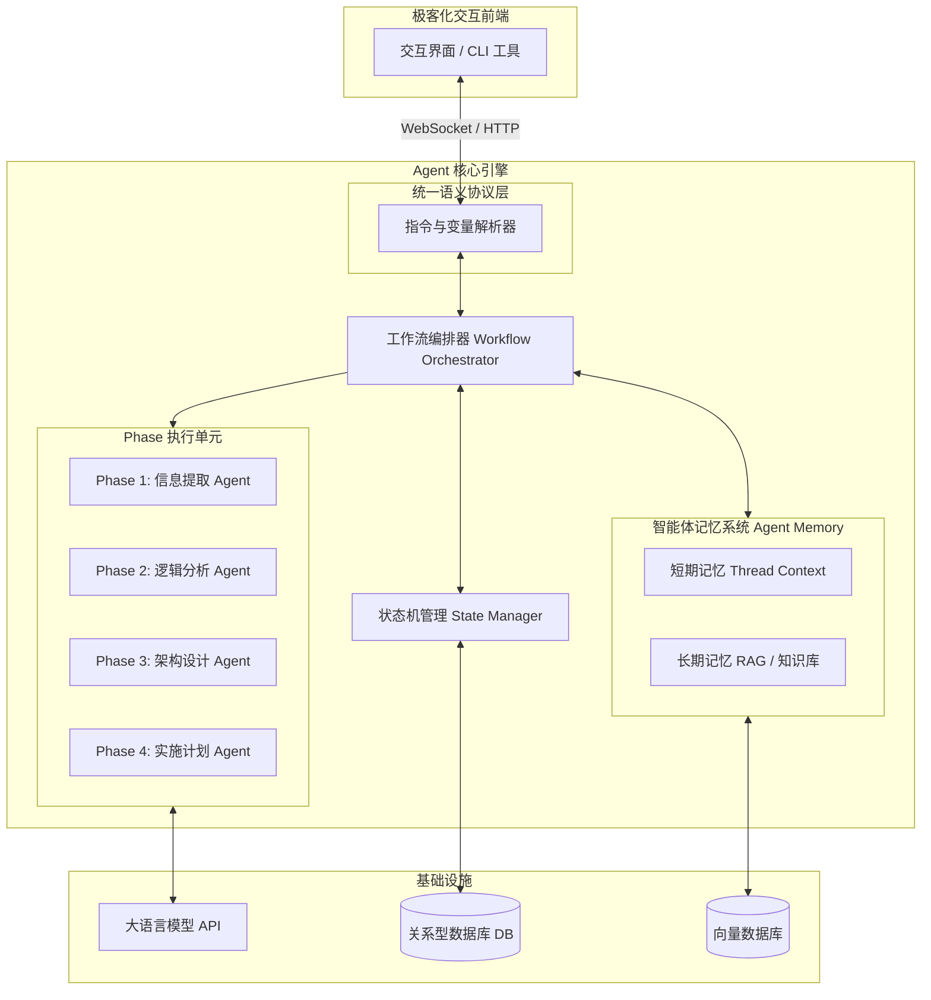

## 需求背景
我现在想创建一个AI代理(Agent)或技能(Skill)，具备以下具体功能：

输入：产品经理提供的原型设计截图（图片格式），该原型图包含需求流程图、业务功能描述以及前端界面样式。

期望输出四个部分：

1. **Mermaid流程图生成**：将原型图中的流程图元素识别并转换为标准的Mermaid语法格式的流程图代码，确保流程逻辑清晰、节点关系准确。(如果原型图有的流程图话)

2. **业务逻辑梳理**：基于步骤1生成的Mermaid流程图和原型图中的业务功能描述，重新梳理并构建完整的业务逻辑体系，形成逻辑严谨、业务流程闭环的详细需求说明文档。文档需要包含业务场景、角色定义、流程节点、决策分支、异常处理等要素。

3. **技术开发方案**：根据步骤2生成的需求文档，提供详细的技术开发方案，至少包括：
   - 数据库表结构设计（包含表名、字段名、数据类型、约束条件、索引设计等）
   - 系统架构设计建议
   - 开发注意事项和技术风险提示
   - 接口设计规范
   - 安全性考虑

4. **开发计划制定**：将步骤3中的开发方案拆解为具体的开发任务计划，要求：
   - 按照功能模块进行任务分解
   - 明确开发优先级和依赖关系
   - 包含测试计划和部署方案
   - 尽可能具体和细致，便于开发团队执行

--- 

#实现方案
 

选择纯代码实现，尤其是在 Java 生态下从零构建，意味着你可以获得对引擎底层流转的绝对控制权。这对于开发高度定制化、需要深度介入业务系统（如自动化文档生成、复杂的 API 编排与协同系统）的 Agent 应用来说，是极其明智的架构路线。

基于 Java 生态，以下是从零构建这个“人机协同需求分析 Agent 引擎”的整体架构设计与实施路径：

### 一、 核心技术选型建议

在 Java 生态中构建 Agent，无需完全从零造轮子，可以依托现有的基础设施，将精力集中在工作流编排和记忆系统设计上。

* **基础服务框架**：Spring Boot 3.x，提供底层的依赖注入与 REST/WebSocket 通信能力。
* **Agent 核心接入层**：**LangChain4j**。它是目前 Java 生态中最成熟的 LLM 抽象层，原生支持 Tool Calling（函数调用）、Memory 管理以及多模型切换，非常适合用来封装 Phase 1-4 的具体执行单元。
* **状态与数据持久化**：使用关系型数据库（完全可以无缝运行在具备高可用特性的 OceanBase 等分布式数据库环境中）来存储工作流的状态流转记录、用户确认日志以及结构化的业务数据。
* **RAG 向量检索（按需）**：如果 Phase 3（技术架构设计）需要参考公司既有的技术规范文档，可以引入轻量级的向量数据库（如 Milvus 或 Qdrant）配合 LangChain4j 的 Embedding 功能。

---

### 二、 核心引擎架构图

对于 4 个 Phase 带有“人工确认”节点的设计，本质上是一个带有挂起（Suspend）和恢复（Resume）机制的有向无环图（DAG）或状态机。



---

### 三、 引擎核心机制的设计与实现

为了支撑 4 个 Phase 的精准运转，引擎底层需要攻克以下三个核心机制：

#### 1. 工作流挂起与恢复机制 (Human-in-the-Loop)

在纯后端实现中，“等待用户确认”不能一直阻塞线程。必须采用异步状态机模型。

* **执行态**：当 Phase 1 Agent 提取完结构化信息后，引擎将生成的 JSON 或 Markdown 数据持久化到数据库的 `execution_record` 表中，并将当前任务的状态标记为 `WAITING_FOR_HUMAN`。
* **恢复态**：前端携带用户的确认/修改指令（Payload）调用恢复接口，引擎唤醒任务，将修改后的变量注入上下文，状态流转至 `PHASE_2_RUNNING`，触发 Phase 2 Agent 的执行。

#### 2. Agent 记忆系统设计 (Agent Memory)

这是防止大模型在超长对话中发生“幻觉”和“遗忘”的关键所在。需要设计分层记忆架构：

* **Thread Memory（会话记忆）**：使用 LangChain4j 的 `ChatMemory` 组件，仅保留**当前 Phase** 的多轮对话，确保分析过程足够专注。
* **State Variables（状态变量）**：每个 Phase 完成并通过人工确认后，引擎需要强制 LLM 输出结构化的结果（例如，Phase 2 结束时输出一份纯 JSON 格式的“角色权限与模块关系表”）。在进入 Phase 3 时，**直接将这些高浓缩的结构化数据作为系统提示词（System Prompt）注入**，而不是把前两个阶段几万字的聊天记录全部丢进去。

#### 3. 统一语义通信协议 (Semantic Communication Protocol)

为了让前端和后端的交互保持极简和高效，建议设计一套统一的 Agent 语义通信协议。

* 不要仅仅传递简单的 String，而是定义标准的 Command 和 Variable 结构。例如：前端在 Phase 1 确认时，传递的是包含增量修改指令的 Payload。
* 这种结构化的通信协议不仅方便目前的 Web 端对接，未来也可以轻松接入终端 CLI 工具（如 Codex CLI 等），保持全栈工具链的纯粹与一致性。

---

### 四、 落地建议

在起步阶段，建议先实现一个“硬编码流转”的核心 Orchestrator，不必一开始就做成完全动态可视化的连线引擎。先用面向对象的方式定义好 `PhaseHandler` 接口，让 P1 到 P4 实现该接口，通过一个总控类去管理 `execute()` 和 `resume()` 的调度。

## 如何接入seahorseAgent中

 🔄 深度推演 1：系统定位与能力契合度（Feasibility & Alignment）
首先要明确，这 4 个 Phase 的本质是结构化数据的逐级降维与文档的自动化生成。

推演：传统的 Agent 往往是一次性生成全部内容，这在复杂系统中会导致灾难性的逻辑断裂。这套方案通过设置 [⚠️ 待确认] 的断点，强行切断了大模型的“幻觉链条”。将其融入你的 Agent 后，Phase 2（业务逻辑）、Phase 3（技术架构）和 Phase 4（排期计划）的产出，实际上就是高度标准化的自动化文档。

结论：这个设计应该作为 seahorse-agent 的核心 Workflow 插件之一（例如命名为 RequirementAnalysisSkill），与底层的文档解析和 RAG 模块强绑定。

🔄 深度推演 2：状态流转与持久化设计（State & Persistence）
为了实现 Human-in-the-Loop 的“挂起（Suspend）”与“恢复（Resume）”，后端不能使用简单的阻塞线程，必须依赖可靠的数据库事务。

推演：当 Phase 1 完成信息提取后，当前任务的状态需要被冻结。考虑到系统底层需要处理高并发和强一致性的状态机流转，可以充分利用 OceanBase 等分布式数据库在事务处理（如跨节点的状态更新与日志记录）上的优势，保障状态机在异常中断时的高可用性。

设计方案：
设计一张核心流转表 seahorse_task_state：

SQL
CREATE TABLE seahorse_task_state (
    task_id VARCHAR(64) PRIMARY KEY,
    current_phase INT COMMENT '当前阶段: 1, 2, 3, 4',
    status VARCHAR(20) COMMENT '状态: RUNNING, WAITING_FOR_HUMAN, COMPLETED',
    phase_1_output JSON COMMENT 'Phase 1 结构化结果',
    phase_2_output JSON COMMENT 'Phase 2 结构化结果',
    ...
);
🔄 深度推演 3：统一通信协议与交互抽象（Semantic Protocol）
为了让引擎能与多端解耦（无论是极客风格的 Web UI，还是类似 Codex CLI 等终端命令行工具），后端的输出绝不能仅仅是 Markdown 纯文本。

推演：如果只是返回大段文本，前端无法精准渲染“确认框”或“修改按钮”。系统需要一套统一智能体语义协议（UASP）来规范 Agent 与 UI/CLI 之间的通信。

设计方案：
在 4 个 Phase 的交互中，严格执行变量与指令协议（VCP）。Agent 每完成一个阶段，向前端下发的 Payload 应当如下：

JSON
    {
      "command": "SUSPEND",
      "phase": 1,
      "renderType": "CONFIRMATION_REQUIRED",
      "variables": {
        "modules": ["用户模块", "订单模块"],
        "logic_gaps": ["未定义退款异常流"],
        "markdown_content": "## Phase 1 报告..."
      }
    }
    ```
    这样前端工具链解析 `variables` 后，可以自行决定是用终端列表展示，还是用 3D 组件渲染。

### 🔄 深度推演 4：上下文隔离与记忆剪枝（Context Isolation）

这是大模型工程中最容易踩坑的地方。如果把 Phase 1 的聊天记录直接喂给 Phase 3 计算，不仅 Token 爆炸，模型还会受到早期模糊草图的严重干扰。
*   **推演**：需要设计“记忆斩断”机制。每个 Phase 结束时，必须要求大模型输出一份极致浓缩的 JSON 状态。
*   **设计方案**：
    进入 Phase 3（架构设计）时，**清空 Thread Memory**，并将 Phase 1 和 Phase 2 的 JSON 产物转化为全新的 System Prompt。
    *前置上下文 = `Phase 1 确认模块.json` + `Phase 2 权限矩阵与业务规则.json`。* 
    以此作为绝对干净的先验知识输入。

### 🔄 深度推演 5：执行单元与 RAG 深度耦合（Execution & RAG）

Phase 3 的技术方案（架构、表结构、接口）如果让 LLM 自由发散，它可能会乱造轮子。
*   **推演**：自动化文档的核心价值在于“符合团队规范”。这里必须接入 Agent 底层的检索增强生成（RAG）能力。
*   **设计方案**：
    在触发 Phase 3 的 LLM 调用前，先执行一次检索钩子（Hook）：
    1. 检索本地向量库中的《团队 Java API 规范》、《微服务分层架构规范》。
    2. 将检索到的本地最佳实践（如：必须使用统一的 `Result<T>` 泛型，必须捕获特定异常）与前两个阶段的业务逻辑一并拼装。
    3. 这样生成的系统架构和 API 文档才能真正符合团队现有的工程体系，实现从需求到代码设计的高效过渡。

### 问题

#### 如何处理前端用户提出“推翻重来”或“跨阶段逆向修改”
> 如果将这套逻辑封装进 `seahorse-agent`，在这个多阶段推进的 DAG（有向无环图）执行引擎中，你计划如何处理前端用户提出“推翻重来”或“跨阶段逆向修改”
推演 1：入口层 —— 引入“意图分类路由” (Intent Router Agent)
痛点：当用户在 Phase 3 输入内容时，系统默认这是对 Phase 3（架构设计）的补充指令。系统怎么知道用户是要“逆向修改”？
推演：不能依赖硬编码的正则匹配（如检测“回到第一步”），因为用户的表达千奇百怪。必须在 Orchestrator（编排器）的最前方，加一个轻量级的路由节点。
具体实现方案：

在用户每次发送消息时，先让一个非常小且快的模型（如 gpt-4o-mini 或 Qwen-Turbo）做一个零样本分类 (Zero-shot Classification)。

Prompt 设计：“用户当前处于 Phase 3（技术架构）。他的最新输入是：{user_input}。请判断他的意图是：A. 继续修改 Phase 3 的技术细节；B. 提出新需求/推翻现有业务模块，这属于 Phase 1/Phase 2 的范畴。只输出 A 或 B。”

路由逻辑：如果是 A，继续走 Phase 3 节点；如果是 B，触发引擎底层的 Rollback（回滚）中断。

🔄 推演 2：存储层 —— Git 风格的快照版本控制 (Snapshot Versioning)
痛点：如果用户改了 Phase 1 之后觉得不满意，想撤销刚才的修改，发现之前的产出已经被数据库 UPDATE 语句覆盖了。
推演：状态表绝对不能用原地更新（In-place Update）。我们需要引入类似于 Git 的 Commit 机制。每通过一个 Phase，就打一个 Snapshot。
具体实现方案：
更改 seahorse_task_state 的表设计，引入版本链。

SQL
CREATE TABLE seahorse_task_snapshot (
    snapshot_id VARCHAR(64) PRIMARY KEY, -- 类似 Git Commit Hash
    task_id VARCHAR(64),                 -- 关联主任务
    phase INT,                           -- 该快照所属的阶段
    parent_snapshot_id VARCHAR(64),      -- 上一个版本的 Hash
    payload JSON,                        -- 该阶段生成的结构化数据
    created_at TIMESTAMP
);
当发生逆向修改时，不是去改旧数据，而是基于当前的 task_id，新建一个 phase=1 的分支快照。这为前端提供了“历史版本回退”的能力。

🔄 推演 3：引擎层 —— 依赖图谱与爆炸半径评估 (Blast Radius Assessment)
痛点：用户在 Phase 1 把“用户名”改成了“账户名”，这个改动很小。如果因此把 Phase 2 和 Phase 3 全部清空重新生成，既浪费 Token，又会丢掉用户之前在 Phase 3 手动确认过的心血。
推演：我们需要区分“破坏性更新”和“非破坏性更新”。
具体实现方案：

引入一个 Diff Analyzer（差异分析器） 工具。当重新生成的 Phase 1 输出后，将其与之前的 Phase 1 JSON 进行对比。

非破坏性（Soft Update）：如果是简单的字段改名、文案修改。引擎直接将新的 JSON 合并进入大上下文，通知后续 Phase 进行局部 Patch（补丁更新），不阻断当前 UI。

破坏性（Hard Cascade）：如果新增了模块、删除了角色。引擎挂起当前任务，触发级联失效（Cascade Invalidation）。将数据库中后续 Phase 的快照标记为 OUTDATED。

🔄 推演 4：记忆层 —— 增量重构机制 (Delta-Prompting)
痛点：即使发生了破坏性更新（例如加了支付模块），我们也不希望 Phase 3 从零开始写接口，而是希望它在“保留原有接口规范的基础上，只追加支付相关的接口”。
推演：大模型拥有极强的“上下文遵循”能力。在重新触发失效的 Phase 3 时，我们将旧版本的输出作为示例锚点喂给它。
具体实现方案：
在重跑 Phase 3 时，动态组装 System Prompt：

"你需要重新设计技术方案。
【当前最新业务上下文】：(注入包含了新支付模块的 Phase 2 JSON)
【历史优质方案参考】：(注入旧版被废弃的 Phase 3 产出)
任务：请严格保持【历史优质方案参考】中的代码风格、表命名规范和既有结构，仅根据【最新业务上下文】将缺失的支付模块无缝融合进去。"
通过这种 Delta-Prompting，你能在“推翻重来”时，最大程度保护沉淀的研发资产不走样。

🔄 推演 5：协议层（前端交互） —— VCP 状态重置指令 (Visual Reset Protocol)
痛点：后端逻辑跑通了，但前端 UI 如果不配合，用户会觉得系统“串台”了——明明在架构设计页面，突然弹出来一个业务确认框。
推演：你的语义通信协议（VCP）必须支持主动的状态树重置，引导前端 UI 完成视觉的“时光倒流”。
具体实现方案：
后端一旦确定需要回滚，下发特殊的 Command：

JSON
{
  "command": "CASCADE_ROLLBACK",
  "target_phase": 1,
  "reason": "检测到您新增了'支付模块'，需要重新确认业务流程",
  "invalidated_phases": [2, 3],
  "variables": {
    "new_phase_1_data": {...}
  }
}
前端收到该协议后，执行动作：

弹窗提示 reason，告知用户系统正在自适应调整。

将界面上的 Phase 2 和 Phase 3 的标签页置灰（打上“已过期/需重新生成”的角标）。

将视图平滑滚动/跳转回 Phase 1，渲染 new_phase_1_data 等待用户重新确认。

总结建议
在 seahorse-agent 中落地这套逻辑，关键在于切断对“聊天记录（History List）”的依赖，转而依赖“状态机与快照数据（State & Snapshot JSON）”。

普通的 Agent 活在“时间线”（Timeline）里，只要回退就会发生记忆撕裂；而你构建的系统应该活在“状态树”（State Tree）里，任何一步的推翻重来，本质上都是在树上开辟了一个新的分支。一旦你用数据库的结构化 JSON 彻底替代了简单的历史对话拼图，这个逆向修改的难题也就迎刃而解了。

#### 其他挑战
挑战一：结构化数据的“上下文爆炸” (Context Explosion)
痛点描述：
我们之前提到用 JSON 状态代替聊天记录。但这会带来新问题：如果一个中型项目在 Phase 3 生成了 30 张表（包含冗长的 DDL）和 50 个 API 接口定义，这个 JSON 体积将非常庞大。
当系统进入 Phase 4（任务排期）时，如果你把这个含有几万字 DDL 的巨大 JSON 塞给 LLM，不仅 Token 成本飙升、响应极慢，而且 LLM 会因为“注意力分散（Attention Dilution）”而在排期上胡言乱语。

架构建议：数据视图切片 (View Slicing)
你的状态机中不仅要保存 Payload，还要为下游引擎提供不同粒度的 视图（View）：

全量视图：只用于最终导出 Markdown 文档或对接外部系统。

摘要视图（针对 Agent 上下文）：进入 Phase 4 时，引擎拦截 DDL，通过代码将其转换为极简的目录树（例如只保留表名、接口路径、核心逻辑字段）。

核心思路：不要把数据原封不动传给下一个节点，根据下一个节点的意图进行“数据降维”。

⚠️ 挑战二：前端渲染的“语法脆弱性” (Syntax Fragility)
痛点描述：
你的方案中重度依赖 Mermaid 画图和复杂的 Markdown 表格。但大模型本质上是概率模型，即使是最强的模型，也经常会在长输出中漏掉一个 }、多写一个 |，或者在 Mermaid 节点名称里包含了导致前端解析器崩溃的特殊字符（如括号未转义）。一旦解析失败，UI 就会白屏或报错。

架构建议：自愈重试环 (Self-Healing Loop)
不要相信大模型一次性输出的代码是完美的。在后端封装一个拦截器：

引擎拿到大模型输出的 Mermaid/JSON 代码块后，先在 Java 后端做正则表达式或 AST 语法树的轻量校验。

如果校验失败（比如 JSON 解析抛出 Exception），系统不要报错给用户。

引擎自动在后台发起一次静默请求（Retry Prompt）：“你刚才生成的 JSON/Mermaid 存在语法错误，具体报错信息为 X，请修复它并只输出修复后的代码。”

最多重试 2 次，如果仍失败，降级为普通文本展示。

⚠️ 挑战三：RAG 检索导致的“架构污染” (Architecture Pollution)
痛点描述：
我们在 Phase 3 提到了引入 RAG 来遵循团队规范。这里的坑是：如果向量数据库命中了一条陈旧的、与当前业务不匹配的“最佳实践”（例如项目需要轻量级方案，但 RAG 检索出了全套 Spring Cloud 微服务规范），LLM 会产生严重的“锚定效应（Anchoring Effect）”，盲目照搬，导致架构设计失控。

架构建议：引入“检索评估节点” (Retrieve & Evaluate)
在使用 RAG 时，将单一的 LLM 调用拆分为两步：

打分器 (Scorer Agent)：先让 LLM 看一眼检索回来的规范和当前 Phase 2 的需求，输出一个相关性评分（0-10）。

生成器 (Generator Agent)：如果评分低于设定阈值，直接丢弃该规范，让 LLM 依赖常识生成；如果高于阈值，再将规范注入 System Prompt 指导架构生成。

⚠️ 挑战四：长耗时任务的“幽灵状态” (Ghost States in Timeout)
痛点描述：
Phase 3 的生成（包含架构、表、API）耗时可能长达 30-60 秒。在 HTTP 协议下，前端很容易因为超时而断开连接（或者用户在此期间刷新了页面）。此时，后端 LLM 还在狂跑，但一旦跑完，状态无法同步给前端，任务变成了“死任务”，也就是幽灵状态。

架构建议：流式聚合与心跳补偿 (Streaming + SSE/WebSocket)

通信层：废弃传统的同步 HTTP 阻塞调用，全面改用 Server-Sent Events (SSE) 或 WebSocket。

双轨输出：LLM 吐出的流式数据（Chunks）分为两条轨：

展示轨：实时推给前端打字机效果，安抚用户情绪。

逻辑轨：后端在内存中将 Chunks 拼装，并在遇到 \n\n 或特定标记时，增量写入数据库。哪怕前端断开，后台状态机依然能把当前阶段推进到 COMPLETED，用户下次刷新页面时依然能看到结果。

#### 如何解决
 
##### 🛠️ 模块一：解决“上下文爆炸” —— 视图切片引擎 (View Slicing Engine)

**目标**：拦截庞大的结构化 JSON 产物，在传递给下游 Agent 前进行“数据降维”。

**开发方案**：

1. **定义多维度 DTO (Data Transfer Objects)**：
不要用一个 `JSONObject` 打天下。针对 Phase 3 的输出，定义全量对象和摘要对象。
2. **开发 `ContextReducer` 组件**：
在状态机流转到 Phase 4 之前，插入一个拦截器。
3. **AST / 杰克逊树解析 (Jackson Tree Parsing)**：
如果 Phase 3 输出的是 DDL（SQL语句），不要直接传给 Phase 4。引入类似于 JSqlParser 的轻量级库，或者使用正则表达式提取“表名”和“表注释”，丢弃具体的字段定义。

**核心伪代码参考**：

```java
@Component
public class ContextReducer {
    
    // 将几万字的完整 Phase3 结果，浓缩为几百字的摘要
    public Phase3Summary extractSummaryForPhase4(Phase3FullResult fullResult) {
        Phase3Summary summary = new Phase3Summary();
        
        // 1. 提取接口目录树（丢弃具体的入参出参字段）
        List<ApiNode> tree = fullResult.getApis().stream()
            .map(api -> new ApiNode(api.getMethod(), api.getPath(), api.getDescription()))
            .collect(Collectors.toList());
        summary.setApiTree(tree);
        
        // 2. 提取数据库表名清单（丢弃 DDL 细节）
        List<String> tableNames = fullResult.getTables().stream()
            .map(Table::getTableName)
            .collect(Collectors.toList());
        summary.setEntityList(tableNames);
        
        return summary;
    }
}

```

 

##### 🛠️ 模块二：解决“语法脆弱性” —— 自愈重试环 (Self-Healing Loop)

**目标**：保障 LLM 输出的 JSON 或 Mermaid 图表 100% 符合语法规范，防止前端白屏。

**开发方案**：

1. **统一出口网关 (Output Gateway)**：
不要让 Agent 直接把字符串返回给前端。所有 Agent 的输出必须经过 `FormatValidator`。
2. **结构化校验逻辑**：
* 对于 JSON：尝试 `ObjectMapper.readTree()`，如果抛出 `JsonProcessingException`，捕获异常信息。
* 对于 Mermaid：检查括号是否闭合 `()` `{}` `[]`，是否有导致解析失败的特殊字符（如未转义的 `"`）。


3. **基于 LangChain4j 的重试机制**：
利用大模型自身的纠错能力，将报错信息反哺给模型。

**核心伪代码参考**：

```java
public String executeWithSelfHealing(String systemPrompt, String userInput) {
    int maxRetries = 2;
    String currentResponse = llmClient.generate(systemPrompt, userInput);
    
    for (int i = 0; i < maxRetries; i++) {
        try {
            // 尝试验证（如果是 JSON 则尝试反序列化）
            FormatValidator.validateJsonOrMermaid(currentResponse);
            return currentResponse; // 验证成功，直接返回
        } catch (ValidationException e) {
            log.warn("格式校验失败，触发自愈重试. Error: {}", e.getMessage());
            // 构造重试 Prompt
            String retryPrompt = String.format(
                "你刚才生成的输出存在语法错误。\n错误信息：%s\n请直接输出修复后的内容，不要包含任何额外的解释文字。", 
                e.getMessage()
            );
            // 携带历史上下文进行重试
            currentResponse = llmClient.generate(retryPrompt, currentResponse);
        }
    }
    throw new RuntimeException("自愈失败，超出最大重试次数");
}

```
 

##### 🛠️ 模块三：解决“架构污染” —— 检索评估器 (RAG Evaluator)

**目标**：防止引入错误的本地规范导致 LLM 发生“锚定效应”。

**开发方案**：

1. **双模型策略**：
使用一个便宜且快速的模型（如 `gpt-4o-mini` 或 `DeepSeek-V2`）做评估员（Evaluator），主模型做生成员（Generator）。
2. **实现 `RetrieveAndEvaluateService**`：
将传统的 RAG 流程（检索 -> 生成）改为（检索 -> 评估 -> 过滤 -> 生成）。
3. **硬性阈值拦截**：
评估模型给出的分数低于 7 分的规范片段，直接丢弃，不放入主 Context 中。

**核心伪代码参考**：

```java
@Service
public class RagEvaluatorService {

    @Autowired
    private EmbeddingStore embeddingStore;
    
    @Autowired
    private ChatLanguageModel evaluatorModel; // 廉价/快速模型

    public String getFilteredContext(String currentPhase2Requirement) {
        // 1. 基础检索
        List<Document> docs = embeddingStore.findRelevant(currentPhase2Requirement, 5);
        StringBuilder filteredContext = new StringBuilder();

        // 2. 逐一评估
        for (Document doc : docs) {
            String evalPrompt = String.format(
                "需求：[%s]\n规范片段：[%s]\n请评估该规范对实现此需求的关联度(1-10分)，仅输出数字。",
                currentPhase2Requirement, doc.getText()
            );
            
            String scoreStr = evaluatorModel.generate(evalPrompt);
            int score = Integer.parseInt(scoreStr.trim());
            
            // 3. 阈值过滤
            if (score >= 7) {
                filteredContext.append(doc.getText()).append("\n");
            }
        }
        return filteredContext.toString();
    }
}

```
 

##### 🛠️ 模块四：解决“幽灵状态” —— SSE 流式双轨引擎 (Dual-Track Streaming)

**目标**：前后端解耦。即使前端断网，后端的 Agent 任务依然能执行完毕并保存状态。

**开发方案**：

1. **Spring Boot `SseEmitter` 封装**：
使用 SSE（Server-Sent Events）代替传统的 HTTP 响应，实现打字机效果。
2. **内存聚合器 (InMemory Aggregator)**：
在后端的 `TokenStream` 回调中，维护一个 `StringBuilder`。
3. **生命周期分离**：
**展示轨**：Token 到达时，通过 `SseEmitter.send()` 推给前端。如果前端断开抛出 `IOException`，捕获异常但不中断 LLM 生成。
**逻辑轨**：在 LangChain4j 的 `onComplete` 钩子中，将 `StringBuilder` 的完整内容保存到数据库的状态快照表中。

**核心伪代码参考**：

```java
@GetMapping(value = "/api/agent/stream", produces = MediaType.TEXT_EVENT_STREAM_VALUE)
public SseEmitter streamAgentExecute(@RequestParam String taskId) {
    SseEmitter emitter = new SseEmitter(0L); // 0表示不超时
    StringBuilder fullContent = new StringBuilder(); // 内存聚合器
    
    // 调用大模型流式接口
    streamingChatLanguageModel.generate(prompt, new StreamingResponseHandler<AiMessage>() {
        @Override
        public void onNext(String token) {
            fullContent.append(token);
            try {
                // 展示轨：推给前端
                emitter.send(SseEmitter.event().data(token)); 
            } catch (IOException e) {
                // 核心：如果前端断开，只记录日志，不中断后台的 fullContent 累加
                log.warn("前端连接已断开，转为后台静默生成");
            }
        }

        @Override
        public void onComplete(Response<AiMessage> response) {
            emitter.complete();
            // 逻辑轨：无论前端是否断开，必须在这里持久化状态
            saveStateToDatabase(taskId, fullContent.toString());
            // 触发状态机进入下一个阶段
            stateMachine.fireEvent(TaskEvent.PHASE_COMPLETED);
        }

        @Override
        public void onError(Throwable error) {
            emitter.completeWithError(error);
            markTaskAsFailed(taskId, error);
        }
    });
    
    return emitter;
}

```
 

##### 🚀 开发优先级与里程碑建议

针对您的 `seahorse-agent`，建议按照以下顺序落地：

* **Phase 1 (本周)**：优先实现**模块四 (SSE 双轨引擎)**。这是基础设施，没有它，长耗时的架构设计极易崩溃，用户体验极差。
* **Phase 2 (下周)**：实现**模块二 (自愈重试环)**。引入 AOP 拦截器，先保证输出的 JSON/Markdown 100% 可解析。
* **Phase 3 (未来演进)**：逐步引入**模块一 (视图切片)** 和 **模块三 (RAG 评估)**。当您发现长上下文导致 Token 成本过高或模型变“笨”时，再引入这两个进阶优化。